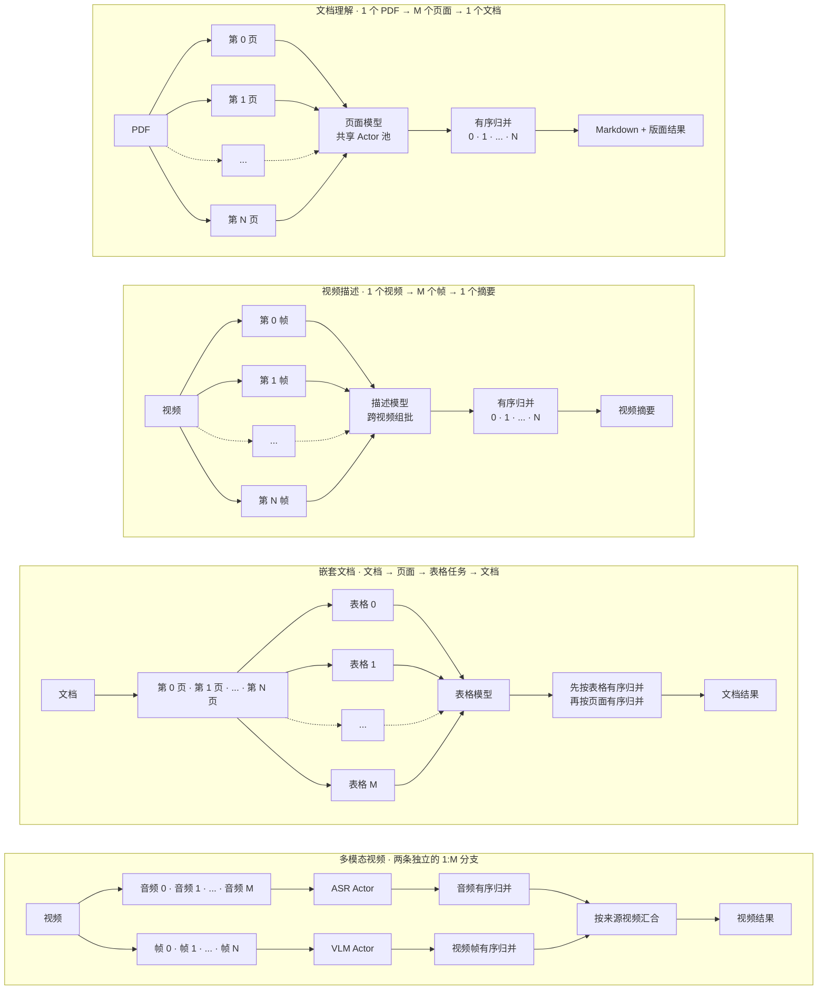
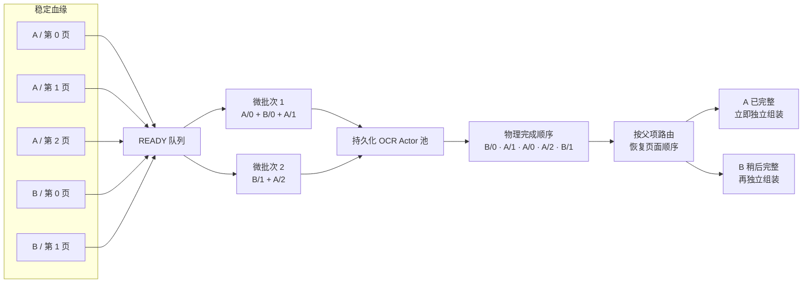
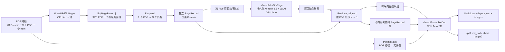

<div align="center">
  

# RayOrch

**数据一旦就绪，立即运行下一阶段。**

基于 Ray、面向多阶段多模型 AI 负载的完成驱动数据流编排框架。

[](https://github.com/OpenDCAI/RayOrch)
[](https://github.com/OpenDCAI/RayOrch/actions/workflows/ci.yml)
[](https://pypi.org/project/rayorch/)
[](https://pypi.org/project/rayorch/)
[](LICENSE)
[](https://opendcai.github.io/RayOrch-doc/en/)
[](https://opendcai.github.io/RayOrch-doc/zh/)
[](https://arxiv.org/abs/2609.18703)

[完整文档](https://opendcai.github.io/RayOrch-doc/zh/) · [快速上手](https://opendcai.github.io/RayOrch-doc/zh/guide/first-pipeline.html) · [Benchmarks](https://opendcai.github.io/RayOrch-doc/zh/benchmarks/) · [API 参考](https://opendcai.github.io/RayOrch-doc/zh/api/)

[English](README.md) | [简体中文](README-zh.md)

</div>

---

## 🔍 1. RayOrch 是什么？

**RayOrch 是一个面向大规模、多模态、模型托管（model-hosted）数据处理的数据流编排框架。** 它提供清晰且精简的编程模型，让用户可以用普通 Python 表达流水线并行和复杂推理 DAG，并将其中异构的计算阶段高效调度到 Ray CPU/GPU 集群上执行。

典型负载包括 PDF 理解、视频处理、多模型视觉和多阶段 LLM 推理，它们通常具有共同的 `1 → M → 1` 结构：一个输入展开为多个可独立执行的子项，模型对不同输入的就绪子项统一组批，最终再按照来源和原始顺序归并回父级结果。



Ray 提供分布式计算基础设施，RayOrch 则在其上提供流水线语义，包括依赖、展开与归并、血缘、就绪判断、持久化模型 Actor 和有序结果重建。


## ✨ 2. 为什么使用 RayOrch？

模型托管的多模态流水线，难点不只是启动若干 Ray Actor，而是让 CPU 预处理与 GPU 推理持续并行，让不同输入中已经就绪的数据共享模型批次，同时在每个输入独立推进时仍然维持正确的归属和顺序。PDF 案例可以直接说明这个问题：



RayOrch 将每个可调度任务表示为业务数据加稳定血缘，在这个案例中就是父 PDF 和页码。调度器持续获取 READY 任务，并把不同 PDF 的页面组成批次送入持久化 Actor；物理执行可以乱序完成，但结果重建会将每个结果路由回父项并恢复逻辑顺序。因此 A 完整后可以立即进入下游组装，而 B 只等待自己的缺失任务，不会阻塞整条流水线。

| 能力 | 具体案例 | RayOrch 的行为 |
| --- | --- | --- |
| 完成驱动调度 | PDF A 比 PDF B 先完成 | A 的页面齐备后立即组装 A |
| 显式展开与归并 | PDF → 页面 → 文档 | 记录子项归属，并按源顺序归并 |
| 跨输入批处理 | 多个 PDF 的页面同时就绪 | 在同一个 OCR Actor 上组批，同时保留血缘 |
| 持久化 Actor 池 | MinerU、YOLO、SAM、vLLM 或 SGLang 加载成本高 | 每个 Actor 中只维护一个持久化 UDF/模型实例 |
| 分阶段资源配置 | 渲染需要 CPU，OCR 需要 GPU | 每个阶段独立配置副本、批大小、CPU、GPU 和自定义资源 |
| 跨环境阶段 | SGLang 与 vLLM 需要不同依赖栈 | 为每个阶段指定 Ray `runtime_env` 或 Conda 环境 |
| 结构化执行结果 | 某些数据被过滤、失败或因上游失败被抑制 | 成功结果仍是普通业务值，非成功结果显式报告 |
| 可复现实验 | 同一负载需要本地运行和 Ray Job 提交 | 复用一份类型化 Benchmark 配置并生成标准报告 |

## 🧠 3. 编程模型

RayOrch 有意保持精简的公开编程模型：

| 对象 | 职责 |
| --- | --- |
| UDF | 对一个批次执行普通 Python 计算的类或函数 |
| `RayModule` | 声明 UDF 构造方式、副本数、批大小、恢复策略和 Ray Actor 选项；同一对象被多次调用时自动复用 Actor |
| `Pipeline` | 连接计算阶段形成静态拓扑，并提供精简的一次性入口 `pipeline.run(...)` |
| `rayorch.F` | 显式声明展开、过滤、广播和归并 |
| `Executor` | 管理持久化 Actor 和执行生命周期 |
| `RunResult` | 返回有序输出以及不可变的耗时、Actor、RPC、Grain 和批处理指标 |

一条最小 Pipeline 就是普通 Python：

```python
import rayorch as ro


class AddOne:
    # UDF 每次接收一个运行时批次，并为每个输入返回一个结果。
    def run(self, values):
        return [value + 1 for value in values]


class MyPipeline(ro.Pipeline):
    def __init__(self):
        # 每个 RayModule 管理一组持久化 Actor；UDF 加载的模型可以跨批次复用。
        self.first = ro.RayModule(AddOne).ray_options(replicas=2, batch_size=8)
        self.second = ro.RayModule(AddOne).ray_options(replicas=2, batch_size=8)

    def forward(self, values):
        # forward() 只声明数据依赖，不会在这里真正执行 UDF。
        return self.second(self.first(values))


pipeline = MyPipeline()
result = pipeline.run(
    [1, 2, 3],
    input_batch_size=2,           # 每个输入批次接纳 2 个源数据。
    max_active_input_batches=2,  # 最多允许 2 个输入批次重叠推进。
)

print(result.outputs)  # [3, 4, 5]
```

可以把它理解为：**编写批处理 UDF → 在 Pipeline 中连接 → 分配资源 → 运行**。`Pipeline.forward()` 只会使用符号值追踪一次以构建静态图，不会真正执行 UDF，也不会在编译时加载模型。

一次有限输入直接使用 `pipeline.run(...)`：它会创建一个 `Executor`、返回 `RunResult`，然后关闭临时 Actor 池；如果多次调用需要复用同一批 Actor 和已加载模型，则使用 `Executor(pipeline)`。函数式写法 `ro.run(pipeline, ...)` 仍与 `pipeline.run(...)` 完全等价。

如果 DAG 中多个阶段使用同一个模型栈，只需保留一个 `RayModule` 对象，并通过 `run()` 的普通关键字参数选择操作：

```python
class ModelStack:
    def __init__(self, model_path):
        self.model = load_model(model_path)

    def run(self, values, *, stage):
        if stage == "layout":
            return self.model.layout(values)
        if stage == "recognize":
            return self.model.recognize(values)
        raise ValueError(stage)


class DocumentPipeline(ro.Pipeline):
    def __init__(self, model_path):
        # 这一个 RayModule 描述一份完成初始化的模型栈。
        self.model = (
            ro.RayModule(ModelStack)
            .pre_init(model_path)
            .ray_options(replicas=4, num_gpus=1, batch_size=16)
        )

    def forward(self, pages):
        # 每次调用都是独立 DAG Call，但会复用同一 RayModule 所拥有的
        # Actor 和模型状态。
        layouts = self.model(pages, stage="layout")
        return self.model(layouts, stage="recognize")
```

这里的 `stage` 是每个 Call 的静态参数，`pages` 和 `layouts` 则是由 RayOrch 追踪血缘的符号 `Port` 输入。两个 Call 仍然拥有独立的数据依赖、READY 队列、恢复过程和指标；Actor 复用由 `RayModule` 对象身份自然推导，不增加额外的公开 Pool 抽象。目前共享同一 `RayModule` 的 Calls 也共享该模块的 `batch_size` 和恢复策略。

### 3.1 `rayorch.F`：显式的数据形态变换

结构关系通过显式 API 表达，而不是隐藏在框架约定中。下表使用 `A:[a0, a1]` 表示挂在父项 A 上的一个有序分组，使用 `A/a0` 表示一个可以独立调度、同时保留父项 A 和序号 0 的子项。

| API | 操作前形态 | 操作后形态 | 基数变化 | 含义 |
| --- | --- | --- | --- | --- |
| `F.expand(groups)` | `A:[a0, a1]`<br>`B:[b0]` | `A/a0`、`A/a1`<br>`B/b0` | `1 个分组 → M 个子项` | 进入新的子级 Domain，让页面、视频帧等组内成员可以独立调度 |
| `F.expand_aligned(xs, ys)` | `xs = A:[x0, x1]`<br>`ys = A:[y0, y1]` | `xs = A/x0, A/x1`<br>`ys = A/y0, A/y1` | `K × 1 个分组 → K × M 个子项` | 将同一生产者产生的多个位置对齐结果展开到同一个子级 Domain；对应值仍是共享同一批子实体的独立 Port |
| `F.filter(values, mask)` | `values = A/x0, A/x1, A/x2`<br>`mask = T, F, T` | `A/x0`、`A/x2`<br>`A/x1 = DROPPED` | `M 个子项 → K 个保留项` | 筛选成员，但不改变其 Domain、父级血缘和原始相对顺序 |
| `F.broadcast(meta, like=pages)` | 祖先值 `A/meta`<br>后代项 `A/p0`、`A/p1` | `A/p0:meta`<br>`A/p1:meta` | `1 个祖先值 → M 个后代视图` | 将祖先上下文投影到已有的后代 Domain，例如让每个页面都能访问 PDF 元数据 |
| `F.reduce(values, members=...)` | `A/p0`、`A/p1`<br>`B/p0` | `A:[p0, p1]`<br>`B:[p0]` | `M 个子项 → 1 个有序分组` | 将一条子级 Port 归并回父级 Domain；`members` 可以额外指定哪些子实体属于该分组 |
| `F.reduce_aligned(xs, ys, members=...)` | `xs = A/x0, A/x1`<br>`ys = A/y0, A/y1` | `xs = A:[x0, x1]`<br>`ys = A:[y0, y1]` | `K × M 个子项 → K × 1 个分组` | 使用同一成员集合和顺序同时归并多个 Port，例如 MinerU 对齐页面结果与页面元数据 |

这些 `F` 操作都是编译期结构声明：它们负责创建 Domain 和血缘关系，但不会创建 Ray Actor，也不会执行具体业务逻辑。

如果需要重复调用，可以保持一个 `Executor`，从而复用已经加载的 Actor 和模型：

```python
from rayorch import Executor

# 连续调用时复用同一个 Executor，避免重复启动 Actor 和加载模型。
with Executor(MyPipeline()) as executor:
    first = executor.run([1, 2, 3])
    second = executor.run([4, 5, 6])
```

RayOrch 负责逻辑数据流语义，Ray 负责物理分布式执行：

| 层次 | 职责 |
| --- | --- |
| 用户负载 | UDF 业务逻辑、Pipeline 拓扑和资源选择 |
| RayOrch | 依赖、基数关系、血缘、就绪判断、恢复和结果重建 |
| Ray | 节点、放置、Actor、RPC、资源和对象存储 |
| 计算后端 | Python、PyTorch、vLLM、SGLang 或其他计算库 |

编译器、运行时和源码执行路径请参阅[框架设计](https://opendcai.github.io/RayOrch-doc/zh/architecture/)。

## 🧩 4. 真实负载与集成

### 4.1 MinerU 2.5 与 Flash-MinerU

[Flash-MinerU](https://github.com/OpenDCAI/Flash-MinerU) 中的 MinerU 2.5 实现通过 RayOrch 表达为一条显式的页面级负载。一个 PDF 首先展开为数量不固定的页面记录，页面图像交给持久化 GPU Actor 池推理，随后按原始页序归并页面级模型结果，并写出 Markdown、版面 JSON 和抽取图片。这个负载具有明显的不规则性：不同 PDF 的页数不同，渲染和组装主要使用 CPU、模型推理使用 GPU，而且来自不同 PDF 的就绪页面应当共享模型批次，同时不能丢失所属文档。



中间数据有意保持为普通 Python 值；RayOrch 在业务数据之外维护血缘和基数关系，不要求用户把数据包装成框架专有对象：

| Pipeline 位置 | 逻辑层级 | Python 值 |
| --- | --- | --- |
| 输入 | PDF | `str` 路径 |
| `render(pdfs)` | PDF | 每个 PDF 对应一个 `list[PageRecord]` |
| `F.expand(...)` | 页面 | 一个 `PageRecord`，包含 `pdf_path`、`page_id`、`img_pil`、`scale`、`page_width`、`page_height` 和 `pdf_len` |
| `ocr(pages)` | 页面 | 每页一个 MinerU 2.5 抽取结果 |
| `F.reduce_aligned(...)` | PDF | 有序内容列表，以及与其对齐的有序 `PageRecord` 列表 |
| `assemble(...)` | PDF | `{pdf, md_path, chars, pages}`，以及 Markdown、版面 JSON 和抽取图片文件 |

这条负载的 RayOrch 核心拓扑很小，因为模型逻辑留在 UDF 内，数据流关系集中写在 `forward()` 中：

```python
from typing import cast
import rayorch as ro

from rayorch.benchmarks.mineru.udfs import (
    MinerUAssembleDoc,
    MinerUPdfToPages,
    MinerUVlmOcrPage,
    PdfMetadata,
)


class MinerUPipeline(ro.Pipeline):
    def __init__(self, *, model, output_dir, num_gpus=1, batch_size=64):
        # CPU Actor 将每个 PDF 渲染为有序的 PageRecord 列表。
        self.render = (
            ro.RayModule(MinerUPdfToPages)
            .pre_init(dpi=200)
            .ray_options(replicas=num_gpus, batch_size=1, num_cpus=1)
        )
        # 每个 OCR 副本在一张 GPU 上常驻一个 MinerU/vLLM 模型。
        self.ocr = (
            ro.RayModule(MinerUVlmOcrPage)
            .pre_init(model=model, gpu_memory_utilization=0.8)
            .ray_options(
                replicas=num_gpus,
                batch_size=batch_size,
                num_gpus=1,
                num_cpus=1,
            )
        )
        # 这条轻量分支始终保留在父级 PDF Domain。
        self.metadata = ro.RayModule(PdfMetadata).ray_options(
            replicas=1,
            batch_size=32,
            num_cpus=1,
        )
        # 组装阶段接收有序页面分组，并写出最终文档产物。
        self.assemble = (
            ro.RayModule(MinerUAssembleDoc)
            .pre_init(output_dir=output_dir)
            .ray_options(replicas=num_gpus, batch_size=4, num_cpus=1)
        )

    def forward(self, pdfs):
        # PDF:[page0, page1, ...] → 可独立调度的 PDF/page 子项。
        pages = ro.F.expand(cast(ro.Port, self.render(pdfs)))
        # 来自不同 PDF 的 READY 页面可以进入同一个 OCR 批次。
        contents = cast(ro.Port, self.ocr(pages))
        stems = cast(ro.Port, self.metadata(pdfs))
        # 将两个 Port 按相同成员集合和页序归并回 PDF Domain。
        # 失败或被过滤的 contents 同时决定哪些页面能够保留。
        content_groups, ordered_page_groups = ro.F.reduce_aligned(
            contents,
            pages,
            members=contents,
        )
        return self.assemble(content_groups, ordered_page_groups, stems)
```

`F.expand` 让每个渲染后的页面成为可独立调度的数据，因此一次 OCR 执行批次可以包含多个 PDF 的页面；`F.reduce_aligned` 使用 OCR 输出定义成员集合，并按原始页序将模型结果与对应页面元数据一起归并回 PDF Domain。独立的 metadata 分支只传递 PDF 文件名，避免把 PDF 字节绕经 GPU 阶段。MinerU 2.5 模型在每个 OCR Actor 中只构造一次，并在不同批次和多次 Executor 调用之间持续驻留。每个完成的 PDF 会写入 `output_dir/<pdf-stem>/vlm/`，其中包含 `<pdf-stem>.md`、`layout.json` 和抽取图片。

大多数用户不需要亲自组装 MinerU UDF。独立发布的 Flash-MinerU 集成保留精简的应用层 API，并使用安装好的 RayOrch 运行时：

```bash
pip install "flash-mineru[vllm]"
```

```python
from flash_mineru import MineruEngine

engine = MineruEngine(
    model="/path/to/MinerU2.5",  # 所有 Ray 节点都可见的本地模型路径。
    save_dir="./outputs",        # Markdown、版面 JSON 和提取图片目录。
    batch_size=8,                # 单次模型调用最多处理 8 页。
    replicas=2,                  # 创建 2 个常驻 MinerU Actor。
    num_gpus_per_replica=1,      # 每个 Actor 预留 1 张 GPU。
)
# Flash-MinerU 的公开 API 保持不变，RayOrch 位于其内部。
result = engine.run(["document-a.pdf", "document-b.pdf"])
engine.close()
```

如果需要可配置实验、标准 Profile 和统一产物，请参阅 [MinerU Benchmark 指南](https://opendcai.github.io/RayOrch-doc/zh/benchmarks/mineru.html)。

### 4.2 DataFlow

[DataFlow](https://github.com/OpenDCAI/DataFlow) 展示了渐进式接入方式：兼容且记录间独立的算子可以用 `RayAcceleratedOperator` 包装，而不改变原有面向存储的调用接口；包装器内部由 RayOrch 创建持久化副本并分发 DataFrame 分片。

```python
from dataflow.rayorch import RayAcceleratedOperator

# 保持 DataFlow Operator API，同时通过 RayOrch Actor 执行 MyOperator。
parallel_op = RayAcceleratedOperator(
    MyOperator,
    replicas=4,              # 4 个持久化模型 Worker。
    num_gpus_per_replica=1,  # 每个 Worker 使用 1 张 GPU。
).op_cls_init(...)
```

依赖全局跨行状态的算子应继续使用原有执行路径，而不是被强行改造成数据并行。

### 4.3 更多负载案例

RayOrch 还提供 YOLO → SAM、双 vLLM、SGLang → vLLM、嵌套文档、视频描述和多模态视频等案例；它们的拓扑、环境要求、运行命令和性能维度统一放在[内置 Benchmark 文档](https://opendcai.github.io/RayOrch-doc/zh/benchmarks/)中。

## ⚡ 5. 开始使用

```bash
pip install rayorch
```

建议从[安装](https://opendcai.github.io/RayOrch-doc/zh/guide/installation.html)和[第一条 Pipeline](https://opendcai.github.io/RayOrch-doc/zh/guide/first-pipeline.html)开始，再继续阅读[一对多与有序归并](https://opendcai.github.io/RayOrch-doc/zh/guide/fan-out-and-reduce.html)、[多机与跨环境执行](https://opendcai.github.io/RayOrch-doc/zh/distributed/)和[真实负载 Benchmark](https://opendcai.github.io/RayOrch-doc/zh/benchmarks/)；完整的 [API 参考](https://opendcai.github.io/RayOrch-doc/zh/api/)和[论文复现指南](https://opendcai.github.io/RayOrch-doc/zh/paper/)统一维护在文档站中。

## 📝 6. 引用 RayOrch

如果 RayOrch 对你的研究有所帮助，请引用 [RayOrch 论文](https://arxiv.org/abs/2609.18703)：

```bibtex
@misc{ma2026rayorchprogrammingexecutinglineagecontrolled,
  title={RayOrch: Programming and Executing Lineage-Controlled Multi-Grain Dataflows for Foundation-Model Data Preparation},
  author={Xiaochen Ma and Zimo Meng and Junzhu Liang and Youhe Jiang and Yue Cheng and Hao Liang and Bohan Zeng and Dengchun Li and Lu Ma and Zhengyang Zhao and Zhen Hao Wong and Runming He and Meiyi Qiang and Jiangtao Guan and Binhang Yuan and Wentao Zhang},
  year={2026},
  eprint={2609.18703},
  archivePrefix={arXiv},
  primaryClass={cs.DC},
  url={https://arxiv.org/abs/2609.18703},
}
```

## 📜 7. 开源协议

RayOrch 基于 [Apache License 2.0](LICENSE) 开源。
