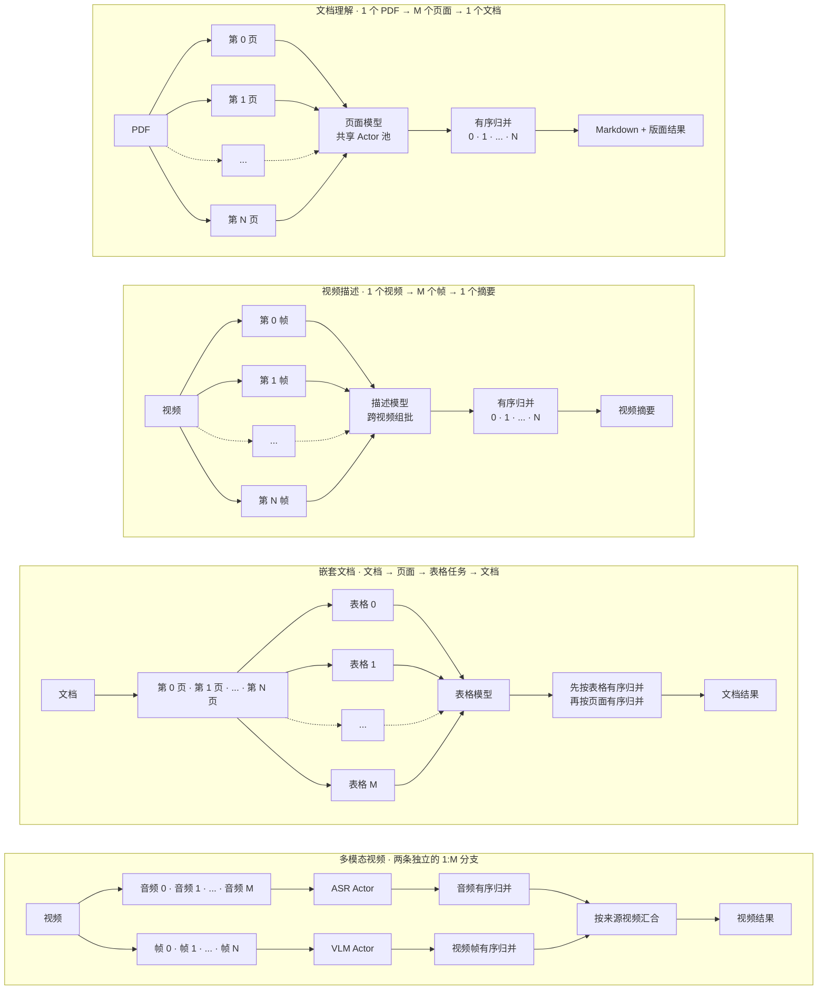
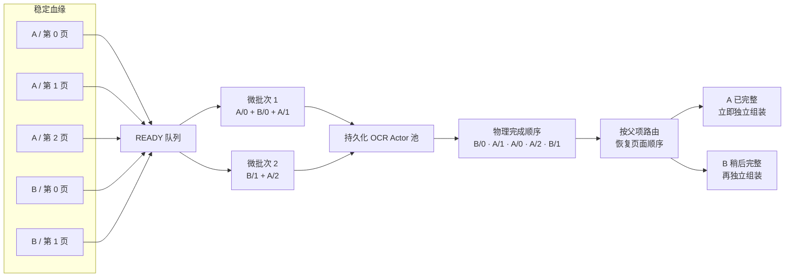
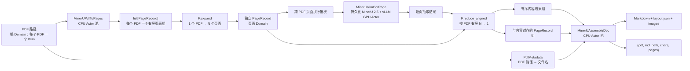

<div align="center">
  

# RayOrch

**数据一旦就绪，立即运行下一阶段。**

基于 Ray、面向多阶段多模型 AI 负载的完成驱动数据流编排框架。

[](https://github.com/OpenDCAI/RayOrch)
[](https://github.com/OpenDCAI/RayOrch/actions/workflows/ci.yml)
[](https://pypi.org/project/rayorch/)
[](https://pypi.org/project/rayorch/)
[](LICENSE)
[](https://opendcai.github.io/RayOrch-doc/en/)
[](https://opendcai.github.io/RayOrch-doc/zh/)

[完整文档](https://opendcai.github.io/RayOrch-doc/zh/) · [快速上手](https://opendcai.github.io/RayOrch-doc/zh/guide/first-pipeline.html) · [API 参考](https://opendcai.github.io/RayOrch-doc/zh/api/) · [Benchmarks](https://opendcai.github.io/RayOrch-doc/zh/benchmarks/)

[English](README.md) | [简体中文](README-zh.md)

</div>

---

## 📰 0. 最新动态

- **[2026-09] RayOrch `0.1` 预览版已准备就绪。** 公开 API 现在以 `Pipeline`、`RayModule`、`Executor` 和 `RunResult` 为核心，同时提供 Benchmark 懒加载和 Ray Job 提交能力。
- **[2026-09] 已完成 Flash-MinerU 与 DataFlow 集成。** 应用可以直接依赖安装好的 `rayorch` 包，无须再在自己的仓库中复制一份运行时源码。

## 🔍 1. RayOrch 是什么？

**RayOrch 是一个面向大规模、多模态、模型托管（model-hosted）数据处理的数据流编排框架。** 它提供清晰且精简的编程模型，让用户可以用普通 Python 表达流水线并行和复杂推理 DAG，并将其中异构的计算阶段高效调度到 Ray CPU/GPU 集群上执行。

典型负载包括 PDF 理解、视频处理、多模型视觉和多阶段 LLM 推理，它们通常具有共同的 `1 → M → 1` 结构：一个输入展开为多个可独立执行的子项，模型对不同输入的就绪子项统一组批，最终再按照来源和原始顺序归并回父级结果。



Ray 提供分布式计算基础设施，RayOrch 则在其上提供流水线语义，包括依赖、展开与归并、血缘、就绪判断、持久化模型 Actor 和有序结果重建。


## ✨ 2. 为什么使用 RayOrch？

模型托管的多模态流水线，难点不只是启动若干 Ray Actor，而是让 CPU 预处理与 GPU 推理持续并行，让不同输入中已经就绪的数据共享模型批次，同时在每个输入独立推进时仍然维持正确的归属和顺序。PDF 案例可以直接说明这个问题：



RayOrch 将每个可调度任务表示为业务数据加稳定血缘，在这个案例中就是父 PDF 和页码。调度器持续获取 READY 任务，并把不同 PDF 的页面组成批次送入持久化 Actor；物理执行可以乱序完成，但结果重建会将每个结果路由回父项并恢复逻辑顺序。因此 A 完整后可以立即进入下游组装，而 B 只等待自己的缺失任务，不会阻塞整条流水线。

| 能力 | 具体案例 | RayOrch 的行为 |
| --- | --- | --- |
| 完成驱动调度 | PDF A 比 PDF B 先完成 | A 的页面齐备后立即组装 A |
| 显式展开与归并 | PDF → 页面 → 文档 | 记录子项归属，并按源顺序归并 |
| 跨输入批处理 | 多个 PDF 的页面同时就绪 | 在同一个 OCR Actor 上组批，同时保留血缘 |
| 持久化 Actor 池 | MinerU、YOLO、SAM、vLLM 或 SGLang 加载成本高 | 每个 Actor 中只维护一个持久化 UDF/模型实例 |
| 分阶段资源配置 | 渲染需要 CPU，OCR 需要 GPU | 每个阶段独立配置副本、批大小、CPU、GPU 和自定义资源 |
| 跨环境阶段 | SGLang 与 vLLM 需要不同依赖栈 | 为每个阶段指定 Ray `runtime_env` 或 Conda 环境 |
| 结构化执行结果 | 某些数据被过滤、失败或因上游失败被抑制 | 成功结果仍是普通业务值，非成功结果显式报告 |
| 可复现实验 | 同一负载需要本地运行和 Ray Job 提交 | 复用一份类型化 Benchmark 配置并生成标准报告 |

## 🧠 3. 编程模型

RayOrch 有意保持精简的公开编程模型：

| 对象 | 职责 |
| --- | --- |
| UDF | 对一个批次执行普通 Python 计算的类或函数 |
| `RayModule` | 声明 UDF 构造方式、副本数、批大小、恢复策略和 Ray Actor 选项 |
| `Pipeline` | 连接计算阶段并形成静态拓扑 |
| `rayorch.F` | 显式声明展开、过滤、广播和归并 |
| `Executor` | 管理持久化 Actor 和执行生命周期 |
| `RunResult` | 返回有序输出以及不可变的耗时、Actor、RPC、Grain 和批处理指标 |

一条最小 Pipeline 就是普通 Python：

```python
import rayorch as ro


class AddOne:
    def run(self, values):
        return [value + 1 for value in values]


class MyPipeline(ro.Pipeline):
    def __init__(self):
        self.first = ro.RayModule(AddOne).ray_options(replicas=2, batch_size=8)
        self.second = ro.RayModule(AddOne).ray_options(replicas=2, batch_size=8)

    def forward(self, values):
        return self.second(self.first(values))


result = ro.run(
    MyPipeline(),
    [1, 2, 3],
    input_batch_size=2,
    max_active_input_batches=2,
)

print(result.outputs)  # [3, 4, 5]
```

可以把它理解为：**编写批处理 UDF → 在 Pipeline 中连接 → 分配资源 → 运行**。`Pipeline.forward()` 只会使用符号值追踪一次以构建静态图，不会真正执行 UDF，也不会在编译时加载模型。

### 3.1 `rayorch.F`：显式的数据形态变换

结构关系通过显式 API 表达，而不是隐藏在框架约定中。下表使用 `A:[a0, a1]` 表示挂在父项 A 上的一个有序分组，使用 `A/a0` 表示一个可以独立调度、同时保留父项 A 和序号 0 的子项。

| API | 操作前形态 | 操作后形态 | 基数变化 | 含义 |
| --- | --- | --- | --- | --- |
| `F.expand(groups)` | `A:[a0, a1]`<br>`B:[b0]` | `A/a0`、`A/a1`<br>`B/b0` | `1 个分组 → M 个子项` | 进入新的子级 Domain，让页面、视频帧等组内成员可以独立调度 |
| `F.expand_aligned(xs, ys)` | `xs = A:[x0, x1]`<br>`ys = A:[y0, y1]` | `xs = A/x0, A/x1`<br>`ys = A/y0, A/y1` | `K × 1 个分组 → K × M 个子项` | 将同一生产者产生的多个位置对齐结果展开到同一个子级 Domain；对应值仍是共享同一批子实体的独立 Port |
| `F.filter(values, mask)` | `values = A/x0, A/x1, A/x2`<br>`mask = T, F, T` | `A/x0`、`A/x2`<br>`A/x1 = DROPPED` | `M 个子项 → K 个保留项` | 筛选成员，但不改变其 Domain、父级血缘和原始相对顺序 |
| `F.broadcast(meta, like=pages)` | 祖先值 `A/meta`<br>后代项 `A/p0`、`A/p1` | `A/p0:meta`<br>`A/p1:meta` | `1 个祖先值 → M 个后代视图` | 将祖先上下文投影到已有的后代 Domain，例如让每个页面都能访问 PDF 元数据 |
| `F.reduce(values, members=...)` | `A/p0`、`A/p1`<br>`B/p0` | `A:[p0, p1]`<br>`B:[p0]` | `M 个子项 → 1 个有序分组` | 将一条子级 Port 归并回父级 Domain；`members` 可以额外指定哪些子实体属于该分组 |
| `F.reduce_aligned(xs, ys, members=...)` | `xs = A/x0, A/x1`<br>`ys = A/y0, A/y1` | `xs = A:[x0, x1]`<br>`ys = A:[y0, y1]` | `K × M 个子项 → K × 1 个分组` | 使用同一成员集合和顺序同时归并多个 Port，例如 MinerU 对齐页面结果与页面元数据 |

这些 `F` 操作都是编译期结构声明：它们负责创建 Domain 和血缘关系，但不会创建 Ray Actor，也不会执行具体业务逻辑。

如果需要重复调用，可以保持一个 `Executor`，从而复用已经加载的 Actor 和模型：

```python
from rayorch import Executor

with Executor(MyPipeline()) as executor:
    first = executor.run([1, 2, 3])
    second = executor.run([4, 5, 6])
```

RayOrch 负责逻辑数据流语义，Ray 负责物理分布式执行：

| 层次 | 职责 |
| --- | --- |
| 用户负载 | UDF 业务逻辑、Pipeline 拓扑和资源选择 |
| RayOrch | 依赖、基数关系、血缘、就绪判断、恢复和结果重建 |
| Ray | 节点、放置、Actor、RPC、资源和对象存储 |
| 计算后端 | Python、PyTorch、vLLM、SGLang 或其他计算库 |

编译器、运行时和源码执行路径请参阅[框架设计](https://opendcai.github.io/RayOrch-doc/zh/architecture/)。

## 🧩 4. 真实负载与集成

### 4.1 MinerU 2.5：`MinerUBench` 与 Flash-MinerU

内置 `MinerUBench` 将 [Flash-MinerU](https://github.com/OpenDCAI/Flash-MinerU) 中的 MinerU 2.5 实现接入为一条显式的页面级 RayOrch 负载。一个 PDF 首先展开为数量不固定的页面记录，页面图像交给持久化 GPU Actor 池推理，随后按原始页序归并页面级模型结果，并写出 Markdown、版面 JSON 和抽取图片。这个负载具有明显的不规则性：不同 PDF 的页数不同，渲染和组装主要使用 CPU、模型推理使用 GPU，而且来自不同 PDF 的就绪页面应当共享模型批次，同时不能丢失所属文档。



中间数据有意保持为普通 Python 值；RayOrch 在业务数据之外维护血缘和基数关系，不要求用户把数据包装成框架专有对象：

| Pipeline 位置 | 逻辑层级 | Python 值 |
| --- | --- | --- |
| 输入 | PDF | `str` 路径 |
| `render(pdfs)` | PDF | 每个 PDF 对应一个 `list[PageRecord]` |
| `F.expand(...)` | 页面 | 一个 `PageRecord`，包含 `pdf_path`、`page_id`、`img_pil`、`scale`、`page_width`、`page_height` 和 `pdf_len` |
| `ocr(pages)` | 页面 | 每页一个 MinerU 2.5 抽取结果 |
| `F.reduce_aligned(...)` | PDF | 有序内容列表，以及与其对齐的有序 `PageRecord` 列表 |
| `assemble(...)` | PDF | `{pdf, md_path, chars, pages}`，以及 Markdown、版面 JSON 和抽取图片文件 |

内置 `MinerUBench` 的 RayOrch 核心拓扑很小，因为模型逻辑留在 UDF 内，数据流关系集中写在 `forward()` 中：

```python
from typing import cast
import rayorch as ro

from rayorch.benchmarks.mineru.udfs import (
    MinerUAssembleDoc,
    MinerUPdfToPages,
    MinerUVlmOcrPage,
    PdfMetadata,
)


class MinerUPipeline(ro.Pipeline):
    def __init__(self, *, model, output_dir, num_gpus=1, batch_size=64):
        self.render = (
            ro.RayModule(MinerUPdfToPages)
            .pre_init(dpi=200)
            .ray_options(replicas=num_gpus, batch_size=1, num_cpus=1)
        )
        self.ocr = (
            ro.RayModule(MinerUVlmOcrPage)
            .pre_init(model=model, gpu_memory_utilization=0.8)
            .ray_options(
                replicas=num_gpus,
                batch_size=batch_size,
                num_gpus=1,
                num_cpus=1,
            )
        )
        self.metadata = ro.RayModule(PdfMetadata).ray_options(
            replicas=1,
            batch_size=32,
            num_cpus=1,
        )
        self.assemble = (
            ro.RayModule(MinerUAssembleDoc)
            .pre_init(output_dir=output_dir)
            .ray_options(replicas=num_gpus, batch_size=4, num_cpus=1)
        )

    def forward(self, pdfs):
        pages = ro.F.expand(cast(ro.Port, self.render(pdfs)))
        contents = cast(ro.Port, self.ocr(pages))
        stems = cast(ro.Port, self.metadata(pdfs))
        content_groups, ordered_page_groups = ro.F.reduce_aligned(
            contents,
            pages,
            members=contents,
        )
        return self.assemble(content_groups, ordered_page_groups, stems)
```

`F.expand` 让每个渲染后的页面成为可独立调度的数据，因此一次 OCR 执行批次可以包含多个 PDF 的页面；`F.reduce_aligned` 使用 OCR 输出定义成员集合，并按原始页序将模型结果与对应页面元数据一起归并回 PDF Domain。独立的 metadata 分支只传递 PDF 文件名，避免把 PDF 字节绕经 GPU 阶段。MinerU 2.5 模型在每个 OCR Actor 中只构造一次，并在不同批次和多次 Executor 调用之间持续驻留。每个完成的 PDF 会写入 `output_dir/<pdf-stem>/vlm/`，其中包含 `<pdf-stem>.md`、`layout.json` 和抽取图片。

大多数用户不需要亲自组装 MinerU UDF。内置 Benchmark 为实验提供显式的页面级拓扑，而独立发布的 Flash-MinerU 集成则保留精简的应用层 API，并使用安装好的 RayOrch 运行时：

```bash
pip install "flash-mineru[vllm]"
```

```python
from flash_mineru import MineruEngine

engine = MineruEngine(
    model="/path/to/MinerU2.5",
    save_dir="./outputs",
    batch_size=8,
    replicas=2,
    num_gpus_per_replica=1,
)
result = engine.run(["document-a.pdf", "document-b.pdf"])
engine.close()
```

如果需要可配置实验、标准 Profile 和统一产物，可以使用下文 Benchmark API 中的 `MinerUBench`。

### 4.2 DataFlow

[DataFlow](https://github.com/OpenDCAI/DataFlow) 展示了渐进式接入方式：兼容且记录间独立的算子可以用 `RayAcceleratedOperator` 包装，而不改变原有面向存储的调用接口；包装器内部由 RayOrch 创建持久化副本并分发 DataFrame 分片。

```python
from dataflow.rayorch import RayAcceleratedOperator

parallel_op = RayAcceleratedOperator(
    MyOperator,
    replicas=4,
    num_gpus_per_replica=1,
).op_cls_init(...)
```

依赖全局跨行状态的算子应继续使用原有执行路径，而不是被强行改造成数据并行。

### 4.3 内置 Benchmarks

| Benchmark | 拓扑 | 展示能力 |
| --- | --- | --- |
| `MinerUBench` | PDF → 页面 → MinerU → 文档 | 真实模型展开、跨文档组批、多 GPU 推理和有序组装 |
| `YoloSamBench` | 图片 → YOLO → SAM → 输出 | 两个昂贵模型分别驻留在独立 Actor 池中 |
| `DualVllmBench` | Prompt → vLLM A → vLLM B | 同一张图中的两个独立配置 LLM 引擎 |
| `SglangVllmBench` | Prompt → SGLang → vLLM | 同一 Pipeline 的模型阶段运行在不同 Conda 环境 |
| `DocumentTopologyBench` | 文档 → 页面 → 表格 → 文档 | 嵌套展开、空子项组和嵌套有序归并 |
| `VideoCaptionTopologyBench` | 视频 → 帧 → 描述 → 视频 | 动态展开、跨视频组批和有序汇合 |
| `VideoMultimodalTopologyBench` | 视频 → 音频/视觉分支 → 合并 | 不同基数的兄弟 Domain 在父级汇合 |

每个内置案例都位于 `rayorch/benchmarks/<name>/`，并将 `udfs.py`、`pipeline.py`、`benchmark.py`、`env.json` 和案例 README 放在一起，让用户无须进入框架内部就能理解或复制一条完整负载。

## 📊 5. Benchmark API

Benchmark 是围绕 Pipeline 的轻量类型化实验入口：配置输入和资源，在本地运行或通过 Ray Jobs 提交，然后获得包含输出、吞吐、Actor/RPC/批处理指标以及尽力采集的 GPU Profile 的统一报告。

```text
配置 → 运行或提交 → 收集指标 → 写入产物
```

```python
from rayorch.benchmark import MinerUBench

bench = MinerUBench(
    input_path="/shared/data/pdfs",
    model="/shared/models/MinerU2.5",
    output_dir="/shared/output",
    input_limit=100,
    num_gpus=8,
    batch_size=64,
    input_batch_size=24,
    max_active_input_batches=3,
)

report = bench.run(ray_address="auto")
report.print_summary()
```

同一份配置可以直接作为 Ray Job 提交，无须再为负载设计一套 CLI：

```python
run = bench.submit("http://RAY_DASHBOARD:8265")
report = run.wait(timeout_s=3600)
```

负载通过注册表懒加载，因此导入 `rayorch` 时不会同时导入 vLLM、SGLang 或 Flash-MinerU 等可选后端。报告使用统一的产物结构：

```text
.rayorch-benchmark/<run-id>/
  config.json
  summary.json
  gpu_samples.jsonl
```

进一步阅读：[运行 Benchmark](https://opendcai.github.io/RayOrch-doc/zh/benchmarks/run.html)、[编写 Benchmark](https://opendcai.github.io/RayOrch-doc/zh/benchmarks/write.html)和[内置负载](https://opendcai.github.io/RayOrch-doc/zh/benchmarks/built-ins.html)。

## ⚡ 6. 快速上手

RayOrch 需要 Python 3.11 或更高版本：

```bash
pip install rayorch
```

未提供地址时，`ro.run()` 会启动本地 Ray；同一条 Pipeline 只需传入 `address="auto"` 就可以连接已有集群：

```python
local_result = ro.run(MyPipeline(), values)
cluster_result = ro.run(MyPipeline(), values, address="auto")
```

资源和环境直接配置在真正需要它们的阶段。下面的案例会创建四个持久化模型 Actor，每个 Actor 预留一张 GPU，并在 `model-serving` Conda 环境中启动：

```python
self.model = ro.RayModule(ModelWorker).ray_options(
    replicas=4,
    batch_size=16,
    num_gpus=1,
    runtime_env={"conda": "model-serving"},
)
```

多机运行时，每个候选节点都必须能够访问配置的模型、输入、输出和 Benchmark 产物路径。RayOrch 负责调度计算，但不会在节点之间复制大型数据集或模型权重。

本地开发：

```bash
git clone https://github.com/OpenDCAI/RayOrch.git
cd RayOrch
pip install -r requirements-dev.txt
pip install -e .
pytest -q
```

推荐阅读路径：[安装](https://opendcai.github.io/RayOrch-doc/zh/guide/installation.html) → [第一条 Pipeline](https://opendcai.github.io/RayOrch-doc/zh/guide/first-pipeline.html) → [展开与有序归并](https://opendcai.github.io/RayOrch-doc/zh/guide/fan-out-and-reduce.html) → [多机与多 GPU](https://opendcai.github.io/RayOrch-doc/zh/guide/multi-node.html) → [跨环境阶段](https://opendcai.github.io/RayOrch-doc/zh/distributed/cross-environment.html)。

## ✅ 7. 什么时候应该使用 RayOrch？

当一条负载包含多个有状态 CPU/GPU 阶段、数据会在执行中展开或归并、不同阶段需要不同资源或环境、昂贵模型需要持续驻留，或者同一实验需要在本地、Ray 集群和 Ray Jobs 中运行时，可以使用 RayOrch；Flash-MinerU、YOLO → SAM、双 vLLM 和多模态视频处理都是典型案例。

如果只有一个函数或一次模型调用，普通 Python 或 Ray 原生 Task/Actor 可能更加简单。RayOrch 不是数据集/存储引擎、模型服务、无边界流式系统、Ray 的替代品，也不是支持任意运行时图变更的动态工作流引擎，详见[能力与边界](https://opendcai.github.io/RayOrch-doc/zh/guide/boundaries.html)。

## 📖 8. 文档

| 主题 | 中文 | English |
| --- | --- | --- |
| 项目介绍 | [阅读](https://opendcai.github.io/RayOrch-doc/zh/guide/) | [Read](https://opendcai.github.io/RayOrch-doc/en/guide/) |
| 框架设计 | [阅读](https://opendcai.github.io/RayOrch-doc/zh/architecture/) | [Read](https://opendcai.github.io/RayOrch-doc/en/architecture/) |
| 第一条 Pipeline | [阅读](https://opendcai.github.io/RayOrch-doc/zh/guide/first-pipeline.html) | [Read](https://opendcai.github.io/RayOrch-doc/en/guide/first-pipeline.html) |
| 分布式执行 | [阅读](https://opendcai.github.io/RayOrch-doc/zh/distributed/) | [Read](https://opendcai.github.io/RayOrch-doc/en/distributed/) |
| Benchmarks | [阅读](https://opendcai.github.io/RayOrch-doc/zh/benchmarks/) | [Read](https://opendcai.github.io/RayOrch-doc/en/benchmarks/) |
| API 参考 | [阅读](https://opendcai.github.io/RayOrch-doc/zh/api/) | [Read](https://opendcai.github.io/RayOrch-doc/en/api/) |
| 论文与实验复现 | [阅读](https://opendcai.github.io/RayOrch-doc/zh/paper/) | [Read](https://opendcai.github.io/RayOrch-doc/en/paper/) |

仓库内参考资料：[运行时架构](docs/runtime_architecture.md) · [Benchmark 编写指南](docs/benchmarks.md) · [`0.1` API 迁移指南](docs/api_migration.md)

## 🗺️ 9. 项目状态

RayOrch 目前处于 Alpha 阶段。`0.1` 版本线重点关注精简的公开编写 API、多机与跨环境执行、可复现 Benchmark 和 Ray Job 提交、Flash-MinerU 与 DataFlow 集成验证以及干净的软件包安装；在稳定的 `1.0` 发布前兼容性仍可能继续演进，使用 `0.0.1` 的用户请阅读[迁移指南](docs/api_migration.md)。

## 🤝 10. 社区

使用 [GitHub Issues](https://github.com/OpenDCAI/RayOrch/issues) 报告缺陷、提出功能需求和讨论设计，使用 [GitHub Pull Requests](https://github.com/OpenDCAI/RayOrch/pulls) 提交修复、文档、集成和新的 Benchmark 案例。一个好的 Benchmark 应当易于检查：UDF、Pipeline、环境声明、类型化配置，以及一份说明拓扑、运行方式和结果的 README。

## 📜 11. 开源协议

RayOrch 基于 [Apache License 2.0](LICENSE) 开源。
