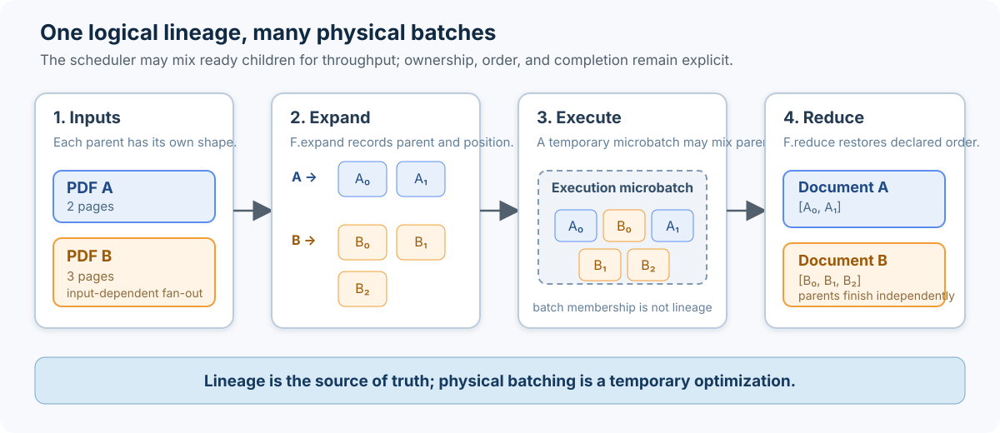
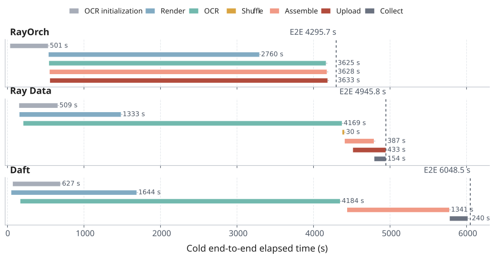
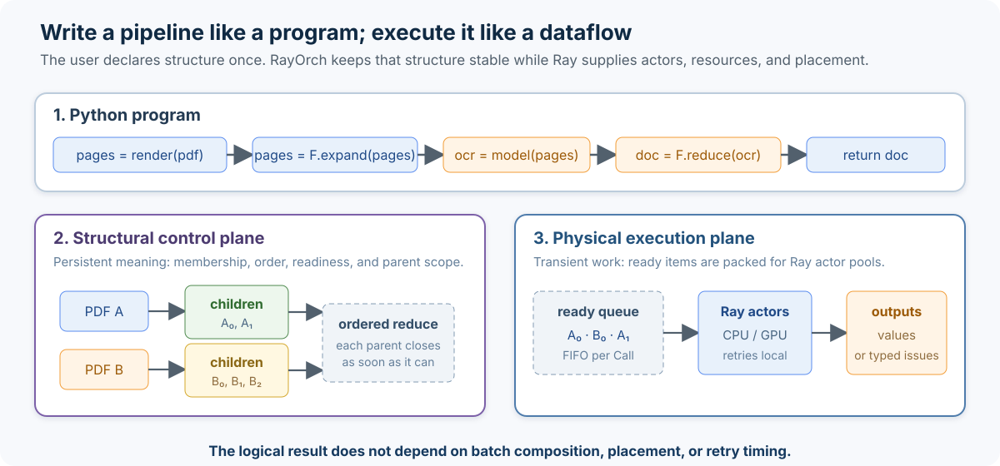

<div align="center">
  

# RayOrch

**像写程序一样构建多模态 AI 数据管线，随 Ray 集群扩展。**

数据就绪即执行，同时保留血缘、顺序和局部失败边界。

[](https://github.com/OpenDCAI/RayOrch)
[](https://github.com/OpenDCAI/RayOrch/actions/workflows/ci.yml)
[](https://pypi.org/project/rayorch/)
[](https://pypi.org/project/rayorch/)
[](LICENSE)
[](https://arxiv.org/abs/2609.18703)

[完整文档](https://opendcai.github.io/RayOrch-doc/zh/) · [快速上手](https://opendcai.github.io/RayOrch-doc/zh/guide/first-pipeline.html) · [Benchmarks](https://opendcai.github.io/RayOrch-doc/zh/benchmarks/) · [API 参考](https://opendcai.github.io/RayOrch-doc/zh/api/)

[English](README.md) | [简体中文](README-zh.md)

</div>

## 为什么需要它

很多多模态负载都有同一个形状：**一个输入展开成数量不固定的子项，模型逐项处理，再把这些子项还原成一个结果**。

```text
PDF ──► 页面 ──► OCR / VLM ──► 文档
视频 ──► 帧 ──► 视觉模型 ──► 摘要
```

这就是典型的 `1 → M → 1`。如果只使用扁平 batch，信息很快会丢失：2 页 PDF 和 48 页 PDF 应该共享已经就绪的 GPU 工作，但页面不能串到别的文档；短文档应该先完成，不应等待长文档；某一页失败，也不应悄悄拖垮无关输入。

RayOrch 把这层关系写进程序。你只需编写普通的批处理 UDF，声明 `F.expand` 和 `F.reduce`；RayOrch 保存归属、顺序、就绪条件和失败范围，Ray 负责 Actor、资源和放置。

<p align="center">
  
</p>

执行微批只是临时的物理组织方式。它可以混合不同父项的子项，但不会成为成员关系、顺序和完成条件的事实来源。

## 你能得到什么

- **更高的加速器利用率：** 不同输入的就绪子项可以共享模型 batch，同时每个父项在自己的工作完成后独立继续。
- **天然正确的结果重建：** 父项归属和子项顺序由运行时血缘保存，不需要从扁平结果表里重新猜测。
- **局部恢复：** 重试和有类型的失败限制在对应的逻辑调用与父项范围内。
- **精简的编程面：** Python UDF 加少量明确的结构操作；Actor、资源和环境模型仍然使用 Ray 原生能力。

下面的时间线来自论文中的 MinerU 对比实验，直观展示了为什么要把“结构”和“物理批次”分开：RayOrch 可以重叠阶段，同时保持文档级结果合同不变。

<p align="center">
  
</p>

具体数字取决于模型、数据、存储和硬件。可参考[Benchmark 指南](https://opendcai.github.io/RayOrch-doc/zh/benchmarks/)运行并正确解读实验。

## 安装并运行

```bash
pip install rayorch
```

最小 Pipeline 就是普通 Python：

```python
import rayorch as ro


class AddOne:
    def run(self, values):
        return [value + 1 for value in values]


class MyPipeline(ro.Pipeline):
    def __init__(self):
        self.first = ro.RayModule(AddOne).ray_options(replicas=2, batch_size=8)
        self.second = ro.RayModule(AddOne).ray_options(replicas=2, batch_size=8)

    def forward(self, values):
        return self.second(self.first(values))


result = MyPipeline().run(
    [1, 2, 3],
    input_batch_size=2,
    max_active_input_batches=2,
)
print(result.outputs)  # [3, 4, 5]
```

forward() 只会被追踪一次，用来构建静态图，不会在这里执行 UDF。pipeline.run(...) 会自动管理临时 Executor；如果多次运行需要复用已经启动的 Actor 和已加载的模型，则保持一个 Executor。

## 编程模型

<p align="center">
  
</p>

公开模型由六部分组成：

| 对象 | 含义 |
| --- | --- |
| UDF | 对一个运行时批次执行 Python 计算的类或函数。 |
| RayModule | UDF 构造方式、Actor 资源、副本数、批大小和恢复策略。同一对象被复用时共享 Actor 池。 |
| Pipeline | 在 forward() 中声明的静态拓扑。 |
| rayorch.F | 显式声明展开、筛选、广播和有序归并。 |
| Executor | 管理持久化 Actor 以及一次运行的执行生命周期。 |
| RunResult | 有序输出和不可变的运行指标。 |

### UDF 合同

- 每个输入 Port 作为一列传入；一个运行时批次内的输入列长度相同。
- 每个输出 Port 为每个输入行返回一个值。None 和空容器都可以是普通业务值。
- 被 F.expand 使用的输出，需要为每个输入行返回一个有序子项序列；F.expand 会把子项变成可独立调度的 Entity。
- F.reduce 按声明的父子关系和顺序收集仍保留的子项。成功但没有子项时，结果是空列表。
- ro.RecordFailure(cause) 表示一个逻辑记录失败；ro.GroupFailure(cause) 会屏蔽同一直接父项下的兄弟项。
- 最终非成功结果通过 ro.OutputIssue 暴露，其状态为 ItemOutcome.DROPPED、FAILED 或 SUPPRESSED。当前没有隐藏的缺失值哨兵，None 始终是普通值。

### 术语

| 术语 | 含义 |
| --- | --- |
| Domain | 一个逻辑层级，例如文档层或页面层。 |
| Entity | Domain 中的一个数据单元，例如文档 A 或页面 A/0。 |
| Call | 静态图中对一个配置好的 RayModule 的一次使用。 |
| Grain | 一个 Call × Entity 执行项，是调度和重试的单位；它不等同于 Ray task。 |
| Port | 图中的一条逻辑输入或输出边。 |
| Item | 某个 Port × Entity 上的值或终态。 |
| Execution microbatch | 发给一个 Actor 的临时物理批次，可以混合不同父项，但不定义血缘和输出顺序。 |

### 结构操作

| API | 形态变化 | 用途 |
| --- | --- | --- |
| F.expand(groups) | 一个有序分组 → 多个子 Entity | 页面、帧、区域或其他数量可变的工作。 |
| F.filter(values, mask) | 在同一 Domain 中保留或丢弃 Entity | 筛选成员，不改变父子关系和顺序。 |
| F.broadcast(value, like=descendants) | 一个祖先值 → 后代视图 | 让每个页面都能读取文档元数据。 |
| F.reduce(values, members=...) | 多个子项 → 一个有序父级分组 | 重建文档、视频或嵌套结果。 |

F.expand_aligned 和 F.reduce_aligned 会对多个 Port 同时使用相同的成员集合和顺序。这些操作在编译期声明结构，不会创建 Actor，也不会执行用户代码。

RayOrch 负责逻辑依赖、基数关系、血缘、就绪判断、恢复和结果重建；Ray 负责节点、放置、Actor、RPC、资源和对象存储。批次组成、Actor 放置和重试时机可以变化，但逻辑结果保持调度不变性。

## 在多个阶段复用同一个模型

如果多个 Call 需要共享一套已经初始化的模型，可以保留同一个 RayModule：

```python
import rayorch as ro
from my_model_library import load_model


class ModelStack:
    def __init__(self, model_path):
        self.model = load_model(model_path)

    def run(self, values, *, stage):
        if stage == "layout":
            return self.model.layout(values)
        if stage == "recognize":
            return self.model.recognize(values)
        raise ValueError(stage)


class DocumentPipeline(ro.Pipeline):
    def __init__(self, model_path):
        self.model = (
            ro.RayModule(ModelStack)
            .pre_init(model_path)
            .ray_options(replicas=4, num_gpus=1, batch_size=16)
        )

    def forward(self, pages):
        layouts = self.model(pages, stage="layout")
        return self.model(layouts, stage="recognize")
```

两个 Call 仍有独立的数据依赖、就绪队列、恢复过程和指标，但会共享 self.model 所拥有的 Actor。

## 负载与集成

- **[Flash-MinerU](https://github.com/OpenDCAI/Flash-MinerU)** 是目前最典型、仍在跟进的应用：PDF → 页面 → GPU VLM/OCR → 按序组装文档。它当前的流水线并行路径在单机 8×A100 上处理 368 个 PDF 约 **8.5 分钟**，而八进程 MinerU 基线约 **14 分钟**（该配置下约 **1.7×**）。建议先看 [RayOrch 应用指南](https://opendcai.github.io/RayOrch-doc/zh/benchmarks/flash-mineru.html)，再看 [Flash-MinerU Benchmark](https://github.com/OpenDCAI/Flash-MinerU#-benchmark) 的数据集、版本和命令；这是特定负载的实测结果，不是对所有环境的通用承诺。
- [内置 Benchmark](https://opendcai.github.io/RayOrch-doc/zh/benchmarks/)：MinerU、YOLO → SAM、双 vLLM、SGLang → vLLM、嵌套文档、视频描述和多模态视频。
- [DataFlow 集成](https://github.com/OpenDCAI/DataFlow)：在不改变面向存储的接口的情况下包装按记录独立处理的算子。

依赖全局跨行状态的算子应继续使用原有执行路径，不应被强行改造成数据并行。

## 兼容性

RayOrch 当前面向 Python 3.11、3.12 和 Ray 2.x，项目仍处于 Alpha 阶段。示例和 Benchmark 覆盖的是通过 Ray CPU/GPU Actor 池执行的有限、按行对齐输入批次；具体模型依赖由各负载自己的运行环境负责。

建议从[安装](https://opendcai.github.io/RayOrch-doc/zh/guide/installation.html)和[第一个 Pipeline](https://opendcai.github.io/RayOrch-doc/zh/guide/first-pipeline.html)开始，再阅读[一对多与有序归并](https://opendcai.github.io/RayOrch-doc/zh/guide/fan-out-and-reduce.html)、[基数与血缘](https://opendcai.github.io/RayOrch-doc/zh/concepts/cardinality.html)和[分布式执行](https://opendcai.github.io/RayOrch-doc/zh/distributed/)。想看完整应用时，直接运行[MinerU Benchmark](https://opendcai.github.io/RayOrch-doc/zh/benchmarks/mineru.html)；需要查每个公开符号时，再进入 [API 参考](https://opendcai.github.io/RayOrch-doc/zh/api/)。

## 引用与协议

如果 RayOrch 对你的研究有所帮助，请引用 [RayOrch 论文](https://arxiv.org/abs/2609.18703)：

```bibtex
@article{ma2026rayorch,
  title={RayOrch: Programming and Executing Lineage-Controlled Multi-Grain Dataflows for Foundation-Model Data Preparation},
  author={Ma, Xiaochen and Meng, Zimo and Liang, Junzhu and Jiang, Youhe and Cheng, Yue and Liang, Hao and Zeng, Bohan and Li, Dengchun and Ma, Lu and Zhao, Zhengyang and others},
  journal={arXiv preprint arXiv:2609.18703},
  year={2026}
}
```

RayOrch 基于 [Apache License 2.0](LICENSE) 开源。
