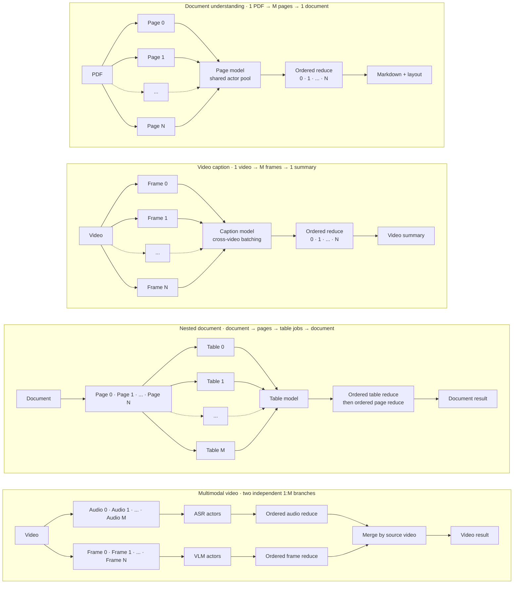
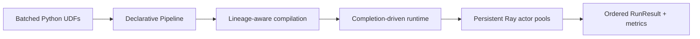
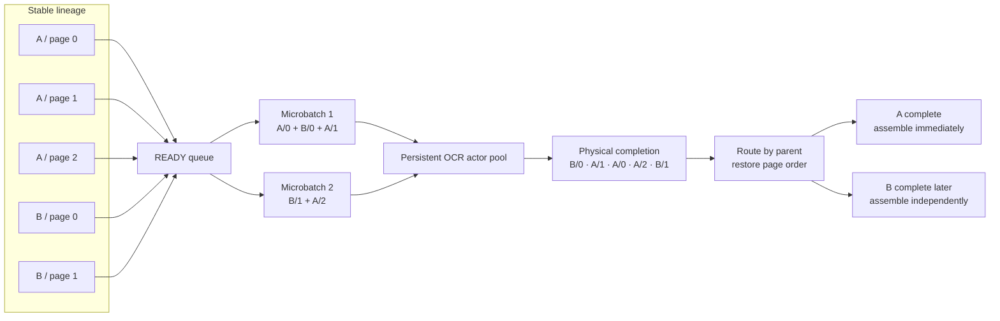

<div align="center">
  

# RayOrch

**Run every stage as soon as its data is ready.**

Completion-driven dataflow orchestration for multi-stage, multi-model AI workloads on Ray.

[](https://github.com/OpenDCAI/RayOrch)
[](https://github.com/OpenDCAI/RayOrch/actions/workflows/ci.yml)
[](https://pypi.org/project/rayorch/)
[](https://pypi.org/project/rayorch/)
[](LICENSE)
[](https://opendcai.github.io/RayOrch-doc/en/)
[](https://opendcai.github.io/RayOrch-doc/zh/)

[Documentation](https://opendcai.github.io/RayOrch-doc/en/) · [Quickstart](https://opendcai.github.io/RayOrch-doc/en/guide/first-pipeline.html) · [API Reference](https://opendcai.github.io/RayOrch-doc/en/api/) · [Benchmarks](https://opendcai.github.io/RayOrch-doc/en/benchmarks/)

[English](README.md) | [简体中文](README-zh.md)

</div>

---

## 📰 0. News

- **[2026-09] RayOrch `0.1` preview is ready.** The public API now centers on `Pipeline`, `RayModule`, `Executor`, and `RunResult`, with lazy Benchmarks and Ray Job submission.
- **[2026-09] Flash-MinerU and DataFlow integrations are available.** Applications can depend on the installed `rayorch` package instead of carrying a private runtime copy.

## 🔍 1. What is RayOrch?

**RayOrch is a dataflow orchestration framework for large-scale, model-hosted multimodal processing.** It provides a small and explicit programming model for building pipeline-parallel workloads and complex inference DAGs, then efficiently schedules their heterogeneous stages across Ray CPU and GPU clusters.

Typical workloads include PDF understanding, video processing, multi-model vision, and multi-stage LLM inference. Their common structure is `1 → M → 1`: one input expands into independently executable children, models process those children in shared batches, and the results return to their parent in deterministic order.



Ray provides distributed compute primitives; RayOrch provides the pipeline semantics above them: dependencies, fan-out and fan-in, lineage, readiness, persistent model actors, and ordered result reconstruction.



## ✨ 2. Why RayOrch?

The difficult part of a model-hosted multimodal pipeline is not merely starting Ray actors. The system must keep CPU preprocessing and GPU inference running in parallel, batch ready items from different inputs for utilization, and still preserve ownership and order as every input progresses independently. The PDF case captures this problem:



RayOrch represents each schedulable task as business data plus stable lineage—here, the parent PDF and page index. The scheduler continuously reserves READY tasks and forms cross-PDF microbatches for persistent actors; physical completion may be out of order, but reconstruction routes every result to its parent and restores logical order. Consequently, A enters its downstream assembly as soon as A is complete, while B waits only for B's missing task rather than blocking the whole pipeline.

| Capability | Concrete case | RayOrch behavior |
| --- | --- | --- |
| Completion-driven scheduling | PDF A finishes before PDF B | Assemble A as soon as A's pages are complete |
| Explicit fan-out and fan-in | PDF → pages → document | Track child ownership and reduce in source order |
| Cross-input batching | Pages from several PDFs are ready together | Batch them on one OCR actor without losing lineage |
| Persistent actor pools | MinerU, YOLO, SAM, vLLM, or SGLang is expensive to load | Keep one UDF/model instance alive in every actor |
| Per-stage resources | Rendering needs CPUs while OCR needs GPUs | Configure replicas, batching, CPUs, GPUs, and custom resources per stage |
| Cross-environment stages | SGLang and vLLM need separate dependency stacks | Assign a Ray `runtime_env` or Conda environment to each stage |
| Structured execution results | Some items are filtered, fail, or are suppressed by an upstream failure | Preserve ordinary successful values while reporting non-success outcomes explicitly |
| Reproducible experiments | The same workload must run locally and through Ray Jobs | Reuse one typed Benchmark configuration and collect standard reports |

## 🧠 3. Programming Model

RayOrch deliberately keeps the public model small:

| Object | Responsibility |
| --- | --- |
| UDF | Ordinary Python class or function that processes a batch |
| `RayModule` | UDF construction, replicas, batch size, recovery, and Ray actor options |
| `Pipeline` | Static topology connecting compute stages, plus the concise one-shot `pipeline.run(...)` entry point |
| `rayorch.F` | Explicit expansion, filtering, broadcast, and reduction |
| `Executor` | Persistent actor ownership and execution lifecycle |
| `RunResult` | Ordered outputs plus immutable timing, actor, RPC, Grain, and batching metrics |

A minimal Pipeline is ordinary Python:

```python
import rayorch as ro


class AddOne:
    # A UDF receives one runtime batch and returns one result per input item.
    def run(self, values):
        return [value + 1 for value in values]


class MyPipeline(ro.Pipeline):
    def __init__(self):
        # Each RayModule owns a persistent actor pool; models loaded by the UDF stay warm across batches.
        self.first = ro.RayModule(AddOne).ray_options(replicas=2, batch_size=8)
        self.second = ro.RayModule(AddOne).ray_options(replicas=2, batch_size=8)

    def forward(self, values):
        # forward() declares data dependencies; it does not execute the UDFs.
        return self.second(self.first(values))


pipeline = MyPipeline()
result = pipeline.run(
    [1, 2, 3],
    input_batch_size=2,           # Admit two source items as one input batch.
    max_active_input_batches=2,  # Allow two input batches to overlap.
)

print(result.outputs)  # [3, 4, 5]
```

Read it as: **write batched UDFs → connect them in a Pipeline → assign resources → run**. `Pipeline.forward()` is traced once with symbolic values to build a static graph; it does not execute the UDFs or load their models.

Use `pipeline.run(...)` for one finite execution. It creates an `Executor`, returns the `RunResult`, and closes the temporary actor pools; use `Executor(pipeline)` when several calls should reuse the same actors and loaded models. The functional form `ro.run(pipeline, ...)` remains equivalent to `pipeline.run(...)`.

### 3.1 `rayorch.F`: explicit shape transformations

Structural relationships are explicit rather than hidden in framework conventions. In the table below, `A:[a0, a1]` is one ordered group attached to parent A, while `A/a0` is one independently schedulable child that retains both parent A and ordinal 0.

| API | Shape before | Shape after | Cardinality | Meaning |
| --- | --- | --- | --- | --- |
| `F.expand(groups)` | `A:[a0, a1]`<br>`B:[b0]` | `A/a0`, `A/a1`<br>`B/b0` | `1 group → M children` | Enter a new child Domain so pages, frames, or other group members can be scheduled independently |
| `F.expand_aligned(xs, ys)` | `xs = A:[x0, x1]`<br>`ys = A:[y0, y1]` | `xs = A/x0, A/x1`<br>`ys = A/y0, A/y1` | `K × 1 group → K × M children` | Expand multiple position-aligned outputs of the same producer into one shared child Domain; corresponding values remain separate Ports on the same child entities |
| `F.filter(values, mask)` | `values = A/x0, A/x1, A/x2`<br>`mask = T, F, T` | `A/x0`, `A/x2`<br>`A/x1 = DROPPED` | `M children → K survivors` | Select members without changing their Domain, parent lineage, or relative order |
| `F.broadcast(meta, like=pages)` | ancestor `A/meta`<br>descendants `A/p0`, `A/p1` | `A/p0:meta`<br>`A/p1:meta` | `1 ancestor value → M descendant views` | Project ancestor context into an existing descendant Domain, such as making PDF metadata available to every page |
| `F.reduce(values, members=...)` | `A/p0`, `A/p1`<br>`B/p0` | `A:[p0, p1]`<br>`B:[p0]` | `M children → 1 ordered group` | Return one child Port to its parent Domain; `members` optionally defines which child entities belong to the group |
| `F.reduce_aligned(xs, ys, members=...)` | `xs = A/x0, A/x1`<br>`ys = A/y0, A/y1` | `xs = A:[x0, x1]`<br>`ys = A:[y0, y1]` | `K × M children → K × 1 group` | Reduce several Ports together using one membership set and order, as MinerU does for page results and page metadata |

These `F` operations are compile-time structural declarations: they create Domains and lineage relationships, but do not create Ray actors or execute business logic.

For repeated calls, keep an `Executor` alive so its actors and models remain warm:

```python
from rayorch import Executor

# Reuse one Executor when repeated calls should share already-started actors.
with Executor(MyPipeline()) as executor:
    first = executor.run([1, 2, 3])
    second = executor.run([4, 5, 6])
```

RayOrch owns logical dataflow semantics while Ray owns physical distributed execution:

| Layer | Responsibility |
| --- | --- |
| Your workload | UDF logic, Pipeline topology, and resource choices |
| RayOrch | Dependencies, cardinality, lineage, readiness, recovery, and output reconstruction |
| Ray | Nodes, placement, actors, RPC, resources, and object storage |
| Compute backend | Python, PyTorch, vLLM, SGLang, or another library |

See [Framework Design](https://opendcai.github.io/RayOrch-doc/en/architecture/) for the compiler, runtime, and source-code path.

## 🧩 4. Workloads and Integrations

### 4.1 MinerU 2.5: `MinerUBench` and Flash-MinerU

The built-in `MinerUBench` integrates the MinerU 2.5 implementation from [Flash-MinerU](https://github.com/OpenDCAI/Flash-MinerU) as an explicit page-level RayOrch workload. A PDF first expands into a variable number of page records, page images are processed by a persistent GPU actor pool, and the page-level model outputs are reduced in the original order before Markdown, layout JSON, and extracted images are written. The workload is irregular because PDFs have different page counts, rendering and assembly are CPU-oriented while inference is GPU-oriented, and ready pages from different PDFs should share model batches without losing their document ownership.

```mermaid
flowchart LR
    PDFs["PDF paths<br/>root Domain: one item per PDF"] --> Render["MinerUPdfToPages<br/>CPU actor pool"]
    PDFs --> Metadata["PdfMetadata<br/>PDF path → stem"]

    Render --> PageGroups["list[PageRecord]<br/>one ordered group per PDF"]
    PageGroups --> Expand["F.expand<br/>1 PDF → N pages"]
    Expand --> ReadyPages["Independent PageRecords<br/>page Domain"]
    ReadyPages --> OCRBatch["Cross-PDF page microbatches"]
    OCRBatch --> OCR["MinerUVlmOcrPage<br/>persistent MinerU 2.5 + vLLM GPU actors"]
    OCR --> Contents["Per-page extraction results"]

    Contents --> Reduce["F.reduce_aligned<br/>ordered N → 1 by PDF"]
    ReadyPages --> Reduce
    Reduce --> ContentGroups["Ordered content groups"]
    Reduce --> OrderedPages["Matching ordered PageRecord groups"]

    ContentGroups --> Assemble["MinerUAssembleDoc<br/>CPU actor pool"]
    OrderedPages --> Assemble
    Metadata --> Assemble
    Assemble --> Files["Markdown + layout.json + images"]
    Assemble --> Summary["{pdf, md_path, chars, pages}"]
```



The important intermediate values are deliberately ordinary Python values; RayOrch adds lineage and cardinality outside the business payload instead of requiring framework-specific wrapper objects:

| Pipeline point | Logical level | Python value |
| --- | --- | --- |
| Input | PDF | `str` path |
| `render(pdfs)` | PDF | `list[PageRecord]` for each PDF |
| `F.expand(...)` | Page | one `PageRecord` containing `pdf_path`, `page_id`, `img_pil`, `scale`, `page_width`, `page_height`, and `pdf_len` |
| `ocr(pages)` | Page | one MinerU 2.5 extraction result per page |
| `F.reduce_aligned(...)` | PDF | an ordered content list plus the matching ordered `PageRecord` list |
| `assemble(...)` | PDF | `{pdf, md_path, chars, pages}` plus Markdown, layout JSON, and extracted image files |

The core RayOrch topology in the built-in `MinerUBench` is small because model code remains inside the UDFs and dataflow relationships remain inside `forward()`:

```python
from typing import cast
import rayorch as ro

from rayorch.benchmarks.mineru.udfs import (
    MinerUAssembleDoc,
    MinerUPdfToPages,
    MinerUVlmOcrPage,
    PdfMetadata,
)


class MinerUPipeline(ro.Pipeline):
    def __init__(self, *, model, output_dir, num_gpus=1, batch_size=64):
        # CPU actors render each PDF into an ordered list of PageRecords.
        self.render = (
            ro.RayModule(MinerUPdfToPages)
            .pre_init(dpi=200)
            .ray_options(replicas=num_gpus, batch_size=1, num_cpus=1)
        )
        # Each OCR replica keeps one MinerU/vLLM model resident on one GPU.
        self.ocr = (
            ro.RayModule(MinerUVlmOcrPage)
            .pre_init(model=model, gpu_memory_utilization=0.8)
            .ray_options(
                replicas=num_gpus,
                batch_size=batch_size,
                num_gpus=1,
                num_cpus=1,
            )
        )
        # This lightweight branch remains in the parent PDF Domain.
        self.metadata = ro.RayModule(PdfMetadata).ray_options(
            replicas=1,
            batch_size=32,
            num_cpus=1,
        )
        # Assembly receives ordered page groups and writes document artifacts.
        self.assemble = (
            ro.RayModule(MinerUAssembleDoc)
            .pre_init(output_dir=output_dir)
            .ray_options(replicas=num_gpus, batch_size=4, num_cpus=1)
        )

    def forward(self, pdfs):
        # PDF:[page0, page1, ...] -> independently schedulable PDF/page items.
        pages = ro.F.expand(cast(ro.Port, self.render(pdfs)))
        # READY pages from different PDFs may share the same OCR batch.
        contents = cast(ro.Port, self.ocr(pages))
        stems = cast(ro.Port, self.metadata(pdfs))
        # Return both Ports to the PDF Domain with identical membership/order.
        # Failed or filtered `contents` also define which pages survive.
        content_groups, ordered_page_groups = ro.F.reduce_aligned(
            contents,
            pages,
            members=contents,
        )
        return self.assemble(content_groups, ordered_page_groups, stems)
```

`F.expand` makes every rendered page independently schedulable, so one OCR microbatch may contain pages from several PDFs. `F.reduce_aligned` uses the OCR output as the member set and returns both model outputs and matching page metadata to the PDF Domain in original page order, while the separate metadata branch provides the PDF stem without forwarding PDF bytes through the GPU stage. The model is constructed once per OCR actor and remains loaded across batches and repeated executor runs. Each completed PDF is written under `output_dir/<pdf-stem>/vlm/`, including `<pdf-stem>.md`, `layout.json`, and extracted images.

Most users do not need to assemble MinerU UDFs themselves. The built-in Benchmark exposes the explicit page-level topology for experiments, while the separately packaged Flash-MinerU integration preserves its small application-facing API and uses the installed RayOrch runtime:

```bash
pip install "flash-mineru[vllm]"
```

```python
from flash_mineru import MineruEngine

engine = MineruEngine(
    model="/path/to/MinerU2.5",  # Local path visible to every Ray node.
    save_dir="./outputs",        # Markdown, layout JSON, and extracted images.
    batch_size=8,                # Maximum pages in one model call.
    replicas=2,                  # Two persistent MinerU actors.
    num_gpus_per_replica=1,      # One GPU reserved by each actor.
)
# The public Flash-MinerU API stays unchanged; RayOrch is internal.
result = engine.run(["document-a.pdf", "document-b.pdf"])
engine.close()
```

For a configurable experiment with standard profiling and artifacts, use `MinerUBench` through the Benchmark API described below.

### 4.2 DataFlow

[DataFlow](https://github.com/OpenDCAI/DataFlow) demonstrates incremental adoption: a compatible row-independent operator can be wrapped by `RayAcceleratedOperator` without changing its normal storage-facing interface, while RayOrch creates persistent replicas and distributes DataFrame chunks behind the wrapper.

```python
from dataflow.rayorch import RayAcceleratedOperator

# Keep DataFlow's operator API while executing MyOperator through RayOrch actors.
parallel_op = RayAcceleratedOperator(
    MyOperator,
    replicas=4,              # Four persistent model workers.
    num_gpus_per_replica=1,  # One GPU for each worker.
).op_cls_init(...)
```

Operators that require global cross-row state should keep their original execution path rather than being forced into data parallelism.

### 4.3 Built-in Benchmarks

| Benchmark | Topology | What it demonstrates |
| --- | --- | --- |
| `MinerUBench` | PDF → pages → MinerU → document | Real-model fan-out, cross-document batching, multi-GPU inference, and ordered assembly |
| `YoloSamBench` | image → YOLO → SAM → output | Two expensive models in separate persistent actor pools |
| `DualVllmBench` | prompt → vLLM A → vLLM B | Two independently configured LLM engines in one graph |
| `SglangVllmBench` | prompt → SGLang → vLLM | One Pipeline whose model stages run in different Conda environments |
| `DocumentTopologyBench` | document → pages → tables → document | Nested expansion, empty child groups, and nested ordered reduction |
| `VideoCaptionTopologyBench` | video → frames → captions → video | Variable fan-out, cross-video batching, and ordered fan-in |
| `VideoMultimodalTopologyBench` | video → audio/vision branches → merge | Sibling domains with different cardinalities joining at one parent |

Every built-in case lives under `rayorch/benchmarks/<name>/` and keeps its `udfs.py`, `pipeline.py`, `benchmark.py`, `env.json`, and case-specific `README.md` together so users can understand or copy one complete workload without navigating framework internals.

## 📊 5. Benchmark API

A Benchmark is a thin, typed experiment entry point around a Pipeline: configure inputs and resources, run locally or submit through Ray Jobs, then receive one report containing outputs, throughput, actor/RPC/batch metrics, and best-effort GPU profile samples.

```text
configure → run or submit → collect metrics → write artifacts
```

```python
from rayorch.benchmark import MinerUBench

bench = MinerUBench(
    input_path="/shared/data/pdfs",     # One PDF or a directory of PDFs.
    model="/shared/models/MinerU2.5",   # Must be visible on eligible nodes.
    output_dir="/shared/output",        # Business outputs and run reports.
    input_limit=100,                    # Cap the experiment input size.
    num_gpus=8,                         # Create eight one-GPU OCR replicas.
    batch_size=64,                      # Maximum pages per OCR RPC.
    input_batch_size=24,                # Admit 24 PDFs per input lifecycle.
    max_active_input_batches=3,         # Let up to three lifecycles overlap.
)

# Connect to the existing Ray cluster and emit a standard BenchmarkReport.
report = bench.run(ray_address="auto")
report.print_summary()
```

The same configuration can be submitted as a Ray Job without introducing a separate workload CLI:

```python
# Submit the same typed configuration through the Ray Jobs API.
run = bench.submit("http://RAY_DASHBOARD:8265")
# wait() reconstructs the same BenchmarkReport returned by local run().
report = run.wait(timeout_s=3600)
```

Workloads are registered lazily, so importing `rayorch` does not import optional backends such as vLLM, SGLang, or Flash-MinerU. Reports use a standard artifact layout:

```text
.rayorch-benchmark/<run-id>/
  config.json
  summary.json
  gpu_samples.jsonl
```

See [Run a Benchmark](https://opendcai.github.io/RayOrch-doc/en/benchmarks/run.html), [Write a Benchmark](https://opendcai.github.io/RayOrch-doc/en/benchmarks/write.html), and [Built-in Workloads](https://opendcai.github.io/RayOrch-doc/en/benchmarks/built-ins.html).

## ⚡ 6. Quick Start

RayOrch requires Python 3.11 or newer:

```bash
pip install rayorch
```

`Pipeline.run()` starts a local Ray runtime when no address is supplied, while the same Pipeline connects to an existing cluster with `address="auto"`:

```python
pipeline = MyPipeline()
local_result = pipeline.run(values)                    # Start local Ray.
cluster_result = pipeline.run(values, address="auto")  # Join a cluster.
```

The equivalent functional form, `ro.run(pipeline, values, ...)`, remains available when it fits application composition better.

Resources and environments are configured on the stage that actually needs them. In the following case, four persistent model actors each reserve one GPU and start inside the `model-serving` Conda environment:

```python
self.model = ro.RayModule(ModelWorker).ray_options(
    replicas=4,                              # Four persistent actor replicas.
    batch_size=16,                           # Up to 16 ready items per RPC.
    num_gpus=1,                              # Reserve one GPU per replica.
    runtime_env={"conda": "model-serving"},  # Run this stage in its own env.
)
```

For multi-node runs, every eligible node must be able to access the configured model, input, output, and Benchmark artifact paths. RayOrch schedules computation; it does not copy large datasets or model weights between nodes.

For local development:

```bash
git clone https://github.com/OpenDCAI/RayOrch.git
cd RayOrch
pip install -r requirements-dev.txt
pip install -e .
pytest -q
```

Recommended path: [Installation](https://opendcai.github.io/RayOrch-doc/en/guide/installation.html) → [Your First Pipeline](https://opendcai.github.io/RayOrch-doc/en/guide/first-pipeline.html) → [Fan-out and Ordered Reduction](https://opendcai.github.io/RayOrch-doc/en/guide/fan-out-and-reduce.html) → [Multi-node and Multi-GPU](https://opendcai.github.io/RayOrch-doc/en/guide/multi-node.html) → [Cross-environment Stages](https://opendcai.github.io/RayOrch-doc/en/distributed/cross-environment.html).

## ✅ 7. When should you use RayOrch?

Use RayOrch when a workload has multiple stateful CPU/GPU stages, records expand or merge during execution, stages require different resources or environments, expensive models should stay loaded, or the same experiment must run locally, on a Ray cluster, and through Ray Jobs. Flash-MinerU, YOLO → SAM, dual-vLLM, and multimodal video processing are representative cases.

Plain Python or native Ray Tasks/Actors may be simpler for one function or one model request. RayOrch is not a dataset/storage engine, model server, unbounded streaming system, replacement for Ray, or dynamic workflow engine for arbitrary runtime graph mutation. See [Capabilities and Boundaries](https://opendcai.github.io/RayOrch-doc/en/guide/boundaries.html).

## 📖 8. Documentation

| Topic | English | 中文 |
| --- | --- | --- |
| Introduction | [Read](https://opendcai.github.io/RayOrch-doc/en/guide/) | [阅读](https://opendcai.github.io/RayOrch-doc/zh/guide/) |
| Framework design | [Read](https://opendcai.github.io/RayOrch-doc/en/architecture/) | [阅读](https://opendcai.github.io/RayOrch-doc/zh/architecture/) |
| First Pipeline | [Read](https://opendcai.github.io/RayOrch-doc/en/guide/first-pipeline.html) | [阅读](https://opendcai.github.io/RayOrch-doc/zh/guide/first-pipeline.html) |
| Distributed execution | [Read](https://opendcai.github.io/RayOrch-doc/en/distributed/) | [阅读](https://opendcai.github.io/RayOrch-doc/zh/distributed/) |
| Benchmarks | [Read](https://opendcai.github.io/RayOrch-doc/en/benchmarks/) | [阅读](https://opendcai.github.io/RayOrch-doc/zh/benchmarks/) |
| API reference | [Read](https://opendcai.github.io/RayOrch-doc/en/api/) | [阅读](https://opendcai.github.io/RayOrch-doc/zh/api/) |
| Paper and reproduction | [Read](https://opendcai.github.io/RayOrch-doc/en/paper/) | [阅读](https://opendcai.github.io/RayOrch-doc/zh/paper/) |

Repository references: [Runtime architecture](docs/runtime_architecture.md) · [Benchmark authoring](docs/benchmarks.md) · [0.1 API migration](docs/api_migration.md)

## 🗺️ 9. Project Status

RayOrch is currently an alpha project. The `0.1` line focuses on a small public authoring API, multi-node and cross-environment execution, repeatable Benchmarks and Ray Job submission, Flash-MinerU and DataFlow integration validation, and clean package installation. Compatibility may still evolve before `1.0`; users of `0.0.1` should read the [migration guide](docs/api_migration.md).

## 🤝 10. Community

Use [GitHub Issues](https://github.com/OpenDCAI/RayOrch/issues) for bugs, feature requests, and design discussions, and [GitHub Pull Requests](https://github.com/OpenDCAI/RayOrch/pulls) for fixes, documentation, integrations, and new Benchmark cases. A useful Benchmark should remain easy to inspect: UDFs, a Pipeline, an environment declaration, a typed configuration, and a README explaining its topology, run method, and result.

## 📜 11. License

RayOrch is released under the [Apache License 2.0](LICENSE).
