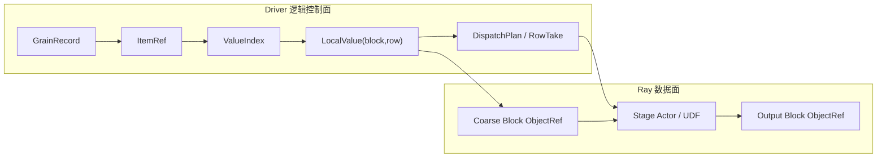
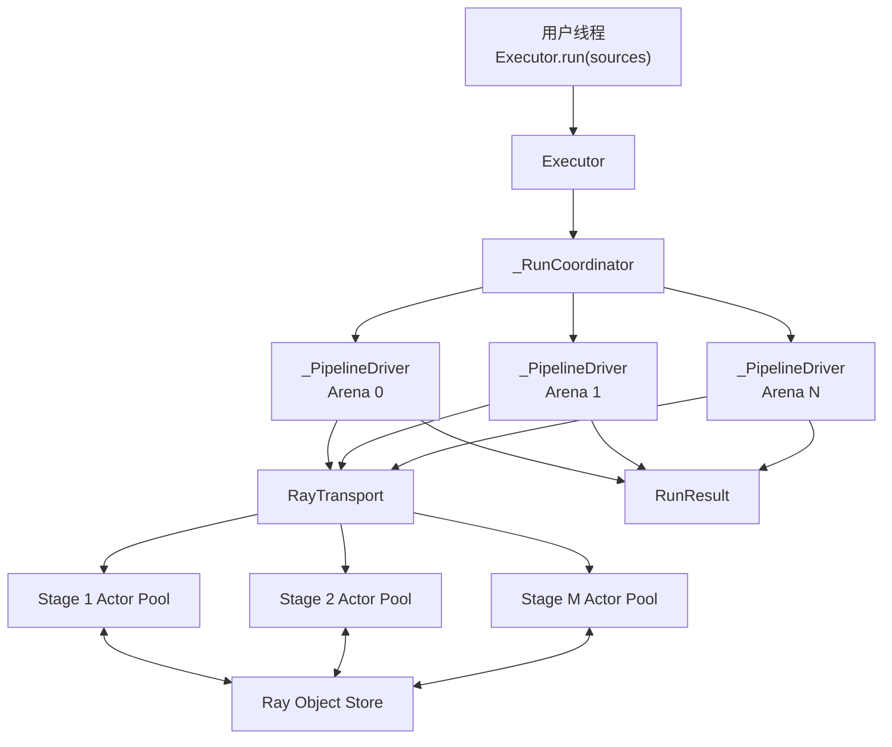
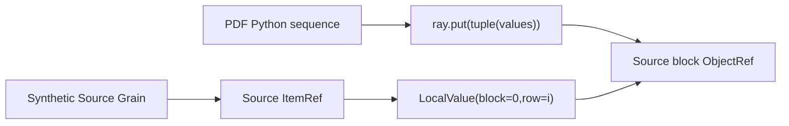
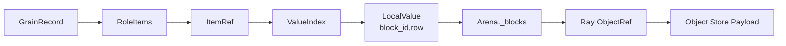
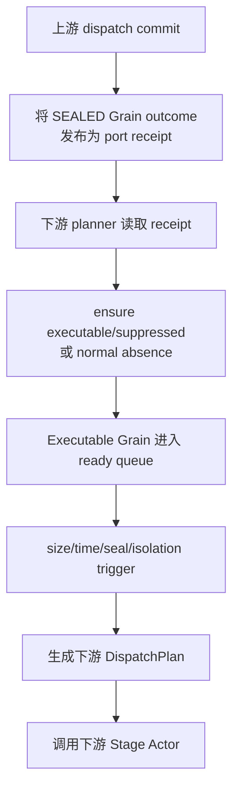
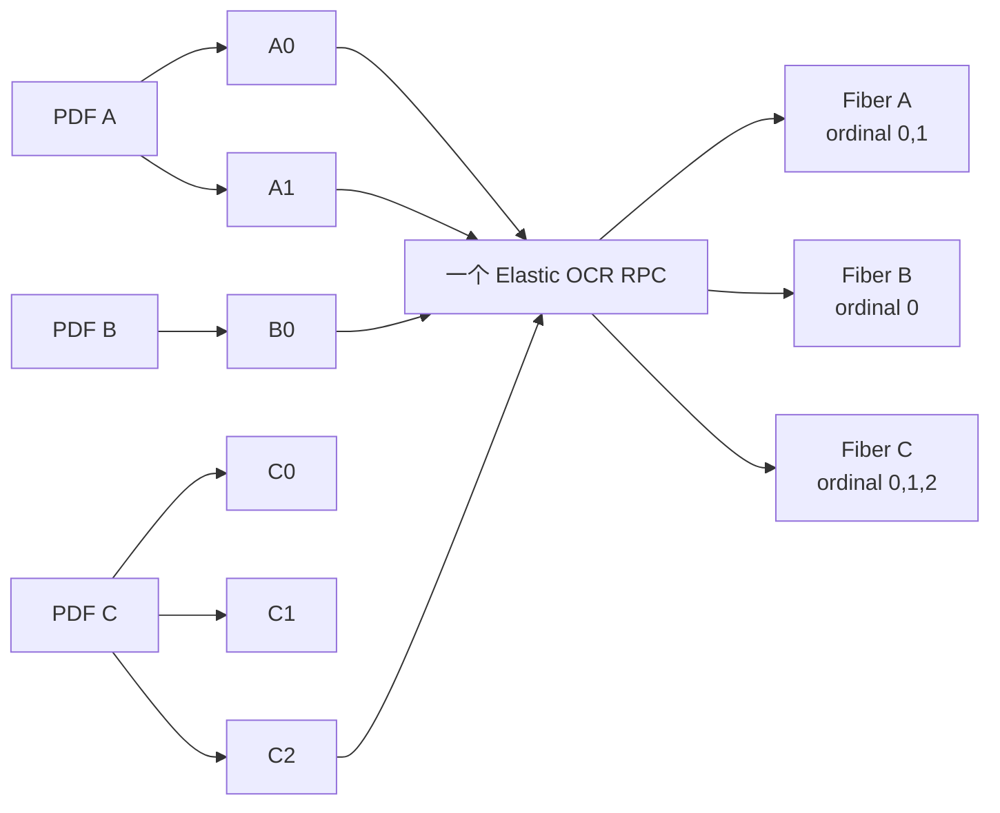
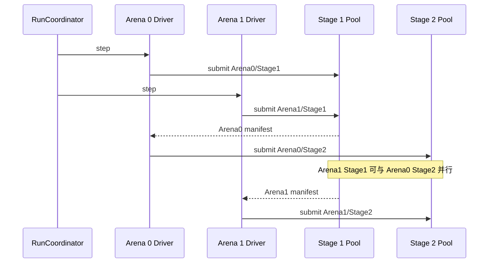
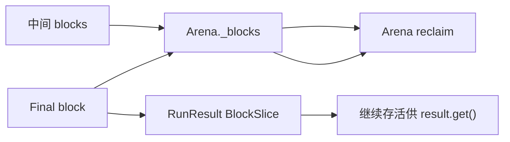
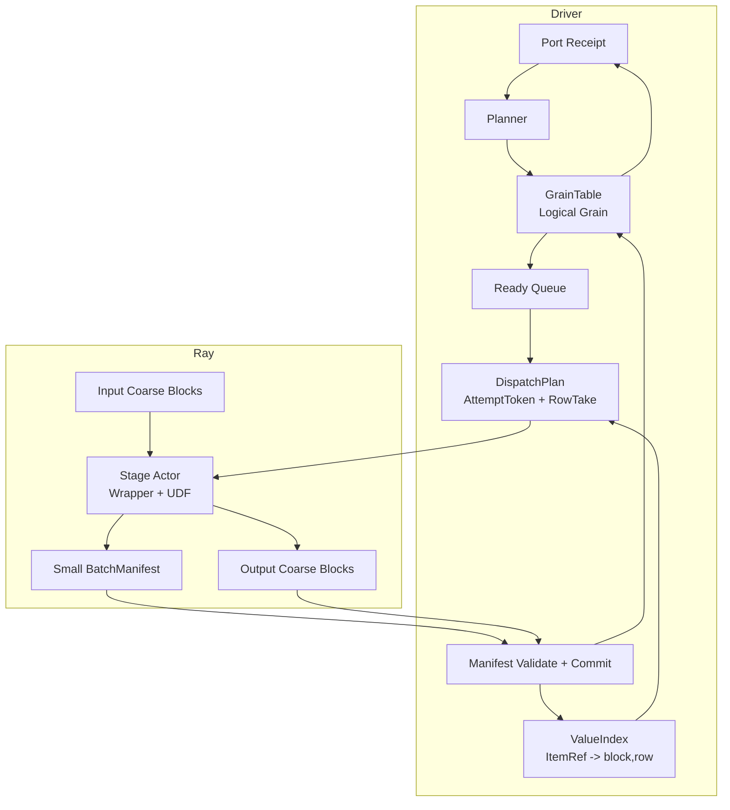

# Multigrain V2.5 Runtime 数据流 Review 手册

> 本文专门回答：
>
> 1. Driver、Stage、Actor 之间谁调用谁；
> 2. 用户业务负载存在哪里、如何跨 Stage 流动；
> 3. Logical Grain 存在哪里、是否会传给 Actor；
> 4. Driver 如何推进整条 Pipeline；
> 5. review 性能、正确性和内存问题时应该跟踪哪些数据结构。
>
> 更完整的源码模块和生命周期导读见：
>
> ```text
> docs/multigrain_v2_5_source_walkthrough.md
> ```

---

## 1. 最重要的心智模型

当前 V2.5 可以近似理解为：

```text
一个 Driver
  ├── 一个 RunCoordinator
  ├── 多个并发 Microbatch Arena
  └── 多个 Stage Actor Pool
        ├── Actor replica 0：RayWorker wrapper + UDF instance
        ├── Actor replica 1：RayWorker wrapper + UDF instance
        └── ...
```

这里的 Stage 对应一个 compiled node：

```text
Stage = NodeSpec + ExecutionOptions + Actor Pool
```

每个非 Source Stage 都有自己的 actor pool：

```text
node.execution.replicas
    ↓
RayTransport._actors[node.id]
    ↓
RayWorker × replicas
```

Actor 之间不直接通信。所有 Stage 推进都经过 Driver：

```text
上游 Actor 完成
→ Driver 收到 manifest
→ Driver commit
→ Driver 规划下游 Grain
→ Driver 调用下游 Actor
```

---

## 2. 两条相互分离的数据流

系统中同时存在两条流。

## 2.1 逻辑控制流

```text
ItemRef receipt
→ GrainRecord
→ READY queue
→ DispatchPlan
→ BatchManifest
→ Grain outcome
→ 新 ItemRef receipt
```

特点：

- 主要存在于 Driver Python 内存；
- 数据量较小；
- 记录 identity、lineage、状态和 row selector；
- 不包含 PDF、图片、tensor、OCR 文本等大 Payload。

## 2.2 用户业务数据流

```text
用户对象
→ Source coarse block
→ Ray ObjectRef
→ Stage Actor/UDF
→ Output coarse block
→ Ray ObjectRef
→ 下一个 Stage Actor/UDF
→ Final RunResult
```

特点：

- 主要存在于 Ray object store；
- UDF 执行时进入 worker CPU/GPU 内存；
- 不复制进 `GrainRecord`；
- Driver 正常只持有 ObjectRef，不读取中间大 Payload。

两条流通过以下映射连接：

```text
ItemRef
→ ValueIndex
→ LocalValue(block_id, row)
→ Arena._blocks[block_id]
→ ObjectRef
```



---

## 3. 整体调用关系



不存在：

```text
Stage 1 Actor → Stage 2 Actor
Stage Actor → Arena callback
Stage Actor → Driver pull request
```

Actor 只被动执行 Driver 提交的 RPC。

---

## 4. 用户输入最初存在哪里

假设用户调用：

```python
result = Executor(
    pipeline,
    microbatch_size=24,
    max_inflight_arenas=3,
).run(pdf_list)
```

刚进入 `Executor.run()` 时：

```text
pdf_list
```

仍然是 Driver 进程中的普通 Python sequence。

Executor 按 `microbatch_size` 切分：

```text
368 PDFs
microbatch_size = 24

SourceChunk 0 = PDF 0..23
SourceChunk 1 = PDF 24..47
SourceChunk 2 = PDF 48..71
...
```

每个 `_SourceChunk` 最终对应一个 Arena。

`max_inflight_arenas=3` 表示同一时刻最多有三个 active Arena，不表示跨 Arena 合批。

---

## 5. Source admission：Payload 第一次进入 Ray

每个 Arena admission 时，Driver 执行：

```python
ray.put(tuple(values))
```

得到一个 source block ObjectRef：

```text
Source block B0
├── row 0 = PDF 0
├── row 1 = PDF 1
├── row 2 = PDF 2
└── ...
```

同时，为每个 source row 创建一个已经 terminal 的 synthetic Source Grain。

例如 row 2：

```text
Source Grain S2
├── GrainId
├── output slot = ItemRef(source_port, source_entity_2)
└── outcome = Success(emission)
```

Arena 建立物理位置映射：

```text
ItemRef(source_port, source_entity_2)
    → LocalValue(block=0, row=2)

Arena._blocks[0]
    → ObjectRef(Source block B0)
```



重要的是：

- Source Grain 不保存 PDF；
- `ItemRef` 不保存 PDF；
- `LocalValue` 只保存 Arena 内 block id 和 row；
- 真正的 PDF Payload 位于 Ray object store block 中。

---

## 6. Grain 实际存在哪里

Grain 的长期 authority 在 Driver 的 Arena 中：

```python
Arena.grains: GrainTable
```

即：

```text
GrainId -> GrainRecord
```

一个典型 Map Grain：

```text
GrainRecord
├── id = Map GrainId
├── node = OCR node id
├── inputs
│   └── RoleItems(
│         role="primary",
│         items=(page ItemRef,)
│       )
├── output_slots
│   └── OCR output ItemRef
├── outcome = None
├── phase = READY
├── generation = 0
├── active = None
└── infra_failures = 0
```

GrainRecord 不包含：

```text
PDF bytes
page image
tensor
OCR result
ObjectRef
actor handle
GPU id
physical batch
packing order
```

因此：

> Grain 是 Driver 中的轻量逻辑账本，而不是用户 Payload 的容器。

---

## 7. 完整 Grain 会不会发送给 Actor

不会。

Actor 收到的是 Grain 的物理执行投影：

```text
DispatchPlan
```

典型结构：

```text
DispatchPlan
├── id: Arena 内的 dispatch id
├── node: Stage node id
└── entries
    ├── DispatchEntry
    │   ├── AttemptToken
    │   │   ├── arena
    │   │   ├── dispatch
    │   │   ├── grain
    │   │   └── generation
    │   └── role_takes
    │       └── RowTake(ref_slot, row)
    └── ...
```

Actor 通过 `AttemptToken.grain` 知道每个 entry 对应哪个 Logical Grain，但不持有完整
`GrainRecord`。

Actor 不知道：

- 这个 child 属于哪个 parent fiber；
- 当前 dispatch 为什么这样合批；
- 下游 node 是谁；
- Reduce 如何恢复顺序；
- 当前 Arena 还有多少 grain；
- 整张 DAG 的拓扑。

Actor 的职责只有：

```text
根据 RowTake 重建 UDF 输入
→ 执行 UDF
→ 规范化输出
→ 返回 manifest 和 output blocks
```

---

## 8. Driver 如何从 ItemRef 找到用户 Payload

Driver 持有如下映射链：



具体数据结构：

```text
ValueIndex
    ItemRef -> LocalValue

LocalValue
    block: Arena-local integer
    row: block 中的行号

Arena._blocks
    Arena-local integer -> ObjectRef 或 local tuple
```

为什么不直接做：

```text
ItemRef -> ObjectRef + row
```

当前设计给 ObjectRef 增加了 Arena-local block id 层，便于：

- 同一 block 在 dispatch 内去重；
- `RowTake.ref_slot` 使用紧凑的本次 RPC 参数下标；
- 单进程 executor 和 Ray executor 复用大部分逻辑；
- Arena 统一管理 block ownership。

---

## 9. 一个 Stage 如何生成一次 RPC

以 OCR Map Stage 为例。

## 9.1 Planner 创建 READY Grain

上游 page port 发布：

```text
BindingReceipt(
    state=PRESENT,
    item=ItemRef(page_port, page_entity),
)
```

Driver 调用 `plan_map()`，得到：

```text
PlanDecision(
    action=ENSURE_EXECUTABLE,
    grain=Map GrainRecord,
)
```

Arena 执行：

```text
GrainTable.ensure_executable()
→ ProducerIndex/ConsumerIndex register
→ enqueue_ready()
```

此时：

```text
Grain.phase = READY
```

## 9.2 Ready queue 形成 batch

假设：

```text
OCR ready queue
├── Grain(A-page-0)
├── Grain(B-page-0)
├── Grain(A-page-1)
└── Grain(C-page-0)
```

配置：

```text
batch_size = 4
batch_scope = elastic
```

Arena 选择四个 Grain 进入一个 dispatch。

这时发生的是：

```text
跨 parent 的 Grain packing
```

不是用户 Payload 在 Driver 中被复制、拼接。

## 9.3 Grain 进入 IN_FLIGHT

每个 Grain 执行：

```python
token = record.reserve(arena_id, dispatch_id)
```

状态变化：

```text
READY
  → generation + 1
  → active = AttemptToken
  → IN_FLIGHT
```

## 9.4 构造 RowTake

假设输入位置为：

```text
A-page-0 -> LocalValue(block=3, row=0)
B-page-0 -> LocalValue(block=5, row=2)
A-page-1 -> LocalValue(block=3, row=1)
C-page-0 -> LocalValue(block=7, row=0)
```

本次 RPC 去重后的 input block 参数：

```text
ref_slot 0 -> block 3 ObjectRef
ref_slot 1 -> block 5 ObjectRef
ref_slot 2 -> block 7 ObjectRef
```

Dispatch entries：

```text
A-page-0 -> RowTake(ref_slot=0, row=0)
B-page-0 -> RowTake(ref_slot=1, row=2)
A-page-1 -> RowTake(ref_slot=0, row=1)
C-page-0 -> RowTake(ref_slot=2, row=0)
```

同一个 block 只作为一个 RPC 参数传入。

---

## 10. 一次 Actor call 实际传递什么

实际调用形态：

```python
actor.run.remote(
    kind_value,
    output_arity,
    role_names,
    dispatch_plan,
    *input_block_object_refs,
)
```

## 10.1 控制面参数

| 参数 | 内容 |
|---|---|
| `kind_value` | Map/Filter/Expand/Reduce/Relate |
| `output_arity` | output port 数 |
| `role_names` | compiled role 顺序 |
| `dispatch_plan` | AttemptToken 和 RowTake |

这些由 Ray 序列化传给 actor，属于小型元数据。

## 10.2 数据面参数

```text
input_block_object_refs
```

是一个或多个 coarse block ObjectRef。

Driver 不需要：

```python
ray.get(input_block_ref)
```

再把业务值作为 Python list 发给 actor。ObjectRef 直接成为 actor task dependency，Ray
负责将 block 提供给执行 actor。

---

## 11. Worker wrapper 如何调用内部 UDF

Actor 内部结构：

```text
RayWorker
├── udf
│   └── 用户函数/对象，或 class 初始化后的实例
└── wrapper logic
    ├── 解析 RowTake
    ├── 重建 role columns
    ├── 调用 udf.run(...)
    ├── 校验 primitive ABI
    └── 生成 manifest
```

对于前述 OCR dispatch，wrapper 重建：

```python
primary_column = [
    block_3[0],  # A-page-0
    block_5[2],  # B-page-0
    block_3[1],  # A-page-1
    block_7[0],  # C-page-0
]
```

随后执行：

```python
ocr_udf.run(primary_column)
```

UDF 看见的是业务 value column，不会看见：

```text
ItemRef
GrainRecord
Arena
FiberBarrier
ObjectRef location
DispatchRuntime
```

这就是 value-only UDF contract。

---

## 12. 不同 Primitive 的 UDF 输入形状

| Primitive | UDF 输入形状 |
|---|---|
| Map | 一个 primary column，加可选 aligned side columns |
| Filter | 一个 target column，加可选 aligned side columns |
| Expand | 一个 parent column，加可选 aligned side columns |
| Reduce | anchor column、members list column、可选 aligned list columns |
| Relate | 多个 relation role columns |

Reduce 示例：

```python
anchors = [
    pdf_A,
    pdf_B,
]

members = [
    [page_A0_result, page_A1_result],
    [],
]

udf.run(anchors, members)
```

空 fiber 会以：

```python
members[i] == []
```

调用 Reduce，而不是跳过 Reduce。

---

## 13. Worker 输出存在哪里

假设 OCR UDF 返回：

```text
ocr-A0
ocr-B0
ocr-A1
ocr-C0
```

wrapper 将结果规范化并展平为一个 output block：

```text
OCR output block
├── row 0 = ocr-A0
├── row 1 = ocr-B0
├── row 2 = ocr-A1
└── row 3 = ocr-C0
```

同时生成：

```text
BatchManifest
├── dispatch id
├── GrainAck(A-page-0) -> Span(0,1)
├── GrainAck(B-page-0) -> Span(1,2)
├── GrainAck(A-page-1) -> Span(2,3)
├── GrainAck(C-page-0) -> Span(3,4)
└── column_lengths = (4,)
```

Ray task 使用多个返回值：

```text
return 0 = manifest ObjectRef
return 1 = output port 0 block ObjectRef
return 2 = output port 1 block ObjectRef
...
```

即：

> 每个 dispatch/output-port 一个 coarse block，而不是每个 grain 或 emission 一个
> ObjectRef。

---

## 14. Driver 收到结果后做什么

RayTransport 只等待 manifest：

```python
ray.wait(manifest_refs)
ray.get(ready_manifest_ref)
```

成功时不会 `ray.get` 大 output block。

Driver 调用：

```python
Arena.commit_external_manifest(
    plan,
    manifest,
    output_block_refs,
)
```

Commit 分三步。

## 14.1 检查 dispatch 是否仍然有效

对每个 entry 检查：

```text
GrainRecord.active == AttemptToken
```

结果：

```text
全部匹配   -> current
全部不匹配 -> stale，忽略结果
部分匹配   -> invariant violation，Arena abort
```

## 14.2 校验 manifest 和 primitive contract

包括：

- dispatch id；
- ack 数量；
- AttemptToken 顺序；
- output port 数；
- Span 连续性；
- block column length；
- Map/Reduce/Relate 每 port 每 grain 恰好一行；
- Filter 每 grain 为 0 或 1；
- Expand 所有 output port cardinality 相同；
- fan-out hard limit。

## 14.3 原子发布 CommitDelta

建立：

```text
ItemRef(output)
    -> LocalValue(new_block_id, output_row)

Arena._blocks[new_block_id]
    -> output ObjectRef
```

并更新：

```text
GrainRecord
    IN_FLIGHT -> SEALED
    outcome = Success(...)

ProducerIndex
PortIndex
ExpandOriginIndex
```

完整验证完成后才发布，避免下游看见半提交状态。

---

## 15. Driver 如何继续推进下一个 Stage

Commit 本身不会直接递归调用下游 actor。

下一轮 `_PipelineDriver.step()` 执行：

```text
1. publish terminal records
2. plan new grains
3. seal completed ports
4. dispatch ready batches
```



Driver 推进的是 receipt 和 grain，不是直接把上游 Python 输出塞进下游函数。

---

## 16. Port receipt 如何表达“有没有值”

每个 compiled output port 在 `_PipelineDriver` 中对应：

```text
_PortDomain
├── receipts: EntityId -> BindingReceipt
├── order: EntityId[]
└── sealed: bool
```

一个 logical occurrence 的状态可以是：

```text
PENDING
PRESENT
NORMAL_ABSENCE
FAILED
SUPPRESSED
```

含义：

| 状态 | 含义 |
|---|---|
| `PENDING` | 尚不能判断，可能稍后到达 |
| `PRESENT` | 有正常 value |
| `NORMAL_ABSENCE` | 正常没有 value，例如 Filter false |
| `FAILED` | producer grain 自身失败 |
| `SUPPRESSED` | producer 因 required dependency 失败而未执行 |

在 port seal 前：

```text
找不到 receipt -> PENDING
```

在 port seal 后：

```text
找不到 receipt -> NORMAL_ABSENCE
```

因此 port sealing 是判断 absence 和 Relate unmatched 的关键。

---

## 17. 各 Primitive 如何推进

## 17.1 Map

```text
primary PRESENT
required roles settled
→ 创建 Map Grain
→ READY
→ RPC
→ Success
→ output PRESENT
```

primary normal absence：

```text
不创建 Map Grain
→ output normal absence
```

## 17.2 Filter

Filter true：

```text
Filter Grain Success
→ 一个 emission
→ output PRESENT
```

Filter false：

```text
Filter Grain Success
→ 空 emissions
→ output NORMAL_ABSENCE
```

Filter false 不是 failure。

## 17.3 Expand

执行前：

```text
output_slots = ()
```

因为 cardinality 尚未知。

Worker 返回 N 个 child 后，Driver 使用：

```text
run_salt
node id
parent entity
ordinal
```

生成 child EntityId，并记录：

```text
ExpandOriginIndex
    child entity
      -> anchor ItemRef
      -> ordinal
      -> origin Expand GrainId
```

## 17.4 Reduce

每个 anchor occurrence 有一个 `FiberBarrier`：

```text
expected = N
present[ordinal]
dropped[ordinal]
failed[ordinal]
```

只有全部 N 个 ordinal settled 后才会：

- 无失败：创建 executable Reduce Grain；
- 有失败：创建 SEALED Suppressed Reduce Grain；
- Filter drop：不进入 members；
- N=0：创建 executable Reduce，members 为空 list。

Reduce 的 members 根据 ordinal 排序，不依赖物理完成顺序。

## 17.5 Relate

当前 bounded Relate 路径：

```text
等待所有 input/key port seal
→ Driver 读取 int key
→ Driver 枚举 Cartesian product
→ 创建 relation Grain
→ dispatch 到 Relate Actor
```

它是当前路径中 Driver 会读取部分业务数据的主要例外，但只应读取 bounded key 数据。

---

## 18. Elastic rebatching 时 Payload 和 Grain 如何变化

假设：

```text
PDF A -> page A0, A1
PDF B -> page B0
PDF C -> page C0, C1, C2
```

这些 page 可能分布在若干 Expand output blocks 中。

Logical Grain：

```text
OCR(A0)
OCR(A1)
OCR(B0)
OCR(C0)
OCR(C1)
OCR(C2)
```

`batch_scope="elastic"` 时，一个 OCR RPC 可以是：

```text
OCR(B0), OCR(A0), OCR(C2), OCR(A1)
```

DispatchPlan 只改变物理执行顺序，不改变：

- GrainId；
- EntityId；
- parent；
- ordinal；
- Reduce 顺序。



这里发生的是：

```text
Grain packing 跨 parent
Payload 通过 ObjectRef + RowTake 被选择
```

不是把所有 page 先复制到 Driver 再重新组 Python batch。

---

## 19. Multi-Arena 如何实现 Stage 流水线

假设：

```text
microbatch_size = 16
max_inflight_arenas = 4
```

Driver 同时维护最多四个 Arena：

```text
Arena 0
Arena 1
Arena 2
Arena 3
```

它们共享每个 Stage 的 actor pool。

可能出现：

```text
Arena 0 在 OCR Stage
Arena 1 在 Layout Stage
Arena 2 在 Expand Stage
Arena 3 等待某 Stage actor capacity
```



当前边界：

- Actor pool 跨 Arena 共享；
- 一个 dispatch 只属于一个 Arena；
- 当前没有跨 Arena elastic batching；
- Arena 可以乱序完成；
- 最终结果按 `_SourceChunk.index` 恢复 run 输入顺序。

---

## 20. Failure 时 Grain 和 Payload 如何处理

## 20.1 精确 BadRecordError

UDF 抛出：

```python
BadRecordError("bad page", index=i)
```

Worker 将 index 映射为该 entry 的 `AttemptToken`。

Driver：

```text
bad grain
    IN_FLIGHT -> SEALED Failed

同 RPC 健康 sibling
    IN_FLIGHT -> READY
    重新入队执行
```

失败 grain 不需要把失败 Payload 复制进 GrainRecord。`Failed` 只记录：

```text
kind
message
direct causes
```

原输入 Payload 仍由 Arena 的 input block ObjectRef 引用，直到 Arena reclaim。

## 20.2 Generic error 二分隔离

无法定位 index 时：

```text
原 batch Grain 全部回到 READY
→ 按 GrainId 顺序分成左右两组
→ 强制重新 dispatch
→ 递归到 singleton
```

隔离重试使用原有 input block 和 RowTake，不需要复制坏数据形成新 block。

## 20.3 Infrastructure failure

Actor/RPC 失败时：

```text
替换 actor
→ Grain infra_failures + 1
→ IN_FLIGHT -> READY
→ 新 dispatch
→ generation + 1
```

旧 RPC 如果迟到，其 AttemptToken generation 不再匹配，被判定为 stale。

---

## 21. 最终结果如何交付

当 final output ports 已 seal，且 Arena 没有 pending dispatch：

```python
driver.finish()
```

Driver 收集 final `PRESENT ItemRef`，转换成：

```text
BlockSlice
├── block = final output ObjectRef
└── row
```

`RunResult.outputs` 保存这些 `BlockSlice`。

只有用户调用：

```python
result.get()
```

才读取 final output block：

```python
ray.get(final_block_ref)
```

同一 final block 只读取一次，随后按 row 提取多个结果。

---

## 22. Microbatch 结束后什么会被释放

Arena delivery 前构建 detached `RunResult`，随后 `_reclaim()` 清理：

```text
GrainTable
Producer/Consumer/Port/Value indexes
ExpandOriginIndex
Arena._blocks 中的中间 ObjectRef
pending DispatchRuntime
ready queues
Fiber/planner derived state
source snapshots 的 Arena 内副本
```

final output block 的 ObjectRef 已复制到 `RunResult.outputs`，所以会继续存活。

准确的 ownership 语义：

> Arena 完成后释放中间 block 的 Arena ownership；final output block 继续由 RunResult
> 持有，直到 RunResult/ObjectRef 不再被引用。



---

## 23. Driver、Arena、Actor 分别维护什么

## 23.1 RunCoordinator

维护：

```text
尚未 admission 的 SourceChunk
active PipelineDriver
completed partial RunResult
max_inflight_arenas
跨 Arena 高水位指标
```

不维护单个 Grain 的 outcome。

## 23.2 PipelineDriver

维护：

```text
每个 port 的 receipt domain
已发布 terminal grain 集合
已完成 planner classification 的 candidate
Reduce FiberBarrier
Relate seal/planning 状态
```

负责：

```text
publish
plan
seal
dispatch
```

## 23.3 Arena

维护：

```text
GrainTable
lineage/port/value/origin indexes
block handles
ready queue
batch trigger
pending dispatch authority
retry/isolation state
commit
delivery/reclaim
```

## 23.4 RayTransport

维护：

```text
每个 node 的 actor pool
actor pending count
round-robin actor selection
manifest_ref -> RayPending
actor replacement
dispatch timeline
```

## 23.5 RayWorker Actor

长期维护：

```text
UDF instance
模型/GPU runtime
call count
```

每次调用临时维护：

```text
DispatchPlan
input blocks
role columns
UDF outputs
manifest
```

---

## 24. Review 时跟踪一次 Grain 的方法

建议同时记录以下三个 id：

```text
GrainId
AttemptToken
DispatchPlan.id
```

它们分别回答：

| ID | 回答的问题 |
|---|---|
| `GrainId` | 这是哪个 logical operation？ |
| `AttemptToken` | 这是该 Grain 的哪次 generation？ |
| `DispatchPlan.id` | 它当前被装进了哪次物理 RPC？ |

查一个 Grain 的输入 Payload：

```text
GrainRecord.inputs
→ RoleItems.items
→ ItemRef
→ ValueIndex.get(ItemRef)
→ LocalValue(block,row)
→ Arena._blocks[block]
→ ObjectRef
```

查一个输出属于哪个 parent：

```text
ItemRef.entity
→ ExpandOriginIndex.get(entity)
→ anchor
→ ordinal
→ origin Expand GrainId
```

查 output 为什么没有下游 Grain：

```text
GrainRecord.outcome
→ _publish_terminal_records()
→ _PortDomain receipt
→ planner decision
```

---

## 25. Review 常见问题

### 25.1 Actor 为什么空转

检查：

```text
ready queue 是否有 Grain
batch trigger 是否等待 timeout
actor pending capacity 是否已满
上游 port 是否未 seal
Arena 是否只有一个 in-flight
Stage replicas 是否匹配 pipeline 并行度
```

对应数据：

```text
Arena._ready
Arena._tail_wait_started_at
RayTransport._pending_by_actor
PortDomain.sealed
RunResult.timeline
```

### 25.2 为什么 RPC 太碎

检查 timeline 中：

```text
flush_reason
grains
node
arena
```

区分：

```text
full
timeout
port_sealed
arena_drain
isolation
```

### 25.3 为什么跨 parent 没有合批

检查：

```text
node.execution.batch_scope
这些 Grain 是否位于同一个 Arena
ready 时间是否重叠
batch_size 和 max_batch_wait_ms
```

即使是 `elastic`，当前也不会跨 Arena 合批。

### 25.4 为什么输出顺序错

检查：

```text
ExpandOrigin.ordinal
FiberBarrier.present/failed/dropped
present_members() 是否按 ordinal
物理 completion order 是否误入 identity/ordering
```

### 25.5 为什么内存没有立即下降

区分：

```text
Actor 内模型/GPU 常驻内存
Ray object store 中间 blocks
Arena._blocks 对 ObjectRef 的引用
RunResult 对 final blocks 的引用
Ray 自身 object spilling/reference counting
```

Arena reclaim 只保证释放 Arena 对中间 block 的引用，不保证 actor 模型或 final result
立刻释放。

---

## 26. 最后用一张图概括



可以用一句话描述整个推进过程：

> Driver 用 Grain 和 receipt 决定“下一步应该执行什么”，用 `ItemRef -> block,row`
> 决定“它的数据在哪里”；Stage Actor 只接收 row selector 和 coarse ObjectRef，执行
> value-only UDF，再用小 manifest 告诉 Driver 每个 Grain 输出了哪些行。

