# Multigrain V2.5 源码导读：Actor 通信、数据结构与生命周期

> 本文面向准备直接 review、调试和修改 V2.5 原型源码的开发者。
>
> 对应代码目录：
>
> ```text
> rayorch/experimental/multigrain_v2_5/
> ```
>
> 本文按当前分支实现编写，重点描述“代码现在实际怎么运行”，而不是重复架构愿景。

## 1. 先记住五个结论

1. **Actor 之间不互相调用。**  
   所有调度都经过 driver：driver 选择一个 node 的 actor，发起 RPC，收到 manifest，
   提交结果，再规划下游 grain。

2. **一个非 Source node 对应一个独立 actor pool。**  
   `replicas=N` 会为该 node 创建 N 个 `RayWorker`；多个 Arena 共享这些 actor pool。

3. **每次 RPC 可以包含多个 Logical Grain。**  
   `DispatchPlan` 是小型控制面元数据；业务值放在 coarse block 中，通过
   `ObjectRef` 传输。不存在 per-grain `.remote()` 或 per-emission ObjectRef。

4. **driver 通常只读取 manifest，不读取中间业务值。**  
   每个 dispatch 返回一个小 manifest 和每个 output port 一个大 block。例外是当前
   bounded `Relate` 的 key 提取路径，它会在 driver 上 `ray.get` key block。

5. **语义状态和物理执行状态分开保存。**  
   `GrainRecord` 记录 Logical Grain；`DispatchRuntime`、`RayPending`、ObjectRef、
   ready queue 等物理状态全部保存在 Arena/Transport，而不进入 grain identity。

---

## 2. 推荐阅读顺序

```text
api.py
  用户 DAG 写法、trace、配置捕获

graph.py
  CompiledGraph、NodeSpec、planner、primitive cardinality contract

grain.py
  Logical Grain、identity、lineage index、FiberBarrier

worker.py
  RPC DTO、worker 输入重建、UDF ABI、manifest 生成

executor.py
  Arena、driver event loop、RayTransport、multi-Arena coordinator

metrics.py
  timeline 与核心指标
```

如果只想先理解 Ray 路径，建议按下面的方法阅读：

```text
Executor.run
→ _RunCoordinator.run
→ _PipelineDriver.step
→ Arena.reserve_dispatch
→ RayTransport.submit
→ RayWorker.run
→ RayTransport.poll_one
→ Arena.commit_external_manifest
```

---

## 3. 整体分层

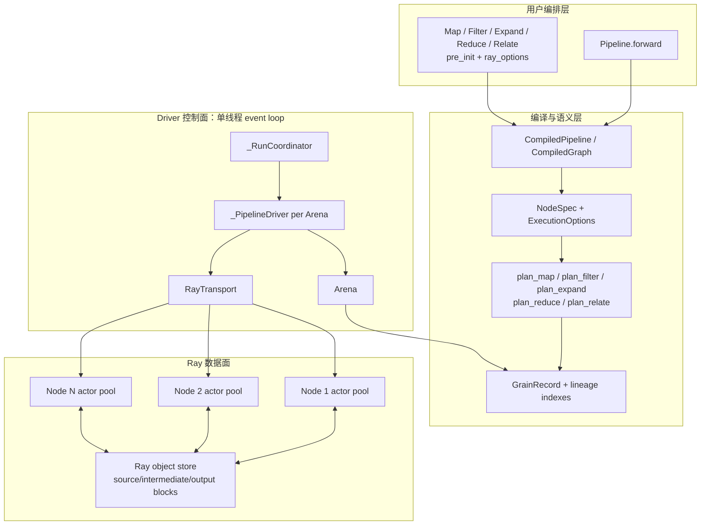

### 3.1 编译层

`Pipeline.compile()` 通过执行一次符号化的 `forward()` 构造 DAG：

- 每个 `forward` 参数先变成一个内部 `Primitive.SOURCE` node；
- 每次调用配置好的 primitive，向 `_TraceContext.nodes` 追加一个 `NodeSpec`；
- node id 按 trace 顺序递增；
- `PortId(node, slot)` 同时是静态图中的 edge 标识；
- `compile_graph()` 校验拓扑、role、输出 port 和 Reduce origin path。

Source 是 compiled graph 中的内部 node，但不会创建 Source actor，也不会执行 Source
RPC。source value 由 driver 直接 `ray.put` 到 object store。

### 3.2 Driver 控制面

driver 是同步、单线程、single-writer event loop：

- `_RunCoordinator` 在一个 run 内管理多个并发 Arena；
- 每个 Arena 有一个 `_PipelineDriver`；
- 所有 driver 共享一个 `RayTransport` 和同一组 actor pool；
- driver 不使用“一 node 一个线程”或“一 actor 一个线程”；
- 并发来自多个已经提交、由 Ray 并行执行的 actor RPC。

### 3.3 Ray 数据面

每个非 Source node 都有自己的 actor pool：

```text
node.execution.replicas
    ↓
RayTransport._actors[node_id]
    ↓
RayWorker × replicas
```

当前 actor 配置：

- `max_concurrency=1`；
- `max_restarts=0`；
- actor task `max_task_retries=0`；
- transport 默认 `max_pending_per_actor=1`；
- actor 故障后由 driver 侧 `_replace_actor()` 显式替换。

这里的“persistent actor”是指：**在一次 `Executor.run()` 内跨 dispatch、跨 Arena
复用**。当前每次新的 `Executor.run()` 都会新建 `RayTransport` 和 actor，结束时
`shutdown()`。

---

## 4. 谁调用谁

### 4.1 通信关系图

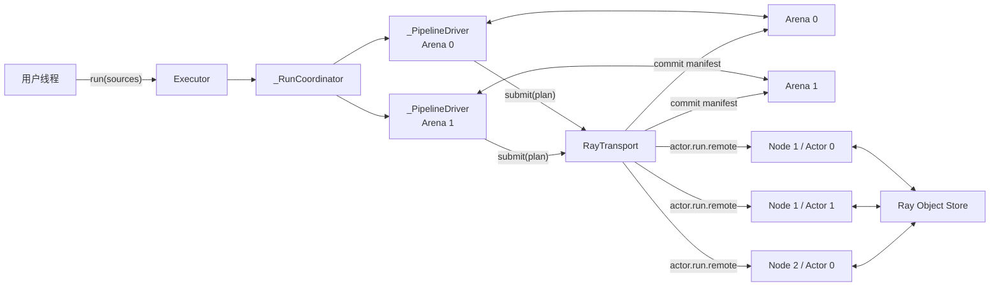

明确没有以下调用：

```text
Actor A ─X→ Actor B
Actor ─X→ _PipelineDriver callback
Actor ─X→ Arena
```

Actor 只接收 driver 发起的 `run.remote()`，调用自己的 UDF，然后把结果交给 Ray。
driver 使用 `ray.wait()` 主动轮询完成的 manifest。

### 4.2 一次成功 RPC 的完整时序

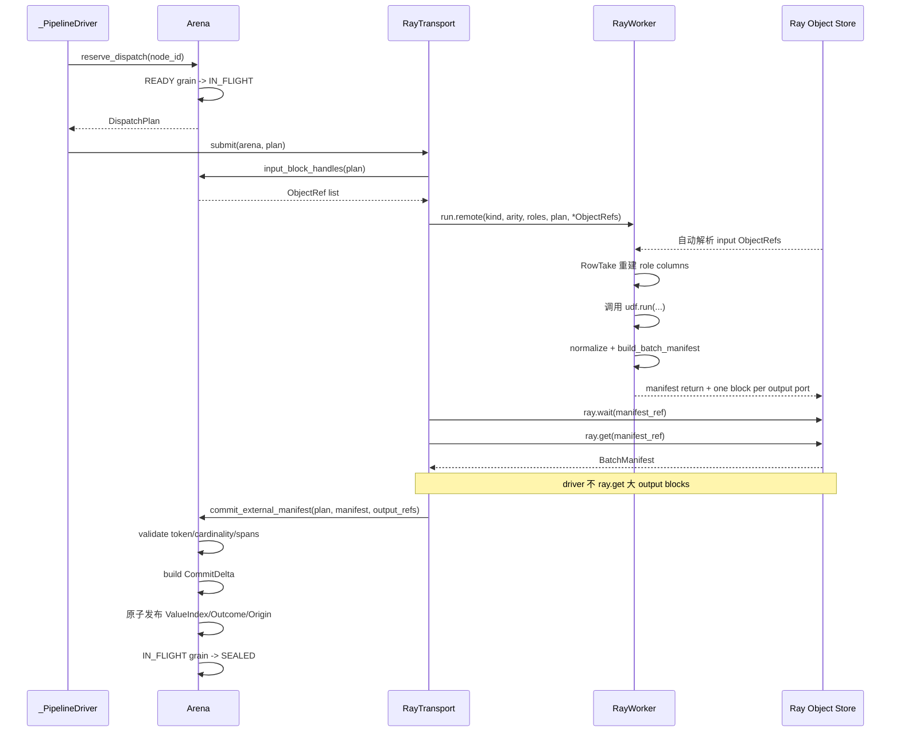

### 4.3 下游 node 如何拿到上游数据

Actor 不把业务值直接发给下游 actor。流程是：

1. 上游 actor 返回 output block ObjectRef；
2. Arena 给这个 block 分配一个 arena-local integer block id；
3. `ValueIndex` 记录 `ItemRef -> LocalValue(block_id, row)`；
4. 规划下游 dispatch 时，Arena 把所有输入位置压缩成 `RowTake(ref_slot, row)`；
5. `RayTransport` 将 block id 换回 ObjectRef；
6. 下游 actor 收到 ObjectRef 指向的 block，并根据 `RowTake` 取行。

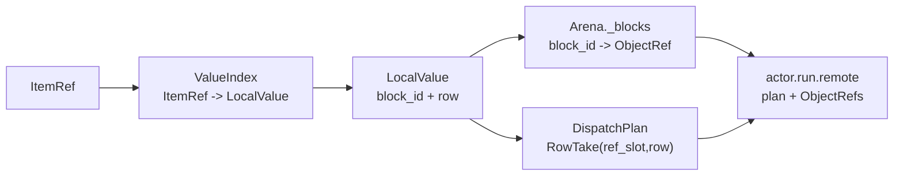

---

## 5. 每次 call 传播什么数据

## 5.1 Actor 构造调用

RayTransport 为每个非 Source node 创建 `replicas` 个 actor：

```python
RayWorker.remote(
    target,
    init_args,
    init_kwargs,
)
```

| 字段 | 含义 | 负载类型 |
|---|---|---|
| `target` | UDF 函数、可调用对象或 class | 配置/代码引用 |
| `init_args` | `.pre_init(*args)` 捕获的参数 | 初始化数据 |
| `init_kwargs` | `.pre_init(**kwargs)` 捕获的参数 | 初始化数据 |

如果 `target` 是 class，actor 构造时实例化一次；否则直接保存 target。该实例会在一次
run 内被这个 actor 的所有 dispatch 复用。

## 5.2 正常执行调用

实际 actor 方法：

```python
RayWorker.run(
    kind_value,
    output_arity,
    role_names,
    plan,
    *input_blocks,
)
```

| 参数 | 内容 | 大小特征 |
|---|---|---|
| `kind_value` | `"map"`、`"filter"`、`"expand"` 等 | 常量级 |
| `output_arity` | output port 数 | 常量级 |
| `role_names` | compiled role 顺序 | 小元数据 |
| `DispatchPlan` | grain token 和输入 row selector | 随 grain/输入 occurrence 线性增长 |
| `input_blocks` | coarse block ObjectRef | 业务数据，不经过 driver Python 堆复制 |

### `DispatchPlan`

```text
DispatchPlan
├── id: dispatch id，Arena 内递增
├── node: node id
└── entries: tuple[DispatchEntry, ...]
    └── DispatchEntry
        ├── token: AttemptToken
        │   ├── arena
        │   ├── dispatch
        │   ├── grain
        │   └── generation
        └── role_takes: tuple[role][RowTake, ...]
            └── RowTake
                ├── ref_slot
                └── row
```

`ref_slot` 不是 object store id，而是本次 RPC 的 `input_blocks` 参数下标。同一个 block
被多个 grain/role 使用时，只传一个 ObjectRef，多个 `RowTake` 复用它。

因此控制面复杂度近似为：

```text
O(dispatch 中 grain 数 + 所有 role 的输入 occurrence 数)
```

而不是业务 value 字节数。

## 5.3 Worker 内部重建出的 UDF 输入

`_role_columns()` 将物理 block 和 `RowTake` 还原成 UDF 的 column-major 输入：

```text
role_columns[role_index][grain_index]
```

常见形状：

| Primitive | UDF 输入 |
|---|---|
| Map | `run(primary_column, side_column, ...)` |
| Filter | `run(target_column, side_column, ...)` |
| Expand | `run(parent_column, side_column, ...)` |
| Reduce | `run(anchor_column, members_column, aligned_column, ...)` |
| Relate | `run(role_a_column, role_b_column, ...)` |

Reduce 的 `members_column[grain_index]` 是一个有序 list，可以为空。Reduce 的 anchor
是单 value。当前 Reduce 的 anchor 之后的角色都按 variadic role 重建为 list。

## 5.4 UDF 返回 ABI

### Map / Reduce / Relate

单 output：

```text
[grain_value, grain_value, ...]
```

多 output，固定 port-major：

```text
(
    [port0_grain0, port0_grain1, ...],
    [port1_grain0, port1_grain1, ...],
)
```

每个 grain、每个 port 必须恰好一行。

### Filter

```text
[True, False, ...]
```

worker 将 `True` 归一化为一行输出，将 `False` 归一化为空输出。

### Expand

单 output：

```text
[
    [grain0_child0, grain0_child1, ...],
    [grain1_child0, ...],
]
```

多 output，同样固定 port-major：

```text
(
    [grain0_port0_children, grain1_port0_children, ...],
    [grain0_port1_children, grain1_port1_children, ...],
)
```

同一 grain 的所有 Expand output port 必须具有相同 child 数量；driver commit 时再次
校验每个 port 的 cardinality 一致。

## 5.5 Worker 返回

正常返回在 Ray 层表现为：

```text
1 个 manifest ObjectRef
+ 每个 output port 1 个 output block ObjectRef
```

`BatchManifest`：

```text
BatchManifest
├── dispatch
├── acks: tuple[GrainAck, ...]
│   ├── token
│   └── spans_by_port
│       └── Span(start, stop)
├── column_lengths
├── worker_started_at
├── worker_finished_at
└── worker_rss_bytes
```

output block 是一个按 port 展平的 tuple。`Span(start, stop)` 说明某个 grain 在该 port
的行区间。这样 Expand 可以返回 0、1 或 N 行，同时每个 dispatch/port 仍只有一个
coarse block。

错误返回：

```text
DispatchErrorReport
├── dispatch
├── kind
│   ├── bad_record
│   ├── contract
│   └── generic_udf
├── bad_token: AttemptToken | None
└── message
```

发生错误时，output port 对应的返回 block 是空 tuple。

---

## 6. 一个具体的 Expand rebatching 例子

假设一个 source Arena 有两个 PDF：

```text
pdf-A -> 2 pages
pdf-B -> 1 page
```

Expand dispatch 返回：

```text
page block B1:
row 0 = A-page-0
row 1 = A-page-1
row 2 = B-page-0

manifest:
grain(pdf-A) -> Span(0, 2)
grain(pdf-B) -> Span(2, 3)
```

Arena 提交后建立：

```text
ItemRef(A-page-0) -> LocalValue(B1, 0)
ItemRef(A-page-1) -> LocalValue(B1, 1)
ItemRef(B-page-0) -> LocalValue(B1, 2)
```

后续 Map 的 `batch_scope="elastic"` 可以按 ready 顺序把不同 parent 的 page 放进同一个
RPC，例如：

```text
DispatchEntry 0 -> RowTake(ref_slot=0, row=2)  # B-page-0
DispatchEntry 1 -> RowTake(ref_slot=0, row=0)  # A-page-0
DispatchEntry 2 -> RowTake(ref_slot=0, row=1)  # A-page-1
```

物理执行顺序可以改变，但 Logical Grain identity 不包含 dispatch、actor、batch 或
completion order。Reduce 最后使用 `ExpandOrigin.ordinal` 和 `FiberBarrier` 恢复：

```text
pdf-A members = [A-page-0-result, A-page-1-result]
pdf-B members = [B-page-0-result]
```

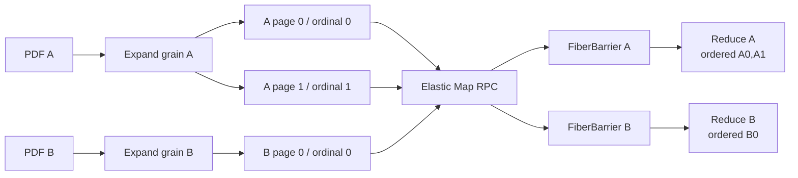

---

## 7. 核心语义数据结构

## 7.1 Identity 与引用

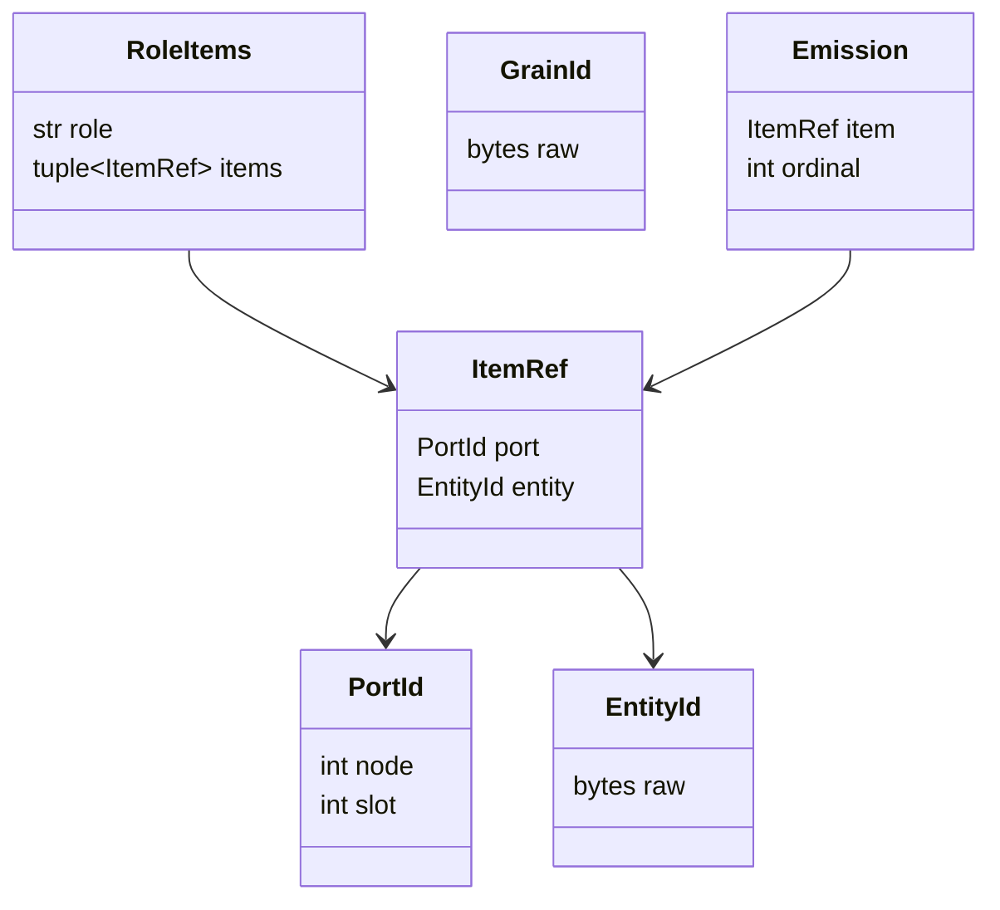

- `PortId`：静态 DAG 中的一个 output port；
- `EntityId`：某个 logical occurrence 的跨 entity-preserving node 对齐键；
- `ItemRef`：`PortId + EntityId`，表示“某实体在某 port 上的 logical item”；
- `RoleItems`：一个 grain 的 role-tagged 输入；
- `GrainId`：由 node 和 logical input bindings 确定；
- `Emission`：成功 grain 在某 output port 发出的 item 和 ordinal。

`EntityId` 不等于业务主键，也不等于 object store 地址。

## 7.2 GrainRecord

```text
GrainRecord
├── 语义字段
│   ├── id
│   ├── node
│   ├── inputs: tuple[RoleItems, ...]
│   ├── output_slots: tuple[ItemRef, ...]
│   └── outcome: Success | Failed | Suppressed | None
└── 短生命周期字段
    ├── phase: READY | IN_FLIGHT | SEALED
    ├── generation
    ├── active: AttemptToken | None
    └── infra_failures
```

它不保存：

- actor handle；
- ObjectRef；
- DispatchId 之外的物理历史；
- physical batch；
- selector；
- checkpoint；
- recovery graph。

## 7.3 Outcome

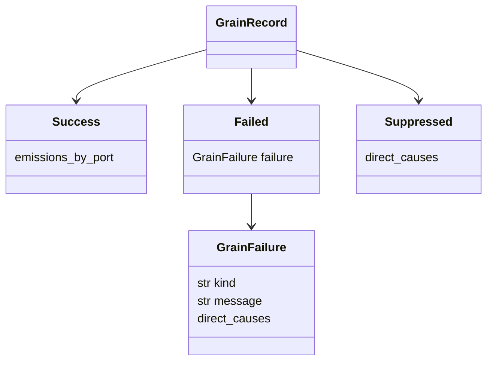

- `Success`：该 grain 正常结束；某些 port 的 emission 可以为空；
- `Failed`：该 grain 自身执行失败；
- `Suppressed`：该 grain 因 required dependency 失败而不执行；
- Filter false 是 `Success(empty emissions)`，不是 Failed 或 Suppressed。

---

## 8. Arena 持有什么

Arena 是一个 bounded microbatch 的语义和物理 authority。

| 成员 | 记录内容 | 是否事实源 |
|---|---|---|
| `grains: GrainTable` | 所有 Logical Grain 及其生命周期/outcome | 是，grain 语义事实 |
| `producers: ProducerIndex` | `ItemRef -> GrainId` | derived lineage index |
| `consumers: ConsumerIndex` | `ItemRef -> consumer GrainId[]` | derived index；当前不驱动调度 |
| `ports: PortIndex` | `PortId + EntityId -> emitted ItemRef` | derived index |
| `values: ValueIndex` | `ItemRef -> LocalValue(block,row)` | 物理位置索引 |
| `expand_origins` | child entity -> anchor/ordinal/origin grain | Reduce/rebatch 派生索引 |
| `_blocks` | arena-local block id -> local tuple 或 ObjectRef | 物理 block ownership |
| `_dispatches` | dispatch id -> `DispatchRuntime` | pending dispatch authority |
| `_ready/_ready_set` | node -> READY GrainId queue/set | 调度缓存 |
| `_tail_wait_started_at` | node -> tail batch 首次等待时间 | batch trigger 状态 |
| `_forced` | isolation 强制 dispatch group | 二分隔离状态 |
| `_sources` | detached source snapshots | delivery 数据 |
| timing/metrics maps | admission/completion/flush 统计 | 观测状态 |

### 8.1 GrainTable 的幂等语义

planner 每轮可以反复遇到同一个 logical candidate：

- `ensure_executable()` 遇到相同 GrainId 和相同语义字段时返回已有 record；
- `ensure_suppressed()` 同理；
- 已有 executable grain 不能在下一轮变成 suppressed；
- 同 GrainId 不能改变 inputs/output slots/outcome 分类。

所以 `_PipelineDriver.planned` 是加速和完成判定缓存，不是唯一语义事实源。

### 8.2 `_PortDomain`

每个 compiled output port 都有一个 driver-side `_PortDomain`：

```text
_PortDomain
├── receipts: EntityId -> BindingReceipt
├── order: EntityId[]
└── sealed: bool
```

Receipt 有五种状态：

```text
PENDING
PRESENT
NORMAL_ABSENCE
FAILED
SUPPRESSED
```

其中 `PENDING` 通常不是存入 domain 的事实，而是 `_domain_receipt()` 在 port 尚未
sealed、又没找到 entity 时临时构造的判断。

### 8.3 `FiberBarrier`

每个 Reduce anchor occurrence 对应一个 barrier：

```text
FiberBarrier
├── expected: origin Expand 的 N，或 None
├── present: ordinal -> final members ItemRef
├── dropped: ordinal set
├── failed: ordinal -> (members ItemRef, terminal receipt GrainId)
└── blocked_by: origin Expand failure GrainId
```

状态：

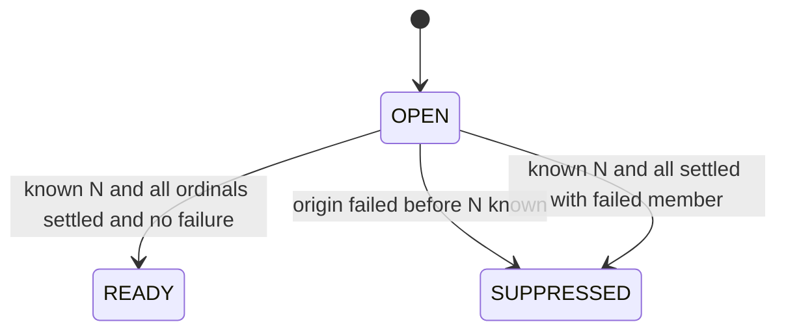

`present_members()` 按 ordinal 排序；Filter drop 只进入 `dropped`，不会进入 Reduce
members；known-N failure 的 suppression cause 也按 ordinal 排序。

---

## 9. 物理执行数据结构

## 9.1 DispatchRuntime

由 Arena 持有，生命周期只覆盖一个 pending dispatch：

```text
DispatchRuntime
├── plan: immutable DispatchPlan
├── input_blocks: arena-local block ids
├── pending_handle
├── output_blocks
├── isolation
└── flush_reason
```

当前 Ray 路径真正的 pending Ray handle 保存在 `RayTransport._pending`；
`DispatchRuntime.pending_handle` 仍是预留字段。`output_blocks` 在 commit 时写入，
随后 dispatch runtime 立即从 `_dispatches` 删除，因此目前主要用于 authority
结构完整性，不是长期 ownership ledger。

## 9.2 RayPending

由 RayTransport 持有：

```text
RayPending
├── arena
├── plan
├── node
├── actor_index
├── manifest_ref
├── output_refs
└── submitted_at
```

`manifest_ref` 是 `_pending` dict 的 key。manifest ready 后：

1. 从 `_pending` 删除；
2. actor pending count 减一；
3. 读取 manifest；
4. 成功则把 output refs 交给 Arena commit；
5. error/infra failure 则调用 Arena 对应处理方法。

## 9.3 CommitDelta

Arena 先完整验证 manifest，再构造 delta：

```text
CommitDelta
├── blocks
├── values
├── outcomes
└── origins
```

之后 `_apply_commit_delta()` 在一个 driver event-loop turn 中发布：

- output block handle；
- `ItemRef -> LocalValue`；
- Grain Success outcome；
- Producer/Port index；
- Expand origin。

这避免“部分 value 已发布、grain 还未 seal”的中间可见状态。

---

## 10. 生命周期

## 10.1 一次 run

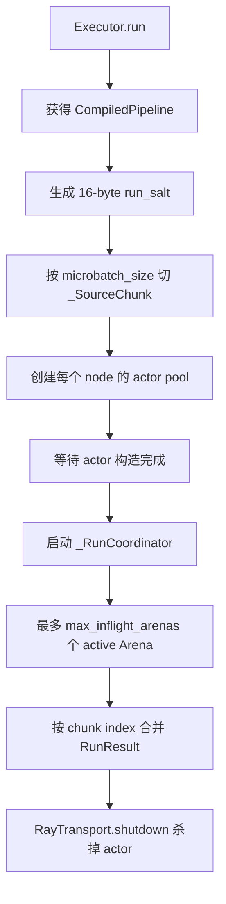

注意：

- 同一个 run 的所有 Arena 共用一个 `run_salt`；
- source position 使用 chunk 在整个 run 中的起始 offset，因此不会在每个 Arena 从 0
  重启；
- Arena 可以乱序完成，但 `_merge_partial_results()` 按 chunk index 合并输出；
- 不同 Arena 不会合成同一个 dispatch，当前 elastic rebatching 只发生在单个 Arena 内。

## 10.2 Arena 生命周期

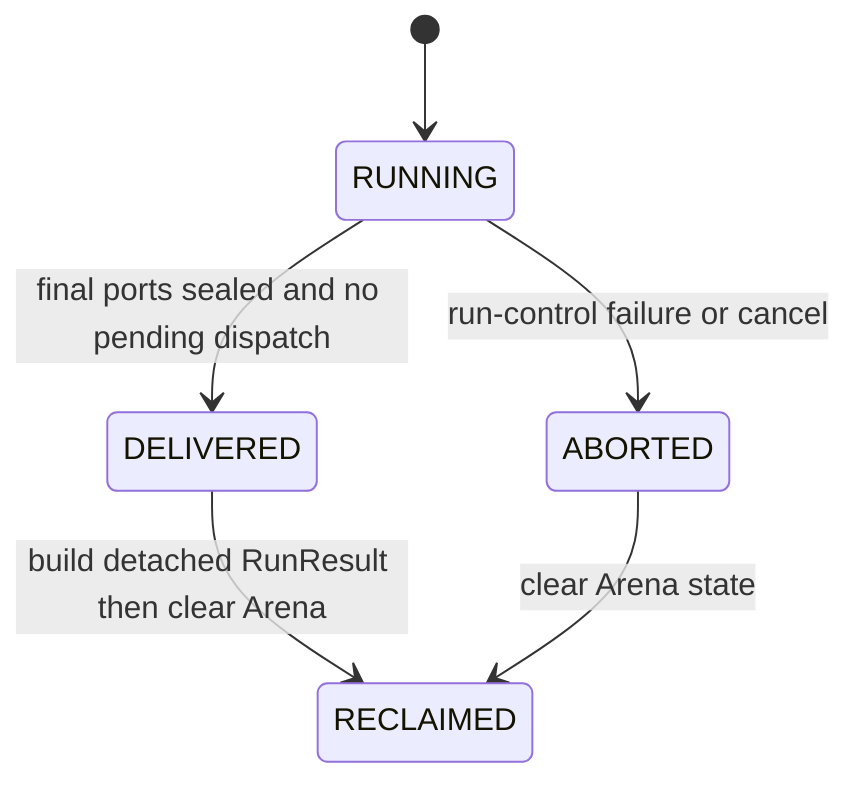

实现中 `_deliver()` 先设置 `DELIVERED`，紧接着 `_reclaim()`，所以调用返回后 Arena
实际已经是 `RECLAIMED`。`DELIVERED` 是过渡状态。

## 10.3 Grain 生命周期

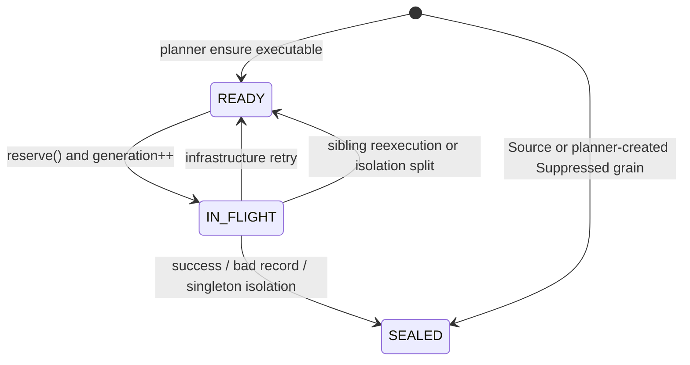

`AttemptToken(arena, dispatch, grain, generation)` 是 stale-result fencing 的依据：

- 当前 token 全部不匹配：整个结果是 `STALE`，忽略；
- token 全部匹配：可以 commit；
- 同一个 dispatch 部分匹配、部分 stale：说明原子性被破坏，Arena abort。

## 10.4 Port 生命周期

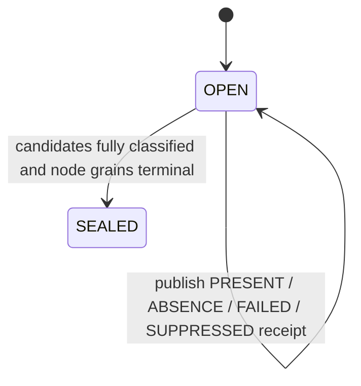

port sealed 以后，一个不存在的 entity 可以被确定为 `NORMAL_ABSENCE`；sealed 以前只能
判定为 `PENDING`。这也是 Relate 必须等输入 port seal 后才能确认 unmatched 的原因。

## 10.5 Block 生命周期

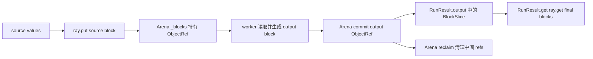

当前 ownership 粒度是 Arena：

- source 和中间 block ObjectRef 通常保留到 Arena delivery；
- Arena 完成后 `_reclaim()` 清空 `_blocks`，释放中间 ObjectRef 的 driver 引用；
- final output 的 ObjectRef 被复制到 `RunResult.outputs` 的 `BlockSlice`，因此会继续存活；
- `RunResult.get()` 读取 final block，但不会主动删除 `RunResult` 中的 ObjectRef；
- 真正释放 final block 仍取决于 `RunResult`/ObjectRef 不再被引用以及 Ray 的引用计数。

所以准确说法是：

> microbatch/Arena 结束后释放中间 block 的 Arena ownership；最终输出 block 为了 delivery
> 会继续由 RunResult 持有。

---

## 11. 调度、batch trigger 与流水线并行

## 11.1 Ready queue

`Arena._ready[node_id]` 保存该 node 的 READY GrainId。入队幂等由
`_ready_set[node_id]` 保证。

dispatch flush 原因：

| 原因 | 条件 |
|---|---|
| `full` | candidate 数达到 node `batch_size` |
| `timeout` | 未满 batch，但超过 `max_batch_wait_ms` |
| `port_sealed` | 上游 admission 已关闭，冲掉尾 batch |
| `arena_drain` | 显式 draining 路径 |
| `isolation` | generic error 二分出来的强制 group |

## 11.2 Elastic 与 parent-bound

`batch_scope="elastic"`：

- 直接从 node ready queue 取 candidate；
- 不关心 candidate 属于哪个 Expand parent；
- 同一个 RPC 可以混合多个 parent 的 children。

`batch_scope="parent_bound"`：

- 通过 `ExpandOriginIndex` 按 origin anchor 分组；
- 不同 parent fiber 的 child 不进入同一 RPC。

两种模式只改变 physical packing，不改变 GrainId、EntityId、lineage 或 Reduce order。

## 11.3 Multi-Arena 流水线

```mermaid
gantt
    title 两个 Arena 共享不同 node actor pool 的示意
    dateFormat X
    axisFormat %L

    section Arena 0
    Node 1 RPC :a01, 0, 3
    Node 2 RPC :a02, 3, 6

    section Arena 1
    Node 1 RPC :a11, 3, 6
    Node 2 RPC :a12, 6, 9
```

典型 overlap 是：

```text
Arena 0 正在 Node 2 actor 上执行
Arena 1 同时在 Node 1 actor 上执行
```

`_RunCoordinator` 负责：

- 保持最多 `max_inflight_arenas` 个 active Arena；
- 逐个调用 active driver 的 `step()`；
- 使用共享 transport 轮询任意一个完成的 manifest；
- Arena 完成后立刻 delivery/reclaim，并补充新 Arena；
- 某 Arena run-control abort 时 fail-fast cancel 其他 active Arena。

当前没有：

- 跨 Arena 合批；
- actor 主动向 driver 拉任务；
- node 级 driver 线程；
- actor 间 direct pipeline。

---

## 12. Failure、isolation 与 retry

## 12.1 精确 bad record

UDF 可以抛：

```python
BadRecordError("message", index=i)
```

worker 将 `index` 转成该 dispatch entry 的 `AttemptToken`。driver 收到
`bad_record` 后：

- bad grain -> `Failed(kind="bad_record")`；
- 同 RPC 健康 sibling -> `READY` 并重新入队；
- 下游 required dependency 看到 failed receipt 后创建 `Suppressed` grain；
- 不相关 fiber 可以继续。

## 12.2 Generic error 二分隔离

`error_policy="isolate"` 时：

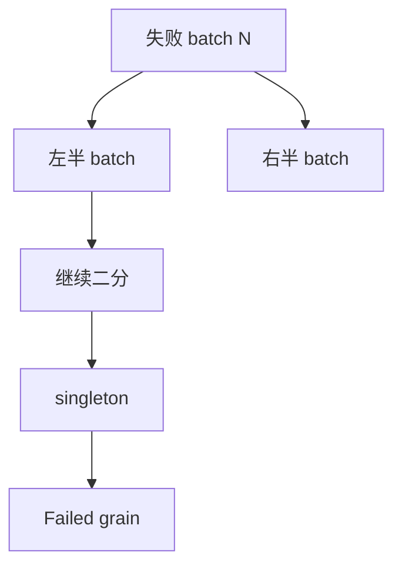

原 batch 中的 grain 从 `IN_FLIGHT` 释放回 `READY`，然后进入 `_forced` group。分组使用
原 dispatch 的 grain 顺序，不走普通 elastic packing，直到成功或 singleton 失败。

## 12.3 Infrastructure failure

manifest ObjectRef `ray.get` 失败时：

1. RayTransport 替换对应 actor；
2. Arena 检查 `max_infra_retries`；
3. 每个 grain 增加 `infra_failures`；
4. grain 回到 READY；
5. 下次 reserve 获得新 generation 和新 AttemptToken。

当前 `ExecutionOptions.max_retries` 已进入 compiled schema，但这条执行路径实际使用的是
`ArenaLimits.max_infra_retries`。

---

## 13. 各对象的所有者和作用域

| 对象 | 所有者 | 作用域 | 结束时处理 |
|---|---|---|---|
| `CompiledGraph` | `CompiledPipeline` / `Executor` | 可跨 run | immutable |
| actor pool | `RayTransport` | 单次 `Executor.run()` | `shutdown()` kill |
| `_SourceChunk` | `_RunCoordinator` | 单次 run | admission 后从 pending 移除 |
| `_PipelineDriver` | `_RunCoordinator.active` | 单个 Arena | finish 后移除 |
| `Arena` | `_PipelineDriver` | 单个 microbatch | delivery/abort 后 reclaim |
| `GrainRecord` | `Arena.grains` | 单个 Arena | reclaim 清除 |
| `DispatchRuntime` | `Arena._dispatches` | 单个 dispatch | commit/error/stale 后删除 |
| `RayPending` | `RayTransport._pending` | 单个 Ray RPC | manifest ready/cancel 后删除 |
| input/output ObjectRef | `Arena._blocks` 等 | 通常到 Arena delivery | 中间 refs reclaim |
| final `BlockSlice` | `RunResult` | delivery 后 | 随 RunResult 引用释放 |
| UDF instance | `RayWorker` | actor lifetime | actor kill |

---

## 14. 源码中值得重点 review 的边界

以下是当前实现的实际边界，不一定都是 bug，但很适合作为进一步 review 的入口。

### 14.1 `executor.py` 过于集中

该文件同时包含：

- Arena semantic state；
- batch trigger；
- commit；
- failure isolation；
- Pipeline driver；
- multi-Arena coordinator；
- Ray transport。

理解时应按本文的对象边界拆开看，不要把整个文件当成一个“大 executor”。

### 14.2 driver 仍是单线程公平性调度

`_RunCoordinator` 按 active chunk index 调用 `driver.step()`，然后一次
`RayTransport.poll_one()` 只处理一个 ready manifest。正确性上是 single-writer，
但在极大量 node/Arena/pending callback 下，需要用 timeline 观察：

- 某些 Arena 是否长期排在后面；
- driver commit/planning 是否成为瓶颈；
- manifest 处理吞吐是否足够。

当前没有证据时不应直接改成多线程；多线程会显著增加 commit 和 planner 同步复杂度。

### 14.3 中间 block 没有 early release

Arena 当前把中间 block 引用保留到 microbatch 完成。优点是 ownership 简单可靠；代价是
深 DAG 或超大中间结果可能抬高 object store/RSS 高水位。现有实现有
`live_blocks_high_watermark` 指标，可先用 soak 实验决定是否值得引入 refcount ledger。

### 14.4 RunResult 不包含 Suppressed snapshot

当前 detached `RunResult` 保存：

- final present outputs；
- `Failed` snapshot；
- source snapshot；
- metrics/timeline。

它没有保存所有 `Suppressed` grain 及其 direct causes。Arena reclaim 后，如果需要从
RunResult 检查完整 suppression chain，目前信息不足。

### 14.5 Generic isolation 没有独立 hard budget

二分隔离受 Arena grain/pending 等总体边界约束，但当前没有专门的：

- max isolation depth；
- max isolation RPC；
- max repeated grain attempts。

高 poison density 是需要专门压测的边界。

### 14.6 `max_retries` 与实际 infra retry authority 不一致

`.ray_options(max_retries=...)` 会进入 `ExecutionOptions`，但当前 transport failure 使用
Arena 级 `max_infra_retries`。review 配置 API 时应明确最终希望 node-level 还是
Arena-level policy，避免用户以为 `max_retries` 已生效。

### 14.7 Relate 是 bounded integration prototype

当前自动 Relate：

- 必须等待输入和 key port seal；
- 只接受 exact int key；
- driver 会 `ray.get` key block；
- driver-side 枚举 Cartesian product；
- 受 `max_relation_cardinality` 限制。

它不代表 production distributed join。

### 14.8 部分结构目前主要是 schema/derived cache

- `ConsumerIndex` 会维护，但当前 planner 不靠它推进；
- `JoinIndex` 类存在，但自动 Relate 路径直接构造 role rows；
- `SourcePositionAllocator` 有独立测试，但 `Executor.run()` 目前直接用 chunk start；
- `DispatchRuntime.pending_handle` 当前未承载 Ray pending handle。

修改前应先判断某字段是正式 authority、derived cache，还是为后续阶段保留的 schema。

### 14.9 Actor 内 UDF 实例会被复用

框架约定 UDF grain-separable，不依赖跨 record mutable state；但代码不会阻止 UDF class
在 actor 实例中保存可变状态。review 非确定性或 retry 不一致时，需要检查 UDF 本身。

---

## 15. 调试问题到源码入口的映射

| 现象 | 第一检查点 | 第二检查点 |
|---|---|---|
| RPC 太碎 | `Arena.reserve_dispatch()` flush reason | node `batch_size/max_batch_wait_ms` |
| actor 空转 | `RayTransport.can_submit/_choose_actor` | timeline 中 node/arena overlap |
| 跨 parent 没合批 | `_normal_batch_candidates()` | `batch_scope` 与 Arena 边界 |
| 输出顺序错 | `ExpandOriginIndex` | `FiberBarrier.present_members()` |
| Filter false 后仍执行下游 | `_publish_terminal_records()` | `_plan_unary()` absence propagation |
| Reduce 永远 wait | `_plan_reduce()` | member port receipt/seal 和 barrier settled count |
| stale result 被接受 | `Arena._currentness()` | `AttemptToken.generation` |
| bad record 影响整个 run | `RayWorker` error report | `Arena.handle_error()` |
| worker crash 后不恢复 | `RayTransport.poll_one()` | `ArenaLimits.max_infra_retries` |
| driver RSS/object store 增长 | `Arena._blocks` | Arena reclaim 和 final RunResult refs |
| multi-Arena 没 overlap | `_RunCoordinator.run()` | per-node actor replicas/capacity |
| Relate unmatched 过早出现 | `_plan_relate()` seal gate | `_PortDomain.sealed` |

---

## 16. 建议的实际 review 方法

### 第一步：画出 compiled graph

对目标 Pipeline 打印：

```python
compiled = pipeline.compile()
for node in compiled.graph.nodes:
    print(node)
```

重点确认：

- node id；
- primitive kind；
- role -> input port；
- output ports；
- execution options；
- Reduce exact anchor/members path。

### 第二步：从 timeline 看物理执行

`RunResult.timeline` 中每条 `DispatchTimeline` 包含：

- arena；
- node；
- dispatch；
- actor index；
- grains；
- flush reason；
- submit/worker/manifest/commit 时间；
- worker RSS；
- status。

先回答：

```text
哪个 node 没吃满？
是 full、timeout、seal tail 还是 isolation？
同一 actor 是否有空泡？
不同 Arena 是否真的 overlap？
```

### 第三步：用三个 id 区分语义和物理

调试日志中最好同时打印：

```text
GrainId       correctness/retry unit
AttemptToken  本次 generation 的 fencing token
DispatchPlan.id  本 Arena 的某次 RPC
```

不要只打印 dispatch id，否则很难判断 retry 后是否仍是同一个 logical grain。

### 第四步：跟踪一个 ItemRef

一个 item 的完整查询链：

```text
ItemRef
→ ProducerIndex.get()
→ GrainTable.get(producer)
→ ValueIndex.get()
→ LocalValue(block,row)
→ Arena._blocks[block]
```

Reduce child 再增加：

```text
ItemRef.entity
→ ExpandOriginIndex.get()
→ anchor + ordinal + origin Expand GrainId
```

---

## 17. 最简心智模型

可以把当前系统理解成三张互相连接但不混合的表：

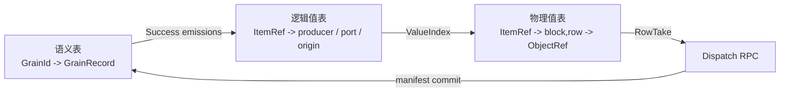

- **GrainRecord** 回答：这个 logical operation 是谁、依赖谁、成功/失败/被抑制了吗？
- **ItemRef/indexes** 回答：logical value 在 DAG 和 fiber 中属于哪里？
- **block/ObjectRef/RowTake** 回答：这次 RPC 从哪块数据取哪几行？

只要 review 时始终区分这三层，就比较容易定位问题究竟来自：

```text
identity/lineage
planner classification
batch packing
Ray transport
worker ABI
commit/fencing
memory ownership
```

