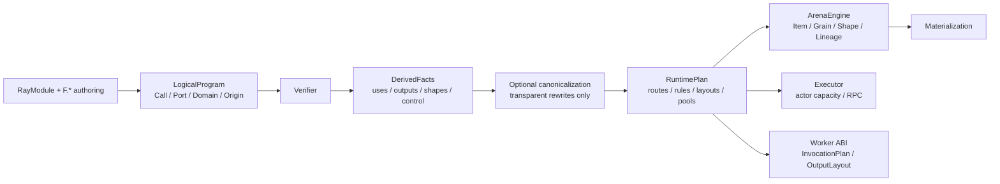

# MultiGrain v3.5：静态语义编译边界

## 1. 结论

v3.5 引入的不是通用优化器，而是一条固定、可关闭 canonicalization 的静态
编译流水线。它的首要价值是正确性与层间解耦，不是 Filter fusion：

```text
trace
→ LogicalProgram
→ verify
→ analyze
→ optional canonicalize
→ lower
→ verify RuntimePlan
```

如果编译器只用于合并相邻 Filter，这个抽象不值得。v3.5 成立的理由是它同时
封闭以下合同：

- 每种 primitive 必须声明逻辑依赖、control demand/transfer 和 lowering。
- `LogicalProgram` 不再混入反向索引、control closure 或物理 actor 配置。
- Arena 只执行完整 `RuntimePlan`，不导入或读取 `PortOrigin`。
- 优化关闭后仍走同一 verifier、analysis、lowering，形成 correctness baseline。
- `explain` 能逐 Port 追踪 logical→physical 映射和 canonical rewrite。

## 2. 单向数据结构关系



边界是单向的：

| 层 | 拥有 | 明确不拥有 |
| --- | --- | --- |
| `LogicalProgram` | 用户声明的 Call、Port、Domain、Origin、输出树 | consumers、control closure、pool、runtime route |
| `DerivedFacts` | 可重算的 uses、Call outputs、Shape reporters、control fixed point、group depth | actor handle、Arena state |
| `RuntimePlan` | Port Domain 表、Call ABI、input/output layouts、routes、结构规则、pool、输出树 | `PortOrigin`、业务 payload、动态 Entity |
| `ArenaEngine` | Item/Grain/Shape/Entity lineage、retry generation、唯一状态写入口 | logical Origin、actor handle、业务值解释 |
| `Executor` | actor 生命周期、RPC、multi-Arena capacity | primitive 语义、lineage 推导 |
| `Worker` | value-only batch UDF 与稳定 DTO | Program、Arena、Ray 调度策略 |

`RuntimePlan` 会复制运行时真正需要的静态事实。Arena 不通过
`CompiledProgram.logical` 回读任何 provenance，也不在构造时重新扫描 Origins
建立私有索引。

## 3. Primitive 穷尽语义

唯一入口是 `semantics.describe_origin()`。每个 origin 即使没有 control 或
runtime view 行为，也必须显式返回 stop/pass 合同；未知联合成员会进入
`assert_never`。

| Primitive | 逻辑输入 | control 语义 | Runtime lowering |
| --- | --- | --- | --- |
| Source | 无 | demand 在 source admission 产生 manifest | `source-admission` |
| CallOutput | Call + output index | demand 进入 Worker `OutputLayout` | `worker-output` |
| Expand | group Port | output demand 反传给 group | `ExpansionRule`，由成功 report 原子提交直接输出 |
| Group | value + members | group value 不能作为标量 mask | `GroupRule` + child-domain terminal trigger |
| Broadcast | ancestor source | output demand 反传给 source | `BroadcastRule` + source/child-arrival routes |
| Filter | source + mask | mask 主动 demand control；output demand 反传给 source | `FilterRule`，PRESENT 时可复制 source control |

因此 chained filter 不再依赖某段 analysis 恰好记得 `FilterOrigin`：第二个
Filter demand 第一个 Filter 的 output control，统一语义表再把 demand 传给其
source，直到 fixed point。

## 4. 编译器能做什么

即使没有任何性能优化，静态编译边界仍能：

- 在启动 Ray 前验证引用闭包、Domain ancestry、Call/Port 对齐和 Port DAG。
- 对新增 primitive 强制穷尽 control 与 lowering 合同，减少横向漏项。
- 让 Arena 的结构传播只解释物理 route/rule，不再重复逻辑模式匹配。
- 生成稳定的 Worker `OutputLayout` 和 source control admission 合同。
- 把用户写下的 positional/keyword 调用形状 lower 为稳定 `InputLayout`，Worker
  不反射 Pipeline 或 LogicalProgram。
- 用 `CompiledProgram.explain_text()` 说明每个逻辑 Port 的物理实现。
- 同时编译 optimized/unoptimized 计划，做结果和 ItemOutcome 等价回归。

当前唯一 canonicalization 是透明 Broadcast 链折叠：

```text
broadcast(broadcast(root, child), grandchild)
→ broadcast(root, grandchild)
```

中间逻辑 Port 仍保留；只把最终物理 rule 的 source 指向最早祖先。Broadcast
不执行 UDF、不创建 Grain、只复制同一 binding/outcome/control，因此该 rewrite
不改变业务失败、成员或 actor 语义。`explain` 会记录 before/after。

## 5. 编译器不能做什么

v3.5 不声称静态编译能够：

- 预测运行时 Expand cardinality，或消除 workload 真实存在的 N×M。
- 理解任意 Python UDF 的纯度、副作用、代价或内存峰值。
- 代替 Arena 的局部 failure propagation、retry generation 和 stale fencing。
- 自动把一般 Reduce 变成 streaming aggregation。
- 通过融合结构 view 获得 actor/RPC 收益；Filter 本来就没有 actor 或 RPC。
- 保证任意 workload 的性能；物理优化仍需 profile 与端到端证据。

因此第一版明确不做 DCE、Filter fusion、SSA、通用 PassManager、插件注册表或
cost model。DCE 可能改变有副作用 UDF 的可观察行为；Filter fusion 则需要先
证明 failure/control/membership 合法性，却几乎没有物理收益。

## 6. 保留与精简

v3.5 保留了 v3–v3.4 中已经成立的部分：

- `RayModule + F.*` 的用户书写模式。
- Port/Domain 正交、显式 Expand/Reduce/Broadcast/Filter 关系。
- Call-only actor pools；结构 primitive 不创建 actor、RPC 或 Grain。
- 单写者、事件驱动 Arena 和细粒度 Entity/Item/Grain lineage。
- PRESENT/DROPPED/FAILED/SUPPRESSED 的结果语义。
- multi-output 逐 Grain 原子报告、generation fencing、局部 replay。
- 多 Arena 共享持久 actor capacity，Worker 使用 value-only DTO。
- 单一真实 Ray Executor 与统一 `BlockRef`。

同时不把 v3.4 的结构 hard limits 带入新版本。有限且可物化 workload 的容量先
由 admission、backpressure 与 Arena 生命周期管理；若 profile 证明元数据成本
成为瓶颈，再优化物理表示，而不降低细粒度 lineage 语义。v3.5 也删除了未参与
判定的 `ShapeState.OPEN`、reporter bookkeeping 和 `active_attempt` 字段。

## 7. 验证口径

Ray-free 回归覆盖：

- primitive 语义表的完整集合；
- `LogicalProgram` 与 derived facts 字段隔离；
- keyword-only、反序 kwargs、默认参数跳过与 named driving input；
- Arena 源码不含 Origin interpreter；
- chained filter control fixed point；
- group-valued mask 拒绝；
- nested empty Expand/Reduce；
- optimized/unoptimized Broadcast outcome parity；
- generation fencing；
- aligned Expand mismatch 无局部发布。

真实 Ray 回归覆盖持久 actor、多 Arena、actor crash replacement、同 Grain replay、
逐记录业务失败和 multi-output 原子失败。

真实 4×H20 MinerU 回归覆盖 368 PDFs / 7,072 pages、动态 PDF→Page fan-out、
跨 parent elastic batching 与 ordered Reduce。V3.5 measured wall 为 602.760s，
相对 V3 golden 587.781s 慢 2.55%，落在既定 ±5% gate 内；OCR 为 121 RPC、
平均 58.446 pages/RPC，与历史 V3.3 full run 完全一致。输出 368/368，无
missing/extra；详细配置、4/48/368 分级 gate 与 correctness 结果见
`docs/experiments/multigrain_v3_5/2026-08-06_mineru_regression.md`。
