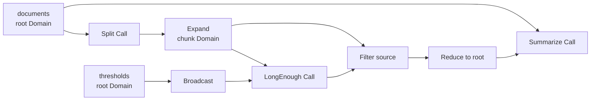
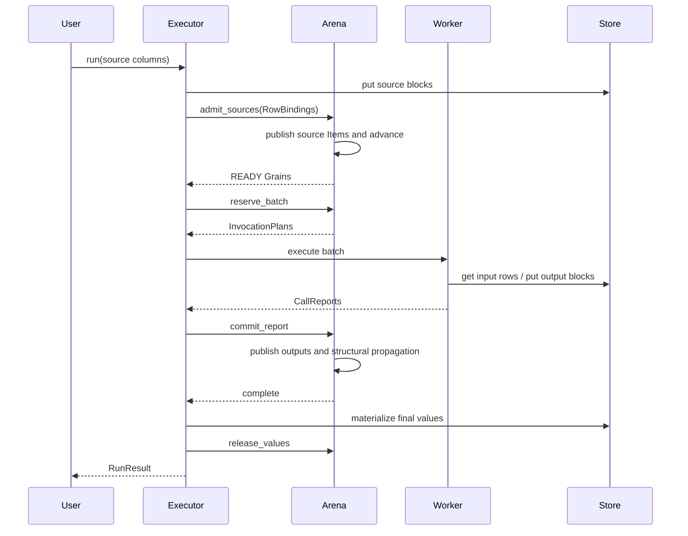
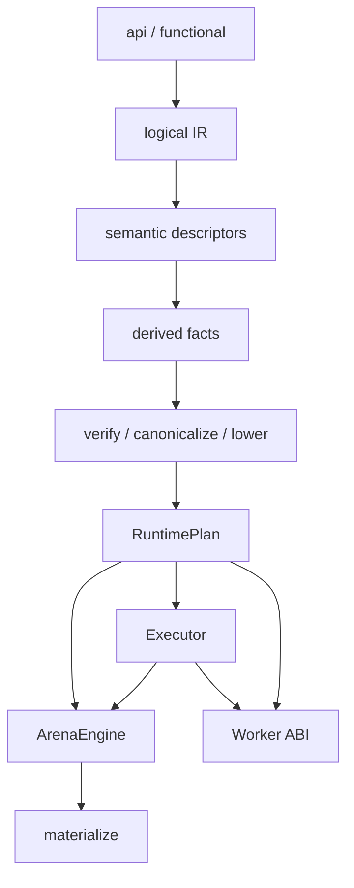

# MultiGrain v3.5.1 从零理解与维护教程

这份教程面向第一次接触 MultiGrain、数据流编译器和细粒度 lineage 的读者。读完后，
你应该能够：

- 写出并运行一个 `RayModule + F.*` Pipeline；
- 解释 Port、Domain、Entity、Item、Grain 和 Shape 分别是什么；
- 沿着 compiler、Arena、Executor、Worker 追踪一条数据；
- 判断 Filter、Expand、Reduce、Broadcast 和 Optional 如何改变状态；
- 定位常见编译、死锁、失败传播和 Worker ABI 问题；
- 在不引入飞线的前提下维护或增加一个 primitive。

本教程描述的是首次发布前已经完成 breaking change 的 v3.5.1。动态语义的精简合同见
[`multigrain_v3_5_1.md`](multigrain_v3_5_1.md)，compiler 设计边界见
[`multigrain_v3_5.md`](multigrain_v3_5.md)。

---

## 1. 先建立一个最小直觉

MultiGrain 做的事情可以先粗略理解为：

```text
用户写一张由 RayModule 和 F.* 组成的符号数据流图
    ↓
compiler 在启动 Ray 前验证并生成 RuntimePlan
    ↓
Executor 把输入切成多个 Arena，并让它们共享持久 Ray actors
    ↓
Arena 为每个逻辑 Entity 维护 Item、Grain、Shape 等细粒度事实
    ↓
Worker 只读取值、批量执行 UDF，并返回结构化报告
    ↓
Arena 提交报告、传播结构状态，最后按 lineage 顺序物化输出
```

最重要的边界是：

```text
RayModule 执行业务计算。
F.* 声明数据的结构关系。
Arena 管理身份与状态，但不解释业务 payload。
Executor 管理 Ray，但不重新解释 primitive 语义。
```

### 1.1 第一个可运行 Pipeline

```python
import rayorch.experimental.multigrain_v3_5 as mg


class Double:
    def run(self, values):
        # values 是一个 batch 列，不是单个值。
        return [value * 2 for value in values]


class DoublePipeline(mg.Pipeline):
    def __init__(self):
        self.double = mg.RayModule(Double).ray_options(
            batch_size=8,
            replicas=1,
            num_cpus=0,
        )

    def forward(self, values):
        return self.double(values)


with mg.Executor(DoublePipeline()) as executor:
    result = executor.run([1, 2, 3])

assert result.outputs == [2, 4, 6]
```

`Executor` 会在 Ray 尚未初始化时调用 `ray.init()`。退出 context manager 会终止本
Executor 创建的 actors，但不会擅自关闭可能由其他任务共享的 Ray 集群；独立脚本若希望
完全退出，可在最后显式调用 `ray.shutdown()`。

这里有两个容易误解的地方：

1. `Pipeline.forward()` 编译时执行一次，但参数是符号 `Port`，不是真实的 `[1, 2, 3]`。
2. `Double.run()` 运行时接收批量列，例如 `[1, 2, 3]`，返回值也必须按 batch 对齐。

可以在不执行 Ray 的情况下查看编译结果：

```python
compiled = DoublePipeline().compile()
print(compiled.explain_text())
```

`compile()` 只建立并验证静态数据流；`Executor` 才创建 actor 和处理真实值。

---

## 2. 六个必须分清的概念

理解整个框架的关键不是记住类名，而是分清静态位置、动态身份和执行行为。

| 概念 | 简化定义 | 静态/动态 |
| --- | --- | --- |
| Port | 数据流图上的一个逻辑位置 | 静态 |
| Domain | 一组同粒度 Entity 的身份空间 | 静态 |
| Entity | Domain 中一次逻辑 occurrence | 动态 |
| Item | 一个 Port 对一个 Entity 的结果 | 动态 |
| Call | 一个 RayModule 在图中的调用点 | 静态 |
| Grain | 一个 Call 对一个 Entity 的逻辑调用 | 动态 |
| Shape | 一个 parent Entity 的 Expand 结果 | 动态 |

它们的身份公式是：

```text
EntityRef = DomainRef × occurrence
ItemRef   = PortRef × EntityRef
GrainRef  = CallRef × EntityRef
ShapeKey  = child DomainRef × parent EntityRef
```

### 2.1 Port 不是数据容器

下面的 `doubled` 是一个符号 Port：

```python
def forward(self, values):
    doubled = self.double(values)
    return doubled
```

它表示“Double 这个 Call 的第 0 个逻辑输出位置”，不保存某一行真实值，也不保存
Ray `ObjectRef`。

同一个 Port 对不同 Entity 会形成不同 Item：

```text
ItemRef(doubled_port, entity_0)
ItemRef(doubled_port, entity_1)
ItemRef(doubled_port, entity_2)
```

### 2.2 Domain 表示粒度，不表示 Python 类型

假设 root 输入是两份文档：

```text
root Domain
├── document Entity 0
└── document Entity 1
```

每份文档展开出 pages 后，会产生新的 child Domain：

```text
document Domain
├── document 0
│   ├── page 0
│   └── page 1
└── document 1
    └── page 0
```

文档和页面即使内部整数编号相同，也不会意外对齐，因为 Domain 是 Entity 身份的一部分。

### 2.3 Entity 不会被 Filter 删除

Entity 表示“这个 occurrence 已经存在”。Filter 只改变某个目标 Port 是否包含它：

```text
page Entity 3：仍然存在

raw_page_port × page Entity 3      → PRESENT
selected_page_port × page Entity 3 → DROPPED
metadata_port × page Entity 3      → PRESENT
```

因此不同 branch 可以对同一个 Entity 有不同成员资格。`DROPPED` 属于 Item，不属于
Entity。

### 2.4 Grain 不是物理 batch

如果 `score` Call 在 page Domain 上执行，那么每个 page Entity 都对应一个 Grain：

```text
GrainRef(score_call, page_0)
GrainRef(score_call, page_1)
GrainRef(score_call, page_2)
```

Executor 可以把多个 Grain 打包进一个 actor RPC，但 batching 不改变 Grain 身份。
重试时 GrainRef 也不变，只提升 generation。

### 2.5 Shape 为什么不能省略

没有 child Entity 可能表示四件不同的事：

```text
Expand 还没完成
Expand 成功，但结果为空
parent Item 被 DROPPED
上游失败，无法知道 cardinality
```

所以 Shape 有独立终态：

```text
SUCCEEDED(children) | DROPPED | FAILED
```

`SUCCEEDED(())` 与 `DROPPED` 完全不同。前者是合法空 group，后者是该 Port 不包含
这个 parent occurrence。

---

## 3. RayModule 与 Worker 的批处理合同

`RayModule` 声明一个真正需要 Worker 的计算边界：

```python
self.module = (
    mg.RayModule(MyUDF, num_outputs=1)
    .pre_init(model_path)
    .ray_options(
        batch_size=16,
        replicas=2,
        num_gpus=1,
        max_retries=1,
    )
)
```

### 3.1 UDF 类合同

有状态 UDF 使用类：

```python
class Model:
    def __init__(self, model_path):
        self.model = load_model(model_path)

    def run(self, images, thresholds):
        assert len(images) == len(thresholds)
        return [
            self.model(image, threshold)
            for image, threshold in zip(images, thresholds)
        ]
```

`pre_init()` 参数只在 actor 内构造 UDF 时使用。compiler 不实例化模型。

无状态函数可使用装饰器：

```python
@mg.function
def add(left, right):
    return [lhs + rhs for lhs, rhs in zip(left, right)]
```

无论类还是函数，输入和输出都是 batch columns。

### 3.2 多输出

```python
class Both:
    def run(self, values):
        return (
            [value * 2 for value in values],
            [value * 3 for value in values],
        )


self.both = mg.RayModule(Both, num_outputs=2)

def forward(self, values):
    doubled, tripled = self.both(values)
    return doubled, tripled
```

外层 tuple 按输出 Port 分列；每一列长度必须等于本次 batch 的 Grain 数。

### 3.3 positional 与 keyword 输入

```python
class Add:
    def run(self, values, *, increments):
        return [
            value + increment
            for value, increment in zip(values, increments)
        ]

def forward(self, values, increments):
    return self.add(values, increments=increments)
```

compiler 会生成 `InputLayout`。Worker 不反射 Pipeline，也不重新猜测 kwargs 顺序。

### 3.4 Ray options 的两类含义

当前参考 Executor 自己消费：

- `batch_size`：每个 RPC 最多包含多少 Grain；
- `batch_scope`：`elastic` 或 `parent_bound`；
- `replicas`：该 Call 的持久 actor 数；
- `max_retries`：基础设施/RPC 异常的局部重试次数。

其他选项，例如 `num_cpus`、`num_gpus`、`max_restarts`，传给 Ray actor options。

---

## 4. F.* 是结构关系，不是隐藏 Worker

当前公开结构 API 是：

```text
F.expand / F.expand_aligned
F.reduce / F.reduce_aligned
F.broadcast
F.filter
F.optional
```

除了 Expand 创建 child Entity，其他操作都不创建 Entity。所有 F.* 都不创建 actor、
RPC 或 Grain。

| 操作 | 新 Port | 新 Domain | 新 Entity | Worker |
| --- | --- | --- | --- | --- |
| RayModule Call | 是 | 否 | 否 | 是 |
| Filter | 是 | 否 | 否 | 否 |
| Broadcast | 是；同 Domain 时直接返回 source | 否 | 否 | 否 |
| Expand | 是 | 是 | 是 | 否；由上游 Call report 实现 |
| Reduce | 是 | 否；回到 parent | 否 | 否 |
| Optional | 否 | 否 | 否 | 否 |

### 4.1 Filter：改变 Port 成员资格

```python
selected = mg.F.filter(values, masks)
```

`values` 和 `masks` 必须属于同一 Domain。mask 为 `PRESENT(True)` 时复用 source
binding，为 `PRESENT(False)` 时目标 Item 变为 `DROPPED`。

```text
source 非 PRESENT → 原样传播 source outcome
source PRESENT     → 再由 mask 决定
```

若 Filter 输出继续作为下一个 Filter 的 mask，compiler 会把 control demand 反向传到
原始 bool producer。用户不需要手工声明 control manifest。

### 4.2 Optional：DROPPED 变成 MISSING

```python
optional_value = mg.F.optional(selected)
result = self.consume(optional_value)
```

Optional 只影响 Call 输入解释：

```text
PRESENT             → 正常值
OPTIONAL + DROPPED  → Worker 收到 mg.MISSING
FAILED/SUPPRESSED   → Call 不执行，输出 SUPPRESSED
```

UDF 应显式处理 `MISSING`：

```python
class FillDefault:
    def run(self, values):
        return [0 if value is mg.MISSING else value for value in values]
```

Call 可以全部由 optional 输入组成，因为 Entity 身份来自 Domain，而不是来自某个
“driving input”。

### 4.3 Expand：一对多创建 child Entity

```python
@mg.function
def split(values):
    return [[value, value + 1] for value in values]

def forward(self, values):
    children = mg.F.expand(split(values))
    return children
```

若 root 有两个 Entity，split 分别返回 2 个元素，那么 child Domain 有 4 个 Entity。

Expand 当前必须挂在 Call output 上，因为 Worker report 提供真实 rows 和 cardinality。
它不是对任意 Python list 做 driver 侧展开。

### 4.4 Reduce：沿 lineage 回收一级

```python
def forward(self, values):
    children = mg.F.expand(split(values))
    transformed = self.transform(children)
    return mg.F.reduce(transformed)
```

Reduce 输出位于 child Domain 的 parent Domain。默认 `members=transformed`：

```text
members PRESENT   → child 入组
members DROPPED   → child 排除
members 失败      → parent group SUPPRESSED
```

如果成员资格和实际值来自不同 Port，可以显式指定：

```python
grouped_scores = mg.F.reduce(scores, members=selected_pages)
```

只有 `selected_pages` 为 PRESENT 的 child 才会从 `scores` 取值。

### 4.5 Broadcast：把祖先值投影给后代 Entity

```python
leaf_thresholds = mg.F.broadcast(root_thresholds, like=leaves)
```

`root_thresholds` 必须来自 `leaves` Domain 的某个 ancestor Domain。`like` 只选择目标
Domain，不复制它的成员资格。

因此下面两件事不同：

```python
# 每个 leaf Entity 都获得 ancestor threshold。
thresholds = mg.F.broadcast(root_thresholds, like=selected_leaves)

# 若还要服从 selected_leaves 的成员资格，需要显式 Filter。
selected_thresholds = mg.F.filter(thresholds, leaf_mask)
```

### 4.6 aligned API

`expand_aligned(*ports)` 让同一个 Call 的多个 group outputs 共享 Shape：

```python
left_group, right_group = self.produce(values)
left, right = mg.F.expand_aligned(left_group, right_group)
```

每个 parent 的左右 cardinality 必须完全相同，否则整个成功 report 被拒绝，不产生局部
children。

`reduce_aligned(*ports, members=...)` 则让多个 value Ports 使用同一成员集合回收。

---

## 5. 一个包含完整结构关系的例子

下面的 Pipeline 把 document 展成片段，把 root threshold 广播到片段，筛选片段，再按
document 聚回去。

```python
import rayorch.experimental.multigrain_v3_5 as mg


class Split:
    def run(self, documents):
        return [
            [document[index:index + 2] for index in range(0, len(document), 2)]
            for document in documents
        ]


class LongEnough:
    def run(self, chunks, thresholds):
        return [
            len(chunk) >= threshold
            for chunk, threshold in zip(chunks, thresholds)
        ]


class Summarize:
    def run(self, documents, chunk_groups):
        return [
            (document, tuple(chunks))
            for document, chunks in zip(documents, chunk_groups)
        ]


class DocumentPipeline(mg.Pipeline):
    def __init__(self):
        self.split = mg.RayModule(Split)
        self.long_enough = mg.RayModule(LongEnough)
        self.summarize = mg.RayModule(Summarize)

    def forward(self, documents, thresholds):
        chunks = mg.F.expand(self.split(documents))
        chunk_thresholds = mg.F.broadcast(thresholds, like=chunks)
        masks = self.long_enough(chunks, chunk_thresholds)
        selected = mg.F.filter(chunks, masks)
        chunk_groups = mg.F.reduce(selected)
        return self.summarize(documents, chunk_groups)


with mg.Executor(DocumentPipeline()) as executor:
    result = executor.run(
        ["abcde", "xy"],
        [2, 2],
    )

assert result.outputs == [
    ("abcde", ("ab", "cd")),
    ("xy", ("xy",)),
]
```

第一份文档的 `"e"` 对应 child Entity 仍存在，只是 `selected` Port 上的 Item 为
`DROPPED`。Reduce 的 members 默认是 `selected`，所以它不会进入最终 group。

这张图可以读成：



---

## 6. 编译期：从 Python authoring 到 RuntimePlan

### 6.1 forward 是符号追踪

`Pipeline.compile()` 会检查 `forward` 参数，并为每个参数创建 root source Port。随后在
一个 trace context 中调用 `forward(*symbolic_ports)`。

例如：

```python
def forward(self, documents, thresholds):
    chunks = mg.F.expand(self.split(documents))
    ...
```

执行的不是 Split UDF，而是：

```text
self.split(documents Port)
→ 登记 CallSpec
→ 创建 CallOutputOrigin Port

F.expand(group Port)
→ 创建 child DomainSpec
→ 创建 ExpandOrigin Port
```

最终得到不可变 `LogicalProgram`：

```text
calls
ports
domains
source_ports
output_tree
```

### 6.2 PortOrigin 是 typed AST

每个 Port 有且只有一个 origin：

```text
SourceOrigin
CallOutputOrigin
ExpandOrigin
GroupOrigin
BroadcastOrigin
FilterOrigin
```

可以把它理解成编译器 AST node。具体 Origin 只允许由
[`semantics.describe_origin()`](../rayorch/experimental/multigrain_v3_5/semantics.py)
解析。

`describe_origin()` 把不同 AST node 统一成 `PrimitiveSemantics`：

```text
kind
inputs + InputRole
control_demands
control_predecessors
rejects_control
producing_call/output_index/source_index
```

compiler 其他阶段不再 `isinstance(XxxOrigin)`；runtime 完全不认识 Origin。

### 6.3 固定 compiler pipeline

[`compile_logical()`](../rayorch/experimental/multigrain_v3_5/compiler.py) 的顺序固定：

```text
verify LogicalProgram
→ analyze
→ optional canonicalize
→ lower RuntimePlan
→ verify RuntimePlan
```

这不是可插拔 PassManager。v3.5.1 当前不需要插件注册表、cost model 或通用 SSA。

#### Verify

验证内容包括：

- 引用是否存在；
- Domain parent 是否无环；
- 所有 Call inputs 是否属于 execution Domain；
- Port dependency 是否无环；
- Expand 是否只下降一级并来自 Call output；
- Group value/members 是否同 child Domain；
- Broadcast source 是否为目标 Domain 的祖先；
- Filter source/mask 是否同 Domain。

这些错误在 Ray actor 启动前暴露。

#### Analyze

[`analysis.py`](../rayorch/experimental/multigrain_v3_5/analysis.py) 计算可丢弃、可重算的
事实：

```text
consumers_by_port
outputs_by_call
shape_reporters_by_domain
control_ports fixed point
group_depth_by_port
```

例如 chained Filter 的 control demand 会一直反传到真正产生 bool 的 Port。

#### Canonicalize

当前唯一优化是折叠透明 Broadcast 链：

```text
broadcast(broadcast(root, child), grandchild)
→ broadcast(root, grandchild)
```

`optimize=False` 跳过 canonicalization，但仍走相同 verify/analyze/lower。这给优化提供
语义 correctness baseline。

#### Lower

lowering 把逻辑依赖变成 RuntimePlan：

```text
CallInputRoute
FilterRoute / FilterRule
GroupRoute / GroupRule
BroadcastRoute / BroadcastRule
ExpansionRule
InputLayout / OutputLayout
PoolSpec
```

RuntimePlan 已经包含 Arena 需要的完整物理事实，所以 Arena 不回读 LogicalProgram。

### 6.4 用 explain 调试编译结果

```python
compiled = DocumentPipeline().compile()
print(compiled.explain_text())
```

逐 Port 输出会说明：

```text
逻辑 kind
所属 Domain
逻辑输入 Ports
物理 lowering rule
是否 demand control
是否发生 canonical rewrite
```

遇到“为什么这个 mask 没有 control”或“为什么 Broadcast 指向另一个 source”时，先看
explain，不要直接进 Arena 猜。

---

## 7. 运行期：一个 Item publication 如何推动全图

Executor 的一次运行大致经历：



### 7.1 Arena admission

`Executor.run()` 要求 source columns 数量等于 `forward` 参数数，而且所有列等长。

`arena_size` 把 source rows 切成多个独立 Arena：

```python
result = executor.run(
    values,
    arena_size=32,
    max_in_flight=4,
)
```

最多 4 个 Arena 同时活跃，但它们共享同一批持久 actors。一个 RPC 不混合多个 Arena
的 Grain。

### 7.2 publication receipt 与 advance

Arena 的所有 Item 都通过唯一 `_publish()` 入口进入不可变终态。每次新 publication
会进入 receipt queue。

`advance()` 根据 RuntimePlan routes 触发：

```text
CallInputRoute → 更新 PendingInvocation
FilterRoute    → 尝试 Filter transition
BroadcastRoute → 向目标后代 Entity 投影
GroupRoute     → 尝试 parent Reduce
```

它持续运行到 receipt queue 为空，即达到当前局部不动点。

### 7.3 Call inputs 如何成为 Grain

同一个 Call、同一个 Entity 的输入槽由 `PendingInvocation` 收集。动态规则由
[`transitions.py`](../rayorch/experimental/multigrain_v3_5/transitions.py) 唯一定义：

```text
任意 FAILED/SUPPRESSED → outputs SUPPRESSED
否则仍有未决输入      → WAIT
否则 REQUIRED DROPPED  → outputs DROPPED
否则                   → Grain READY
```

所有输入对 Entity 身份是对称的，不存在 `driven_by`。

### 7.4 reserve、batch 与 InvocationPlan

Executor 从 Arena 预留 READY Grains：

```text
READY + RESERVE → IN_FLIGHT
```

Arena 再把每个 Grain 投影为 Worker DTO：

```text
ScalarTake
GroupTake
MissingTake
```

Worker 只看到这些 value takes、generation 和 output layouts，看不到 Program、PortOrigin
或 Arena tables。

### 7.5 Worker report 与原子提交

Worker 返回：

```text
CallReport        成功，含全部 outputs
CallFailureReport 某个 Grain 的业务失败
```

Arena 在写任何结果前先检查：

- Grain 是否 `IN_FLIGHT`；
- generation 是否仍然有效；
- output Ports 是否完整且无重复；
- scalar/expanded layout 是否匹配；
- control manifest 是否准确；
- aligned Expand cardinality 是否一致。

验证完成后才一次性封闭 Grain 并发布结果。multi-output 中任一列把某个位置返回为
`RecordFailure` 时，该 Grain 的所有输出都 `FAILED`，不会暴露半成功状态。

### 7.6 完成、物化与释放

一个 Arena 完成需要：

```text
admission 已关闭
receipt/pending/ready 均为空
所有 Grain SEALED
所有输出 Port × 已存在 Entity 都有 Item 终态
```

`materialize_tree()`：

- PRESENT scalar：读取 `RowBinding`；
- PRESENT group：按 `GroupShape` 恢复嵌套 list；
- 非 PRESENT：在结果中保留 `ItemOutcome`。

最终业务值复制到用户结果后，Arena 清空 ValueTable，但保留 Item/Shape/Grain/lineage
用于审计。

---

## 8. 四套状态机

### 8.1 Entity

```text
不存在
  ├─ source admission → root Entity
  └─ Expand success   → child Entity
```

Entity 创建后不删除、不失败、不 dropped。只有 Expand 创建 child Entity。

### 8.2 Item

```text
UNRESOLVED
  ├─ PRESENT
  ├─ DROPPED
  ├─ FAILED
  └─ SUPPRESSED
```

| Outcome | 意义 |
| --- | --- |
| PRESENT | 此 Port 对此 Entity 有值 |
| DROPPED | 已确认此 Port 不包含该 Entity |
| FAILED | 直接生产者失败，或透明 view 保留该失败 |
| SUPPRESSED | 生产者因依赖失败而未执行 |

Item 终态不可改写；完全相同的 publication 可以幂等重放，冲突 publication 直接失败。

### 8.3 Grain

```text
WAITING → READY → IN_FLIGHT → SEALED
    └───────────────────────→ SEALED
               IN_FLIGHT → READY  (retry)
```

`WAITING` 由 pending slots 表示，不是 GrainRecord phase。GrainRecord 只保存：

```text
phase
generation
infra_failures
```

Grain 的业务结果由输出 Items 推导，不再维护重复 GrainOutcome。

### 8.4 Shape

```text
UNRESOLVED
  ├─ SUCCEEDED(children)
  ├─ DROPPED
  └─ FAILED
```

成功 Shape 直接拥有有序 child Entity tuple，cardinality 由 `len(children)` 派生。
失败 Shape 不虚构 children。

---

## 9. payload、control 与 lineage 为什么分开

### 9.1 Arena 不读取业务 payload

业务值存成粗粒度 block：

```text
BlockRef → 一个 Ray ObjectRef 或测试内存块
RowBinding(block, row) → 块中的一行
```

Arena 的 ValueTable 只保存 ItemRef 到 RowBinding/GroupBinding 的映射。只有 Worker 和最终
materializer 调用 store.get()。

这避免 driver 为调度而反序列化图片、页面或模型输出。

### 9.2 control manifest 是受控投影

Filter 必须知道 mask 是 True 还是 False，但 Arena 又不能读取业务 payload。因此 compiler
计算 `control_ports`，Worker 只为被 demand 的 bool Port 返回小型 control manifest。

```text
ValueTable        保存真实业务值的位置
ItemRecord.control 保存调度需要的 bool 副本
```

这不是重复业务值，而是明确的 data plane/control plane 分离。

### 9.3 GroupBinding 与 CSR Shape

Reduce 不把大 group payload 复制到 Arena，而是保存：

```text
GroupBinding(
    GroupShape(offsets_by_level),
    flat_items,
)
```

`flat_items` 指向有序叶子 Item；`offsets_by_level` 表示嵌套边界。Worker 在真正调用 UDF
前才按 offsets 恢复 Python nested lists。

---

## 10. 失败、RecordFailure 与 retry

### 10.1 业务记录失败

UDF 可以只让 batch 中某些 Grain 失败：

```python
from rayorch.experimental.multigrain_v3_5.protocol import RecordFailure


class Parse:
    def run(self, values):
        return [
            RecordFailure("invalid input") if value is None else parse(value)
            for value in values
        ]
```

Worker 把对应 Grain 转成 `CallFailureReport`。其他 batch positions 仍然成功。

### 10.2 RPC/actor 异常

如果 Ray RPC 抛异常，Executor 根据 `max_retries`：

```text
IN_FLIGHT → READY
generation += 1
infra_failures += 1
```

旧 generation 的迟到报告不能覆盖新 attempt。actor crash 时 Executor 会替换 actor；普通
UDF 异常保留持久实例。超过重试预算后，相关 Grain 以 FAILED 封闭，不回滚无关 branch
或 Arena。

### 10.3 failure propagation

普通 Call 的输入优先级是：

```text
FAILED/SUPPRESSED > unresolved > REQUIRED DROPPED > READY
```

所以 failure 与 required drop 同时出现时，输出是 `SUPPRESSED`，而不是依赖输入顺序。

Filter 和 Reduce 是带角色的 gate：

- Filter 先看 source，再看 mask；
- Reduce 先看 Shape，再看 members，只读取 survivors 的 values。

这些不对称写在纯 transition 中，不允许由某个默认输入槽暗中决定。

---

## 11. 源码地图与推荐阅读顺序

建议按以下顺序阅读，而不是直接从 ArenaEngine 开始：

1. [`model.py`](../rayorch/experimental/multigrain_v3_5/model.py)：核心 Ref 和终态枚举。
2. [`logical.py`](../rayorch/experimental/multigrain_v3_5/logical.py)：typed logical IR。
3. [`functional.py`](../rayorch/experimental/multigrain_v3_5/functional.py)：F.* 公开表面。
4. [`semantics.py`](../rayorch/experimental/multigrain_v3_5/semantics.py)：唯一 Origin parser。
5. [`transitions.py`](../rayorch/experimental/multigrain_v3_5/transitions.py)：动态状态代数。
6. [`plan.py`](../rayorch/experimental/multigrain_v3_5/plan.py)：RuntimeRule/Route。
7. [`compiler.py`](../rayorch/experimental/multigrain_v3_5/compiler.py)：固定 passes。
8. [`runtime/state.py`](../rayorch/experimental/multigrain_v3_5/runtime/state.py)：被动 tables。
9. [`runtime/engine.py`](../rayorch/experimental/multigrain_v3_5/runtime/engine.py)：单写者应用层。
10. [`protocol.py`](../rayorch/experimental/multigrain_v3_5/protocol.py)：稳定 DTO/Worker ABI。
11. [`worker.py`](../rayorch/experimental/multigrain_v3_5/worker.py)：值恢复和报告生成。
12. [`executor.py`](../rayorch/experimental/multigrain_v3_5/executor.py)：Ray actor 与多 Arena 调度。
13. [`materialize.py`](../rayorch/experimental/multigrain_v3_5/materialize.py)：最终输出恢复。

依赖方向是：



反向箭头通常意味着边界正在泄漏。

---

## 12. 如何维护而不引入飞线

### 12.1 增加一个新 primitive

新增 primitive 前先回答：

```text
它创建哪种身份？
它消费哪些 Port，角色分别是什么？
它是否改变 Domain？
它产生哪些 Item/Shape 终态？
control demand 如何传播？
它是否真的需要 Worker？
为什么现有 primitive 无法表达？
```

若确实需要，按固定顺序修改：

1. 在 `logical.py` 增加 `XxxOrigin` 并加入 `PortOrigin` 联合。
2. 在 `api.py/functional.py` 构造新 Port/Domain 关系。
3. 在 `semantics.describe_origin()` 增加穷尽 case，声明 InputRole/control。
4. 在 compiler verifier 增加局部合法性 case。
5. 在 `plan.py` 定义最小 `XxxRule/XxxRoute`。
6. 在 lowering 中显式生成 rule/route；即使是 pass 也写出 case。
7. 若有新的动态组合，在 `transitions.py` 增加纯函数。
8. Arena 只应用 transition 和发布事实，不重复写状态优先级。
9. 增加笛卡尔积测试、compiler boundary 测试和 explain 断言。
10. optimized/unoptimized 必须结果等价。

### 12.2 修改状态语义

不要先改 Arena 的某个 `if`。正确顺序是：

```text
更新 v3.5.1 语义合同
→ 修改 transitions.py
→ 修改笛卡尔积期望
→ 让 Arena 适配 transition result
→ 跑完整回归
```

如果一个 outcome 规则无法在纯 transition 中表达，通常说明输入事实或 primitive role
还没有建模清楚。

### 12.3 修改 Worker ABI

必须同步检查：

```text
protocol DTO
compiler InputLayout/OutputLayout
Arena invocation_plan/commit validation
Worker restore/normalize/report
Ray actor boundary integration test
```

不要把 LogicalProgram 或 Arena 对象直接传进 Worker。

### 12.4 增加编译优化

优化必须满足：

- `optimize=False` 仍是完整可运行 baseline；
- 不改变 Call 是否执行，除非已经定义副作用合同；
- 不改变 ItemOutcome、control、membership 或 failure provenance；
- `explain` 记录 rewrite；
- optimized/unoptimized 有等价测试；
- 有 profile 证明值得增加复杂度。

当前 Filter 本身没有 actor/RPC，单纯融合相邻 Filter 通常没有明显性能收益。

### 12.5 不允许出现的飞线

维护时可以用这份硬性检查表：

- compiler 除 `describe_origin()` 外不识别具体 `XxxOrigin`；
- runtime 不导入 LogicalProgram/PortOrigin；
- 任一输入 Port 不得成为 Grain/Entity 隐式 driver；
- 只有 Expand 创建 child Entity；
- F.* 结构 primitive 不得偷偷创建 actor/RPC/Grain；
- Item 和 Shape 只能通过唯一 publication 入口进入终态；
- Arena 不读取业务 payload；
- Executor 不重新实现 Filter/Reduce 等 primitive 语义；
- Worker 不读取 Program/Arena，不生成逻辑身份；
- derived index/queue 不得成为第二套语义权威表。

---

## 13. 测试与回归入口

### 13.1 Ray-free 单元与 MinerU 静态门禁

```bash
pytest -q \
  test/experimental/multigrain_v3_5/unit \
  test/experimental/multigrain_v3_5/benchmark/test_mineru_pipeline.py
```

这里覆盖 compiler 边界、control fixed point、状态笛卡尔积、nested group、retry fencing、
aligned atomicity 和 MinerU Pipeline 静态结构。

### 13.2 真实 Ray integration

```bash
pytest -q test/experimental/multigrain_v3_5/integration/test_executor.py
```

覆盖持久 actor、多 Arena、keyword ABI、actor crash replacement、RecordFailure 和
multi-output 原子性。某些 Ray 版本若误判 uv runtime environment，可临时设置：

```bash
RAY_ENABLE_UV_RUN_RUNTIME_ENV=0 \
pytest -q test/experimental/multigrain_v3_5/integration/test_executor.py
```

测试后应确认 fixture 已 `ray.shutdown()`，并用 `ray status` 验证没有残留实例。

### 13.3 静态类型

```bash
pyright \
  rayorch/experimental/multigrain_v3_5/semantics.py \
  rayorch/experimental/multigrain_v3_5/compiler.py \
  rayorch/experimental/multigrain_v3_5/transitions.py \
  rayorch/experimental/multigrain_v3_5/runtime
```

新增 `PortOrigin`、`InputRole` 或 route 联合成员后，`assert_never` 应帮助暴露未处理 case。

### 13.4 真实性能证据

当前 MinerU 368-PDF 回归配置和结果见
[`experiments/multigrain_v3_5/2026-08-06_mineru_regression.md`](experiments/multigrain_v3_5/2026-08-06_mineru_regression.md)。

性能修改不能只看 unit test；至少应比较 correctness、wall time、RPC 数、平均 batch、
driver RSS 和 actor 数。

---

## 14. 常见问题的排查顺序

### 14.1 编译期报 Domain mismatch

先问两个 Port 是否真的同粒度：

- ancestor 值给 descendant：使用 Broadcast；
- child values 回 parent：使用 Reduce；
- 两个无共同 lineage 的 Domain：当前不支持隐式 join。

不要通过选择某个 driving input 强行对齐。

### 14.2 Filter 报 control manifest 问题

按顺序检查：

1. `compiled.facts.control_ports` 是否包含 mask producer；
2. `compiled.explain_text()` 是否显示 `control`；
3. chained Filter 是否通过 `control_predecessors` 回传；
4. Worker output 是否真的是逐 Grain bool；
5. expanded bool rows 是否与 rows 等长。

### 14.3 Arena deadlocked

查看：

```python
arena.progress_summary()
arena.state.pending
arena.state.grains
arena.state.shapes
```

常见原因是：

- 某个依赖 Port 没有 route；
- Shape 已终态但 Group 的 member/value Item 没发布；
- Worker report layout 不完整；
- 新 primitive 在 lowering 中被遗漏而不是显式 pass；
- output Port 对某些已存在 Entity 没有终态。

### 14.4 CommitError

CommitError 通常不是普通业务失败，而是合同冲突：

- stale generation；
- output ports 不完整或重复；
- scalar/expanded report 与 plan 不一致；
- aligned cardinality 不一致；
- control demand 不一致；
- Item/Shape 被发布成不同终态。

先检查 WorkerReport 和 RuntimePlan，不要尝试覆盖已有状态。

### 14.5 输出中出现 ItemOutcome

这是预期的显式失败/成员语义：

```python
ItemOutcome.DROPPED
ItemOutcome.FAILED
ItemOutcome.SUPPRESSED
```

materializer 不会把它们静默转换为 `None`，因为三者含义不同。

---

## 15. 最后用五句话复述整个框架

1. `Pipeline.forward()` 用符号 Port 写图，RayModule 表示计算，F.* 表示结构关系。
2. compiler 把 typed PortOrigin AST 验证、分析并 lower 成不含 Origin 的 RuntimePlan。
3. Entity 定义 occurrence，Item 定义 Port 上的终态，Grain 定义 Call 的执行，Shape 定义
   Expand children。
4. Arena 是唯一状态写者，纯 transitions 决定结果；Executor 管 Ray，Worker 只管值。
5. 身份、业务值、control、物理 batching 和 failure propagation 相互分离，因此可以独立
   优化而不改变逻辑语义。

当你能根据一个新需求明确指出它属于这五层中的哪一层，并说明它不应该进入哪些层，
就已经具备维护 v3.5.1 的核心能力。
