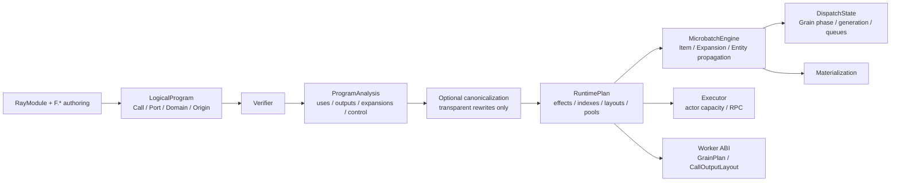

# MultiGrain v3.6：静态语义编译边界

动态状态机收敛合同见
[`multigrain_v3_6_design.md`](multigrain_v3_6_design.md)。v3.6 删除输入 driver，
并以可穷举 transition algebra 统一 F.*、Grain、Item 与 Expansion 的运行时语义。
第一次阅读或准备维护源码时，建议从
[`multigrain_v3_6_tutorial.md`](multigrain_v3_6_tutorial.md) 开始。

## 1. 结论

v3.6 引入的不是通用优化器，而是一条固定、可关闭 canonicalization 的静态
编译流水线。它的首要价值是正确性与层间解耦，不是 Filter fusion：

```text
trace
→ LogicalProgram
→ verify
→ analyze
→ optional canonicalize
→ lower
→ verify RuntimePlan
```

如果编译器只用于合并相邻 Filter，这个抽象不值得。v3.6 成立的理由是它同时
封闭以下合同：

- 每种 primitive 必须声明逻辑依赖、control demand/transfer 和 lowering。
- `LogicalProgram` 不再混入反向索引、control closure 或物理 actor 配置。
- `MicrobatchEngine` 只执行完整 `RuntimePlan`，不导入或读取 `PortOrigin`。
- 优化关闭后仍走同一 verifier、analysis、lowering，形成 correctness baseline。
- `explain` 能逐 Port 追踪 logical→physical 映射和 canonical rewrite。

## 2. 单向数据结构关系



权责边界是明确的；依赖方向服务于可读性，不作为需要额外适配层的形式约束：

| 层 | 拥有 | 明确不拥有 |
| --- | --- | --- |
| `LogicalProgram` | 用户声明的 Call、Port、Domain、Origin、输出树 | consumers、control closure、pool、runtime Effect |
| `ProgramAnalysis` | 可重算的 uses、Call outputs、Expansion sources、control fixed point、group depth | actor handle、runtime state |
| `RuntimePlan` | Port Domain 表、Call ABI、input/output layouts、不可变 Effects 及其触发索引、pool、输出树 | `PortOrigin`、业务 payload、动态 Entity |
| `MicrobatchEngine` | Item/Expansion/Entity lineage 与结构传播 | Grain 调度策略、logical Origin、actor handle、业务值解释 |
| `DispatchState` | Grain phase/generation、normal/immediate/tail queues、精确 batch recovery | Item/Expansion publication、UDF policy、actor handle |
| `Executor` | actor 生命周期、RPC、multi-microbatch capacity | primitive 语义、lineage 推导 |
| `Worker` | value-only batch UDF 与稳定 DTO | Program、runtime tables、Ray 调度策略 |

`RuntimePlan` 会复制运行时真正需要的静态事实。`MicrobatchEngine` 不通过
`CompiledProgram.logical` 回读任何 provenance，也不在构造时重新扫描 Origins
建立私有索引。

## 3. Primitive 穷尽语义

唯一入口是 `semantics.describe_origin()`。每个 origin 即使没有 control 或
runtime view 行为，也必须显式返回 stop/pass 合同；未知联合成员会进入
`assert_never`。

| Primitive | 逻辑输入 | control 语义 | Runtime lowering |
| --- | --- | --- | --- |
| Source | 无 | demand 在 source admission 产生 manifest | `source-admission` |
| CallOutput | Call + output index | demand 进入 Worker `CallOutputLayout` | `worker-output` |
| Expand | group Port | output demand 反传给 group | `ExpandEffect`，由成功 report 原子提交直接输出 |
| Reduce | value + members | group value 不能作为标量 mask | 单一 `ReduceEffect`，同时进入 Item 与 Expansion-domain 触发索引 |
| Broadcast | ancestor source | output demand 反传给 source | 单一 `BroadcastEffect`，同时进入 Item 与 Entity-domain 触发索引 |
| Filter | source + mask | mask 主动 demand control；output demand 反传给 source | 单一 `FilterEffect`，同时进入 source/mask 索引；PRESENT 时可复制 source control |

因此 chained filter 不再依赖某段 analysis 恰好记得 `FilterOrigin`：第二个
Filter demand 第一个 Filter 的 output control，统一语义表再把 demand 传给其
source，直到 fixed point。

## 4. 编译器能做什么

即使没有任何性能优化，静态编译边界仍能：

- 在启动 Ray 前验证引用闭包、Domain ancestry、Call/Port 对齐和 Port DAG。
- 对新增 primitive 强制穷尽 control 与 lowering 合同，减少横向漏项。
- 让 `MicrobatchEngine` 的结构传播只解释完整物理 Effect，不再重复逻辑模式匹配或按 target 回查第二份规则。

MicrobatchEngine 内部的 `_FactEvent = ItemRef | ExpansionRef | EntityRef` 是封闭、私有的事实通知联合。
三个事实各由唯一 publication 入口写入 canonical table 并进入同一 FIFO；`advance()`
穷尽匹配事实类型并应用对应 Effect 索引。事件不携带 outcome/binding/children，因而不构成
第二份运行时状态。
- 生成稳定的 Worker `CallOutputLayout` 和 source control admission 合同。
- 把用户写下的 positional/keyword 调用形状 lower 为稳定 `CallInputLayout`，Worker
  不反射 Pipeline 或 LogicalProgram。
- Logical `CallSpec` 分别保存 immutable `args` 与 ordered `kwargs`；输入值只保存
  `PortRef + InputMode`，关键字名不在 value 中重复。runtime 才使用 dense slots。
- 用 `CompiledProgram.explain_text()` 说明每个逻辑 Port 的物理实现。
- 同时编译 optimized/unoptimized 计划，做结果和 ItemOutcome 等价回归。

当前唯一 canonicalization 是透明 Broadcast 链折叠：

```text
broadcast(broadcast(root, child), grandchild)
→ broadcast(root, grandchild)
```

中间逻辑 Port 仍保留；只把最终物理 rule 的 source 指向最早祖先。Broadcast
不执行 UDF、不创建 Grain、只复制同一 binding/outcome/control，因此该 rewrite
不改变业务失败、成员或 actor 语义。`explain` 会记录 before/after。

## 5. 编译器不能做什么

v3.6 不声称静态编译能够：

- 预测运行时 Expand cardinality，或消除 workload 真实存在的 N×M。
- 理解任意 Python UDF 的纯度、副作用、代价或内存峰值。
- 代替 `MicrobatchEngine` 的局部 failure propagation、retry generation 和 stale fencing。
- 自动把一般 Reduce 变成 streaming aggregation。
- 通过融合结构 view 获得 actor/RPC 收益；Filter 本来就没有 actor 或 RPC。
- 保证任意 workload 的性能；物理优化仍需 profile 与端到端证据。

因此第一版明确不做 DCE、Filter fusion、SSA、通用 PassManager、插件注册表或
cost model。DCE 可能改变有副作用 UDF 的可观察行为；Filter fusion 则需要先
证明 failure/control/membership 合法性，却几乎没有物理收益。

## 6. 保留与精简

v3.6 保留了 v3–v3.4 中已经成立的部分：

- `RayModule + F.*` 的用户书写模式。
- Port/Domain 正交、显式 Expand/Reduce/Broadcast/Filter 关系。
- Call-only actor pools；结构 primitive 不创建 actor、RPC 或 Grain。
- 一个 Call 当前只有一个 `ActorPoolSpec`，直接由 `CallRef` 索引；不存在没有独立语义的
  `PoolRef` 或第二张 `call_to_pool` 映射。
- 单写者、事件驱动 `MicrobatchEngine` 和细粒度 Entity/Item/Grain lineage。
- PRESENT/DROPPED/FAILED/SUPPRESSED 的结果语义。
- multi-output 逐 Grain 原子报告、generation fencing、局部 replay。
- 多 microbatch 共享持久 actor capacity，Worker 使用 value-only DTO。
- 单一真实 Ray Executor 与统一 `BlockRef`。

同时不把 v3.4 的结构 hard limits 带入新版本。有限且可物化 workload 的容量先
由 admission、backpressure 与 microbatch 生命周期管理；若 profile 证明元数据成本
成为瓶颈，再优化物理表示，而不降低细粒度 lineage 语义。v3.6 也删除了未参与
判定的 `ExpansionOutcome.OPEN`、reporter bookkeeping 和 `active_attempt` 字段。

## 7. 公开用户路径

根包只公开日常使用所需的对象：

```text
Pipeline / Port / RayModule / F.* / function
Executor / RunResult / CompiledProgram
ItemOutcome / RecordFailure / MISSING
RecoveryPolicy / CompileError / ExecutionError
```

七种 Ref、RuntimeState、DispatchState、Effect 和 Worker DTO 仍是完整实现的一部分，
但属于维护者路径，不通过根包制造额外用户心智负担。`RunResult` 只返回 frozen
`CallMetrics` 与 `MicrobatchMetrics`；它不泄露可变 Engine、RuntimeState 或 Ref-keyed
内部字典。

## 8. 验证口径

Ray-free 回归覆盖：

- primitive 语义表的完整集合；
- `LogicalProgram` 与 derived facts 字段隔离；
- keyword-only、反序 kwargs 与默认参数跳过；
- `MicrobatchEngine` 源码不含 Origin interpreter；
- chained filter control fixed point；
- group-valued mask 拒绝；
- nested empty Expand/Reduce；
- optimized/unoptimized Broadcast outcome parity；
- generation fencing；
- aligned Expand mismatch 无局部发布。

当前源码门禁为 107 个 Ray-free tests、14 个真实 Ray integration tests，以及核心
pyright 0 error。真实 Ray 覆盖空输入、重复 run 的 run-local/lifetime 指标、持久
actor、多 microbatch、同步构造失败清理、actor crash replacement、同 Grain replay、
逐记录业务失败、合同错误 fail-fast 和 multi-output 原子失败。

MinerU 368 PDF、Docling 与视频 workload 的 V3.6 数据必须由本实现重新运行后写入
`docs/experiments/multigrain_v3_6/`。在这些结果产生前，不沿用 V3.5 数字，也不宣称
V3.6 已通过性能门禁。
