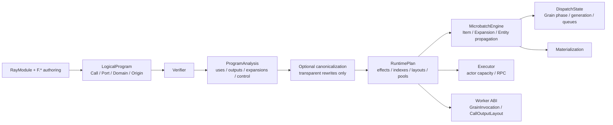

# MultiGrain v3.6: static semantic compiler boundary

This document records why v3.6 has a compiler and where that compiler stops.
It is a design reference rather than a beginner tutorial; start with
[`Getting Started`](multigrain_v3_6_getting_started.md) for a sequential
introduction. The Chinese source is retained in
[`multigrain_v3_6_compiler_boundary.zh.md`](multigrain_v3_6_compiler_boundary.zh.md).

## At a glance

### 1. Compiler contract

V3.6 uses one fixed, Ray-free pipeline:

```text
trace
 -> LogicalProgram
 -> verify logical invariants
 -> analyze uses, outputs, domains, and control demand
 -> optional transparent canonicalization
 -> lower to RuntimePlan
 -> verify the physical plan
```

The compiler is not a plugin framework or a general-purpose optimizer. Its
primary value is a complete static contract between authoring, runtime
semantics, and the worker ABI.

`LogicalProgram` stores user declarations: calls, ports, domains, and origins.
`ProgramAnalysis` stores discardable derived facts. `RuntimePlan` copies only
the immutable facts needed by execution: effects, trigger indexes, call input
and output layouts, actor-pool specifications, and the output tree. Runtime
code never interprets `PortOrigin` or scans the logical graph again.

### 2. Exhaustive primitive semantics

Every logical primitive is registered in
[`program/semantics.py`](../rayorch/experimental/multigrain_v3_6/program/semantics.py):

| Primitive | Logical relationship | Runtime lowering |
| --- | --- | --- |
| Source | Root input admission | Source manifest |
| Call output | Call plus output index | Worker output layout |
| Expand | Group item to ordered child entities | Atomic expansion report |
| Reduce | Values and members to an anchor | One reduce effect |
| Broadcast | Ancestor item to descendant entities | One broadcast effect |
| Filter | Source value plus boolean control | One filter effect |

The table is closed. Adding a primitive without a control and lowering entry is
a compile-time implementation error. Chained filters use the same control
demand fixed point rather than a special case in one analysis pass.

### 3. Canonicalization scope

With `optimize=False`, v3.6 still runs the same verification, analysis, and
lowering and disables only canonicalization. The current optimized rewrite
folds a transparent broadcast chain:

```text
broadcast(broadcast(root, child), grandchild)
  -> broadcast(root, grandchild)
```

The intermediate logical port remains visible. No actor, RPC, call, filter, or
failure boundary is removed. V3.6 deliberately does not implement dead-code
elimination, filter fusion, SSA, a generic pass manager, or a cost model: those
features would need stronger side-effect and failure proofs and have no
measured physical benefit in the target workload.

### 4. Physical explanation

`CompiledProgram.explain_text()` reports the logical-to-physical mapping. This
is a debugging and review aid, not a second execution plan. The worker receives
stable positional/keyword layouts and value-only DTOs; it does not reflect on
the `Pipeline`, `LogicalProgram`, or runtime tables.

### 5. Correctness boundary

The compiler proves static facts before Ray starts: reference closure, domain
ancestry, call/output alignment, control compatibility, and complete lowering.
The runtime proves dynamic facts: generation fencing, atomic multi-output
commit, local failure propagation, and terminal outcome idempotence. Keeping
these proofs in separate owners avoids a hidden interpreter or a second copy of
lineage state.

---

## MultiGrain v3.6: Static Semantic Compiler Boundary

> **Document niche: the design rationale and capability boundary of the compiler.**
> This document is a design note to be consulted by question, not a zero-baseline
> tutorial, and it does not describe the Ray event loop. The complete reading
> route is in the [`V3.6 documentation map`](multigrain_v3_6_documentation_map.md).

For the dynamic state machine convergence contract, see
[`multigrain_v3_6_design.md`](multigrain_v3_6_design.md). v3.6 removes the input
driver and unifies the runtime semantics of F.*, Grain, Item, and Expansion
through an exhaustively enumerable transition algebra. When you first encounter
V3.6, it is recommended to read the concise
[`multigrain_v3_6_getting_started.md`](multigrain_v3_6_getting_started.md); when
you are ready for in-depth maintenance, then read
[`multigrain_v3_6_maintainer_guide.md`](multigrain_v3_6_maintainer_guide.md), and
enter the [`complex source walkthrough`](multigrain_v3_6_walkthrough/README.md)
on demand.

### 1. Conclusion

What v3.6 introduces is not a general-purpose optimizer, but a fixed static
compilation pipeline whose canonicalization can be turned off. Its primary value
is correctness and decoupling between layers, not Filter fusion:

```text
trace
→ LogicalProgram
→ verify
→ analyze
→ optional canonicalize
→ lower
→ verify RuntimePlan
```

If the compiler were only used to merge adjacent Filters, this abstraction would
not be worth it. The reason v3.6 holds is that it simultaneously closes the
following contracts:

- Every primitive must declare its logical dependencies, its control
  demand/transfer, and its lowering.
- `LogicalProgram` no longer mixes in reverse indexes, control closure, or
  physical actor configuration.
- `MicrobatchEngine` only executes a complete `RuntimePlan`; it does not import
  or read `PortOrigin`.
- With optimization disabled, the same verifier, analysis, and lowering still
  run, forming a correctness baseline.
- `explain` can trace the logical→physical mapping and the canonical rewrite
  Port by Port.

### 2. One-way data structure relationships



The responsibility boundary is explicit; the dependency direction serves
readability and is not a formal constraint requiring an extra adaptation layer:

| Layer | Owns | Explicitly does not own |
| --- | --- | --- |
| `LogicalProgram` | user-declared Call, Port, Domain, Origin, output tree | consumers, control closure, pool, runtime Effect |
| `ProgramAnalysis` | recomputable uses, Call outputs, Expansion sources, control fixed point, group depth | actor handle, runtime state |
| `RuntimePlan` | Port Domain table, Call ABI, input/output layouts, immutable Effects and their trigger indexes, pool, output tree | `PortOrigin`, business payload, dynamic Entity |
| `MicrobatchEngine` | Item/Expansion/Entity lineage and structural propagation | Grain scheduling policy, logical Origin, actor handle, business value interpretation |
| `DispatchState` | Grain phase/generation, ready/immediate-retry/deferred-recovery queues, exact DispatchBatch recovery | Item/Expansion publication, UDF policy, actor handle |
| `Executor` | actor lifecycle, RPC, multi-microbatch capacity | primitive semantics, lineage inference |
| `Worker` | value-only batch UDF and stable DTO | Program, runtime tables, Ray scheduling policy |

`RuntimePlan` copies the static facts the runtime truly needs.
`MicrobatchEngine` does not read any provenance back through
`CompiledProgram.logical`, nor does it rescan Origins at construction time to
build a private index.

The source tree uses `program/` for static Program compilation, `runtime/` for
the dynamic semantic state machine, and `execution/` for the Ray/Worker physical
boundary. This is not a simple static/dynamic binary: `protocol.py` and
`recovery.py` are kept at the root as cross-layer pure contracts, avoiding
hard-coding the Worker ABI or recovery decisions into any single state owner.

### 3. Exhaustive primitive semantics

The only entry point is `semantics.describe_origin()`. Every origin, even one
with no control or runtime view behavior, must explicitly return a stop/pass
contract; unknown union members fall into `assert_never`.

| Primitive | Logical input | control semantics | Runtime lowering |
| --- | --- | --- | --- |
| Source | none | demand produces a manifest at source admission | `source-admission` |
| CallOutput | Call + output index | demand enters the Worker `CallOutputLayout` | `worker-output` |
| Expand | group Port | output demand propagates back to the group | `ExpandEffect`; its direct outputs are committed atomically by a successful report |
| Reduce | value + members | a group value cannot serve as a scalar mask | a single `ReduceEffect`, entering both the Item and Expansion-domain trigger indexes |
| Broadcast | ancestor source | output demand propagates back to the source | a single `BroadcastEffect`, entering both the Item and Entity-domain trigger indexes |
| Filter | source + mask | mask actively demands control; output demand propagates back to source | a single `FilterEffect`, entering both the source/mask indexes; source control may be copied when PRESENT |

Therefore chained filters no longer depend on some analysis pass happening to
remember `FilterOrigin`: the second Filter demands the output control of the
first Filter, and the unified semantics table passes the demand on to its source
until a fixed point.

### 4. What the compiler can do

Even with no performance optimization at all, the static compilation boundary
can still:

- verify reference closure, Domain ancestry, Call/Port alignment, and the Port
  DAG before Ray starts;
- force an exhaustive control and lowering contract on newly added primitives,
  reducing horizontal omissions;
- make `MicrobatchEngine`'s structural propagation interpret only complete
  physical Effects, no longer repeating logical pattern matching or looking up a
  second rule by target.

The `_FactEvent = ItemRef | ExpansionRef | EntityRef` inside MicrobatchEngine is
a closed, private fact-notification union. Each of the three facts is written by
a unique publication entry into a canonical table and enters the same FIFO;
`advance()` exhaustively matches the fact type and applies the corresponding
Effect index. The event does not carry outcome/binding/children and therefore
does not constitute a second copy of runtime state.

- generate a stable Worker `CallOutputLayout` and source control admission
  contract;
- lower the positional/keyword call shape written by the user into a stable
  `CallInputLayout`, so the Worker does not reflect on Pipeline or
  LogicalProgram;
- Logical `CallSpec` stores immutable `args` and ordered `kwargs` separately; an
  input value stores only `PortRef + InputMode`, and the keyword name is not
  duplicated in the value. Only the runtime uses dense slots.
- use `CompiledProgram.explain_text()` to explain the physical implementation of
  every logical Port;
- compile optimized and unoptimized plans simultaneously and run equivalence
  regressions on results and ItemOutcome.

The only canonicalization today is transparent Broadcast chain folding:

```text
broadcast(broadcast(root, child), grandchild)
→ broadcast(root, grandchild)
```

The intermediate logical Port is retained; only the source of the final physical
rule is pointed at the earliest ancestor. Broadcast executes no UDF, creates no
Grain, and only copies the same binding/outcome/control, so this rewrite does
not change business failure, membership, or actor semantics. `explain` records
before/after.

### 5. What the compiler cannot do

v3.6 does not claim that static compilation can:

- predict runtime Expand cardinality, or eliminate an N×M that genuinely exists
  in the workload;
- understand the purity, side effects, cost, or memory peak of an arbitrary
  Python UDF;
- replace `MicrobatchEngine`'s local failure propagation, retry generation, and
  stale fencing;
- automatically turn a general Reduce into a streaming aggregation;
- obtain actor/RPC gains by fusing structural views, since Filter has no actor or
  RPC in the first place;
- guarantee the performance of an arbitrary workload; physical optimization still
  needs profiling and end-to-end evidence.

Therefore the first version explicitly does not implement DCE, Filter fusion,
SSA, a generic PassManager, a plugin registry, or a cost model. DCE could change
the observable behavior of side-effecting UDFs, while Filter fusion would first
require proving failure/control/membership legality yet yields almost no
physical gain.

### 6. Retained and trimmed

v3.6 retains the parts of v3–v3.4 that already held:

- the `RayModule + F.*` user authoring model;
- Port/Domain orthogonality and explicit Expand/Reduce/Broadcast/Filter
  relationships;
- Call-only actor pools; structural primitives create no actor, RPC, or Grain;
- one Call currently has exactly one `ActorPoolSpec`, indexed directly by
  `CallRef`; there is no `PoolRef` without independent semantics and no second
  `call_to_pool` mapping;
- a single-writer, event-driven `MicrobatchEngine` with fine-grained
  Entity/Item/Grain lineage;
- the PRESENT/DROPPED/FAILED/SUPPRESSED outcome semantics;
- per-Grain atomic multi-output reports, generation fencing, and local replay;
- multiple microbatches sharing persistent actor capacity, with the Worker using
  value-only DTOs;
- a single real Ray Executor and a unified `BlockRef`.

At the same time, v3.4's structural hard limits are not carried into the new
version. The capacity of finite, materializable workloads is managed first by
admission, backpressure, and the microbatch lifecycle; if profiling shows
metadata cost becoming the bottleneck, the physical representation is optimized
rather than reducing fine-grained lineage semantics. v3.6 also removes
`ExpansionOutcome.OPEN`, reporter bookkeeping, and the `active_attempt` field,
none of which participated in any decision.

### 7. Public user path

The root package exposes only the objects needed for daily use:

```text
Pipeline / Port / RayModule / F.* / function
Executor / RunResult / CompiledProgram
ItemOutcome / RecordFailure / MISSING
RecoveryPolicy / CompileError / ExecutionError
```

The seven Refs, RuntimeState, DispatchState, Effect, and Worker DTOs are still
part of the complete implementation, but they belong to the maintainer path and
do not create extra user mental burden through the root package. `RunResult`
returns only frozen `CallMetrics` and `MicrobatchMetrics`; it does not leak a
mutable Engine, RuntimeState, or Ref-keyed internal dictionaries.

### 8. Verification scope

Ray-free regression covers:

- the complete set of the primitive semantics table;
- field isolation between `LogicalProgram` and derived facts;
- keyword-only calls, reversed-order kwargs, and default-parameter skipping;
- `MicrobatchEngine` source containing no Origin interpreter;
- chained filter control fixed point;
- rejection of group-valued masks;
- nested empty Expand/Reduce;
- optimized/unoptimized Broadcast outcome parity;
- generation fencing;
- aligned Expand mismatch publishing nothing partially;
- the AST dependency boundary gate for `program / runtime / execution`.

The submitted V3.6 release baseline gate is 111 Ray-free tests, 14 real-Ray
integration tests, and 0 pyright errors in core. Real-Ray coverage includes
empty input, run-local/lifetime metrics across repeated runs, persistent actors,
multiple microbatches, synchronous construction failure cleanup, actor crash
replacement, same-Grain replay, per-record business failure, contract error
fail-fast, and multi-output atomic failure.

The real workload gate is also complete. In two rounds of paired trials with
alternating order, MinerU 368 PDF is 0.551% faster than frozen V3.5, while
Docling 48 PDF, Video Caption 256, and Video Multimodal 256 are 1.260%, 1.990%,
and 0.492% slower than V3 respectively; all identity/structure contracts pass.
For the full configuration, means, sample variances, correctness, and
capacity-window counterexamples, see
[`2026-08-08_release_regression.md`](experiments/multigrain_v3_6/2026-08-08_release_regression.md).
Whether a later working tree is still within the same evidence scope should be
judged by the new gate; the current gaps are recorded in
[`architecture audit open items`](todos/22-v36-architecture-audit-findings.md).
