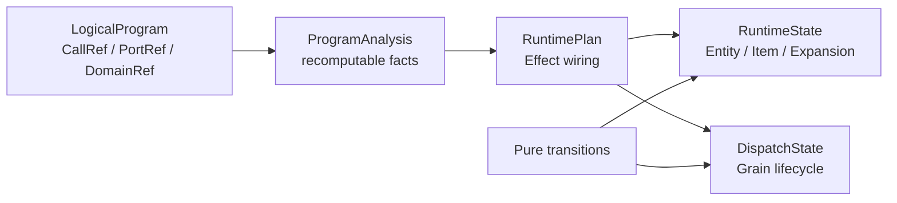

# MultiGrain v3.6: closed state machine and failure algebra

This is the normative runtime reference. The prior Chinese specification is
[`multigrain_v3_6_design.zh.md`](multigrain_v3_6_design.zh.md).

## At a glance

### 1. Identity model

The runtime distinguishes identities that are often conflated in batch
systems:

```text
Domain   -> a level of entities (for example document or page)
Entity   -> one occurrence in a Domain
Item     -> one Port × Entity occurrence
Grain    -> one Call × execution-Entity invocation
Expansion -> ordered parent-to-child membership
```

`PortRef`, `DomainRef`, `EntityRef`, `ItemRef`, and `GrainRef` are immutable
coordinates. A coordinate is not a business value and is never reused across
unrelated domains.

### 2. Closed phases and outcomes

Dispatch has three phases:

```text
READY -> IN_FLIGHT -> SEALED
```

Only reservation moves a ready grain to `IN_FLIGHT`; only a generation-fenced
report or an explicit terminal decision seals it. The transition table in
[`runtime/transitions.py`](../rayorch/experimental/multigrain_v3_6/runtime/transitions.py)
rejects every unlisted phase/event pair.

An item has one terminal outcome:

```text
PRESENT     value is available
DROPPED     a filter or required input removed it
FAILED      its producing grain reported a business failure
SUPPRESSED  an upstream failure or suppression barrier made it ineligible
```

Terminal outcomes are idempotent and cannot be overwritten by late reports.

### 3. Fact publication

`MicrobatchEngine` is the single writer for semantic facts. Item, expansion,
and entity publications enter one private FIFO. `advance()` consumes facts and
applies the precompiled effect indexes until the local fixed point is reached.
Facts do not carry a second copy of outcome, lineage, or child state, so the
FIFO is an event channel rather than another state machine.

`DispatchState` owns only grain phases, generations, and physical queues. It
does not infer lineage or interpret structural primitives. `Executor` owns Ray
handles and RPC futures but cannot mutate semantic tables directly.

### 4. Atomic reports

One worker report contains all output ports for one grain and one generation.
The engine validates the complete report before publishing any output. If an
output count, row alignment, or binding is invalid, no part of that grain is
committed. This is the multi-output atomicity boundary.

Generation fencing makes replay safe: a report from an older attempt is ignored
after a newer generation has been accepted or the grain has been sealed.

### 5. Explicit failure sentinels

`RecordFailure` is a normal UDF return value that fails only the current grain:

```python
return mg.RecordFailure("malformed page")
```

`GroupFailure` is the intentionally stronger, separate type:

```python
return mg.GroupFailure("document is poisoned")
```

It fails the current grain and establishes a microbatch-local barrier keyed by
the call and the direct parent. Ready siblings behind that barrier are sealed
as `SUPPRESSED` at dequeue time. A sibling RPC already sent to another actor is
not killed; its late report is checked at commit time and is either committed
normally (if the barrier was not established) or converted to `SUPPRESSED`.
Other parents, calls, and healthy outputs continue normally.

Neither sentinel requests a retry. Opaque exceptions follow
[`RecoveryPolicy`](../rayorch/experimental/multigrain_v3_6/recovery.py), which
reduces immutable retry facts to a closed action set. Infrastructure failures
may replace an actor and replay a generation while budget remains.

### 6. Recursive parent propagation

Suppression is recorded against the direct parent in the current child domain.
Downstream effects observe that terminal outcome through the canonical fact FIFO;
they do not walk arbitrary Python objects or perform a global scan. If a later
structural operation creates another child domain, its own direct-parent edge
is published and the same rule is applied there. This makes recursive
propagation explicit while keeping each dequeue check O(1) average via a
call/parent barrier set.

### 7. Invariants

The following properties are tested at the Ray-free boundary and again in
integration tests:

1. every grain is sealed at most once per generation;
2. every item has at most one terminal outcome;
3. a failed multi-output grain publishes no partial outputs;
4. a suppression barrier never suppresses another parent or call;
5. already submitted RPCs are not revoked, but their commits are fenced;
6. empty domains and nested expansion/reduction terminate without a hidden
   sentinel state;
7. healthy siblings still commit when a different sibling is isolated.

---

## MultiGrain v3.6: Closed State Machine and Flywire-Free Semantics

> **Document niche: the normative state machine and structural semantics contract.**
> Consult it on demand when reviewing new behavior; for a first read, follow the
> order given by the [`V3.6 documentation map`](multigrain_v3_6_documentation_map.md).
> You do not need to start with this document.

For the sequential learning path, see
[`multigrain_v3_6_getting_started.md`](multigrain_v3_6_getting_started.md); for the
cross-component maintenance contract, see
[`multigrain_v3_6_maintainer_guide.md`](multigrain_v3_6_maintainer_guide.md).

### 1. Goals and boundaries

v3.6 converges dynamic semantics; it does not add a general-purpose optimizer,
registry, or new identity concepts. The goal is to give every state and every
primitive relationship exactly one responsibility, and to make the runtime
execute only state transitions that are exhaustively enumerable and independent
of input order.

What this version closes is tree-shaped, acyclic lineage: same-Entity
computation, Expand refinement, Reduce reclamation, Broadcast ancestor
projection, Filter membership selection, and Optional default inputs.
Join/Shuffle across unrelated Domains, many-to-many regroup, and feedback loops
are outside this contract; if they are supported in the future, a new explicit
identity primitive must be introduced, and no input Port may be borrowed as an
implicit driver.

### 2. Seven identities and four classes of runtime fact

The static graph needs only three coordinates, and dynamic execution needs only
four composite identities:

```text
static:  CallRef / PortRef / DomainRef
dynamic: EntityRef / ItemRef / GrainRef / ExpansionRef
```

`LogicalProgram` provides the stable definitions and relationships of the first
three Refs; the state machine is not attached to logical nodes, but is instead
held by independent `RuntimeState` and `DispatchState`, which store facts keyed
by the four dynamic Refs:



The source directory directly reflects this boundary: `program/` only stores and
compiles the static Program, `runtime/` only manages the dynamic facts of a
single microbatch, and only `execution/` holds Ray actors, RPC, and Worker. The
root `model.py` / `protocol.py` / `recovery.py` are the Ray-free contracts shared
by every layer; dependency gate tests prevent Program from importing
runtime/execution in reverse, and prevent runtime from bypassing RuntimePlan to
read compiler internals back.

The four classes of dynamic fact are:

| Fact | Identity | Sole responsibility |
| --- | --- | --- |
| Entity | `Domain × occurrence` | the immutable logical occurrence in a Domain |
| Item | `Port × Entity` | the immutable terminal state of one Port for that Entity |
| Grain | `Call × Entity` | one logical invocation of a RayModule on that Entity |
| Expansion | `child Domain × parent Entity` | whether an Expand is terminal, and its ordered child Entities |

Entity only has "does not exist → exists"; it has no dropped/failed state. root
Entities are created by source admission, and child Entities only by a
successful Expand; Filter only changes the target Item and never deletes an
Entity. All Call inputs belong to the same Domain, so Grain identity is not
driven by any single input Port, and `driven_by` has been removed from the API,
LogicalProgram, and runtime.

Item uses absence from the table to mean `UNRESOLVED`, and can enter the four
mutually exclusive terminal outcomes exactly once:

```text
UNRESOLVED → PRESENT | DROPPED | FAILED | SUPPRESSED
```

- `PRESENT`: a ValueBinding exists.
- `DROPPED`: the Port is confirmed not to contain this Entity.
- `FAILED`: the Item's direct producer failed; a transparent view may retain
  that failure.
- `SUPPRESSED`: the producer should not execute or commit because of an upstream
  failure or a same-parent suppression barrier.

A Grain's `WAITING` is represented by pending input slots and is not stored in
`GrainPhase`:

```text
WAITING → READY → IN_FLIGHT → SEALED
    └───────────────────────→ SEALED
             READY ─────────→ SEALED  (parent suppression)
               IN_FLIGHT → READY  (recovery, generation + 1)
```

#### READY queue partitioning and driver backpressure

`DispatchState`'s ready queue belongs to only one microbatch, but it may hold
READY Grains of several Calls at the same time. The old implementation put them
in a single shared `deque`; when the Executor selected an actor batch for one
Call, `priority(call)` had to linearly search for the Grains belonging to that
Call, and `reserve(call)` scanned and rebuilt the entire deque. Even after
`batch_size` was filled, the remaining entries still had to be visited in order
to preserve the order of other Calls and of unselected Grains.

Suppose the current shared queue has `N` READY entries, the target Call has `n`,
and the batch size is `B`:

- one `priority(call)` is worst-case `O(N)`;
- one `any_parent` reservation is `O(N)`, not `O(B)`;
- draining the target Call's backlog alone requires scanning
  `n + (n - B) + (n - 2B) + ... = O(n² / B)`;
- if `m` entries of other Calls remain in the queue meanwhile, about
  `ceil(n / B) × m` additional visits occur.

This cost sits on the serial critical path of the single-threaded driver, not in
Ray CPU actors. Before the Executor submits the next batch of RPCs, it must
query READY work across all active microbatches and then walk idle actors by
Call. A large CPU Call queue can therefore create head-of-line blocking before
the GPU Call gets its turn. Although the GPU actor still holds the GPU resource,
it receives no new `execute.remote()` after the previous batch finishes, which
shows up as GPU allocated but utilization dropping. More CPU replicas do not
parallelize this driver-local state machine; they instead increase the number of
actors that one refill has to serve.

The current implementation keeps an independent ready FIFO per `CallRef`:

```text
ready: CallRef -> deque[GrainRef]
```

Therefore `priority(call)` is `O(1)` for READY work; `any_parent` reservation pops
at most `B` Grains from the target deque only, which is `O(B)`, and draining one
Call is `O(n)` in total. There is no observable dequeue order between different
Calls in the first place, so a per-Call FIFO is equivalent to the stable
projection of the old shared FIFO onto that Call. `pack_by_parent` may still scan
the target Call queue to collect same-parent Grains, but it no longer visits
other Calls and preserves the relative FIFO order of all unselected Grains. The
immediate-retry and deferred-recovery queues remain independent, and their priority is
immediate-retry → ready → deferred-recovery.

A microbenchmark using reduced real `GrainRef`s contains 5,536 READY entries:
the shared deque visited 3,023,296 entries and took 2.735 seconds to drain each
Call, while the per-Call deque visited only 5,536 entries and took 7.65
milliseconds. This result shows that the hot spot comes from repeated nested Ref
hashing, dictionary lookups, and deque rebuilding, not from one simple short
loop.

In a 64×H20 four-frame video task with the same model, data, and batch
parameters, the old implementation's best continuous 60-second GPU utilization
averaged 73.20%, while the per-Call queue's continuous 60-second average was
97.73%. Under that configuration, decode measured about 1,191 clips/s, whereas
64 fused teacher actors at full load need only about 184 clips/s, so the result
is consistent with driver refill rather than HDFS throughput being the primary
bottleneck. The utilization here is workload evidence and is not part of the
runtime semantics contract; correctness is still guaranteed independently by the
Call FIFO, `pack_by_parent`, and recovery queue tests.

Expansion must exist independently, because "no child yet" may mean pending,
successfully expanded to empty, dropped, or failed. The terminal states are
`SUCCEEDED(children)`, `DROPPED`, and `FAILED`; cardinality is derived only from
`len(children)`, and no second numeric fact is maintained.

### 3. Symmetric input algebra of RayModule

Call inputs have no driver; the Grain is decided by a commutative reduction that
is independent of slot order:

1. If any REQUIRED/OPTIONAL input is `FAILED` or `SUPPRESSED`: do not execute,
   output `SUPPRESSED`.
2. Otherwise, if any REQUIRED input is `DROPPED`: do not execute, output
   `DROPPED`.
3. Otherwise the Grain is `READY`; OPTIONAL + `DROPPED` becomes `MISSING` in the
   Worker ABI.

Therefore, when failure and drop are mixed, failure wins; a fully optional Call
also has well-defined semantics, because the terminal Item itself carries Entity
identity and no required input is needed as an identity anchor.

### 4. Closed semantics of F.*

#### Filter

`F.filter(source, mask)` keeps Domain/Entity unchanged. source is the value
being filtered and mask is the explicit gate: when source is not PRESENT,
propagate as-is; otherwise a non-PRESENT mask propagates as-is, `PRESENT(True)`
reuses the source binding, and `PRESENT(False)` produces `DROPPED`. If the
output continues to serve as a mask, control demand propagates backward along
the Filter source to a fixed point.

#### Broadcast

In `F.broadcast(source, like=port)`, `like` only selects the target descendant
Domain and does not provide membership. Every already-created Entity of the
target Domain finds its ancestor through lineage and transparently copies the
source's outcome, binding, and on-demand control. If the membership of `like`
must be inherited, the user must write an explicit Filter.

#### Expand

Expand is the only primitive that creates new Entities. A successful report
produces `SUCCEEDED(children)`, including a legitimately empty tuple; a Call
output of `DROPPED` produces `ExpansionOutcome.DROPPED`, and `FAILED/SUPPRESSED`
produce `ExpansionOutcome.FAILED`, and none of them create children.
`expand_aligned` is only a way for several outputs of the same Call to share one
Expansion; the cardinality must be identical.

#### Reduce

Reduce returns to an already existing parent Entity. While the Expansion is
pending, the Item stays pending; Expansion `DROPPED` produces `DROPPED`, and
Expansion `FAILED` produces `SUPPRESSED`. After a successful Expansion, children
whose members are `PRESENT` join the group and children that are `DROPPED` are
excluded; members `FAILED/SUPPRESSED` suppress the entire result. Only the values
of survivors are checked, and any non-PRESENT value produces `SUPPRESSED`; zero
survivors produce a PRESENT empty group.

#### Optional and aligned API

`F.optional` only modifies Call input policy; it does not create a Port, Entity,
or Grain. `expand_aligned` and `reduce_aligned` are only multi-Port spellings
that share an Expansion or members; they are not new primitives.

### 5. Implementation discipline and verification

- `semantics.describe_origin()` is the exhaustive entry point for static
  primitive dependency/control/lowering.
- The independent pure transition algebra is the exhaustive entry point for
  dynamic outcome/phase; `MicrobatchEngine` is responsible for fact publication
  and binding and does not reinvent state priority.
- Symmetric Calls use a commutative reduction; asymmetries such as Filter source
  and Reduce members can only be introduced by an explicit primitive role, not
  by input order or a default slot.
- Item, Expansion, and Entity publication are monotonic and idempotent;
  conflicting publication must fail.
- `_FactEvent = ItemRef | ExpansionRef | EntityRef` is only a set of fact
  identity notifications: the three unique publication entries write canonical
  tables and then enter the same FIFO, and `advance()` is the only propagation
  entry point; the Event does not copy outcome, binding, children, or lineage.
- Each Filter/Reduce/Broadcast Port lowers into exactly one complete, immutable
  `XxxEffect`; the target catalog, Item trigger, and Domain trigger all
  reference that same object, and it is not allowed to use a target-only Route
  to look up a second Rule.
- Every transition is covered by Cartesian-product tests rather than only a few
  end-to-end happy paths: Call covers required/optional × four ItemOutcomes,
  Filter covers source × mask × bool, Broadcast covers four outcomes, Expand
  covers four upstream outcomes, Reduce covers Expansion and the members/value
  gate, and Grain covers all legal and illegal phase/event combinations.

Any newly added primitive or state must simultaneously answer: which identity it
creates, which facts it consumes, what terminal state it produces, how control
propagates, whether a Worker is needed, and why it cannot be expressed in the
existing Cartesian products. A feature that cannot answer these questions does
not enter v3.6.

### 6. Failure classification and recovery algebra

failure kind and recovery policy are two orthogonal axes:

- `RecordFailure` is a business terminal state already localized to a single
  Grain; it only commits that Grain as `FAILED`;
- `GroupFailure` is likewise a business terminal state returned normally: the
  current Grain becomes `FAILED`, and it establishes a
  `(CallRef, direct parent EntityRef)` barrier that makes not-yet-committed
  same-scope siblings `SUPPRESSED`; it does not roll back facts that precede the
  barrier, and it does not trigger a retry;
- `CONTRACT_ERROR` means the Worker ABI was violated and must fail fast;
- `UDF_ERROR` is an opaque business exception for the whole dispatch, decided by
  the `RecoveryPolicy` on the Call;
- `INFRA_FAILURE` means the actor/RPC is untrustworthy; only fresh-actor replay
  is possible, the run terminates once the budget is exhausted, and it must not
  be faked as an Item failure.

`RecoveryPolicy` has only four UDF modes — `abort`, `retry_batch`,
`retry_tail`, `isolate_tail` — plus an independent `infra_retries`. The default
is UDF abort and one infra retry. `isolate_tail` is fixed as one whole
queue-tail replay, followed by bisection of the still-failing non-singletons;
only a singleton publishes FAILED. Hence no `max_depth` or `min_batch` is
needed, and execution amplification has a finite bound given by input
cardinality.

WorkerDispatchResult must be committed only after a whole-batch pre-scan: explicit
failures take precedence over the barrier, a successful report that hits the
barrier is discarded before any Item/Expansion/child Entity is created, and
successful results of other parents commit normally. READY dequeue, Call input
admission, late in-flight commit, and opaque/infra recovery all consult the same
microbatch-local barrier table inside the Engine; Worker/Executor do not parse
lineage and do not cancel RPCs already started on other actors. The ready queue
is still partitioned by Call, and each `any_parent` entry adds only one expected O(1)
hash lookup.

Recovery actions are exhaustively enumerated by the Ray-free pure functions of
`RecoveryPolicy`; the exact Grain batch, the `udf_retries` carried with the
batch, and the ready/immediate-retry/deferred-recovery queues all belong to the single
`DispatchState` inside `MicrobatchEngine`. The Engine is responsible only for
Item/Expansion/Entity propagation, and the Executor only holds actor capacity and
pending ObjectRefs; neither may own a second READY authority. The compiler
normalizes authoring options into a strongly typed `ActorPoolSpec` uniquely
indexed by `CallRef`; it has no redundant `PoolRef` identity or `call_to_pool`
mapping. The legacy ambiguous `max_retries` is rejected at compile time, and Ray
actor options remain opaque trailing configuration.

Logical `CallSpec` directly stores immutable positional inputs and ordered
keyword inputs; each input value contains only `PortRef + InputMode`. Keyword
names exist only in kwargs keys, and the compiler generates the unique dense slot
order and `CallInputLayout` at lowering time; the runtime does not read back or
re-guess the Python call shape.
