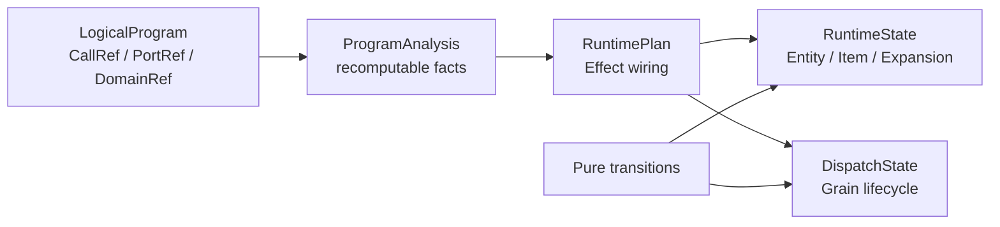

# MultiGrain v3.6：封闭状态机与无飞线语义

> **文档生态位：规范性的状态机与结构语义合同。** review 新行为时按需查阅；第一次学习请走
> [`V3.6 文档地图`](multigrain_v3_6_documentation_map.md)给出的顺序，不需要从本文开始。

顺序学习路径见
[`multigrain_v3_6_getting_started.md`](multigrain_v3_6_getting_started.md)；跨组件维护合同见
[`multigrain_v3_6_maintainer_guide.md`](multigrain_v3_6_maintainer_guide.md)。

## 1. 目标与边界

v3.6 收敛动态语义，不增加通用 optimizer、registry
或新的身份概念。目标是让每个状态和每条 primitive 关系都有唯一职责，并让
runtime 只执行可穷举、与输入顺序无关的状态转移。

本版封闭的是树状、无环 lineage：同 Entity 计算、Expand 细化、Reduce 回收、
Broadcast 祖先投影、Filter 成员筛选和 Optional 缺省输入。跨无关 Domain 的
Join/Shuffle、多对多 regroup 与 feedback loop 不属于本合同；将来若支持，必须
引入新的显式身份原语，不能借用某个输入 Port 充当隐式 driver。

## 2. 七种身份与四类运行时事实

静态图只需要三个坐标，动态执行只需要四个复合身份：

```text
static:  CallRef / PortRef / DomainRef
dynamic: EntityRef / ItemRef / GrainRef / ExpansionRef
```

`LogicalProgram` 提供前三种 Ref 的稳定定义和关系；状态机不挂在逻辑节点上，而是
由独立的 `RuntimeState` 与 `DispatchState` 以四种动态 Ref 为 key 保存事实：



源码目录直接反映这个边界：`program/` 只保存和编译静态 Program，
`runtime/` 只管单个 microbatch 的动态事实，`execution/` 才持有 Ray actor、
RPC 和 Worker。根部 `model.py` / `protocol.py` / `recovery.py` 是各层共享的
Ray-free 合同；依赖门禁测试防止 Program 反向导入 runtime/execution，也防止
runtime 绕过 RuntimePlan 回读 compiler internals。

四类动态事实分别是：

| 事实 | 身份 | 唯一职责 |
| --- | --- | --- |
| Entity | `Domain × occurrence` | Domain 中不可变的逻辑 occurrence |
| Item | `Port × Entity` | 某 Port 对该 Entity 的不可变终态 |
| Grain | `Call × Entity` | RayModule 对该 Entity 的一次逻辑调用 |
| Expansion | `child Domain × parent Entity` | Expand 是否终态及其有序 child Entities |

Entity 只有“不存在→存在”，不存在 dropped/failed 状态。root Entity 由 source
admission 创建，child Entity 只由成功 Expand 创建；Filter 只改变目标 Item，
不会删除 Entity。所有 Call 输入属于同一 Domain，因此 Grain 身份不由任一输入
Port 驱动，`driven_by` 从 API、LogicalProgram 与 runtime 中删除。

Item 以表中缺席表示 `UNRESOLVED`，只能一次性进入四个互斥终态：

```text
UNRESOLVED → PRESENT | DROPPED | FAILED | SUPPRESSED
```

- `PRESENT`：存在 ValueBinding。
- `DROPPED`：该 Port 已确认不包含此 Entity。
- `FAILED`：Item 的直接生产者失败；透明视图可保留该失败。
- `SUPPRESSED`：生产者因上游失败而未执行。

Grain 的 `WAITING` 由 pending input slots 表示，不存入 `GrainPhase`：

```text
WAITING → READY → IN_FLIGHT → SEALED
    └───────────────────────→ SEALED
               IN_FLIGHT → READY  (recovery, generation + 1)
```

Expansion 必须独立存在，因为“尚无 child”可能是未决、成功展开为空、drop 或失败。
终态为 `SUCCEEDED(children)`、`DROPPED`、`FAILED`；cardinality 只由
`len(children)` 派生，不维护第二份数字事实。

## 3. RayModule 的对称输入代数

Call 输入没有 driver，按一个交换、与槽位顺序无关的归约决定 Grain：

1. 任意 REQUIRED/OPTIONAL 输入为 `FAILED` 或 `SUPPRESSED`：不执行，输出
   `SUPPRESSED`。
2. 否则任意 REQUIRED 输入为 `DROPPED`：不执行，输出 `DROPPED`。
3. 否则 Grain `READY`；OPTIONAL + `DROPPED` 在 Worker ABI 中变成 `MISSING`。

因此混合 failure/drop 时 failure 优先；全 optional Call 也有明确语义，因为
terminal Item 本身携带 Entity 身份，不需要必需输入充当身份锚点。

## 4. F.* 的封闭语义

### Filter

`F.filter(source, mask)` 保持 Domain/Entity 不变。source 是被筛选值，mask 是
显式 gate：source 非 PRESENT 时原样传播；否则 mask 的非 PRESENT 原样传播，
`PRESENT(True)` 复用 source binding，`PRESENT(False)` 产生 `DROPPED`。若输出
继续作为 mask，control demand 沿 Filter source 做 fixed-point 反传。

### Broadcast

`F.broadcast(source, like=port)` 中 `like` 只选择目标后代 Domain，不提供成员
资格。目标 Domain 每个已创建 Entity 通过 lineage 找到 ancestor，并透明复制
source 的 outcome、binding 和按需 control。若需要继承 `like` 的成员资格，用户
必须显式 Filter。

### Expand

Expand 是唯一创建新 Entity 的 primitive。成功 report 产生
`SUCCEEDED(children)`，包括合法的空 tuple；Call 输出 `DROPPED` 产生
`ExpansionOutcome.DROPPED`，`FAILED/SUPPRESSED` 产生
`ExpansionOutcome.FAILED`，且均不创建 child。
`expand_aligned` 只是多个同一 Call 输出共享一个 Expansion，cardinality 必须相同。

### Reduce

Reduce 回到已经存在的 parent Entity。Expansion 未决时保持 Item 未决；Expansion
`DROPPED` 产生 `DROPPED`，Expansion `FAILED` 产生 `SUPPRESSED`。Expansion 成功后，
members `PRESENT` 的 child 入组、`DROPPED` 的 child 排除；members
`FAILED/SUPPRESSED` 抑制整个结果。只检查 survivors 的 value，任一非 PRESENT
都会产生 `SUPPRESSED`；零 survivors 产生 PRESENT 空 group。

### Optional 与 aligned API

`F.optional` 只修改 Call 输入策略，不创建 Port/Entity/Grain。`expand_aligned`
和 `reduce_aligned` 只是共享 Expansion 或 members 的多 Port 写法，不是新 primitive。

## 5. 实现纪律与验证

- `semantics.describe_origin()` 是静态 primitive 依赖/control/lowering 的穷尽入口。
- 独立的纯 transition algebra 是动态 outcome/phase 的穷尽入口；MicrobatchEngine 负责事实
  发布和 binding，不重新发明状态优先级。
- 对称 Call 使用交换归约；Filter source、Reduce members 等不对称只能由明确的
  primitive role 引入，不能由输入顺序或默认 slot 引入。
- Item、Expansion、Entity publication 是单调且幂等的；冲突 publication 必须失败。
- `_FactEvent = ItemRef | ExpansionRef | EntityRef` 只是一组事实身份通知：三个唯一
  publication 入口写 canonical tables 后进入同一 FIFO，`advance()` 是唯一传播入口；
  Event 不复制 outcome、binding、children 或 lineage。
- 每个 Filter/Reduce/Broadcast Port 只 lower 成一个完整、不可变的 `XxxEffect`；
  target catalog、Item trigger 和 Domain trigger 都引用该同一对象，不允许用
  target-only Route 再回查第二份 Rule。
- 每种 transition 都用笛卡尔积测试覆盖，而不只用少量端到端 happy path：Call
  覆盖 required/optional × 四种 ItemOutcome，Filter 覆盖 source × mask × bool，
  Broadcast 覆盖四种 outcome，Expand 覆盖四种上游 outcome，Reduce 覆盖 Expansion
  与 members/value gate，Grain 覆盖所有 phase/event 合法与非法组合。

任何新增 primitive 或状态都必须同时回答：它创建哪种身份、消费哪些事实、产生
什么终态、control 如何传播、是否需要 Worker，以及现有笛卡尔积中为什么无法
表达。不能回答这些问题的 feature 不进入 v3.6。

## 6. Failure 分类与恢复代数

failure kind 与 recovery policy 是正交的两个轴：

- `RecordFailure` 是已经定位到单 Grain 的业务终态，直接走正常 `commit_failure`；
- `CONTRACT_ERROR` 表示 Worker ABI 被违反，必须 fail-fast；
- `UDF_ERROR` 是整次 dispatch 的不透明业务异常，由 Call 上的 `RecoveryPolicy` 决策；
- `INFRA_FAILURE` 表示 actor/RPC 不可信，只能 fresh-actor replay，耗尽后终止 run，
  不能伪造成 Item failure。

`RecoveryPolicy` 只有 `abort`、`retry_batch`、`retry_tail`、`isolate_tail` 四种
UDF 模式和独立的 `infra_retries`。默认是 UDF abort、infra retry 一次。
`isolate_tail` 固定为整组队尾重放一次，随后对仍失败的非 singleton 做二分；
singleton 才发布 FAILED。因此无需 `max_depth` 或 `min_batch`，执行放大由输入
cardinality 给出有限上界。

恢复动作由 Ray-free 的 `RecoveryPolicy` 纯函数穷举；精确 Grain batch、随 batch
携带的 `udf_retries` 以及 normal/immediate/tail queues 全部归 `MicrobatchEngine` 内唯一的
`DispatchState` 所有。Engine 只负责
Item/Expansion/Entity 传播，Executor 只持有 actor capacity 和 pending ObjectRef，两者都不能
拥有第二份 READY authority。compiler 把 authoring options 归一化为按 `CallRef`
唯一索引的强类型 `ActorPoolSpec`；它没有冗余的 `PoolRef` 身份或 `call_to_pool` 映射。
旧的歧义 `max_retries` 在编译期拒绝，Ray actor options 才保留为不透明尾部配置。

Logical `CallSpec` 直接保存 immutable positional inputs 与 ordered keyword inputs；
每个输入值只包含 `PortRef + InputMode`。关键字名只存在 kwargs key 中，compiler 在
lowering 时才生成唯一的 dense slot 顺序和 `CallInputLayout`，runtime 不回读或重新猜测
Python 调用形状。
