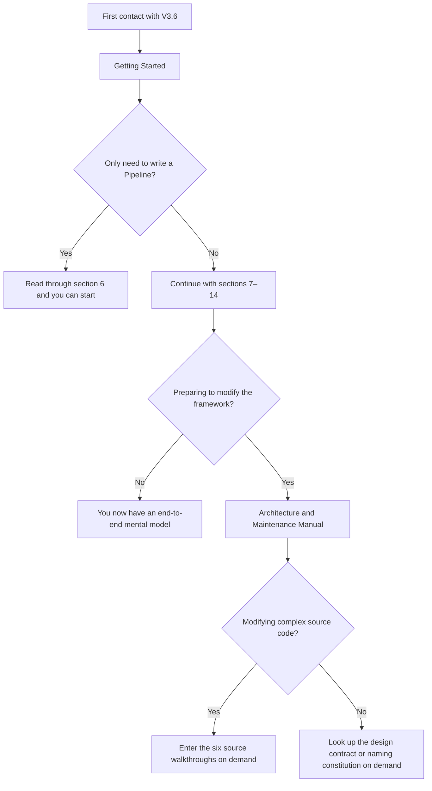

# MultiGrain v3.6 documentation map

This directory is the English reviewer-facing documentation set. Chinese
translations are retained beside each document with a `.zh.md` suffix.

## At a glance

### Recommended reading paths

```text
first-time user
  -> getting_started.md

runtime/compiler reviewer
  -> getting_started.md
  -> multigrain_v3_6_compiler_boundary.md
  -> multigrain_v3_6_design.md

maintainer
  -> getting_started.md
  -> multigrain_v3_6_maintainer_guide.md
  -> walkthrough/README.md
```

| Document | Main question | Stop when |
| --- | --- | --- |
| [`Getting Started`](multigrain_v3_6_getting_started.md) | How do I author and run a v3.6 pipeline? | You can write a pipeline and identify its boundaries. |
| [`Static compiler boundary`](multigrain_v3_6_compiler_boundary.md) | What is compiled, verified, and deliberately not optimized? | You can distinguish logical declarations from a runtime plan. |
| [`State machine and failure algebra`](multigrain_v3_6_design.md) | Which runtime transitions and outcomes are legal? | You can review a recovery or propagation change. |
| [`Maintainer guide`](multigrain_v3_6_maintainer_guide.md) | Which component owns a fact and where should a change land? | You can name the owner and its regression gate. |
| [`Naming constitution`](multigrain_v3_6_naming.md) | Which terms and module locations are stable? | A new concept has one unambiguous home. |
| [`Source walkthroughs`](multigrain_v3_6_walkthrough/README.md) | How do the larger implementation files fit together? | You have reached the file relevant to your change. |
| [`Release regression`](experiments/multigrain_v3_6/2026-08-08_release_regression.md) | What evidence was collected for the submitted baseline? | You need workload numbers or test scope. |

### Layering

The package is intentionally split into three layers:

1. `program/` traces and compiles immutable logical declarations;
2. `runtime/` applies a closed event algebra to one microbatch;
3. `execution/` connects the engine to Ray actors and worker calls.

`protocol.py` and `recovery.py` contain Ray-free cross-layer DTOs and decision
algebras. Structural primitives (`F.expand`, `F.reduce`, `F.broadcast`, and
`F.filter`) describe relationships; only a `RayModule` call creates executable
work.

### Normative precedence

When documents disagree, use this order:

```text
source code and tests
  -> state-machine and naming specifications
  -> maintainer guide
  -> getting-started and walkthrough prose
  -> historical experiment notes
```

Experiment reports describe the exact version and workload that was measured;
they do not silently become a guarantee for later untested changes.

### Language convention

Unqualified `.md` files are English and are the links intended for reviewers.
The `.zh.md` files preserve the previous Chinese material in the same
directory. Code comments and docstrings remain implementation-local and do not
change the public API or execution semantics.

---

## MultiGrain V3.6 Documentation Map

> **Document niche: the single entry point for all V3.6 documentation.** This
> document no longer explains framework semantics; instead it tells different
> readers where to start, where they can stop, and what role each of the
> specifications, tutorial, source walkthroughs, experiments, and TODOs plays.

V3.6 no longer maintains a startup document and a tutorial whose contents
overlap. There is only one sequential path for a first read:
[`Getting Started`](multigrain_v3_6_getting_started.md). Cross-component
contracts, per-segment source code, normative constraints, and audit results
each go into independent documents, so that the same fact does not appear in
several slightly different explanations.

---

### 1. Choose the shortest route by reader



The three shortest routes:

1. **Pipeline user**: `Getting Started` sections 1–6.
2. **Someone who wants to understand the execution mechanism**: `Getting
   Started` sections 1–14.
3. **Framework maintainer**: the complete `Getting Started` → `Architecture and
   Maintenance Manual` → choose source walkthroughs by task.

Experiment reports, architecture audits, and TODOs are not prerequisite material
for a first read.

---

### 2. Core learning documents

| Document | Depth | Main question | When you can stop |
| --- | --- | --- | --- |
| [`Getting Started`](multigrain_v3_6_getting_started.md) | from shallow to deep | how to write a Pipeline; what the seven identities, F.*, compilation, and one execution are | ordinary users stop at section 6; to understand the runtime read through section 14 |
| [`Architecture and Maintenance Manual`](multigrain_v3_6_maintainer_guide.md) | medium | who owns a state, what components pass to each other, which path a feature should change | once you can judge where a change lands and list its verification gates |
| [`Complex Source Walkthrough`](multigrain_v3_6_walkthrough/README.md) | deep into source | the data structures, queues, state transitions, and control flow inside long files | read only the chapter relevant to your current task; no need to finish it in one sitting |

A small amount of deliberate bridging is allowed among the three layers, but
they do not duplicate the full explanation:

- `Getting Started` builds concepts through examples and excerpts only the
  shortest responsibility snippet;
- the `Architecture and Maintenance Manual` aggregates cross-component owners,
  DTOs, and change discipline;
- only the `Complex Source Walkthrough` unfolds the implementation by actual
  functions and data structures.

The old `multigrain_v3_6_tutorial.md` has been replaced by these three layers.
Its introductory content moved into `Getting Started`, while maintenance
contracts and Engine/Executor details moved into the latter two layers, so a
giant tutorial overlapping all three is no longer kept.

---

### 3. Six source walkthroughs and one architecture comparison

The source walkthroughs are ordered from static data transformation to physical
execution:

1. [`01: Authoring API`](multigrain_v3_6_walkthrough/01_authoring_api.md): how
   symbolic calls form a `LogicalProgram`.
2. [`02: Compiler pipeline`](multigrain_v3_6_walkthrough/02_compiler_pipeline.md):
   how the declaration graph goes through verify, analysis, canonicalize, and
   lowering to form a `RuntimePlan`.
3. [`03: Runtime Engine`](multigrain_v3_6_walkthrough/03_runtime_engine.md): how
   canonical tables, the Fact FIFO, `advance()`, and structural Effects form a
   local fixed point.
4. [`04: DispatchState`](multigrain_v3_6_walkthrough/04_dispatch_state.md): how
   Grain phase, generation, and the three runnable queues change.
5. [`05: Worker ABI`](multigrain_v3_6_walkthrough/05_worker_abi.md): how
   `GrainInvocation` is restored into a UDF batch, and how outputs become a per-Grain
   report.
6. [`06: Executor event loop`](multigrain_v3_6_walkthrough/06_executor_event_loop.md):
   how actor capacity, pending RPC, the microbatch lifecycle, and recovery
   cooperate.

[`07: V3→V3.6 readability audit`](multigrain_v3_6_walkthrough/07_v3_vs_v36_readability.md)
is not a seventh runtime component but a horizontal architecture comparison. It
is used to answer "is V3.6 really easier to understand than V3" and carries no
backlog of items to fix; open questions are recorded uniformly in
[architecture audit open items](todos/22-v36-architecture-audit-findings.md).

---

### 4. Normative references

These documents do not require sequential reading. Consult them by question when
a design dispute arises:

| Document | Normative object | Questions it answers well |
| --- | --- | --- |
| [`Closed state machine and flywire-free semantics`](multigrain_v3_6_design.md) | identity, F.*, state transitions, and the failure algebra | Does this behavior belong to the semantics V3.6 already promises? |
| [`Naming and architecture constitution`](multigrain_v3_6_naming.md) | vocabulary, suffixes, ownership, and module placement | Does a new name create a synonym or a layering ambiguity? |
| [`Static semantic compiler boundary`](multigrain_v3_6_compiler_boundary.md) | the fixed compiler pipeline and the optimization boundary | Why is a compiler needed; what can be optimized and what cannot? |

If documents conflict, the order of judgment is:

```text
current source code and test contracts
→ design / naming specifications
→ maintainer guide
→ getting started / source walkthrough
```

An experiment report can only prove the version that was measured; it does not
cover later working-tree changes that have not yet been gated.

---

### 5. Evidence, open design, and audit backlog

| Document | Nature | Current purpose |
| --- | --- | --- |
| [`2026-08-08 release regression`](experiments/multigrain_v3_6/2026-08-08_release_regression.md) | historical experiment snapshot | records the MinerU 368 PDF, Docling, and video paired results of the submitted V3.6 core version |
| [`RayModule symbolic typing`](todos/21-v36-raymodule-symbolic-typing.md) | deferred design exploration | records the IDE generic-passthrough problem, candidate solutions, and acceptance criteria; no implementation decision yet |
| [`Architecture audit open items`](todos/22-v36-architecture-audit-findings.md) | current review backlog | records only problems with source evidence, bad cases, suggestions, and decisions awaiting user confirmation |
| [`Two-layer data failure and same-parent isolation implementation`](todos/23-v36-parent-scoped-bad-item-isolation.md) | implemented, pending submission | records `RecordFailure` precise failure, `GroupFailure` same-parent isolation, batch commit, the complexity contract, and regression evidence |

Three states are deliberately separated here:

- a **passing experiment** does not automatically become a permanent correctness
  promise;
- an **open design** must not masquerade as an already discovered implementation
  bug;
- an **audit finding** does not enter the normative narrative of the tutorial,
  nor does it directly modify source code, before QA confirms it.

---

### 6. Documentation maintenance rules

1. A new concept enters the design/naming specifications first, and only then the
   tutorial and source walkthroughs.
2. The tutorial explains only contracts that already hold; undecided plans go
   into `docs/todos/`.
3. Source walkthroughs cite function names primarily; line numbers serve only as
   navigation for the current snapshot.
4. Workload numbers are written only into experiment reports; other documents
   link the report rather than copying the full table.
5. The status of an audit item is maintained only in the audit backlog; the
   architecture comparison keeps only conclusions and links.
6. When deleting or replacing a document, first confirm that its unique content
   has been migrated, then clean up all entry links.

With this layering, the V3.6 learning path is linear while reference material
stays on-demand: beginners do not fall into Engine details first, and
maintainers do not have to reverse-look-up state owners from zero-baseline
examples.
