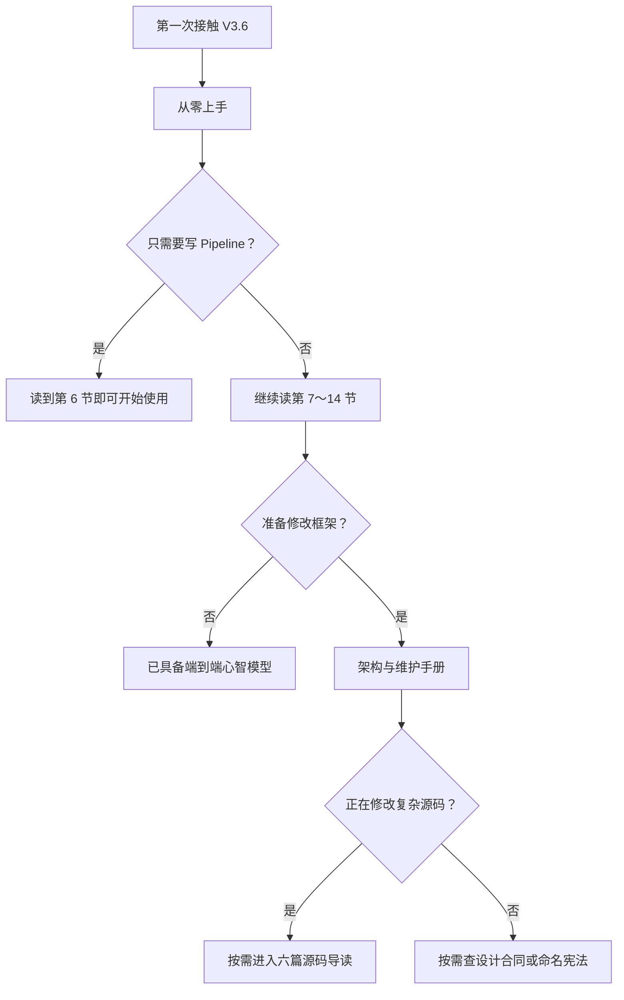

# MultiGrain V3.6 文档地图

> **文档生态位：全部 V3.6 文档的唯一入口。** 本文不再解释框架语义，而是告诉不同读者
> 应该从哪里开始、读到哪里可以停，以及规范、教程、源码导读、实验和待办各自承担什么。

V3.6 不再同时维护内容重叠的 startup 和 tutorial。第一次学习只有一条顺序路径：
[`从零上手`](multigrain_v3_6_getting_started.md)。跨组件合同、逐段源码、规范性约束和审计结果
分别进入独立文档，避免同一事实出现多份略有差异的解释。

---

## 1. 按读者选择最短路线



三条最短路线：

1. **Pipeline 使用者**：`从零上手` 第 1～6 节。
2. **想理解执行机制的人**：`从零上手` 第 1～14 节。
3. **框架维护者**：完整 `从零上手` → `架构与维护手册` → 按任务选择源码导读。

实验报告、架构审计和 TODO 都不是第一次学习的前置材料。

---

## 2. 核心学习文档

| 文档 | 深度 | 主要回答 | 何时可以停止 |
| --- | --- | --- | --- |
| [`从零上手`](multigrain_v3_6_getting_started.md) | 由浅入深 | 怎样写 Pipeline；七种身份、F.*、编译与一次执行是什么 | 普通用户读到第 6 节；理解 runtime 读到第 14 节 |
| [`架构与维护手册`](multigrain_v3_6_maintainer_guide.md) | 中等 | 状态归谁所有、组件传什么、功能应改哪条路径 | 能判断修改落点并列出验证门禁后即可 |
| [`复杂源码导读`](multigrain_v3_6_walkthrough/README.md) | 深入源码 | 长文件中的数据结构、队列、状态转移和控制流 | 只读当前任务涉及的篇目，不必一次读完 |

三层之间允许少量有意的桥接，但不重复承担完整解释：

- `从零上手` 用例子建立概念，只摘录最短职责 snippet；
- `架构与维护手册` 汇总跨组件 owner、DTO 和修改纪律；
- `复杂源码导读` 才按实际函数和数据结构展开实现。

旧的 `multigrain_v3_6_tutorial.md` 已由这三层取代。其入门内容进入 `从零上手`，维护合同和
Engine/Executor 等细节进入后两层，因此不再保留一个与三者同时重复的巨型教程。

---

## 3. 六篇源码导读与一篇架构对比

源码导读按静态数据变换到物理执行的顺序排列：

1. [`01：Authoring API`](multigrain_v3_6_walkthrough/01_authoring_api.md)：符号调用怎样形成
   `LogicalProgram`。
2. [`02：Compiler pipeline`](multigrain_v3_6_walkthrough/02_compiler_pipeline.md)：声明图怎样经过
   verify、analysis、canonicalize 和 lowering 形成 `RuntimePlan`。
3. [`03：Runtime Engine`](multigrain_v3_6_walkthrough/03_runtime_engine.md)：canonical tables、
   Fact FIFO、`advance()` 和结构 Effect 怎样形成局部不动点。
4. [`04：DispatchState`](multigrain_v3_6_walkthrough/04_dispatch_state.md)：Grain phase、generation
   和三个 runnable queue 怎样变化。
5. [`05：Worker ABI`](multigrain_v3_6_walkthrough/05_worker_abi.md)：`GrainPlan` 怎样还原为 UDF
   batch，输出怎样成为逐 Grain 报告。
6. [`06：Executor event loop`](multigrain_v3_6_walkthrough/06_executor_event_loop.md)：actor capacity、
   pending RPC、microbatch 生命周期与恢复怎样协作。

[`07：V3→V3.6 可读性审计`](multigrain_v3_6_walkthrough/07_v3_vs_v36_readability.md)不是第七个
运行组件，而是一篇横向架构对比。它用于回答“V3.6 是否真的比 V3 更易理解”，不承载待修
backlog；待确认问题统一记录在[架构审计待确认项](todos/22-v36-architecture-audit-findings.md)。

---

## 4. 规范性参考

这些文档不要求顺序阅读。遇到设计争议时按问题查阅：

| 文档 | 规范对象 | 适合回答的问题 |
| --- | --- | --- |
| [`封闭状态机与无飞线语义`](multigrain_v3_6_design.md) | 身份、F.*、状态转移与 failure algebra | 这个行为是否属于 V3.6 已承诺语义？ |
| [`命名与架构宪法`](multigrain_v3_6_naming.md) | 词汇、后缀、所有权和模块落点 | 新名称是否制造同义词或层级歧义？ |
| [`静态语义编译边界`](multigrain_v3_6.md) | fixed compiler pipeline 与优化边界 | 为什么需要编译器；什么能优化、什么不能？ |

若文档发生冲突，判断顺序是：

```text
当前源码与测试合同
→ design / naming 规范
→ maintainer guide
→ getting started / source walkthrough
```

实验报告只能证明被测版本，不覆盖之后尚未执行门禁的工作区改动。

---

## 5. 证据、开放设计与审计 backlog

| 文档 | 性质 | 当前用途 |
| --- | --- | --- |
| [`2026-08-08 发布回归`](experiments/multigrain_v3_6/2026-08-08_release_regression.md) | 历史实验快照 | 记录已提交 V3.6 核心版本的 MinerU 368 PDF、Docling 与视频 paired 结果 |
| [`RayModule symbolic typing`](todos/21-v36-raymodule-symbolic-typing.md) | 延后设计探索 | 记录 IDE 泛型穿透问题、候选方案和验收条件；尚无实现决定 |
| [`架构审计待确认项`](todos/22-v36-architecture-audit-findings.md) | 当前 review backlog | 只记录有源码证据的问题、bad case、建议和待用户确认的决策 |

这里刻意分开三种状态：

- **通过的实验**不自动变成永久正确性承诺；
- **开放设计**不应伪装成已经发现的实现 bug；
- **审计发现**在 QA 确认前不进入教程的规范叙述，也不直接修改源码。

---

## 6. 文档维护规则

1. 新概念先进入 design/naming 规范，再进入教程和源码导读。
2. 教程只解释已经成立的合同；未决定方案进入 `docs/todos/`。
3. 源码导读引用函数名为主，行号只作为当前快照导航。
4. workload 数字只写入实验报告，其他文档链接报告，不复制完整表格。
5. 一项审计问题只能在审计 backlog 中维护状态；架构对比只保留结论与链接。
6. 删除或替换文档时，先确认其独有内容已经迁移，再清理所有入口链接。

按这套分层，V3.6 的学习路径是线性的，但参考资料保持按需展开：初学者不会先掉进 Engine
细节，维护者也不需要从零基础示例中反查状态 owner。
