# MultiGrain v3.6: Getting Started

This guide is the reviewer-facing entry point for the MultiGrain v3.6
implementation. It explains the authoring API, the static compiler boundary,
the runtime state machine, and the Ray execution boundary. The implementation
is intentionally small: structural primitives describe relationships, while
only `RayModule` calls create executable work.

The complete Chinese version is retained as
[`multigrain_v3_6_getting_started.zh.md`](multigrain_v3_6_getting_started.zh.md).
The other design references follow the same convention; the unqualified
filename is the English canonical document and `.zh.md` is its Chinese
translation.

## At a glance

### Reviewer artifact

Supplemental material is publicly available at:

[`rayorch/experimental/multigrain_v3_6`](../rayorch/experimental/multigrain_v3_6)

Corresponding documentation is available in this document. The linked
directory contains the core RayOrch implementation evaluated in the paper. The
other v3--v3.5 directories are earlier experimental iterations and are not
used for the reported results. The repository's main branch currently supports
several pre-existing projects and has not yet been synchronized with the
implementation used in this submission. After code cleanup and full test
validation, we will publish a tagged final artifact and update the main branch
accordingly.

### 1. The smallest useful mental model

V3.6 is a declarative, fine-grained dataflow runtime on Ray actors.

```text
Pipeline.forward() --trace--> LogicalProgram --compile--> RuntimePlan
RuntimePlan + inputs --run--> MicrobatchEngine <--> Executor <--> Worker
                                                    |
                                                RunResult
```

`forward()` is traced; it never processes business values. The compiler makes
all logical relationships and physical worker layouts explicit before Ray is
started. At runtime, the engine owns semantic facts and the executor owns Ray
handles, RPCs, and capacity.

The public vocabulary is deliberately short:

| Name | Responsibility |
| --- | --- |
| `Pipeline` | Declares the dataflow graph. |
| `RayModule` | Declares one batchable UDF call. |
| `Port` | Immutable symbolic handle to a logical position. |
| `F.expand`, `F.reduce`, `F.broadcast`, `F.filter` | Declare membership and control relationships. |
| `CompiledProgram` | Frozen output of the static compiler. |
| `Executor` | Runs compiled calls on Ray actors and manages microbatches. |
| `RunResult` | Exposes values and read-only metrics. |
| `RecordFailure` | Fails only the current grain. |
| `GroupFailure` | Fails the current grain and suppresses uncommitted siblings with the same direct parent and call. |
| `RecoveryPolicy` | Decides what to do after an opaque whole-dispatch error. |

The implementation package exports these objects from
[`__init__.py`](../rayorch/experimental/multigrain_v3_6/__init__.py). Internal
references, effects, dispatch tables, and worker DTOs remain available to
maintainers but are not part of the normal authoring vocabulary.

### 2. A minimal pipeline

```python
import rayorch.experimental.multigrain_v3_6 as mg
from rayorch.experimental.multigrain_v3_6 import F


@mg.function
def add_one(value):
    return value + 1


class Example(mg.Pipeline):
    def forward(self, values):
        return add_one(values)


program = Example().compile()
```

`mg.function` adapts a stateless callable. A stateful UDF is expressed with a
`RayModule` and optional constructor arguments:

```python
class Add:
    def __init__(self, offset):
        self.offset = offset

    def __call__(self, value):
        return value + self.offset


add = mg.RayModule(Add).pre_init(offset=1).ray_options(
    replicas=2,
    batch_size=32,
    batching_policy="any_parent",
)
```

`pre_init` records constructor arguments; it does not instantiate the actor
during tracing. `ray_options` records physical options for this call. Calling a
module outside `Pipeline.forward()` is rejected because there is no active
symbolic trace.

`batching_policy` controls only how READY Grains are packed into one physical
`DispatchBatch`:

- `"any_parent"` (default) may fill a batch with READY Grains from different
  direct parents of the same Call. It is the normal throughput-oriented policy.
- `"single_parent"` restricts a batch to one direct `parent_anchor`. It can be
  useful for a locality or ablation experiment, but may produce smaller batches.

The policy does not change Domain/Entity lineage, `GroupFailure` scope, or
downstream semantics. The pre-release `batch_scope="elastic"|"parent_bound"`
spelling is rejected rather than retained as a compatibility alias.

Multiple outputs are explicit:

```python
split = mg.RayModule(Split, num_outputs=2)


class TwoOutputs(mg.Pipeline):
    def forward(self, values):
        left, right = split(values)
        return {"left": left, "right": right}
```

Each returned `Port` has an independent logical identity, while one UDF
invocation still has one atomic report boundary.

### 3. Structural primitives

Structural primitives are symbolic operations. They do not instantiate actors,
submit RPCs, or execute user code.

```python
class PagesToText(mg.Pipeline):
    def forward(self, documents):
        pages = F.expand(documents)
        text = ocr(pages)
        return F.reduce(text, documents)
```

The central distinction is between a logical **domain** and a data **item**:

- a domain identifies a level of entities, such as documents or pages;
- an entity is one occurrence in a domain;
- an item is a port/entity intersection;
- a grain is one call/entity execution unit;
- an expansion records an ordered parent-to-child membership relation.

`expand` creates child entities from a group-valued item. `reduce` collects
values and their membership back to an anchor. `broadcast` projects an
ancestor's item to descendant entities. `filter` carries a boolean control
item and can drop a source item without creating a worker call.

The compiler validates domain ancestry, aligned inputs, output arity, and
control relationships. Group-valued masks are rejected where a scalar control
decision is required; this prevents an ambiguous implicit reduction.

### 4. The fixed compiler boundary

Compilation is a fixed, Ray-free pipeline:

```text
trace
  -> LogicalProgram
  -> verify logical invariants
  -> analyze uses, outputs, expansions, and control demand
  -> optional transparent canonicalization
  -> lower to RuntimePlan
  -> verify the physical plan
```

The logical program contains only user declarations: calls, ports, domains,
and provenance. Analysis is derived and discardable. The runtime plan contains
the immutable facts needed by execution: effects, trigger indexes, input and
output layouts, actor-pool specifications, and output trees. It does not carry
the symbolic `PortOrigin` interpreter into the runtime.

`optimize=False` is the correctness baseline. It executes the same verifier,
analysis, and lowering steps and disables only transparent canonicalization.
The current canonicalization folds a transparent broadcast chain; it does not
fuse filters, remove calls, or infer arbitrary UDF properties.

The resulting `CompiledProgram` is immutable. A later mutation of
`RayModule.options` or `RayModule.init_kwargs` cannot change an already
compiled program. A subsequent `compile()` traces the current module state and
therefore observes the new configuration.

For a layer-by-layer explanation, see the English source walkthroughs:

1. [`Authoring API`](multigrain_v3_6_walkthrough/01_authoring_api.md)
2. [`Compiler pipeline`](multigrain_v3_6_walkthrough/02_compiler_pipeline.md)
3. [`Runtime engine`](multigrain_v3_6_walkthrough/03_runtime_engine.md)
4. [`Dispatch state`](multigrain_v3_6_walkthrough/04_dispatch_state.md)
5. [`Worker ABI`](multigrain_v3_6_walkthrough/05_worker_abi.md)
6. [`Executor event loop`](multigrain_v3_6_walkthrough/06_executor_event_loop.md)

### 5. Runtime ownership

The runtime is a single-writer semantic engine plus a Ray transport driver.

| Component | Owns | Does not own |
| --- | --- | --- |
| `MicrobatchEngine` | Item, expansion, entity, lineage, and outcome facts | Ray handles, queue policy, or business-value interpretation |
| `DispatchState` | Grain phase, generation, and ready/in-flight/sealed queues | Item publication or recovery policy |
| `Executor` | Actor lifecycle, RPC futures, capacity, and microbatch lifetime | Primitive semantics or lineage inference |
| `Worker` | Value-only UDF invocation and stable DTO validation | Program objects, runtime tables, or Ray scheduling decisions |
| `materialize` | Read-only conversion of committed facts to `RunResult` | Mutation of semantic state |

Facts enter the engine through a small closed set of publication methods and a
private fact FIFO. `advance()` drains that FIFO until the local semantic fixed
point is reached. Dispatch queues contain only physical grain work; they do
not become a second lineage database.

### 6. Outcomes and failure handling

Every item has exactly one terminal outcome:

```text
PRESENT     a value is available
DROPPED     a filter or required input intentionally removed it
FAILED      the grain producing it reported a business failure
SUPPRESSED  an upstream failure or suppression barrier makes it ineligible
```

The terminal state is idempotent and cannot be overwritten by a later report.
Multi-output calls are committed atomically per grain: either all aligned
outputs become visible, or none do.

#### Explicit data failures

UDFs can return a failure sentinel as a normal batch value:

```python
return mg.RecordFailure("malformed page")
```

This marks only the current grain as `FAILED`. To isolate a poisoned parent and
its uncommitted siblings at the same call, use the distinct type:

```python
return mg.GroupFailure("document is poisoned")
```

`GroupFailure` establishes a microbatch-local barrier keyed by the call and
the direct parent. It suppresses ready siblings and prevents their downstream
commit. It does not revoke RPCs already sent to another actor: those results
are checked again at commit time and become `SUPPRESSED` only if the barrier
is already visible. Other parents and other calls continue normally.

Neither sentinel requests a retry. An opaque exception is different: the
worker returns a serializable dispatch failure and `RecoveryPolicy` chooses
abort, immediate retry, tail retry, split, or singleton failure. Infrastructure
failures may replace an actor and replay a generation when budget remains.

### 7. Execution and backpressure

```python
executor = mg.Executor(program)
result = executor.run(inputs)
```

The executor admits bounded microbatches, reserves ready grains, submits one
physical batch per RPC, and commits generation-fenced reports. A stale or
duplicate report is ignored after the grain has been sealed. A failed dispatch
is cleaned up before the executor reuses an actor or terminates the run.

The main capacity controls are independent:

| Option | Scope | Meaning |
| --- | --- | --- |
| `microbatch_size` | admission | Source items in one microbatch |
| `max_inflight_arenas` | run | Simultaneously active microbatches |
| `batch_size` | semantic dispatch | Grains packed into one worker RPC |
| `replicas` | execution | Persistent actors for a call |
| `max_outstanding_per_actor` | transport | Submitted but unfinished RPCs per actor |
| `max_concurrency` | actor | Concurrent methods allowed by one actor |

The outstanding window includes both an executing RPC and calls waiting in the
Ray mailbox. Keeping it shallow avoids early binding and head-of-line blocking
for variable-duration PDF, OCR, and table workloads. Larger windows are
available for uniform, short calls but should be justified by measurement.

### 8. Running the tests

The v3.6 tests are grouped by the boundary they exercise:

```bash
# Static compiler, protocol, transitions, and recovery algebra
pytest test/experimental/multigrain_v3_6/unit

# Local Ray integration and lifecycle gates
pytest test/experimental/multigrain_v3_6/integration

# Workload adapters and paired correctness gates
pytest test/experimental/multigrain_v3_6/benchmark
```

The benchmark modules under
[`rayorch/experimental/multigrain_v3_6/benchmark`](../rayorch/experimental/multigrain_v3_6/benchmark)
reuse the business UDFs while changing only the authoring/compiler/runtime
implementation. This keeps framework comparisons separate from rendering,
OCR, and assembly kernels.

### 9. Where to look next

- [`Documentation map`](multigrain_v3_6_documentation_map.md) — shortest path by reader role.
- [`Static compiler boundary`](multigrain_v3_6_compiler_boundary.md) — compiler invariants and optimization limits.
- [`State machine and failure algebra`](multigrain_v3_6_design.md) — normative dynamic semantics.
- [`Maintainer guide`](multigrain_v3_6_maintainer_guide.md) — ownership and modification discipline.
- [`Naming constitution`](multigrain_v3_6_naming.md) — stable vocabulary and module placement.
- [`Release regression`](experiments/multigrain_v3_6/2026-08-08_release_regression.md) — submitted-version evidence.

The `.zh.md` files next to these documents are translations for Chinese
readers. They are intentionally not linked as the canonical reviewer path.

---

## MultiGrain v3.6 From Zero to Working: Usage, Concepts, and End-to-End Execution

> **Document niche: the only sequential learning path.** This document assumes
> that the reader knows nothing at all about v3.6. Starting from the very first
> Pipeline, it builds up step by step a mental model of the seven identities,
> `F.*`, the compilation stage, the dynamic state machines, and one complete
> execution. On your first pass, read the sections in order; you do not need to
> keep the maintainer guide or the per-file source walkthroughs open at the same
> time.

The role of every document and the shortest path per reader type is described in
[`v3.6 documentation map`](multigrain_v3_6_documentation_map.md).

This tutorial solves exactly one problem: the first time you open the v3.6
source, how do you understand it and run it with the fewest possible concepts,
and know which layer a change belongs to.

After reading it, you should be able to answer:

1. What `Pipeline`, `RayModule`, `Port`, and `F.*` each do;
2. How the static Program defines coordinates, and how the dynamic state
   machines use those coordinates;
3. How the seven core identities compose into Entity, Item, Grain, and
   Expansion;
4. During one execution, what the components pass to each other and who is
   allowed to modify state;
5. When something breaks, which file to read first instead of grepping the
   whole repository.

Suggested reading levels:

1. Ordinary users can start writing Pipelines that use `F.*` after section 6;
2. To understand how the framework executes, continue with sections 7--14;
3. Before modifying the source, move on to
   [`architecture and maintainer guide`](multigrain_v3_6_maintainer_guide.md);
4. When you need to read one complex file section by section, use
   [`complex source walkthrough`](multigrain_v3_6_walkthrough/README.md).

This document keeps the complete introductory explanations and examples, but it
does not explain the 989-line Engine function by function; the maintenance
contract and the source-level implementation details are carried by the latter
two document layers respectively. The snippets in this document only excerpt
responsibility boundaries; the adjacent file links are always the
implementation truth.

---

### 1. Build a minimal mental model first

v3.6 is a declarative, fine-grained dataflow executor built on Ray actors.

You first draw the graph with `Pipeline.forward()`; the compiler turns that
graph into static execution wiring; the `Executor` then lets Ray Workers run
the UDFs in batches. What `forward()` manipulates is always symbolic `Port`s,
never business data.

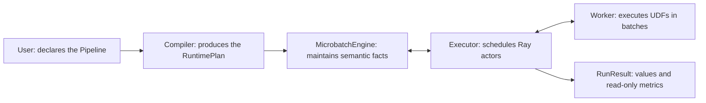

There are only two boundaries that really matter:

- `RayModule` performs computation; it creates Call, Grain, actor, and RPC;
- `F.expand/filter/reduce/broadcast` only describe structural relationships;
  they create no actor and execute no RPC.

The main path for ordinary users only requires knowing these names:

| Name | One-line responsibility |
| --- | --- |
| `Pipeline` | Declares the whole dataflow graph |
| `Port` | Points at one logical data position in the graph |
| `RayModule` | Declares one batchable computation Call |
| `F.*` | Explicitly declares granularity and membership |
| `Executor` | Connects to Ray and manages actors, RPCs, and microbatches |
| `RunResult` | Returns business outputs and frozen metrics |
| `ItemOutcome` / `RecordFailure` / `GroupFailure` | Expresses a precise bad item or a same-parent isolation result |
| `RecoveryPolicy` | Only configure it when you need exception retries or bisection isolation |

The source entry points are
[`api.py`](../rayorch/experimental/multigrain_v3_6/api.py) and
[`functional.py`](../rayorch/experimental/multigrain_v3_6/functional.py). The
public `Port` itself is very light:

```python
@dataclass(frozen=True, slots=True)
class Port:
    """Public symbolic handle to one logical Port."""

    ref: PortRef
    _owner: int
```

The real Call, Domain, and Origin are all established by `_ProgramBuilder`
inside `Pipeline.compile()`; a `Port` never secretly holds a value or runtime
state.

---

### 2. Run your first Pipeline in five minutes

A stateless function can be wrapped into a `RayModule` with `@function`. A UDF
receives a column of batch values and must return a column of results of the
same length.

```python
from rayorch.experimental.multigrain_v3_6 import Executor, Pipeline, function


@function
def double(values):
    return [value * 2 for value in values]


class DoublePipeline(Pipeline):
    def forward(self, values):
        return double(values)


with Executor(DoublePipeline()) as executor:
    result = executor.run([1, 2, 3])

assert result.outputs == [2, 4, 6]
```

This snippet actually declares one source Port, one Call, and one output Port:

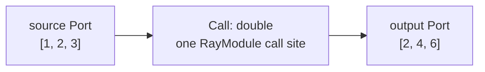

The `Executor` can call `ray.init()` on its own by default; using `with`
guarantees that the actors and the Ray runtime it started are also shut down on
the exception path.

The public input contract of `run()` is a finite, re-traversable `Sequence`.
Before execution, the Executor eagerly materializes each column into a tuple, so
that the inputs of this run are frozen and row alignment is validated in one
pass; v3.6 currently does not declare streaming input/output semantics.

---

### 3. An example that really shows what v3.6 is about

The following splits every text into words, uppercases each word, and then
merges them back per original text:

```python
from typing import cast

from rayorch.experimental.multigrain_v3_6 import (
    F,
    Executor,
    Pipeline,
    Port,
    RayModule,
)


class SplitWords:
    def run(self, texts):
        return [text.split() for text in texts]


class UpperWords:
    def run(self, words):
        return [word.upper() for word in words]


class JoinWords:
    def run(self, groups):
        return [" ".join(group) for group in groups]


class WordPipeline(Pipeline):
    def __init__(self):
        self.split = RayModule(SplitWords).ray_options(
            replicas=1, batch_size=8, num_cpus=1
        )
        self.upper = RayModule(UpperWords).ray_options(
            replicas=2, batch_size=16, num_cpus=1
        )
        self.join = RayModule(JoinWords).ray_options(
            replicas=1, batch_size=8, num_cpus=1
        )

    def forward(self, texts: Port) -> Port:
        word_groups = cast(Port, self.split(texts))
        words = F.expand(word_groups)
        upper_words = cast(Port, self.upper(words))
        grouped = F.reduce(upper_words)
        return cast(Port, self.join(grouped))


with Executor(WordPipeline()) as executor:
    result = executor.run(["hello ray", "small graph"])

assert result.outputs == ["HELLO RAY", "SMALL GRAPH"]
```

`cast(Port, ...)` only tells the type checker that this is a single-output
Call; it does not change runtime behavior.

Data granularity drops once and then comes back up:

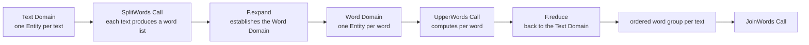

There are 3 computation Calls here, and also only 3 actor pools. Expand and
Reduce add neither actors nor RPCs.

---

### 4. First, meet the seven fundamental identities

v3.6 has only seven identity types: three belong to the static Program, and
four appear only while some microbatch is running. Learn the names and the
questions first, then the composition formulas.

#### 4.1 The seven names

| Type | Static/dynamic | The single question it answers |
| --- | --- | --- |
| `CallRef` | static | Which computation call site in the graph? |
| `PortRef` | static | Which logical data position in the graph? |
| `DomainRef` | static | At which granularity is this position aligned? |
| `EntityRef` | dynamic | Which occurrence in this Domain? |
| `ItemRef` | dynamic | What is the result of one Entity at one Port? |
| `GrainRef` | dynamic | What is the execution of one Entity at one Call? |
| `ExpansionRef` | dynamic | Into which child Domain does one parent expand? |

`Port` is the user-visible symbolic handle; `PortRef` is the static identity it
carries internally. The remaining Refs belong to the maintainer model and do
not need to appear in ordinary Pipeline code.

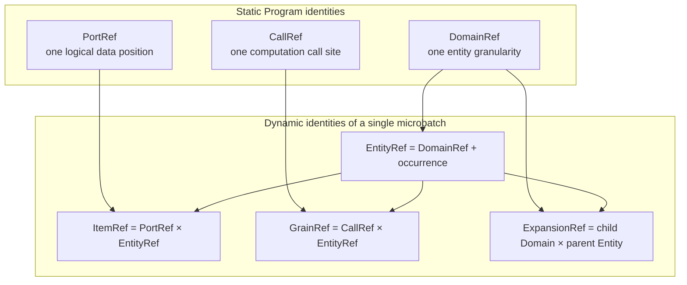

The corresponding implementations live in
[`model.py`](../rayorch/experimental/multigrain_v3_6/model.py) and
[`runtime/state.py`](../rayorch/experimental/multigrain_v3_6/runtime/state.py).
The field excerpts directly express the three composition formulas:

```python
@dataclass(frozen=True, slots=True, order=True)
class EntityRef:
    domain: DomainRef
    value: int


@dataclass(frozen=True, slots=True, order=True)
class ItemRef:
    port: PortRef
    entity: EntityRef


@dataclass(frozen=True, slots=True, order=True)
class GrainRef:
    call: CallRef
    entity: EntityRef


@dataclass(frozen=True, slots=True)
class ExpansionRef:
    child_domain: DomainRef
    parent_entity: EntityRef
```

#### 4.2 Understanding the seven Refs one by one with a PDF pipeline

First look at a minimal pipeline: every PDF is rendered into several pages,
each page is OCR-ed, and finally the text is collected back per PDF.

```python
class PdfPipeline(mg.Pipeline):
    def __init__(self) -> None:
        self.render = mg.RayModule(RenderPages)
        self.ocr = mg.RayModule(OcrPage)

    def forward(self, pdfs):
        page_groups = self.render(pdfs)
        pages = mg.F.expand(page_groups)
        page_texts = self.ocr(pages)
        return mg.F.reduce(page_texts)
```

Assume the compiler assigns the following numbers to it. The numbers are only
for illustration; the real numbers are decided by Program construction order:

```text
DomainRef(0) = PDF granularity
DomainRef(1) = Page granularity

CallRef(0) = the self.render(...) call site
CallRef(1) = the self.ocr(...)    call site

PortRef(0) = pdfs
PortRef(1) = page_groups
PortRef(2) = pages
PortRef(3) = page_texts
PortRef(4) = the PDF-level texts after reduce
```

Now let us look at each Ref in turn.

##### 4.2.1 `PortRef`: a fixed data position on the graph

`PortRef(3)` always denotes the logical output position of `self.ocr(pages)`.
It is a bit like a column of a table: it only says "this is the page_texts
column"; it does not stand for the concrete text of some page, and it does not
hold a business value.

Whether the same Program processes 1 PDF or 1000 PDFs, `PortRef(3)` is the same
static position.

##### 4.2.2 `DomainRef`: which identity space an Entity uses

`DomainRef(0)` is the PDF granularity and `DomainRef(1)` is the Page
granularity. Only Entities located in the same Domain can be aligned directly
by identity:

```text
A PDF Entity can only align directly with other PDF-level Ports
A Page Entity can only align directly with other Page-level Ports
```

Even if the internal occurrence integers of a PDF and a Page happen to be
equal, they are not the same Entity, because `DomainRef` is part of an Entity's
identity.

##### 4.2.3 `CallRef`: one computation call site in the static graph

`CallRef(1)` denotes the call site `self.ocr(pages)`; it does not mean that OCR
has already been executed once for some page. If the same `RayModule` object is
called twice in `forward()`, two different `CallRef`s are produced, because
they are two different call positions in the graph; every Call has its own
static input, output, and actor-pool contract.

##### 4.2.4 `EntityRef`: the concrete business occurrence in this round

Assume the current microbatch inputs `A.pdf`, and it expands into two pages:

```text
eA  = EntityRef(DomainRef(0), A)       # the A.pdf PDF occurrence
eA0 = EntityRef(DomainRef(1), A/page0) # page 0 of A.pdf
eA1 = EntityRef(DomainRef(1), A/page1) # page 1 of A.pdf
```

`A` and `A/page0` are written here symbolically for readability; the source
actually stores lightweight integers and records the parent and ordinal of each
page Entity in the lineage table. An Entity only answers "who is it"; it does
not answer whether it succeeded at some processing stage, was filtered out, or
holds what value.

##### 4.2.5 `ItemRef`: the intersection of one row and one column

Think of `EntityRef` as a row and `PortRef` as a column; an `ItemRef` is then a
cell:

```text
ItemRef(PortRef(2), eA0) = the fact of A.pdf page 0 at the pages Port
ItemRef(PortRef(3), eA0) = the fact of A.pdf page 0 at the page_texts Port
ItemRef(PortRef(3), eA1) = the fact of A.pdf page 1 at the page_texts Port
```

Every Item eventually owns exactly one terminal state out of
`PRESENT / DROPPED / FAILED / SUPPRESSED`; only a `PRESENT` Item is associated
with a `ValueBinding`. Therefore an Item expresses "what happened to one entity
at one data position", not whether a computation is schedulable.

##### 4.2.6 `GrainRef`: one logical unit of work of one Call on one Entity

The OCR Call runs on the Page Domain, so the two pages of A.pdf produce two
Grains:

```text
GrainRef(CallRef(1), eA0) = execute OCR once on A.pdf page 0
GrainRef(CallRef(1), eA1) = execute OCR once on A.pdf page 1
```

A Grain consumes input Items and, after successful execution, produces output
Items:

```text
ItemRef(pages, eA0)
        ↓ inputs ready
GrainRef(ocr_call, eA0)
        ↓ executes and commits a report
ItemRef(page_texts, eA0)
```

This is the most direct difference between Item and Grain:

| | `ItemRef` | `GrainRef` |
| --- | --- | --- |
| Intuition | one data cell / fact slot | one schedulable unit of logical work |
| Identity | `Port × Entity` | `Call × Entity` |
| State | `PRESENT/DROPPED/FAILED/SUPPRESSED` | `READY/IN_FLIGHT/SEALED` |
| Holds a business value | associated with a ValueBinding when PRESENT | does not store output values |
| Necessarily goes through a Worker | no; Source, Filter, and Reduce also produce Items | is the execution unit of a RayModule Call |
| batching | does not participate in physical batch identity | several Grains can be merged into one Worker RPC |

One Grain can read several input Items and can also atomically produce several
output Items. Filter or Reduce can also publish new Items, yet they do not
create a Grain, because they are structural state transitions inside the Engine,
not RayModule computations.

##### 4.2.7 `ExpansionRef`: one expansion fact of one parent

`ExpansionRef(DomainRef(1), eA)` denotes "the expansion result of this one PDF
A.pdf into the Page Domain". On success it records the ordered children
`(eA0, eA1)`; if the page list is empty, it records the legal `SUCCEEDED(())`.
Reduce uses exactly this structural fact to know which Page Entities should be
collected back into `eA`.

The complete identity chain looks like this:

```mermaid
flowchart LR
    SourceItem["Item(pdfs, eA)<br/>A.pdf has appeared"]
    RenderGrain["Grain(render, eA)<br/>render A.pdf"]
    GroupItem["Item(page_groups, eA)<br/>the page group has been produced"]
    Expansion["Expansion(PageDomain, eA)<br/>children = eA0, eA1"]
    PageItem["Item(pages, eA0)<br/>page 0 has appeared"]
    OcrGrain["Grain(ocr, eA0)<br/>OCR page 0"]
    TextItem["Item(page_texts, eA0)<br/>page 0 text has appeared"]
    Reduced["Item(pdf_texts, eA)<br/>the PDF-level nested result"]

    SourceItem --> RenderGrain --> GroupItem --> Expansion --> PageItem
    PageItem --> OcrGrain --> TextItem --> Reduced
```

The shortest way to remember it is:

```text
Port      = a column
Domain    = which identity space the rows use
Entity    = a row
Item      = a cell
Call      = the computation definition on the graph
Grain     = one unit of work of that computation on one row
Expansion = which child rows one row expands into
```

#### 4.3 First understand the composition algebra through the coordinate rules

"Composition algebra" sounds like mathematical derivation, but the first thing
it solves is a very plain question: **can one column be placed on one row, and
can one computation be executed on that row?**

Continuing with the PDF example above. The compiled Program can answer three
static lookup tables:

| Lookup | Concrete example | Plain meaning |
| --- | --- | --- |
| `port_domain(port)` | `port_domain(pages) = Page` | the pages column can only hold Page rows |
| `call_domain(call)` | `call_domain(ocr) = Page` | OCR can only create Grains for Page rows |
| `parent_domain(domain)` | `parent_domain(Page) = PDF` | the direct parent of a Page Entity is a PDF Entity |

So to decide whether a composition is legal, you only need to ask in order:

1. When creating an Item, do the Port and the Entity belong to the same Domain?
2. When creating a Grain, do the Call and the Entity belong to the same Domain?
3. When creating an Expansion, is the parent of the child Domain exactly the
   Domain of the parent Entity?

For example:

| Composition | Legal? | Reason |
| --- | --- | --- |
| `Item(pages, eA0_page)` | yes | the pages Port and `eA0` both belong to the Page Domain |
| `Item(pages, eA_pdf)` | no | pages is a Page column, but `eA` is a PDF row |
| `Grain(ocr, eA0_page)` | yes | OCR executes in the Page Domain |
| `Grain(ocr, eA_pdf)` | no | you cannot run a page-level OCR Call on a whole PDF directly |
| `Expansion(Page, eA_pdf)` | yes | the parent Domain of Page is PDF |
| `Expansion(Page, eA0_page)` | no | this would wrongly treat Page as the parent of Page |

The three mappings below simply write those three lookup tables in compact
notation:

```text
port_domain   : PortRef -> DomainRef
call_domain   : CallRef -> DomainRef
parent_domain : DomainRef -> DomainRef | None
```

`port_domain` is defined by
[`PortSpec.domain`](../rayorch/experimental/multigrain_v3_6/program/logical.py),
`call_domain` by `CallSpec.execution_domain`, and `parent_domain` by
`DomainSpec.parent`.
[`verify.py`](../rayorch/experimental/multigrain_v3_6/program/verify.py) first
verifies that the Domain has exactly one root and that parents are acyclic, then
verifies the local contracts of Calls and Ports.

Now the identity formulas are fairly intuitive. To the left of the comma is
"column / computation / child Domain"; to the right is "which row"; what follows
`where` is just the three legality checks above:

```text
EntityRef    = (domain, occurrence)

ItemRef      = (port, entity)
               where port_domain(port) == entity.domain

GrainRef     = (call, entity)
               where call_domain(call) == entity.domain

ExpansionRef = (child_domain, parent_entity)
               where parent_domain(child_domain) == parent_entity.domain
```

If you only want to use or read the framework, this is enough. The set formulas
below are a compressed notation for maintainers who need to prove completeness
or check the Compiler; they introduce no new semantics:

```text
E ⊆ D × Occurrence
I = {(p, e) ∈ P × E | port_domain(p) = domain(e)}
G = {(c, e) ∈ C × E | call_domain(c) = domain(e)}
X = {(d, e) ∈ D × E | parent_domain(d) = domain(e)}
```

What the formulas above describe is "a legal Program and RuntimeState". The Refs
themselves are still lightweight frozen keys: `ItemRef(...)` does not embed its
own Port→Domain table; the constraints are maintained only by the Compiler
pre-checks and by the MicrobatchEngine state transitions, avoiding a second
place where facts live.

So whether `ItemRef(PortRef(7), EntityRef(DomainRef(2), 9))` is legal is not
decided by the integers `7` or `9`, but by whether Port 7 belongs to Domain 2.
The integers are only lightweight numbers; the Domain is the type of the
coordinate. That way, two unrelated granularities that happen to share a number
will not be mis-aligned.

#### 4.4 How computation and structural primitives change these compositions

Ignore the formulas for a moment and walk the PDF→Page→OCR pipeline once:

1. **Source admission**: the input `[A.pdf, B.pdf]` creates two PDF Entities
   `eA/eB`, and creates two source Items on the pdfs Port.
2. **Call**: `render` creates one Grain for `eA`. It reads `Item(pdfs, eA)` and,
   on success, produces `Item(page_groups, eA)`; the whole process still belongs
   to the same PDF Entity.
3. **Expand**: the page group of A.pdf contains two pages, so an
   `Expansion(Page, eA)` is recorded, child Entities `eA0/eA1` are created, and
   then `Item(pages, eA0/eA1)` is produced. Only this step creates new Entities.
4. **Call**: `ocr` creates two Grains for `eA0/eA1` respectively and outputs
   page_text Items; the Page Entities do not change.
5. **Filter**: if `eA1` does not pass the quality mask, only
   `Item(selected_text, eA1)` is marked `DROPPED`; `eA1` itself and its Items on
   other Ports still exist.
6. **Broadcast**: if OCR needs PDF-level language information, it follows the
   `eA → eA0/eA1` lineage and creates language Items on the two Page Entities;
   it does not create new Page Entities.
7. **Reduce**: finally it reads `Expansion(Page, eA)` to confirm which ordered
   pages A.pdf has, and collects the surviving page texts back into
   `Item(pdf_texts, eA)`.

From this you can first remember two kinds of operations:

```text
Same granularity: Source establishes root Entities; Call / Filter reuse the
                  current Entity
                  They only produce Items on Ports of the current Domain

Cross granularity: Expand / Reduce / Broadcast
                   Must move along the explicit parent/child lineage
```

The table below only compresses the story above into a notation that is
convenient for maintainers to check. `e` denotes the same Entity, `eₚ` denotes
the parent, `eᶜᵢ` denotes the i-th child, and `dᴄ` denotes the child Domain:

| Operation | PDF example | Compressed notation of the identity transform | What must be preserved |
| --- | --- | --- | --- |
| Source admission | the i-th input PDF | `eᵢ = Entity(root, i); Item(source, eᵢ)` | multiple source Ports have equal length and align on the same `eᵢ` |
| Call | OCR `eA0` | `Item(p₀, e) × … → Grain(c, e) → Item(pₒ, e) × …` | input, Grain, and output share the same `e` |
| Filter | filter out the low-quality `eA1` text | `Item(source, e) × Item(mask, e) → Item(target, e)` | only changes the target Item terminal state; does not delete the Entity |
| Expand | A.pdf expands into `eA0/eA1` | `Item(group, eₚ) → Expansion(dᴄ, eₚ) + {Entity(eᶜᵢ), Item(target, eᶜᵢ)}` | the child belongs to `dᴄ`, and parent + ordinal are recorded |
| Reduce | pages collected back into A.pdf | `Item(value, eᶜ₀…eᶜₙ) × Expansion(dᴄ, eₚ) → Item(target, eₚ)` | returns to the parent following the stable ordinal of the Expansion |
| Broadcast | PDF language projected onto pages | `Item(source, eₐ) × lineage(eₐ, eᴅ) → Item(target, eᴅ)` | the source Entity must be an ancestor of the target Entity |

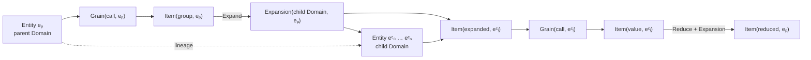

Filter is a point-to-point transform on the same `e`; all inputs of a Call are
already aligned on the same `e`, so no implicit zip is needed, and no single
argument decides the Entity identity on its own. Only three kinds of relations
are genuinely cross-granularity:

- Expand creates `parent -> children`;
- Reduce follows that relation from children back to parent;
- Broadcast follows the existing lineage to project from ancestor to descendant.

Any other cross-Domain composition is a compile error; the compiler does not
guess alignment from Port position, argument names, or list length.

#### 4.5 The single authoritative home of each identity

Each of the seven identities also has exactly one authoritative home:

| Identity | Authoritative location of the static definition or dynamic fact |
| --- | --- |
| `CallRef` | `LogicalProgram.calls`; the RuntimePlan keeps only the contracts execution needs |
| `PortRef` | `LogicalProgram.ports`; the RuntimePlan Effect index wires with it |
| `DomainRef` | `LogicalProgram.domains` defines the parent relation |
| `EntityRef` | the Entity/lineage tables of the MicrobatchEngine |
| `ItemRef` | `RuntimeState.items` and `RuntimeState.values` |
| `GrainRef` | pending inputs in RuntimeState; phase/queue in DispatchState |
| `ExpansionRef` | `RuntimeState.expansions` |

The four dynamic identities can be compressed further into four sentences: an
Entity is a logical object, an Item is the result at a position, a Grain is one
computation, and an Expansion is a parent/child set relation. Fine-grained
lineage is recorded linearly with the real number of Items/Grains; it does not
copy a full path for every result.

#### 4.6 How multiple inputs and multiple outputs affect the seven identities

Multiple inputs and outputs do not create new identity kinds, and they do not
turn one Port into a composite container. They only place several independent
Ports on both sides of the same Call:

```python
class Compare:
    def run(self, left, right, *, weights):
        return (
            [lhs + rhs for lhs, rhs in zip(left, right)],
            [lhs * rhs * weight for lhs, rhs, weight in zip(left, right, weights)],
        )

self.compare = mg.RayModule(Compare, num_outputs=2)

def forward(self, left, right, weights):
    sums, scores = self.compare(left, right, weights=weights)
    return sums, scores
```

Assume this call is compiled as:

```text
Domain d_page
Call   c_compare

input Ports  = (p_left, p_right, p_weights)
output Ports = (p_sums, p_scores)
```

For one page `eA0`, the dynamic identities expand as:

```text
Item(p_left,    eA0) ─┐
Item(p_right,   eA0) ─┼─> Grain(c_compare, eA0) ─┬─> Item(p_sums,   eA0)
Item(p_weights, eA0) ─┘                           └─> Item(p_scores, eA0)
```

The most important formula is:

```text
N input Items × the same Entity
        → 1 Grain(Call, Entity)
        → M output Items × the same Entity
```

It is not "N inputs create N Grains", nor "M outputs create M Calls". The seven
identities are affected as follows:

| Identity | What happens under `N inputs → M outputs` |
| --- | --- |
| `PortRef` | there are N independent input Ports and M independent output Ports; every output has its own `output_index` |
| `DomainRef` | all inputs of a Call must already be in the same Domain; Call outputs remain in that execution Domain |
| `CallRef` | the whole call site has only one CallRef; only calling the same RayModule elsewhere creates another CallRef |
| `EntityRef` | each occurrence keeps only one EntityRef; it is the common alignment key of all inputs, the Grain, and the outputs |
| `ItemRef` | for that Entity, the N input positions and M output positions form independent ItemRefs with independent terminal states |
| `GrainRef` | each `CallRef × EntityRef` has only one Grain; it consumes all input slots and commits all outputs at once |
| `ExpansionRef` | an ordinary multi-output does not create an Expansion; one appears only when some output is later `F.expand*`ed |

All inputs are symmetric with respect to Entity identity: argument order only
decides the Worker ABI slot; it does not grant the first argument any special
identity ownership. Input terminal states are unified by one commutative
reduction:

```text
any FAILED/SUPPRESSED       → all outputs SUPPRESSED
else still pending inputs   → WAIT
else REQUIRED DROPPED       → all outputs DROPPED
else                        → the single Grain becomes READY
```

Even after the Worker returns successfully, outputs are not published
scattershot one by one. It first validates the outer output count, the Grain row
count of each column, and `RecordFailure` / `GroupFailure`; the Engine then
pre-checks the complete batch reports; the M outputs of the same Grain either all
take effect together, or none of them do. Therefore every output Item has an
independent identity, but they share the same single Grain commit boundary.

If two outputs are themselves group-valued, continuing with Expand gives two
different identity semantics:

```text
independent:
    F.expand(left_groups)  → child Domain d1 → Expansion(d1, eA0)
    F.expand(right_groups) → child Domain d2 → Expansion(d2, eA0)

aligned:
    F.expand_aligned(left_groups, right_groups)
        → one shared child Domain d1
        → one Expansion(d1, eA0)
        → two different Item Ports on the same batch of child Entities
```

The former denotes two unrelated sets of children, which may have different
cardinality; the latter denotes two columns describing the same batch of
children, so the cardinality must agree. Symmetrically, `reduce_aligned()` lets
several value Ports return to the parent Entity using the same membership set,
but it only generates several Reduce Items and does not additionally create a
CallRef or a GrainRef.

---

### 5. When writing a Pipeline, how do you tell whether two Ports can be combined directly

Section 4 explained the identity formulas; this section answers only the most
common practical question when writing `forward()`:

> I have two Ports in hand. Can I pass them both directly into the same
> RayModule, or do I need to Expand, Reduce, or Broadcast first?

Still using PDF→Page→OCR as the example:

```python
def forward(self, pdfs):
    metadata = self.metadata(pdfs)
    page_groups = self.render(pdfs)

    pages = F.expand(page_groups)
    page_metadata = F.broadcast(metadata, like=pages)
    page_texts = self.ocr(pages, page_metadata)

    text_groups = F.reduce(page_texts)
    return self.assemble(metadata, text_groups)
```

Look line by line at "who exactly one row represents" on each Port:

| Port | Roughly what one business value is | Domain: who one row represents |
| --- | --- | --- |
| `pdfs` | one PDF | a PDF Entity |
| `metadata` | the metadata of one PDF | a PDF Entity |
| `page_groups` | the `list[Page]` of one PDF | still a PDF Entity |
| `pages` | one Page | a Page Entity |
| `page_metadata` | PDF metadata projected onto one page | a Page Entity |
| `page_texts` | the OCR text of one page | a Page Entity |
| `text_groups` | the ordered `list[Text]` of one PDF | back to a PDF Entity |

The easiest one to misunderstand here is `page_groups`: although its Python
value is `list[Page]`, "one row" still corresponds to one PDF, so it is still in
the PDF Domain. Only `F.expand(page_groups)` actually creates Page Entities, and
only then does the output `pages` enter the Page Domain. Conversely,
`F.reduce(page_texts)` collects the values of Page Entities back by parent, and
only then does the output return to the PDF Domain.

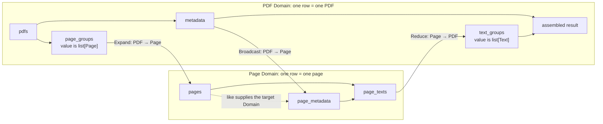

In practice you only need to follow this order:

1. **The two Ports belong to the same Domain**: they can be fed directly into a
   RayModule on the same Entity; for example `ocr(pages, page_metadata)`. Their
   business value types may differ.
2. **An ancestor Port must be used by descendant Entities**: first apply
   `F.broadcast(ancestor, like=descendant)`; for example projecting PDF metadata
   onto every page.
3. **A child Port must return to the parent**: first apply `F.reduce(child)`; for
   example collecting page texts into an ordered group per PDF.
4. **A group value on the parent must become independent children**: use
   `F.expand(group)`; for example turning `list[Page]` into Page Entities.
5. **The two Domains have no declarable ancestor/descendant relation**: an
   implicit join is not possible today. The compiler reports an error instead of
   guessing alignment from argument position, list length, or Python types.

Therefore, a Domain is not a Python data type:

- `metadata: dict` and `pdfs: str` can belong to the same PDF Domain and align
  on the same PDF Entity;
- `document_title: str` and `page_text: str`, even though both are strings,
  belong to the PDF/Page Domains respectively and cannot be used directly as
  inputs of the same Call.

Users do not need to write `DomainRef` by hand. The Builder records the Domain
at Source, Expand, Reduce, and Broadcast time; users only need to express "who
one row represents now" through these explicit relations. The next section
expands the behavior of the four structural primitives one by one.

---

### 6. The four structural primitives

#### 6.1 Expand: a group value on the parent becomes child Entities

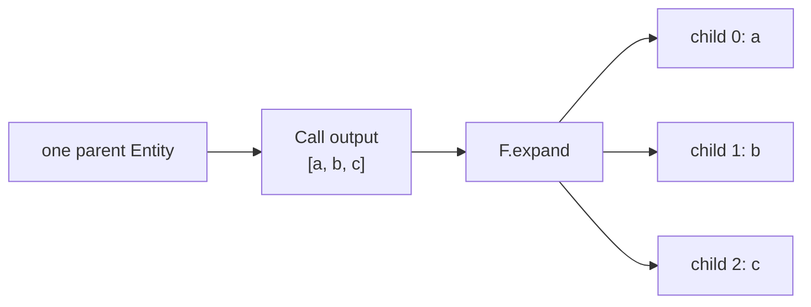

Expand creates a child Domain and preserves the parent and the ordinal. An empty
list is also a successful Expansion; it simply has 0 children.

#### 6.2 Reduce: restore child values into an ordered group by parent

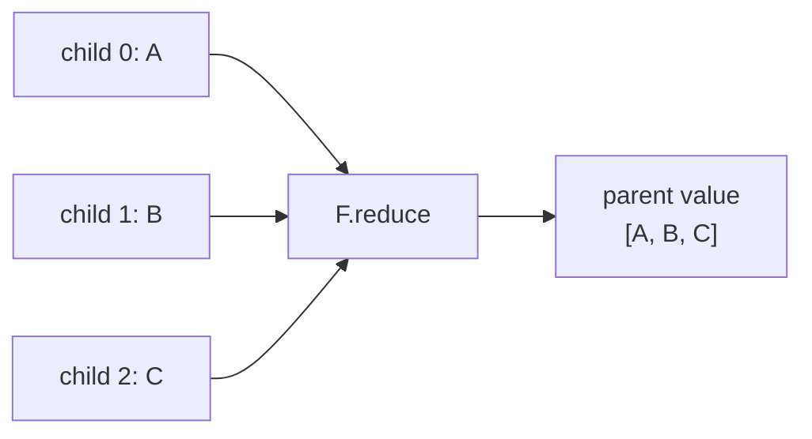

Reduce does not execute an aggregation function; it only restores structure.
The real sum, join, and assemble should still be done by a downstream
RayModule.

#### 6.3 Broadcast: project an ancestor value onto descendant granularity

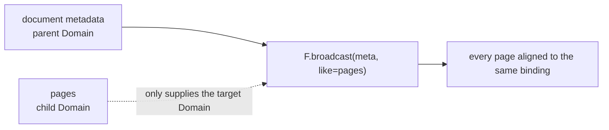

Broadcast does not copy the business payload; it only lets descendant Entities
reference the same value binding of the ancestor.

#### 6.4 Filter: change the membership terminal state, not the Domain

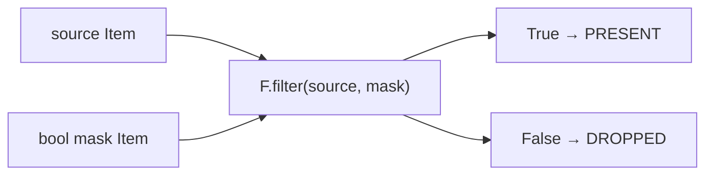

Filter does not delete an Entity and does not renumber. It publishes a new Item
in the same Domain: when the mask is false, the terminal state of that Item is
`DROPPED`.

`expand_aligned` and `reduce_aligned` are used when several Ports explicitly
share the same membership relation. They are not an implicit zip; the compiler
validates the producing Call, the Domain, and the cardinality contract.

`F.optional(port)` only changes the policy of one Call input when an upstream
value is `DROPPED`: the Worker receives `MISSING`. It creates no Port, Domain,
Entity, or actor, so it is not a fifth structural primitive.

---

### 7. How the static definition connects to the dynamic state

The static graph does not "hang" a mutable state machine off itself. It only
provides stable coordinates and immutable relations; every microbatch creates
independent state tables and stores facts keyed by Refs.

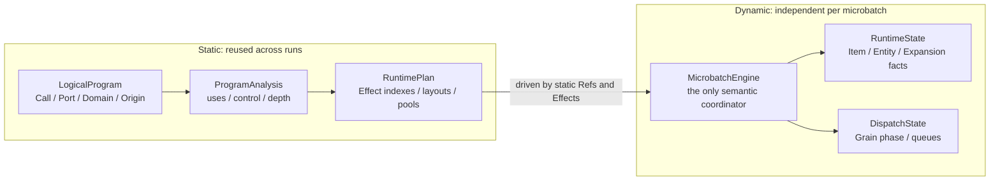

The static structures are in
[`logical.py`](../rayorch/experimental/multigrain_v3_6/program/logical.py) and
[`plan.py`](../rayorch/experimental/multigrain_v3_6/program/plan.py); the
dynamic tables are in
[`runtime/state.py`](../rayorch/experimental/multigrain_v3_6/runtime/state.py).
The source does not stuff these tables into the LogicalProgram:

```python
@dataclass(slots=True)
class RuntimeState:
    items: dict[ItemRef, ItemRecord] = field(default_factory=dict)
    expansions: dict[ExpansionRef, ExpansionRecord] = field(default_factory=dict)
    entity_lineage: dict[EntityRef, EntityParent] = field(default_factory=dict)
    values: dict[ItemRef, ValueBinding] = field(default_factory=dict)
    pending_grains: dict[GrainRef, PendingGrain] = field(default_factory=dict)
```

[`runtime/engine.py`](../rayorch/experimental/multigrain_v3_6/runtime/engine.py)
instantiates one set of semantic and dispatch tables for exactly one microbatch
at a time:

```python
self.plan = plan
self._state = RuntimeState()
self._dispatch = DispatchState()
self._fact_queue: deque[_FactEvent] = deque()
```

The four core objects each answer one question:

| Object | Answers only |
| --- | --- |
| `LogicalProgram` | What did the user declare? |
| `ProgramAnalysis` | What can be derived from the declaration? |
| `RuntimePlan` | After a certain kind of fact appears, which Effects must fire? |
| `RuntimeState` / `DispatchState` | What actually happened during this run? |

Therefore:

- the same `CompiledProgram` can serve multiple runs and multiple microbatches;
- `EntityRef(…, 0)` of different microbatches does not share state tables;
- the runtime does not need to read `PortOrigin` back;
- turning the optimizer off still goes through the same verify, analysis, and
  lowering.

---

### 8. What actually happens at compile time

When `Pipeline.compile()` is called, `forward()` is symbolically traced exactly
once. Neither UDF construction nor business computation happens.

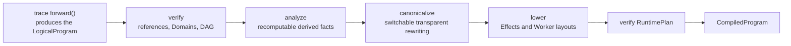

In
[`compiler.py`](../rayorch/experimental/multigrain_v3_6/program/compiler.py) this
pipeline is just one fixed entry point; there is no hidden pass registry:

```python
verify_logical(logical)
analysis = analyze(logical)
canonical = _canonicalize(logical, analysis, enabled=optimize)
plan, explanation = _lower(logical, analysis, canonical, call_options)
verify_runtime_plan(logical, analysis, plan)
return CompiledProgram(logical, analysis, plan, explanation)
```

The entry point only orchestrates; the concrete contracts live in
[`verify.py`](../rayorch/experimental/multigrain_v3_6/program/verify.py) and
[`lowering.py`](../rayorch/experimental/multigrain_v3_6/program/lowering.py).
The leading underscores state explicitly that canonicalization and lowering are
in-package stages of the fixed pipeline, not a user-composable Pass API.

The unified Origin resolution entry point is
[`semantics.describe_origin()`](../rayorch/experimental/multigrain_v3_6/program/semantics.py).
A new primitive that is not handled in its closed `match` falls into
`assert_never`, instead of being silently missed by some compiler stage.

v3.6 does not provide a general-purpose PassManager. The current
canonicalization only folds a transparent Broadcast chain, and
`optimize=False` is a clear correctness baseline.

After compilation you can read the explain output first, without starting Ray:

```python
compiled = WordPipeline().compile()
print(compiled.explain_text())
```

The output shows the logical primitive, the Domain, and the physical rule per
Port. When debugging "why does this Port have no control/Effect?", read explain
first, then read the runtime.

---

### 9. The three dynamic state machines

#### 9.1 Item: only moves from unresolved to one terminal state

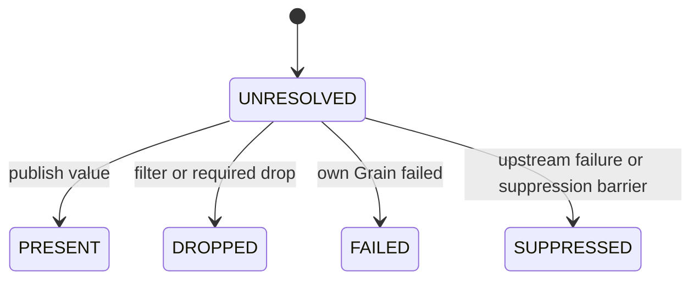

- `PRESENT`: a value binding exists;
- `DROPPED`: membership was filtered out normally;
- `FAILED`: the Grain that produced this Item failed itself;
- `SUPPRESSED`: an upstream failure, or a suppression barrier at the same Call with
  the same direct parent, makes the current computation ineligible to run or
  commit.

Terminal states cannot overwrite each other; replaying the same terminal state
only allows idempotent validation.

#### 9.2 Expansion: publishes cardinality once

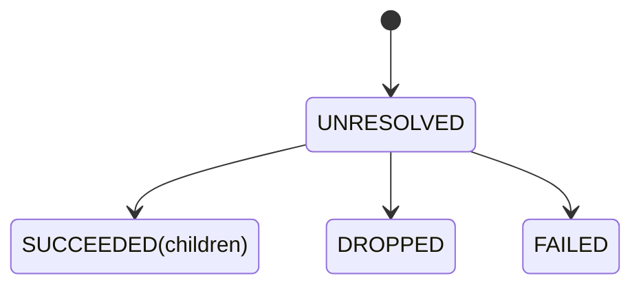

Only `SUCCEEDED` carries ordered children. The runtime never creates half a
group of children first and then fills in the Expansion terminal state later.

#### 9.3 Grain: the only physical scheduling lifecycle

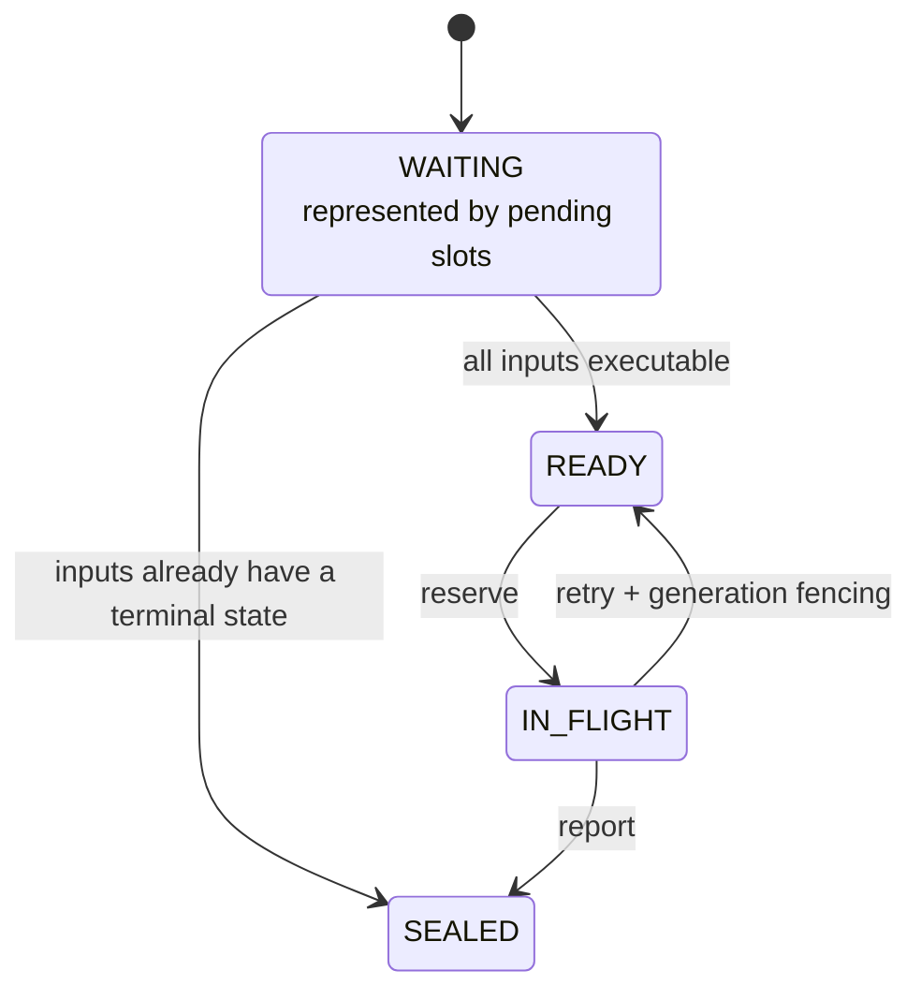

These arrows are not a convention invented for the documentation; they are an
exhaustively testable table in
[`transitions.py`](../rayorch/experimental/multigrain_v3_6/runtime/transitions.py):

```python
_GRAIN_TRANSITIONS = {
    (None, GrainEvent.INPUTS_READY): GrainPhase.READY,
    (None, GrainEvent.INPUTS_TERMINAL): GrainPhase.SEALED,
    (GrainPhase.READY, GrainEvent.RESERVE): GrainPhase.IN_FLIGHT,
    (GrainPhase.IN_FLIGHT, GrainEvent.RETRY): GrainPhase.READY,
    (GrainPhase.IN_FLIGHT, GrainEvent.REPORT): GrainPhase.SEALED,
}
```

This is not a set of samples used only by tests; it is the **complete transition
function** that the runtime actually calls. Every line is read in the following
uniform format:

```text
(phase before the transition, event received): phase after the transition
```

For example:

```python
(GrainPhase.READY, GrainEvent.RESERVE): GrainPhase.IN_FLIGHT
```

Read literally: a Grain is currently `READY`, and the scheduler emits a
`RESERVE` event for it, so it must next become `IN_FLIGHT`. So the two quantities
inside the parentheses are not "input Port and output Port":

- the left side inside the parentheses, `phase`, is the state that already
  existed before the event;
- the right side inside the parentheses, `event`, is the fact that triggered
  this state change;
- the right side of the colon is the only new state allowed.

`phase` answers "which step are we at now", and `event` answers "what just
happened". Once the two are separated, the same state can produce different
results depending on the event: `IN_FLIGHT + RETRY` returns to `READY`, while
`IN_FLIGHT + REPORT` enters `SEALED`.

##### Why the first two lines start with `None`

`None` is not a fourth `GrainPhase`; it means that `DispatchState` has no
execution record for this Grain yet. At that point the inputs are only waiting
slot by slot in `RuntimeState.pending_grains`, so `WAITING` in the diagram is a
**structural representation**, not an enum value stored in
`GrainRecord.phase`.

Once the input facts are sufficient for the Call input algebra to decide, only
two kinds of record-creation results are possible:

- `(None, INPUTS_READY) -> READY`: all inputs allow execution, so a
  `GrainRecord` is created and placed into the ready queue;
- `(None, INPUTS_TERMINAL) -> SEALED`: the inputs are already sufficient to
  decide that the Call should not run, so a sealed record is created directly
  and the Grain never reaches a Worker.

The second case does not mean "the Worker execution failed". For example, if the
required `page` of `ocr(page, metadata)` was already dropped normally by a
Filter, OCR does not need to run at all and its output can be `DROPPED`
directly; if the upstream `page` is already `FAILED`, OCR likewise does not need
to run and its output is propagated as `SUPPRESSED`. Both cases use
`INPUTS_TERMINAL`, because the scheduling lifecycle of the Grain is over, while
the business outcome is still decided separately by the Call input algebra.

##### What the six lines each correspond to at runtime

| Transition | Intuitive scenario | Calls a Worker? |
|---|---|---:|
| `None + INPUTS_READY -> READY` | inputs complete; one schedulable unit of work is produced | not yet |
| `None + INPUTS_TERMINAL -> SEALED` | upstream facts already decided to skip this computation | no |
| `READY + RESERVE -> IN_FLIGHT` | the Executor takes this Grain from the ready queue | about to / in progress |
| `READY + SUPPRESS -> SEALED` | an already-established same-parent suppression barrier is hit at dequeue time | no |
| `IN_FLIGHT + RETRY -> READY` | this round of execution was not accepted and the recovery policy allows a retry | will be called again |
| `IN_FLIGHT + REPORT -> SEALED` | the result passed pre-check and was accepted, or a final failure was committed | already finished |

Here `REPORT` means "this execution formed a committable final state"; it does
not promise that the business result is successful: a successful result publishes
`PRESENT`, and a definitive failure after retries are exhausted publishes
`FAILED`, but in both cases the Grain itself enters `SEALED`. `SEALED` has no
outgoing edge, so the same Grain will never be reserved, retried, or reported
again.

This table only computes `phase + event -> next_phase`; it has no queue, Ray, or
business-data side effects. Ready/recovery enqueueing, fencing generation
increments, and the actual write of `GrainRecord.phase` all remain the
responsibility of
[`DispatchState`](../rayorch/experimental/multigrain_v3_6/runtime/dispatch.py).
This both preserves the single-writer property and makes it possible to check
the state algebra for completeness in isolation.

##### What "exhaustively testable" actually tests

The corresponding
[`test_transition_algebra.py`](../test/experimental/multigrain_v3_6/unit/test_transition_algebra.py)
does not merely validate the five happy paths above; it generates:

```text
{None, READY, IN_FLIGHT, SEALED} ×
{INPUTS_READY, INPUTS_TERMINAL, RESERVE, SUPPRESS, RETRY, REPORT}
```

producing all 24 `(phase, event)` combinations. Six of them must return the
specified new phase; the other eighteen must raise `InvalidTransition`. For
example, `READY + REPORT`, `SEALED + RETRY`, and `None + RESERVE` all fail
immediately. That way, when a new phase or event is added later, maintainers must
explicitly decide whether the new combination is legal, instead of silently
letting it through because one `if/else` was forgotten.

Item/Expansion also allow only the first publication or an idempotent replay of
the same terminal state; a conflicting publication raises `InvalidTransition`
directly. The complete input Cartesian products of Filter, Reduce, and Call are
also centralized in the same file.

An Entity has no success/failure state; it only has "does not exist yet" and
"has been created by an Expansion". This is the fourth kind of dynamic fact, but
it does not need yet another invented phase set.

---

### 10. Tracing one real execution

Using one text `"hello ray"` of `WordPipeline` as the example:

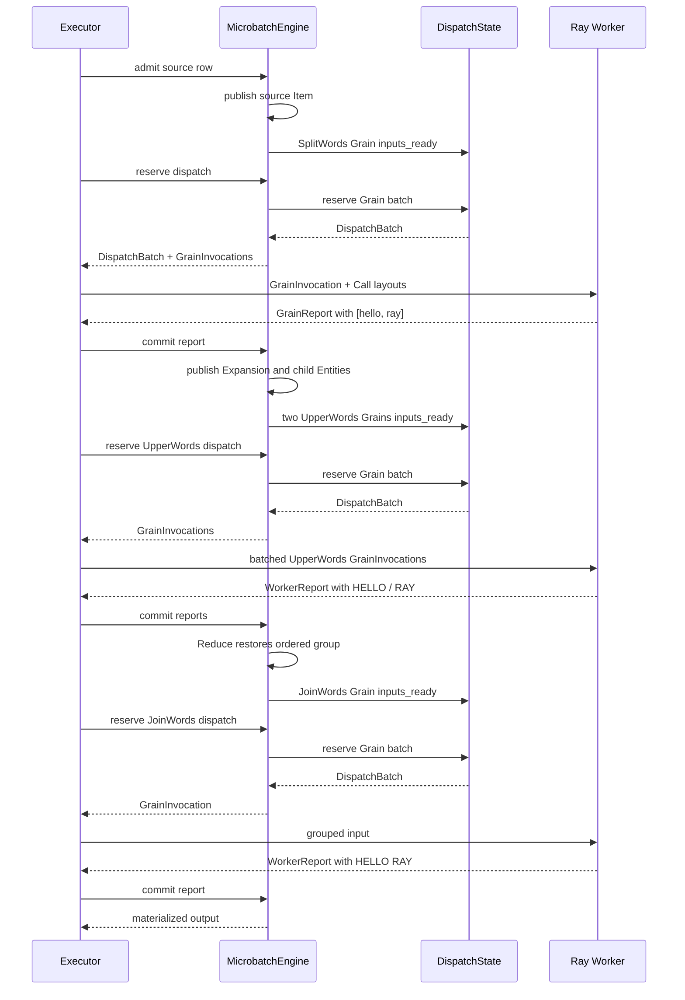

The Worker knows nothing about PortOrigin, the Domain tree, or lineage. It only
receives the compiled physical DTO, reads business values, executes the batch
UDF, and returns a report.

---

### 11. What exactly is passed between components

The macro-level arrows only show direction; the diagram below shows the
cross-boundary DTOs and who may write state:

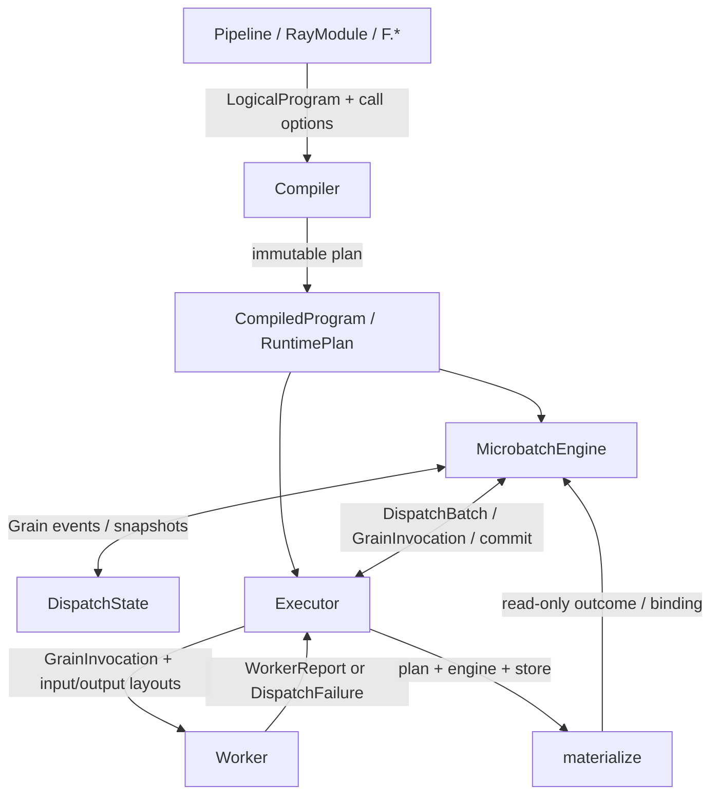

The dispatch main path of
[`executor.py`](../rayorch/experimental/multigrain_v3_6/execution/executor.py)
only asks the Engine for an already-validated batch/plan and then hands it to an
actor; it never reads RuntimeState itself:

```python
batch = candidate.engine.reserve_dispatch(
    call,
    max_size=pool.batch_size,
    pack_by_parent=pool.batching_policy == "single_parent",
)
invocations = tuple(
    candidate.engine.grain_invocation(grain)
    for grain in batch.grains
)
layouts = self.plan.output_layouts_by_call[call]
result_ref = actor.handle.execute.remote(invocations, layouts)
```

The stable DTOs that cross actors are defined in
[`protocol.py`](../rayorch/experimental/multigrain_v3_6/protocol.py):

```python
@dataclass(frozen=True, slots=True)
class GrainInvocation:
    grain: GrainRef
    generation: int
    inputs: tuple[GrainInput, ...]


WorkerReport = GrainReport | GrainFailureReport
WorkerDispatchResult = tuple[WorkerReport, ...] | DispatchFailure
```

| Component pair | Request or data | Returns | Who modifies state |
| --- | --- | --- | --- |
| API → Compiler | `LogicalProgram`, Call options | `CompiledProgram` | neither modifies the runtime |
| Engine → Dispatch | inputs ready/terminal, reserve, report/retry | `DispatchBatch`, snapshot | only Dispatch modifies Grain |
| Executor → Worker | `GrainInvocation`, `CallInputLayout`, `CallOutputLayout` | `WorkerReport` / `DispatchFailure` | Worker only changes in-actor UDF state |
| Executor → Engine | source admission, commit, recover | new runnable work or a completion state | only Engine modifies the semantic tables |
| Materialize → Engine | read-only query of output Items | outcome/binding | modifies no state |

This boundary avoids two common flywires: the Worker looking the Program up in
reverse, and the Executor deriving Filter/Reduce results by itself.

---

### 12. Who owns which state

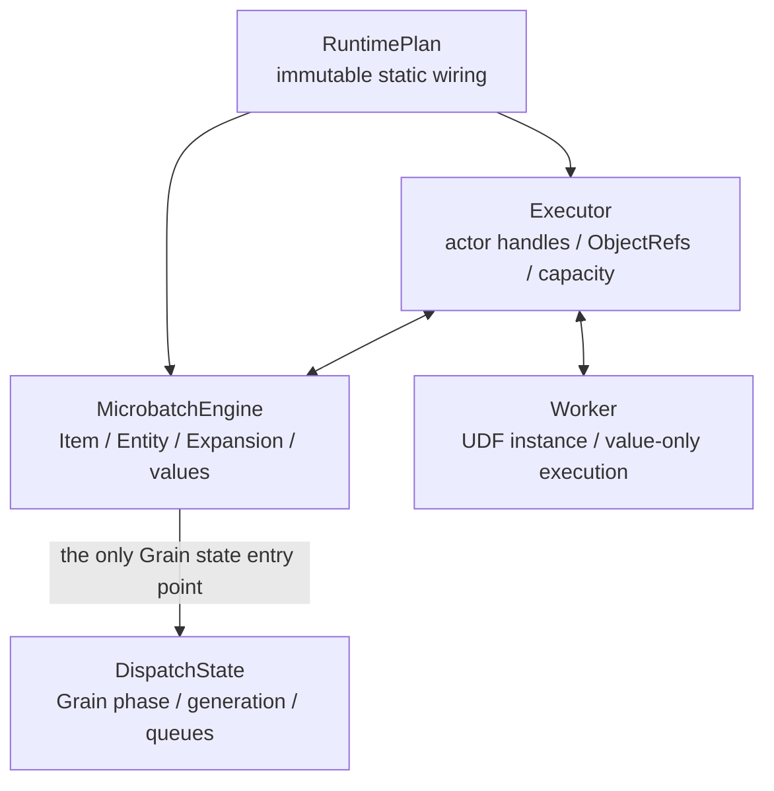

During maintenance, use the following five checks to detect a "flywire":

1. the compiler does not read business payloads;
2. the runtime does not re-interpret `PortOrigin`;
3. the MicrobatchEngine does not touch actor handles;
4. the Executor does not re-implement semantics such as Filter/Reduce;
5. the Worker does not read LogicalProgram, RuntimePlan, or RuntimeState.

There may be several indexes, but they must reference the same Effect; you may
not copy a second, independently modifiable rule. This is even verified by
object identity, not just field equality, in
[`verify_runtime_plan()`](../rayorch/experimental/multigrain_v3_6/program/verify.py):

```python
def indexed_by_item(port: PortRef, effect: ItemEffect) -> bool:
    return any(
        indexed is effect
        for indexed in plan.item_effects_by_source.get(port, ())
    )
```

Dynamic Item/Expansion can also only be written into the canonical table and
enter the `_fact_queue` queue through
[`MicrobatchEngine._publish_item/_publish_expansion`](../rayorch/experimental/multigrain_v3_6/runtime/engine.py);
the Executor, the Worker, and the materializer have no second publication entry
point.

Publication here means "validate and register an officially effective state
machine fact, then enqueue its `Ref` for the first time"; it is not network
publishing or `ray.put()`. Compared with an ordinary dictionary write, it
carries three additional contracts: fact visibility, idempotence, and conflict
rejection. The data structures, queues, and complete control flow are described
in [`Engine source walkthrough`](multigrain_v3_6_walkthrough/03_runtime_engine.md).

---

### 13. Which layer to read first for failure and recovery

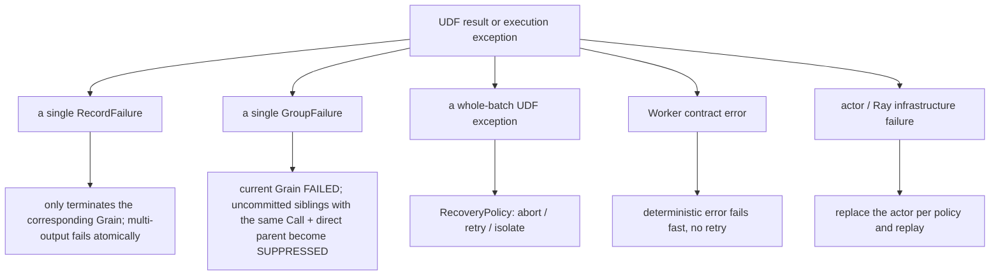

Both explicit data judgments are ordinary return values, and they require the
UDF to return a complete, row-aligned batch:

```python
return mg.RecordFailure("bad page")       # only fails the current Grain
return mg.GroupFailure("bad document")   # also isolates uncommitted siblings with the same Call and the same direct parent
```

Neither of them triggers a retry. `GroupFailure` only establishes a
microbatch-local barrier: already committed results are not rolled back, and
computations already sent to another actor are not chased down and killed, but
their late successful results become `SUPPRESSED` when the driver commits;
other parents and other Calls commit normally. Recoverable opaque errors should
still `raise` and be handed to `RecoveryPolicy`.

A lightweight fail-fast strategy is used by default. Only put a
`RecoveryPolicy` into the physical configuration of a Call when you actually
need fault tolerance:

```python
from rayorch.experimental.multigrain_v3_6 import RecoveryPolicy

self.call = RayModule(MyUdf).ray_options(
    batch_size=16,
    recovery=RecoveryPolicy.isolate_tail(infra_retries=1),
)
```

The pure decision lives in
[`recovery.py`](../rayorch/experimental/multigrain_v3_6/recovery.py); the action
still returns to the Engine through
[`executor.py`](../rayorch/experimental/multigrain_v3_6/execution/executor.py):

```python
policy = self._pool(pending_rpc.actor.call).recovery
live = engine.live_recovery_batch(pending_rpc.dispatch_batch)
if live is None:
    engine.suppress_barriered_batch(pending_rpc.dispatch_batch)
    return
action = policy.decide_udf(
    completed_retries=live.udf_retries,
    grain_count=len(live.grains),
)
if action is RecoveryAction.ABORT:
    raise self._execution_error(engine, pending_rpc, failure)
self._counters[pending_rpc.actor.call].retries += engine.apply_udf_recovery(
    pending_rpc.dispatch_batch,
    action,
    failure,
)
```

The recovery policy only makes pure decisions; `DispatchState` owns
queue/phase/generation, and the MicrobatchEngine owns the final Item/Expansion
propagation. Do not write another failure priority scheme inside the Executor.

---

### 14. What is inside RunResult

`RunResult` is an already frozen result snapshot; it does not hold a live Engine:

```mermaid
flowchart LR
    Result["RunResult"]
    Outputs["outputs<br/>preserves the Pipeline output tree"]
    Calls["calls<br/>RPC / batch / retry per Call"]
    Batches["microbatches<br/>Entity / Item / Grain scale"]
    Peak["peak_active_microbatches"]

    Result --> Outputs
    Result --> Calls
    Result --> Batches
    Result --> Peak
```

It is defined in
[`result.py`](../rayorch/experimental/multigrain_v3_6/execution/result.py). It
only stores frozen DTOs and has no `engine`, `RuntimeState`, or actor handle
field:

```python
@dataclass(frozen=True, slots=True)
class RunResult:
    outputs: object
    elapsed_s: float
    calls: tuple[CallMetrics, ...]
    microbatches: tuple[MicrobatchMetrics, ...]
    peak_active_microbatches: int
```

Commonly used fields:

```python
print(result.outputs)
print(result.elapsed_s)
print(result.rpc_count, result.actor_count)

for call in result.calls:
    print(call.udf_name, call.rpcs, call.average_batch, call.retries)
```

Non-PRESENT positions in `outputs` are expressed with the public `ItemOutcome`
rather than leaking the internal ItemRecord.

---

### 15. Read the source in this order

```mermaid
flowchart LR
    API["1. api.py + functional.py<br/>how the user draws the graph"]
    Model["2. model.py + program/logical.py<br/>identity and static declaration"]
    Semantics["3. program/semantics.py + analysis.py<br/>unified primitive semantics"]
    Compile["4. program/compiler + verify + lowering + plan"]
    Transition["5. runtime/transitions.py<br/>pure state algebra"]
    Runtime["6. runtime/state + dispatch + engine + materialize"]
    Boundary["7. protocol.py + execution/worker + executor"]

    API --> Model --> Semantics --> Compile --> Transition --> Runtime --> Boundary
```

Carry exactly one question at each stop:

1. [`api.py`](../rayorch/experimental/multigrain_v3_6/api.py) and
   [`functional.py`](../rayorch/experimental/multigrain_v3_6/functional.py): how
   does user expression become Call/Port/Domain?
2. [`logical.py`](../rayorch/experimental/multigrain_v3_6/program/logical.py):
   which declarations does the immutable graph store?
3. [`semantics.py`](../rayorch/experimental/multigrain_v3_6/program/semantics.py)
   and
   [`analysis.py`](../rayorch/experimental/multigrain_v3_6/program/analysis.py):
   what are the inputs, control, and derived dependencies of each Origin?
4. [`compiler.py`](../rayorch/experimental/multigrain_v3_6/program/compiler.py),
   [`verify.py`](../rayorch/experimental/multigrain_v3_6/program/verify.py),
   [`lowering.py`](../rayorch/experimental/multigrain_v3_6/program/lowering.py),
   and
   [`plan.py`](../rayorch/experimental/multigrain_v3_6/program/plan.py): how is
   it verified and turned into RuntimePlan Effects and Worker layouts?
5. [`transitions.py`](../rayorch/experimental/multigrain_v3_6/runtime/transitions.py):
   how is every input combination reduced to a single action?
6. [`runtime/state.py`](../rayorch/experimental/multigrain_v3_6/runtime/state.py),
   [`runtime/dispatch.py`](../rayorch/experimental/multigrain_v3_6/runtime/dispatch.py),
   and
   [`runtime/engine.py`](../rayorch/experimental/multigrain_v3_6/runtime/engine.py):
   who publishes facts, and who modifies the Grain queue?
7. [`protocol.py`](../rayorch/experimental/multigrain_v3_6/protocol.py),
   [`worker.py`](../rayorch/experimental/multigrain_v3_6/execution/worker.py),
   [`executor.py`](../rayorch/experimental/multigrain_v3_6/execution/executor.py),
   and
   [`materialize.py`](../rayorch/experimental/multigrain_v3_6/runtime/materialize.py):
   how do business values cross the Ray boundary while semantics do not?

Do not start from `executor.py` and work backwards to derive the whole set of
semantics; it deliberately cannot see most logical concepts.

---

### 16. Where a change should land when modifying functionality

#### Adding a structural primitive

```mermaid
flowchart LR
    Origin["logical.py<br/>add a new Origin"]
    Meaning["semantics.py<br/>declare the semantics exhaustively"]
    Verify["verify.py + lowering.py<br/>verify and lower"]
    Effect["plan.py<br/>immutable Effect"]
    Algebra["transitions.py<br/>pure state composition"]
    Engine["engine.py<br/>apply the Effect"]
    Tests["compiler + Cartesian product + runtime tests"]

    Origin --> Meaning --> Verify --> Effect --> Algebra --> Engine --> Tests
```

If any step lacks a clear semantics, do not start by adding a temporary `if` in
the engine.

#### Adding a new UDF physical option

The configuration path should be:
`RayModule.ray_options → compiler lowering → ActorPoolSpec → Executor`. If it
does not affect logical dependencies, do not push it into the LogicalProgram.

#### Adjusting failure policy

Change the pure decision in `recovery.py` first, then let `DispatchState`
execute the action. Do not let the Worker or the Executor modify Item outcomes
directly.

---

### 17. The most common misunderstandings

| Misunderstanding | Correct understanding |
| --- | --- |
| `forward()` is processing real data | it only traces symbolic Ports |
| a Port is a column of Python values | a Port is a static position; values live in Block/RowBinding |
| Expand is a map actor | Expand only creates child Entities and structural relations |
| Reduce executes sum/join | Reduce only restores an ordered group |
| Filter deletes an Entity | the Entity is kept; the target Item becomes DROPPED |
| RuntimePlan is a second LogicalProgram | it only stores the Effect wiring the runtime needs |
| the Engine should handle Ray crashes | the Engine handles semantics; Executor/Dispatch handle physical recovery |
| a smaller batch size is always safer and costs nothing | an admission window that is too small destroys batch formation |

---

### 18. The shortest verification path for developers

When you only change the compile stage or the state algebra, first run the
Ray-free tests:

```bash
pytest -q test/experimental/multigrain_v3_6/unit
```

When you change the Executor, the Worker ABI, recovery, or lifecycle, then run
real Ray:

```bash
RAY_ENABLE_UV_RUN_RUNTIME_ENV=0 \
pytest -q test/experimental/multigrain_v3_6/integration
```

Finally, check types and whitespace:

```bash
pyright rayorch/experimental/multigrain_v3_6
git diff --check
```

Do not infer real performance conclusions from unit tests. The configuration and
results of the current MinerU, Docling, and video paired gates are in
[`2026-08-08_release_regression.md`](experiments/multigrain_v3_6/2026-08-08_release_regression.md).

---

### 19. One-page summary

```mermaid
flowchart TB
    Author["Pipeline + RayModule + F.*"]
    Static["LogicalProgram<br/>CallRef / PortRef / DomainRef"]
    Plan["ProgramAnalysis → RuntimePlan"]
    Semantic["MicrobatchEngine<br/>Entity / Item / Expansion facts"]
    Physical["DispatchState<br/>Grain lifecycle"]
    Executor["Executor<br/>actor / RPC / capacity"]
    Worker["Worker<br/>value-only UDF"]
    Result["RunResult"]

    Author --> Static --> Plan
    Plan --> Semantic
    Plan --> Executor
    Semantic --> Physical
    Semantic <--> Executor
    Executor <--> Worker
    Executor --> Result
```

Remembering this one main line is enough: the user declares a static graph; the
compiler turns relations into Effects; the Engine maintains semantic facts;
DispatchState manages Grains; the Executor and the Worker are only responsible
for sending executable Grains into Ray. Every piece of state has exactly one
owner, so new functionality should land along the existing semantic path rather
than pulling a shortcut across layers.
