# MultiGrain V3.6 从零上手：使用、概念与端到端执行

> **文档生态位：唯一的顺序学习路径。** 本文假设读者完全不了解 V3.6，从第一个 Pipeline
> 开始，逐步建立七种身份、F.*、编译期、动态状态机和一次完整执行的心智模型。第一次学习请
> 按章节顺序阅读，不需要同时打开维护手册或源码逐段导读。

全部文档的角色与按读者划分的最短路线见
[`V3.6 文档地图`](multigrain_v3_6_documentation_map.md)。

这份教程只解决一个问题：第一次打开 V3.6 源码时，怎样用最少概念看懂它、运行它，
并知道修改应落在哪一层。

读完后，你应能回答：

1. `Pipeline`、`RayModule`、`Port` 和 `F.*` 分别做什么；
2. 静态 Program 如何定义坐标，动态状态机如何使用这些坐标；
3. 七种核心身份怎样组成 Entity、Item、Grain 与 Expansion；
4. 一次执行中，各组件互相传什么、谁有权修改状态；
5. 出问题时应先读哪个文件，而不是在整个仓库里搜索。

阅读层级建议：

1. 普通使用者读到第 6 节即可开始写包含 F.* 的 Pipeline；
2. 想理解框架如何执行，继续读第 7～14 节；
3. 准备修改源码，再进入
   [`架构与维护手册`](multigrain_v3_6_maintainer_guide.md)；
4. 需要逐段读某个复杂文件时，使用
   [`复杂源码导读`](multigrain_v3_6_walkthrough/README.md)。

本文保留完整的入门解释和示例，但不逐函数解释 989 行 Engine；维护合同与源码实现细节分别由
后两层文档承接。文中的 snippet 只摘录职责边界，紧邻的文件链接始终是实现真相。

---

## 1. 先建立一个最小心智模型

V3.6 是一个声明式、细粒度、基于 Ray actor 的数据流执行器。

你先用 `Pipeline.forward()` 画图；编译器把图变成静态执行接线；`Executor` 再让
Ray Worker 批量运行 UDF。`forward()` 操作的始终是符号 `Port`，不是业务数据。

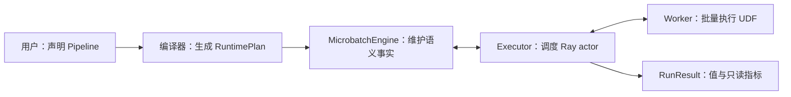

最重要的边界只有两条：

- `RayModule` 做计算，会创建 Call、Grain、actor 和 RPC；
- `F.expand/filter/reduce/broadcast` 只描述结构关系，不创建 actor，也不执行 RPC。

普通用户主路径只需要认识这些名称：

| 名称 | 一句话职责 |
| --- | --- |
| `Pipeline` | 声明整张数据流图 |
| `Port` | 指向图中某个逻辑数据位置 |
| `RayModule` | 声明一个可批处理的计算 Call |
| `F.*` | 显式声明粒度与成员关系 |
| `Executor` | 连接 Ray，并管理 actor、RPC 和 microbatch |
| `RunResult` | 返回业务输出与冻结指标 |
| `ItemOutcome` / `RecordFailure` | 表达非正常的单 Item/Grain 结果 |
| `RecoveryPolicy` | 只在需要重试或隔离时配置 |

源码入口是 [`api.py`](../rayorch/experimental/multigrain_v3_6/api.py) 和
[`functional.py`](../rayorch/experimental/multigrain_v3_6/functional.py)。公开 `Port` 本身非常轻：

```python
@dataclass(frozen=True, slots=True)
class Port:
    """一个逻辑 Port 的公开符号句柄。"""

    ref: PortRef
    _owner: int
```

真正的 Call、Domain 和 Origin 都由 `Pipeline.compile()` 中的 `_ProgramBuilder` 建立；
`Port` 不会偷偷持有值或运行时状态。

---

## 2. 五分钟跑通第一个 Pipeline

无状态函数可以用 `@function` 包成 `RayModule`。UDF 接收一列 batch，必须返回同样长度
的一列结果。

```python
from rayorch.experimental.multigrain_v3_6 import Executor, Pipeline, function


@function
def double(values):
    return [value * 2 for value in values]


class DoublePipeline(Pipeline):
    def forward(self, values):
        return double(values)


with Executor(DoublePipeline()) as executor:
    result = executor.run([1, 2, 3])

assert result.outputs == [2, 4, 6]
```

这段代码实际声明了一个 source Port、一个 Call 和一个 output Port：

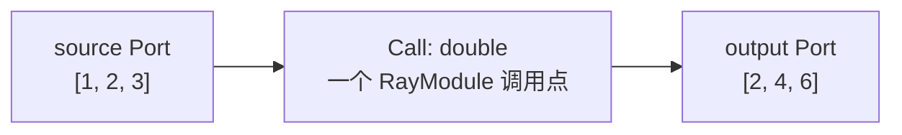

`Executor` 默认可以自行 `ray.init()`；用 `with` 能确保 actor 和由它启动的 Ray runtime
在异常路径上也被关闭。

`run()` 的公开输入合同是有限、可重复遍历的 `Sequence`。Executor 会在执行前把各列 eager
materialize 为 tuple，以冻结本次运行的输入并一次性校验 row alignment；V3.6 当前不声明
streaming input/output 语义。

---

## 3. 一个真正体现 V3.6 的例子

下面把每条文本拆成单词，逐单词转大写，再按原文本合并：

```python
from typing import cast

from rayorch.experimental.multigrain_v3_6 import (
    F,
    Executor,
    Pipeline,
    Port,
    RayModule,
)


class SplitWords:
    def run(self, texts):
        return [text.split() for text in texts]


class UpperWords:
    def run(self, words):
        return [word.upper() for word in words]


class JoinWords:
    def run(self, groups):
        return [" ".join(group) for group in groups]


class WordPipeline(Pipeline):
    def __init__(self):
        self.split = RayModule(SplitWords).ray_options(
            replicas=1, batch_size=8, num_cpus=1
        )
        self.upper = RayModule(UpperWords).ray_options(
            replicas=2, batch_size=16, num_cpus=1
        )
        self.join = RayModule(JoinWords).ray_options(
            replicas=1, batch_size=8, num_cpus=1
        )

    def forward(self, texts: Port) -> Port:
        word_groups = cast(Port, self.split(texts))
        words = F.expand(word_groups)
        upper_words = cast(Port, self.upper(words))
        grouped = F.reduce(upper_words)
        return cast(Port, self.join(grouped))


with Executor(WordPipeline()) as executor:
    result = executor.run(["hello ray", "small graph"])

assert result.outputs == ["HELLO RAY", "SMALL GRAPH"]
```

`cast(Port, ...)` 只是在告诉类型检查器这里是单输出 Call；它不改变运行时行为。

数据粒度会发生一次下降和回升：


这里有 3 个计算 Call，也只有 3 组 actor pools。Expand 和 Reduce 不增加 actor 或 RPC。

---

## 4. 先认识七种基础身份

V3.6 只有七种身份类型：三个属于静态 Program，四个只在某次 microbatch 运行时出现。
先记住名称和问题，再理解组合公式。

### 4.1 七种名称

| 类型 | 静态/动态 | 它唯一回答的问题 |
| --- | --- | --- |
| `CallRef` | 静态 | 图中的哪一个计算调用点？ |
| `PortRef` | 静态 | 图中的哪一个逻辑数据位置？ |
| `DomainRef` | 静态 | 这个位置按哪一种粒度对齐？ |
| `EntityRef` | 动态 | 这个 Domain 中的哪一次 occurrence？ |
| `ItemRef` | 动态 | 某个 Entity 在某个 Port 上的结果是什么？ |
| `GrainRef` | 动态 | 某个 Entity 在某个 Call 上的执行是什么？ |
| `ExpansionRef` | 动态 | 某个 parent 向哪个 child Domain 展开？ |

`Port` 是用户可见的符号句柄；`PortRef` 才是它内部携带的静态身份。其余 Ref 都属于
维护者模型，不需要出现在普通 Pipeline 代码中。

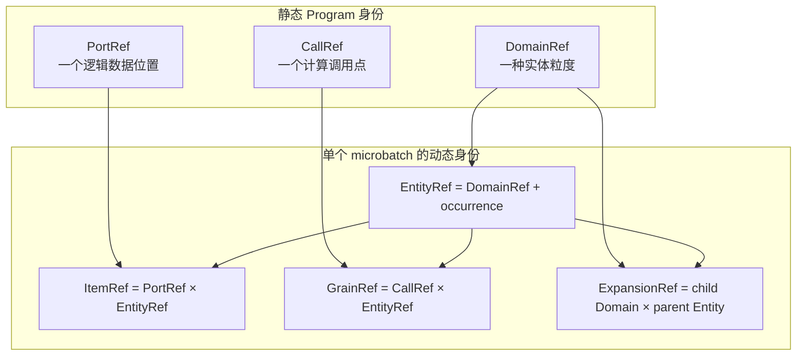

对应实现分布在 [`model.py`](../rayorch/experimental/multigrain_v3_6/model.py) 和
[`runtime/state.py`](../rayorch/experimental/multigrain_v3_6/runtime/state.py)。字段摘录直接体现
三个组合公式：

```python
@dataclass(frozen=True, slots=True, order=True)
class EntityRef:
    domain: DomainRef
    value: int


@dataclass(frozen=True, slots=True, order=True)
class ItemRef:
    port: PortRef
    entity: EntityRef


@dataclass(frozen=True, slots=True, order=True)
class GrainRef:
    call: CallRef
    entity: EntityRef


@dataclass(frozen=True, slots=True)
class ExpansionRef:
    child_domain: DomainRef
    parent_entity: EntityRef
```

### 4.2 用一条 PDF 流水线逐个理解七种 Ref

先看一条最小流水线：每份 PDF 被渲染成若干页，每一页再做 OCR，最后把文字按 PDF
收回来。

```python
class PdfPipeline(mg.Pipeline):
    def __init__(self) -> None:
        self.render = mg.RayModule(RenderPages)
        self.ocr = mg.RayModule(OcrPage)

    def forward(self, pdfs):
        page_groups = self.render(pdfs)
        pages = mg.F.expand(page_groups)
        page_texts = self.ocr(pages)
        return mg.F.reduce(page_texts)
```

假设编译器为它分配下面这些编号。编号只用于说明，真实数字由 Program 构造顺序决定：

```text
DomainRef(0) = PDF 粒度
DomainRef(1) = Page 粒度

CallRef(0) = self.render(...) 这个调用点
CallRef(1) = self.ocr(...)    这个调用点

PortRef(0) = pdfs
PortRef(1) = page_groups
PortRef(2) = pages
PortRef(3) = page_texts
PortRef(4) = reduce 后的 PDF 级 texts
```

下面依次看每一种 Ref。

#### 4.2.1 `PortRef`：图上的固定数据位置

`PortRef(3)` 永远表示 `self.ocr(pages)` 的逻辑输出位置。它有点像表的一列：只说明
“这是 page_texts 列”，不代表某一页的具体文本，也不持有业务值。

同一个 Program 无论处理 1 个还是 1000 个 PDF，`PortRef(3)` 都是同一个静态位置。

#### 4.2.2 `DomainRef`：Entity 使用哪套身份空间

`DomainRef(0)` 是 PDF 粒度，`DomainRef(1)` 是 Page 粒度。只有位于同一 Domain 的
Entity 才能直接按身份对齐：

```text
PDF Entity 只能直接对齐其他 PDF 级 Port
Page Entity 只能直接对齐其他 Page 级 Port
```

即使 PDF 和 Page 的内部 occurrence 整数碰巧相同，它们也不是同一个 Entity，因为
`DomainRef` 是 Entity 身份的一部分。

#### 4.2.3 `CallRef`：静态图中的一个计算调用点

`CallRef(1)` 表示 `self.ocr(pages)` 这个调用点，不表示某一页已经执行了一次 OCR。
如果同一个 `RayModule` 对象在 `forward()` 中调用两次，会产生两个不同的 `CallRef`，
因为它们是图中两个不同的调用位置；每个 Call 对应自己的静态输入、输出和 actor-pool
合同。

#### 4.2.4 `EntityRef`：这一轮运行中的具体业务 occurrence

假设当前 microbatch 输入 `A.pdf`，并且它展开成两页：

```text
eA  = EntityRef(DomainRef(0), A)       # A.pdf 这个 PDF occurrence
eA0 = EntityRef(DomainRef(1), A/page0) # A.pdf 的第 0 页
eA1 = EntityRef(DomainRef(1), A/page1) # A.pdf 的第 1 页
```

这里的 `A`、`A/page0` 是便于阅读的符号写法；源码实际保存轻量整数，并在 lineage 表中
记录 page Entity 的 parent 和 ordinal。Entity 只回答“是谁”，不回答它在某个处理阶段
是否成功、被过滤或具有什么值。

#### 4.2.5 `ItemRef`：某一行与某一列的交点

把 `EntityRef` 想成行、`PortRef` 想成列，`ItemRef` 就是一个单元格：

```text
ItemRef(PortRef(2), eA0) = A.pdf 第 0 页在 pages Port 上的事实
ItemRef(PortRef(3), eA0) = A.pdf 第 0 页在 page_texts Port 上的事实
ItemRef(PortRef(3), eA1) = A.pdf 第 1 页在 page_texts Port 上的事实
```

每个 Item 最终拥有 `PRESENT / DROPPED / FAILED / SUPPRESSED` 中的一个终态；只有
`PRESENT` Item 才关联 `ValueBinding`。因此 Item 表达的是“某个实体在某个数据位置上
发生了什么”，而不表达一次计算是否可调度。

#### 4.2.6 `GrainRef`：某个 Call 在某个 Entity 上的一次逻辑工作

OCR Call 在 Page Domain 上运行，所以 A.pdf 的两页会产生两个 Grain：

```text
GrainRef(CallRef(1), eA0) = 对 A.pdf 第 0 页执行一次 OCR
GrainRef(CallRef(1), eA1) = 对 A.pdf 第 1 页执行一次 OCR
```

Grain 消费输入 Item，并在执行成功后产生输出 Item：

```text
ItemRef(pages, eA0)
        ↓ 输入就绪
GrainRef(ocr_call, eA0)
        ↓ 执行并提交报告
ItemRef(page_texts, eA0)
```

这就是 Item 和 Grain 最直接的区别：

| | `ItemRef` | `GrainRef` |
| --- | --- | --- |
| 直觉 | 一个数据单元格/事实槽位 | 一项可以被调度的逻辑工作 |
| 身份 | `Port × Entity` | `Call × Entity` |
| 状态 | `PRESENT/DROPPED/FAILED/SUPPRESSED` | `READY/IN_FLIGHT/SEALED` |
| 是否含业务值 | PRESENT 时关联 ValueBinding | 不保存输出值 |
| 是否一定经过 Worker | 不一定；Source、Filter、Reduce 也产生 Item | 是一个 RayModule Call 的执行单位 |
| batching | 不参与物理 batch 身份 | 多个 Grain 可以合并到一个 Worker RPC |

一个 Grain 可以读取多个输入 Item，也可以原子地产生多个输出 Item。Filter 或 Reduce
也可以发布新 Item，却不会创建 Grain，因为它们是 Engine 内的结构状态转移，不是
RayModule 计算。

#### 4.2.7 `ExpansionRef`：某个 parent 的一次展开事实

`ExpansionRef(DomainRef(1), eA)` 表示“A.pdf 这一个 PDF 向 Page Domain 的展开结果”。
成功后它记录有序 children `(eA0, eA1)`；若页面列表为空，则记录合法的
`SUCCEEDED(())`。Reduce 正是通过这份结构事实知道应将哪些 Page Entity 收回到 `eA`。

完整身份链如下：

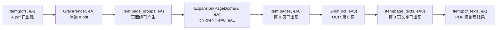

最短记忆方式是：

```text
Port   = 列
Domain = 行使用哪套身份空间
Entity = 一行
Item   = 一个单元格
Call   = 图上的计算定义
Grain  = 这个计算对某一行的一次工作
Expansion = 一行展开出哪些子行
```

### 4.3 先用坐标规则理解组合代数

“组合代数”听起来像是在做数学推导，其实它最先解决的是一个很朴素的问题：**某一列
能不能放在某一行上，某个计算能不能对这一行执行？**

继续使用上一节的 PDF 例子。编译后的 Program 可以回答三张静态查找表：

| 查找 | 具体例子 | 直白含义 |
| --- | --- | --- |
| `port_domain(port)` | `port_domain(pages) = Page` | pages 这列只能放 Page 行 |
| `call_domain(call)` | `call_domain(ocr) = Page` | OCR 只能对 Page 行创建 Grain |
| `parent_domain(domain)` | `parent_domain(Page) = PDF` | Page Entity 的直接 parent 是 PDF Entity |

所以判断一个组合是否合法，只需依次问：

1. 创建 Item 时，Port 和 Entity 是否属于同一 Domain？
2. 创建 Grain 时，Call 和 Entity 是否属于同一 Domain？
3. 创建 Expansion 时，child Domain 的 parent 是否就是 parent Entity 的 Domain？

例如：

| 组合 | 合法？ | 原因 |
| --- | --- | --- |
| `Item(pages, eA0_page)` | 是 | pages Port 和 `eA0` 都属于 Page Domain |
| `Item(pages, eA_pdf)` | 否 | pages 是 Page 列，`eA` 却是 PDF 行 |
| `Grain(ocr, eA0_page)` | 是 | OCR 在 Page Domain 执行 |
| `Grain(ocr, eA_pdf)` | 否 | 不能直接对整个 PDF 执行 page-level OCR Call |
| `Expansion(Page, eA_pdf)` | 是 | Page 的 parent Domain 是 PDF |
| `Expansion(Page, eA0_page)` | 否 | 这会错误地把 Page 当作 Page 的 parent |

下面的三个映射只是把这三张查找表写成紧凑记号：

```text
port_domain   : PortRef -> DomainRef
call_domain   : CallRef -> DomainRef
parent_domain : DomainRef -> DomainRef | None
```

`port_domain` 由 [`PortSpec.domain`](../rayorch/experimental/multigrain_v3_6/program/logical.py)
定义，`call_domain` 由 `CallSpec.execution_domain` 定义，`parent_domain` 由
`DomainSpec.parent` 定义。[`verify.py`](../rayorch/experimental/multigrain_v3_6/program/verify.py)
先验证 Domain 只有一个根、parent 无环，再验证 Call 和 Port 的局部合同。

现在再看身份公式就比较直观了。逗号左边是“列/计算/child Domain”，右边是“哪一行”；
`where` 后面只是上面三条合法性检查：

```text
EntityRef    = (domain, occurrence)

ItemRef      = (port, entity)
               where port_domain(port) == entity.domain

GrainRef     = (call, entity)
               where call_domain(call) == entity.domain

ExpansionRef = (child_domain, parent_entity)
               where parent_domain(child_domain) == parent_entity.domain
```

如果只想使用或阅读框架，到这里就足够了。下面的集合公式是给需要证明完备性或检查
Compiler 的维护者使用的压缩写法，不引入任何新语义：

```text
E ⊆ D × Occurrence
I = {(p, e) ∈ P × E | port_domain(p) = domain(e)}
G = {(c, e) ∈ C × E | call_domain(c) = domain(e)}
X = {(d, e) ∈ D × E | parent_domain(d) = domain(e)}
```

上式描述的是「合法的 Program 和 RuntimeState」。Ref 自身仍是轻量 frozen key：
`ItemRef(...)` 不内嵌一份 Port→Domain 表，约束只由 Compiler 预检和 MicrobatchEngine
的状态转移维护，避免第二处事实。

所以 `ItemRef(PortRef(7), EntityRef(DomainRef(2), 9))` 是否合法，不由整数 `7`
或 `9` 决定，而由 Port 7 是否属于 Domain 2 决定。整数只是轻量编号，Domain
才是坐标的类型；这样两个无关粒度即使碰巧共用数字，也不会被误对齐。

### 4.4 计算和结构原语如何改变这些组合

先不看公式，沿 PDF→Page→OCR 流水线走一遍：

1. **Source admission**：输入 `[A.pdf, B.pdf]`，创建两个 PDF Entity `eA/eB`，并在
   pdfs Port 上创建两个 source Item。
2. **Call**：`render` 对 `eA` 创建一个 Grain。它读取 `Item(pdfs, eA)`，成功后产生
   `Item(page_groups, eA)`；整个过程仍然是同一个 PDF Entity。
3. **Expand**：A.pdf 的 page group 含两页，于是记录一个 `Expansion(Page, eA)`，创建
   child Entities `eA0/eA1`，再产生 `Item(pages, eA0/eA1)`。只有这一步创建新 Entity。
4. **Call**：`ocr` 分别对 `eA0/eA1` 创建两个 Grain，输出 page_text Items；Page
   Entity 不变。
5. **Filter**：若 `eA1` 未通过质量 mask，只把 `Item(selected_text, eA1)` 标成
   `DROPPED`；`eA1` 本身和它在其他 Port 上的 Item 都还存在。
6. **Broadcast**：若 OCR 需要 PDF 级语言信息，就沿 `eA → eA0/eA1` 的 lineage，
   在两个 Page Entity 上创建语言 Item；它不会创建新的 Page Entity。
7. **Reduce**：最后读取 `Expansion(Page, eA)` 确认 A.pdf 有哪些有序页面，把幸存的
   page text 收回成 `Item(pdf_texts, eA)`。

由此可以先记住两类操作：

```text
同一粒度：Source 建立 root Entity；Call / Filter 复用当前 Entity
          它们都只在当前 Domain 的 Port 上产生 Item

跨粒度：Expand / Reduce / Broadcast
        必须沿显式 parent/child lineage 移动
```

下面的表只是把上述故事压缩成维护者方便检查的记号。`e` 表示同一个 Entity，`eₚ`
表示 parent，`eᶜᵢ` 表示第 i 个 child，`dᴄ` 表示 child Domain：

| 操作 | PDF 例子 | 身份变换的压缩写法 | 必须保持什么 |
| --- | --- | --- | --- |
| Source admission | 输入第 i 份 PDF | `eᵢ = Entity(root, i); Item(source, eᵢ)` | 多个 source Port 等长并按同一个 `eᵢ` 对齐 |
| Call | 对 `eA0` 做 OCR | `Item(p₀, e) × … → Grain(c, e) → Item(pₒ, e) × …` | 输入、Grain、输出共用同一 `e` |
| Filter | 筛掉低质量 `eA1` text | `Item(source, e) × Item(mask, e) → Item(target, e)` | 只改目标 Item 终态，不删除 Entity |
| Expand | A.pdf 展开成 `eA0/eA1` | `Item(group, eₚ) → Expansion(dᴄ, eₚ) + {Entity(eᶜᵢ), Item(target, eᶜᵢ)}` | child 属于 `dᴄ`，并记录 parent + ordinal |
| Reduce | pages 收回到 A.pdf | `Item(value, eᶜ₀…eᶜₙ) × Expansion(dᴄ, eₚ) → Item(target, eₚ)` | 按 Expansion 的稳定 ordinal 回到 parent |
| Broadcast | PDF 语言投影到 pages | `Item(source, eₐ) × lineage(eₐ, eᴅ) → Item(target, eᴅ)` | source Entity 必须是 target Entity 的祖先 |

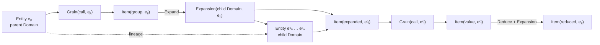

Filter 是同一个 `e` 上的点对点变换；Call 的所有输入也已由同一 `e` 对齐，所以
不需要隐式 zip，也不会由某个参数单独决定 Entity 身份。真正跨粒度的只有三类关系：

- Expand 创建 `parent -> children`；
- Reduce 沿这个关系从 children 回到 parent；
- Broadcast 沿已有 lineage 从 ancestor 投影到 descendant。

其他跨 Domain 组合均是编译错误，编译器不根据 Port 位置、参数名或列表长度
猜测对齐关系。

### 4.5 每种身份的唯一权威落点

七种身份的权威落点也只有一处：

| 身份 | 静态定义或动态事实的权威位置 |
| --- | --- |
| `CallRef` | `LogicalProgram.calls`；RuntimePlan 只保留执行所需合同 |
| `PortRef` | `LogicalProgram.ports`；RuntimePlan 的 Effect 索引用它接线 |
| `DomainRef` | `LogicalProgram.domains` 定义 parent 关系 |
| `EntityRef` | MicrobatchEngine 的 Entity/lineage 表 |
| `ItemRef` | `RuntimeState.items` 与 `RuntimeState.values` |
| `GrainRef` | pending 输入在 RuntimeState；phase/queue 在 DispatchState |
| `ExpansionRef` | `RuntimeState.expansions` |

四种动态身份可以再压缩为四句话：Entity 是逻辑对象，Item 是位置上的结果，Grain 是
一次计算，Expansion 是父子集合关系。细粒度血缘随真实 Item/Grain 数量线性记录，不会为
每个结果复制完整路径。

### 4.6 多输入、多输出如何影响七种身份

多输入、多输出不会产生新的身份种类，也不会让一个 Port 变成复合容器。它只是在同一个
Call 两侧放置多个独立 Port：

```python
class Compare:
    def run(self, left, right, *, weights):
        return (
            [lhs + rhs for lhs, rhs in zip(left, right)],
            [lhs * rhs * weight for lhs, rhs, weight in zip(left, right, weights)],
        )

self.compare = mg.RayModule(Compare, num_outputs=2)

def forward(self, left, right, weights):
    sums, scores = self.compare(left, right, weights=weights)
    return sums, scores
```

假设这个调用被编译为：

```text
Domain d_page
Call   c_compare

input Ports  = (p_left, p_right, p_weights)
output Ports = (p_sums, p_scores)
```

对某一页 `eA0`，动态身份展开为：

```text
Item(p_left,    eA0) ─┐
Item(p_right,   eA0) ─┼─> Grain(c_compare, eA0) ─┬─> Item(p_sums,   eA0)
Item(p_weights, eA0) ─┘                           └─> Item(p_scores, eA0)
```

最重要的公式是：

```text
N 个输入 Item × 同一个 Entity
        → 1 个 Grain(Call, Entity)
        → M 个输出 Item × 同一个 Entity
```

它不是“N 个输入创建 N 个 Grain”，也不是“M 个输出创建 M 个 Call”。七种身份分别受到
如下影响：

| 身份 | `N inputs → M outputs` 下发生什么 |
| --- | --- |
| `PortRef` | 有 N 个独立输入 Port 和 M 个独立输出 Port；每个输出都有自己的 `output_index` |
| `DomainRef` | Call 的所有输入必须已经位于同一 Domain；Call 输出仍位于该 execution Domain |
| `CallRef` | 整个调用点只有一个 CallRef；同一个 RayModule 在别处再次调用才创建另一个 CallRef |
| `EntityRef` | 每个 occurrence 只保留一个 EntityRef；它是所有输入、Grain 和输出的共同对齐键 |
| `ItemRef` | 对该 Entity，N 个输入位置和 M 个输出位置分别形成独立 ItemRef 与独立终态 |
| `GrainRef` | 每个 `CallRef × EntityRef` 只有一个 Grain；它一次消费所有输入槽并提交所有输出 |
| `ExpansionRef` | 普通多输出不创建 Expansion；只有某个输出随后被 `F.expand*` 时才出现 |

所有输入对 Entity 身份是对称的：参数顺序只决定 Worker ABI 槽位，不赋予第一个参数
特殊的身份所有权。输入终态由一个交换归约统一处理：

```text
任意 FAILED/SUPPRESSED → 全部输出 SUPPRESSED
否则仍有未决输入      → WAIT
否则 REQUIRED DROPPED  → 全部输出 DROPPED
否则                   → 唯一 Grain READY
```

Worker 成功返回后也不会逐输出零散发布。它先验证外层输出数、每列 Grain 行数和
`RecordFailure`，Engine 再预检完整 report；同一 Grain 的 M 个输出要么一起生效，要么
一个都不生效。因此每个输出 Item 有独立身份，但它们共享同一次 Grain commit 边界。

如果两个输出本身都是 group-valued，继续 Expand 时有两种不同身份语义：

```text
independent:
    F.expand(left_groups)  → child Domain d1 → Expansion(d1, eA0)
    F.expand(right_groups) → child Domain d2 → Expansion(d2, eA0)

aligned:
    F.expand_aligned(left_groups, right_groups)
        → 一个共同 child Domain d1
        → 一个 Expansion(d1, eA0)
        → 同一批 child Entity 上的两个不同 Item Ports
```

前者表示两套无关 children，可以有不同 cardinality；后者表示两列描述同一批 children，
所以 cardinality 必须一致。`reduce_aligned()` 对称地让多个 value Ports 使用同一成员集合
回到 parent Entity，但它只是生成多个 Reduce Item，不会额外创建 CallRef 或 GrainRef。

---

## 5. 写 Pipeline 时，怎样判断两个 Port 能否直接组合

第 4 节解释了身份公式；这一节只回答写 `forward()` 时最常见的实际问题：

> 我手里有两个 Port，它们能直接传给同一个 RayModule 吗，还是要先
> Expand、Reduce 或 Broadcast？

仍以 PDF→Page→OCR 为例：

```python
def forward(self, pdfs):
    metadata = self.metadata(pdfs)
    page_groups = self.render(pdfs)

    pages = F.expand(page_groups)
    page_metadata = F.broadcast(metadata, like=pages)
    page_texts = self.ocr(pages, page_metadata)

    text_groups = F.reduce(page_texts)
    return self.assemble(metadata, text_groups)
```

逐行看每个 Port 上的“一行究竟代表谁”：

| Port | 一项业务值大致是什么 | Domain：一行代表谁 |
| --- | --- | --- |
| `pdfs` | 一份 PDF | PDF Entity |
| `metadata` | 一份 PDF 的元数据 | PDF Entity |
| `page_groups` | 一份 PDF 的 `list[Page]` | 仍是 PDF Entity |
| `pages` | 一页 Page | Page Entity |
| `page_metadata` | 投影给一页的 PDF 元数据 | Page Entity |
| `page_texts` | 一页 OCR 文本 | Page Entity |
| `text_groups` | 一份 PDF 的有序 `list[Text]` | 回到 PDF Entity |

这里最容易误解的是 `page_groups`：它的 Python 值虽然是 `list[Page]`，但“一行”仍然
对应一份 PDF，所以它还在 PDF Domain。只有 `F.expand(page_groups)` 真正创建 Page
Entities，输出 `pages` 才进入 Page Domain。反过来，`F.reduce(page_texts)` 把 Page
Entities 的值按 parent 收回，输出才重新回到 PDF Domain。

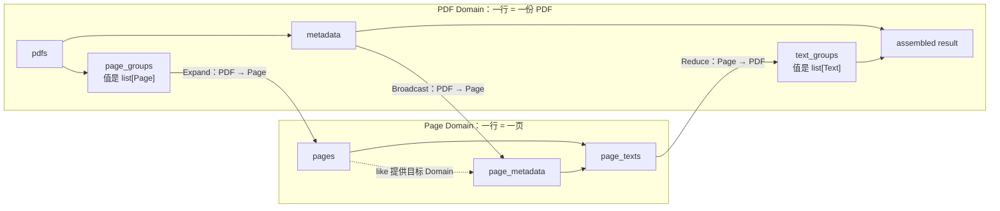

实际判断时只需按下面顺序：

1. **两个 Port 属于同一 Domain**：可以按同一个 Entity 直接送入 RayModule；例如
   `ocr(pages, page_metadata)`。它们的业务值类型可以不同。
2. **祖先 Port 要给后代 Entity 使用**：先 `F.broadcast(ancestor, like=descendant)`；例如
   把 PDF metadata 投影到每一页。
3. **child Port 要回到 parent**：先 `F.reduce(child)`；例如把 page texts 收成每份 PDF
   的有序 group。
4. **parent 的 group 值要变成独立 children**：使用 `F.expand(group)`；例如把
   `list[Page]` 变成 Page Entities。
5. **两个 Domain 没有可声明的祖先/后代关系**：当前不能隐式 join。编译器会报错，
   而不会按参数位置、列表长度或 Python 类型猜测对齐关系。

因此，Domain 不是 Python 数据类型：

- `metadata: dict` 和 `pdfs: str` 可以同属 PDF Domain，并按同一 PDF Entity 对齐；
- `document_title: str` 与 `page_text: str` 即使都是字符串，也分别属于 PDF/Page
  Domain，不能直接作为同一个 Call 的输入。

用户不需要手写 `DomainRef`。Builder 会在 Source、Expand、Reduce 和 Broadcast 时记录
Domain；用户只需通过这些显式关系表达“每一行现在代表谁”。下一节再分别展开四个结构
原语的行为。

---

## 6. 四个结构原语

### 6.1 Expand：父级的一组值变成子级 Entity

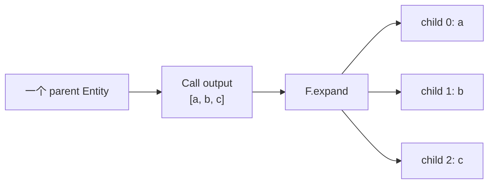

Expand 创建一个 child Domain，并保留 parent 与 ordinal。空列表也是成功 Expansion，
只是 child 数量为 0。

### 6.2 Reduce：把 child 值按 parent 恢复成有序 group

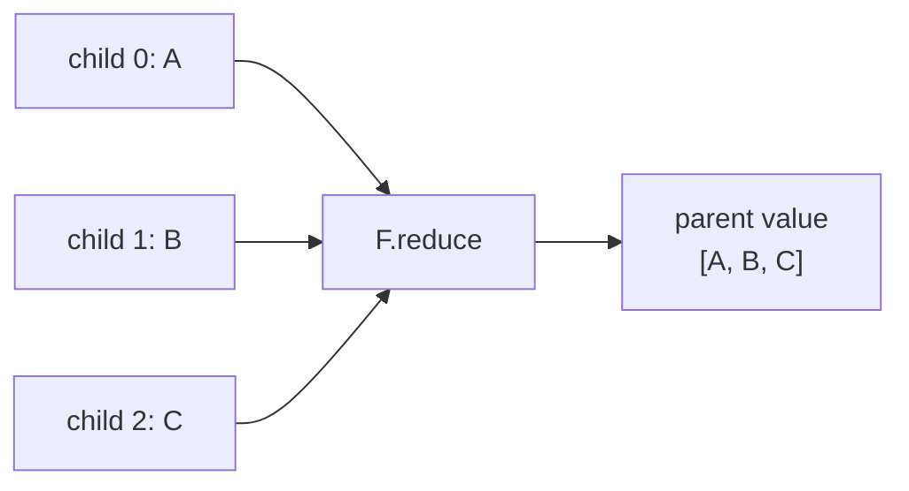

Reduce 不执行聚合函数；它只恢复结构。真正的 sum、join、assemble 仍应由后续 RayModule
完成。

### 6.3 Broadcast：把祖先值投影到后代粒度

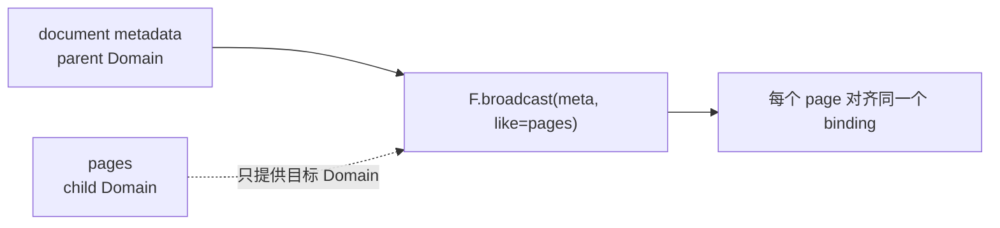

Broadcast 不复制业务 payload，只让后代 Entity 引用祖先的同一 value binding。

### 6.4 Filter：改变成员终态，不改变 Domain

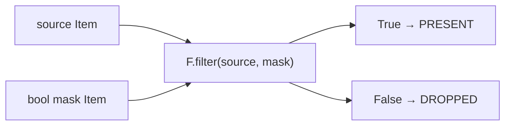

Filter 不删除 Entity，也不重新编号。它发布一个同 Domain 的新 Item：mask 为 false 时，
该 Item 的终态是 `DROPPED`。

`expand_aligned` 和 `reduce_aligned` 用于多个 Port 明确共享同一成员关系。它们不是隐式
zip；编译器会验证生产 Call、Domain 和 cardinality 合同。

`F.optional(port)` 只改变一个 Call 输入在上游 `DROPPED` 时的策略：Worker 会收到
`MISSING`。它不创建 Port、Domain、Entity 或 actor，因此不属于第五种结构 primitive。

---

## 7. 静态定义与动态状态怎样连接

静态图不会“挂着”可变状态机。它只提供稳定坐标和不可变关系；每次 microbatch 都创建
独立状态表，并以 Ref 为 key 保存事实。

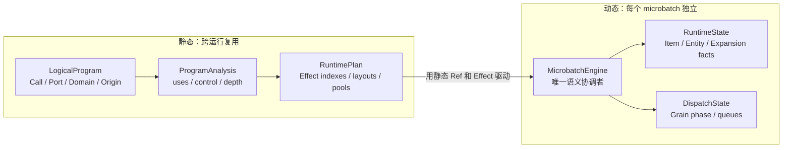

静态结构见 [`logical.py`](../rayorch/experimental/multigrain_v3_6/program/logical.py) 与
[`plan.py`](../rayorch/experimental/multigrain_v3_6/program/plan.py)；动态表见
[`runtime/state.py`](../rayorch/experimental/multigrain_v3_6/runtime/state.py)。源码中没有把这些
表塞进 LogicalProgram：

```python
@dataclass(slots=True)
class RuntimeState:
    items: dict[ItemRef, ItemRecord] = field(default_factory=dict)
    expansions: dict[ExpansionRef, ExpansionRecord] = field(default_factory=dict)
    entity_lineage: dict[EntityRef, EntityParent] = field(default_factory=dict)
    values: dict[ItemRef, ValueBinding] = field(default_factory=dict)
    pending_grains: dict[GrainRef, PendingGrain] = field(default_factory=dict)
```

[`runtime/engine.py`](../rayorch/experimental/multigrain_v3_6/runtime/engine.py) 每次只为一个
microbatch 实例化一套语义表和调度表：

```python
self.plan = plan
self._state = RuntimeState()
self._dispatch = DispatchState()
self._facts: deque[_FactEvent] = deque()
```

四个核心对象各回答一个问题：

| 对象 | 只回答 |
| --- | --- |
| `LogicalProgram` | 用户声明了什么？ |
| `ProgramAnalysis` | 从声明中可推导出什么？ |
| `RuntimePlan` | 某类事实出现后，要触发哪些 Effect？ |
| `RuntimeState` / `DispatchState` | 这次运行实际上发生了什么？ |

因此：

- 同一个 `CompiledProgram` 可以服务多轮 run 和多个 microbatch；
- 不同 microbatch 的 `EntityRef(…, 0)` 不会共享状态表；
- runtime 不需要回读 `PortOrigin`；
- 关闭 optimizer 仍经过同一 verify、analysis 和 lowering。

---

## 8. 编译时到底发生了什么

调用 `Pipeline.compile()` 时，`forward()` 只被符号追踪一次。UDF 构造和业务计算都不会
发生。

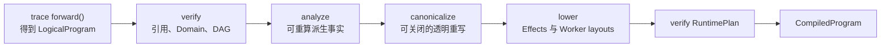

这条流水线在 [`compiler.py`](../rayorch/experimental/multigrain_v3_6/program/compiler.py) 中就是一个
固定入口，没有隐藏的 pass registry：

```python
verify_logical(logical)
analysis = analyze(logical)
canonical = _canonicalize(logical, analysis, enabled=optimize)
plan, explanation = _lower(logical, analysis, canonical, call_options)
verify_runtime_plan(logical, analysis, plan)
return CompiledProgram(logical, analysis, plan, explanation)
```

入口只负责编排；具体合同分别位于
[`verify.py`](../rayorch/experimental/multigrain_v3_6/program/verify.py) 和
[`lowering.py`](../rayorch/experimental/multigrain_v3_6/program/lowering.py)。下划线明确表示
canonicalization 与 lowering 是固定流水线的包内阶段，不是用户可组合的 Pass API。

Origin 的统一解析入口则是
[`semantics.describe_origin()`](../rayorch/experimental/multigrain_v3_6/program/semantics.py)。新增 primitive
若未在其封闭 `match` 中处理，会落入 `assert_never`，而不是被某个 compiler 阶段静默漏掉。

V3.6 不提供通用 PassManager。当前 canonicalization 只折叠透明 Broadcast 链，
`optimize=False` 是清晰的 correctness baseline。

编译后可以先看 explain，不必启动 Ray：

```python
compiled = WordPipeline().compile()
print(compiled.explain_text())
```

输出会逐 Port 显示 logical primitive、Domain 和 physical rule。排查“为什么这个 Port
没有 control/Effect”时，先看 explain，再读 runtime。

---

## 9. 三套动态状态机

### 9.1 Item：只从未知进入一个终态

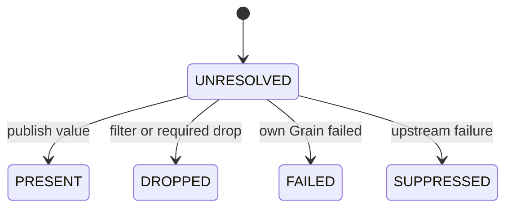

- `PRESENT`：存在 value binding；
- `DROPPED`：成员被正常过滤；
- `FAILED`：产生该 Item 的 Grain 自身失败；
- `SUPPRESSED`：上游失败使当前计算不应再运行。

终态不可互相覆盖；同终态重放只允许幂等验证。

### 9.2 Expansion：一次发布 cardinality

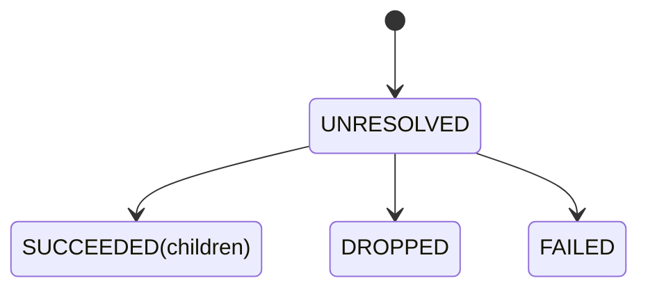

只有 `SUCCEEDED` 带有有序 children。运行时不会先创建半组 children，再补 Expansion
终态。

### 9.3 Grain：唯一物理调度生命周期

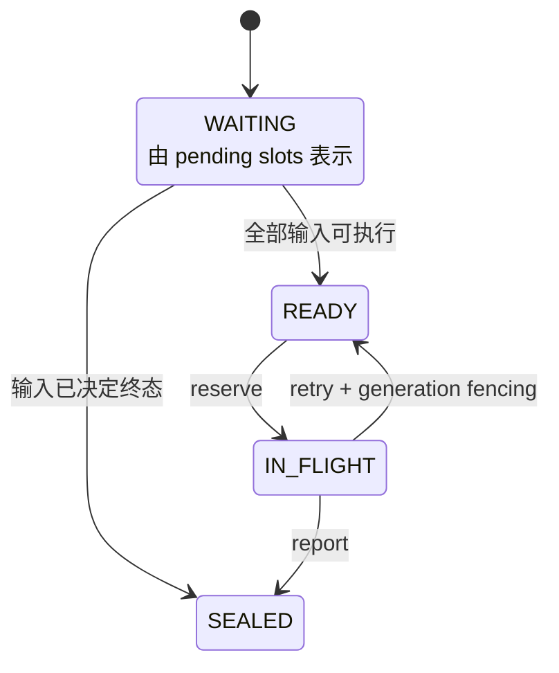

这些箭头不是文档中的约定俗成，而是
[`transitions.py`](../rayorch/experimental/multigrain_v3_6/runtime/transitions.py) 中可穷举测试的表：

```python
_GRAIN_TRANSITIONS = {
    (None, GrainEvent.INPUTS_READY): GrainPhase.READY,
    (None, GrainEvent.INPUTS_TERMINAL): GrainPhase.SEALED,
    (GrainPhase.READY, GrainEvent.RESERVE): GrainPhase.IN_FLIGHT,
    (GrainPhase.IN_FLIGHT, GrainEvent.RETRY): GrainPhase.READY,
    (GrainPhase.IN_FLIGHT, GrainEvent.REPORT): GrainPhase.SEALED,
}
```

这不是一组只供测试使用的样例，而是运行时真正调用的**完整迁移函数**。一行统一按下面的
格式阅读：

```text
(迁移前的 phase, 收到的 event): 迁移后的 phase
```

例如：

```python
(GrainPhase.READY, GrainEvent.RESERVE): GrainPhase.IN_FLIGHT
```

直译就是：一个 Grain 当前为 `READY`，调度器又对它发生了 `RESERVE` 事件，那么它接下来
必须是 `IN_FLIGHT`。所以括号内的两个量并不是“输入 Port 和输出 Port”：

- 括号内左边 `phase` 是事件发生前已经存在的状态；
- 括号内右边 `event` 是这次触发状态变化的事实；
- 冒号右边是唯一允许得到的新状态。

`phase` 回答“现在处在哪一步”，`event` 回答“刚刚发生了什么”。把二者分开后，同一个状态
可以根据不同事件得到不同结果：`IN_FLIGHT + RETRY` 回到 `READY`，而
`IN_FLIGHT + REPORT` 则进入 `SEALED`。

#### 为什么前两行以 `None` 开头

`None` 不是第四种 `GrainPhase`，它表示 `DispatchState` 中还没有这个 Grain 的执行记录。
此时各输入只是在 `RuntimeState.pending_grains` 中逐槽等待，因此图中的 `WAITING` 是一种
**结构表示**，不是被保存到 `GrainRecord.phase` 的枚举值。

输入事实足以让 Call 输入代数作出决定后，只可能有两类建档结果：

- `(None, INPUTS_READY) -> READY`：所有输入允许执行，创建 `GrainRecord` 并放入 ready
  queue；
- `(None, INPUTS_TERMINAL) -> SEALED`：输入已经足以判定 Call 不应执行，直接创建封闭
  记录，不进入 Worker。

第二种情况并不等于“Worker 执行失败”。例如 `ocr(page, metadata)` 的必需 `page` 已被
Filter 正常丢弃，OCR 根本无需运行，其输出可以直接是 `DROPPED`；如果上游 `page` 已
`FAILED`，OCR 同样无需运行，其输出会被传播为 `SUPPRESSED`。这两种情况都使用
`INPUTS_TERMINAL`，因为 Grain 的调度生命周期已经结束，但业务 outcome 仍由 Call 的输入
代数另行决定。

#### 五行分别对应什么运行场景

| 迁移 | 直观场景 | 是否调用 Worker |
|---|---|---:|
| `None + INPUTS_READY -> READY` | 输入齐全，产生一份可调度工作 | 尚未 |
| `None + INPUTS_TERMINAL -> SEALED` | 上游事实已经决定跳过这次计算 | 否 |
| `READY + RESERVE -> IN_FLIGHT` | Executor 从 ready queue 取走该 Grain | 即将/正在调用 |
| `IN_FLIGHT + RETRY -> READY` | 本轮执行未被接受，恢复策略允许重试 | 将再次调用 |
| `IN_FLIGHT + REPORT -> SEALED` | 结果完成预检并被接受，或最终失败被提交 | 已结束 |

这里的 `REPORT` 表示“本次执行形成了可提交的终局”，并不承诺业务一定成功：成功结果会发布
`PRESENT`，重试耗尽后的确定失败会发布 `FAILED`，但 Grain 本身都会进入 `SEALED`。
`SEALED` 没有任何出边，因此同一个 Grain 不会被再次 reserve、retry 或 report。

这张表只计算 `phase + event -> next_phase`，没有队列、Ray 或业务数据副作用。ready/recovery
入队、fencing generation 递增以及 `GrainRecord.phase` 的实际写入仍全部由
[`DispatchState`](../rayorch/experimental/multigrain_v3_6/runtime/dispatch.py) 负责。这样既保留
唯一写入权，也能单独检查状态代数是否完备。

#### “可穷举测试”具体测什么

对应的
[`test_transition_algebra.py`](../test/experimental/multigrain_v3_6/unit/test_transition_algebra.py)
不是只验证上面的五个 happy path，而是生成：

```text
{None, READY, IN_FLIGHT, SEALED} ×
{INPUTS_READY, INPUTS_TERMINAL, RESERVE, RETRY, REPORT}
```

得到全部 20 种 `(phase, event)` 组合。表中五种必须返回指定的新 phase，其余十五种必须
抛出 `InvalidTransition`。例如 `READY + REPORT`、`SEALED + RETRY` 和
`None + RESERVE` 都会立即失败。这样以后新增 phase 或 event 时，维护者必须显式决定新组合
是否合法，而不会因为遗漏一个 `if/else` 就静默放行。

Item/Expansion 也只允许首次 publication 或同终态幂等重放；冲突 publication 会直接抛出
`InvalidTransition`。Filter、Reduce 和 Call 的完整输入笛卡尔积也集中在同一文件。

Entity 没有成功/失败状态；它只有“尚不存在”和“已由 Expansion 创建”。这是第四类动态
事实，但不需要再发明一套 phase。

---

## 10. 跟踪一次真实执行

以 `WordPipeline` 的一条文本 `"hello ray"` 为例：

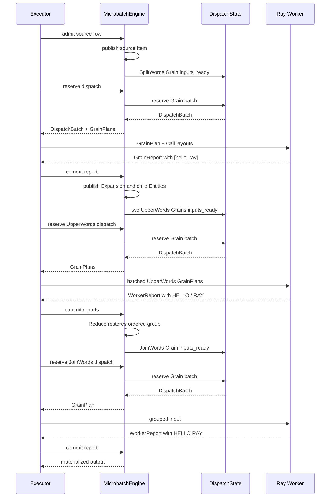

Worker 不知道 PortOrigin、Domain tree 或 lineage。它只接收编译好的物理 DTO，读取业务
值，执行批 UDF，再返回 report。

---

## 11. 组件之间具体传什么

宏观箭头只说明方向；下面这张图说明跨边界 DTO 和状态写入权：

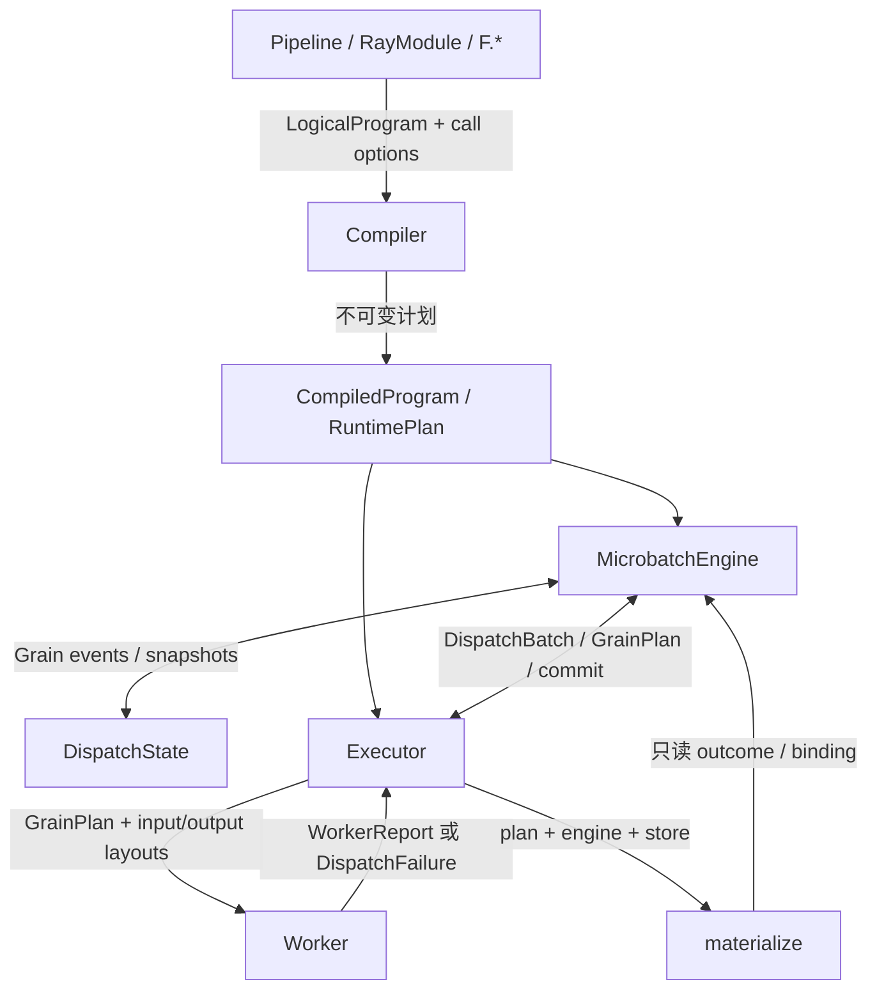

[`executor.py`](../rayorch/experimental/multigrain_v3_6/execution/executor.py) 的 dispatch 主路径只向
Engine 索取已验证的 batch/plan，再把它交给 actor；它不会自己读取 RuntimeState：

```python
batch = candidate.engine.reserve_dispatch(
    call,
    max_size=pool.batch_size,
    parent_bound=pool.batch_scope == "parent_bound",
)
grain_plans = tuple(
    candidate.engine.grain_plan(grain)
    for grain in batch.grains
)
layouts = self.plan.output_layouts_by_call[call]
result_ref = actor.handle.execute.remote(grain_plans, layouts)
```

跨 actor 的稳定 DTO 定义在
[`protocol.py`](../rayorch/experimental/multigrain_v3_6/protocol.py)：

```python
@dataclass(frozen=True, slots=True)
class GrainPlan:
    grain: GrainRef
    generation: int
    inputs: tuple[GrainInput, ...]


WorkerReport = GrainReport | GrainFailureReport
WorkerResult = tuple[WorkerReport, ...] | DispatchFailure
```

| 组件对 | 请求或数据 | 返回 | 谁修改状态 |
| --- | --- | --- | --- |
| API → Compiler | `LogicalProgram`、Call options | `CompiledProgram` | 都不修改 runtime |
| Engine → Dispatch | inputs ready/terminal、reserve、report/retry | `DispatchBatch`、snapshot | 只有 Dispatch 修改 Grain |
| Executor → Worker | `GrainPlan`、`CallInputLayout`、`CallOutputLayout` | `WorkerReport` / `DispatchFailure` | Worker 只改 actor 内 UDF 状态 |
| Executor → Engine | source admission、commit、recover | 新 runnable work 或完成状态 | 只有 Engine 修改语义表 |
| Materialize → Engine | output Item 的只读查询 | outcome/binding | 不修改状态 |

这套边界避免了两种常见飞线：Worker 反查 Program，以及 Executor 自己推导 Filter/Reduce
结果。

---

## 12. 谁拥有哪份状态

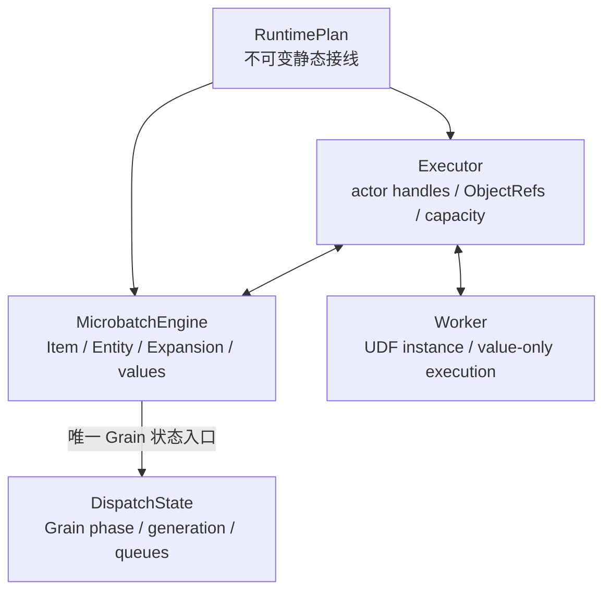

维护时用下面五条检查是否出现“飞线”：

1. compiler 不读取业务 payload；
2. runtime 不重新解释 `PortOrigin`；
3. MicrobatchEngine 不操作 actor handle；
4. Executor 不重新实现 Filter/Reduce 等语义；
5. Worker 不读取 LogicalProgram、RuntimePlan 或 RuntimeState。

索引可以有多张，但它们必须引用同一 Effect；不能复制一份可独立修改的第二规则。
这一点在 [`verify_runtime_plan()`](../rayorch/experimental/multigrain_v3_6/program/verify.py)
中甚至用对象 identity 验证，而不是只比较字段相等：

```python
def indexed_by_item(port: PortRef, effect: ItemEffect) -> bool:
    return any(
        indexed is effect
        for indexed in plan.item_effects_by_source.get(port, ())
    )
```

动态 Item/Expansion 也只能经过
[`MicrobatchEngine._publish_item/_publish_expansion`](../rayorch/experimental/multigrain_v3_6/runtime/engine.py)
写入 canonical table并进入 `_facts` 队列；Executor、Worker 和 materializer 都没有第二个
publication 入口。

这里的 publication 指“校验并登记一个正式生效的状态机事实，然后首次入队其 `Ref`”，
不是网络发布或 `ray.put()`。它比普通字典写入多承担了事实可见性、幂等和冲突拒绝三项
合同；数据结构、队列与完整控制流见
[`Engine 源码导读`](multigrain_v3_6_walkthrough/03_runtime_engine.md)。

---

## 13. 失败与恢复先看哪一层

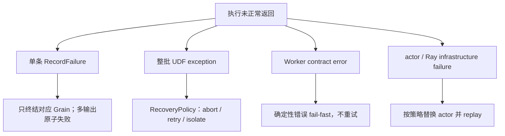

默认使用轻量 fail-fast。需要容灾时才把 `RecoveryPolicy` 放进某个 Call 的物理配置：

```python
from rayorch.experimental.multigrain_v3_6 import RecoveryPolicy

self.call = RayModule(MyUdf).ray_options(
    batch_size=16,
    recovery=RecoveryPolicy.isolate_tail(infra_retries=1),
)
```

纯决策在 [`recovery.py`](../rayorch/experimental/multigrain_v3_6/recovery.py)，动作执行仍通过
[`executor.py`](../rayorch/experimental/multigrain_v3_6/execution/executor.py) 回到 Engine：

```python
policy = self._pool(lease.actor.call).recovery
action = policy.decide_udf(
    completed_retries=lease.batch.udf_retries,
    grain_count=len(lease.batch.grains),
)
if action is RecoveryAction.ABORT:
    raise self._execution_error(engine, lease, failure)
self._counters[lease.actor.call].retries += engine.apply_udf_recovery(
    lease.batch,
    action,
    failure,
)
```

恢复策略只做纯决策；`DispatchState` 负责 queue/phase/generation，MicrobatchEngine 负责
最终 Item/Expansion 传播。不要在 Executor 中再写一套失败优先级。

---

## 14. RunResult 里有什么

`RunResult` 是已经冻结的结果快照，不持有 live Engine：

```mermaid
flowchart LR
    Result["RunResult"]
    Outputs["outputs<br/>保持 Pipeline output tree"]
    Calls["calls<br/>每个 Call 的 RPC / batch / retry"]
    Batches["microbatches<br/>Entity / Item / Grain 规模"]
    Peak["peak_active_microbatches"]

    Result --> Outputs
    Result --> Calls
    Result --> Batches
    Result --> Peak
```

定义位于 [`result.py`](../rayorch/experimental/multigrain_v3_6/execution/result.py)。它只保存 frozen
DTO，没有 `engine`、`RuntimeState` 或 actor handle 字段：

```python
@dataclass(frozen=True, slots=True)
class RunResult:
    outputs: object
    elapsed_s: float
    calls: tuple[CallMetrics, ...]
    microbatches: tuple[MicrobatchMetrics, ...]
    peak_active_microbatches: int
```

常用字段：

```python
print(result.outputs)
print(result.elapsed_s)
print(result.rpc_count, result.actor_count)

for call in result.calls:
    print(call.udf_name, call.rpcs, call.average_batch, call.retries)
```

`outputs` 中非 PRESENT 位置使用公开的 `ItemOutcome` 表达，而不是泄露内部 ItemRecord。

---

## 15. 按这个顺序读源码

```mermaid
flowchart LR
    API["1. api.py + functional.py<br/>用户怎样画图"]
    Model["2. model.py + program/logical.py<br/>身份与静态声明"]
    Semantics["3. program/semantics.py + analysis.py<br/>原语统一语义"]
    Compile["4. program/compiler + verify + lowering + plan"]
    Transition["5. runtime/transitions.py<br/>纯状态代数"]
    Runtime["6. runtime/state + dispatch + engine + materialize"]
    Boundary["7. protocol.py + execution/worker + executor"]

    API --> Model --> Semantics --> Compile --> Transition --> Runtime --> Boundary
```

每一站只带着一个问题：

1. [`api.py`](../rayorch/experimental/multigrain_v3_6/api.py) 与
   [`functional.py`](../rayorch/experimental/multigrain_v3_6/functional.py)：用户表达怎样变成
   Call/Port/Domain？
2. [`logical.py`](../rayorch/experimental/multigrain_v3_6/program/logical.py)：不可变图保存了哪些声明？
3. [`semantics.py`](../rayorch/experimental/multigrain_v3_6/program/semantics.py) 与
   [`analysis.py`](../rayorch/experimental/multigrain_v3_6/program/analysis.py)：每种 Origin 的输入、
   control 和派生依赖是什么？
4. [`compiler.py`](../rayorch/experimental/multigrain_v3_6/program/compiler.py)、
   [`verify.py`](../rayorch/experimental/multigrain_v3_6/program/verify.py)、
   [`lowering.py`](../rayorch/experimental/multigrain_v3_6/program/lowering.py) 与
   [`plan.py`](../rayorch/experimental/multigrain_v3_6/program/plan.py)：它如何被验证并变成
   RuntimePlan Effect 和 Worker layout？
5. [`transitions.py`](../rayorch/experimental/multigrain_v3_6/runtime/transitions.py)：所有输入组合如何
   归约成唯一动作？
6. [`runtime/state.py`](../rayorch/experimental/multigrain_v3_6/runtime/state.py)、
   [`runtime/dispatch.py`](../rayorch/experimental/multigrain_v3_6/runtime/dispatch.py) 与
   [`runtime/engine.py`](../rayorch/experimental/multigrain_v3_6/runtime/engine.py)：谁发布事实，
   谁修改 Grain queue？
7. [`protocol.py`](../rayorch/experimental/multigrain_v3_6/protocol.py)、
   [`worker.py`](../rayorch/experimental/multigrain_v3_6/execution/worker.py)、
   [`executor.py`](../rayorch/experimental/multigrain_v3_6/execution/executor.py) 与
   [`materialize.py`](../rayorch/experimental/multigrain_v3_6/runtime/materialize.py)：业务值如何跨 Ray
   边界，而语义不跨过去？

不要从 `executor.py` 开始倒推全部语义；它刻意看不到大部分逻辑概念。

---

## 16. 修改功能时的落点

### 新增结构 primitive

```mermaid
flowchart LR
    Origin["logical.py<br/>新增 Origin"]
    Meaning["semantics.py<br/>穷尽声明语义"]
    Verify["verify.py + lowering.py<br/>验证与 lower"]
    Effect["plan.py<br/>不可变 Effect"]
    Algebra["transitions.py<br/>纯状态组合"]
    Engine["engine.py<br/>应用 Effect"]
    Tests["compiler + 笛卡尔积 + runtime tests"]

    Origin --> Meaning --> Verify --> Effect --> Algebra --> Engine --> Tests
```

任何一步没有明确语义，都不应先在 engine 中补一个临时 `if`。

### 新增 UDF 物理配置

配置应走：`RayModule.ray_options → compiler lowering → ActorPoolSpec → Executor`。
如果它不影响逻辑依赖，不要把它塞进 LogicalProgram。

### 调整失败策略

先改 `recovery.py` 的纯决策，再让 `DispatchState` 执行动作。不要让 Worker 或 Executor
直接修改 Item outcome。

---

## 17. 最常见的误解

| 误解 | 正确理解 |
| --- | --- |
| `forward()` 在处理真实数据 | 它只追踪符号 Port |
| Port 就是一列 Python 值 | Port 是静态位置；值在 Block/RowBinding 中 |
| Expand 是一个 map actor | Expand 只创建 child Entity 与结构关系 |
| Reduce 会执行 sum/join | Reduce 只恢复有序 group |
| Filter 会删除 Entity | Entity 保留；目标 Item 变为 DROPPED |
| RuntimePlan 是第二份 LogicalProgram | 它只保存 runtime 所需的 Effect 接线 |
| Engine 应该处理 Ray crash | Engine 处理语义；Executor/Dispatch 处理物理恢复 |
| batch size 越小越安全且不影响性能 | admission window 过小会破坏 batch 形成能力 |

---

## 18. 开发者的最短验证路径

只改编译期或状态代数时，先跑 Ray-free 测试：

```bash
pytest -q test/experimental/multigrain_v3_6/unit
```

改 Executor、Worker ABI、恢复或生命周期时，再跑真实 Ray：

```bash
RAY_ENABLE_UV_RUN_RUNTIME_ENV=0 \
pytest -q test/experimental/multigrain_v3_6/integration
```

最后检查类型和空白：

```bash
pyright rayorch/experimental/multigrain_v3_6
git diff --check
```

真实性能结论不要从单元测试推断。当前 MinerU、Docling 和视频 paired gate 的配置与结果见
[`2026-08-08_release_regression.md`](experiments/multigrain_v3_6/2026-08-08_release_regression.md)。

---

## 19. 一页总结

```mermaid
flowchart TB
    Author["Pipeline + RayModule + F.*"]
    Static["LogicalProgram<br/>CallRef / PortRef / DomainRef"]
    Plan["ProgramAnalysis → RuntimePlan"]
    Semantic["MicrobatchEngine<br/>Entity / Item / Expansion facts"]
    Physical["DispatchState<br/>Grain lifecycle"]
    Executor["Executor<br/>actor / RPC / capacity"]
    Worker["Worker<br/>value-only UDF"]
    Result["RunResult"]

    Author --> Static --> Plan
    Plan --> Semantic
    Plan --> Executor
    Semantic --> Physical
    Semantic <--> Executor
    Executor <--> Worker
    Executor --> Result
```

记住这条主线就够了：用户声明静态图；编译器把关系变成 Effect；Engine 维护语义事实；
DispatchState 管 Grain；Executor 和 Worker 只负责把可执行 Grain 送进 Ray。每份状态只有
一个 owner，因此新增功能应沿现有语义路径落地，而不是跨层拉一根捷径。
