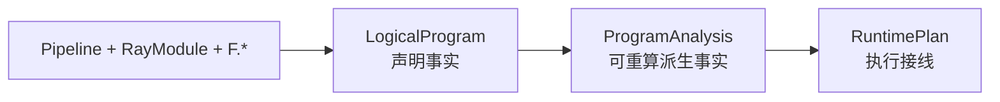
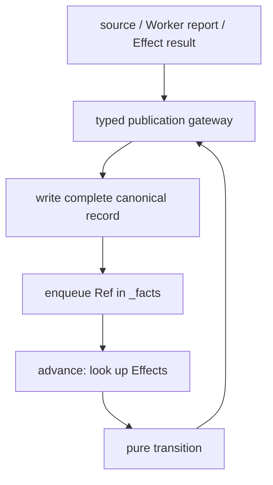
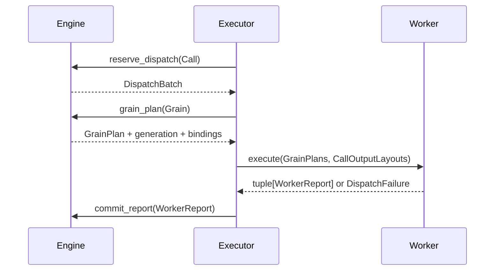
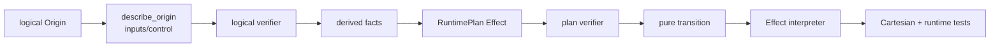

# MultiGrain V3.6 架构与维护手册

> **文档生态位：跨组件合同与修改纪律。** 本文假设读者已经完成
> [`从零上手`](multigrain_v3_6_getting_started.md)，不再重新教授第一个 Pipeline 或逐个解释
> 七种 Ref。它回答：每份静态/动态状态归谁所有，组件之间只能传什么，新增功能应修改哪条
> 固定路径，以及怎样证明没有引入飞线。

若尚未确定该读本文还是规范、源码导读或实验报告，先看
[`V3.6 文档地图`](multigrain_v3_6_documentation_map.md)。

需要逐段理解某个长文件时，转到
[`复杂源码导读`](multigrain_v3_6_walkthrough/README.md)；需要最短、规范性的设计结论时，查看
[`状态机设计合同`](multigrain_v3_6_design.md) 和
[`命名宪法`](multigrain_v3_6_naming.md)。

---

## 1. 文档分层

| 文档 | 目标读者 | 解决的问题 | 不承担什么 |
| --- | --- | --- | --- |
| [`从零上手`](multigrain_v3_6_getting_started.md) | 初次使用和初次读源码的人 | 怎样写、概念是什么、一次执行如何发生 | 不逐段解释长文件 |
| 本维护手册 | 要修改框架的人 | owner、协议、依赖、修改与验证路径 | 不重复完整 API 教程 |
| [`复杂源码导读`](multigrain_v3_6_walkthrough/README.md) | 正在打开具体 `.py` 的人 | 数据结构、队列、状态转移和逐段控制流 | 不定义新的架构真相 |
| [`设计合同`](multigrain_v3_6_design.md) | review/发版 | 哪些语义与纪律不可破坏 | 不展开实现细节 |
| [`编译边界`](multigrain_v3_6.md) | compiler 维护者 | 为什么需要固定编译流水线 | 不讲 Ray event loop |
| [`命名宪法`](multigrain_v3_6_naming.md) | API/数据结构设计者 | 同一概念应使用什么词 | 不描述执行顺序 |

如果不同文档的解释发生冲突，优先级是：源码与测试合同 → design/naming 合同 → 维护手册 →
入门教程和逐段导读。逐段导读中的行号只是当前源码导航，不是 API 稳定承诺。

---

## 2. 维护者必须守住的八条不变量

1. **Call 只表示计算。** 只有 RayModule Call 创建 Grain、actor 和 RPC。
2. **F.* 只表示结构。** Expand/Filter/Reduce/Broadcast 不创建隐藏 Worker。
3. **LogicalProgram 只保存声明事实。** reverse indexes、control closure 和 pool 不回填进去。
4. **RuntimePlan 是 runtime 的完整静态接线。** Engine 不回读 PortOrigin 或 compiler internals。
5. **canonical fact 先完整发布，再传播。** FIFO 只携带 Ref，不复制 outcome/value/children。
6. **每份可变状态只有一个 owner。** 尤其 Grain phase/generation 只由 DispatchState 修改。
7. **纯函数做分类，owner 执行动作。** transition/recovery policy 不写表或 queue。
8. **Worker 是 value-only ABI。** 不接收 Program、RuntimeState、Domain lineage 或调度策略。

这八条比“目录必须绝对单向”更重要。若为了严格依赖图引入无意义 adapter，会增加理解成本；
但任何反向读取可变状态或复制语义决策都必须拒绝。

---

## 3. 静态世界：三层数据结构



### 3.1 LogicalProgram

唯一保存：

- `CallRef → CallSpec`；
- `PortRef → PortSpec(domain, origin)`；
- `DomainRef → DomainSpec(parent)`；
- ordered source Ports；
- public output tuple tree。

它回答“用户声明了什么”，不保存 consumers、control demand、actor pool、Effect 或动态 Entity。

### 3.2 ProgramAnalysis

由 LogicalProgram 一次计算且可以丢弃重算：

- `semantics_by_port`；
- `consumers_by_port`；
- `outputs_by_call`；
- `expansion_sources_by_domain`；
- control-demand fixed point；
- group depth。

Analysis 不是第二份用户声明；任何字段都必须能从 LogicalProgram 和统一
`describe_origin()` 重新得到。

### 3.3 RuntimePlan

只保存 runtime 真正需要的静态合同：

- Port→Domain 与 Call outputs；
- canonical structural Effects；
- source/domain→Effect trigger indexes；
- input/output Worker layouts；
- Call→ActorPoolSpec；
- public output tree。

触发索引引用 canonical catalog 中同一个 Effect object，不复制相等规则。RuntimePlan 不保存
PortOrigin，因此 Engine 无法偷偷成为第二个 compiler。

### 3.4 固定 compiler pipeline

```text
verify LogicalProgram
→ analyze
→ optional transparent canonicalization
→ lower RuntimePlan + explanation
→ verify RuntimePlan
```

`optimize=False` 只关闭 rewrite，仍走相同 verifier、analysis 和 lowering。新增编译阶段必须有
清晰全局合同；当前不是可任意重排的 PassManager。

详细源码见[编译流水线导读](multigrain_v3_6_walkthrough/02_compiler_pipeline.md)。

---

## 4. 动态世界：owner、表与等待结构

### 4.1 语义事实 owner

`MicrobatchEngine` 独占：

| 状态 | key | record/value |
| --- | --- | --- |
| Entity 枚举 | DomainRef | ordered EntityRef set/index |
| child lineage | EntityRef | parent EntityRef + ordinal |
| ItemTable | ItemRef | terminal outcome + cause + control |
| ValueTable | ItemRef | RowBinding 或 GroupBinding |
| ExpansionTable | ExpansionRef | outcome + ordered children + cause |
| pending Call inputs | GrainRef | dense ItemRef slots |
| semantic notifications | — | `_facts` identity-only FIFO |

### 4.2 Grain 物理状态 owner

`DispatchState` 独占：

| 状态 | 数据结构 | 含义 |
| --- | --- | --- |
| Grain records | `dict[GrainRef, GrainRecord]` | phase、generation、infra failures |
| normal work | `deque[_ReadyEntry]` | 首次 READY Grain，可按 batch size 聚合 |
| immediate recovery | `deque[DispatchBatch]` | 优先重试 exact group |
| tail recovery | `deque[DispatchBatch]` | 延后重试或二分隔离 group |

### 4.3 物理执行 owner

`Executor` 独占：

| 状态 | 含义 |
| --- | --- |
| Call→actor slots | actor handle 与 busy capacity |
| active microbatches | admission index→唯一 Engine |
| pending RPCs | ObjectRef→generation-fenced dispatch lease |
| run-local counters | RPC、Grain、retry、batch sizes |
| Ray ownership | close 时是否 shutdown runtime |

### 4.4 不要把所有等待结构都叫 queue

```text
_facts             = 已成立、待传播的语义 Ref FIFO
pending_grains     = 尚未决定的 Call input slots dict
normal/immediate/
tail               = READY Grain 物理选择 queues
Executor.pending   = 已提交、待返回的 RPC lease map
```

它们的元素、owner 和终止条件都不同。合并只会把语义传播、输入 barrier、调度优先级和 Ray
transport 混为一谈。

---

## 5. 四类动态事实与状态转移

| 对象 | 身份 | 状态路径 | 谁写 |
| --- | --- | --- | --- |
| Entity | Domain × occurrence | absent → published | Engine `_publish_entity` |
| Item | Port × Entity | unresolved → PRESENT/DROPPED/FAILED/SUPPRESSED | Engine `_publish_item` |
| Expansion | child Domain × parent Entity | unresolved → SUCCEEDED/DROPPED/FAILED | Engine `_publish_expansion` |
| Grain | Call × Entity | WAITING → READY/SEALED；READY→IN_FLIGHT；IN_FLIGHT→READY/SEALED | DispatchState |

Entity、Item、Expansion 首次 publication 会把其 Ref 加入 `_facts`。Grain phase 不进入语义 FIFO，
而是进入 Dispatch queues。

### 5.1 publication 与 fixed point



publication 不是 Ray 发送；它是事实从 unresolved 跨过可见性边界。`advance()` 只消费已经完整
写表的 Ref，直到不再产生新事实。

### 5.2 为什么不直接递归调用下游

- 避免 commit 内部重入和半成品可见；
- 深图不依赖 Python 递归栈；
- Item/Expansion/Entity 从一个封闭入口穷尽分派；
- 到达顺序可以通过 fixed-point tests 验证。

详细数据结构和控制流见[Engine 导读](multigrain_v3_6_walkthrough/03_runtime_engine.md)。

---

## 6. Call input、F.* 与身份规则

### 6.1 Call input 对 Entity 对称

同一个 Call 的所有 inputs 必须位于 execution Domain。参数位置只描述 Worker ABI slot，不决定
Grain identity：

```text
GrainRef = CallRef × EntityRef
```

输入代数优先级：

```text
FAILED/SUPPRESSED exists → suppress outputs
otherwise unresolved    → wait
otherwise REQUIRED drop → drop outputs
otherwise               → READY
```

因此没有 `driven_by`。Optional+DROPPED 在 Worker 中还原为 `MISSING`；Required+DROPPED 使 Grain
无需 Worker 直接 SEALED。

### 6.2 F.* 的结构合同

| primitive | Domain 变化 | 动态依赖 | payload 行为 |
| --- | --- | --- | --- |
| Filter | 不变 | source + bool mask | PRESENT 时 alias source binding |
| Expand | parent→child | successful Call report | 报告 rows 后创建 child Entities |
| Reduce | child→parent 一层 | Expansion + members + values | 建 GroupBinding，不执行聚合 UDF |
| Broadcast | ancestor→descendant | source Item + target Entity | alias ancestor binding/outcome |

新增结构 primitive 必须同时回答 logical inputs、control demand/transfer、Domain 合同、Runtime Effect、
动态 transition 与所有触发事件。

---

## 7. 跨组件只能传稳定 DTO



### 7.1 Engine→Worker

`GrainPlan.inputs` 只有：

- `RowBinding`；
- `GroupInput(flat bindings + CSR offsets)`；
- `MissingInput`。

Worker 不接收 ItemRecord、RuntimeState 或 Domain lineage。

### 7.2 Worker→Engine

Worker result 只有：

- `GrainReport`：一个 Grain 的完整多输出成功报告；
- `GrainFailureReport`：确定到一个 Grain 的记录失败；
- `DispatchFailure`：尚不能形成逐 Grain reports 的 UDF/contract failure。

Engine 必须再次验证 generation、Port 集合、scalar/expanded shape、control demand 与 aligned
cardinality。内部 Worker 不是跳过 commit boundary 的理由。

### 7.3 payload 与 control

业务值通过 `BlockRef + RowBinding` 粗粒度存放。control manifest 是编译器 demand 的独立 bool
投影，使 Engine 无需解引用 payload 就能执行 Filter。只有 Worker/BlockStore 和 final materializer
读取业务值。

详细 ABI 见[Worker 导读](multigrain_v3_6_walkthrough/05_worker_abi.md)。

---

## 8. Worker report 的 mutation frontier

成功 report 分三阶段：

1. 校验所有 output、expanded rows 与 control，构造 immutable commit intents；
2. 验证 aligned Expansion 的 cardinality 和完整 reporter set；
3. seal Grain，再按 Expansion→Entity→Item 依赖顺序 publication，最后 `advance()`。

mutation frontier 前不能写 canonical tables；frontier 后不能再执行用户代码或解析未验证结构。
多输出 Call 的单个 Grain 必须原子成功或失败，不能出现一半 Ports PRESENT、一半 FAILED。

---

## 9. Failure 分类与恢复

| failure | 发生位置 | 表达 | 策略 |
| --- | --- | --- | --- |
| record failure | UDF 返回某行 `RecordFailure` | `GrainFailureReport` | 该 Grain FAILED |
| contract error | Worker ABI 不匹配 | `DispatchFailure(CONTRACT_ERROR)` | fail-fast |
| opaque UDF throw | 一次 batch call 抛错 | `DispatchFailure(UDF_ERROR)` | retry/split/abort policy |
| infrastructure failure | Ray get/actor/transport | driver exception | replace actor + independent retry budget |

分层职责：

```text
RecoveryPolicy  -> immutable facts 到 RecoveryAction
DispatchState   -> phase/generation/queue 动作
Engine          -> 最终 FAILED Item/Expansion publication
Executor        -> actor replacement 与 ExecutionError context
```

UDF retry 保留 GrainRef，增加 generation。旧 attempt 报告即使迟到，也会被 fencing 拒绝。详细见
[Dispatch 导读](multigrain_v3_6_walkthrough/04_dispatch_state.md) 和
[Executor 导读](multigrain_v3_6_walkthrough/06_executor_event_loop.md)。

---

## 10. 生命周期、materialize 与资源释放

一个 microbatch 只有同时满足以下条件才完成：

- source admission closed；
- `_facts` 和 pending Call slots 为空；
- Dispatch runnable/recovery queues 为空；
- 所有 Grain SEALED；
- public output Port × Entity 全部终态；
- Executor 没有该 microbatch 的 pending RPC lease。

完成顺序：

```text
materialize public output tree
→ clear dereference cache
→ Engine.release_values()
→ freeze MicrobatchMetrics
→ release active admission credit
```

`Executor.close()` kill 自己的 actors；只有它主动初始化 Ray 时才 shutdown runtime。推荐始终用
context manager。

---

## 11. 新功能应沿哪条路径修改

### 11.1 新结构 primitive



任何一步答不清，不能先在 Engine 补临时 `if`。

### 11.2 新 RayModule 物理配置

```text
RayModule.ray_options
→ compiler _compile_pool_spec
→ ActorPoolSpec
→ Executor
```

不影响逻辑依赖的配置不得进入 LogicalProgram 或 Engine。

### 11.3 新 Worker ABI 字段

按顺序修改：

```text
protocol DTO
→ compiler layout
→ Engine GrainPlan/report preflight
→ Worker normalization
→ Ray-free contract tests
→ real-Ray integration
```

Worker 和 Engine 不允许通过共享私有 dict 绕开 DTO。

### 11.4 新恢复策略

先在 `RecoveryPolicy` 增加纯决策和穷举 tests，再让 DispatchState 执行新 `RecoveryAction`。只有
确实需要新的物理状态时才扩 GrainRecord；不要把 actor handle 塞进去。

### 11.5 新 compiler rewrite

必须：

- 证明 primitive 在 outcome、identity、control、Grain/actor 行为上透明；
- 记录 `CanonicalRewrite`；
- 保留 LogicalProgram；
- optimized/unoptimized 通过完整语义等价回归。

---

## 12. 明确禁止的飞线

- Executor 直接修改 Item/Expansion/Entity/Grain tables；
- Engine 读取 PortOrigin、Pipeline 或 actor handle；
- Worker 读取 RuntimePlan、Domain lineage 或 recovery policy；
- F.* 创建隐藏 RayModule/actor；
- trigger queue 携带 outcome/value，成为 canonical record 副本；
- 同一个 structural target 在多个索引中保存独立 Effect clones；
- 用某个默认/第一个输入决定 Grain identity；
- compiler optimization 删除有业务失败、成员或 actor 语义的节点；
- 通用框架按 OCR/Table 等 workload 名字探测特殊字段。

最后一条当前仍有一处 P2 残留；源码证据、bad case 和候选收口统一记录在
[`V3.6 架构审计待确认项`](todos/22-v36-architecture-audit-findings.md)，不在维护合同中提前
宣布修复方案。

---

## 13. 验证路径

### 13.1 Ray-free

```bash
pytest -q test/experimental/multigrain_v3_6/unit
```

重点门禁：

- package dependency AST test；
- compiler logical/plan completeness；
- transition Cartesian products；
- nested Expand/Reduce、control closure、recovery/fencing；
- optimized/unoptimized semantic parity。

### 13.2 Real Ray

```bash
RAY_ENABLE_UV_RUN_RUNTIME_ENV=0 \
pytest -q test/experimental/multigrain_v3_6/integration
```

修改 actor lifecycle、RPC、BlockStore、Worker ABI、recovery 或 close ownership 时必须运行。

### 13.3 静态检查

```bash
pyright rayorch/experimental/multigrain_v3_6
python -m compileall -q rayorch/experimental/multigrain_v3_6
git diff --check
```

### 13.4 性能

单元测试不能证明性能。真实 workload 结论使用 paired runs、相同模型/cache/硬件和均值方差；
当前发布回归记录见
[`2026-08-08_release_regression.md`](experiments/multigrain_v3_6/2026-08-08_release_regression.md)。

---

## 14. 故障定位

| 症状 | 第一检查点 | 然后读 |
| --- | --- | --- |
| compile Domain mismatch | API 中 Port Domain 是否显式对齐 | authoring + compiler walkthrough |
| chained Filter control 缺失 | `describe_origin` control predecessor 与 analysis fixed point | compiler walkthrough |
| Engine deadlock | `_facts/pending_grains/Dispatch queues/public outputs` summary | Engine walkthrough |
| stale report | Grain generation 与 lease group | Dispatch walkthrough |
| Worker output arity/shape | CallInput/OutputLayout 与 column-major return | Worker walkthrough |
| UDF 与 infra failure 混淆 | `DispatchFailureKind` 或 ray.get exception | Executor walkthrough |
| materialize 后仍持有大对象 | ValueTable release 与 BlockStore cache | Engine/Executor walkthrough |
| optimized only mismatch | explanation rewrites 与 unoptimized baseline | compiler walkthrough |

不要从最终 `ExecutionError` 文本反向猜全部语义；先按 failure 层级定位 owner，再查看其 canonical
状态或 immutable snapshot。

---

## 15. 源码逐段导读入口

推荐按数据结构变换顺序，而不是从 Executor 倒推：

1. [`api.py：符号建图`](multigrain_v3_6_walkthrough/01_authoring_api.md)
2. [`compiler：LogicalProgram→RuntimePlan`](multigrain_v3_6_walkthrough/02_compiler_pipeline.md)
3. [`engine.py：语义表、Fact FIFO 与 publication`](multigrain_v3_6_walkthrough/03_runtime_engine.md)
4. [`dispatch.py：Grain records 与三个 queues`](multigrain_v3_6_walkthrough/04_dispatch_state.md)
5. [`worker.py：binding/value/report ABI`](multigrain_v3_6_walkthrough/05_worker_abi.md)
6. [`executor.py：actor slots、pending leases 与 event loop`](multigrain_v3_6_walkthrough/06_executor_event_loop.md)
7. [`V3→V3.6 架构审计`](multigrain_v3_6_walkthrough/07_v3_vs_v36_readability.md)

上述第 7 篇只做 V3/V3.6 架构比较。当前待 QA 的实现与发布问题见
[`架构审计待确认项`](todos/22-v36-architecture-audit-findings.md)。

维护时最短复述：LogicalProgram 保存声明；compiler 生成完整 RuntimePlan；Engine 只发布语义事实；
DispatchState 只管 Grain；Worker 只运行 values；Executor 只管 Ray。新增功能必须沿这条既有路径
进入，而不是在两个 owner 之间拉一根快捷线。
