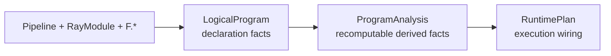
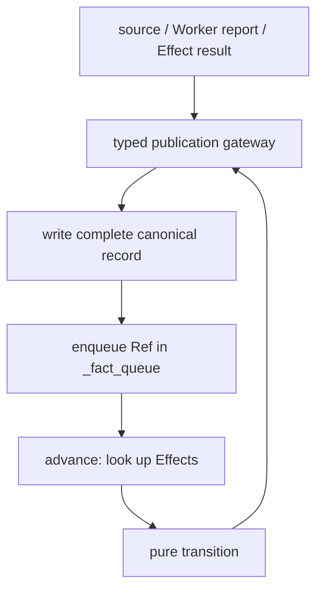
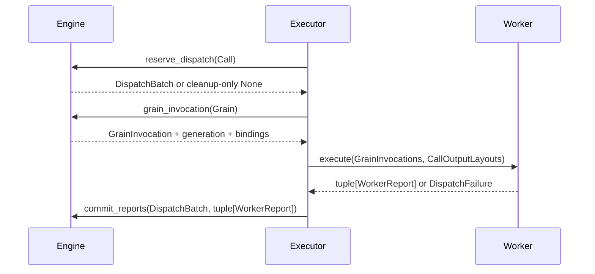
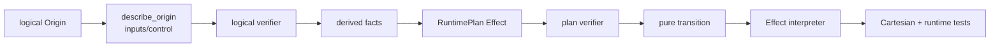

# MultiGrain v3.6 maintainer guide

This guide states ownership and change discipline. The Chinese version remains
at [`multigrain_v3_6_maintainer_guide.zh.md`](multigrain_v3_6_maintainer_guide.zh.md).

## At a glance

### 1. Ownership table

| Area | Owner | Safe inputs | Must not do |
| --- | --- | --- | --- |
| Authoring | `api.py`, `functional.py` | user declarations and symbolic ports | instantiate Ray actors or evaluate payloads |
| Logical model | `program/logical.py` | immutable calls, ports, domains, origins | store reverse indexes or runtime state |
| Analysis | `program/analysis.py` | logical program | read actors, queues, or business values |
| Lowering | `program/lowering.py` | verified analysis | infer new semantics not in `semantics.py` |
| Static verification | `program/verify.py` | logical program or runtime plan | mutate the plan |
| Runtime semantics | `runtime/engine.py` | compiled effects and canonical facts | read `PortOrigin` or call Ray |
| Physical dispatch | `runtime/dispatch.py` | grain coordinates and generations | publish items or infer lineage |
| Ray transport | `execution/executor.py` | engine API and immutable plan | interpret `F.*` or business outcomes |
| Worker ABI | `execution/worker.py`, `protocol.py` | value-only layouts and DTOs | retain engine references or choose retry policy |
| Recovery algebra | `recovery.py` | immutable attempt facts | own attempts, queues, or actors |
| Output | `runtime/materialize.py`, `execution/result.py` | sealed read-only facts | mutate semantic state |

There is one semantic writer per engine. New state should be added to the
owner's table and publication path, not introduced as an observer-side cache.

### 2. Adding a primitive

Use this order:

1. define its immutable origin in `program/logical.py`;
2. add its exhaustive semantics entry in `program/semantics.py`;
3. extend analysis and lowering with the same named contract;
4. add verifier checks for malformed ancestry and alignment;
5. add runtime effect application and transition tests;
6. add one integration test proving worker and materialization behavior;
7. update the English design and getting-started documents, then synchronize
   the `.zh.md` translation.

Do not add an ad-hoc `if` in `runtime/engine.py` for a structural operation.
The primitive must lower to an immutable effect and enter the existing fact
publication path.

### 3. Failure and retry changes

Keep two axes separate:

- explicit data outcomes (`RecordFailure` and `GroupFailure`) are returned by a
  UDF and committed as semantic facts;
- opaque UDF or infrastructure exceptions are reduced by `RecoveryPolicy` and
  may cause retry, replacement, split, or abort.

`GroupFailure` may suppress only uncommitted siblings sharing the same call and
direct parent. It must never roll back a committed result, revoke an already
submitted RPC, or suppress a different parent. The dequeue barrier check and commit
fence are the two required sites; adding a separate manager or pending RPC subsystem
would duplicate state ownership.

### 4. Dispatch and lifecycle rules

Every reservation carries a generation. A report is accepted only when the
grain is still in flight and the generation matches. On any dispatch failure,
the executor must release its reservation in a `finally` path before retrying,
replacing an actor, or aborting the run. This prevents a permanently busy actor.

Ready queues are physical indexes, not semantic truth. The engine remains the
source of truth for whether a grain is eligible; queue entries are rechecked at
dequeue and stale entries are discarded.

### 5. Testing checklist

Run the Ray-free suite first:

```bash
pytest test/experimental/multigrain_v3_6/unit
```

Then run integration and benchmark gates:

```bash
pytest test/experimental/multigrain_v3_6/integration
pytest test/experimental/multigrain_v3_6/benchmark
```

Changes touching compiler or runtime semantics should cover optimized and
unoptimized plans, nested/empty domains, repeated reports, stale generations,
multi-output atomicity, healthy siblings beside a `GroupFailure`, and a late
in-flight report after a barrier. Workload numbers belong in an experiment
report and must identify the exact source snapshot and options.

### 6. Documentation discipline

English unqualified Markdown files are the public/reviewer surface. Chinese
translations use `.zh.md` in the same directory. Keep links in English files
pointing to English files; Chinese files may link to either language when
cross-referencing is useful. Do not copy a new design decision into multiple
documents without assigning one normative owner.

---

> **Document niche: cross-component contracts and change discipline.** This
> document assumes the reader has already completed
> [`Getting started from zero`](multigrain_v3_6_getting_started.md); it does not
> re-teach the first Pipeline or explain the seven Refs one by one. It answers: who
> owns each piece of static/dynamic state, what may be passed between components,
> which fixed path a new feature should modify, and how to prove that no flywire
> (a cross-layer shortcut wire) was introduced.

If you are not sure whether to read this document, the constitution, the source
walkthrough, or the experiment report, start with the
[`V3.6 documentation map`](multigrain_v3_6_documentation_map.md).

When you need to understand a long file paragraph by paragraph, go to the
[`complex source walkthrough`](multigrain_v3_6_walkthrough/README.md); when you
need the shortest normative design conclusions, see the
[`state-machine design contract`](multigrain_v3_6_design.md) and the
[`naming constitution`](multigrain_v3_6_naming.md).

---

## 1. Documentation layering

| Document | Target reader | Problem solved | What it does not carry |
| --- | --- | --- | --- |
| [`Getting started from zero`](multigrain_v3_6_getting_started.md) | first-time users and first-time source readers | how to write, what the concepts are, how one execution happens | does not explain long files paragraph by paragraph |
| this maintainer guide | people who will modify the framework | owners, protocols, dependencies, modification and verification paths | does not repeat the complete API tutorial |
| [`Complex source walkthrough`](multigrain_v3_6_walkthrough/README.md) | people opening a specific `.py` | data structures, queues, state transitions, and paragraph-level control flow | does not define new architectural truth |
| [`Design contract`](multigrain_v3_6_design.md) | review/release | which semantics and disciplines must not be broken | does not expand implementation details |
| [`Compilation boundary`](multigrain_v3_6_compiler_boundary.md) | compiler maintainers | why a fixed compilation pipeline is needed | does not talk about the Ray event loop |
| [`Naming constitution`](multigrain_v3_6_naming.md) | API/data-structure designers | which word to use for the same concept | does not describe execution order |

If explanations in different documents conflict, the priority is: source and test
contracts → design/naming contracts → maintainer guide → getting-started tutorial
and paragraph-level walkthrough. Line numbers in the paragraph-level walkthrough
are only current source navigation, not an API stability promise.

---

## 2. Eight invariants that maintainers must uphold

1. **Call only means computation.** Only a RayModule Call creates Grains, actors,
   and RPCs.
2. **F.\* only means structure.** Expand/Filter/Reduce/Broadcast do not create
   hidden Workers.
3. **LogicalProgram only stores declaration facts.** Reverse indexes, control
   closure, and pools are not back-filled into it.
4. **RuntimePlan is the complete static wiring of the runtime.** The Engine does
   not read back PortOrigin or compiler internals.
5. **A canonical fact is fully published first, then propagated.** The FIFO carries
   only Refs, not copies of outcome/value/children.
6. **Every piece of mutable state has exactly one owner.** In particular, Grain
   phase/generation is modified only by DispatchState.
7. **Pure functions classify; the owner performs the action.** transition/recovery
   policy MUST NOT write tables or queues.
8. **Worker is a value-only ABI.** It does not receive Program, RuntimeState,
   Domain lineage, or scheduling policy.

These eight matter more than "directories must be absolutely unidirectional".
Introducing meaningless adapters just to obtain a strict dependency graph
increases comprehension cost; but any reverse read of mutable state or any
duplicated semantic decision MUST be rejected.

---

## 3. Static world: three layers of data structures



### 3.1 LogicalProgram

It stores only:

- `CallRef → CallSpec`;
- `PortRef → PortSpec(domain, origin)`;
- `DomainRef → DomainSpec(parent)`;
- ordered source Ports;
- the public output tuple tree.

It answers "what did the user declare", and does not store consumers, control
demand, actor pool, Effect, or dynamic Entities.

### 3.2 ProgramAnalysis

Computed once from LogicalProgram and discardable/recomputable:

- `semantics_by_port`;
- `consumers_by_port`;
- `outputs_by_call`;
- `expansion_sources_by_domain`;
- control-demand fixed point;
- group depth.

Analysis is not a second copy of the user declaration; every field MUST be
re-derivable from LogicalProgram and the unified `describe_origin()`.

### 3.3 RuntimePlan

It stores only the static contracts the runtime actually needs:

- Port→Domain and Call outputs;
- canonical structural Effects;
- source/domain→Effect trigger indexes;
- input/output Worker layouts;
- Call→ActorPoolSpec;
- public output tree.

Trigger indexes reference the same Effect object in the canonical catalog instead
of duplicating equality rules. RuntimePlan does not store PortOrigin, so the Engine
cannot secretly become a second compiler.

### 3.4 Fixed compiler pipeline

```text
verify LogicalProgram
→ analyze
→ optional transparent canonicalization
→ lower RuntimePlan + explanation
→ verify RuntimePlan
```

`optimize=False` only turns off rewrite; it still runs the same verifier, analysis,
and lowering. A new compilation stage MUST have a clear global contract; this is
currently not a freely re-orderable PassManager.

For source details see the
[compilation pipeline walkthrough](multigrain_v3_6_walkthrough/02_compiler_pipeline.md).

---

## 4. Dynamic world: owners, tables, and waiting structures

### 4.1 Semantic fact owner

`MicrobatchEngine` exclusively owns:

| State | key | record/value |
| --- | --- | --- |
| Entity enumeration | DomainRef | ordered EntityRef set/index |
| child lineage | EntityRef | parent EntityRef + ordinal |
| ItemTable | ItemRef | terminal outcome + cause + control |
| ValueTable | ItemRef | RowBinding or NestedGroupBinding |
| ExpansionTable | ExpansionRef | outcome + ordered children + cause |
| pending Call inputs | GrainRef | dense ItemRef slots |
| semantic notifications | — | `_fact_queue` identity-only FIFO |

### 4.2 Grain physical state owner

`DispatchState` exclusively owns:

| State | data structure | meaning |
| --- | --- | --- |
| Grain records | `dict[GrainRef, GrainRecord]` | phase, generation, infra failures, frozen parent anchor |
| READY work | `dict[CallRef, deque[GrainRef]]` | first-time READY Grains partitioned by Call |
| immediate-retry work | `deque[DispatchBatch]` | priority retry of the exact DispatchBatch |
| deferred-recovery work | `deque[DispatchBatch]` | deferred retry or bisected DispatchBatch |

Same-parent data isolation additionally uses one private `_SuppressionBarrierIndex`
inside the Engine. Its underlying key is `(CallRef, parent_anchor)`. It does not own Grain
phase/queue and does not enter the Worker; the three queues and late reports all
consult this one microbatch-local barrier table through `GrainRecord.parent_anchor`.

### 4.3 Physical execution owner

`Executor` exclusively owns:

| State | meaning |
| --- | --- |
| Call→actor slots | actor handle and busy capacity |
| active microbatches | admission index → unique Engine |
| pending RPCs | `dict[ObjectRef, _PendingRpc]` |
| run-local counters | RPC, Grain, retry, batch sizes |
| Ray ownership | whether to shutdown the runtime at close |

### 4.4 Do not call every waiting structure a queue

```text
_fact_queue             = semantic Ref FIFO for facts that hold and await propagation
pending_grains     = dict of not-yet-decided Call input slots
ready/immediate-retry/
deferred-recovery  = physical selection queues for READY Grains
Executor.pending_rpcs = ObjectRef -> _PendingRpc
```

Their elements, owners, and termination conditions all differ. Merging them would
only conflate semantic propagation, the input barrier, scheduling priority, and Ray
transport.

---

## 5. Four kinds of dynamic facts and state transitions

| Object | Identity | State path | Who writes |
| --- | --- | --- | --- |
| Entity | Domain × occurrence | absent → published | Engine `_publish_entity` |
| Item | Port × Entity | unresolved → PRESENT/DROPPED/FAILED/SUPPRESSED | Engine `_publish_item` |
| Expansion | child Domain × parent Entity | unresolved → SUCCEEDED/DROPPED/FAILED | Engine `_publish_expansion` |
| Grain | Call × Entity | WAITING → READY/SEALED; READY→IN_FLIGHT; IN_FLIGHT→READY/SEALED | DispatchState |

The first publication of an Entity, Item, or Expansion adds its Ref to `_fact_queue`.
Grain phase does not enter the semantic FIFO; it enters the Dispatch queues.

### 5.1 publication and fixed point



publication is not a Ray send; it is a fact crossing the visibility boundary out of
unresolved. `advance()` only consumes Refs whose tables have been completely
written, until no new facts are produced.

### 5.2 Why not call downstream directly by recursion

- avoids re-entrancy inside a commit and half-built visibility;
- deep graphs do not depend on the Python recursion stack;
- Item/Expansion/Entity are dispatched exhaustively from one closed entry point;
- arrival order can be verified through fixed-point tests.

For detailed data structures and control flow see the
[Engine walkthrough](multigrain_v3_6_walkthrough/03_runtime_engine.md).

---

## 6. Call inputs, F.\*, and identity rules

### 6.1 Call inputs are symmetric with respect to Entity

All inputs of the same Call MUST live in the execution Domain. Parameter position
only describes the Worker ABI slot; it does not determine Grain identity:

```text
GrainRef = CallRef × EntityRef
```

Input algebra priority:

```text
FAILED/SUPPRESSED exists → suppress outputs
otherwise unresolved    → wait
otherwise REQUIRED drop → drop outputs
otherwise               → READY
```

There is therefore no `driven_by`. Optional+DROPPED is restored to `MISSING` in the
Worker; Required+DROPPED makes the Grain SEALED directly without a Worker.

### 6.2 Structural contract of F.\*

| primitive | Domain change | dynamic dependency | payload behavior |
| --- | --- | --- | --- |
| Filter | unchanged | source + bool mask | alias source binding when PRESENT |
| Expand | parent→child | successful Call report | create child Entities after reporting rows |
| Reduce | child→parent, one level | Expansion + members + values | build NestedGroupBinding, do not execute an aggregation UDF |
| Broadcast | ancestor→descendant | source Item + target Entity | alias ancestor binding/outcome |

A new structural primitive MUST simultaneously answer: logical inputs, control
demand/transfer, Domain contract, Runtime Effect, dynamic transition, and all
triggering events.

---

## 7. Only stable DTOs may cross components



### 7.1 Engine→Worker

`GrainInvocation.inputs` contains only:

- `RowBinding`;
- `NestedGroupInput(flat bindings + CSR offsets)`;
- `MissingInput`.

The Worker does not receive ItemRecord, RuntimeState, or Domain lineage.

### 7.2 Worker→Engine

Worker results are only:

- `GrainReport`: a complete multi-output success report for one Grain;
- `GrainFailureReport`: an explicit failure localized to one Grain, using an
  internal binary bit to distinguish whether a same-parent barrier should be
  established;
- `DispatchFailure`: a UDF/contract failure that cannot yet be turned into
  per-Grain reports.

The Engine MUST re-validate generation, the Port set, scalar/expanded shape,
control demand, and aligned cardinality. An internal Worker is not a reason to skip
the commit boundary.

### 7.3 payload and control

Business values are stored coarsely through `BlockRef + RowBinding`. The control
manifest is an independent bool projection of the compiler demand, so that the
Engine can execute Filter without dereferencing the payload. Only the
Worker/BlockStore and the final materializer read business values.

For the detailed ABI see the
[Worker walkthrough](multigrain_v3_6_walkthrough/05_worker_abi.md).

---

## 8. The mutation frontier of a Worker report

A complete WorkerDispatchResult has four phases:

1. reports correspond one-to-one with DispatchBatch grains, and all phase/generation values
   are valid;
2. pre-scan all `GroupFailure` barriers in DispatchBatch order;
3. validate output, expanded rows, control, and aligned cardinality only for
   reports that are ultimately live, and construct immutable commit intents;
4. explicit failures become `FAILED`, successes hit by a barrier become
   `SUPPRESSED`, and the remaining successes go through ordinary publication;
   finally `advance()` is called exactly once.

Canonical tables MUST NOT be written before the mutation frontier; after the
frontier, user code MUST NOT run and unvalidated structures MUST NOT be parsed. A
single Grain of a multi-output Call MUST succeed or fail atomically; it MUST NOT
end up with half of its Ports PRESENT and half FAILED.

---

## 9. Failure classification and recovery

| failure | where it occurs | representation | policy |
| --- | --- | --- | --- |
| record failure | UDF returns `RecordFailure` for a row | `GrainFailureReport` | that Grain is FAILED |
| `GroupFailure` | UDF returns `GroupFailure` for a row | `GrainFailureReport(suppress_siblings=True)` | current Grain FAILED; uncommitted siblings with the same Call and direct parent are SUPPRESSED |
| contract error | Worker ABI mismatch | `DispatchFailure(CONTRACT_ERROR)` | fail-fast |
| opaque UDF throw | one batch call raises | `DispatchFailure(UDF_ERROR)` | retry/split/abort policy |
| infrastructure failure | Ray get/actor/transport | driver exception | replace actor + independent retry budget |

Layering responsibilities:

```text
RecoveryPolicy  -> immutable facts to RecoveryAction
DispatchState   -> phase/generation/queue actions
Engine          -> batch commit, suppression barrier, and final Item/Expansion publication
Executor        -> actor replacement and ExecutionError context
```

A UDF retry preserves the GrainRef and increments the generation. Reports from an
old attempt are rejected by fencing even if they arrive late. For details see the
[Dispatch walkthrough](multigrain_v3_6_walkthrough/04_dispatch_state.md) and the
[Executor walkthrough](multigrain_v3_6_walkthrough/06_executor_event_loop.md).

Both explicit failures are normal return values inside a complete batch and do not
go through `RecoveryPolicy`. Once a suppression barrier is established, READY is closed at
the dequeue barrier check, WAITING is closed at input admission, and late successes are
closed at the commit barrier check; an already-committed PRESENT is not rolled back and an
RPC already sent to an actor is not cancelled. For an opaque/infra failure, the
its `DispatchBatch` is first partitioned by barrier and only the live subset consumes retry
budget.

---

## 10. Lifecycle, materialize, and resource release

A microbatch completes only when all of the following hold simultaneously:

- source admission closed;
- `_fact_queue` and pending Call slots are empty;
- Dispatch runnable/recovery queues are empty;
- all Grains are SEALED;
- all public output Port × Entity pairs are terminal;
- the Executor holds no pending RPC for this microbatch.

Completion order:

```text
materialize public output tree
→ clear dereference cache
→ Engine.release_values()
→ freeze MicrobatchMetrics
→ release active admission credit
```

`Executor.close()` kills its own actors; it shuts down the runtime only when it
itself initialized Ray. Always prefer the context manager.

---

## 11. Which path a new feature should follow

### 11.1 New structural primitive



If any step cannot be answered, you MUST NOT first patch a temporary `if` into the
Engine.

### 11.2 New RayModule physical configuration

```text
RayModule.ray_options
→ compiler _compile_pool_spec
→ ActorPoolSpec
→ Executor
```

Configuration that does not affect logical dependencies MUST NOT enter
LogicalProgram or the Engine.

### 11.3 New Worker ABI field

Modify in this order:

```text
protocol DTO
→ compiler layout
→ Engine GrainInvocation/report preflight
→ Worker normalization
→ Ray-free contract tests
→ real-Ray integration
```

The Worker and the Engine MUST NOT bypass the DTO through a shared private dict.

### 11.4 New recovery policy

First add the pure decision and exhaustive tests in `RecoveryPolicy`, then let
DispatchState execute the new `RecoveryAction`. Extend GrainRecord only when new
physical state is genuinely required; do not push actor handles into it.

### 11.5 New compiler rewrite

It MUST:

- prove that the primitive is transparent in outcome, identity, control, and
  Grain/actor behavior;
- record a `CanonicalRewrite`;
- preserve LogicalProgram;
- pass the complete optimized/unoptimized semantic-equivalence regression.

---

## 12. Explicitly forbidden flywires

- Executor directly modifying Item/Expansion/Entity/Grain tables;
- Engine reading PortOrigin, Pipeline, or actor handles;
- Worker reading RuntimePlan, Domain lineage, or recovery policy;
- F.\* creating a hidden RayModule/actor;
- a trigger queue carrying outcome/value and becoming a copy of the canonical
  record;
- the same structural target holding independent Effect clones in multiple indexes;
- deciding Grain identity from some default/first input;
- compiler optimization deleting nodes that carry business failures, members, or
  actor semantics;
- a general framework probing special fields by workload names such as OCR/Table.

The last item still has one P2 residue; the source evidence, bad cases, and
candidate closures are recorded together in
[`V3.6 architecture audit open items`](todos/22-v36-architecture-audit-findings.md);
a fix is not announced in advance inside the maintenance contract.

---

## 13. Verification paths

### 13.1 Ray-free

```bash
pytest -q test/experimental/multigrain_v3_6/unit
```

Key gates:

- package dependency AST test;
- compiler logical/plan completeness;
- transition Cartesian products;
- nested Expand/Reduce, control closure, recovery/fencing;
- optimized/unoptimized semantic parity.

### 13.2 Real Ray

```bash
RAY_ENABLE_UV_RUN_RUNTIME_ENV=0 \
pytest -q test/experimental/multigrain_v3_6/integration
```

Must be run when modifying actor lifecycle, RPC, BlockStore, Worker ABI, recovery,
or close ownership.

### 13.3 Static checks

```bash
pyright rayorch/experimental/multigrain_v3_6
python -m compileall -q rayorch/experimental/multigrain_v3_6
git diff --check
```

### 13.4 Performance

Unit tests cannot prove performance. Real workload conclusions use paired runs, the
same model/cache/hardware, and mean/variance; the current release regression record
is
[`2026-08-08_release_regression.md`](experiments/multigrain_v3_6/2026-08-08_release_regression.md).

---

## 14. Failure localization

| Symptom | First checkpoint | Then read |
| --- | --- | --- |
| compile Domain mismatch | whether Port Domains are explicitly aligned in the API | authoring + compiler walkthrough |
| chained Filter control missing | `describe_origin` control predecessor and analysis fixed point | compiler walkthrough |
| Engine deadlock | `_fact_queue/pending_grains/Dispatch queues/public outputs` summary | Engine walkthrough |
| stale report | Grain generation and DispatchBatch | Dispatch walkthrough |
| Worker output arity/shape | CallInput/OutputLayout and column-major return | Worker walkthrough |
| UDF vs infra failure confusion | `DispatchFailureKind` or ray.get exception | Executor walkthrough |
| large objects still held after materialize | ValueTable release and BlockStore cache | Engine/Executor walkthrough |
| optimized-only mismatch | explanation rewrites and unoptimized baseline | compiler walkthrough |

Do not reverse-engineer all of the semantics from the final `ExecutionError` text;
first locate the owner by failure layer, then inspect its canonical state or
immutable snapshot.

---

## 15. Paragraph-level source walkthrough entries

Recommended in data-structure transformation order rather than reasoning backwards
from the Executor:

1. [`api.py: symbolic graph construction`](multigrain_v3_6_walkthrough/01_authoring_api.md)
2. [`compiler: LogicalProgram→RuntimePlan`](multigrain_v3_6_walkthrough/02_compiler_pipeline.md)
3. [`engine.py: semantic tables, Fact FIFO, and publication`](multigrain_v3_6_walkthrough/03_runtime_engine.md)
4. [`dispatch.py: Grain records and the three queues`](multigrain_v3_6_walkthrough/04_dispatch_state.md)
5. [`worker.py: binding/value/report ABI`](multigrain_v3_6_walkthrough/05_worker_abi.md)
6. [`executor.py: actor slots, pending RPCs, and event loop`](multigrain_v3_6_walkthrough/06_executor_event_loop.md)
7. [`V3→V3.6 architecture audit`](multigrain_v3_6_walkthrough/07_v3_vs_v36_readability.md)

Item 7 only compares the V3/V3.6 architectures. Current implementation and release
issues pending QA are in
[`Architecture audit open items`](todos/22-v36-architecture-audit-findings.md).

The shortest restatement for maintenance: LogicalProgram stores declarations; the
compiler produces a complete RuntimePlan; the Engine only publishes semantic facts;
DispatchState only manages Grains; the Worker only runs values; the Executor only
manages Ray. A new feature MUST enter along this existing path instead of pulling a
shortcut wire between two owners.
