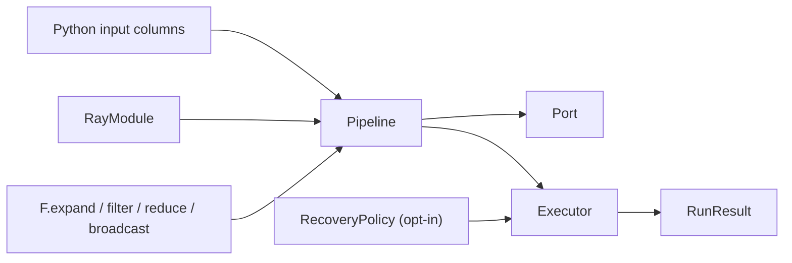
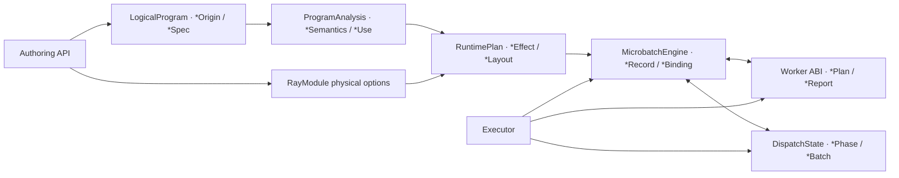
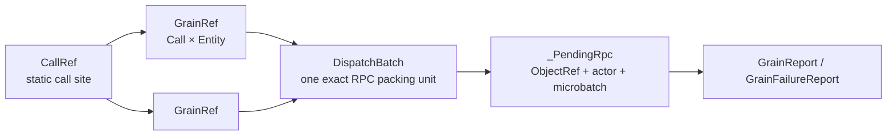

# MultiGrain v3.6 naming and architecture constitution

This document defines the stable vocabulary used by the reviewer artifact.
The Chinese translation is retained as
[`multigrain_v3_6_naming.zh.md`](multigrain_v3_6_naming.zh.md).

## At a glance

### Stable nouns

| Term | Meaning | Owner |
| --- | --- | --- |
| `Port` | Public symbolic handle during authoring | `api.py` |
| `PortRef` | Immutable compiled coordinate | `model.py` |
| `Domain` / `Entity` | Granularity level and one occurrence in that level | runtime engine |
| `Item` | Port/entity intersection | runtime engine |
| `Grain` | Call/entity execution unit | dispatch state |
| `Expansion` | Ordered parent-to-child relation | runtime engine |
| `LogicalProgram` | User declarations and provenance | `program/` |
| `RuntimePlan` | Frozen physical execution contract | `program/plan.py` |
| `Effect` | Lowered structural rule applied to facts | `program/lowering.py` |
| `DispatchState` | Grain phases, generations, and queues | `runtime/dispatch.py` |
| `Executor` | Ray actor and RPC transport | `execution/executor.py` |
| `Worker` | Value-only UDF adapter | `execution/worker.py` |

### Layer suffixes

Names should reveal their layer instead of introducing synonyms:

```text
logical   user-declared graph facts
analysis  discardable compiler-derived facts
plan      immutable lowered execution facts
runtime   semantic microbatch state
dispatch  physical grain scheduling state
execution Ray transport and worker calls
```

`Ref` types are coordinates, not mutable records. `Spec` types are immutable
contracts. `State` types own mutable runtime tables. `Effect` types are lowered
rules and must not own queues or actor handles.

### Failure vocabulary

`RecordFailure` means one producing grain failed. `GroupFailure` means that grain
failed and its same-call, same-direct-parent uncommitted siblings are
suppressed. `FAILED` and `SUPPRESSED` are item outcomes; `ABORT`, `RETRY`, and
`SPLIT` are recovery actions for opaque dispatch failures. Do not use "poison",
"drop", and "retry" interchangeably in API names or state transitions.

### Placement rules

- Add a public authoring object only when it changes the user declaration
  language; put it in `api.py` or `functional.py`.
- Put static invariants in `program/`; never make runtime code re-interpret an
  origin.
- Put mutable semantic facts in `runtime/`; keep actor handles out of it.
- Put Ray-specific behavior in `execution/`; keep it ignorant of primitive
  semantics.
- Put immutable cross-layer DTOs and pure recovery decisions at the package
  root (`protocol.py` and `recovery.py`).

The goal is one name, one owner, and one publication path for every concept.

---

> **Document niche: normative vocabulary, suffixes, state ownership, and module placement.**
> This document is intended for naming/architecture review; it is not a sequential
> tutorial. See the [`V3.6 documentation map`](multigrain_v3_6_documentation_map.md)
> for all document relationships.
>
> Goal: one word per semantic concept; a name directly expresses the layer it lives
> in; ordinary users do not need to understand executor-internal objects.
>
> Status: the constitution is approved and landed; the committed release baseline
> passes the real-Ray and performance gates. For the precise evidence scope of the
> directory reorganization that is not yet committed, see
> [`Architecture audit open items`](todos/22-v36-architecture-audit-findings.md).

## 0. Version boundary

V3.5 is frozen at commit `5f59566` as an executable oracle that has already
completed real-Ray and performance regression. V3.6 is derived independently from
that commit and is only allowed to change naming, encapsulation, public data
structures, and code organization; it MUST NOT add or remove dataflow semantics.

Version constraints:

1. V3.5 source, tests, and documentation remain frozen;
2. V3.6 runtime/compiler MUST NOT import V3.5 implementations;
3. V3.5/V3.6 may appear together as subjects under test only in paired test/benchmark;
4. V3.6 provides no compatibility alias for V3.5 names;
5. V3.6 completion MUST prove semantic equivalence and re-pass the MinerU 368 PDF,
   Docling, and video workloads;
6. Performance results MUST report the mean, variance, and relative difference of
   paired trials; equivalence MUST NOT be claimed from a single elapsed time.

## 1. Constraints and non-goals

This round is not about mechanically reducing the number of `dataclass`es, nor
about stuffing every object into one "big node". All of the following constraints
MUST hold simultaneously:

1. Data structures with different identity formulas, lifetimes, or write authority
   MUST NOT be merged.
2. Old names MUST NOT be preserved through compatibility aliases; V3.6 is not yet
   released, so old and new vocabularies MUST NOT coexist long term.
3. Primitive names stay consistent from `F.*`, LogicalProgram, semantic analysis,
   RuntimePlan, through to state transitions.
4. A suffix expresses an object's responsibility in the architecture, not an
   author's temporary preference.
5. The root package exposes only the API users need to complete their task;
   maintainer types are imported explicitly from their owning module.
6. Renaming MUST NOT change the state machine, data identity, scheduling order, or
   recovery semantics.
7. Every legacy term MUST have exactly one destination; a repo-wide search is the
   completion condition of the implementation.

The following are NOT goals of this round:

- merging the `Origin -> Semantics -> Effect -> Record` compilation layers;
- merging the `Entity / Item / Grain / Expansion` dynamic identities;
- adding deprecated wrappers, properties, or re-exports for legacy names;
- moving code around only to shorten files.

## 2. Two mental models

### 2.1 Ordinary user model

The ordinary user's main path only needs to understand the following seven
resident concepts:

1. `Pipeline`: declares one dataflow;
2. `Port`: represents one logical data column inside `forward()`;
3. `RayModule`: declares user computation and its execution configuration;
4. `F.expand/filter/reduce/broadcast`: explicitly changes granularity, membership,
   or alignment;
5. `Executor`: compiles and executes the Pipeline;
6. `RunResult`: obtains outputs and read-only run metrics;
7. `ItemOutcome / RecordFailure`: expresses abnormal data terminal states, or marks
   a single record failure inside a UDF.

`RecoveryPolicy` is opt-in: it enters the main path only when a user needs to
change the default fail-fast behavior, and MUST NOT become boilerplate that every
example must understand or configure.



Users do not need to understand `DomainRef`, `EntityRef`, `GrainRef`,
`RuntimePlan`, `DispatchState`, or the runtime Engine unless they enter
maintainer/diagnostic documentation.

The target export set of the public root package is:

```text
F
Pipeline
Port
RayModule
function
Executor
RunResult
CompiledProgram
RecoveryPolicy
CompileError
ExecutionError
ItemOutcome
RecordFailure
MISSING
```

`OptionalInput` is the internal return type of `F.optional(port)`; users just call
the function and are not required to import it from the root package. The
`functional` module, the various `*Ref`s, `LogicalProgram`, `RuntimePlan`, and the
Worker/Engine types are no longer re-exported from the root package.

### 2.2 Maintainer identity model

Maintainers only need to remember three static identities and four dynamic
identities:

| Layer | Identity | Uniqueness formula | Question answered |
| --- | --- | --- | --- |
| Static | `PortRef` | program-local integer | Where is this data located on the graph? |
| Static | `DomainRef` | program-local integer | Which Entities can be aligned by identity? |
| Static | `CallRef` | program-local integer | Which RayModule call site is this? |
| Dynamic | `EntityRef` | `DomainRef × occurrence` | Which business entity is this? |
| Dynamic | `ItemRef` | `PortRef × EntityRef` | What is the fact for one entity on one Port? |
| Dynamic | `GrainRef` | `CallRef × EntityRef` | Which logical computation can be scheduled? |
| Dynamic | `ExpansionRef` | `child DomainRef × parent EntityRef` | Which ordered children did one Expand produce? |

If the formulas still feel abstract, first read
[section 4.2 of the getting-started tutorial, the complete PDF→Page→OCR example](multigrain_v3_6_getting_started.md#42-understanding-the-seven-refs-one-by-one-with-a-pdf-pipeline):
it analogizes Port/Entity/Item to columns, rows, and cells, and step by step shows
how an Item makes a Grain ready and how a Grain in turn produces new Items.

The four dynamic identities MUST NOT be merged: their uniqueness formulas,
terminal states, and triggered downstream Effects differ. Keeping these small value
objects removes implicit identity owners and cross-component flywires instead of
inventing concepts.

## 3. Architecture layers and state ownership



`LogicalProgram` is the lightweight logical program frozen after symbolic tracing;
it is not a general IR framework that needs to grow. V3.6 does not introduce an
`IRNode` base class, a Visitor, Block, Instruction, SSA, or a node inheritance
tree. It only stores Call, Port, Domain, Origin, sources, and the output tree.

This is a conceptual layering; it does not require forbidding every bidirectional
import for formalism's sake. The real constraints are:

- the API MUST NOT read runtime state;
- LogicalProgram MUST NOT store derived analysis, physical configuration, or any
  runtime state;
- Analysis MUST NOT store actors or dynamic facts;
- RuntimePlan MUST NOT interpret `PortOrigin`;
- MicrobatchEngine is the sole writer of semantic facts;
- DispatchState is the sole writer of Grain phase, generation, and runnable queues;
- the Worker only consumes ABI DTOs and does not read RuntimeState.

### 3.1 Each of the three static representations answers exactly one question

```text
LogicalProgram    What did the user declare?
ProgramAnalysis   What can be derived from the declaration?
RuntimePlan       Which runtime facts should trigger which Effects?
```

- `LogicalProgram` is the single logical truth, immutable;
- `ProgramAnalysis` is fully discardable and recomputable; it is not a second
  logical truth;
- `RuntimePlan` is the single static execution wiring; the runtime MUST NOT look
  back at Origin to complete semantics.

RayModule replicas, batch, recovery, and Ray resource options are explicit
physical compilation inputs and do not enter LogicalProgram; they are normalized
immediately into `ActorPoolSpec` at lowering time. This input edge only serves the
physical plan and does not participate in control demand, dependency closure, or
any runtime state, so it is not a cross-layer back-reference.

### 3.2 The state machine does not hang off LogicalProgram nodes

`LogicalProgram` only defines the static coordinate system used by runtime refs.
Dynamic state is centralized in authoritative state tables keyed by Ref:

```text
RuntimeState
├── ItemRef      -> ItemRecord
├── ExpansionRef -> ExpansionRecord
├── EntityRef    -> EntityParent
├── ItemRef      -> ValueBinding
└── GrainRef     -> PendingGrain

DispatchState
├── GrainRef -> GrainRecord
├── ready queue
├── immediate-retry queue
└── deferred-recovery queue
```

State tables only store facts; legal transitions are computed by stateless pure
functions:

```text
item_transition
expansion_transition
grain_transition
call_transition
filter_transition
reduce_transition
broadcast_transition
```

Therefore there is no model in which "every Origin node owns a mutable state
machine object", and there are no direct callbacks between nodes. MicrobatchEngine
consumes facts and publishes new facts only through the RuntimePlan trigger
indexes.

### 3.3 Sole write authority

Here **publish** is a state-machine term whose precise meaning is "making a
runtime fact officially take effect": first validate that the complete record is
legal, then register it into the single canonical table, and on first registration
place its `Ref` into the fact queue for `advance()` to keep propagating. It is not
a network broadcast, not Ray Object Store `put()`, and not exposing data to the
user. It is not called a plain `set` because this step does more than mutate a
dict: it establishes the state-machine boundary at which "downstream may now
observe and consume this fact".

- `MicrobatchEngine._publish_item()` is the canonical publication entry point for
  ItemRecord/ValueBinding;
- `MicrobatchEngine._publish_expansion()` is the canonical publication entry point
  for ExpansionRecord;
- `MicrobatchEngine._publish_entity()` is the canonical publication entry point
  for EntityParent;
- `MicrobatchEngine._accept_call_input()` exclusively accumulates PendingGrain
  input slots;
- `DispatchState` exclusively owns GrainRecord, generation, and the three runnable
  queues;
- Executor, materialize, and the Worker may only collaborate through public
  read-only queries or command methods.

The internal field of `MicrobatchEngine` MUST be named `_state`, and `RuntimeState`
MUST NOT be re-exported from the `runtime` aggregation entry point. If a test needs
to verify table structure, it SHOULD test read-only queries, Metrics/Snapshot, or
the owning module's local unit, and MUST NOT rely on `RunResult` exposing a mutable
Engine.

## 4. Suffix grammar

The same suffix MUST express the same responsibility in every module.

| Suffix | Meaning | Mutability | Examples |
| --- | --- | --- | --- |
| `Ref` | stable identity without behavior | frozen | `ItemRef`, `ExpansionRef` |
| `Spec` | static definition/configuration normalized from a user declaration | frozen | `CallSpec`, `ActorPoolSpec` |
| `Origin` | the direct producing expression of one Port inside LogicalProgram | frozen | `FilterOrigin`, `ReduceOrigin` |
| `Semantics` | the complete normalized contract a primitive exposes to the analysis stage | frozen | `PrimitiveSemantics` |
| `Use` | one reverse use edge inside analysis | frozen | `CallUse`, `PrimitiveUse` |
| `Effect` | a runtime action triggered by a class of facts after compilation | frozen | `ReduceEffect`, `ExpandEffect` |
| `Layout` | ordered position/nested structure or ABI arrangement | frozen | `NestedGroupLayout`, `CallInputLayout` |
| `Plan` | immutable, compiled instructions for a runtime owner | frozen | `RuntimePlan` |
| `Invocation` | one executable unit with its resolved physical inputs | frozen | `GrainInvocation` |
| `Report` | results returned to the submitter after execution | frozen | `GrainReport`, `PortOutputReport` |
| `Record` | authoritative fact held by the state owner | decided by the owner | `ItemRecord`, `ExpansionRecord` |
| `Snapshot` | immutable copy used across components or for diagnostics | frozen | `GrainSnapshot`, `WorkerSnapshot` |
| `Outcome` | enum containing only mutually exclusive terminal states | enum | `ItemOutcome`, `ExpansionOutcome` |
| `Phase` | lifecycle enum that also contains intermediate stages | enum | `GrainPhase` |
| `Binding` | reference from a logical value to a physical address/grouped structure | frozen | `RowBinding`, `NestedGroupBinding` |
| `Batch` | the exact Grain set that one dispatch must preserve as a whole | frozen | `DispatchBatch` |
| `Rpc` | one submitted physical request and its finalization context | frozen/private | `_PendingRpc` |
| `State` | mutable tables or state machines owned by a single writer | mutable | `RuntimeState`, `DispatchState` |
| `Policy` | pure decision configuration from input facts to actions | frozen | `RecoveryPolicy` |
| `Metrics` | already-aggregated numeric statistics | snapshot/run-local | `CallMetrics` |

Constraints:

- `State` is no longer used for terminal-state enums; terminal states are always
  called `Outcome`.
- `Key` is not used for domain identity; identity is always called `Ref`.
- `Rule` is not used for already-lowered runtime actions; actions are always called
  `Effect`.
- `Invocation` is no longer a synonym for `Grain`.
- `Take` is no longer used as a Worker input descriptor.
- `Origin` belongs only to LogicalProgram; runtime lineage does not use `Origin`.

## 5. Primitive vocabulary must run through the compilation pipeline

The primitive verbs are fixed as:

```text
Source / CallOutput / Expand / Filter / Reduce / Broadcast
```

Each primitive keeps the same word root across compilation stages:

| User/API | LogicalProgram | Semantics | RuntimePlan | State transition |
| --- | --- | --- | --- | --- |
| source argument | `SourceOrigin` | `SOURCE` | source admission | item publication |
| `RayModule(...)` output | `CallOutputOrigin` | `CALL_OUTPUT` | worker output | call transition |
| `F.expand` | `ExpandOrigin` | `EXPAND` | `ExpandEffect` | expansion transition |
| `F.filter` | `FilterOrigin` | `FILTER` | `FilterEffect` | filter transition |
| `F.reduce` | `ReduceOrigin` | `REDUCE` | `ReduceEffect` | reduce transition |
| `F.broadcast` | `BroadcastOrigin` | `BROADCAST` | `BroadcastEffect` | broadcast transition |

`Group` only describes grouped data produced or consumed by Reduce, for example
`NestedGroupLayout`, `NestedGroupBinding`, and `NestedGroupInput`; it is no longer an alias for the
`F.reduce` primitive.

`Expand` is the primitive verb; `Expansion` is one dynamic expansion fact. The two
MUST NOT be interchanged:

```text
ExpandOrigin / ExpandEffect        compile-time actions
ExpansionRef / ExpansionRecord     runtime facts
ExpansionOutcome                   runtime terminal state
```

## 6. The single boundary of Call, Grain, Batch, and pending RPC



- `Call` is always a static graph node.
- `Grain` is always a dynamic single-entity logical computation.
- `DispatchBatch` is always a set of Grains that recovery must preserve verbatim.
- `_PendingRpc` is always the Executor-private physical in-flight request.
- The Worker's input is called `GrainInvocation`, and its output is called `GrainReport`
  or `GrainFailureReport`.

`InvocationPlan`, `PendingInvocation`, `CallReport`, and `DispatchSelection` no
longer appear.

## 7. Microbatch and the internal Engine

`Arena` is a historical implementation term that forced users to additionally
learn its relationship to the source microbatch. V3.6 uniformly uses `Microbatch`:

| Current name | Target name |
| --- | --- |
| `ArenaEngine` | `MicrobatchEngine` |
| `_ArenaSlot` | `_MicrobatchSlot` |
| `_admit_arena` | `_admit_microbatch` |
| `arena_size` | `microbatch_size` |
| `max_in_flight` | `max_active_microbatches` |
| `RunResult.max_active_arenas` | `RunResult.peak_active_microbatches` |

One MicrobatchEngine manages one source microbatch and its complete derived
closure. After Expand, the number of entities may exceed the number of source
rows; this does not change its ownership boundary.

`RunResult` no longer exposes a mutable Engine. The target contract is:

```text
RunResult
├── outputs
├── elapsed_s
├── calls: tuple[CallMetrics, ...]
├── microbatches: tuple[MicrobatchMetrics, ...]
└── peak_active_microbatches
```

`MicrobatchMetrics` only provides immutable diagnostics such as
`entity/item/expansion/grain/released-value` counts, and does not expose
`RuntimeState`, RuntimePlan, or physical payload references. `RunResult` itself
already means that all microbatches have completed, so it does not redundantly
store a `complete` field that is always true; the aggregate `released_values` is
obtained by summing microbatch metrics. Fine-grained Grain generation tests belong
to `DispatchState` unit tests and are not done by leaking the Engine through
`RunResult`.

`RunResult.calls` is no longer keyed by the internal `CallRef`. Each frozen
`CallMetrics` directly contains the stable `call_index`, `udf_name`, run-local
RPC/Grain/retry/batch metrics, and the `worker_snapshots` of that Call. Ordinary
diagnostics therefore do not require users to first understand or import `CallRef`.
The Executor accumulates internally with a private `_CallCounters` and freezes it
into `CallMetrics` once at the end of the run.

## 8. Target naming per module

This section is the single mapping table used during implementation. Existing
names not listed here are kept by default.

### `model.py`

| Current | Target |
| --- | --- |
| `ShapeState` | `ExpansionOutcome` |

Keep `CallRef / PortRef / DomainRef / EntityRef / ItemRef / GrainRef`,
`InputMode`, `ItemOutcome`, and `GrainPhase`.

### `api.py` / `functional.py`

| Current | Target |
| --- | --- |
| `OptionalPort` | `OptionalInput` |

`OptionalInput` only changes the `InputMode` of one Call input; it does not create
a Port.

### `program/logical.py`

| Current | Target |
| --- | --- |
| `GroupOrigin` | `ReduceOrigin` |
| `InputSpec` | `CallInputSpec` |
| `KernelSpec` | `UdfSpec` |
| `CallSpec.kernel` | `CallSpec.udf` |

### `program/semantics.py`

| Current | Target |
| --- | --- |
| `PrimitiveKind.GROUP` | `PrimitiveKind.REDUCE` |
| `GROUP_VALUE` | `REDUCE_VALUE` |
| `GROUP_MEMBERS` | `REDUCE_MEMBERS` |

### `program/analysis.py`

| Current | Target |
| --- | --- |
| `DerivedFacts` | `ProgramAnalysis` |
| `shape_reporters_by_domain` | `expansion_sources_by_domain` |

`CallUse / PrimitiveUse / LogicalUse` are kept; `Use` is the standard compiler term
for a reverse edge. `group_depth_by_port` is also kept, because it describes data
nesting depth rather than naming the Reduce primitive.

### `program/plan.py`

| Current | Target |
| --- | --- |
| `GroupEffect` | `ReduceEffect` |
| `ExpansionRule` | `ExpandEffect` |
| `PoolSpec` | `ActorPoolSpec` |
| `ExplainPlan` | `ProgramExplanation` |
| `CompiledProgram.facts` | `CompiledProgram.analysis` |
| `CompiledProgram.runtime` | `CompiledProgram.plan` |
| `CompiledProgram.explain` | `CompiledProgram.explanation` |

RuntimePlan indexes are named after their trigger source:

| Current field | Target field |
| --- | --- |
| `effects_by_item_port` | `item_effects_by_source` |
| `expansions_by_source` | `expand_effects_by_source` |
| `shape_reporters_by_domain` | `expansion_sources_by_domain` |
| `structural_effects` | `structural_effects_by_target` |
| `effects_by_shape_domain` | `reduce_effects_by_child_domain` |
| `effects_by_entity_domain` | `broadcast_effects_by_target_domain` |
| `pools_by_call` | `actor_pools_by_call` |

All indexes MUST reference the same Effect object; reconstructing an equal clone is
not allowed.

### `runtime/transitions.py`

| Current | Target |
| --- | --- |
| `shape_transition` | `expansion_transition` |
| `expansion_shape_transition` | `expansion_outcome_from_item` |
| `GroupCause` | `ReduceCause` |
| `GroupTransition` | `ReduceTransition` |
| `group_transition` | `reduce_transition` |

### `protocol.py`

| Current | Target |
| --- | --- |
| `InvocationPlan` | `GrainInvocation` |
| `CallReport` | `GrainReport` |
| `CallFailureReport` | `GrainFailureReport` |
| `InputLayout` | `CallInputLayout` |
| `OutputLayout` | `CallOutputLayout` |
| `GroupTake` | `NestedGroupInput` |
| `MissingTake` | `MissingInput` |
| `InputTake` | `GrainInput` |

`ScalarTake` is deleted: scalar inputs use the existing `RowBinding` directly, and
no concept is added for a single-field wrapper. The target union is:

```text
GrainInput = RowBinding | NestedGroupInput | MissingInput
```

`ExpandedRows`, `PortOutputReport`, `WorkerReport`, and `DispatchFailure` are kept.
They respectively denote the row set of an expanded Port, the report of one output
Port, the Worker report union, and a whole-batch physical failure.

### `runtime/state.py`

| Current | Target |
| --- | --- |
| `ShapeKey` | `ExpansionRef` |
| `ShapeRecord` | `ExpansionRecord` |
| `ShapeRecord.state` | `ExpansionRecord.outcome` |
| `EntityOrigin` | `EntityParent` |
| `GroupShape` | `NestedGroupLayout` |
| `NestedGroupBinding.shape` | `NestedGroupBinding.layout` |
| `PendingInvocation` | `PendingGrain` |
| `RuntimeState.shapes` | `RuntimeState.expansions` |
| `RuntimeState.pending` | `RuntimeState.pending_grains` |

`EntityParent` is the direct parent reference and ordinal of a child Entity;
`Origin` is reserved for LogicalProgram only.

### `runtime/dispatch.py`

| Current | Target |
| --- | --- |
| `DispatchSelection` | `DispatchBatch` |

Keep `DispatchState`, the private `GrainRecord`, and the public read-only
`GrainSnapshot`.

### `runtime/engine.py`

| Current | Target |
| --- | --- |
| `ArenaEngine` | `MicrobatchEngine` |
| `invocation_plan` | `grain_invocation` |
| `shape_count` | `expansion_count` |
| `_publish_shape` | `_publish_expansion` |
| `_try_group` | `_try_reduce` |
| `_ExpansionCommit` | `_ExpandedOutputCommit` |
| `state` | `_state` |

The fact queue is unified as:

```text
_FactEvent = ItemRef | ExpansionRef | EntityRef
```

### `execution/executor.py`

| Current | Target |
| --- | --- |
| `_ArenaSlot` | `_MicrobatchSlot` |
| `_Dispatch` | `_PendingRpc` |
| `arena_index` | `microbatch_index` |
| `_admit_arena` | `_admit_microbatch` |
| `RunResult.arenas` | `RunResult.microbatches: tuple[MicrobatchMetrics, ...]` |
| `RunResult.max_active_arenas` | `RunResult.peak_active_microbatches` |
| `RunResult.calls: dict[CallRef, CallMetrics]` | `RunResult.calls: tuple[CallMetrics, ...]` |
| `RunResult.workers` | `CallMetrics.worker_snapshots` |
| `CallMetrics.actor_starts` | `CallMetrics.actor_instances` |

`CallMetrics` is a frozen, run-local public snapshot; the mutable accumulator is
the private `_CallCounters`. `CallMetrics` provides a human-readable identity through
`call_index + udf_name` and does not leak `CallRef` to users. `actor_instances`
denotes the number of actor instances available in this run and counted after
replacement; it no longer wrongly implies that every persistent actor was started
in this run.

### `execution/worker.py`

| Current | Target |
| --- | --- |
| `WorkerObservation` | `WorkerSnapshot` |
| `ValueStore` | `BlockStore` |
| `WorkerObservation.calls` | `WorkerSnapshot.lifetime_calls` |
| parameter name `invocations` | `invocations` |

`WorkerSnapshot.lifetime_calls` is explicitly an actor lifetime count and is not
confused with the run-local `CallMetrics.rpcs`.

### `recovery.py`

`UdfRecoveryMode`, `RecoveryAction`, and `RecoveryPolicy` already satisfy the
suffix contract and are not renamed. Policy only makes pure decisions;
DispatchState performs physical phase/queue changes; MicrobatchEngine publishes
semantic terminal states.

## 9. Public error and diagnostic wording

Error messages obey the same vocabulary:

- user errors SHOULD show the RayModule/UDF name, the input parameter name, and
  `microbatch` first, rather than internal Ref reprs;
- maintainer context uniformly uses `call=... grain=... generation=...`;
- no more `Invocation`, `Shape`, `Group Effect`, or `Arena` wording is produced;
- Worker contract errors use `expected/actual`, `input/output port`, and
  `grain/generation`;
- primitive names in `ProgramExplanation` match `F.*`, using `reduce` rather than
  `group`.

## 10. Post-implementation source conformance audit

Overall conclusion: V3.6 has completed its breaking closure according to this
constitution; the compiler and state-machine architecture reuses the
responsibility layering already validated in V3.5, and no semantic algorithm was
rewritten for the renaming.

Already conforming:

- `_ProgramBuilder.build()` freezes LogicalProgram, and the builder does not enter
  the runtime;
- `semantics.describe_origin()` is the closed resolution entry point from Origin to
  unified semantics;
- analysis only stores recomputable derived facts and holds no actors or dynamic
  records;
- RuntimePlan contains no PortOrigin, and runtime/Executor/Worker do not import the
  logical module;
- multiple RuntimePlan trigger indexes reference the same Effect, and the verifier
  uses object identity to prevent a second truth;
- MicrobatchEngine consumes RuntimePlan indexes through `_FactEvent` and
  `advance()`, and does not re-resolve Origin at runtime;
- production writes of Item, Expansion, and Entity are concentrated in the Engine's
  `_publish_*` path;
- GrainRecord, generation, and runnable queues are modified only by DispatchState;
- materialize only calls the Engine's read-only queries and does not read
  RuntimeState tables;
- the Worker only receives protocol DTOs and holds neither RuntimePlan nor
  RuntimeState.

Closures already completed:

- the Engine's authoritative tables exist only in the private `_state`;
- `runtime.__init__` no longer aggregates and exports RuntimeState and record types;
- RunResult only stores frozen `CallMetrics` and `MicrobatchMetrics`, not a live
  Engine;
- integration tests and the tutorial no longer read Engine/RuntimeState through
  public results;
- the root package exposes only the user-task API of section 2.1;
- scalar Grain input uses `RowBinding` directly, and the zero-semantics
  `ScalarTake` wrapper no longer exists;
- `ExpansionRecord.outcome`, `WorkerSnapshot.lifetime_calls`, and
  `CallMetrics.actor_instances` have uniformly eliminated ambiguous words.

The following structures do not constitute flywires and SHOULD NOT be
re-implemented for the sake of "absolute layering":

- RuntimePlan reuses frozen `CallSpec` and `DomainSpec`; they are necessary static
  definitions, not dynamic state;
- MicrobatchEngine reads and writes its own `_state` directly; it is the single
  owner of that state table;
- the same ReduceEffect appears in both the Item and Expansion trigger indexes; the
  indexes only hold a reference to the same object;
- RayModule physical options bypass LogicalProgram and enter lowering; they do not
  participate in logical semantics, and their single destination is ActorPoolSpec.

## 11. Implementation order and completion gates

After approval, implementation is only allowed in this order:

1. Rename identities, terminal states, and LogicalProgram names; let type errors
   expose every propagation point.
2. Change semantics, analysis, RuntimePlan, and transitions.
3. Change the Worker ABI, RuntimeState, DispatchState, and MicrobatchEngine.
4. Change Executor public parameters, the RunResult snapshot, and root package
   exports.
5. Change benchmarks, examples, tutorials, and tests.
6. Run the denylist search and confirm that legacy words exist only in the
   "current name" column of this migration document.
7. Run `git diff --check`, core pyright, all Ray-free tests, and real-Ray
   integration.
8. Audit semantic equivalence with the optimizer on/off, and confirm that the
   renaming introduced no second copy of state and no lookup flywire.

Source denylist:

```text
ShapeKey ShapeRecord ShapeState GroupShape EntityOrigin
OptionalPort InvocationPlan PendingInvocation CallReport CallFailureReport
DispatchSelection GroupOrigin GroupEffect GroupTransition GroupCause
PrimitiveKind.GROUP ExpansionRule PoolSpec InputSpec DerivedFacts
ArenaEngine arena_size max_in_flight WorkerObservation ValueStore
ScalarTake GroupTake MissingTake InputTake InputLayout OutputLayout ExplainPlan
```

Similar words that are allowed to remain are limited to:

- `NestedGroupLayout / NestedGroupBinding / NestedGroupInput`: describing grouped data;
- `RuntimeState / DispatchState`: owning mutable tables or state machines;
- the legacy names inside the migration mapping of this document;
- V3/V3.1/V3.2/V3.3/V3.4/V3.5 historical implementations and historical documents,
  which are not mechanically replaced across versions;
- parameter names retained by the paired benchmark in order to call historical V3
  APIs; they may only appear on the adaptation edge of the V3 arm.

## 12. Constitution amendment rules

If a mapping turns out not to hold during implementation, this document MUST be
amended first with the semantic reason, and only then may the source be changed; a
third synonym MUST NOT be invented ad hoc inside a single module. A new concept
MUST answer:

1. Does it have an independent identity formula, lifetime, or write authority?
2. Can it be expressed using an existing suffix?
3. Must an ordinary user see it?
4. Would deleting it reintroduce implicit branching, duplicated state, or a
   cross-component back-reference?

Only when at least one question yields a clear "yes" does the new concept have a
reason to exist.

The real performance closure record is in
[`2026-08-08_release_regression.md`](experiments/multigrain_v3_6/2026-08-08_release_regression.md):
the two paired trial rounds of MinerU 368 PDF, Docling 48 PDF, Caption 256, and
Multimodal 256 all fell within ±2%, and the identity and structure contract passed.
This result confirms that this renaming and the ownership restructuring did not
create observable systematic overhead.
