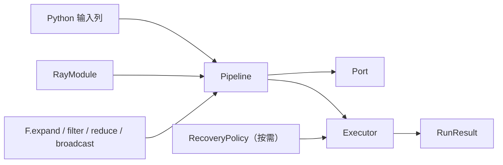
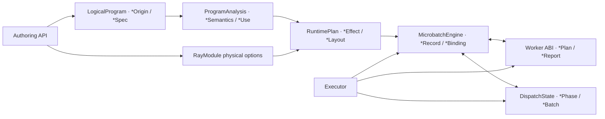
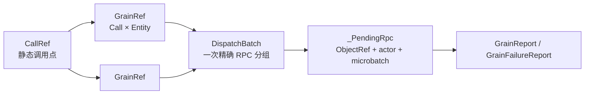

# Multigrain V3.6 命名与架构宪法

> **文档生态位：规范性的词汇、后缀、状态所有权和模块落点。** 本文用于命名/架构 review，
> 不是顺序教程；全部文档关系见
> [`V3.6 文档地图`](multigrain_v3_6_documentation_map.md)。
>
> 目标：一份语义只使用一个词；名称直接表达所在层级；普通用户不需要理解执行器内部对象。
>
> 状态：宪法已批准并落地；release baseline 已通过真实 Ray 与性能门禁。目录重组后的
> 精确证据范围见
> [`架构审计待确认项`](todos/22-v36-architecture-audit-findings.md)。

## 0. 版本边界

V3.5 冻结在提交 `5f59566`，作为已经完成真实 Ray 与性能回归的可执行 oracle。
V3.6 从该提交独立派生，只允许改变命名、封装、公共数据结构和代码组织，不新增或
删除数据流语义。

版本约束：

1. V3.5 源码、测试和文档保持冻结；
2. V3.6 runtime/compiler 不得 import V3.5 实现；
3. V3.5/V3.6 可以只在 paired test/benchmark 中同时作为被测对象出现；
4. V3.6 不提供 V3.5 名称兼容 alias；
5. V3.6 完成必须证明语义等价，并重新通过 MinerU 368 PDF、Docling 和视频负载；
6. 性能结果必须报告 paired trial 的均值、方差和相对差异，不能用单次耗时宣称等价。

## 1. 约束与非目标

这轮不是为了机械减少 `dataclass` 数量，也不追求把所有对象塞进一个“大节点”。
必须同时满足以下约束：

1. 不合并具有不同身份公式、生命周期或写入权的数据结构。
2. 不用兼容 alias 保留旧名称；V3.6 尚未发布，新旧词汇不能长期并存。
3. 原语名称从 `F.*`、LogicalProgram、语义分析、RuntimePlan 到状态转移保持一致。
4. 后缀表达对象在架构中的职责，而不是作者的临时偏好。
5. 根包只暴露用户完成任务所需的 API；维护者类型从所属模块显式导入。
6. 改名不得改变状态机、数据身份、调度顺序或恢复语义。
7. 每个旧术语必须有唯一去向；全仓搜索是实施完成条件。

以下做法不属于本轮目标：

- 合并 `Origin -> Semantics -> Effect -> Record` 编译分层；
- 合并 `Entity / Item / Grain / Expansion` 动态身份；
- 为旧名称增加 deprecated wrapper、property 或 re-export；
- 仅为了缩短文件而搬运代码。

## 2. 两套心智模型

### 2.1 普通用户模型

普通用户主路径只需要理解下列七组常驻概念：

1. `Pipeline`：声明一张数据流；
2. `Port`：在 `forward()` 内表示一列逻辑数据；
3. `RayModule`：声明用户计算及其执行配置；
4. `F.expand/filter/reduce/broadcast`：显式改变粒度、成员或对齐关系；
5. `Executor`：编译并执行 Pipeline；
6. `RunResult`：取得输出和只读运行指标；
7. `ItemOutcome / RecordFailure`：表达非正常数据终态或在 UDF 内标记单条失败。

`RecoveryPolicy` 是按需扩展：只有用户需要改变默认 fail-fast 行为时才进入主路径，
不能成为每个示例都必须理解或配置的样板代码。



用户不需要理解 `DomainRef`、`EntityRef`、`GrainRef`、`RuntimePlan`、
`DispatchState` 或运行时 Engine，除非进入维护者/诊断文档。

公共根包的目标导出集合为：

```text
F
Pipeline
Port
RayModule
function
Executor
RunResult
CompiledProgram
RecoveryPolicy
CompileError
ExecutionError
ItemOutcome
RecordFailure
MISSING
```

`OptionalInput` 是 `F.optional(port)` 的内部返回类型，用户使用该函数即可，不要求从
根包导入它。`functional` 模块、各种 `*Ref`、`LogicalProgram`、`RuntimePlan` 和
Worker/Engine 类型不再从根包 re-export。

### 2.2 维护者身份模型

维护者只需要记住三种静态身份和四种动态身份：

| 层级 | 身份 | 唯一公式 | 回答的问题 |
|---|---|---|---|
| 静态 | `PortRef` | Program 内整数 | 数据在图上的哪个位置？ |
| 静态 | `DomainRef` | Program 内整数 | 哪些 Entity 可以按身份对齐？ |
| 静态 | `CallRef` | Program 内整数 | 这是哪个 RayModule 调用点？ |
| 动态 | `EntityRef` | `DomainRef × occurrence` | 当前是哪一个业务实体？ |
| 动态 | `ItemRef` | `PortRef × EntityRef` | 某个实体在某个 Port 上的事实是什么？ |
| 动态 | `GrainRef` | `CallRef × EntityRef` | 哪一次逻辑计算可以被调度？ |
| 动态 | `ExpansionRef` | `child DomainRef × parent EntityRef` | 一次 Expand 产生了哪些有序 children？ |

如果公式仍然抽象，先看[入门教程 4.2 节的 PDF→Page→OCR 完整例子](multigrain_v3_6_getting_started.md#42-用一条-pdf-流水线逐个理解七种-ref)：
它把 Port/Entity/Item 分别类比为列、行、单元格，并逐步展示 Item 如何使 Grain 就绪、
Grain 又如何产生新的 Item。

四种动态身份不得合并：它们的唯一公式、终态和触发的下游 Effect 不同。保留这些
小型值对象是在消除隐式身份所有者和跨组件飞线，而不是制造概念。

## 3. 架构层级与状态所有权



`LogicalProgram` 是符号追踪完成后冻结的轻量逻辑程序，不是一套需要扩张的通用 IR
框架。V3.6 不引入 `IRNode` 基类、Visitor、Block、Instruction、SSA 或节点继承树。
它只保存 Call、Port、Domain、Origin、sources 和 output tree。

这是一条概念分层，不要求为了形式主义禁止所有双向 import。真正约束是：

- API 不读取运行时状态；
- LogicalProgram 不保存 derived analysis、物理配置或任何运行时状态；
- Analysis 不保存 actor 或动态事实；
- RuntimePlan 不解释 `PortOrigin`；
- MicrobatchEngine 是语义事实唯一写入者；
- DispatchState 是 Grain phase、generation 和 runnable queue 的唯一写入者；
- Worker 只消费 ABI DTO，不读取 RuntimeState。

### 3.1 三份静态表示各自只有一个问题

```text
LogicalProgram   用户声明了什么？
ProgramAnalysis  从声明中可以推导出什么？
RuntimePlan      哪类运行时事实应触发哪些 Effect？
```

- `LogicalProgram` 是唯一逻辑真相，immutable；
- `ProgramAnalysis` 完全可丢弃、可重算，不是第二份逻辑真相；
- `RuntimePlan` 是唯一静态执行接线，运行时不得回查 Origin 补全语义。

RayModule 的 replicas、batch、recovery 和 Ray resource options 是显式的物理编译输入，
不进入 LogicalProgram；它们在 lowering 时立即规范化为 `ActorPoolSpec`。这条输入边只
服务物理计划，不参与 control demand、依赖闭包或任何运行时状态，因此不是跨层回查。

### 3.2 状态机不挂在 LogicalProgram 节点上

`LogicalProgram` 只定义运行时引用使用的静态坐标系。动态状态集中保存在以 Ref 为 key
的权威状态表中：

```text
RuntimeState
├── ItemRef      -> ItemRecord
├── ExpansionRef -> ExpansionRecord
├── EntityRef    -> EntityParent
├── ItemRef      -> ValueBinding
└── GrainRef     -> PendingGrain

DispatchState
├── GrainRef -> GrainRecord
├── ready queue
├── immediate-retry queue
└── deferred-recovery queue
```

状态表只保存事实；合法转移由无状态纯函数计算：

```text
item_transition
expansion_transition
grain_transition
call_transition
filter_transition
reduce_transition
broadcast_transition
```

因此不存在“每个 Origin 节点拥有一个可变状态机对象”的模型，也不存在节点之间直接
回调。MicrobatchEngine 只通过 RuntimePlan 的触发索引消费事实并发布新事实。

### 3.3 唯一写入权

这里的 **publish（发布）** 是状态机术语，准确含义是“让一个运行时事实正式生效”：
先校验完整记录是否合法，再把它登记到唯一的 canonical table，并在首次登记时把其
`Ref` 放入事实队列，供 `advance()` 继续传播。它不是网络广播、Ray Object Store
的 `put()`，也不是向用户暴露数据。之所以不叫普通 `set`，是因为这一步不仅修改字典，
还建立了“下游现在可以观察并消费这个事实”的状态机边界。

- `MicrobatchEngine._publish_item()` 是 ItemRecord/ValueBinding 的规范发布入口；
- `MicrobatchEngine._publish_expansion()` 是 ExpansionRecord 的规范发布入口；
- `MicrobatchEngine._publish_entity()` 是 EntityParent 的规范发布入口；
- `MicrobatchEngine._accept_call_input()` 独占 PendingGrain 输入槽累积；
- `DispatchState` 独占 GrainRecord、generation 和三个 runnable queue；
- Executor、materialize 和 Worker 只能通过公开只读查询或命令方法协作。

`MicrobatchEngine` 内部字段必须叫 `_state`，`RuntimeState` 不从 `runtime` 聚合入口
re-export。测试若需要验证表结构，应测试只读查询、Metrics/Snapshot 或所属模块的
局部单元，而不能依赖 `RunResult` 暴露一个可变 Engine。

## 4. 后缀语法

同一后缀在所有模块中必须表达同一种职责。

| 后缀 | 含义 | 可变性 | 示例 |
|---|---|---|---|
| `Ref` | 无行为的稳定身份 | frozen | `ItemRef`, `ExpansionRef` |
| `Spec` | 用户声明经规范化后的静态定义/配置 | frozen | `CallSpec`, `ActorPoolSpec` |
| `Origin` | LogicalProgram 中某个 Port 的直接生产表达式 | frozen | `FilterOrigin`, `ReduceOrigin` |
| `Semantics` | 原语对分析阶段暴露的完整归一化合同 | frozen | `PrimitiveSemantics` |
| `Use` | analysis 中一条反向使用边 | frozen | `CallUse`, `PrimitiveUse` |
| `Effect` | 编译后由某类事实触发的运行时动作 | frozen | `ReduceEffect`, `ExpandEffect` |
| `Layout` | 有序位置/嵌套结构或 ABI 排列 | frozen | `NestedGroupLayout`, `CallInputLayout` |
| `Plan` | 编译后交给运行时所有者的不可变指令 | frozen | `RuntimePlan` |
| `Invocation` | 一个可执行单元及其已解析物理输入 | frozen | `GrainInvocation` |
| `Report` | 执行后返回给提交方的结果 | frozen | `GrainReport`, `PortOutputReport` |
| `Record` | 状态所有者保存的权威事实 | owner 决定 | `ItemRecord`, `ExpansionRecord` |
| `Snapshot` | 跨组件或诊断使用的不可变副本 | frozen | `GrainSnapshot`, `WorkerSnapshot` |
| `Outcome` | 只包含互斥终态的枚举 | enum | `ItemOutcome`, `ExpansionOutcome` |
| `Phase` | 包含中间阶段的生命周期枚举 | enum | `GrainPhase` |
| `Binding` | 逻辑值到物理地址/组合结构的引用 | frozen | `RowBinding`, `NestedGroupBinding` |
| `Batch` | 一次调度必须整体保持的精确 Grain 集合 | frozen | `DispatchBatch` |
| `Rpc` | 一次已提交物理请求及其终结上下文 | frozen/private | `_PendingRpc` |
| `State` | 唯一写入者拥有的一组可变表或状态机 | mutable | `RuntimeState`, `DispatchState` |
| `Policy` | 输入事实到动作的纯决策配置 | frozen | `RecoveryPolicy` |
| `Metrics` | 已聚合的数值统计 | snapshot/run-local | `CallMetrics` |

约束：

- `State` 不再用于终态枚举，终态一律叫 `Outcome`。
- `Key` 不用于领域身份，身份一律叫 `Ref`。
- `Rule` 不用于已 lower 的运行时动作，动作一律叫 `Effect`。
- `Invocation` 不再作为 `Grain` 的同义词。
- `Take` 不再作为 Worker 输入描述词。
- `Origin` 只属于 LogicalProgram；运行时血缘不使用 `Origin`。

## 5. 原语词汇必须贯穿编译流水线

原语动词固定为：

```text
Source / CallOutput / Expand / Filter / Reduce / Broadcast
```

每个原语沿编译阶段保持同一个词根：

| 用户/API | LogicalProgram | Semantics | RuntimePlan | 状态转移 |
|---|---|---|---|---|
| source 参数 | `SourceOrigin` | `SOURCE` | source admission | item publication |
| `RayModule(...)` 输出 | `CallOutputOrigin` | `CALL_OUTPUT` | worker output | call transition |
| `F.expand` | `ExpandOrigin` | `EXPAND` | `ExpandEffect` | expansion transition |
| `F.filter` | `FilterOrigin` | `FILTER` | `FilterEffect` | filter transition |
| `F.reduce` | `ReduceOrigin` | `REDUCE` | `ReduceEffect` | reduce transition |
| `F.broadcast` | `BroadcastOrigin` | `BROADCAST` | `BroadcastEffect` | broadcast transition |

`Group` 只描述 Reduce 产生或消费的成组数据，例如 `NestedGroupLayout`、`NestedGroupBinding`
和 `NestedGroupInput`；它不再作为 `F.reduce` 原语的别名。

`Expand` 是原语动词；`Expansion` 是一次动态展开事实。两者不能互换：

```text
ExpandOrigin / ExpandEffect        编译期动作
ExpansionRef / ExpansionRecord    运行时事实
ExpansionOutcome                  运行时终态
```

## 6. Call、Grain、Batch 与 pending RPC 的唯一边界



- `Call` 永远是静态图节点。
- `Grain` 永远是动态的单实体逻辑计算。
- `DispatchBatch` 永远是 recovery 必须原样保留的一组 Grain。
- `_PendingRpc` 永远是 Executor 私有的物理在途请求。
- Worker 的输入叫 `GrainInvocation`，输出叫 `GrainReport` 或
  `GrainFailureReport`。

不再出现 `InvocationPlan`、`PendingInvocation`、`CallReport` 或
`DispatchSelection`。

## 7. Microbatch 与内部 Engine

`Arena` 是历史实现词，用户必须额外学习它与 source microbatch 的关系。V3.6
统一使用 `Microbatch`：

| 当前名称 | 目标名称 |
|---|---|
| `ArenaEngine` | `MicrobatchEngine` |
| `_ArenaSlot` | `_MicrobatchSlot` |
| `_admit_arena` | `_admit_microbatch` |
| `arena_size` | `microbatch_size` |
| `max_in_flight` | `max_active_microbatches` |
| `RunResult.max_active_arenas` | `RunResult.peak_active_microbatches` |

一个 MicrobatchEngine 管理一个 source microbatch 及其完整派生闭包。Expand 后实体数
可以大于 source row 数，这不改变它的所有权边界。

`RunResult` 不再暴露可变的 Engine。目标合同为：

```text
RunResult
├── outputs
├── elapsed_s
├── calls: tuple[CallMetrics, ...]
├── microbatches: tuple[MicrobatchMetrics, ...]
└── peak_active_microbatches
```

`MicrobatchMetrics` 只提供 `entity/item/expansion/grain/released-value` 数量等不可变诊断，
不暴露 `RuntimeState`、RuntimePlan 或物理 payload 引用。`RunResult` 本身即代表所有
microbatch 已完成，因此不重复保存恒为 true 的 `complete` 字段；聚合
`released_values` 由 microbatch metrics 求和得到。精细 Grain generation 测试属于
`DispatchState` 单元测试，不通过 `RunResult` 泄露 Engine 来完成。

`RunResult.calls` 不再以内部 `CallRef` 为 key。每个 frozen `CallMetrics` 直接包含稳定的
`call_index`、`udf_name`、run-local RPC/Grain/retry/batch 指标，以及该 Call 的
`worker_snapshots`。这样普通诊断不要求用户先理解或导入 `CallRef`。Executor 内部使用
私有 `_CallCounters` 累加，run 结束时一次性冻结为 `CallMetrics`。

## 8. 逐模块目标命名

本节是实施时的唯一映射表。未列出的现有名称默认保留。

### `model.py`

| 当前 | 目标 |
|---|---|
| `ShapeState` | `ExpansionOutcome` |

保留 `CallRef / PortRef / DomainRef / EntityRef / ItemRef / GrainRef`、
`InputMode`、`ItemOutcome` 和 `GrainPhase`。

### `api.py` / `functional.py`

| 当前 | 目标 |
|---|---|
| `OptionalPort` | `OptionalInput` |

`OptionalInput` 只改变一个 Call 输入的 `InputMode`，不创建 Port。

### `program/logical.py`

| 当前 | 目标 |
|---|---|
| `GroupOrigin` | `ReduceOrigin` |
| `InputSpec` | `CallInputSpec` |
| `KernelSpec` | `UdfSpec` |
| `CallSpec.kernel` | `CallSpec.udf` |

### `program/semantics.py`

| 当前 | 目标 |
|---|---|
| `PrimitiveKind.GROUP` | `PrimitiveKind.REDUCE` |
| `GROUP_VALUE` | `REDUCE_VALUE` |
| `GROUP_MEMBERS` | `REDUCE_MEMBERS` |

### `program/analysis.py`

| 当前 | 目标 |
|---|---|
| `DerivedFacts` | `ProgramAnalysis` |
| `shape_reporters_by_domain` | `expansion_sources_by_domain` |

`CallUse / PrimitiveUse / LogicalUse` 保留；`Use` 是标准的编译器反向边词汇。
`group_depth_by_port` 也保留，因为它描述数据嵌套深度，不是 Reduce 原语名称。

### `program/plan.py`

| 当前 | 目标 |
|---|---|
| `GroupEffect` | `ReduceEffect` |
| `ExpansionRule` | `ExpandEffect` |
| `PoolSpec` | `ActorPoolSpec` |
| `ExplainPlan` | `ProgramExplanation` |
| `CompiledProgram.facts` | `CompiledProgram.analysis` |
| `CompiledProgram.runtime` | `CompiledProgram.plan` |
| `CompiledProgram.explain` | `CompiledProgram.explanation` |

RuntimePlan 索引按“触发源”命名：

| 当前字段 | 目标字段 |
|---|---|
| `effects_by_item_port` | `item_effects_by_source` |
| `expansions_by_source` | `expand_effects_by_source` |
| `shape_reporters_by_domain` | `expansion_sources_by_domain` |
| `structural_effects` | `structural_effects_by_target` |
| `effects_by_shape_domain` | `reduce_effects_by_child_domain` |
| `effects_by_entity_domain` | `broadcast_effects_by_target_domain` |
| `pools_by_call` | `actor_pools_by_call` |

所有索引必须引用同一份 Effect 对象，不允许重新构造 equal clone。

### `runtime/transitions.py`

| 当前 | 目标 |
|---|---|
| `shape_transition` | `expansion_transition` |
| `expansion_shape_transition` | `expansion_outcome_from_item` |
| `GroupCause` | `ReduceCause` |
| `GroupTransition` | `ReduceTransition` |
| `group_transition` | `reduce_transition` |

### `protocol.py`

| 当前 | 目标 |
|---|---|
| `InvocationPlan` | `GrainInvocation` |
| `CallReport` | `GrainReport` |
| `CallFailureReport` | `GrainFailureReport` |
| `InputLayout` | `CallInputLayout` |
| `OutputLayout` | `CallOutputLayout` |
| `GroupTake` | `NestedGroupInput` |
| `MissingTake` | `MissingInput` |
| `InputTake` | `GrainInput` |

`ScalarTake` 删除：标量输入直接使用已有 `RowBinding`，不再为单字段 wrapper 增加一个
概念。目标联合为：

```text
GrainInput = RowBinding | NestedGroupInput | MissingInput
```

`ExpandedRows`、`PortOutputReport`、`WorkerReport`、`DispatchFailure` 保留。它们分别表示
expanded Port 的行集合、一个输出 Port 的报告、Worker 报告联合和整批物理失败。

### `runtime/state.py`

| 当前 | 目标 |
|---|---|
| `ShapeKey` | `ExpansionRef` |
| `ShapeRecord` | `ExpansionRecord` |
| `ShapeRecord.state` | `ExpansionRecord.outcome` |
| `EntityOrigin` | `EntityParent` |
| `GroupShape` | `NestedGroupLayout` |
| `NestedGroupBinding.shape` | `NestedGroupBinding.layout` |
| `PendingInvocation` | `PendingGrain` |
| `RuntimeState.shapes` | `RuntimeState.expansions` |
| `RuntimeState.pending` | `RuntimeState.pending_grains` |

`EntityParent` 是 child Entity 的直接父引用和 ordinal；`Origin` 只留给 LogicalProgram。

### `runtime/dispatch.py`

| 当前 | 目标 |
|---|---|
| `DispatchSelection` | `DispatchBatch` |

保留 `DispatchState`、私有 `GrainRecord` 和公开只读 `GrainSnapshot`。

### `runtime/engine.py`

| 当前 | 目标 |
|---|---|
| `ArenaEngine` | `MicrobatchEngine` |
| `invocation_plan` | `grain_invocation` |
| `shape_count` | `expansion_count` |
| `_publish_shape` | `_publish_expansion` |
| `_try_group` | `_try_reduce` |
| `_ExpansionCommit` | `_ExpandedOutputCommit` |
| `state` | `_state` |

事实队列统一为：

```text
_FactEvent = ItemRef | ExpansionRef | EntityRef
```

### `execution/executor.py`

| 当前 | 目标 |
|---|---|
| `_ArenaSlot` | `_MicrobatchSlot` |
| `_Dispatch` | `_PendingRpc` |
| `arena_index` | `microbatch_index` |
| `_admit_arena` | `_admit_microbatch` |
| `RunResult.arenas` | `RunResult.microbatches: tuple[MicrobatchMetrics, ...]` |
| `RunResult.max_active_arenas` | `RunResult.peak_active_microbatches` |
| `RunResult.calls: dict[CallRef, CallMetrics]` | `RunResult.calls: tuple[CallMetrics, ...]` |
| `RunResult.workers` | `CallMetrics.worker_snapshots` |
| `CallMetrics.actor_starts` | `CallMetrics.actor_instances` |

`CallMetrics` 是 frozen、run-local 的公开快照；可变累加器叫私有 `_CallCounters`。
`CallMetrics` 通过 `call_index + udf_name` 提供人类可读身份，不向用户泄露 `CallRef`。
`actor_instances` 表示本轮可用及 replacement 后参与统计的 actor 实例数，不再错误暗示
所有 persistent actor 都是在本轮启动的。

### `execution/worker.py`

| 当前 | 目标 |
|---|---|
| `WorkerObservation` | `WorkerSnapshot` |
| `ValueStore` | `BlockStore` |
| `WorkerObservation.calls` | `WorkerSnapshot.lifetime_calls` |
| 参数名 `invocations` | `invocations` |

`WorkerSnapshot.lifetime_calls` 明确是 actor lifetime 计数，不与 run-local
`CallMetrics.rpcs` 混称。

### `recovery.py`

`UdfRecoveryMode`、`RecoveryAction` 和 `RecoveryPolicy` 已符合后缀合同，不改名。
Policy 只做纯决策；DispatchState 执行物理 phase/queue 变化；MicrobatchEngine 发布语义终态。

## 9. 公共错误与诊断用语

错误信息同样遵守上述词汇：

- 用户错误优先显示 RayModule/UDF 名、输入参数名和 `microbatch`，而不是内部 Ref repr；
- 维护者上下文统一使用 `call=... grain=... generation=...`；
- 不再产生 `Invocation`、`Shape`、`Group Effect` 或 `Arena` 文案；
- Worker 合同错误使用 `expected/actual`、`input/output port`、`grain/generation`；
- `ProgramExplanation` 中原语名与 `F.*` 一致，使用 `reduce` 而不是 `group`。

## 10. 实现后源码契合性审计

总体结论：V3.6 已按本宪法完成 breaking 收口；编译器和状态机架构沿用 V3.5 已验证
的职责分层，没有为改名重写语义算法。

已经契合：

- `_ProgramBuilder.build()` 冻结 LogicalProgram，builder 不进入 runtime；
- `semantics.describe_origin()` 是 Origin 到统一语义的封闭解析入口；
- analysis 只保存可重算派生事实，不持有 actor 或动态记录；
- RuntimePlan 不包含 PortOrigin，runtime/Executor/Worker 均不导入 logical 模块；
- RuntimePlan 的多个触发索引引用同一份 Effect，verifier 使用对象 identity 防止第二份真相；
- MicrobatchEngine 通过 `_FactEvent` 和 `advance()` 消费 RuntimePlan 索引，不在运行时重新解析 Origin；
- Item、Expansion、Entity 的生产写入集中在 Engine 的 `_publish_*` 路径；
- GrainRecord、generation 和 runnable queues 只由 DispatchState 修改；
- materialize 只调用 Engine 的只读查询，不读取 RuntimeState table；
- Worker 只接收 protocol DTO，不持有 RuntimePlan 或 RuntimeState。

已经完成的收口：

- Engine 的权威表只存在于私有 `_state`；
- `runtime.__init__` 不再聚合导出 RuntimeState 和记录类型；
- RunResult 只保存 frozen `CallMetrics` 与 `MicrobatchMetrics`，不保存 live Engine；
- integration tests 和教程不再通过公开结果读取 Engine/RuntimeState；
- 根包只暴露第 2.1 节的用户任务 API；
- 标量 Grain 输入直接使用 `RowBinding`，不存在零语义 `ScalarTake` wrapper；
- `ExpansionRecord.outcome`、`WorkerSnapshot.lifetime_calls` 和
  `CallMetrics.actor_instances` 已统一消除歧义词。

下列结构不构成飞线，不应为了“绝对分层”重复实现：

- RuntimePlan 复用 frozen `CallSpec` 和 `DomainSpec`；它们是必要静态定义，不是动态状态；
- MicrobatchEngine 直接读写自己的 `_state`；它就是该状态表的唯一 owner；
- 同一个 ReduceEffect 同时出现在 Item 与 Expansion 触发索引；索引只持有同一个对象引用；
- RayModule physical options 绕过 LogicalProgram 进入 lowering；它们不参与逻辑语义，且
  唯一落点是 ActorPoolSpec。

## 11. 实施顺序与完成门禁

批准后只允许按以下顺序实施：

1. 修改身份、终态和 LogicalProgram 名称；让类型错误暴露全部传播点。
2. 修改 semantics、analysis、RuntimePlan 和 transitions。
3. 修改 Worker ABI、RuntimeState、DispatchState 和 MicrobatchEngine。
4. 修改 Executor 公共参数、RunResult snapshot 和根包 exports。
5. 修改 benchmark、示例、教程和测试。
6. 运行 denylist 搜索，确认旧词只存在于本迁移文档的“当前名称”列。
7. 运行 `git diff --check`、核心 pyright、全部 Ray-free 测试和真实 Ray integration。
8. 审计 optimizer on/off 语义等价，并确认命名改动没有新增第二份状态或 lookup 飞线。

源码 denylist：

```text
ShapeKey ShapeRecord ShapeState GroupShape EntityOrigin
OptionalPort InvocationPlan PendingInvocation CallReport CallFailureReport
DispatchSelection GroupOrigin GroupEffect GroupTransition GroupCause
PrimitiveKind.GROUP ExpansionRule PoolSpec InputSpec DerivedFacts
ArenaEngine arena_size max_in_flight WorkerObservation ValueStore
ScalarTake GroupTake MissingTake InputTake InputLayout OutputLayout ExplainPlan
```

允许保留的相近词仅限：

- `NestedGroupLayout / NestedGroupBinding / NestedGroupInput`：描述成组数据；
- `RuntimeState / DispatchState`：拥有可变表或状态机；
- 本文迁移映射中的旧名称；
- V3/V3.1/V3.2/V3.3/V3.4/V3.5 历史实现与历史文档，不做跨版本机械替换。
- paired benchmark 为调用历史 V3 API 而保留的参数名，只允许出现在 V3 arm 的适配边。

## 12. 宪法修改规则

实施中若发现映射不成立，必须先修改本文并说明语义原因，再修改源码；不能在单个
module 内临时发明第三个同义词。新增概念必须回答：

1. 它是否有独立身份公式、生命周期或写入权？
2. 它能否使用现有后缀表达？
3. 普通用户是否必须看到它？
4. 删除它会不会重新引入隐式分支、重复状态或跨组件回查？

只有至少一个问题给出明确的“是/会”，新概念才有存在理由。

真实性能收口记录见
[`2026-08-08_release_regression.md`](experiments/multigrain_v3_6/2026-08-08_release_regression.md)：
MinerU 368 PDF、Docling 48 PDF、Caption 256 与 Multimodal 256 的两轮 paired trial 均在
±2% 内，且身份与结构合同通过。该结果确认本命名与所有权重构没有制造可观测的系统性开销。
