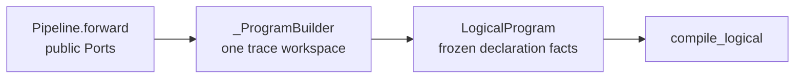
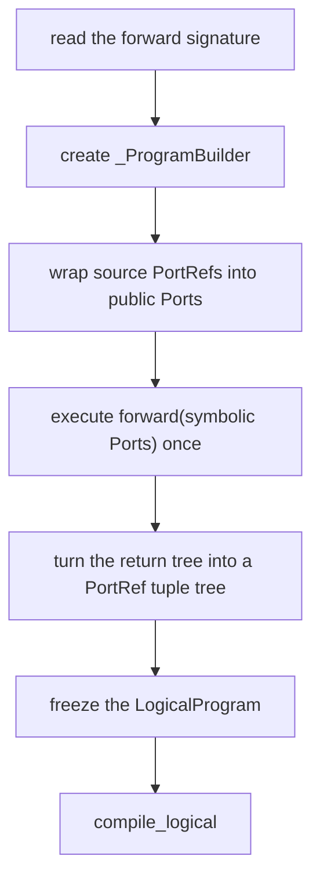

# 01. Authoring API: from Python calls to symbols

The public authoring surface lives in
[`api.py`](../../rayorch/experimental/multigrain_v3_6/api.py) and
[`functional.py`](../../rayorch/experimental/multigrain_v3_6/functional.py).
The Chinese walkthrough is retained in
[`01_authoring_api.zh.md`](01_authoring_api.zh.md).

## At a glance

### Trace boundary

`Pipeline.compile()` creates a private trace builder, supplies symbolic source
ports to `forward()`, and restores the active trace even when tracing raises.
Inside `forward()`, a `RayModule` call registers a `CallSpec` and returns one or
more immutable `Port` handles. It never evaluates the UDF.

```python
class Pipe(mg.Pipeline):
    def forward(self, documents):
        pages = mg.F.expand(documents)
        text = ocr(pages, language=lang)
        return mg.F.reduce(text, documents)
```

`Port` is a small public wrapper around a `PortRef` plus a trace-owner token.
The token prevents a port from one pipeline trace being silently reused in
another. Positional and keyword inputs are recorded separately and lowered to
stable worker slots.

### Module configuration

`pre_init()` stores actor constructor arguments; `ray_options()` stores physical
execution options. Both are copied into the traced call and therefore cannot
mutate an existing `CompiledProgram`. Changing a module and compiling again
creates a new snapshot.

`function()` is a convenience adapter for stateless callables. `returns(n)` or
`num_outputs=n` declares logical output arity. Structural `F.*` helpers create
relations only; they do not create actors or RPCs.

### Boundary tests

Authoring tests should cover cross-trace ports, positional/keyword layout,
output arity, immutable compile snapshots, and rejection of module calls made
outside `Pipeline.forward()`.

---

## 01. Reading `api.py` section by section: how a symbolic call becomes a LogicalProgram

Main source: [`api.py`](../../rayorch/experimental/multigrain_v3_6/api.py); companion thin wrapper:
[`functional.py`](../../rayorch/experimental/multigrain_v3_6/functional.py).

This article answers exactly one question: why does a chain of ordinary Python calls that the user writes inside `Pipeline.forward()` not execute real business values, but stably produce Call, Port, Domain, and Origin?

---

### 1. Responsibility boundary first

What `api.py` owns is the mutable workspace of one authoring trace; its final output is a frozen `LogicalProgram`.

It is responsible for:

- assigning compile-time identities to source, Call, Port, and Domain;
- validating that what the user passes in is a `Port` of the current trace;
- recording positional/keyword/optional inputs as a `CallSpec`;
- recording `F.*` as explicit Origin and Domain relations;
- finally freezing the declaration graph and calling the fixed compiler pipeline.

It is not responsible for:

- computing derived facts such as control closure and the consumer reverse index;
- creating actors or executing UDFs;
- creating Entity, Item, or Grain;
- deciding the dynamic outcome of Filter/Reduce.



---

### 2. Source map

| Source section | Role | Question you should be able to answer after reading |
| --- | --- | --- |
| [`Port / OptionalInput`](../../rayorch/experimental/multigrain_v3_6/api.py#L33-L50) | public symbolic handle | Why does a Port carry no business value? |
| [`RayModule`](../../rayorch/experimental/multigrain_v3_6/api.py#L53-L93) | declares the UDF recipe and physical options | Why does calling a module not construct an actor? |
| [`function`](../../rayorch/experimental/multigrain_v3_6/api.py#L96-L117) | wraps a plain callable into a RayModule | How are the two decorator spellings normalized? |
| [`Pipeline.compile`](../../rayorch/experimental/multigrain_v3_6/api.py#L120-L153) | establishes and constrains one symbolic trace | Why is the trace always cleaned up? |
| [`_ProgramBuilder.__init__`](../../rayorch/experimental/multigrain_v3_6/api.py#L156-L179) | creates the root Domain and the source Ports | Where does source identity come from? |
| [`call`](../../rayorch/experimental/multigrain_v3_6/api.py#L196-L253) | records one compute call site | How do multiple inputs and multiple outputs affect identity? |
| [`expand`](../../rayorch/experimental/multigrain_v3_6/api.py#L255-L307) | creates a child Domain | Why do aligned outputs share a Domain? |
| [`reduce/broadcast/filter`](../../rayorch/experimental/multigrain_v3_6/api.py#L309-L384) | records the other structural relations | Which operations change the Domain? |
| [`normalize_outputs/build`](../../rayorch/experimental/multigrain_v3_6/api.py#L386-L412) | freezes the output tree and the LogicalProgram | How is the mutable builder isolated from the compiler? |
| [internal helpers](../../rayorch/experimental/multigrain_v3_6/api.py#L414-L449) | allocate Refs, validate owner, handle optional | Which entry points maintain authoring invariants? |

---

### 3. Why `Port` has only two fields

The core of the source is:

```python
@dataclass(frozen=True, slots=True)
class Port:
    ref: PortRef
    _owner: int
```

- `ref` is the stable integer identity of this Port inside the current Program.
- `_owner` is the identity of this trace; it is used to reject mixing in a Port produced by another Pipeline compilation.

`Port` has no `value`, `outcome`, `entity`, or Ray `ObjectRef`. This is intentional: the job of `forward()` is to declare "relations between data locations", not to run data.

For example:

```python
texts = self.ocr(pages)
```

Here both `pages` and `texts` are static Ports. Only at real runtime do these appear:

```text
ItemRef(pages, page_entity_7)
ItemRef(texts, page_entity_7)
GrainRef(ocr_call, page_entity_7)
```

`OptionalInput` also only wraps the same Port: it merely changes the `InputMode` of some Call input from REQUIRED to OPTIONAL. It creates no new Port and does not change the Domain.

---

### 4. `ContextVar`: why a RayModule can find the current Builder

The module-level `_ACTIVE_TRACE` holds the `_ProgramBuilder` of the current context. `RayModule.__call__()` itself does not hold a Pipeline, so it goes through:

```python
builder = _ACTIVE_TRACE.get()
return builder.call(self, args, kwargs)
```

to hand the symbolic call to the current trace.

`Pipeline.compile()` uses a token and `finally`:

```python
token = _ACTIVE_TRACE.set(builder)
try:
    result = self.forward(*sources)
finally:
    _ACTIVE_TRACE.reset(token)
```

The point of this is not thread scheduling, but **dynamic scope**:

- before entering `forward()`, RayModule/`F.*` can locate the unique builder;
- whether `forward()` returns normally or raises, the old context is restored after leaving;
- calling RayModule or `F.*` outside `forward()` by mistake immediately yields a `CompileError`.

Therefore the builder does not need to be stuffed into every `Port` or `RayModule`, nor does it become a long-lived global mutable singleton.

---

### 5. `RayModule` stores the recipe, not the actor

The four kinds of fields on `RayModule` are:

| Field | Meaning | Final destination |
| --- | --- | --- |
| `udf` | a callable or a UDF class | `UdfSpec.target` |
| `num_outputs` | number of logical output Ports | the builder creates multiple `CallOutputOrigin` |
| `init_args/init_kwargs` | Worker constructor arguments | `UdfSpec`; the execution layer instantiates later |
| `options` | pool/Ray physical configuration | lowered by the compiler into `ActorPoolSpec` |

So:

```python
self.ocr = RayModule(OCR).pre_init(model_path).ray_options(
    replicas=4,
    batch_size=16,
    batching_policy="any_parent",
)
```

merely builds a reusable recipe. `OCR(model_path)` is really executed only when the `Executor` creates the actor pool.

`batching_policy` is a physical packing policy, not a semantic scope:

| value | one `DispatchBatch` may contain | trade-off |
| --- | --- | --- |
| `"any_parent"` | READY Grains from any direct parent of the same Call | default; maximizes packing opportunities |
| `"single_parent"` | READY Grains sharing one `parent_anchor` | stronger locality, potentially smaller batches |

Neither value changes lineage, Reduce behavior, or the same-parent suppression
scope of `GroupFailure`. Internally the Executor lowers the selected policy to
the narrower boolean `pack_by_parent`; that implementation switch is not part of
the authoring API.

`returns(2)` only declares that one Call has two logical outputs:

```python
texts, confidences = self.ocr.returns(2)(pages)
```

It does not create two Calls: the two have different `PortRef`s but both point to the same `CallRef`, and at runtime the same `GrainRef(call, entity)` atomically produces two Items.

---

### 6. `Pipeline.compile()`: the entry and exit of one trace

The compile entry first checks `forward()`:

- it has at least one source parameter;
- only positional-only or positional-or-keyword parameters are allowed;
- each parameter name becomes a `SourceOrigin(index, name)`.

Then it executes in the following order:



Note that "executing `forward()`" is not executing data. It only lets ordinary Python control flow call the builder in sequence; therefore `forward()` should not write dynamic branches based on real payloads.

---

### 7. Builder initialization: establish the coordinate system first

`_ProgramBuilder.__init__()` creates three counters:

- `next_port`: the next `PortRef`;
- `next_call`: the next `CallRef`;
- `next_domain`: the next `DomainRef`, starting from 1, because 0 is the root.

Every source is placed into `DomainRef(0)`:

```text
pdfs       -> PortRef(0), DomainRef(0), SourceOrigin(0, "pdfs")
metadata   -> PortRef(1), DomainRef(0), SourceOrigin(1, "metadata")
```

Having three "numbers" at the same time is not redundant: the source index is the user parameter order, `PortRef` is the position on the graph, and `DomainRef` is the Entity alignment space. They may coincidentally be equal today, but their semantics are not interchangeable.

`_view_intern` reuses exactly identical `F.*` views by structural signature. For example, calling `F.filter` repeatedly on the same source/mask returns the same logical Port instead of manufacturing two equivalent nodes.

---

### 8. `call()`: from a Python call shape to a CallSpec

Take:

```python
texts = self.ocr(pages, language=languages)
```

as the example; `call()` has five steps.

#### 8.1 Validate and split inputs

Positional inputs and keyword inputs are stored separately. Each value becomes, through `_input()`:

```text
CallInputSpec(port=..., mode=REQUIRED | OPTIONAL)
```

The keyword name is kept in the outer `(name, CallInputSpec)` pair and is not duplicated inside the value object.

#### 8.2 Check Domain alignment

All inputs must belong to the same Domain. Otherwise the builder does not guess join rules; instead it requires the user to explicitly write `broadcast`, `reduce`, or establish an aligned relation.

#### 8.3 Allocate a CallRef

One source call site gets one `CallRef`. Calling the same RayModule twice inside `forward()` yields two Calls, and therefore two independent actor pool contracts in the RuntimePlan.

#### 8.4 Freeze the UDF recipe and the input ABI source

The builder creates `UdfSpec` and `CallSpec`:

```text
CallSpec
├── ref
├── udf
├── execution_domain
├── args
└── kwargs
```

#### 8.5 Create a Port for each output

Each output gets:

```text
PortSpec(output_ref, execution_domain, CallOutputOrigin(call, output_index))
```

Therefore multiple inputs do not increase the Grain count, and multiple outputs do not increase the Grain count either. For each Entity there is still only one logical computation, `GrainRef(CallRef, EntityRef)`.

---

### 9. How the four `F.*` helpers affect the Domain

`functional.py` is only a very thin layer of public functions; the real graph-building logic remains concentrated in `_ProgramBuilder`.

| Operation | Input constraint | Output Domain | Creates a Call? |
| --- | --- | --- | --- |
| `expand` | the group Port must come from a Call output | a new child Domain | No |
| `reduce` | value/members live in the same child Domain | the direct parent Domain | No |
| `broadcast` | the source Domain is an ancestor of the target | the target Domain | No |
| `filter` | source/mask live in the same Domain | the original Domain | No |

#### Expand

`expand_aligned(a, b)` only allows different outputs of the same producer Call, and creates the same child Domain for both. In this way, at runtime the alignment does not rely on "lengths happening to be equal", but is expressed by the shared Expansion identity.

A group Port may declare an Expand relation only once; to use it again you should reuse the existing expanded Port.

#### Reduce

Reduce reclaims only one Domain level. `members` explicitly decides which children are members; when omitted it defaults to the first value Port. It does not perform a sum and does not create a UDF.

#### Broadcast

When source and target are already in the same Domain, the source Port is returned directly; a `BroadcastOrigin` is created only when the source is an ancestor. The payload is not copied at graph-building time.

#### Filter

Filter only records the source/mask relation; the Domain stays unchanged. It does not delete Entities; at runtime it only changes the outcome of the target Item.

---

### 10. `build()`: from mutable workspace to immutable facts

`normalize_outputs()` accepts only Ports or a non-empty tuple tree, so as to preserve the public structure of multiple outputs. `build()` then uses `freeze_mapping()` to copy and freeze the builder's calls/ports/domains:

```python
logical = LogicalProgram(
    calls=freeze_mapping(self.calls),
    ports=freeze_mapping(self.ports),
    domains=freeze_mapping(self.domains),
    source_ports=self.source_ports,
    output_tree=output_tree,
)
```

Copying matters: the compiler reads a frozen snapshot, not a dict that the builder can still modify. `call_options` is passed to the compiler separately because an actor pool is physical configuration, not a logical-graph fact of the LogicalProgram.

---

### 11. Tracing the PDF example

For the shared example, the builder roughly produces:

```text
d0 root
├── p0 source(pdfs)
├── c0 render(d0) -> p1 page_groups
├── d1 expand(parent=d0)
│   ├── p2 expand(p1) pages
│   ├── c1 keep(d1) -> p3 keep_masks
│   ├── p4 filter(p2, p3) kept_pages
│   └── c2 ocr(d1) -> p5 texts
└── p6 reduce(value=p5, members=p4) text_groups
```

This is still only a static declaration. Entities such as `page_7`, `ItemRef(p5, page_7)`, and the OCR Grain all appear only after runtime admission/Expand.

---

### 12. Checklist before modifying `api.py`

- Does the new public syntax only add declaration facts, instead of secretly executing business data?
- Does the new Port have a unique `PortOrigin`, with an explicit Domain change?
- Is a new Port really needed, or is it only a change of Call input mode?
- Should the same structural expression be interned?
- Do multiple inputs still keep the same-Domain contract?
- Does the builder record only the source of truth, leaving derived facts to analysis?
- Does physical configuration still flow through `call_options → lowering → ActorPoolSpec`?

If a feature needs to create an Entity, compute an outcome, or touch Ray inside `api.py`, it is almost certainly in the wrong layer.

Next: [02: the fixed compiler pipeline](02_compiler_pipeline.md).
