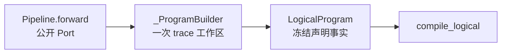
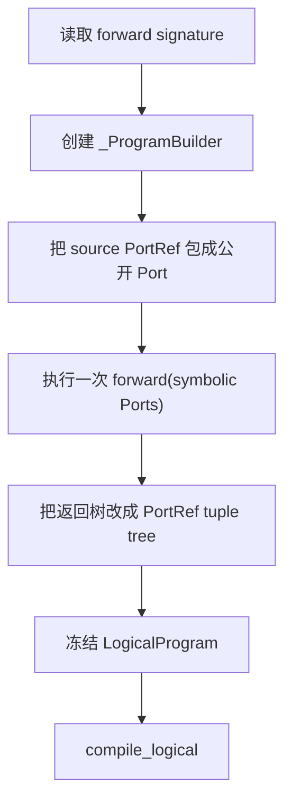

# 01：逐段读懂 `api.py`——符号调用怎样变成 LogicalProgram

主源码：[`api.py`](../../rayorch/experimental/multigrain_v3_6/api.py)；配套薄封装：
[`functional.py`](../../rayorch/experimental/multigrain_v3_6/functional.py)。

这一篇只回答一个问题：用户在 `Pipeline.forward()` 里写下的一串普通 Python 调用，为什么
不会执行真实业务值，而是稳定地产生 Call、Port、Domain 与 Origin？

---

## 1. 先看职责边界

`api.py` 拥有的是一次 authoring trace 的可变工作区，最终产出冻结的 `LogicalProgram`。

它负责：

- 为 source、Call、Port、Domain 分配编译期身份；
- 校验用户传入的是当前 trace 的 `Port`；
- 把 positional/keyword/optional 输入记录成 `CallSpec`；
- 把 `F.*` 记录成显式 Origin 与 Domain 关系；
- 最终冻结声明图并调用固定 compiler pipeline。

它不负责：

- 计算 control closure、consumer reverse index 等派生事实；
- 创建 actor 或执行 UDF；
- 创建 Entity、Item 或 Grain；
- 决定 Filter/Reduce 的动态 outcome。



---

## 2. 源码地图

| 源码段 | 作用 | 读完应回答的问题 |
| --- | --- | --- |
| [`Port / OptionalInput`](../../rayorch/experimental/multigrain_v3_6/api.py#L33-L50) | 公开符号句柄 | 为什么 Port 不携带业务值？ |
| [`RayModule`](../../rayorch/experimental/multigrain_v3_6/api.py#L53-L93) | 声明 UDF 配方与物理选项 | 为什么调用模块时不会构造 actor？ |
| [`function`](../../rayorch/experimental/multigrain_v3_6/api.py#L96-L117) | 把普通 callable 包成 RayModule | decorator 两种写法如何归一？ |
| [`Pipeline.compile`](../../rayorch/experimental/multigrain_v3_6/api.py#L120-L153) | 建立并约束一次符号追踪 | trace 为什么一定被清理？ |
| [`_ProgramBuilder.__init__`](../../rayorch/experimental/multigrain_v3_6/api.py#L156-L179) | 创建 root Domain 与 source Ports | source 身份从哪里来？ |
| [`call`](../../rayorch/experimental/multigrain_v3_6/api.py#L196-L253) | 记录一个计算调用点 | 多输入、多输出如何影响身份？ |
| [`expand`](../../rayorch/experimental/multigrain_v3_6/api.py#L255-L307) | 创建 child Domain | aligned outputs 为什么共享 Domain？ |
| [`reduce/broadcast/filter`](../../rayorch/experimental/multigrain_v3_6/api.py#L309-L384) | 记录其他结构关系 | 哪些操作改变 Domain？ |
| [`normalize_outputs/build`](../../rayorch/experimental/multigrain_v3_6/api.py#L386-L412) | 冻结输出树与 LogicalProgram | 可变 builder 怎样与编译器隔离？ |
| [内部小工具](../../rayorch/experimental/multigrain_v3_6/api.py#L414-L449) | 分配 Ref、校验 owner、处理 optional | 哪些入口维持 authoring 不变量？ |

---

## 3. `Port` 为什么只有两个字段

源码核心是：

```python
@dataclass(frozen=True, slots=True)
class Port:
    ref: PortRef
    _owner: int
```

- `ref` 是该 Port 在当前 Program 内的稳定整数身份。
- `_owner` 是本次 trace 的身份，用来拒绝把另一个 Pipeline 编译产生的 Port 混进来。

`Port` 没有 `value`、`outcome`、`entity` 或 Ray `ObjectRef`。这是有意的：`forward()` 的工作是
声明“数据位置之间的关系”，不是运行数据。

例如：

```python
texts = self.ocr(pages)
```

这里 `pages` 和 `texts` 都是静态 Port。真正运行时才会出现：

```text
ItemRef(pages, page_entity_7)
ItemRef(texts, page_entity_7)
GrainRef(ocr_call, page_entity_7)
```

`OptionalInput` 也只是包装同一个 Port，它只把某个 Call 输入的 `InputMode` 从 REQUIRED 改为
OPTIONAL，不创建新 Port，也不改变 Domain。

---

## 4. `ContextVar`：为什么 RayModule 能找到当前 Builder

模块级 `_ACTIVE_TRACE` 保存当前上下文中的 `_ProgramBuilder`。`RayModule.__call__()` 本身没有
持有 Pipeline，因此它通过：

```python
builder = _ACTIVE_TRACE.get()
return builder.call(self, args, kwargs)
```

把符号调用交给当前 trace。

`Pipeline.compile()` 使用 token 和 `finally`：

```python
token = _ACTIVE_TRACE.set(builder)
try:
    result = self.forward(*sources)
finally:
    _ACTIVE_TRACE.reset(token)
```

这段的意义不是线程调度，而是**动态作用域**：

- 进入 `forward()` 前，RayModule/F.* 可以定位唯一 builder；
- 无论 forward 正常返回还是抛错，离开后都会恢复旧上下文；
- 在 `forward()` 外误调用 RayModule 或 F.* 会立即得到 `CompileError`。

因此 builder 不需要被塞进每个 `Port` 或 `RayModule`，也不会成为长期全局可变单例。

---

## 5. `RayModule` 保存配方，不保存 actor

`RayModule` 的四类字段分别是：

| 字段 | 含义 | 最终去向 |
| --- | --- | --- |
| `udf` | callable 或 UDF class | `UdfSpec.target` |
| `num_outputs` | 逻辑输出 Port 数 | builder 创建多个 `CallOutputOrigin` |
| `init_args/init_kwargs` | Worker 构造参数 | `UdfSpec`，执行层再实例化 |
| `options` | pool/Ray 物理配置 | compiler lower 成 `ActorPoolSpec` |

所以：

```python
self.ocr = RayModule(OCR).pre_init(model_path).ray_options(
    replicas=4,
    batch_size=16,
)
```

只是建立一个可复用配方。直到 `Executor` 创建 actor pool 时，`OCR(model_path)` 才真正执行。

`returns(2)` 只声明一次 Call 有两个逻辑输出：

```python
texts, confidences = self.ocr.returns(2)(pages)
```

它不会创建两个 Call；二者拥有不同 `PortRef`，但共同指向同一个 `CallRef`，运行时同一个
`GrainRef(call, entity)` 原子地产生两份 Item。

---

## 6. `Pipeline.compile()`：一次 trace 的入口和出口

编译入口先检查 `forward()`：

- 至少有一个 source 参数；
- 只允许 positional-only 或 positional-or-keyword 参数；
- 每个参数名成为一个 `SourceOrigin(index, name)`。

然后按以下顺序执行：



注意“执行 `forward()`”不等于执行数据。它只是让普通 Python 控制流依次调用 builder；因此
`forward()` 不应根据真实 payload 写动态分支。

---

## 7. Builder 初始化：先建立坐标系

`_ProgramBuilder.__init__()` 创建三组计数器：

- `next_port`：下一个 `PortRef`；
- `next_call`：下一个 `CallRef`；
- `next_domain`：下一个 `DomainRef`，从 1 开始，因为 0 是 root。

每个 source 都被放入 `DomainRef(0)`：

```text
pdfs       -> PortRef(0), DomainRef(0), SourceOrigin(0, "pdfs")
metadata   -> PortRef(1), DomainRef(0), SourceOrigin(1, "metadata")
```

这里同时存在三个“编号”并不冗余：source index 表示用户参数顺序，PortRef 表示图上位置，
DomainRef 表示 Entity 对齐空间。它们可能当前数值碰巧相同，但语义不能互换。

`_view_intern` 用结构签名复用完全相同的 F.* view。例如对同一 source/mask 重复调用
`F.filter`，会返回同一个逻辑 Port，而不是制造两个等价节点。

---

## 8. `call()`：从 Python 调用形状到一个 CallSpec

以：

```python
texts = self.ocr(pages, language=languages)
```

为例，`call()` 分五步。

### 8.1 校验并拆分输入

positional 输入和 keyword 输入分开保存。每个值经 `_input()` 变成：

```text
CallInputSpec(port=..., mode=REQUIRED | OPTIONAL)
```

keyword 名保存在外层 `(name, CallInputSpec)`，不会在 value 对象中重复一份。

### 8.2 检查 Domain 对齐

所有输入必须属于同一 Domain。否则 builder 不猜 join 规则，而是要求用户显式写
`broadcast`、`reduce` 或建立 aligned relation。

### 8.3 分配 CallRef

一个源代码调用点得到一个 `CallRef`。同一个 RayModule 在 `forward()` 中调用两次，会得到
两个 Call，也会在 RuntimePlan 中得到两个独立 actor pool 合同。

### 8.4 冻结 UDF 配方和输入 ABI 来源

builder 创建 `UdfSpec` 与 `CallSpec`：

```text
CallSpec
├── ref
├── udf
├── execution_domain
├── args
└── kwargs
```

### 8.5 为每个输出创建 Port

每个输出得到：

```text
PortSpec(output_ref, execution_domain, CallOutputOrigin(call, output_index))
```

因此多输入不会增加 Grain 数，多输出也不会增加 Grain 数。对每个 Entity，仍只有
`GrainRef(CallRef, EntityRef)` 一次逻辑计算。

---

## 9. 四种 F.* 怎样影响 Domain

`functional.py` 只是一层很薄的公开函数；真正建图逻辑仍集中在 `_ProgramBuilder`。

| 操作 | 输入约束 | 输出 Domain | 是否创建 Call |
| --- | --- | --- | ---: |
| `expand` | group Port 必须来自 Call output | 新 child Domain | 否 |
| `reduce` | value/members 位于同一 child Domain | 直接 parent Domain | 否 |
| `broadcast` | source Domain 是 target 的祖先 | target Domain | 否 |
| `filter` | source/mask 位于同一 Domain | 原 Domain | 否 |

### Expand

`expand_aligned(a, b)` 只允许同一 producer Call 的不同输出，并为二者创建同一个 child
Domain。这样运行时不是靠“碰巧长度相等”对齐，而是由共享 Expansion 身份表达关系。

一个 group Port 只能声明一次 Expand relation；要再次使用应复用已有 expanded Port。

### Reduce

Reduce 只回收一级 Domain。`members` 明确决定哪些 child 是成员；省略时默认使用第一个 value
Port。它不执行 sum，也不创建 UDF。

### Broadcast

source 和 target 已在同一 Domain 时直接返回 source Port；source 是祖先时才创建
`BroadcastOrigin`。payload 不在建图期复制。

### Filter

Filter 只记录 source/mask 关系，Domain 保持不变。它不会删除 Entity；运行时只改变目标
Item 的 outcome。

---

## 10. `build()`：可变工作区到不可变事实

`normalize_outputs()` 只接受 Port 或非空 tuple 树，以保留多输出的公开结构。`build()` 随后用
`freeze_mapping()` 复制并冻结 builder 的 calls/ports/domains：

```python
logical = LogicalProgram(
    calls=freeze_mapping(self.calls),
    ports=freeze_mapping(self.ports),
    domains=freeze_mapping(self.domains),
    source_ports=self.source_ports,
    output_tree=output_tree,
)
```

复制很重要：编译器读取的是冻结快照，而不是 builder 仍能修改的 dict。`call_options` 另行传给
compiler，是因为 actor pool 是物理配置，不属于 LogicalProgram 的逻辑图事实。

---

## 11. 跟踪 PDF 例子

对共同例子，builder 大致产生：

```text
d0 root
├── p0 source(pdfs)
├── c0 render(d0) -> p1 page_groups
├── d1 expand(parent=d0)
│   ├── p2 expand(p1) pages
│   ├── c1 keep(d1) -> p3 keep_masks
│   ├── p4 filter(p2, p3) kept_pages
│   └── c2 ocr(d1) -> p5 texts
└── p6 reduce(value=p5, members=p4) text_groups
```

这仍然只是静态声明。`page_7` 这样的 Entity、`ItemRef(p5, page_7)` 和 OCR Grain 都要等
runtime admission/Expand 后才出现。

---

## 12. 修改 `api.py` 前的检查清单

- 新公开语法是否只增加声明事实，而不是偷偷执行业务数据？
- 新 Port 是否有唯一 `PortOrigin`，且 Domain 变化明确？
- 是否需要新 Port，还是只改变 Call input mode？
- 同一结构表达式是否应被 intern？
- 多输入是否保持同 Domain 合同？
- builder 是否只记录 source of truth，把 derived fact 留给 analysis？
- 物理配置是否仍走 `call_options → lowering → ActorPoolSpec`？

如果一个 feature 需要在 `api.py` 里创建 Entity、计算 outcome 或访问 Ray，它几乎肯定放错层。

下一篇：[02：固定编译流水线](02_compiler_pipeline.md)。
