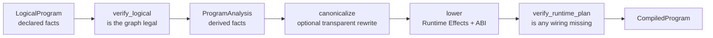

# 02. Compiler pipeline: logical declarations to a runtime plan

The fixed pipeline is implemented in `program/compiler.py`, with data
structures in `logical.py` and `plan.py`. The Chinese version is retained as
[`02_compiler_pipeline.zh.md`](02_compiler_pipeline.zh.md).

## At a glance

```text
trace -> verify -> analyze -> optional canonicalize -> lower -> verify
```

`LogicalProgram` owns calls, ports, domains, and origins. `ProgramAnalysis`
computes uses, outputs, expansion sources, and control demand. Lowering turns
those facts into immutable effects, trigger indexes, worker layouts, and actor
pool specifications. The final verifier checks that every referenced fact has
been lowered.

`semantics.py` is the exhaustive registry for Source, CallOutput, Expand,
Reduce, Broadcast, and Filter. A new primitive must add a semantic entry,
analysis/lowering support, and verifier and runtime tests; an isolated runtime
branch is not sufficient.

`optimize=False` is the correctness baseline. It shares verification, analysis,
and lowering with the optimized path and disables only transparent
canonicalization. The current rewrite folds a broadcast chain without removing
logical ports or failure boundaries.

`CompiledProgram.explain_text()` is derived from the frozen plan and is useful
for review. It is not an alternate interpreter.

---

## 02. Reading the fixed compiler pipeline section by section — how a LogicalProgram becomes a RuntimePlan

Main sources:

- [`compiler.py`](../../rayorch/experimental/multigrain_v3_6/program/compiler.py)
- [`analysis.py`](../../rayorch/experimental/multigrain_v3_6/program/analysis.py)
- [`verify.py`](../../rayorch/experimental/multigrain_v3_6/program/verify.py)
- [`lowering.py`](../../rayorch/experimental/multigrain_v3_6/program/lowering.py)

These four files must be read as one whole. `compiler.py` is only 37 lines precisely because the order of the compilation stages is explicitly fixed; treating each step as a pluggable framework would instead obscure the V3.6 contract.

---

### 1. The real problem the compiler solves

`LogicalProgram` is good at answering "what did the user declare":

```text
Port p4 comes from Filter(source=p2, mask=p3), in Domain d1
```

The runtime should not reinterpret Origin, scan consumers, or chase control demand every time it receives an Item. The compiler therefore turns that into directly executable wiring:

```text
when p2 Item publishes -> apply this exact FilterEffect
when p3 Item publishes -> apply the same FilterEffect object
```



The primary benefit of the compiler is correctness and inter-layer decoupling; the only current optimization is transparent Broadcast chain folding.

---

### 2. Do not confuse the four core objects

| Object | What it holds | Lifecycle | Is it a source of truth |
| --- | --- | --- | --- |
| `LogicalProgram` | Call/Port/Domain/Origin/output tree | retained after compilation | the truth of the user declaration |
| `ProgramAnalysis` | consumers, control closure, Call outputs, group depth | discardable and recomputable | a derived snapshot, not a second declaration |
| `RuntimePlan` | Effect, trigger indexes, Worker layout, actor pool | reused across executions | the truth of runtime wiring |
| `ProgramExplanation` | read-only explanation of logical→physical | used for diagnostics | does not participate in execution |

The same fact must not be duplicated in mutable form across the four. Analysis can be recomputed from `LogicalProgram`; `RuntimePlan` is a verified physical projection; Explanation only describes and never drives the Engine.

---

### 3. `compiler.py`: 37 lines are the complete order

The source entry [`compile_logical()`](../../rayorch/experimental/multigrain_v3_6/program/compiler.py#L21-L34)
can almost be transliterated line by line:

```python
_verify_logical(logical)
analysis = _analyze(logical)
canonical = _canonicalize(logical, analysis, enabled=optimize)
plan, explanation = _lower(logical, analysis, canonical, call_options)
_verify_runtime_plan(logical, analysis, plan)
return CompiledProgram(logical, analysis, plan, explanation)
```

There are three key points:

1. Verify the `LogicalProgram` first, and only then run analysis, so that facts are never derived on a broken graph.
2. `optimize=False` only disables the canonical rewrite; it does not skip analysis/lowering/verifier.
3. Verify again after lowering, specifically to catch wiring that the compiler itself missed.

This is not an LLVM-style PassManager. A new stage must have clear global necessity; an arbitrary pass ordering must not be introduced just for one local feature.

---

### 4. `verify_logical()`: proving that the user-declared graph is interpretable

Source: [`verify.py L26-L147`](../../rayorch/experimental/multigrain_v3_6/program/verify.py#L26-L147).

#### 4.1 Graph identity and the Domain tree

The first section checks that each mapping key agrees with the object's own `ref`, and proves:

- there is at least one source Port;
- there is exactly one root Domain;
- every parent Domain exists;
- following the parent chain never forms a cycle.

Why check both the key and `ref`? Because `ports[p3] = PortSpec(ref=p8, ...)` makes every later index semantically ambiguous; rejecting it as early as possible keeps the error close to the place that created it.

#### 4.2 Call alignment and the unified DAG

`_verify_acyclic()` does not look only at structural Origin. For a Call output, it also adds the Call inputs that produce that output as dependencies:

```text
CallOutput p5
└── producing Call c2
    └── input p4
```

In this way Calls and F.* together form one Port dependency DAG, so there is no missed case of "the structural graph is acyclic, but a cycle forms by going around the Call".

Each Call input must also live in the Call's `execution_domain`, so that the runtime never indexes incompatible inputs with the same EntityRef.

#### 4.3 Source admission contract

A source must:

- really be a `SourceOrigin`;
- have contiguous indexes starting from 0;
- live entirely in the root Domain.

This lets `Executor.run(*source_columns)` simply zip in order, with no extra name-matching protocol.

#### 4.4 Local contracts of each primitive

An exhaustive `match` over `PrimitiveKind` is used here:

| Primitive | What the verifier proves |
| --- | --- |
| Source | lives in the root Domain |
| CallOutput | the Call exists, and the output Domain and the Call Domain are the same |
| Expand | the source is a Call output; the child's parent is correct; a group does not drive two Expands |
| Reduce | value/members are in the same child Domain; the target is their direct parent |
| Broadcast | the source is an ancestor of the target; the same-Domain case is already eliminated by the builder |
| Filter | source/mask/target are all in the same Domain |

When adding a new primitive, "default pass" is not allowed here. Its reference and Domain contracts must be stated explicitly.

#### 4.5 Call outputs and the public output closure

Each Call's output indexes must be contiguous from 0 and non-empty; every PortRef in the output tree must exist. This guarantees that both Worker-returned columns and public outputs can be located stably.

---

### 5. `analyze()`: derive only facts that can be recomputed

Source: [`analysis.py L42-L124`](../../rayorch/experimental/multigrain_v3_6/program/analysis.py#L42-L124).

Analysis has four sections.

#### 5.1 Uniform Origin decoding

Each `PortOrigin` is turned into `PrimitiveSemantics` only through `semantics.describe_origin()`. Analysis does not write a new set of `isinstance(FilterOrigin)` logic, so a primitive's input roles, control demand, and control predecessors have exactly one semantic definition.

#### 5.2 Build reverse uses and output indexes

The forward declaration:

```text
p4 = Filter(p2, p3)
```

derives the reverse uses:

```text
p2 consumers += PrimitiveUse(p4, FILTER_SOURCE)
p3 consumers += PrimitiveUse(p4, FILTER_MASK)
```

Call inputs likewise become `CallUse(call, input_index)`. These uses are the uniform input from which lowering builds the trigger indexes, so no stage has to search the whole graph again.

Analysis also sorts outputs by Call output index, and records which group Ports report the Expansion for each child Domain.

#### 5.3 control demand fixed point

First collect the direct demand of every primitive, then propagate backwards along `control_predecessors` until no new Port is added:


This is why chained filters never miss control. The algorithm knows only the uniform `PrimitiveSemantics`, instead of writing scattered special branches inside analysis for Broadcast, Expand, and Filter.

If the demand reaches a group-valued Port that explicitly `rejects_control`, compilation reports an error immediately.

#### 5.4 group depth

The value of a Reduce may already be a group. The recursive `group_depth()` computes the nesting depth of every Port, which the runtime uses to build the canonical `NestedGroupLayout`. It carries a visiting set; although the verifier has already checked the DAG, this keeps the pure function locally safe.

---

### 6. `_canonicalize()`: only provably transparent rewrites

Source: [`lowering.py L35-L86`](../../rayorch/experimental/multigrain_v3_6/program/lowering.py#L35-L86).

Currently only the Broadcast chain is handled:

```text
p3 = broadcast(p0, child)
p4 = broadcast(p3, grandchild)

optimized:   p4 physical source = p0
unoptimized: p4 physical source = p3
```

Why it is safe: Broadcast calls no UDF, changes no outcome, and creates no members; it only projects an ancestor Item's binding, outcome, and required control onto descendant Entities.

Why the logical Port is not deleted directly: `LogicalProgram` and explain must still faithfully preserve the user declaration; the canonical form only changes the final physical source in the `RuntimePlan`.

`_CanonicalForm` stores only:

- the effective source of each Broadcast target;
- rewrite diagnostic records;
- whether it is currently optimized.

It is not another graph and holds no mutable runtime state.

---

### 7. `_lower()`: four phases that produce the complete RuntimePlan

Source: [`lowering.py L89-L277`](../../rayorch/experimental/multigrain_v3_6/program/lowering.py#L89-L277).

#### 7.1 Phase 1: create a unique Effect for each structural target

Lowering iterates `semantics_by_port` and creates one immutable Effect for each of Filter, Reduce, and Broadcast. Expand is placed separately into a source→ExpandEffect table, because it is committed atomically by a successful Worker report.

The most important invariant is:

```text
one structural target Port -> one Effect object
```

What different trigger indexes later reference is the **same object**, not a field-equal clone.

#### 7.2 Phase 2: build all trigger indexes from the reverse uses

Process each `LogicalUse`:

- `CallUse` → triggers a `CallInputEffect` when the source Item is published;
- Filter source/mask → both index to the same `FilterEffect`;
- Reduce value/members → both index to the same `ReduceEffect`;
- Broadcast → index by the effective source once canonicalization has completed;
- Expand group → an explicit `pass`, because the commit path is a Worker report, not an ordinary Item event.

This `pass` is a named, commented ownership choice, not "not implemented yet". That is also why the exhaustive `match` over `InputRole` is used: a newly added role must state which path commits it.

#### 7.3 Phase 3: compile the actor pool and the Worker ABI

`_compile_pool_spec()` extracts the fields the framework recognizes from `ray_options` into the strongly typed `ActorPoolSpec`:

```text
replicas / batch_size / batching_policy / recovery
```

The remaining fields are preserved as native Ray actor options. An ambiguous `max_retries` is rejected, requiring an explicit `RecoveryPolicy`.

`_compile_input_layout()` flattens `CallSpec.args/kwargs` into the dense layout used by the Worker: the number of positional arguments plus the ordered keyword names.

Each output's `CallOutputLayout` describes:

- the original output Port;
- whether it must report expanded child Ports;
- which scalar/expanded Ports must carry a bool control manifest.

The Worker therefore never has to read the `LogicalProgram`.

#### 7.4 Phase 4: freeze the whole execution contract at once

`RuntimePlan` contains both the canonical Effect catalog and the indexes built by trigger source. It looks like two containers, but it is not two sets of facts: the indexes hold references to the same Effect objects from the catalog.

Finally, a `PortExplanation` is created for every Port, recording the logical kind, Domain, inputs, physical rule, control demand, and rewrite. Explanation is never read by the Engine.

---

### 8. `verify_runtime_plan()`: verify that the compiler missed nothing

Source: [`verify.py L196-L297`](../../rayorch/experimental/multigrain_v3_6/program/verify.py#L196-L297).

It first checks the complete tables: every Call must have outputs, pool, and input/output layout, and every Port must have a Domain.

Then it verifies primitive by primitive:

- the structural target catalog has the correct type;
- every logical input can trigger the corresponding Effect;
- the extra Domain trigger index for Reduce/Broadcast exists;
- the trigger index points to the same Effect object in the catalog;
- every Call input has an exact `CallInputEffect(call, index)`;
- the Worker input layout matches `CallSpec`.

This is the static gate against "flywires": if lowering only patched a shortcut path for some feature without completing all the indexes and ABI contracts, compilation fails, instead of hanging later under some rare runtime ordering.

---

### 9. The compilation result for the PDF example

The logical Port `kept_pages = filter(pages, keep_masks)` roughly becomes:

```text
ProgramAnalysis
├── consumers[p2] += PrimitiveUse(p4, FILTER_SOURCE)
├── consumers[p3] += PrimitiveUse(p4, FILTER_MASK)
└── control_ports includes p3

RuntimePlan
├── structural_effects_by_target[p4] = effect_f4
├── item_effects_by_source[p2] includes effect_f4
└── item_effects_by_source[p3] includes effect_f4
```

`texts = ocr(kept_pages)` then produces:

```text
item_effects_by_source[p4] includes CallInputEffect(c2, input_index=0)
input_layouts_by_call[c2] = CallInputLayout(positional_count=1)
output_layouts_by_call[c2] = (CallOutputLayout(port=p5),)
```

The Engine only needs to look up the table by the published PortRef; it does not need to know `FilterOrigin` or to re-derive the input source of the OCR `CallSpec`.

---

### 10. Correct understanding of optimized/unoptimized

`optimize=False` is not a different runtime:

```text
same LogicalProgram
same verify_logical
same ProgramAnalysis
same lowering schema
same verify_runtime_plan
only canonical effective Broadcast source differs
```

Therefore unoptimized is the correctness baseline. Any rewrite should simultaneously satisfy:

- public outputs are equivalent;
- ItemOutcome/Expansion/Entity semantics are equivalent;
- the Call/Grain count is not changed unintentionally;
- explain explicitly records the difference.

---

### 11. Checklist before modifying the compiler

- Does a newly declared fact enter the `LogicalProgram` first, instead of being pushed directly into the `RuntimePlan`?
- Is each new derived fact computed only in Analysis and recomputable?
- Does `describe_origin()` exhaustively declare the input roles and control semantics?
- Does the logical verifier prove that references, Domains, and the DAG are legal?
- Does every runtime target have exactly one complete Effect?
- Do all trigger indexes reference that Effect, rather than a field-equal copy?
- Is the Worker ABI generated explicitly by the compiler?
- Can the post-lowering verifier detect any missed wiring?
- Does `optimize=False` still traverse exactly the same correctness path?

If new logic can only be executed by having the Engine read Origin back, the `RuntimePlan` has not been lowered completely.

Next: [03: MicrobatchEngine semantic state machine](03_runtime_engine.md).
