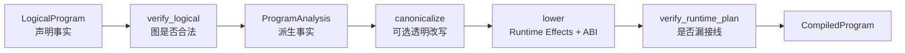
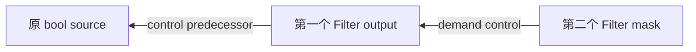

# 02：逐段读懂固定编译流水线——LogicalProgram 怎样变成 RuntimePlan

主源码：

- [`compiler.py`](../../rayorch/experimental/multigrain_v3_6/program/compiler.py)
- [`analysis.py`](../../rayorch/experimental/multigrain_v3_6/program/analysis.py)
- [`verify.py`](../../rayorch/experimental/multigrain_v3_6/program/verify.py)
- [`lowering.py`](../../rayorch/experimental/multigrain_v3_6/program/lowering.py)

这四个文件要作为一个整体阅读。`compiler.py` 只有 37 行，正因为编译阶段的顺序是显式固定
的；如果把每一步单独当作可插拔框架，反而会掩盖 V3.6 的合同。

---

## 1. 编译器解决的真实问题

`LogicalProgram` 适合回答“用户声明了什么”：

```text
Port p4 comes from Filter(source=p2, mask=p3), in Domain d1
```

Runtime 不应每收到一个 Item 都重新解释 Origin、扫描消费者或追 control demand。因此编译器
把它变成直接可执行的接线：

```text
when p2 Item publishes -> apply this exact FilterEffect
when p3 Item publishes -> apply the same FilterEffect object
```



编译器的首要收益是正确性与层间解耦；当前优化只有透明 Broadcast 链折叠。

---

## 2. 四个核心对象不要混淆

| 对象 | 保存什么 | 生命周期 | 是不是 source of truth |
| --- | --- | --- | --- |
| `LogicalProgram` | Call/Port/Domain/Origin/output tree | 编译后保留 | 用户声明的真相 |
| `ProgramAnalysis` | consumers、control closure、Call outputs、group depth | 可丢弃重算 | 派生快照，不是第二份声明 |
| `RuntimePlan` | Effect、触发索引、Worker layout、actor pool | 每次执行复用 | runtime 接线真相 |
| `ProgramExplanation` | logical→physical 的只读解释 | 诊断使用 | 不参与执行 |

同一个事实不应在四者中以可变形式重复。Analysis 可以由 LogicalProgram 重算；RuntimePlan 是
经过验证的物理投影；Explanation 只描述，不驱动 Engine。

---

## 3. `compiler.py`：37 行就是完整顺序

源码入口
[`compile_logical()`](../../rayorch/experimental/multigrain_v3_6/program/compiler.py#L21-L34)
几乎可以逐行直译：

```python
_verify_logical(logical)
analysis = _analyze(logical)
canonical = _canonicalize(logical, analysis, enabled=optimize)
plan, explanation = _lower(logical, analysis, canonical, call_options)
_verify_runtime_plan(logical, analysis, plan)
return CompiledProgram(logical, analysis, plan, explanation)
```

关键点有三个：

1. 先验证 LogicalProgram，再做 analysis，避免在坏图上推导事实。
2. `optimize=False` 只关闭 canonical rewrite，不跳过 analysis/lowering/verifier。
3. lowering 后再次验证，专门捕获 compiler 自己漏掉的接线。

这不是 LLVM 式 PassManager。新增阶段必须有明确的全局必要性，不能仅为了一个局部 feature
引入任意 pass 排序。

---

## 4. `verify_logical()`：证明用户声明图可解释

源码：[`verify.py L26-L147`](../../rayorch/experimental/multigrain_v3_6/program/verify.py#L26-L147)。

### 4.1 Graph identity 与 Domain tree

第一段检查 mapping key 与对象自身 `ref` 一致，并证明：

- 至少有一个 source Port；
- 恰好一个 root Domain；
- 每个 parent Domain 存在；
- 沿 parent 链不会形成环。

为什么需要同时检查 key 和 `ref`？因为 `ports[p3] = PortSpec(ref=p8, ...)` 会让所有后续索引
语义变得含糊；越早拒绝，错误越接近制造点。

### 4.2 Call alignment 与统一 DAG

`_verify_acyclic()` 不只看 structural Origin。对一个 Call output，它还把产生该 output 的 Call
inputs 加入 dependency：

```text
CallOutput p5
└── producing Call c2
    └── input p4
```

这样 Call 与 F.* 共同形成一张 Port dependency DAG，不会出现“结构图无环，但绕过 Call 后
形成环”的漏检。

每个 Call input 还必须位于 Call 的 `execution_domain`，避免 runtime 用同一个 EntityRef 去
索引不相容的输入。

### 4.3 Source admission contract

source 必须：

- 确实是 `SourceOrigin`；
- index 从 0 连续排列；
- 全部位于 root Domain。

这让 `Executor.run(*source_columns)` 可以只按顺序 zip，而不需要额外名字匹配协议。

### 4.4 每种 primitive 的局部合同

这里使用对 `PrimitiveKind` 的穷尽 `match`：

| Primitive | verifier 证明什么 |
| --- | --- |
| Source | 位于 root Domain |
| CallOutput | Call 存在，且 output/Call Domain 相同 |
| Expand | source 是 Call output；child 的 parent 正确；group 不驱动两次 Expand |
| Reduce | value/members 同 child Domain；target 是其直接 parent |
| Broadcast | source 是 target 祖先；同 Domain 情况已由 builder 消去 |
| Filter | source/mask/target 三者同 Domain |

新增 primitive 时不能在这里“默认 pass”。必须明确它的引用和 Domain 合同。

### 4.5 Call outputs 与公开输出闭包

每个 Call 的 output index 必须从 0 连续且非空；output tree 中每个 PortRef 必须存在。这保证
Worker 返回列与 public output 都能稳定定位。

---

## 5. `analyze()`：只推导可以重算的事实

源码：[`analysis.py L42-L124`](../../rayorch/experimental/multigrain_v3_6/program/analysis.py#L42-L124)。

Analysis 有四段。

### 5.1 Origin 统一解码

每个 `PortOrigin` 只通过 `semantics.describe_origin()` 变成 `PrimitiveSemantics`。Analysis 不写
一套新的 `isinstance(FilterOrigin)` 逻辑，因此 primitive 的输入角色、control demand 和
control predecessor 只有一份语义定义。

### 5.2 建 reverse uses 与 output indexes

正向声明：

```text
p4 = Filter(p2, p3)
```

会派生反向使用：

```text
p2 consumers += PrimitiveUse(p4, FILTER_SOURCE)
p3 consumers += PrimitiveUse(p4, FILTER_MASK)
```

Call inputs 同理变成 `CallUse(call, input_index)`。这些 use 是 lowering 建触发索引的统一输入，
不用各阶段再次全图搜索。

Analysis 还按 Call output index 排序输出，并记录每个 child Domain 由哪些 group Port 报告
Expansion。

### 5.3 control demand fixed point

先收集所有 primitive 的直接 demand，再沿 `control_predecessors` 反向传播直到不再新增 Port：



这就是 chained filter 不漏 control 的原因。算法只认识统一 `PrimitiveSemantics`，而不是在
analysis 中为 Broadcast、Expand、Filter 分散写特殊分支。

若 demand 到达一个明确 `rejects_control` 的 group-valued Port，会在编译期报错。

### 5.4 group depth

Reduce 的 value 可能已经是 group。递归 `group_depth()` 计算每个 Port 的嵌套深度，供 runtime
构造规范 `NestedGroupLayout`。它带 visiting set，虽然 verifier 已检查 DAG，仍保持纯函数局部安全。

---

## 6. `_canonicalize()`：只做可证明透明的 rewrite

源码：[`lowering.py L35-L86`](../../rayorch/experimental/multigrain_v3_6/program/lowering.py#L35-L86)。

当前只处理 Broadcast chain：

```text
p3 = broadcast(p0, child)
p4 = broadcast(p3, grandchild)

optimized:   p4 physical source = p0
unoptimized: p4 physical source = p3
```

为什么安全：Broadcast 不调用 UDF、不改变 outcome、不创建成员，只把祖先 Item 的 binding、
outcome 和必要 control 投影到后代 Entity。

为什么不直接删除逻辑 Port：LogicalProgram 和 explain 仍需忠实保留用户声明；canonical form 只
改变 RuntimePlan 中最终 physical source。

`_CanonicalForm` 只保存：

- 每个 Broadcast target 的 effective source；
- rewrite 诊断记录；
- 当前是否 optimized。

它不是另一张图，也没有可变 runtime 状态。

---

## 7. `_lower()`：四阶段生成完整 RuntimePlan

源码：[`lowering.py L89-L277`](../../rayorch/experimental/multigrain_v3_6/program/lowering.py#L89-L277)。

### 7.1 Phase 1：每个 structural target 创建唯一 Effect

Lowering 遍历 `semantics_by_port`，为 Filter、Reduce、Broadcast 各创建一个不可变 Effect。
Expand 因为由 Worker successful report 原子提交，单独放入 source→ExpandEffect 表。

最重要的不变量是：

```text
one structural target Port -> one Effect object
```

后续不同触发索引引用的是**同一个对象**，不是字段相等的 clone。

### 7.2 Phase 2：由 reverse uses 建全部触发索引

逐个处理 `LogicalUse`：

- `CallUse` → source Item 发布时触发 `CallInputEffect`；
- Filter source/mask → 都索引到同一个 `FilterEffect`；
- Reduce value/members → 都索引到同一个 `ReduceEffect`；
- Broadcast → canonicalization 完成后按 effective source 索引；
- Expand group → 明确 `pass`，因为提交路径是 Worker report，而不是普通 Item event。

这里的 `pass` 是有名字、有注释的 ownership 选择，不是“暂时没实现”。这也是为什么使用
`InputRole` 穷尽 match：新增角色必须说明由哪条路径提交。

### 7.3 Phase 3：编译 actor pool 与 Worker ABI

`_compile_pool_spec()` 把 `ray_options` 中框架认识的字段提取为强类型 `ActorPoolSpec`：

```text
replicas / batch_size / batching_policy / recovery
```

其余字段作为原生 Ray actor options 保留。含糊的 `max_retries` 被拒绝，要求使用明确
`RecoveryPolicy`。

`_compile_input_layout()` 把 `CallSpec.args/kwargs` 压成 Worker 使用的 dense layout：位置参数
数量加有序 keyword names。

每个 output 的 `CallOutputLayout` 则说明：

- 原始 output Port；
- 它是否需要报告 expanded child Ports；
- 哪些 scalar/expanded Ports 必须携带 bool control manifest。

Worker 因此不用读取 LogicalProgram。

### 7.4 Phase 4：一次冻结完整执行合同

`RuntimePlan` 同时包含 canonical Effect catalog 和按触发源建立的索引。看似有两份容器，但
不是两份事实：索引保存的是 catalog 中同一 Effect 对象的引用。

最后为每个 Port 创建 `PortExplanation`，记录 logical kind、Domain、inputs、physical rule、
control demand 与 rewrite。Explanation 不被 Engine 读取。

---

## 8. `verify_runtime_plan()`：验证 compiler 没漏项

源码：[`verify.py L196-L297`](../../rayorch/experimental/multigrain_v3_6/program/verify.py#L196-L297)。

它先检查完整表：每个 Call 都必须有 outputs、pool、input/output layout，每个 Port 都必须有
Domain。

随后逐 primitive 验证：

- structural target catalog 类型正确；
- 每个逻辑输入都能触发对应 Effect；
- Reduce/Broadcast 额外的 Domain trigger index 存在；
- trigger index 指向 catalog 中同一个 Effect object；
- 每个 Call input 有精确 `CallInputEffect(call, index)`；
- Worker input layout 与 `CallSpec` 一致。

这是防“飞线”的静态门禁：如果 lowering 为某个 feature 只补了一条快捷路径，却没完成所有
索引和 ABI 合同，编译就失败，而不是等某种稀有 runtime 顺序才挂住。

---

## 9. 跟踪 PDF 例子的编译结果

逻辑 Port `kept_pages = filter(pages, keep_masks)` 大致变成：

```text
ProgramAnalysis
├── consumers[p2] += PrimitiveUse(p4, FILTER_SOURCE)
├── consumers[p3] += PrimitiveUse(p4, FILTER_MASK)
└── control_ports includes p3

RuntimePlan
├── structural_effects_by_target[p4] = effect_f4
├── item_effects_by_source[p2] includes effect_f4
└── item_effects_by_source[p3] includes effect_f4
```

`texts = ocr(kept_pages)` 则产生：

```text
item_effects_by_source[p4] includes CallInputEffect(c2, input_index=0)
input_layouts_by_call[c2] = CallInputLayout(positional_count=1)
output_layouts_by_call[c2] = (CallOutputLayout(port=p5),)
```

Engine 只需按发布的 PortRef 查表，不需要认识 `FilterOrigin` 或重新查 OCR CallSpec 的输入来源。

---

## 10. optimized/unoptimized 的正确理解

`optimize=False` 不是另一套 runtime：

```text
same LogicalProgram
same verify_logical
same ProgramAnalysis
same lowering schema
same verify_runtime_plan
only canonical effective Broadcast source differs
```

因此 unoptimized 是 correctness baseline。任何 rewrite 都应同时满足：

- public output 等价；
- ItemOutcome/Expansion/Entity 语义等价；
- Call/Grain 数不被无意改变；
- explain 明确记录差异。

---

## 11. 修改编译器前的检查清单

- 新声明事实是否先进入 LogicalProgram，而不是直接塞 RuntimePlan？
- 新 derived fact 是否只在 Analysis 中计算且可重算？
- `describe_origin()` 是否穷尽声明输入角色与 control 语义？
- logical verifier 是否证明引用、Domain 与 DAG 合法？
- 每个 runtime target 是否只有一个完整 Effect？
- 所有触发索引是否引用该 Effect，而非复制字段相等对象？
- Worker ABI 是否由 compiler 明确生成？
- lowering 后 verifier 是否能检测任何漏接线？
- optimize=False 是否仍走完全相同的正确性路径？

新增逻辑若只能靠 Engine 回读 Origin 才能执行，说明 RuntimePlan 还没有 lower 完整。

下一篇：[03：MicrobatchEngine 语义状态机](03_runtime_engine.md)。
