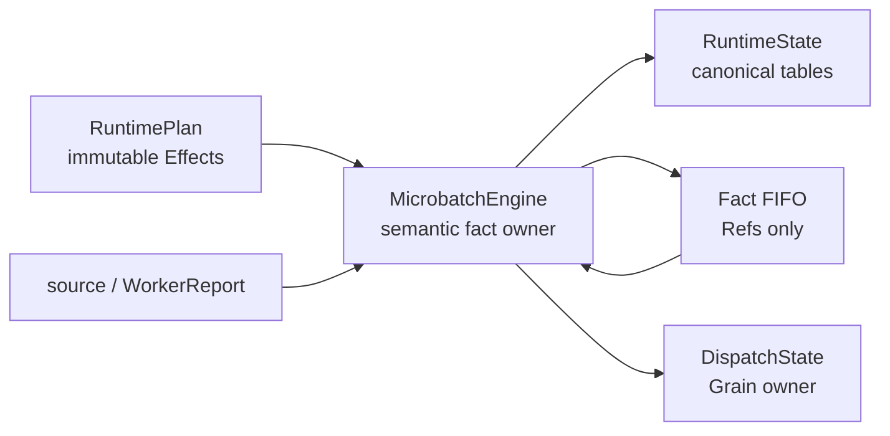
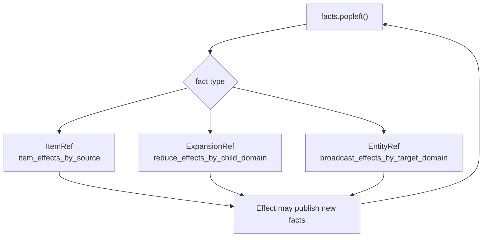
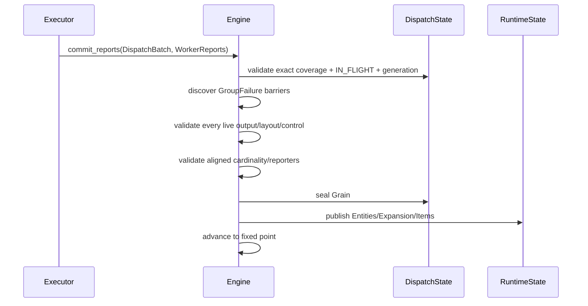
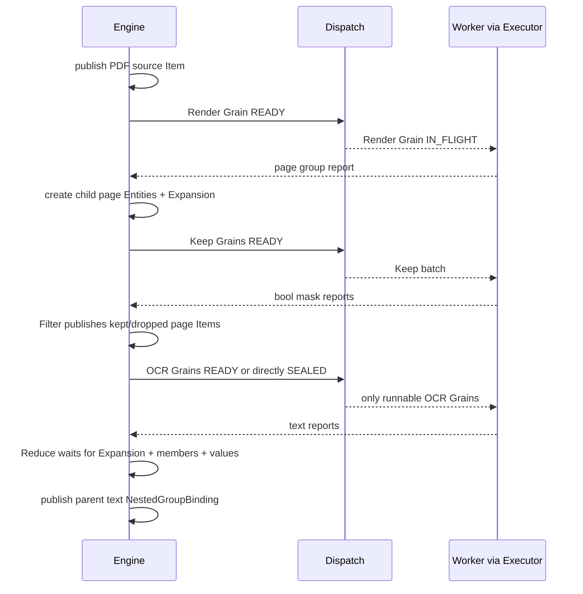

# 03. Runtime engine: semantic facts and fixed-point propagation

[`runtime/engine.py`](../../rayorch/experimental/multigrain_v3_6/runtime/engine.py)
owns one microbatch's mutable semantic tables. The Chinese walkthrough is
retained as [`03_runtime_engine.zh.md`](03_runtime_engine.zh.md).

## At a glance

The engine is a single writer. Item, expansion, and entity publications enter
one private fact FIFO. `advance()` consumes the FIFO and applies the precompiled
effect indexes until no new fact remains. Facts are notifications; canonical
tables hold the state.

The engine distinguishes `Domain`, `Entity`, `Item`, `Grain`, and `Expansion`.
Structural effects use explicit parent and ordinal relationships, so nested
expand/reduce/broadcast operations do not depend on Python object identity.

Every item ends in exactly one of `PRESENT`, `DROPPED`, `FAILED`, or
`SUPPRESSED`. Multi-output reports are validated before any output is published.
Repeated terminal publication is idempotent; contradictory publication is
rejected.

`GroupFailure` writes a direct-parent barrier into the same engine state. The
dispatch dequeue barrier check uses it to seal ready siblings, while the commit
path rechecks it for late in-flight reports. No actor is killed and no committed
result is rolled back.

Tests should exercise empty domains, nested relationships, repeated facts,
atomic reports, and a late report racing a suppression barrier.

---

## 03. Reading `runtime/engine.py` section by section — the semantic state machine of a single microbatch

Main source: [`runtime/engine.py`](../../rayorch/experimental/multigrain_v3_6/runtime/engine.py).

This is the largest file in V3.6 and the one most worth understanding in segments. It is long not because it simultaneously carries Ray, the compiler, and the Worker, but because it centrally owns the publication order of all dynamic **semantic facts** inside one microbatch: Item, Expansion, Entity, ValueBinding, and lineage.

---

### 1. Responsibility in one sentence

`MicrobatchEngine` is the single-writer event state machine of one source microbatch: it takes a frozen `RuntimePlan`, publishes source/Worker reports as canonical facts, and then applies Effects until a local fixed point.

It owns:

- `RuntimeState.items/values/expansions/pending_grains/entity_lineage`;
- the Domain→Entity enumeration index;
- the fact FIFO, which carries only Refs;
- source admission, Worker report semantic commit, and materialization projection;
- interpretation of the Filter/Reduce/Broadcast/Call-input Effects.

It composes but does not own:

- Grain phase, generation, and runnable queues inside `DispatchState`.

It explicitly does not own:

- Logical Origin and compiler analysis;
- actor handles, Ray ObjectRef RPCs, and actor capacity;
- UDF execution and the interpretation of batch Python values;
- the pure decision logic of the recovery policy.

Before continuing into the source, separate the three most easily confused terms in one sentence: the canonical table holds "complete facts that already hold", the `_fact_queue` FIFO holds "fact identities that already hold but are still pending propagation", and `advance()` repeatedly consumes those identities and applies Effects until the FIFO is empty. Every publication described below lives inside this closed loop.



---

### 2. Source map

| Source section | Main responsibility | When to read |
| --- | --- | --- |
| [private commit DTOs and FactEvent](../../rayorch/experimental/multigrain_v3_6/runtime/engine.py#L73-L81) | stage complex reports as intents; sealed fact types | first pass |
| [`__init__` and read-only projections](../../rayorch/experimental/multigrain_v3_6/runtime/engine.py#L84-L303) | build the state owner and expose narrow interfaces to the Executor/materializer | skim on the first pass |
| [`admit_sources`](../../rayorch/experimental/multigrain_v3_6/runtime/engine.py#L307-L347) | atomically admit row-aligned sources | first pass |
| [`advance/_apply_item_effect`](../../rayorch/experimental/multigrain_v3_6/runtime/engine.py#L349-L388) | the only fact fixed-point loop | read closely |
| [`commit_reports`](../../rayorch/experimental/multigrain_v3_6/runtime/engine.py#L431-L491) | whole-batch preflight, barrier discovery, and mutation frontier | read closely |
| [failure/recovery boundary](../../rayorch/experimental/multigrain_v3_6/runtime/engine.py#L543-L608) | semantic failure publication and Dispatch recovery actions | second pass |
| [Item/Expansion publication gateway](../../rayorch/experimental/multigrain_v3_6/runtime/engine.py#L610-L678) | the only publication entry point for canonical facts | read closely |
| [Call input interpreter](../../rayorch/experimental/multigrain_v3_6/runtime/engine.py#L682-L761) | how Item facts form READY/SEALED Grains | read closely |
| [Filter](../../rayorch/experimental/multigrain_v3_6/runtime/engine.py#L763-L807) | same-Entity source/mask reduction | second pass |
| [Reduce](../../rayorch/experimental/multigrain_v3_6/runtime/engine.py#L809-L882) | Expansion/members/values restore the group | second pass, read closely |
| [Broadcast](../../rayorch/experimental/multigrain_v3_6/runtime/engine.py#L884-L922) | dual-trigger projection over source and target Entity | second pass |
| [Entity/lineage](../../rayorch/experimental/multigrain_v3_6/runtime/engine.py#L924-L986) | stable child identity and ancestor navigation | second pass |

---

### 3. Inventory the data structures before reading the control flow

#### 3.1 Core state in the constructor

```python
self.plan = plan
self._state = RuntimeState()
self._dispatch = DispatchState()
self._suppression_barriers = _SuppressionBarrierIndex()
self._fact_queue = deque()
self._entities_by_domain = defaultdict(dict)
self._admission_closed = False
```

Each of them answers a different question:

| Field | Question it answers | Why it is not duplicate state |
| --- | --- | --- |
| `plan` | which Effects should fire after a given fact is published? | static read-only wiring |
| `_state` | which Item/Expansion/value/lineage facts currently exist? | canonical dynamic semantic table |
| `_dispatch` | which Grains are READY/IN_FLIGHT/SEALED? | independent physical scheduling owner |
| `_suppression_barriers` | which Call + direct parent has already been isolated? | stores only monotone barriers, does not copy Grain state |
| `_fact_queue` | which new facts have not been propagated yet? | transient notification, stores only Refs |
| `_entities_by_domain` | which Entities does a given Domain already have? | enumeration index over canonical lineage |

`_fact_queue` stores no outcome, binding, or children, so it is not a second source of truth. When handling an event, always take the Ref back to `_state` and read the canonical record.

`_entities_by_domain` looks derivable from lineage, but root Entities are not part of child lineage, and broadcast plus materialization frequently need enumeration by Domain; it is a necessary index maintained by the Engine itself and is not duplicated in other components.

#### 3.2 How many queues or waiting structures are there really?

Looking at `MicrobatchEngine` alone, it truly owns exactly one FIFO: `_fact_queue`. The other nearby kinds of "waiting" belong to different owners and must not all be lumped together as the Engine queue:

| Structure | Data structure | Owner | What it holds | When it leaves |
| --- | --- | --- | --- | --- |
| `_fact_queue` | `deque[ItemRef \| ExpansionRef \| EntityRef]` | Engine | fact identities that hold but are not yet propagated | consumed by `advance()` |
| `pending_grains` | `dict[GrainRef, PendingGrain]` | RuntimeState/Engine | slots not yet decided by the Call input algebra | the Grain becomes READY or directly SEALED |
| `_ready_fifo_by_call` | `dict[CallRef, deque[GrainRef]]` | DispatchState | first-time runnable Grains partitioned by Call | reserved, or suppressed by a parent barrier |
| `_immediate_retry_queue` | `deque[DispatchBatch]` | DispatchState | exact DispatchBatches that need priority retry | reserved |
| `_deferred_recovery_queue` | `deque[DispatchBatch]` | DispatchState | deferred or bisected recovery batches | reserved after READY work |
| `pending_rpcs` | `dict[ObjectRef, _PendingRpc]` | Executor | issued Ray RPCs that have not returned | `ray.wait/get` completes |

This table also explains why they cannot be merged into a single "task queue":

- `_fact_queue` schedules semantic propagation and does not imply that a Worker is needed;
- `pending_grains` is input-slot state and has no FIFO order;
- the three Dispatch queues schedule Grain phase;
- the Executor `pending_rpcs` map tracks physical RPCs, not semantic READY state.

#### 3.3 How the four kinds of dynamic facts transition

Before reading the following methods, memorize the shortest path of each state:

| Dynamic object | Initial representation | Allowed changes | Final stored location |
| --- | --- | --- | --- |
| Entity | absent from the table | absent → published | Domain index; children additionally carry lineage |
| Item | absent from the table | unresolved → exactly one terminal outcome | `RuntimeState.items`; PRESENT additionally carries a binding |
| Expansion | absent from the table | unresolved → SUCCEEDED/DROPPED/FAILED | `RuntimeState.expansions` |
| Grain | pending slots, or does not exist yet | WAITING → READY/SEALED; READY ↔ IN_FLIGHT → SEALED | `DispatchState` |

The first three kinds of publication may append a Ref to `_fact_queue`; Grain phase never enters `_fact_queue` — it cooperates with the Executor through the DispatchState queues. Admission, report commit, and the Effect interpreters below only manufacture new facts along these four state paths.

---

### 4. Read-only projections: why the first 200 lines are not business-logic bloat

[`ready_count` through `progress_summary`](../../rayorch/experimental/multigrain_v3_6/runtime/engine.py#L104-L303)
are mostly narrow interfaces; their purpose is to stop the Executor or the materializer from reading mutable internal dicts directly.

They can be understood in four sections.

#### 4.1 Counts and Grain snapshots

`entity_count/item_count/expansion_count/grain_count` are used for frozen metrics; the Grain snapshot delegates to `DispatchState` and never leaks the mutable `GrainRecord`.

#### 4.2 Dispatch facade

`dispatch_priority()` and `reserve_dispatch()` let the Executor choose work, but the actual queue/phase writes still live in DispatchState. The Engine does not copy the ready queue.

#### 4.3 Completion contract

`is_complete()` does not look only at the ready queue. It requires, in order:

- admission is closed;
- the fact FIFO is empty;
- there are no pending Call input slots;
- Dispatch has no runnable/recovery queue;
- every Grain is SEALED;
- every public output Port × Entity has a terminal Item.

Therefore "there is temporarily no READY Grain" is never mistaken for completion.

#### 4.4 Worker/materialization projections

`grain_invocation()` turns semantic Items into purely physical `RowBinding | NestedGroupInput | MissingInput`:

- REQUIRED/PRESENT or OPTIONAL/PRESENT → row/group binding;
- OPTIONAL/DROPPED → `MissingInput`;
- nested group → flattened leaf bindings + CSR offsets.

It does not read payloads; the Worker dereferences them through BlockStore.

`ordered_items()`, `value_binding()`, and `nested_group_rows()` serve final materialization. `release_values()` clears the binding table only after completion, preserving Item outcome, Entity, and Grain audit facts.

---

### 5. `admit_sources()`: where the dynamic world begins

Source admission first runs a complete preflight:

1. binding keys must exactly match the Program source Ports;
2. all source columns have the same row count;
3. controls are provided only for sources demanded by the compiler;
4. controls are row-aligned and strictly bool;
5. the current Engine has not yet admitted root Entities.

Only after the preflight passes does it publish:

```text
for each source row index i:
    publish EntityRef(root_domain, i)

for each source Port p and row i:
    publish ItemRef(p, entity_i) = PRESENT + RowBinding

advance()
```

Why is there no ordering dependency between publishing the Entity first and the Item second? The Entity event may attempt Broadcast first, but when the source Item does not exist yet it simply returns "wait"; afterwards the source Item event tries again through the other Broadcast source trigger. The two trigger paths together make publication order irrelevant.

---

### 6. `advance()`: the most important 25 lines in the file

There are only three fact types:

```python
_FactEvent = ItemRef | ExpansionRef | EntityRef
```

The loop takes one new fact and looks up the RuntimePlan index by type:



This loop forms a local fixed point: as long as some Effect publishes a new Item/Expansion/Entity, it is appended to the same FIFO until no new fact remains.

Why not call all downstream Effects recursively inside `_publish_item()`? The FIFO has three necessary roles:

- publication writes the complete canonical record first and only then enters propagation, so downstream never observes a half-built record;
- deep Pipelines do not depend on the Python recursion stack, and do not produce hard-to-trace reentrancy inside a single commit;
- the three fact kinds are dispatched uniformly from one exhaustive entry, so arrival order is testable and a newly added relation cannot secretly wire up a recursive shortcut.

Therefore `_fact_queue + advance()` is not an extra business concept; it is the minimal scheduling mechanism inside the Engine that separates "fact write" from "fact propagation". Removing it usually only scatters the same control flow back into every publication method.

`_apply_item_effect()` performs an exhaustive match over the sealed `ItemEffect` union:

- `CallInputEffect` → fill a Grain input slot;
- `FilterEffect` → try to decide the Filter target;
- `BroadcastEffect` → project from the source onto existing target Entities;
- `ReduceEffect` → find the parent and try to restore the group.

The Engine never reads `PortOrigin`, nor does it scatter reverse scans by Port type; if a newly added Effect is not handled exhaustively, type checking or `assert_never` will expose it.

---

### 7. `commit_reports()`: why the whole WorkerDispatchResult must be seen first

The whole WorkerDispatchResult is the highest-risk entry point in the file, because a single Grain can simultaneously produce:

- multiple output Ports;
- scalar or expanded rows;
- multiple aligned expanded Ports;
- control manifests;
- child Entities, parent group binding, and downstream propagation.

And a `GroupFailure` at the back of the same batch must also suppress an earlier same-parent success at the front of that batch. The Executor therefore no longer commits report by report; the source first validates pending RPC coverage, then discovers all barriers in stable DispatchBatch order, and only afterwards enters the mutation frontier.

#### 7.1 Phase 1: identity and barrier preflight

reports must correspond one-to-one with `DispatchBatch.grains`, with no duplicates and no omissions, and each generation must still be `IN_FLIGHT`. Then all `GroupFailure` `(CallRef, parent_anchor)` pairs are collected first; the first writer within a single WorkerDispatchResult is determined by DispatchBatch grain order, not by report tuple order.

#### 7.2 Phase 2: per-live-output preflight and construction of publication intents

First validate the report generation and the `IN_FLIGHT` phase, then prove:

- the report output Port set is exactly equal to the Call outputs, with no duplicates;
- the expanded report exactly matches the compiled `ExpandEffect`;
- an expanded output does not simultaneously report a scalar;
- a non-expanded output must report a scalar;
- whether a control manifest exists is decided by RuntimePlan demand;
- control values are aligned with the expanded rows and strictly bool.

`_ExpandedOutputCommit` is only an immutable intent DTO that exists before mutation; it never enters RuntimeState.

#### 7.3 Phase 3: validate the whole contract of the aligned Expansion

Multiple aligned outputs of the same child Domain share one `ExpansionRef(child_domain, parent_entity)`. It must therefore be proven as a whole:

- all reporters have the same cardinality;
- the reporter Port set is complete;
- that Expansion has not been published yet.

This step prevents publishing three children of output A first and only then discovering that output B reported four rows.

#### 7.4 Mutation frontier

Only after every external report shape check has passed:

```python
self._dispatch.seal(grain, report.generation)
```

From here down, no user code runs and no unverified report structure is accepted; state is written only through the canonical publication gateway according to the already constructed intents.

#### 7.5 Phase 4: publish in priority and dependency order

Each report follows exactly one path: an explicit `RecordFailure/GroupFailure -> FAILED`; a success that hits an already existing or in-batch barrier `-> SUPPRESSED`; only other successes consume the prepared intents. A suppressed expanded payload does not create child Entities or a successful Expansion.

Each Expansion proceeds in order:

```text
create child Entities
→ publish Expansion(SUCCEEDED, children)
→ publish each child Item
→ publish parent group Item(NestedGroupBinding)
```

Only after all expanded/scalar outputs have been written is `advance()` called exactly once, so that downstream observes the complete publication turn of this Grain.



---

### 8. Explicit failure, suppression barrier, and recovery boundary

A final business failure is not the same thing as a recoverable dispatch failure.

#### Final failure commit

After `_apply_failure()` validates the current attempt:

- seal the Grain;
- publish every output Item as `FAILED`;
- if the output was meant to Expand, publish the Expansion as `FAILED`, meaning the child cardinality is unknown;
- `advance()` propagates suppression downstream.

`GroupFailure` still publishes the Grain that explicitly returned it as `FAILED`, while establishing a `(CallRef, immediate parent EntityRef)` barrier inside the Engine. READY Grains of the same scope, later-arriving inputs, and late-arriving successes become `SUPPRESSED` at the three entries reserve/admission/commit respectively; other parents/Calls are not directly affected, and already committed facts are not rolled back.

#### Still recoverable

`apply_udf_recovery()` accepts the `RecoveryAction` already decided by the pure `RecoveryPolicy`:

- only `FAIL_SINGLETON` enters semantic failure commit;
- retry/split is handed to DispatchState to modify phase/queue;
- `ABORT` is not allowed to disguise itself as an intra-microbatch state change; the upper layer terminates the run directly.

Once a barrier has been established, if an earlier-issued pending RPC then suffers an opaque/infra failure, the Engine first partitions its DispatchBatch into barriered and live subsets: the former is terminalized without consuming budget, and only the latter is retried under the original policy. Infra failures are still handled by the Executor replacing the actor; actor health is orthogonal to data isolation.

---

### 9. Two publication gateways: the only entry point for canonical facts

#### 9.1 `_publish_item()`

One Item publication must commit all of:

```text
outcome + optional binding + optional cause + optional control
```

Its invariants include:

- `PRESENT` must carry a binding;
- non-PRESENT must not carry a binding;
- control belongs only to PRESENT and must be bool;
- the first publication writes the table and enqueues the ItemRef;
- replaying the same record with the same binding returns idempotently;
- a terminal conflict or differing fields raises `CommitError` directly.

This is the precise meaning of "publish": to make a previously undecided Item fact monotonically enter a terminal state and activate downstream. It is not `ray.put()`, nor is it log broadcast.

#### 9.2 `_publish_expansion()`

Expansion likewise allows only a first terminal state or a completely identical idempotent replay. It commits outcome, ordered children, and cause as one record, then enqueues the `ExpansionRef`.

Entity is handled by `_publish_entity()`, which forms a third publication gateway; it sits in the later part of the file because it is grouped with the lineage helpers.

The three gateways are the only places where `_fact_queue.append(...)` occurs, so any downstream activation comes from a fact that has already been written into a canonical table.

---

### 10. Call input: how multiple Items form one Grain

`_accept_call_input()` uses the `call + input_index` in the Effect to find:

```text
GrainRef(call, item.entity)
```

Undecided inputs go into `PendingGrain.slots`. Every received Item triggers one `_classify_call()`, but the real priority is decided by the pure `call_transition()`:

```text
failure/suppression > unresolved > required drop > ready
```

There are four results:

| CallAction | Engine action |
| --- | --- |
| `WAIT` | keep the pending slots |
| `READY` | DispatchState creates a READY Grain and enqueues it into the ready queue |
| `DROP_OUTPUTS` | directly create a SEALED Grain, publish the outputs as DROPPED |
| `SUPPRESS_OUTPUTS` | directly create a SEALED Grain, publish the outputs as SUPPRESSED |

So all inputs of the same Call are symmetric state slots, with no `driven_by`. Which input arrives first only affects when classification is retried, not the final Grain identity or conclusion.

Once a Grain leaves WAITING, its pending entry is deleted; the `GrainRecord` in DispatchState becomes the only physical lifecycle fact.

---

### 11. Filter: two gates on the same Entity

`_try_filter(effect, entity)` handles only three ItemRefs: target, source, and mask. It first checks whether the target has already been published, then hands the two possibly undecided outcome/control to the pure `filter_transition()`.

```text
source unresolved/non-PRESENT/PRESENT
× mask unresolved/non-PRESENT/PRESENT
× mask bool control
→ target outcome or WAIT
```

If the result is PRESENT, the target reuses the source's binding; the source control is copied only when the compiler demands it. If the result is non-PRESENT, the cause explicitly points at the canonical cause of the source or the mask.

Filter creates no Entity, moves no payload, and calls no Worker. The implementation is therefore concentrated in a single Effect interpreter, and adjacent-Filter fusion is not required to keep the semantics complete.

---

### 12. Reduce: why the code is longer than Filter

Reduce must wait for three kinds of facts simultaneously:

1. `ExpansionRef(child_domain, parent)` decides whether children exist and what their order is;
2. the members Item of each child decides eligibility;
3. the value Item of each survivor provides the payload binding.

`reduce_transition()` returns only the outcome, the survivor indices, and an explicit cause; the Engine is then responsible for assembling the binding.

#### Single-level group

When all survivor values are `RowBinding`:

```text
NestedGroupLayout.one_level(n) + survivor ItemRefs
```

#### Multi-level group

When the value is already a `NestedGroupBinding`, the Engine uses `NestedGroupLayout.nest()` to concatenate the child CSR layouts and stores all leaf ItemRefs flattened. In this way multiple rounds of Reduce do not generate a recursive Python object tree as the runtime truth:

```text
NestedGroupBinding
├── offsets_by_level
└── flat_items
```

The Worker reconstructs the nested list the user sees from the offsets only at the boundary.

Empty groups also explicitly preserve depth, so `[]` and empty structures with different nesting depths are never confused.

---

### 13. Broadcast: why two trigger directions are needed

Broadcast completes when "the ancestor source Item has been published" and "the descendant target Entity has been created". The arrival order of the two is not fixed:

- source arrives first: `_try_broadcast_from_source()` enumerates the existing target Entities;
- Entity arrives first: `_try_broadcast_to_entity()` looks up the corresponding ancestor source.

The final publication happens in exactly one place, `_try_broadcast_to_entity()`. It finds the ancestor through lineage, transparently copies outcome/binding/cause, and decides whether to copy control according to the Effect.

This is not two Broadcast implementations, but two event entries converging onto one canonical write path.

---

### 14. Entity and lineage: how multiple Expand rounds keep identity stable

A child Entity is constructed from:

```text
EntityRef(child_domain, cantor_pair(parent.value, ordinal))
```

Its identity depends only on the parent identity and the child ordinal, not on Worker completion order.

`EntityParent(parent_entity, ordinal)` is stored explicitly in lineage, so:

- `_parent_of()` can do one-level Reduce;
- `_ancestor_entity()` can do Broadcast across multiple levels;
- `entity_coordinate()` can recover the root/ordinal path, stabilizing materialization order;
- multiple Expand rounds naturally form a linear parent chain of records, which is easy to diagnose.

Cantor pairing is only a compact occurrence encoding within the current Domain; DomainRef remains the other half of EntityRef, so the same integer in different Domains never collapses into the same Entity.

---

### 15. Tracing one root Entity of the PDF example



A page Entity dropped by the Filter still exists; its corresponding OCR Grain is directly SEALED and the OCR output is DROPPED. Reduce excludes that position based on `members=kept_pages`, but preserves the original ordinal order of the remaining children.

---

### 16. Checklist before modifying the Engine

- Does the new dynamic fact belong to Item, Expansion, or Entity; if not, is a fourth kind of publication really needed?
- Is the canonical record written to the table first, and only then is the Ref placed into the single FIFO?
- Are outcome combinations exhausted in the pure transitions, rather than scattered as priority if/else inside the Engine?
- Does the RuntimePlan already provide the complete Effect, and does the Engine avoid reading Origin back?
- Does the new write path go through the single publication gateway?
- Are all external contracts of a report preflighted before the mutation frontier?
- Do both arrival orders converge onto the same write path, instead of duplicating the implementation?
- Are Grain phase/generation still modified only by DispatchState?
- Do actor/Ray behaviors still stay in the execution layer?
- Do nested groups still use canonical layout + flat leaves?

If a change requires the Executor to write Items directly, or requires the Engine to decide an outcome from an actor handle, that is a clear cross-layer flywire.

Next: [04: DispatchState and Grain scheduling](04_dispatch_state.md).
