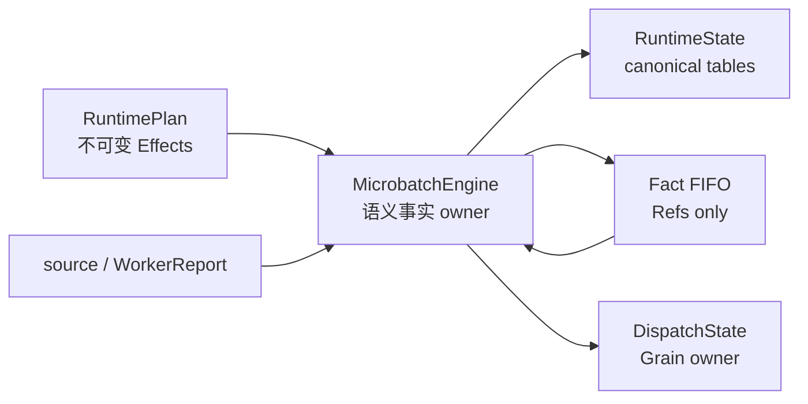
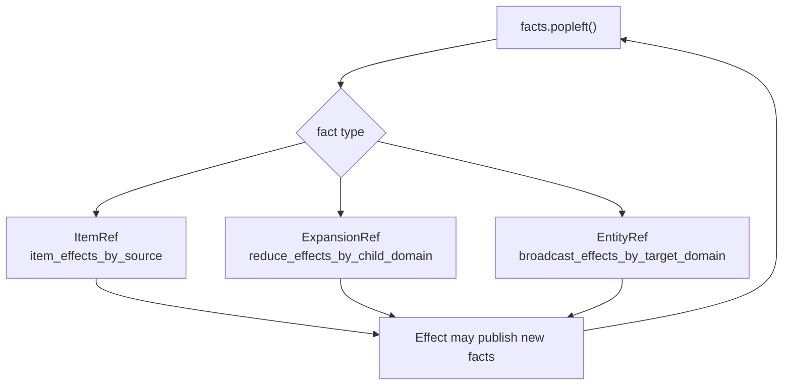
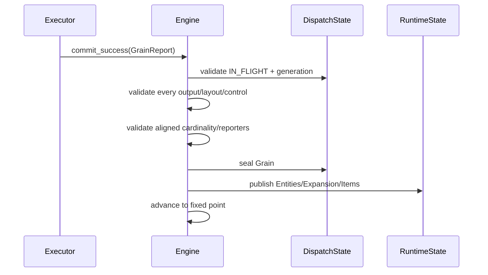
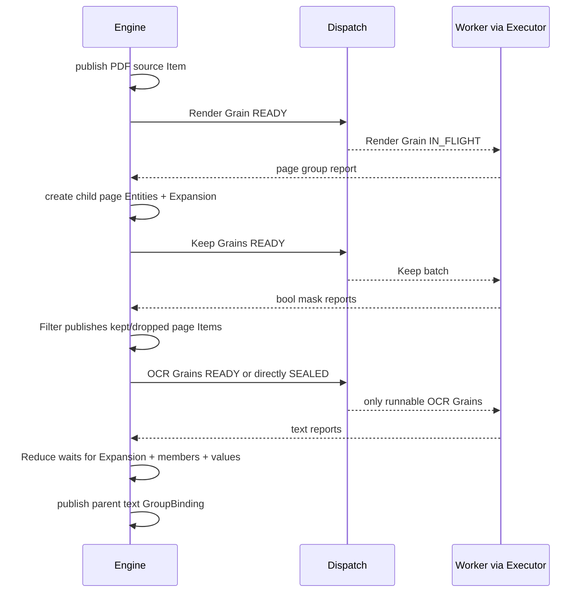

# 03：逐段读懂 `runtime/engine.py`——单个 microbatch 的语义状态机

主源码：[`runtime/engine.py`](../../rayorch/experimental/multigrain_v3_6/runtime/engine.py)。

这是 V3.6 最大、也最值得分段理解的文件。它长的原因不是同时承担 Ray、compiler 和 Worker，
而是集中拥有一个 microbatch 中所有动态**语义事实**的发布顺序：Item、Expansion、Entity、
ValueBinding 与 lineage。

---

## 1. 一句话职责

`MicrobatchEngine` 是一个 source microbatch 的单写者事件状态机：接收冻结的 `RuntimePlan`，
把 source/Worker report 发布为 canonical facts，再执行 Effect 直到局部不动点。

它拥有：

- `RuntimeState.items/values/expansions/pending_grains/entity_lineage`；
- Domain→Entity 的枚举索引；
- 只携带 Ref 的事实 FIFO；
- source admission、Worker report semantic commit 与 materialization 投影；
- Filter/Reduce/Broadcast/Call-input Effect 的解释。

它组合但不拥有：

- `DispatchState` 内部的 Grain phase、generation 和 runnable queues。

它明确不拥有：

- Logical Origin 与 compiler analysis；
- actor handle、Ray ObjectRef RPC、actor capacity；
- UDF 执行和 batch Python 值解释；
- recovery policy 的纯决策逻辑。

继续读源码前，先用一句话区分最容易混淆的三个词：canonical table 保存“已经成立的完整
事实”，`_facts` FIFO 保存“已经成立但尚待传播的事实身份”，`advance()` 则反复消费这些身份
并应用 Effect，直到 FIFO 为空。后文所有 publication 都位于这个闭环中。



---

## 2. 源码地图

| 源码段 | 主要职责 | 建议何时读 |
| --- | --- | --- |
| [私有 commit DTO 与 FactEvent](../../rayorch/experimental/multigrain_v3_6/runtime/engine.py#L73-L81) | 把复杂 report 暂存意图；封闭事实类型 | 第一遍 |
| [`__init__` 与只读投影](../../rayorch/experimental/multigrain_v3_6/runtime/engine.py#L84-L303) | 建状态 owner，并向 Executor/materializer 暴露窄接口 | 第一遍略读 |
| [`admit_sources`](../../rayorch/experimental/multigrain_v3_6/runtime/engine.py#L307-L347) | 原子接纳行对齐 source | 第一遍 |
| [`advance/_apply_item_effect`](../../rayorch/experimental/multigrain_v3_6/runtime/engine.py#L349-L388) | 唯一事实 fixed-point loop | 必须精读 |
| [`commit_success`](../../rayorch/experimental/multigrain_v3_6/runtime/engine.py#L404-L541) | report 全量预检与 mutation frontier | 必须精读 |
| [失败/恢复交界](../../rayorch/experimental/multigrain_v3_6/runtime/engine.py#L543-L608) | 语义失败发布与 Dispatch 恢复动作 | 第二遍 |
| [Item/Expansion publication gateway](../../rayorch/experimental/multigrain_v3_6/runtime/engine.py#L610-L678) | canonical fact 的唯一发布入口 | 必须精读 |
| [Call input interpreter](../../rayorch/experimental/multigrain_v3_6/runtime/engine.py#L682-L761) | Item facts 怎样形成 READY/SEALED Grain | 必须精读 |
| [Filter](../../rayorch/experimental/multigrain_v3_6/runtime/engine.py#L763-L807) | 同 Entity source/mask 归约 | 第二遍 |
| [Reduce](../../rayorch/experimental/multigrain_v3_6/runtime/engine.py#L809-L882) | Expansion/members/values 恢复 group | 第二遍精读 |
| [Broadcast](../../rayorch/experimental/multigrain_v3_6/runtime/engine.py#L884-L922) | source 与 target Entity 双触发投影 | 第二遍 |
| [Entity/lineage](../../rayorch/experimental/multigrain_v3_6/runtime/engine.py#L924-L986) | 稳定 child identity 与祖先导航 | 第二遍 |

---

## 3. 先盘点数据结构，再读控制流

### 3.1 构造函数中的五份状态

```python
self.plan = plan
self._state = RuntimeState()
self._dispatch = DispatchState()
self._facts = deque()
self._entities_by_domain = defaultdict(dict)
self._admission_closed = False
```

它们分别回答不同问题：

| 字段 | 回答的问题 | 为什么不是重复状态 |
| --- | --- | --- |
| `plan` | 某种事实发布后应触发哪些 Effect？ | 静态只读接线 |
| `_state` | 当前有哪些 Item/Expansion/value/lineage 事实？ | canonical 动态语义表 |
| `_dispatch` | 哪些 Grain READY/IN_FLIGHT/SEALED？ | 独立物理调度 owner |
| `_facts` | 哪些新事实尚未传播？ | 临时通知，只存 Ref |
| `_entities_by_domain` | 某 Domain 已有哪些 Entity？ | canonical lineage 的枚举索引 |

`_facts` 不保存 outcome、binding 或 children，因此它不是第二份真相。处理事件时总是拿 Ref 回到
`_state` 读取 canonical record。

`_entities_by_domain` 看似能从 lineage 推导，但 root Entity 不在 child lineage 中，而且广播与
materialization 频繁需要按 Domain 枚举；它是 Engine 自己维护的必要索引，不在其他组件复制。

### 3.2 到底有几个队列或等待结构

只看 `MicrobatchEngine` 自己，它真正拥有的 FIFO 只有一个：`_facts`。附近另外几种“等待”分别
属于不同 owner，不能都笼统叫 Engine queue：

| 结构 | 数据结构 | Owner | 保存什么 | 何时离开 |
| --- | --- | --- | --- | --- |
| `_facts` | `deque[ItemRef \| ExpansionRef \| EntityRef]` | Engine | 已成立但尚未传播的事实身份 | `advance()` 消费 |
| `pending_grains` | `dict[GrainRef, PendingGrain]` | RuntimeState/Engine | 尚未由 Call input 代数决定的槽位 | Grain 变 READY 或直接 SEALED |
| `_normal` | `deque[_ReadyEntry]` | DispatchState | 首次可执行 Grain | 被 reserve |
| `_immediate` | `deque[DispatchBatch]` | DispatchState | 需优先重试的精确 group | 被 reserve |
| `_tail` | `deque[DispatchBatch]` | DispatchState | 延后重试或二分隔离 group | 正常工作之后 reserve |
| `pending` | `dict[ObjectRef, _DispatchLease]` | Executor | 已发出、尚未返回的 Ray RPC | `ray.wait/get` 完成 |

这张表同时解释了为什么不能把它们合成一个“任务队列”：

- `_facts` 调度语义传播，不代表需要 Worker；
- `pending_grains` 是输入槽状态，不具有 FIFO 顺序；
- 三个 Dispatch queue 调度 Grain phase；
- Executor `pending` 追踪物理 RPC，而不是语义 READY 状态。

### 3.3 四类动态事实怎样转移

读后续方法前，先记住各状态的最短路径：

| 动态对象 | 初始表示 | 允许的变化 | 最终保存位置 |
| --- | --- | --- | --- |
| Entity | 表中不存在 | absent → published | Domain index；child 另有 lineage |
| Item | 表中不存在 | unresolved → 一个 terminal outcome | `RuntimeState.items`，PRESENT 另有 binding |
| Expansion | 表中不存在 | unresolved → SUCCEEDED/DROPPED/FAILED | `RuntimeState.expansions` |
| Grain | pending slots 或尚不存在 | WAITING → READY/SEALED；READY ↔ IN_FLIGHT → SEALED | `DispatchState` |

前三类 publication 可能向 `_facts` 追加 Ref；Grain phase 不进入 `_facts`，它通过 DispatchState 的
queue 与 Executor 协作。后面的 admission、report commit 和 Effect interpreter 都只是沿这四条
状态路径制造新事实。

---

## 4. 只读投影：为什么前 200 行不等于业务逻辑膨胀

[`ready_count` 到 `progress_summary`](../../rayorch/experimental/multigrain_v3_6/runtime/engine.py#L104-L303)
主要是窄接口，目的是阻止 Executor 或 materializer直接读可变内部 dict。

可以按四组理解。

### 4.1 计数和 Grain snapshots

`entity_count/item_count/expansion_count/grain_count` 用于冻结 metrics；Grain snapshot 委托
`DispatchState`，不会泄露可变 `GrainRecord`。

### 4.2 dispatch 门面

`dispatch_priority()` 与 `reserve_dispatch()` 让 Executor 选择工作，但实际 queue/phase 写入仍在
DispatchState。Engine 不复制 ready queue。

### 4.3 completion 合同

`is_complete()` 不只看 ready queue。它依次要求：

- admission 已关闭；
- 事实 FIFO 为空；
- 没有 pending Call input slots；
- Dispatch 没有 runnable/recovery queue；
- 所有 Grain SEALED；
- 所有 public output Port × Entity 都有终态 Item。

因此“暂时没有 READY Grain”不会被误判为完成。

### 4.4 Worker/materialization 投影

`grain_plan()` 把 semantic Item 变成纯物理 `RowBinding | GroupInput | MissingInput`：

- REQUIRED/PRESENT 或 OPTIONAL/PRESENT → row/group binding；
- OPTIONAL/DROPPED → `MissingInput`；
- nested group → 扁平 leaf bindings + CSR offsets。

它不读取 payload；Worker 才通过 BlockStore 解引用。

`ordered_items()`、`value_binding()`、`group_rows()` 服务最终 materialization。`release_values()`
只在完成后清空 binding 表，保留 Item outcome、Entity 和 Grain 审计事实。

---

## 5. `admit_sources()`：动态世界从哪里开始

source admission 先做完整预检：

1. binding keys 必须与 Program source Ports 完全一致；
2. 所有 source 列行数相同；
3. controls 只为编译器 demand 的 source 提供；
4. controls 与行数对齐且严格为 bool；
5. 当前 Engine 尚未接纳 root Entities。

预检通过后才发布：

```text
for each source row index i:
    publish EntityRef(root_domain, i)

for each source Port p and row i:
    publish ItemRef(p, entity_i) = PRESENT + RowBinding

advance()
```

为什么先 Entity 后 Item 没有顺序依赖？Entity event 可能先尝试 Broadcast，但 source Item 尚未
存在时只返回等待；随后 source Item event 会通过另一条 Broadcast source trigger 再尝试。两条
触发路径共同保证 publication 顺序无关。

---

## 6. `advance()`：全文件最重要的 25 行

事实类型只有：

```python
_FactEvent = ItemRef | ExpansionRef | EntityRef
```

循环取出一个新事实并按类型查 RuntimePlan 索引：



这个循环形成局部 fixed point：只要某个 Effect 发布了新 Item/Expansion/Entity，它会追加到同一
FIFO，直到没有新事实。

为什么不在 `_publish_item()` 里直接递归调用所有下游？FIFO 有三个必要作用：

- publication 先完整写 canonical record，再进入传播，避免下游观察半成品；
- 深 Pipeline 不依赖 Python 递归栈，也不会在一次 commit 中产生难追踪的重入；
- 三类事实统一从一个穷尽入口分派，到达顺序可测试，新增关系不会暗接一条递归捷径。

因此 `_facts + advance()` 不是额外业务概念，而是 Engine 内部把“事实写入”和“事实传播”分开的
最小调度机制。把它删除通常只会让同样的控制流散落回每个 publication 方法。

`_apply_item_effect()` 对封闭 `ItemEffect` 联合穷尽 match：

- `CallInputEffect` → 填 Grain input slot；
- `FilterEffect` → 尝试决定 Filter target；
- `BroadcastEffect` → 从 source 向现有 target Entities 投影；
- `ReduceEffect` → 找 parent 并尝试恢复 group。

Engine 不读取 `PortOrigin`，也没有按 Port 类型散落的反向扫描；新增 Effect 若没有被穷尽处理，
类型检查或 `assert_never` 会暴露。

---

## 7. `commit_success()`：为什么要分三阶段

成功 report 是全文件风险最高的入口，因为一个 Grain 可以同时产生：

- 多个 output Ports；
- scalar 或 expanded rows；
- 多个 aligned expanded Ports；
- control manifests；
- child Entities、parent group binding 与后续传播。

因此源码明确分为 mutation frontier 前后。

### 7.1 Phase 1：逐 output 预检并构造 publication intents

先验证 report generation 与 `IN_FLIGHT` phase，然后证明：

- report output Port 集合与 Call outputs 精确相等，无重复；
- expanded report 与编译后的 `ExpandEffect` 精确匹配；
- expanded output 不同时报告 scalar；
- non-expanded output 必须报告 scalar；
- control manifest 是否存在由 RuntimePlan demand 决定；
- control 值与 expanded rows 对齐且严格是 bool。

`_ExpandedOutputCommit` 只是 mutation 前的不可变意图 DTO，不进入 RuntimeState。

### 7.2 Phase 2：验证 aligned Expansion 的整体合同

同一 child Domain 的多个 aligned output 共享一个 `ExpansionRef(child_domain, parent_entity)`。
因此必须整体证明：

- 所有 reporter 的 cardinality 相同；
- reporter Port 集合完整；
- 该 Expansion 尚未发布。

这一步防止先发布 output A 的三个 children，才发现 output B 报告了四行。

### 7.3 Mutation frontier

所有外部 report 形状检查通过后才：

```python
self._dispatch.seal(grain, report.generation)
```

从这里向下不再运行用户代码，也不再接受未验证的 report 结构；只按已构造 intents 通过规范
publication gateway 写状态。

### 7.4 Phase 3：按依赖顺序发布

每个 Expansion 依次：

```text
create child Entities
→ publish Expansion(SUCCEEDED, children)
→ publish each child Item
→ publish parent group Item(GroupBinding)
```

所有 expanded/scalar outputs 写完后只调用一次 `advance()`，让下游看到完整的本 Grain
publication turn。



---

## 8. `commit_failure()` 与恢复边界

最终业务失败与可恢复 dispatch 失败不是一回事。

### 最终失败提交

`commit_failure()` 验证当前 attempt 后：

- seal Grain；
- 每个 output Item 发布为 `FAILED`；
- 若 output 原本要 Expand，Expansion 发布为 `FAILED`，表示 child cardinality 不可知；
- `advance()` 把 suppression 传播给下游。

### 仍可恢复

`apply_udf_recovery()` 接受已经由纯 `RecoveryPolicy` 决定的 `RecoveryAction`：

- `FAIL_SINGLETON` 才进入语义 failure commit；
- retry/split 交给 DispatchState 修改 phase/queue；
- `ABORT` 不允许伪装成 microbatch 内状态变化，直接由上层终止 run。

基础设施失败也先由 policy 判断，再让 DispatchState requeue。Engine 不创建/替换 actor；那是
Executor 的职责。

---

## 9. 两个 publication gateway：canonical fact 的唯一入口

### 9.1 `_publish_item()`

一个 Item publication 必须同时提交：

```text
outcome + optional binding + optional cause + optional control
```

不变量包括：

- `PRESENT` 必须有 binding；
- 非 PRESENT 不能有 binding；
- control 只属于 PRESENT 且必须是 bool；
- 首次 publication 写入表并 enqueue ItemRef；
- 同 record + 同 binding 重放幂等返回；
- 终态冲突或字段不同直接 `CommitError`。

这就是“publish”的准确含义：让一个此前未决的 Item 事实单调进入终态并激活下游，不是
`ray.put()`，也不是日志广播。

### 9.2 `_publish_expansion()`

Expansion 同样只允许首次终态或完全相同的幂等重放。它把 outcome、ordered children 与 cause
作为一个 record 提交，再 enqueue `ExpansionRef`。

Entity 由 `_publish_entity()` 负责，形成第三个 publication gateway；它在文件后部是因为与
lineage helper 放在一起。

三个 gateway 是 `_facts.append(...)` 的唯一位置，因此任何下游激活都来自已经写入 canonical
table 的事实。

---

## 10. Call input：多个 Item 怎样形成一个 Grain

`_accept_call_input()` 根据 Effect 中的 `call + input_index` 找到：

```text
GrainRef(call, item.entity)
```

尚未决的输入放入 `PendingGrain.slots`。每收到一个 Item 都调用一次 `_classify_call()`，但真正
优先级由纯 `call_transition()` 决定：

```text
failure/suppression > unresolved > required drop > ready
```

结果有四种：

| CallAction | Engine 动作 |
| --- | --- |
| `WAIT` | 保留 pending slots |
| `READY` | DispatchState 创建 READY Grain 并入 normal queue |
| `DROP_OUTPUTS` | 直接创建 SEALED Grain，outputs 发布 DROPPED |
| `SUPPRESS_OUTPUTS` | 直接创建 SEALED Grain，outputs 发布 SUPPRESSED |

所以同一个 Call 的所有输入是对称的状态槽，没有 `driven_by`。哪个输入先到只影响何时重新尝试
classification，不影响最终 Grain 身份或结论。

当 Grain 离开 WAITING 后，pending entry 被删除；DispatchState 的 GrainRecord 成为唯一物理
生命周期事实。

---

## 11. Filter：同 Entity 的两个 gate

`_try_filter(effect, entity)` 只处理三个 ItemRef：target、source、mask，它先检查 target 是否已经
发布，再把两个可能未决的 outcome/control 交给纯 `filter_transition()`。

```text
source unresolved/non-PRESENT/PRESENT
× mask unresolved/non-PRESENT/PRESENT
× mask bool control
→ target outcome or WAIT
```

若结果 PRESENT，target 复用 source 的 binding；只有编译器 demand 时才复制 source control。
若结果非 PRESENT，cause 明确指向 source 或 mask 的规范原因。

Filter 不创建 Entity、不搬 payload、不调用 Worker。因此实现集中在一个 Effect interpreter，
不需要相邻 Filter fusion 才能保证语义完整。

---

## 12. Reduce：为什么代码比 Filter 长

Reduce 必须同时等待三类事实：

1. `ExpansionRef(child_domain, parent)` 决定 children 是否存在及其顺序；
2. 每个 child 的 members Item 决定资格；
3. survivor 的 value Item 提供 payload binding。

`reduce_transition()` 只返回 outcome、survivor indices 和明确 cause；Engine 再负责组装 binding。

### 单层 group

survivor values 都是 `RowBinding` 时：

```text
GroupLayout.one_level(n) + survivor ItemRefs
```

### 多层 group

value 已经是 `GroupBinding` 时，Engine 使用 `GroupLayout.nest()` 拼接子 CSR layout，并把所有
leaf ItemRef 扁平保存。这样多轮 Reduce 不生成递归 Python object tree 作为 runtime 真相：

```text
GroupBinding
├── offsets_by_level
└── flat_items
```

Worker 在边界上才用 offsets 重建用户看到的 nested list。

空 group 也显式保留 depth，因此 `[]` 和嵌套深度不同的空结构不会混淆。

---

## 13. Broadcast：为什么需要两个触发方向

Broadcast 的完成条件是“祖先 source Item 已发布”且“后代 target Entity 已创建”。两者到达顺序
不固定：

- source 先到：`_try_broadcast_from_source()` 枚举已有 target Entities；
- Entity 先到：`_try_broadcast_to_entity()` 查对应 ancestor source。

最终 publication 只有 `_try_broadcast_to_entity()` 一处。它通过 lineage 找祖先，透明复制
outcome/binding/cause，并按 Effect 决定是否复制 control。

这不是两份 Broadcast 实现，而是两个事件入口汇聚到一个规范写路径。

---

## 14. Entity 与 lineage：多轮 Expand 怎样保持稳定身份

child Entity 由：

```text
EntityRef(child_domain, cantor_pair(parent.value, ordinal))
```

构造。身份只依赖 parent identity 和 child ordinal，不依赖 Worker 完成顺序。

`EntityParent(parent_entity, ordinal)` 显式保存在 lineage 中，因此：

- `_parent_of()` 能做一级 Reduce；
- `_ancestor_entity()` 能做跨多层 Broadcast；
- `entity_coordinate()` 能恢复 root/ordinal path，稳定 materialization 顺序；
- 多轮 Expand 自然形成线性记录的 parent chain，易于诊断。

Cantor pairing 只是当前 Domain 内的紧凑 occurrence 编码；DomainRef 仍是 EntityRef 的另一半，
所以不同 Domain 中相同整数不会混为同一 Entity。

---

## 15. 完整跟踪 PDF 的一个 root Entity



被 Filter 丢弃的 page Entity 仍然存在；对应 OCR Grain 直接 SEALED，OCR output DROPPED。Reduce
根据 `members=kept_pages` 排除该位置，但保留其余 child 的原始 ordinal 顺序。

---

## 16. 修改 Engine 前的检查清单

- 新动态事实是否属于 Item、Expansion 或 Entity；若不是，真的需要第四类 publication 吗？
- canonical record 是否先写表、再把 Ref 放入唯一 FIFO？
- outcome 组合是否在纯 transitions 中穷尽，而不是 Engine 内散落优先级 if/else？
- RuntimePlan 是否已经给出完整 Effect，Engine 是否避免回读 Origin？
- 新写路径是否经过唯一 publication gateway？
- report 的全部外部合同是否在 mutation frontier 前预检？
- 两种到达顺序是否汇聚到同一写路径，而不是复制实现？
- Grain phase/generation 是否仍只由 DispatchState 修改？
- actor/Ray 行为是否仍留在 execution 层？
- nested group 是否继续使用 canonical layout + flat leaves？

如果一个改动要求 Executor 直接写 Item，或要求 Engine 根据 actor handle 判断 outcome，就是明确的
跨层飞线。

下一篇：[04：DispatchState 与 Grain 调度](04_dispatch_state.md)。
