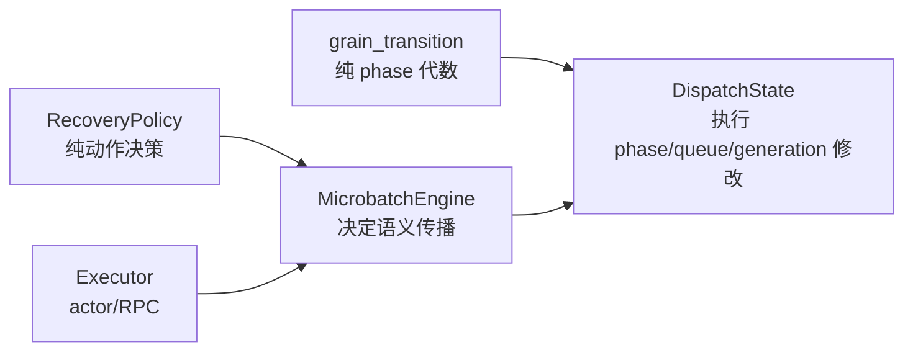
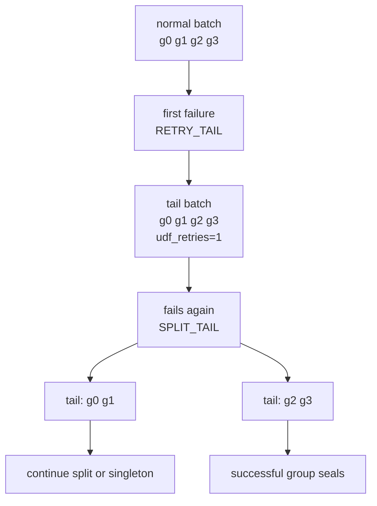

# 04：逐段读懂 `runtime/dispatch.py`——Grain 的唯一物理状态机

主源码：[`runtime/dispatch.py`](../../rayorch/experimental/multigrain_v3_6/runtime/dispatch.py)。

Engine 决定某个 Call × Entity 是否应该运行；`DispatchState` 则独占回答：它现在 READY、
IN_FLIGHT 还是 SEALED，在哪个 queue，哪个 generation 的报告仍有效。

---

## 1. 为什么 DispatchState 要从 Engine 分出来

Item/Expansion/Entity 是数据流语义；Grain phase、batch reservation、retry queue 和 stale report
fencing 是物理调度状态。如果全部混在 Engine：

- primitive outcome 与 retry queue 会交叉修改；
- Executor 可能直接改 GrainRecord；
- 同一 attempt 计数容易在 policy、Engine、Executor 多处重复。

V3.6 的拆分是：



纯函数决定“允许什么”，DispatchState 是唯一执行物理状态变化的 owner。

---

## 2. 源码地图

| 源码段 | 作用 | 核心不变量 |
| --- | --- | --- |
| [`GrainRecord/Snapshot`](../../rayorch/experimental/multigrain_v3_6/runtime/dispatch.py#L17-L32) | 私有可变记录与公开只读副本 | 可变 Record 不泄露 |
| [`DispatchBatch`](../../rayorch/experimental/multigrain_v3_6/runtime/dispatch.py#L35-L48) | 一次精确 dispatch/recovery group | 非空、同 Call |
| [`DispatchState.__init__`](../../rayorch/experimental/multigrain_v3_6/runtime/dispatch.py#L58-L66) | 建 record table 与三个 queue | queue 只有一个 owner |
| [创建 READY/SEALED Grain](../../rayorch/experimental/multigrain_v3_6/runtime/dispatch.py#L117-L135) | WAITING 离开 pending 后建档 | 一个 Grain 只创建一次 |
| [`priority/reserve`](../../rayorch/experimental/multigrain_v3_6/runtime/dispatch.py#L137-L219) | 按优先级选择并原子 reserve | immediate → normal → tail |
| [`validate_in_flight/seal`](../../rayorch/experimental/multigrain_v3_6/runtime/dispatch.py#L221-L237) | generation-fenced report commit | 旧 attempt 不可提交 |
| [UDF/infra recovery](../../rayorch/experimental/multigrain_v3_6/runtime/dispatch.py#L239-L295) | 执行已批准的恢复动作 | policy 不在本文件 |
| [`_release/_transition`](../../rayorch/experimental/multigrain_v3_6/runtime/dispatch.py#L297-L332) | group 预检后统一改 phase/generation | 不出现半组迁移 |

---

## 3. 三个核心 DTO

### 3.1 `GrainRecord`

```python
@dataclass(slots=True)
class GrainRecord:
    phase: GrainPhase
    generation: int = 0
    infra_failures: int = 0
```

这里只保存不能从 queue 安全推导的权威物理状态：

- `phase`：当前生命周期；
- `generation`：attempt fencing token；
- `infra_failures`：该 Grain 已完成的基础设施重试数。

它不保存 active actor、Item outcome、UDF retry mode 或 output。那些分别属于 Executor、Engine、
RecoveryPolicy 与 RuntimeState。

`GrainSnapshot` 复制这三个标量，供诊断和错误信息读取。调用者不能拿 snapshot 反向修改调度。

### 3.2 `DispatchBatch`

一个 batch 保存精确 Grain tuple 与 `udf_retries`：

```text
DispatchBatch(grains=(g1, g2, g3), udf_retries=1)
```

它必须非空且所有 Grain 属于同一 Call，因为一个 RPC 只能进入一个 actor pool/UDF。

`udf_retries` 属于这次恢复 group，而 `infra_failures` 属于每个 Grain：二者口径不同，不能合成
一个含糊的 attempts。

### 3.3 `_ReadyEntry`

normal queue 除 GrainRef 外额外保存预计算 `batch_key`。当前它是 parent Entity，用来实现
`batch_scope="parent_bound"`，不改变 Grain identity。

---

## 4. 三个 queue 分别是什么

```python
self._normal = deque()
self._immediate = deque()
self._tail = deque()
```

| queue | 放什么 | 使用场景 | 优先级 |
| --- | --- | --- | ---: |
| `_immediate` | 完整 `DispatchBatch` | retry_batch、基础设施重试 | 0 |
| `_normal` | `_ReadyEntry` | 首次可执行 Grain，按 batch_size 聚批 | 1 |
| `_tail` | 完整 `DispatchBatch` | retry_tail、isolate/split 后的小组 | 2 |

Immediate 保证“立即重试当前失败组”；tail 让新鲜正常工作先推进，再回头处理可疑组，降低异常
batch 的 head-of-line blocking。

queue 只表示 runnable selection，不替代 `GrainRecord.phase`。record 是权威状态；reserve 时仍检查
每个 entry 是否 READY。

---

## 5. Grain 从 WAITING 离开时怎样建档

WAITING 不保存在 DispatchState。Call inputs 尚未决定时，Engine 使用
`RuntimeState.pending_grains`。

一旦输入代数作出决定：

```text
inputs_ready(grain)
    _create(None + INPUTS_READY -> READY)
    append normal queue

inputs_terminal(grain)
    _create(None + INPUTS_TERMINAL -> SEALED)
    no queue
```

`_create()` 先拒绝重复 Grain，再通过唯一 `grain_transition()` 建立 phase。直接 SEALED 表示上游
已经决定无需 Worker，例如 required input DROPPED 或 upstream failure suppression。

---

## 6. `priority()` 与 `reserve()`：怎样选择下一批

`priority(call)` 只回答该 Call 当前最高可用层级，供 Executor 在多个 active microbatch 中比较。

`reserve(call, max_size, parent_bound)` 严格按：

```text
immediate recovery
→ normal work
→ tail recovery
```

找到工作后，所有选中 Grain 都会由 READY 原子转为 IN_FLIGHT，再返回 `DispatchBatch`。

### normal 聚批

`_reserve_normal()` 遍历当前 normal queue：

1. 丢弃已非 READY 的 stale entry；
2. 跳过不同 Call；
3. 达到 `max_size` 后保留剩余项；
4. `parent_bound=True` 时只选择与第一个 Grain 同 batch_key 的项；
5. 每个选中项立即走 `_reserve_exact()`；
6. 用 `remaining` 重建 queue，保持未选项原顺序。

`parent_bound` 只影响一次物理 RPC 的 packing，不改变 Domain、Entity 或 reduce 语义。

### recovery 精确组

`_reserve_recovery()` 不重新按 batch_size 聚合，也不与别组混合。二分隔离依赖“失败的是哪一个
精确组”，因此 recovery batch 必须保持边界。

---

## 7. generation fencing：为什么 GrainRef 不随重试改变

重试保留同一个 `GrainRef(call, entity)`，只递增 generation：

```text
generation 0: READY -> IN_FLIGHT -> RETRY
generation 1: READY -> IN_FLIGHT -> REPORT
```

若 generation 0 的慢报告之后才到，`validate_in_flight(grain, 0)` 会看到 record generation 已是 1，
抛出 `stale generation`。因此无需为每次 attempt 制造新 Grain identity，也不会让旧报告覆盖新结果。

```mermaid
sequenceDiagram
    participant D as DispatchState
    participant A0 as old attempt g@0
    participant A1 as new attempt g@1

    D->>A0: reserve generation 0
    D->>D: retry; generation = 1
    D->>A1: reserve generation 1
    A0-->>D: late report generation 0
    D-->>A0: reject stale generation
    A1-->>D: report generation 1
    D->>D: seal Grain
```

`seal()` 只接受 IN_FLIGHT 且 generation 匹配的 Grain，然后执行
`IN_FLIGHT + REPORT -> SEALED`。

---

## 8. 恢复策略与物理动作怎样分工

`RecoveryPolicy.decide_udf()` 是纯函数，只根据 completed retries 与 group size 返回
`RecoveryAction`。DispatchState 不重新解释配置，只执行动作。

### `RETRY_IMMEDIATE`

整组执行：

```text
IN_FLIGHT -> READY
generation += 1
udf_retries += 1
append _immediate
```

### `RETRY_TAIL`

状态变化相同，但 append `_tail`，让正常工作优先。

### `SPLIT_TAIL`

只接受已经至少失败重试一次且 group size > 1 的组。整组先原子 release，然后按 midpoint 拆成
两个 tail batches；两个子组继承 completed `udf_retries`。

它不是在 DispatchState 内判断“该不该继续二分”；policy 会在下一次失败时根据 group size 返回
`SPLIT_TAIL` 或 `FAIL_SINGLETON`。

### infrastructure recovery

基础设施失败不是数据/UDF 失败，因此：

- group 原样进入 `_immediate`；
- generation 递增；
- 每个 Grain 的 `infra_failures` 递增；
- `udf_retries` 不变。

Actor 替换由 Executor 完成，DispatchState 从不持有 handle。

---

## 9. `_transition()`：group 原子性的关键

对一个 exact Grain group，源码分两步：

1. **preflight**：确认非空、每个 Grain 存在且全部处于 expected phase；
2. **mutation**：逐 record 应用相同 `grain_transition()`。

只有所有成员都合法才开始修改，因此不会出现前两个 READY→IN_FLIGHT、第三个却非法而留下半组
reservation。

`_release()` 先用 `_transition()` 整组 IN_FLIGHT→READY，再统一增加 generation/counter。这里
没有 Ray 调用或外部 user code，mutation 段是封闭的。

---

## 10. 跟踪一次 isolate-tail

假设 batch `[g0, g1, g2, g3]` 中某行让 opaque UDF 整批抛错：



每次 retry 都保留 GrainRef、增加 generation；成功子组正常 report，最终失败 singleton 才由
Engine 发布该 Grain outputs 的 `FAILED`。DispatchState 本身不知道 Item outcome。

---

## 11. 为什么没有 `active_attempt` 或 actor 字段

IN_FLIGHT phase + generation 已足够验证报告。当前占用哪个 actor 由 Executor 的 `_DispatchLease`
保存；把 actor handle 再抄入 GrainRecord 会制造两份物理所有权，并让 Ray-free DispatchState
依赖执行后端。

同理，ready queue entry 不需要保存完整 `GrainPlan`：payload binding 可能随 runtime state
生命周期管理，真正 dispatch 时由 Engine 即时投影。

---

## 12. 修改 DispatchState 前的检查清单

- 新字段是否真是无法从现有 phase/generation/queue 推导的权威物理状态？
- 新动作是否应先由纯 RecoveryPolicy/transition 决定？
- exact group 是否总是先完整 preflight 再 mutation？
- retry 是否保留 GrainRef 并递增 generation？
- UDF retries 与 infrastructure retries 是否继续分开计数？
- recovery group 是否保持边界，避免重新与普通 Grain 混批？
- actor handle、Item outcome、payload 是否仍未进入本组件？
- 对外是否只暴露 immutable snapshot，而非 GrainRecord？

如果新功能需要 DispatchState 判断 Filter mask 或调用 `ray.kill()`，它应分别回到 Engine 或
Executor。

下一篇：[05：Worker ABI](05_worker_abi.md)。
