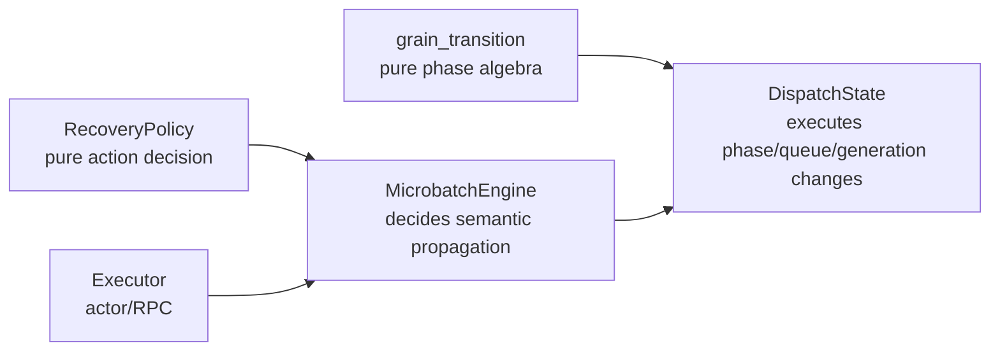
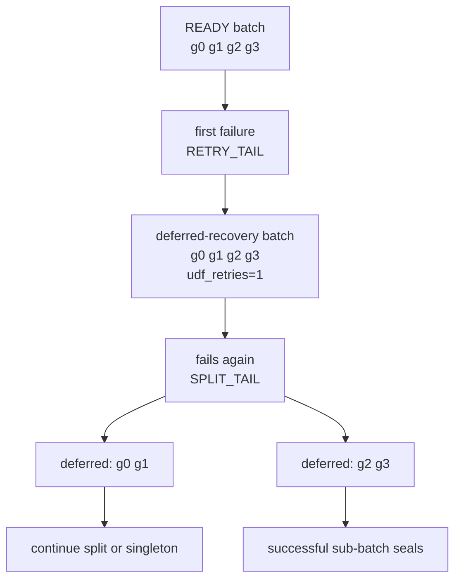

# 04. Dispatch state: physical grain lifecycle

[`runtime/dispatch.py`](../../rayorch/experimental/multigrain_v3_6/runtime/dispatch.py)
is the sole owner of physical grain scheduling state. The Chinese version is
retained as [`04_dispatch_state.zh.md`](04_dispatch_state.zh.md).

## At a glance

Each grain follows:

```text
READY -> IN_FLIGHT -> SEALED
```

Reservation records a generation and removes the grain from an eligible queue.
A matching report seals it; retry allocates a new generation. Stale queue
entries and stale reports are harmless because both dequeue and commit check the
current phase and generation.

The implementation maintains ready, immediate-retry, and deferred-recovery
queues. They are indexes, not semantic truth. Before reserving a grain, the
executor asks the engine whether it is still eligible; this is where a
same-call/same-direct-parent suppression barrier suppresses ready siblings.

The barrier lookup is constant-time on average: a microbatch-local hash index stores active
parent barriers and a grain carries its direct parent coordinate. It does not
scan all siblings or recursively traverse the whole graph.

Tests should cover duplicate queue entries, generation fencing, empty queues,
retry transitions, parent suppression, and healthy siblings that still commit.

---

## 04. Reading `runtime/dispatch.py` section by section: the single physical state machine of a Grain

Main source: [`runtime/dispatch.py`](../../rayorch/experimental/multigrain_v3_6/runtime/dispatch.py).

The Engine decides whether a given Call × Entity should run; `DispatchState` exclusively answers: is it now READY, IN_FLIGHT, or SEALED, which queue is it in, and which generation's report is still valid.

---

### 1. Why DispatchState is split out of the Engine

Item/Expansion/Entity are dataflow semantics; Grain phase, batch reservation, the retry queue, and stale report fencing are physical scheduling state. If everything were mixed into the Engine:

- primitive outcome and the retry queue would mutate each other;
- the Executor could modify `GrainRecord` directly;
- the same attempt counter would easily be duplicated across policy, Engine, and Executor.

The v3.6 split is:



Pure functions decide "what is allowed"; DispatchState is the sole owner that executes physical state changes.

---

### 2. Source map

| Source section | Role | Core invariant |
| --- | --- | --- |
| [`GrainRecord/Snapshot`](../../rayorch/experimental/multigrain_v3_6/runtime/dispatch.py#L17-L32) | private mutable record and public read-only copy | the mutable Record never leaks |
| [`DispatchBatch`](../../rayorch/experimental/multigrain_v3_6/runtime/dispatch.py#L35-L48) | one exact dispatch/recovery batch | non-empty, same Call |
| [`DispatchState.__init__`](../../rayorch/experimental/multigrain_v3_6/runtime/dispatch.py#L58-L66) | builds the record table and the three queues | a queue has exactly one owner |
| [creating READY/SEALED Grain](../../rayorch/experimental/multigrain_v3_6/runtime/dispatch.py#L117-L135) | creates the record after WAITING leaves pending | a Grain is created only once |
| [`priority/reserve_with_barriers`](../../rayorch/experimental/multigrain_v3_6/runtime/dispatch.py#L137-L219) | selects by priority and separates live/barriered Grains | immediate-retry → ready → deferred-recovery |
| [`validate_in_flight/seal`](../../rayorch/experimental/multigrain_v3_6/runtime/dispatch.py#L221-L237) | generation-fenced report commit | an old attempt cannot commit |
| [UDF/infra recovery](../../rayorch/experimental/multigrain_v3_6/runtime/dispatch.py#L239-L295) | executes approved recovery actions | policy is not in this file |
| [`_release/_transition`](../../rayorch/experimental/multigrain_v3_6/runtime/dispatch.py#L297-L332) | uniformly changes phase/generation after DispatchBatch preflight | no partial-batch migration |

---

### 3. The three core DTOs

#### 3.1 `GrainRecord`

```python
@dataclass(slots=True)
class GrainRecord:
    phase: GrainPhase
    generation: int = 0
    infra_failures: int = 0
    parent_anchor: EntityRef | None = None
```

Only authoritative physical state that cannot be safely derived from the queues is stored here:

- `phase`: the current lifecycle;
- `generation`: the attempt fencing token;
- `infra_failures`: the number of infrastructure retries already performed for this Grain;
- `parent_anchor`: the direct parent frozen at the first READY; shared by packing, the runnable queues, and suppression barriers.

It does not store the active actor, Item outcome, UDF retry mode, or output. Those belong to the Executor, the Engine, `RecoveryPolicy`, and RuntimeState respectively.

`GrainSnapshot` copies these scalars for diagnostics and error messages to read. Callers cannot use a snapshot to modify scheduling in the reverse direction.

#### 3.2 `DispatchBatch`

A batch holds an exact Grain tuple and `udf_retries`:

```text
DispatchBatch(grains=(g1, g2, g3), udf_retries=1)
```

It must be non-empty and all its Grains must belong to the same Call, because one RPC can only enter one actor pool/UDF.

`udf_retries` belongs to this recovery DispatchBatch, while `infra_failures` belongs to each Grain: the two have different scopes and must not be merged into one ambiguous attempts counter.

#### 3.3 Why `_ReadyEntry` was removed

The old ready entry stored an additional precomputed `parent_anchor`, but recovery queues only held `GrainRef`. Now the anchor is consolidated into `GrainRecord`, and the ready queue stores `GrainRef` directly. Ready, immediate-retry, deferred-recovery, late commit, and failure recovery therefore read the same scope snapshot without adding a second Grain-to-parent index.

---

### 4. What the three queues are

```python
self._ready_fifo_by_call = defaultdict(deque)  # CallRef -> deque[GrainRef]
self._immediate_retry_queue = deque()
self._deferred_recovery_queue = deque()
```

| queue | what goes in | usage scenario | priority |
| --- | --- | --- | --- |
| `_immediate_retry_queue` | a complete `DispatchBatch` | `retry_batch`, infrastructure retries | 0 |
| `_ready_fifo_by_call` | one `deque[GrainRef]` per Call | first-time executable Grains, batched by batch_size | 1 |
| `_deferred_recovery_queue` | a complete `DispatchBatch` | `retry_tail`, sub-batches after isolate/split | 2 |

Immediate-retry handles the failed DispatchBatch before READY work; deferred-recovery lets fresh READY work advance first and only then revisits suspicious batches, reducing head-of-line blocking.

The queues only represent runnable selection; they do not replace `GrainRecord.phase`. The record is the authoritative state; at reserve time each entry is still checked for being READY.

---

### 5. How a record is created when a Grain leaves WAITING

WAITING is not stored in DispatchState. While the Call inputs are still undecided, the Engine uses `RuntimeState.pending_grains`.

Once the input algebra has made a decision:

```text
inputs_ready(grain, parent_anchor)
    _create(None + INPUTS_READY -> READY)
    freeze parent_anchor in GrainRecord
    append ready queue

inputs_terminal(grain)
    _create(None + INPUTS_TERMINAL -> SEALED)
    no queue
```

`_create()` first rejects duplicate Grains and then establishes the phase through the single `grain_transition()`. Directly SEALED means upstream already decided that no Worker is needed, for example a required input DROPPED or upstream failure suppression.

---

### 6. `priority()` and `reserve_with_barriers()`: how the next batch is chosen

`priority(call)` only answers the highest currently available tier of that Call, for the Executor to compare among multiple active microbatches.

The Engine passes the Call's current barriered hash view into `reserve_with_barriers(call, max_size, pack_by_parent, barriered_anchors)`, which strictly follows:

```text
immediate-retry work
→ READY work
→ deferred-recovery work
```

Live Grains atomically go READY → IN_FLIGHT; barriered Grains take the single new edge `READY + SUPPRESS -> SEALED` and are returned to the Engine so it can publish `SUPPRESSED`. If this round contains only barriered tombstones, it returns cleanup-only `(None, suppressed)`, and the Executor sends no empty RPC.

#### READY batching

`_reserve_ready()` walks the current ready queue:

1. it only touches the target Call's own deque and drops stale entries that are no longer READY;
2. it performs an expected-O(1) barrier membership query on `parent_anchor`; on a hit the Grain is sealed and not re-enqueued;
3. it keeps the remaining items after `max_size` is reached;
4. when `pack_by_parent=True`, it only selects items with the same parent_anchor as the first live Grain;
5. all selected items uniformly go through `_reserve_exact()`;
6. it rebuilds the queue from `remaining`, preserving the relative order of unselected items.

`pack_by_parent` only affects the packing of one physical RPC; it does not change Domain, Entity, or reduce semantics. On the any_parent path each entry is popped only once, and the isolation query does not reintroduce a cross-Call scan; collecting same-parent items under single_parent still retains the original scan cost inside the target Call.

#### Exact recovery batch

`_reserve_recovery()` does not re-aggregate by `batch_size` or mix independent DispatchBatches. Bisection isolation depends on which exact DispatchBatch failed, so recovery preserves that boundary. If a barrier hits only part of it, the runtime produces an exact live sub-batch preserving order and `udf_retries`; when every Grain is barriered, it does not construct an empty `DispatchBatch`.

---

### 7. generation fencing: why GrainRef does not change across retries

A retry keeps the same `GrainRef(call, entity)` and only increments the generation:

```text
generation 0: READY -> IN_FLIGHT -> RETRY
generation 1: READY -> IN_FLIGHT -> REPORT
```

If the slow report of generation 0 arrives later, `validate_in_flight(grain, 0)` sees that the record generation is already 1 and raises `stale generation`. Therefore there is no need to mint a new Grain identity for every attempt, and an old report cannot overwrite a newer result.

```mermaid
sequenceDiagram
    participant D as DispatchState
    participant A0 as old attempt g@0
    participant A1 as new attempt g@1

    D->>A0: reserve generation 0
    D->>D: retry; generation = 1
    D->>A1: reserve generation 1
    A0-->>D: late report generation 0
    D-->>A0: reject stale generation
    A1-->>D: report generation 1
    D->>D: seal Grain
```

`seal()` only accepts a Grain that is IN_FLIGHT with a matching generation, and then performs `IN_FLIGHT + REPORT -> SEALED`.

---

### 8. How recovery policy and physical action divide the work

`RecoveryPolicy.decide_udf()` is a pure function that returns a `RecoveryAction` based only on completed retries and DispatchBatch size. DispatchState does not reinterpret the configuration; it only executes the action.

#### `RETRY_IMMEDIATE`

The whole DispatchBatch performs:

```text
IN_FLIGHT -> READY
generation += 1
udf_retries += 1
append _immediate_retry_queue
```

#### `RETRY_TAIL`

The state change is the same, but it appends to `_deferred_recovery_queue`, letting READY work take priority.

#### `SPLIT_TAIL`

It accepts only a DispatchBatch that has already failed one retry and contains more than one Grain. The whole batch is first atomically released and then split at the midpoint into two deferred-recovery batches; both sub-batches inherit the completed `udf_retries`.

It is not DispatchState that decides whether to keep bisecting; the policy returns `SPLIT_TAIL` or `FAIL_SINGLETON` on the next failure according to the batch size.

#### infrastructure recovery

An infrastructure failure is not a data/UDF failure, therefore:

- the DispatchBatch enters `_immediate_retry_queue` unchanged;
- the generation is incremented;
- each Grain's `infra_failures` is incremented;
- `udf_retries` stays unchanged.

Actor replacement is done by the Executor; DispatchState never holds handles.

---

### 9. `_transition()`: the key to DispatchBatch atomicity

For one exact DispatchBatch the source performs two steps:

1. **preflight**: confirm it is non-empty, that every Grain exists, and that all are in the expected phase;
2. **mutation**: apply the same `grain_transition()` record by record.

Mutation starts only when all members are legal, so you never get the situation where the first two go READY→IN_FLIGHT while the third is illegal, leaving a partial-batch reservation.

`_release()` first uses `_transition()` to move the whole DispatchBatch IN_FLIGHT→READY, and then uniformly increments generation/counter. There are no Ray calls or external user code here; the mutation segment is closed.

---

### 10. Tracing one isolate-tail

Suppose some row in the batch `[g0, g1, g2, g3]` makes the opaque UDF throw for the entire batch:



Every retry preserves the GrainRef and increments the generation; a successful sub-batch reports normally, and only a finally failing singleton causes the Engine to publish `FAILED` for that Grain's outputs. DispatchState itself does not know Item outcome.

---

### 11. Why there is no `active_attempt` or actor field

IN_FLIGHT phase + generation is already enough to validate reports. Which actor currently occupies the Grain is stored by the Executor's `_PendingRpc`; copying the actor handle into `GrainRecord` would create two copies of physical ownership and would make the Ray-free DispatchState depend on the execution backend.

For the same reason, a ready queue entry does not need to store a full `GrainInvocation`: payload bindings may be lifecycle-managed together with runtime state, and are projected on the fly by the Engine at real dispatch time.

---

### 12. Checklist before modifying DispatchState

- Is the new field really authoritative physical state that cannot be derived from the existing phase/generation/queue?
- Should the new action first be decided by the pure RecoveryPolicy/transition?
- Does an exact DispatchBatch always preflight completely before mutation?
- Does a retry preserve the GrainRef and increment the generation?
- Are UDF retries and infrastructure retries still counted separately?
- Does a recovery DispatchBatch keep its boundary, avoiding being re-batched with READY Grains?
- Is `parent_anchor` frozen only at READY and shared by every runnable queue and suppression barrier?
- Is a barriered tombstone visited only once, and does it avoid producing an empty batch?
- Are actor handle, Item outcome, and payload still absent from this component?
- Is only an immutable snapshot exposed externally, rather than the GrainRecord?

If a new feature needs DispatchState to judge a Filter mask or call `ray.kill()`, it belongs back in the Engine or the Executor respectively.

Next: [05: Worker ABI](05_worker_abi.md).
