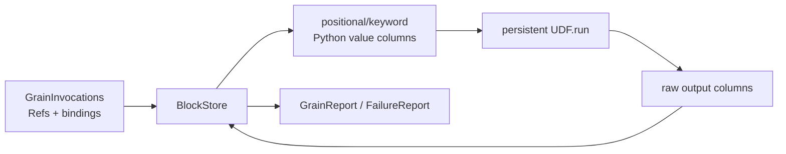

# 05. Worker ABI: binding a grain batch to a UDF

[`execution/worker.py`](../../rayorch/experimental/multigrain_v3_6/execution/worker.py)
is deliberately Ray-independent. The Chinese walkthrough is retained as
[`05_worker_abi.zh.md`](05_worker_abi.zh.md).

## At a glance

The compiler supplies a `CallInputLayout` and `CallOutputLayout`. For each
reserved `GrainInvocation`, the worker resolves value bindings and group inputs into
ordinary Python positional and keyword columns, invokes the UDF once, and
normalizes the result into a tuple of per-grain reports.

The worker does not read `LogicalProgram`, infer lineage, choose recovery, or
touch actor handles. It validates output arity and row alignment. A
`RecordFailure` produces a `GrainFailureReport` for the current grain; a
`GroupFailure` sets the report's sibling-suppression bit. Both are ordinary
return values and do not request a retry.

An exception that prevents per-grain reports becomes a serializable
`DispatchFailure`. `RecoveryPolicy` is evaluated by the executor, not by the
worker. This separation keeps UDF binding testable without Ray.

Tests should cover keyword order, optional inputs, multiple outputs, failure
sentinels, malformed return shapes, and exception snapshots.

---

## 05. Reading `execution/worker.py` section by section: how physical binding becomes a UDF batch

Main source: [`execution/worker.py`](../../rayorch/experimental/multigrain_v3_6/execution/worker.py).

The Worker sits between the semantic state machine and user code. It knows nothing about
Program, Domain, or Filter/Reduce; it only receives the compiled input/output layout plus a
batch of physical `GrainInvocation`s, invokes the batch UDF once, and returns per-Grain reports.

---

### 1. Why the Worker boundary matters

The Engine maintains fine-grained identity, but payloads should travel in coarse-grained
blocks; the UDF should see natural Python values rather than RayOrch-internal Refs. The
Worker owns this two-way translation:



The Worker owns:

- the persistent UDF instance;
- columnar input/output conversion within a single RPC;
- Worker ABI contract validation;
- serializable snapshots of UDF/contract exceptions;
- lifetime observation counters outside a run.

The Worker does not own:

- Ray actor handles or dispatch queues;
- Item/Expansion/Entity state;
- recovery decisions;
- RuntimePlan or LogicalProgram.

---

### 2. Source map

| Source section | Role | Core question |
| --- | --- | --- |
| [errors, snapshot, BlockStore](../../rayorch/experimental/multigrain_v3_6/execution/worker.py#L33-L59) | defines the Ray-free boundary | What is the minimum the Worker depends on? |
| [`Worker.__init__`](../../rayorch/experimental/multigrain_v3_6/execution/worker.py#L62-L76) | constructs the persistent UDF | How are a class and a callable unified? |
| [`execute/_execute`](../../rayorch/experimental/multigrain_v3_6/execution/worker.py#L78-L216) | the complete main path of one batch | How do multiple outputs stay atomic per Grain? |
| [`_dispatch_failure`](../../rayorch/experimental/multigrain_v3_6/execution/worker.py#L218-L229) | freezes exception information | Why not pass the exception object directly? |
| [`observe`](../../rayorch/experimental/multigrain_v3_6/execution/worker.py#L231-L256) | best-effort physical diagnostics | Why does it not participate in scheduling? |
| [`_input_columns`](../../rayorch/experimental/multigrain_v3_6/execution/worker.py#L258-L290) | bindings to value columns | How are group/optional restored? |
| [`_ready_fifo_by_callize_outputs`](../../rayorch/experimental/multigrain_v3_6/execution/worker.py#L292-L314) | raw return to columnar contract | What is the parenthesis semantics of single vs. multiple outputs? |
| [`_sequence/_rss_bytes`](../../rayorch/experimental/multigrain_v3_6/execution/worker.py#L316-L331) | small contract and diagnostic helpers | Which container types are accepted? |

---

### 3. `BlockStore`: keeping the Worker free of Ray

The Worker requires only:

```python
class BlockStore(Protocol):
    def get(self, binding: RowBinding) -> Any: ...
    def put(self, values: tuple[Any, ...]) -> BlockRef: ...
```

So the core Worker can use an in-memory store in unit tests, and
[`ray_backend.py`](../../rayorch/experimental/multigrain_v3_6/execution/ray_backend.py)
can supply a Ray Object Store implementation.

Data granularity has two layers:

```text
BlockRef         -> handle for a whole column / coarse block
RowBinding       -> BlockRef + row index
ItemRef          -> semantic Port x Entity (invisible to the Worker)
```

The Worker's input `GrainInvocation` carries only the binding; it does not need to know which
ItemRef the binding originally belonged to, because the Engine has already projected by Call
input order.

---

### 4. Construction: one persistent UDF instance per actor

```python
self.udf = target(*init_args, **kwargs) if isinstance(target, type) else target
self.input_layout = input_layout
self.calls = 0
```

- When target is a class, it is instantiated once during actor initialization;
- when target is a function or a callable instance, it is reused directly;
- `input_layout` comes from the compiler; the Worker does not reflect over the Pipeline;
- `calls` is an actor lifetime counter, not a per-`Executor.run()` metric.

This is also why the Executor waits for the `ready()` barrier after creating an actor: model/UDF
initialization cost must not leak into run timing.

---

### 5. Why `execute()` wraps `_execute()`

The public `execute()` only catches `WorkerContractError` and converts it into
`DispatchFailure(CONTRACT_ERROR)`. The internal `_execute()` instead:

- converts an ordinary Exception thrown by the UDF itself into `UDF_ERROR`;
- produces a `GrainFailureReport` for a legitimate per-record failure;
- produces a `GrainReport` for a normal result.

In this way the three failure levels never get confused:

| Level | Representation | Per-Grain report already available? | Typical recovery |
| --- | --- | ---: | --- |
| contract error | `DispatchFailure(CONTRACT_ERROR)` | no | fail-fast |
| opaque UDF throw | `DispatchFailure(UDF_ERROR)` | no | policy retry/split/abort |
| record failure | `GrainFailureReport` | yes | commit that Grain as FAILED directly |
| `GroupFailure` | `GrainFailureReport(suppress_siblings=True)` | yes | Engine establishes a same-parent suppression barrier, no retry |
| actor/Ray crash | `ray.get()` raises | no | Executor replaces the actor, infra retry |

The Worker does not catch all `BaseException`s, and it does not disguise a Ray actor crash as a
UDF error.

---

### 6. `_input_columns()`: turning row-major GrainInvocations into column-major UDF arguments

Suppose one dispatch has three Grains and two Call inputs:

```text
g0.inputs = (page0, lang0)
g1.inputs = (page1, lang1)
g2.inputs = (page2, lang2)
```

The Worker transposes this into:

```text
columns[0] = [page0_value, page1_value, page2_value]
columns[1] = [lang0_value, lang1_value, lang2_value]
```

Each kind of `GrainInput` has exactly one restoration rule:

| GrainInput | Worker value |
| --- | --- |
| `RowBinding` | `store.get(binding)` |
| `MissingInput` | the single public sentinel `MISSING` |
| `NestedGroupInput(bindings, offsets)` | read the leaves, then `restore_nested_group()` rebuilds the nested list |

All Grains must have the same input arity; otherwise the Engine/plan contract is already broken
and a `WorkerContractError` is raised.

A group is stored inside the Engine as flat leaves plus CSR offsets, and the Python nested
structure is restored only at the UDF boundary. Therefore the runtime does not need to keep
recursive objects alive for every nested group.

---

### 7. How positional and keyword inputs are rebuilt

The compiler produces:

```text
CallInputLayout(
    positional_count=N,
    keyword_names=(name0, name1, ...),
)
```

The Worker validates the total column count and then splits:

```python
positional = columns[:layout.positional_count]
keyword_columns = columns[layout.positional_count:]
keywords = dict(zip(layout.keyword_names, keyword_columns))
raw = udf.run(*positional, **keywords)
```

For example, the static call:

```python
self.ocr(pages, language=languages)
```

is actually, at runtime:

```python
udf.run(
    [page0, page1, ...],
    language=[lang0, lang1, ...],
)
```

Keyword names come only from the compiler layout; the logical input value itself is still just
`PortRef + InputMode`.

---

### 8. `_ready_fifo_by_callize_outputs()`: the easiest return shape to get wrong

Let this batch have `G` Grains and the Call have `M` logical outputs.

#### Single-output Call

The UDF returns one column directly, whose length must be G:

```python
return [value0, value1, ..., value_G_minus_1]
```

#### Multi-output Call

The UDF's outer layer must have M columns, each of length G:

```python
return (
    [text0, text1, ...],
    [score0, score1, ...],
)
```

This is not a row-major structure where each Grain returns a `(text, score)` tuple; it is
output-column-major. The formula is:

```text
raw[M output columns][G Grain rows]
```

The Worker accepts only list/tuple as the ABI sequence, preventing a string, generator, or
ndarray from being accidentally expanded under a different rule.

---

### 9. Two failure values: how multiple outputs stay atomic per Grain

After normalization, the Worker first scans all output columns: if row i has a `RecordFailure`
or `GroupFailure` in any column, every output of that Grain is marked failed.

```text
text column  = ["a", "b", RecordFailure(cause)]
score column = [0.9, 0.8, 0.1]

grain 2 -> one GrainFailureReport; score 0.1 is not visible either
```

Without this horizontal scan first, the Worker might publish a failure for text and then a
success for score, breaking the atomic outcome of a multi-output Grain.

A deterministic join is used at the same position: `GroupFailure > RecordFailure > normal`; the
cause is the first highest-priority sentinel in compiler output layout order. The Worker only
sets internal behavior bits; it never reads parent/lineage. The barrier scope is interpreted by
the Engine on the driver.

---

### 10. Expanded output: how one column of groups becomes child rows

If `CallOutputLayout.expanded_ports` is non-empty, each Grain value in the UDF's returned column
must still be a sequence:

```python
return [
    [page_0_0, page_0_1],  # group of root Grain 0
    [],                    # empty group of root Grain 1
    [page_2_0],            # group of root Grain 2
]
```

The Worker:

1. skips already-failed Grains;
2. converts each successful row into a tuple group;
3. flattens all groups into one coarse block;
4. creates RowBindings for each group using cumulative offsets;
5. reports the same rows for every aligned expanded Port in the layout;
6. if an expanded Port is demand-controlled, also attaches the original bool group.

The Worker does not create EntityRefs or ExpansionRefs. It only reports ordered rows; the Engine
creates semantic identity from the current parent Grain and the compile-time child Domain, and
validates aligned cardinality.

---

### 11. Scalar output: block row and control

A non-expanded output does a single `store.put(values)` for the whole output column, and each
successful Grain then uses:

```text
RowBinding(shared_block, original_batch_index)
```

Even if a failed position physically exists in the coarse block, no ItemRef references it, so it
is never materialized.

If the RuntimePlan marks the Port as needing control, all live values must be strict bools and
are also written into `PortOutputReport.control`. The business value and the control are currently
the same bool, but they cross the protocol boundary through independent fields, so the Engine
does not need to dereference the payload to decide a Filter.

Outputs must not contain the input-only `MISSING` sentinel; a missing output must be expressed
with explicit failure/outcome semantics.

---

### 12. How the report is finally assembled per Grain

Each input `GrainInvocation` yields exactly one result:

```text
failure[i] exists
    -> GrainFailureReport(grain, generation, cause, suppress_siblings)

otherwise
    -> GrainReport(grain, generation, all PortOutputReports in layout order)
```

The generation is passed back verbatim so that `DispatchState` can reject stale attempts. The
Worker does not increment the generation itself, nor does it decide on a retry.

`GrainReport.outputs` is produced in compiler layout order; the Engine still verifies that the
Port set matches exactly, and commit preflight must not be skipped just because the Worker is an
internal component.

---

### 13. `_dispatch_failure()`: why pass an exception snapshot instead of an exception object

A user exception is not necessarily picklable. The Worker freezes locally:

- the failure kind;
- the full exception type name;
- the message;
- the formatted traceback.

The Executor then merges these wire details with the Call/UDF/Grain/generation context it owns
into an `ExecutionError`. This keeps the exception hierarchy clear and avoids the Worker reading
the Program backwards.

---

### 14. `observe()`: diagnostics do not participate in semantics

`WorkerSnapshot` contains only lifetime calls, pid, RSS, and a handful of scalar audit or
observation errors. The Executor collects it best-effort after business output has completed; a
failure does not overturn business results that have already been produced.

Its accounting differs from run-local `CallMetrics.rpcs/grains/retries`: a Worker actor can
persist across multiple `run()` calls, so `lifetime_calls` is an actor-lifetime accumulation.

---

### 15. Why the Ray adapter is only 96 lines

[`execution/ray_backend.py`](../../rayorch/experimental/multigrain_v3_6/execution/ray_backend.py)
does only two things:

- `_RayBlockStore` maps a `BlockRef` to a Ray ObjectRef and caches coarse blocks within one
  RPC/materialize turn;
- `_RayWorkerActor` forwards Ray actor methods to the Ray-free `Worker`.

The actor clears its local block cache before and after `execute()` to prevent input payloads
from leaking across RPCs. It does not interpret the Program, and it does not implement a second
copy of output normalization.

---

### 16. Tracing the PDF example's OCR batch

Suppose the OCR Call receives three READY Grains at once, with language as a keyword input:

```text
GrainInvocations
g(page0): RowBinding(page0), RowBinding(lang0)
g(page1): RowBinding(page1), RowBinding(lang1)
g(page2): RowBinding(page2), RowBinding(lang2)

Worker call
ocr.run([page0, page1, page2], language=[lang0, lang1, lang2])

UDF return
["text0", GroupFailure(bad_document), "text2"]

WorkerDispatchResult
GrainReport(page0, scalar binding)
GrainFailureReport(page1, bad_document, suppress_siblings=True)
GrainReport(page2, scalar binding)
```

The Executor hands the complete WorkerDispatchResult to the Engine in one shot. page1 itself becomes
`FAILED`; page0/page2 successes that are in the same Call, share the same direct PDF parent, and
have not yet been committed become `SUPPRESSED`. The Worker does not know lineage, so reports
belonging to other PDF parents are still committed normally. If only a `RecordFailure` were
returned here, page0/page2 would remain successful.

---

### 17. Checklist before modifying the Worker

- Does the Worker still receive only DTOs/layout/BlockStore, rather than RuntimePlan or Engine?
- Are inputs first transposed from Grain rows into Call input columns?
- Is the positional/keyword ABI decided solely by `CallInputLayout`?
- Do multiple outputs still use `M columns x G rows`?
- Does a Failure sentinel on any output close off all outputs of that Grain, with stable Failure
  priority?
- Do expanded rows only report bindings, without creating semantic Entities?
- Are contract/UDF/RecordFailure/GroupFailure/infra failures still layered, with only opaque/infra entering
  recovery?
- Does the exception wire DTO avoid requiring the user exception to be serializable?
- Is the generation only passed back, never modified inside the Worker?
- Does a new execution backend implement the BlockStore/actor adapter instead of duplicating
  Worker logic?

If the UDF needs to know a `DomainRef`, or the Worker wants to call `engine._publish_item()`
directly, the ABI has already been crossed.

Next: [06: Executor event loop](06_executor_event_loop.md).
