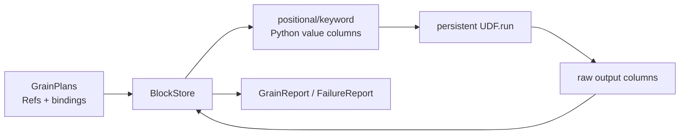

# 05：逐段读懂 `execution/worker.py`——物理 binding 怎样变成 UDF batch

主源码：[`execution/worker.py`](../../rayorch/experimental/multigrain_v3_6/execution/worker.py)。

Worker 位于语义状态机与用户代码之间。它不认识 Program、Domain 或 Filter/Reduce；它只接收
编译好的 input/output layout 和一批物理 `GrainPlan`，调用一次 batch UDF，再返回逐 Grain
报告。

---

## 1. Worker 的边界为什么重要

Engine 维护细粒度身份，但 payload 应在粗粒度块中传输；UDF 应看到自然 Python values，而不是
RayOrch 内部 Ref。Worker 负责这次双向翻译：



Worker 拥有：

- 持久 UDF 实例；
- 一次 RPC 内的列式输入/输出转换；
- Worker ABI 合同校验；
- UDF/contract 异常的可序列化快照；
- run 之外的 lifetime observation counters。

Worker 不拥有：

- Ray actor handle 或调度队列；
- Item/Expansion/Entity 状态；
- recovery 决策；
- RuntimePlan 或 LogicalProgram。

---

## 2. 源码地图

| 源码段 | 作用 | 核心问题 |
| --- | --- | --- |
| [错误、snapshot、BlockStore](../../rayorch/experimental/multigrain_v3_6/execution/worker.py#L33-L59) | 定义 Ray-free 边界 | Worker 最少依赖什么？ |
| [`Worker.__init__`](../../rayorch/experimental/multigrain_v3_6/execution/worker.py#L62-L76) | 构造持久 UDF | class 与 callable 怎样统一？ |
| [`execute/_execute`](../../rayorch/experimental/multigrain_v3_6/execution/worker.py#L78-L216) | 一次 batch 的完整主路径 | 多输出如何保持逐 Grain 原子？ |
| [`_dispatch_failure`](../../rayorch/experimental/multigrain_v3_6/execution/worker.py#L218-L229) | 冻结异常信息 | 为什么不直接传 exception？ |
| [`observe`](../../rayorch/experimental/multigrain_v3_6/execution/worker.py#L231-L256) | best-effort 物理诊断 | 为什么不参与调度？ |
| [`_input_columns`](../../rayorch/experimental/multigrain_v3_6/execution/worker.py#L258-L290) | bindings→value columns | group/optional 怎样还原？ |
| [`_normalize_outputs`](../../rayorch/experimental/multigrain_v3_6/execution/worker.py#L292-L314) | raw return→列式合同 | 单输出/多输出括号语义是什么？ |
| [`_sequence/_rss_bytes`](../../rayorch/experimental/multigrain_v3_6/execution/worker.py#L316-L331) | 小型合同和诊断 helper | 哪些容器类型被接受？ |

---

## 3. `BlockStore`：让 Worker 不依赖 Ray

Worker 只要求：

```python
class BlockStore(Protocol):
    def get(self, binding: RowBinding) -> Any: ...
    def put(self, values: tuple[Any, ...]) -> BlockRef: ...
```

因此核心 Worker 可以在单元测试中使用内存 store，也可以由
[`ray_backend.py`](../../rayorch/experimental/multigrain_v3_6/execution/ray_backend.py)
提供 Ray Object Store 实现。

数据粒度分两层：

```text
BlockRef         -> 一整列/粗块的句柄
RowBinding       -> BlockRef + row index
ItemRef          -> 语义上的 Port × Entity（Worker 看不到）
```

Worker 输入 `GrainPlan` 只携带 binding；它无需知道 binding 原来属于哪个 ItemRef，因为 Engine 已
按 Call input 顺序投影完成。

---

## 4. 构造：一个 actor 内只有一个持久 UDF 实例

```python
self.udf = target(*init_args, **kwargs) if isinstance(target, type) else target
self.input_layout = input_layout
self.calls = 0
```

- target 是 class 时，在 actor 初始化阶段实例化一次；
- target 是函数或 callable instance 时直接复用；
- `input_layout` 来自 compiler，Worker 不反射 Pipeline；
- `calls` 是 actor lifetime 计数，不是单次 `Executor.run()` 指标。

这也是 Executor 创建 actor 后要等待 `ready()` barrier 的原因：模型/UDF 初始化成本不混入 run
计时。

---

## 5. `execute()` 为什么包一层 `_execute()`

公开 `execute()` 只负责捕获 `WorkerContractError` 并转换成
`DispatchFailure(CONTRACT_ERROR)`。内部 `_execute()` 则：

- 对 UDF 自身抛出的普通 Exception 转成 `UDF_ERROR`；
- 对合法逐记录失败生成 `GrainFailureReport`；
- 正常结果生成 `GrainReport`。

这样三种失败层级不会混淆：

| 层级 | 表达 | 是否已有逐 Grain 报告 | 典型恢复 |
| --- | --- | ---: | --- |
| contract error | `DispatchFailure(CONTRACT_ERROR)` | 否 | fail-fast |
| opaque UDF throw | `DispatchFailure(UDF_ERROR)` | 否 | policy retry/split/abort |
| record failure | `GrainFailureReport` | 是 | 直接提交该 Grain FAILED |
| actor/Ray crash | `ray.get()` 抛错 | 否 | Executor 替换 actor、infra retry |

Worker 不捕获所有 BaseException，也不把 Ray actor crash伪装成 UDF 错误。

---

## 6. `_input_columns()`：把 row-major GrainPlans 转成 column-major UDF 参数

假设一次 dispatch 有三个 Grain、两个 Call inputs：

```text
g0.inputs = (page0, lang0)
g1.inputs = (page1, lang1)
g2.inputs = (page2, lang2)
```

Worker 转置为：

```text
columns[0] = [page0_value, page1_value, page2_value]
columns[1] = [lang0_value, lang1_value, lang2_value]
```

每种 `GrainInput` 有唯一还原方式：

| GrainInput | Worker 值 |
| --- | --- |
| `RowBinding` | `store.get(binding)` |
| `MissingInput` | 唯一公开哨兵 `MISSING` |
| `GroupInput(bindings, offsets)` | 读取 leaves，再 `restore_group()` 重建 nested list |

所有 Grain 的 input arity 必须相同；否则说明 Engine/plan 合同已破坏，抛
`WorkerContractError`。

Group 在 Engine 内保存扁平 leaves + CSR offsets，只在 UDF 边界恢复 Python 嵌套结构。因此
runtime 不需要为每个 nested group 长期保存递归对象。

---

## 7. positional 与 keyword 输入怎样重建

compiler 生成：

```text
CallInputLayout(
    positional_count=N,
    keyword_names=(name0, name1, ...),
)
```

Worker 校验总列数后切分：

```python
positional = columns[:layout.positional_count]
keyword_columns = columns[layout.positional_count:]
keywords = dict(zip(layout.keyword_names, keyword_columns))
raw = udf.run(*positional, **keywords)
```

例如静态调用：

```python
self.ocr(pages, language=languages)
```

运行时实际是：

```python
udf.run(
    [page0, page1, ...],
    language=[lang0, lang1, ...],
)
```

keyword name 只由 compiler layout 提供，logical input value 自身仍只是 `PortRef + InputMode`。

---

## 8. `_normalize_outputs()`：最容易写错的返回形状

设本次 batch 有 `G` 个 Grain、Call 有 `M` 个逻辑输出。

### 单输出 Call

UDF 直接返回一列，长度必须为 G：

```python
return [value0, value1, ..., value_G_minus_1]
```

### 多输出 Call

UDF 外层必须有 M 列，每列长度为 G：

```python
return (
    [text0, text1, ...],
    [score0, score1, ...],
)
```

这里不是每个 Grain 返回一个 `(text, score)` tuple 的 row-major 结构，而是 output-column-major。
公式是：

```text
raw[M output columns][G Grain rows]
```

Worker 只接受 list/tuple 作为 ABI sequence，防止把字符串、generator 或 ndarray 意外按另一种
规则展开。

---

## 9. `RecordFailure`：多输出如何保持逐 Grain 原子

normalize 后，Worker 先扫描所有输出列：只要第 i 行任意一列是 `RecordFailure`，该 Grain 的
全部输出都标为失败。

```text
text column  = ["a", "b", RecordFailure(cause)]
score column = [0.9, 0.8, 0.1]

grain 2 -> one GrainFailureReport; score 0.1 也不可见
```

如果不先做这次横向扫描，Worker 可能先为 text 发布失败，再为 score 发布成功，破坏一个
multi-output Grain 的原子 outcome。

扫描只选择每个 Grain 第一个 failure 作为 cause；报告阶段不是第二次业务决策。

---

## 10. expanded output：一列 group 怎样变成 child rows

若 `CallOutputLayout.expanded_ports` 非空，UDF 返回列中的每个 Grain value 必须还是 sequence：

```python
return [
    [page_0_0, page_0_1],  # root Grain 0 的 group
    [],                    # root Grain 1 的空 group
    [page_2_0],            # root Grain 2 的 group
]
```

Worker：

1. 跳过已失败 Grain；
2. 每个成功行转 tuple group；
3. 把所有 group 扁平为一个 coarse block；
4. 用累计 offset 为每个 group 创建 RowBindings；
5. 为 layout 中每个 aligned expanded Port 报告相同 rows；
6. 若某 expanded Port 被 demand control，同时附上原 bool group。

Worker 不创建 EntityRef 或 ExpansionRef。它只报告有序 rows；Engine 用当前 parent Grain 与编译期
child Domain 创建语义身份并验证 aligned cardinality。

---

## 11. scalar output：block row 与 control

非 expanded output 把整个 output column 一次 `store.put(values)`，然后每个成功 Grain 使用：

```text
RowBinding(shared_block, original_batch_index)
```

失败位置即使物理存在于粗块，也没有任何 ItemRef 引用，不会 materialize。

若 RuntimePlan 标记该 Port 需要 control，所有 live values 必须是严格 bool，并同时写入
`OutputReport.control`。业务 value 与 control 当前是同一个 bool，但通过独立字段越过协议边界，
Engine 不需要解引用 payload 来判断 Filter。

输出不得包含输入专用 `MISSING` 哨兵；缺失输出必须用明确 failure/outcome 语义表达。

---

## 12. 最终怎样按 Grain 组装报告

每个输入 `GrainPlan` 精确得到一个结果：

```text
failure[i] exists
    -> GrainFailureReport(grain, generation, cause)

otherwise
    -> GrainReport(grain, generation, all OutputReports in layout order)
```

generation 原样回传，让 DispatchState 拒绝旧 attempt。Worker 不自行递增 generation，也不决定
retry。

`GrainReport.outputs` 按 compiler layout 顺序生成；Engine 仍会验证 Port 集合精确匹配，不能因为
Worker 是内部组件就跳过 commit preflight。

---

## 13. `_dispatch_failure()`：为什么传异常快照而不是异常对象

用户 exception 未必可 picklable。Worker 在本地冻结：

- failure kind；
- 完整异常类型名；
- message；
- 格式化 traceback。

Executor 再把这些 wire details 与它拥有的 Call/UDF/Grain/generation 上下文合并成
`ExecutionError`。这样异常层次清楚，也避免 Worker 反向读取 Program。

---

## 14. `observe()`：诊断不参与语义

`WorkerSnapshot` 只包含 lifetime calls、pid、RSS、少量标量 audit 或 observation error。
Executor 在业务输出完成后 best-effort 收集；失败不会推翻已经完成的业务结果。

它与 run-local `CallMetrics.rpcs/grains/retries` 口径不同：Worker actor 可以跨多次 `run()` 持久化，
所以 `lifetime_calls` 是 actor lifetime 累计。

---

## 15. Ray adapter 为什么只有 96 行

[`execution/ray_backend.py`](../../rayorch/experimental/multigrain_v3_6/execution/ray_backend.py)
只做两件事：

- `_RayBlockStore` 把 `BlockRef` 映射到 Ray ObjectRef，并在一次 RPC/materialize turn 内缓存粗块；
- `_RayWorkerActor` 把 Ray actor 方法转发给 Ray-free `Worker`。

Actor `execute()` 前后清空本地 block cache，防止输入 payload 跨 RPC 泄漏。它不解释 Program，也
不实现第二份 output normalization。

---

## 16. 跟踪 PDF 例子的 OCR batch

假设 OCR Call 一次收到三个 READY Grain，其中语言是 keyword input：

```text
GrainPlans
g(page0): RowBinding(page0), RowBinding(lang0)
g(page1): RowBinding(page1), RowBinding(lang1)
g(page2): RowBinding(page2), RowBinding(lang2)

Worker call
ocr.run([page0, page1, page2], language=[lang0, lang1, lang2])

UDF return
["text0", RecordFailure(bad_page), "text2"]

WorkerResult
GrainReport(page0, scalar binding)
GrainFailureReport(page1, bad_page)
GrainReport(page2, scalar binding)
```

Executor/Engine 分别提交三个报告；失败 page 不会污染另外两个 Grain，也不会要求 Worker 认识
它们在 PDF lineage 中的位置。

---

## 17. 修改 Worker 前的检查清单

- Worker 是否仍只接收 DTO/layout/BlockStore，而不是 RuntimePlan 或 Engine？
- 输入是否先按 Grain row 转置为 Call input columns？
- positional/keyword ABI 是否只由 `CallInputLayout` 决定？
- 多输出是否继续使用 `M columns × G rows`？
- 任一 output 的 `RecordFailure` 是否封闭该 Grain 的全部 outputs？
- expanded rows 是否只报告 binding，不创建语义 Entity？
- contract/UDF/record/infra failure 是否保持四层分类？
- 异常 wire DTO 是否不要求用户 exception 可序列化？
- generation 是否只回传、不在 Worker 修改？
- 新执行后端是否实现 BlockStore/actor adapter，而不是复制 Worker 逻辑？

如果 UDF 需要知道 `DomainRef` 或 Worker 想直接调用 `engine._publish_item()`，ABI 已经越界。

下一篇：[06：Executor 事件循环](06_executor_event_loop.md)。
