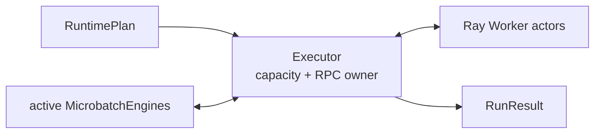
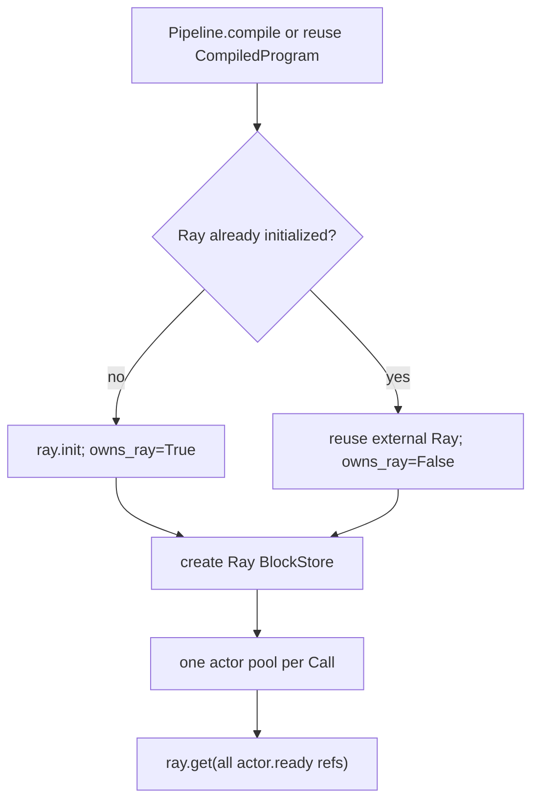
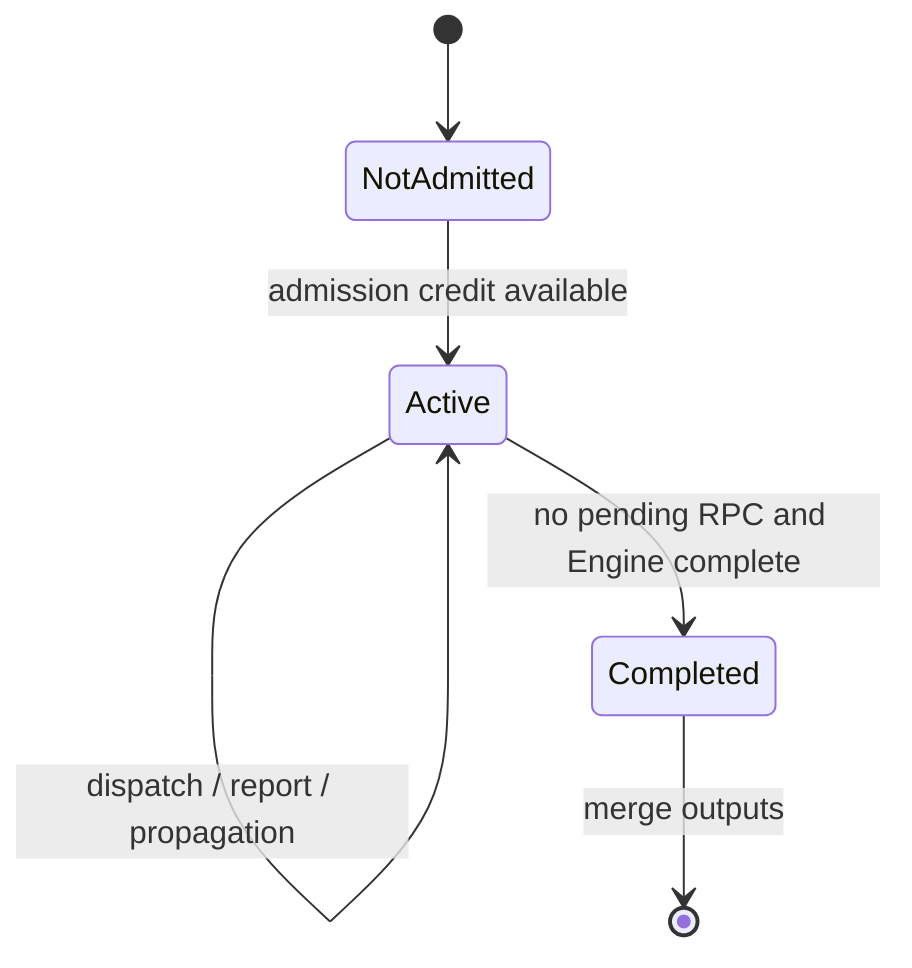
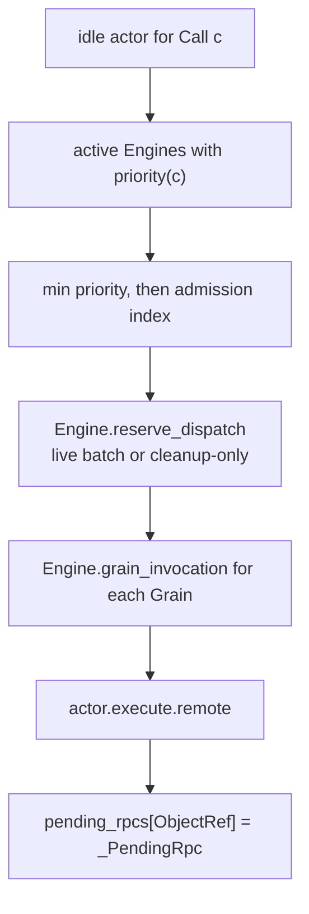
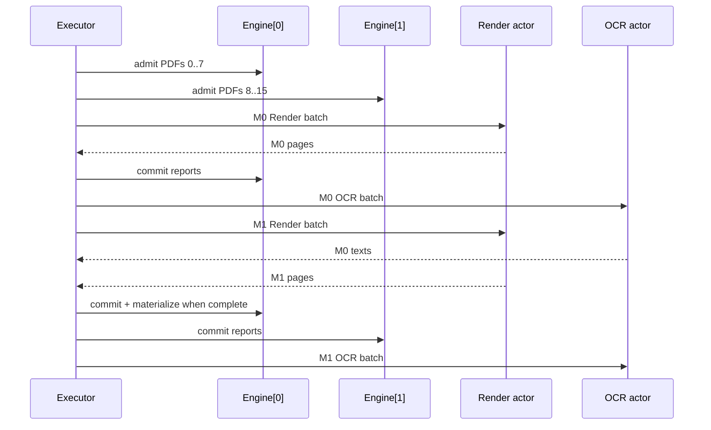

# 06. Executor event loop: Ray transport and cleanup

[`execution/executor.py`](../../rayorch/experimental/multigrain_v3_6/execution/executor.py)
is the only component that owns Ray actor handles and pending RPC references.
The Chinese version is retained as
[`06_executor_event_loop.zh.md`](06_executor_event_loop.zh.md).

## At a glance

The loop admits bounded microbatches, asks the engine for eligible grains,
reserves a batch, submits it to an actor, and feeds the generation-fenced
result back to the engine. Multiple microbatches share persistent actor pools,
but one physical RPC never mixes grains from unrelated calls.

Capacity controls are independent: microbatch admission, active microbatches,
call batch size, replicas, per-actor outstanding RPCs, and actor method
concurrency. The outstanding window includes calls waiting in the Ray mailbox;
keeping it shallow avoids early binding and head-of-line blocking for variable
PDF/OCR work.

On every dispatch failure the reservation is released in a `finally` path before
retry, actor replacement, or run termination. This prevents a permanently busy
actor. Infrastructure retries replace a dead actor when the compiled policy
allows it; opaque UDF failures follow the pure `RecoveryPolicy` algebra.

At commit time the executor rechecks suppression barriers. An already submitted,
healthy sibling commits normally if no barrier exists; if a barrier was
established while it was in flight, its value is discarded as `SUPPRESSED`.

Integration tests should cover actor construction failure, actor crash and
replacement, persistent pools, multiple microbatches, cleanup, late reports,
and repeated runs.

---

## 06. Reading `execution/executor.py` section by section: Ray actors and the multi-microbatch event loop

Main source: [`execution/executor.py`](../../rayorch/experimental/multigrain_v3_6/execution/executor.py).

The Executor is the only main component in V3.6 that knows about Ray scheduling objects. It does
not interpret Filter/Reduce or write Items directly; it merely feeds the READY Grains of an
active Engine into idle actors, and hands Worker results back to the originating Engine.

---

### 1. The Executor's exact responsibilities

The Executor owns:

- Ray runtime ownership;
- a persistent actor pool per Call;
- actor busy capacity;
- the pending Ray ObjectRef to pending RPC mapping;
- active/completed microbatch lifecycles;
- work-conserving dispatch;
- physical exception classification, actor replacement, and recovery handoff;
- run-local metrics and final output merging.

The Executor does not own:

- Item/Expansion/Entity and lineage;
- direct writes of GrainRecord/queue/generation;
- the primitive outcome algebra;
- UDF input/output normalization;
- Logical Origin or compiler passes.



---

### 2. Source map

| Source section | Role | Core invariant |
| --- | --- | --- |
| [four driver-local DTOs](../../rayorch/experimental/multigrain_v3_6/execution/executor.py#L30-L67) | counters, actor, microbatch, pending RPC | Ray objects do not leak into the Engine |
| [`Executor.__init__`](../../rayorch/experimental/multigrain_v3_6/execution/executor.py#L70-L121) | compile, Ray ownership, build pools, ready barrier | even a half-initialized Executor can clean up |
| [`run`](../../rayorch/experimental/multigrain_v3_6/execution/executor.py#L125-L257) | the complete driver event loop | pending Refs and pending RPCs correspond one to one |
| [`close`](../../rayorch/experimental/multigrain_v3_6/execution/executor.py#L259-L275) | reclaim actors and the owned Ray runtime | idempotent, distinguishes external Ray |
| [observation/metrics](../../rayorch/experimental/multigrain_v3_6/execution/executor.py#L279-L356) | best-effort snapshot and run-local freezing | diagnostics never change business results |
| [source admission](../../rayorch/experimental/multigrain_v3_6/execution/executor.py#L360-L391) | source columns to an independent Engine | no semantic state is shared across microbatches |
| [`_dispatch_ready`](../../rayorch/experimental/multigrain_v3_6/execution/executor.py#L393-L435) | an idle actor picks up READY work | one RPC never spans microbatches |
| [failure/recovery](../../rayorch/experimental/multigrain_v3_6/execution/executor.py#L439-L518) | typed failure to policy/action/actor replace | infra failures are separated from UDF failures |
| [pool and pure helpers](../../rayorch/experimental/multigrain_v3_6/execution/executor.py#L522-L577) | actor construction, naming, output tree merging | pools are created per Call only |

---

### 3. Four driver-local DTOs

#### `_CallCounters`

Records the current `run()`'s actor instances, RPCs, Grains, retries, and batch sizes. It is
rebuilt on every run to avoid confusion with the lifetime observations of persistent actors.

#### `_ActorSlot`

```text
CallRef + actor handle + busy bit
```

It is the driver's capacity token. The Engine does not know which actor executes a Grain.

#### `_MicrobatchSlot`

```text
admission index + unique MicrobatchEngine
```

Each source slice has its own RuntimeState/DispatchState; actor pools may be shared, but semantic
facts must not be mixed into one Engine across microbatches.

#### `_PendingRpc`

```text
microbatch index + actor slot + exact DispatchBatch
```

A pending ObjectRef is kept only as a dict key; the pending RPC is the sole record that restores full
context once it returns. The generation still lives in `GrainInvocation`/`DispatchState`, and is not
copied as another counter inside the pending_rpc.

---

### 4. `__init__()`: compilation, Ray ownership, and exceptional cleanup

Construction proceeds in this order:



`_owns_ray` is an explicit lifecycle contract:

- If the Executor initializes Ray itself, `close()` must shut it down;
- if the caller has already initialized Ray, `close()` only kills its own actors and does not
  shut down the external runtime.

Before building a pool, an empty list is registered for each Call and actors are appended one by
one. If construction of the Nth actor or the ready barrier synchronization fails, the outer
`except` calls `close()`, and the first N-1 handles are still reclaimable from the unified
container.

The `ready()` barrier guarantees that `run()` only starts timing after UDF/model construction has
completed.

---

### 5. `run()` pre-processing: finite sources and microbatch slices

`_ready_fifo_by_callize_sources()` eagerly materializes the public `Sequence` inputs into tuples and
validates that:

- the number of source columns equals the number of `Pipeline.forward` parameters;
- all columns are row-aligned.

`microbatch_size` slices the columns by the same ranges. Empty input still produces one empty
slice:

```text
sources=([], []) -> slices=[((), ())]
```

This way empty input follows the same admission/completion/materialization semantics, with no
need for a bypass return. A finite eager input contract is deliberately adopted here; no
streaming input/output semantics are declared.

On every run:

- the driver BlockStore dereference cache is cleared;
- `_CallCounters` is rebuilt;
- run-local `active/completed/pending` containers are created;
- the actor pools and Worker UDF instances remain persistent.

---

### 6. Four invariants of the event loop

The source lists them right before the `while`:

```text
1. active[index] uniquely owns that microbatch's Engine
2. every pending ObjectRef maps to exactly one fenced pending RPC
3. a busy actor has one such pending RPC and is released in finally
4. materialization requires no pending RPC + Engine complete
```

Keep these four in mind, and the following 100-plus lines can be read as repeatedly maintaining
them.



---

### 7. Event loop part 1: filling the active admission window

As long as:

```text
source slices remain
and len(active) < max_active_microbatches
```

`_admit_microbatch()` is called, which:

1. creates an independent `MicrobatchEngine(plan)`;
2. writes each source column as one coarse block;
3. creates per-row `RowBinding`s;
4. lets compiler demand control use the original bool values directly for sources;
5. calls `engine.admit_sources()`;
6. calls `engine.close_admission()`.

`max_active_microbatches` only limits how many source slices are active at once; it does not change
the actor replicas per Call or the dispatch batch size.

---

### 8. Event loop part 2: work-conserving dispatch

`_dispatch_ready()` iterates over Calls and actor slots in its outer loops. For each idle actor:

1. query every active Engine for its highest dispatch priority for that Call;
2. take the minimum candidate by `(priority, microbatch_index)`;
3. reserve from that Engine, at most `pool.batch_size`; if this only cleans up
   barriered READY Grains, no RPC is sent this round;
4. project a `GrainInvocation` per Grain for the non-empty live batch;
5. take the compiler-generated output layouts;
6. submit one actor RPC;
7. mark the actor busy and register `ObjectRef -> _PendingRpc` in `pending_rpcs`;
8. update run-local counters.



Dispatch is immediate and work-conserving: whenever an actor is idle, the currently visible
Grains are sent, with no pretense of supporting a timer-based batch waiting window.

A cleanup-only reserve publishes `SUPPRESSED` facts and may expose a Call that was already
traversed earlier in this round; therefore `_dispatch_ready()` returns a progress bit. If there is
no pending RPC at that moment, the event loop simply starts the next round instead of
misdiagnosing valid local state advancement as a deadlock.

One RPC comes strictly from one microbatch. Different microbatches may occupy different actors of
the same Call pool at the same time, but Grains from multiple Engines are never silently mixed
just to fill a batch.

---

### 9. Event loop part 3: completion, materialize, and release

An active microbatch may leave active only when both hold:

```text
its index not referenced by any pending RPC
and engine.is_complete()
```

The order is:

1. `materialize_tree()` reads business values along the public output tree;
2. the BlockStore dereference cache is cleared;
3. `engine.release_values()` clears the runtime binding tables;
4. the Entity/Item/Expansion/Grain/released metrics of that microbatch are frozen;
5. the active slot is deleted and the admission credit is released.

Materialized Python output has already been copied into the driver result, so the Engine does not
need to keep holding intermediate ObjectRefs such as page images. Semantic outcomes and counters
are still retained until the snapshot completes.

---

### 10. Event loop part 4: waiting for one completing RPC

If not everything is complete yet:

- active is complete but unadmitted slices remain and nothing is pending, so go straight to the
  next round to fill credit;
- active is incomplete, nothing is pending, and there is no new slice, so raise a deadlock
  carrying every Engine's summary;
- pending is non-empty, so `ray.wait(..., num_returns=1)`.

After obtaining one ref, first pop `_PendingRpc` from `pending_rpcs`, then locate the original microbatch
Engine.

```text
ray.get raises
    -> infrastructure failure path

result is DispatchFailure
    -> typed contract/UDF failure path

result is tuple[WorkerReport]
    -> engine.commit_reports(exact `DispatchBatch`, complete result)

finally
    -> actor.busy = False
```

`finally` guarantees that no fake busy capacity is left behind on success, on a recoverable
failure, or when a terminal exception is raised.

---

### 11. Typed failure: each layer adds only the context it owns

#### Contract error

The Worker ABI has been deterministically violated, so the Executor generates an
`ExecutionError` directly, with no UDF retry/split.

#### UDF error

The Executor reads the `RecoveryPolicy` of that Call and derives a `RecoveryAction` from the
batch's completed UDF retries and Grain count. If a suppression barrier has already hit part of the
`DispatchBatch`, the Engine first projects the live subset, and the policy only looks at live Grains;
the barriered subset is not retried. Non-ABORT actions are handed to Engine/DispatchState; the Executor
only updates metrics for the Grains that are actually replayed.

#### Infrastructure error

A Ray `get()` exception means the actor/transport is untrustworthy. The Engine first seals the
barriered subset, then queries and executes the infrastructure retry budget only for the
live subset; the Executor still replaces the untrusted actor regardless of whether the data subset
has already been fully suppressed. Only Grains that are genuinely live/requeued count toward retry
metrics.

#### Final error assembly

The Worker supplies only wire failure details; the Executor adds:

- the Call index;
- the UDF name;
- all GrainRefs;
- the current generation;
- the Worker traceback or the infra exception type.

This keeps the Worker from reading the Program, and keeps the Engine from knowing UDF display
names.

---

### 12. `_replace_actor()`: why replace the handle instead of the slot

`_PendingRpc` holds the `_ActorSlot` object. On an infrastructure failure the Executor:

```text
kill old slot.handle
slot.handle = newly created actor
actor_instances += 1
```

The slot identity is preserved so that `finally` can still set `slot.busy=False`, and the actor
pool list does not need its references updated everywhere. The new actor uses the same Call's
UdfSpec, input layout, and Ray options.

---

### 13. Why observation and metrics are separate

After the business microbatches complete, `_observe_workers()` concurrently requests snapshots
from all actors. A failure of a single observe only records a `WorkerSnapshot.error`; it does not
overturn business output that has already been materialized.

`_freeze_call_metrics()` emits a public tuple ordered by CallRef, avoiding exposure of the
internal Ref-keyed dict to users.

| Metric | Accounting |
| --- | --- |
| `CallMetrics.rpcs/grains/retries/batch_sizes` | current run |
| `CallMetrics.actor_instances` | number of actors used/replaced in the current run |
| `WorkerSnapshot.lifetime_calls` | persistent actor lifetime |
| `MicrobatchMetrics` | semantic scale snapshot of one completed source slice |

When `run()` is repeated, the accounting of the first two categories is therefore explicit, rather
than being silently blended into one set of counters.

---

### 14. Terminal exceptions, `close()`, and Ray runtime ownership

As soon as even one microbatch has been admitted, if an exception later escapes `run()`, the
Executor enters fail-stop: it first best-effort `close()`s the actor pool and then re-raises the
original exception unchanged. The reason is that actor RPCs may still be executing or queued at
that point; merely clearing the local `busy` bit is not enough to prove the physical queue is
clean. An Executor that completed successfully can still be reused across runs; pre-admission
errors such as mismatched source count, arguments, or known length do not contaminate the
Executor.

`close()` is idempotent:

1. mark closed first, so that a partial failure inside cleanup itself cannot lead to reuse;
2. kill every actor handle created by this Executor;
3. clear the actor containers and the BlockStore cache;
4. call `ray.shutdown()` only when `_owns_ray=True`.

Recommended:

```python
with Executor(pipeline) as executor:
    result = executor.run(values)
```

The context manager calls `close()` on both the normal path and the Ctrl-C unwinding path;
terminal business/infrastructure exceptions trigger fail-stop from `run()` itself even without a
context manager. Exceptions during construction are handled by `__init__`'s own cleanup guard.

---

### 15. How the output tree is merged across microbatches

Each microbatch materializes a list/tuple tree isomorphic to `Pipeline.forward()`.
`_merge_outputs()`:

- concatenates leaf lists in admission index order;
- merges tuples recursively by the same position;
- rejects any other shape.

Asynchronous completion order therefore never changes the public row order. The `completed` dict
is keyed by microbatch index and finally read in `range(len(slices))` order.

---

### 16. Tracing two concurrent PDF microbatches

Let `max_active_microbatches=2`, with one actor each for Render and OCR:



The two Engines are completely independent, but Render/OCR actor capacity is shared in a
work-conserving way. No RPC ever contains both M0 and M1 Grains, so recovery and metrics can still
be attributed precisely.

---

### 17. Checklist before modifying the Executor

- Does the new state genuinely belong to actor/RPC/capacity/lifecycle rather than Engine
  semantics?
- Does every pending ObjectRef still have exactly one pending RPC?
- Is actor busy reliably released on all exit paths?
- Does one RPC still come from only one Call and one microbatch?
- Does selection go through the Engine/DispatchState API rather than the Executor mutating queues
  directly?
- Are contract/UDF/RecordFailure/GroupFailure/infra failures still layered, with explicit Failures excluded from
  retry?
- Does actor replacement leave Grain identity unchanged and only trigger a generation retry?
- Before materialize, is it confirmed that there is no pending RPC and the Engine is complete?
- Is output merged in admission order rather than completion order?
- Does close still distinguish owned from external Ray runtime?
- Are diagnostics best-effort, never feeding back into business semantics?

If the Executor grows an `if isinstance(effect, FilterEffect)` or mutates `GrainRecord.phase`
directly, that is a clear case of cross-layer implementation.

Back to the [walkthrough index](README.md), or continue with the
[V3 → V3.6 architecture readability audit](07_v3_vs_v36_readability.md).
