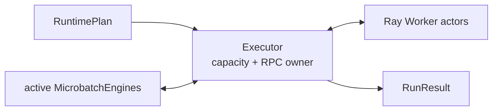
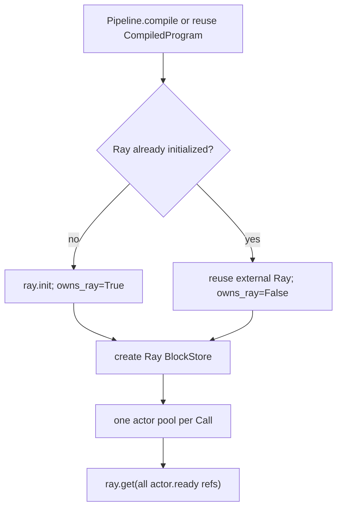
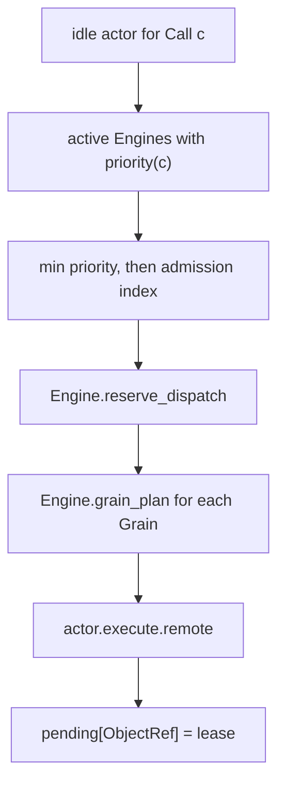
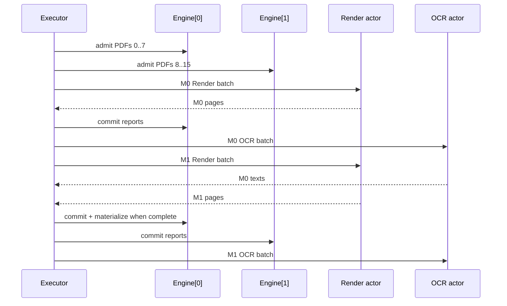

# 06：逐段读懂 `execution/executor.py`——Ray actor 与多 microbatch 事件循环

主源码：[`execution/executor.py`](../../rayorch/experimental/multigrain_v3_6/execution/executor.py)。

Executor 是 V3.6 唯一认识 Ray 调度对象的主组件。它不会解释 Filter/Reduce 或直接写 Item；它
只把 active Engine 的 READY Grain 送入空闲 actor，再把 Worker 结果交回原 Engine。

---

## 1. Executor 的准确职责

Executor 拥有：

- Ray runtime ownership；
- 每个 Call 的持久 actor pool；
- actor busy capacity；
- pending Ray ObjectRef→dispatch lease 映射；
- active/completed microbatch 生命周期；
- work-conserving dispatch；
- 物理异常分类、actor replacement 与 recovery handoff；
- run-local metrics 和最终输出合并。

Executor 不拥有：

- Item/Expansion/Entity 与 lineage；
- GrainRecord/queue/generation 的直接写入；
- primitive outcome 代数；
- UDF input/output normalization；
- Logical Origin 或 compiler pass。



---

## 2. 源码地图

| 源码段 | 作用 | 核心不变量 |
| --- | --- | --- |
| [四个 driver-local DTO](../../rayorch/experimental/multigrain_v3_6/execution/executor.py#L30-L67) | counters、actor、microbatch、lease | Ray 对象不泄漏到 Engine |
| [`Executor.__init__`](../../rayorch/experimental/multigrain_v3_6/execution/executor.py#L70-L121) | 编译、Ray ownership、建 pool、ready barrier | 半初始化也能 cleanup |
| [`run`](../../rayorch/experimental/multigrain_v3_6/execution/executor.py#L125-L257) | 完整 driver event loop | pending Ref 与 lease 一一对应 |
| [`close`](../../rayorch/experimental/multigrain_v3_6/execution/executor.py#L259-L275) | actor 与 owned Ray runtime 回收 | 幂等、区分外部 Ray |
| [observation/metrics](../../rayorch/experimental/multigrain_v3_6/execution/executor.py#L279-L356) | best-effort snapshot 与 run-local 冻结 | 诊断不改变业务结果 |
| [source admission](../../rayorch/experimental/multigrain_v3_6/execution/executor.py#L360-L391) | source columns→独立 Engine | microbatch 间不共享语义状态 |
| [`_dispatch_ready`](../../rayorch/experimental/multigrain_v3_6/execution/executor.py#L393-L435) | 空闲 actor 领取 READY work | 一个 RPC 不跨 microbatch |
| [failure/recovery](../../rayorch/experimental/multigrain_v3_6/execution/executor.py#L439-L518) | typed failure→policy/action/actor replace | infra 与 UDF failure 分离 |
| [pool 与纯 helpers](../../rayorch/experimental/multigrain_v3_6/execution/executor.py#L522-L577) | actor 构造、名字、输出树合并 | pool 只按 Call 创建 |

---

## 3. 四个 driver-local DTO

### `_CallCounters`

记录当前 `run()` 的 actor instances、RPC、Grain、retry 与 batch sizes。每次 run 重建，避免与
持久 actor 的 lifetime observations 混淆。

### `_ActorSlot`

```text
CallRef + actor handle + busy bit
```

它是 driver 的 capacity token。Engine 不知道哪个 actor 执行 Grain。

### `_MicrobatchSlot`

```text
admission index + unique MicrobatchEngine
```

每个 source slice 有独立 RuntimeState/DispatchState；actor pool 可以共享，但语义事实不能跨
microbatch 混在一个 Engine。

### `_DispatchLease`

```text
microbatch index + actor slot + exact DispatchBatch
```

pending ObjectRef 只保存为 dict key，lease 是它返回后恢复完整上下文的唯一记录。generation 仍
在 GrainPlan/DispatchState 中，不在 lease 复制一份计数。

---

## 4. `__init__()`：编译、Ray ownership 与异常清理

构造按以下顺序执行：



`_owns_ray` 是明确生命周期合同：

- Executor 自己初始化 Ray → `close()` 必须 shutdown；
- 调用方已初始化 Ray → `close()` 只杀自己的 actors，不关闭外部 runtime。

构造 pool 前先为每个 Call 登记空 list，再逐 actor append。若第 N 个 actor 构造或 ready barrier
同步失败，外层 `except` 调用 `close()`，前 N-1 个 handle 仍在统一容器中可回收。

`ready()` barrier 确保 UDF/model 构造完成后才允许 `run()` 开始计时。

---

## 5. `run()` 前置处理：source 与 microbatch slices

`_normalize_sources()` 把 iterable 冻结为 tuples，并验证：

- source 列数等于 `Pipeline.forward` 参数数；
- 所有列 row-aligned。

`microbatch_size` 把列按相同范围切片。空输入仍创建一个空 slice：

```text
sources=([], []) -> slices=[((), ())]
```

这样空输入走同一 admission/completion/materialization 语义，不需要旁路返回。

每次 run：

- 清理 driver BlockStore dereference cache；
- 重建 `_CallCounters`；
- 创建 run-local `active/completed/pending` 容器；
- actor pool 和 Worker UDF 实例保持持久。

---

## 6. 事件循环的四条不变量

源码在 while 前直接列出：

```text
1. active[index] uniquely owns that microbatch's Engine
2. every pending ObjectRef maps to exactly one fenced lease
3. a busy actor has one such lease and is released in finally
4. materialization requires no pending lease + Engine complete
```

把这四条记住，后面的 100 多行可以看成重复维护它们。


---

## 7. Event-loop 第一段：填充 active admission window

只要：

```text
还有 source slices
and len(active) < max_active_microbatches
```

就调用 `_admit_microbatch()`：

1. 创建独立 `MicrobatchEngine(plan)`；
2. 每个 source column 写一个 coarse block；
3. 创建逐行 `RowBinding`；
4. 编译器 demand control 的 source 直接使用原 bool values；
5. `engine.admit_sources()`；
6. `engine.close_admission()`。

`max_active_microbatches` 只限制同时活跃的 source slices，不改变每个 Call 的 actor replicas 或
dispatch batch size。

---

## 8. Event-loop 第二段：work-conserving dispatch

`_dispatch_ready()` 外层按 Call 和 actor slot 遍历。每个空闲 actor：

1. 查询每个 active Engine 对该 Call 的最高 dispatch priority；
2. 以 `(priority, microbatch_index)` 取最小候选；
3. 从该 Engine reserve，最多 `pool.batch_size`；
4. 逐 Grain 投影 `GrainPlan`；
5. 取 compiler 生成的 output layouts；
6. 提交一次 actor RPC；
7. 标记 actor busy，并登记 ObjectRef→lease；
8. 更新 run-local counters。



调度是即时、work-conserving 的：actor 空闲就发送当前可见 Grain，不伪装支持 timer-based batch
等待窗口。

一个 RPC 严格来自一个 microbatch。不同 microbatch 可以同时占用同一 Call pool 的不同 actors，
但不会为了凑 batch 把多个 Engine 的 Grain 静默混合。

---

## 9. Event-loop 第三段：完成、materialize 与 release

一个 active microbatch 只有同时满足：

```text
its index not referenced by any pending lease
and engine.is_complete()
```

才可以离开 active。

顺序是：

1. `materialize_tree()` 按 public output tree 读取业务值；
2. 清理 BlockStore dereference cache；
3. `engine.release_values()` 清除 runtime binding 表；
4. 冻结该 microbatch 的 Entity/Item/Expansion/Grain/released metrics；
5. 删除 active slot，释放 admission credit。

materialized Python output 已复制到 driver result，因此 Engine 不必继续持有 page image 等中间
ObjectRef。语义 outcome 与计数仍保留到 snapshot 完成。

---

## 10. Event-loop 第四段：等待一个完成 RPC

若尚未全部完成：

- active 已完成但还有未 admission slice，且无 pending → 直接下一轮填 credit；
- active 未完成、无 pending 且无新 slice → 抛带每个 Engine summary 的 deadlock；
- pending 非空 → `ray.wait(..., num_returns=1)`。

拿到一个 ref 后，先从 `pending` pop lease，再定位原 microbatch Engine。

```text
ray.get raises
    -> infrastructure failure path

result is DispatchFailure
    -> typed contract/UDF failure path

result is tuple[WorkerReport]
    -> engine.commit_report for each Grain

finally
    -> actor.busy = False
```

`finally` 保证成功、可恢复失败或抛出终局异常时都不会遗留假 busy capacity。

---

## 11. typed failure：每层只补自己拥有的上下文

### Contract error

Worker ABI 已确定性违反，Executor 直接生成 `ExecutionError`，不做 UDF retry/split。

### UDF error

Executor 读取该 Call 的 `RecoveryPolicy`，用 batch 的 completed UDF retries 和 Grain count 得到
`RecoveryAction`。非 ABORT 动作交给 Engine/DispatchState 执行；Executor 只更新物理 metrics。

### Infrastructure error

Ray `get()` 抛错说明 actor/transport 不可信。Engine 查询并执行 infrastructure retry budget；若
允许，Executor kill 旧 actor、创建新 actor，并保留 exact batch 重试。

### 最终错误拼装

Worker 只提供 wire failure details；Executor 再加入：

- Call index；
- UDF name；
- 全部 GrainRef；
- 当前 generation；
- Worker traceback 或 infra exception type。

这避免 Worker 读取 Program，也避免 Engine 认识 UDF display name。

---

## 12. `_replace_actor()`：为什么替换 handle 而不是替换 slot

`_DispatchLease` 持有 `_ActorSlot` 对象。基础设施失败时，Executor：

```text
kill old slot.handle
slot.handle = newly created actor
actor_instances += 1
```

保留 slot identity，finally 仍可把 `slot.busy=False`；actor pool list 也无需到处更新引用。新 actor
使用同一 Call 的 UdfSpec、input layout 与 Ray options。

---

## 13. observation 与 metrics 为什么分开

业务 microbatches 完成后，`_observe_workers()` 并发请求所有 actor snapshots。单个 observe 失败
只记录 `WorkerSnapshot.error`，不会推翻已经 materialize 的业务输出。

`_freeze_call_metrics()` 按 CallRef 顺序输出 public tuple，避免把内部 Ref-keyed dict 暴露给用户。

| 指标 | 口径 |
| --- | --- |
| `CallMetrics.rpcs/grains/retries/batch_sizes` | 当前 run |
| `CallMetrics.actor_instances` | 当前 run 使用/替换过的 actor 数 |
| `WorkerSnapshot.lifetime_calls` | 持久 actor lifetime |
| `MicrobatchMetrics` | 单个完成 source slice 的语义规模快照 |

重复 `run()` 时前两类口径因此是明确的，而不是不加说明地混为一组 counters。

---

## 14. `close()` 与 Ray runtime ownership

`close()` 幂等执行：

1. kill 本 Executor 创建的所有 actor handles；
2. 清空 actor containers 和 BlockStore cache；
3. 只有 `_owns_ray=True` 才 `ray.shutdown()`；
4. 标记 closed，后续 `run()` 拒绝。

推荐：

```python
with Executor(pipeline) as executor:
    result = executor.run(values)
```

context manager 在正常、业务异常和 Ctrl-C 展开路径上都会调用 `close()`。构造期间异常则由
`__init__` 自己的 cleanup guard 负责。

---

## 15. 输出树怎样跨 microbatch 合并

每个 microbatch materialize 出与 `Pipeline.forward()` 同构的 list/tuple tree。`_merge_outputs()`：

- 叶子 list 按 admission index 顺序拼接；
- tuple 递归按相同位置合并；
- 其他形状拒绝。

因此异步完成顺序不会改变公开 row 顺序。`completed` dict 用 microbatch index 保存，最终按
`range(len(slices))` 读取。

---

## 16. 跟踪两个并发 PDF microbatches

设 `max_active_microbatches=2`，Render 与 OCR 各有一个 actor：



两个 Engine 完全独立，但 Render/OCR actor capacity 被 work-conserving 地共享。任何一个 RPC 都
不会同时包含 M0 与 M1 Grain，所以 recovery 与 metrics 仍能精确归属。

---

## 17. 修改 Executor 前的检查清单

- 新状态是否确实属于 actor/RPC/capacity/lifecycle，而非 Engine 语义？
- 每个 pending ObjectRef 是否仍有唯一 lease？
- actor busy 是否在所有退出路径可靠释放？
- 一个 RPC 是否仍只来自一个 Call、一个 microbatch？
- selection 是否通过 Engine/DispatchState API，而不是 Executor 直接改 queue？
- contract/UDF/record/infra failure 是否保持分层？
- actor replacement 是否不改变 Grain identity，只触发 generation retry？
- materialize 前是否确认无 pending lease且 Engine complete？
- output 是否按 admission 顺序合并，而非 completion 顺序？
- close 是否继续区分 owned/external Ray runtime？
- diagnostics 是否 best-effort，不反向影响业务语义？

如果 Executor 新增了 `if isinstance(effect, FilterEffect)` 或直接修改 `GrainRecord.phase`，就是明确
的越层实现。

返回[导读索引](README.md)，或继续阅读随后补充的 V3→V3.6 架构可读性审计。
