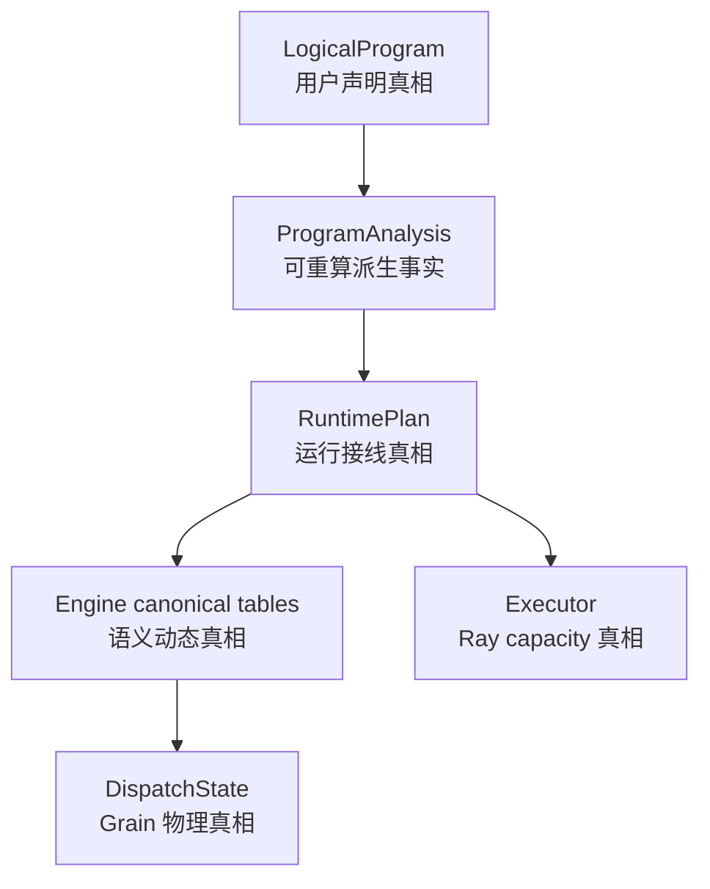

# 07：V3→V3.6 架构可读性审计——是否已经达到当前最优抽象

> **文档生态位：V3 与 V3.6 的解释成本和架构质量对比。** 本文不维护待修 backlog；当前
> 源码问题、证据缺口和候选方案统一见
> [`V3.6 架构审计待确认项`](../todos/22-v36-architecture-audit-findings.md)。全部阅读路线见
> [`V3.6 文档地图`](../multigrain_v3_6_documentation_map.md)。

这篇不介绍新功能，而是回答一个更严格的问题：V3.6 是否只是把 V3 的大文件拆开，还是确实
消除了导致 V3 难读、难改和多处真相的根因？

对照源码：

- V3：[`api.py`](../../rayorch/experimental/multigrain_v3/api.py)、
  [`dag.py`](../../rayorch/experimental/multigrain_v3/dag.py)、
  [`arena/engine.py`](../../rayorch/experimental/multigrain_v3/arena/engine.py)、
  [`model.py`](../../rayorch/experimental/multigrain_v3/model.py)
- V3.6：[`api.py`](../../rayorch/experimental/multigrain_v3_6/api.py)、
  [`program/`](../../rayorch/experimental/multigrain_v3_6/program)、
  [`runtime/`](../../rayorch/experimental/multigrain_v3_6/runtime)、
  [`execution/`](../../rayorch/experimental/multigrain_v3_6/execution)

---

## 1. 先给结论

结论分两层：

1. **相对 V3，V3.6 是逻辑抽象层面的实质性跃迁，不是文件搬家。** 它已经是 V3→V3.6
   各版中，静态语义、动态状态机、唯一写入权和用户心智模型最清晰的一版。
2. **不能称为脱离约束的“绝对最优解”。** 当前核心架构已经接近局部最优，继续大拆通常只会
   增加 DTO 和跳转；生命周期、诊断协议、验证证据和 symbolic typing 等边角仍需独立 QA。

因此最准确的判断是：

> V3.6 已经达到当前语义范围内值得冻结的主架构；完成独立审计项不要求再做概念级重构，也
> 不应为了缩短文件而拆散状态 owner。

---

## 2. “更优”用什么标准判断

不能只用文件行数。当前排除 benchmark 后，V3 核心约 4,821 行，V3.6 核心约 5,259 行；V3.6
并没有靠少写代码取胜。

本审计使用五个标准：

| 标准 | 好的表现 |
| --- | --- |
| 心智正交 | 计算、结构、身份、状态、物理执行能分别解释 |
| 唯一事实 | 每份可变状态有一个 owner，索引不成为第二份记录 |
| 局部可推理 | 读一个 feature 不需要跨多个无关机制追条件 |
| 穷尽性 | 新 primitive/outcome/event 漏实现时能静态或测试失败 |
| 修改路径 | 新功能沿固定路径落地，不需要跨层快捷线 |

按这些标准，V3.6 的优势来自重新选择抽象边界，而非目录更漂亮。

---

## 3. V3 并不是“完全没有好设计”

为了避免错误归因，先保留 V3 的真实优点：

- `ArenaEngine` 对外确实是 single writer；`RunDriver` 没有直接读写 Arena 内部 tables。
- `PortId / EntityId / ItemRef / GrainId` 已经区分静态位置、业务 occurrence 和计算身份。
- `GroupShape` 使用 CSR offsets，支持 nested empty group，是后来版本应继承的正确方向。
- `CompiledDAG` 已有 direct consumer indexes，不是完全靠运行时全图扫描。
- execution pool 与 Arena 分离，actor credit 和 multi-Arena overlap 已有明确实现。
- hashed lineage identity 与 generation fencing 具备强正确性基础。

所以 V3 的问题不宜简单概括为“所有组件互相乱改状态”。更准确地说：

> 外部边界已有纪律，但内部把过多正交语义压进 `StageSpec + ArenaEngine`，形成一个逻辑上高度
> 耦合的巨型解释器。

---

## 4. V3 难读的第一个根因：一个 Stage 同时代表计算与结构

V3 用户 API 暴露：

```text
Map(UDF)
Filter(UDF)
Expand(UDF)
Reduce(UDF)
```

每个 primitive 都是 UDF stage、actor pool、input alignment 和结构语义的组合。
[`_TraceContext.call()`](../../rayorch/experimental/multigrain_v3/api.py#L125-L237) 必须先按 Python
class 映射 `Primitive`，再分别决定：

- input names 与 modes；
- `driving_input`；
- output count；
- Reduce anchor/members/scope path；
- UDF 与 execution config。

这造成一个名称同时回答过多问题：

```text
Filter 是一段计算？一个 mask 关系？一组同步转发 outputs？一个 actor stage？
```

V3.6 改为两个正交轴：

```text
RayModule Call = 计算边界、Grain、actor、RPC
F.*            = Port/Domain 结构关系，不创建 Call
```

因此 `F.filter(values, masks)` 不再需要 driving input，不执行 UDF，也不为所有输入隐式产生 outputs。
这不是 API 换皮，而是让“计算发生在哪里”和“数据粒度如何变化”可以独立推理。

---

## 5. 第二个根因：Port 与 scope 都依赖 Stage 解释

V3 `PortId` 是：

```text
PortId(stage, output)
```

Port 位置与 producer Stage identity 耦合。某 Port 位于哪个粒度，则由
[`_TraceContext._scope()`](../../rayorch/experimental/multigrain_v3/api.py#L281-L307) 递归查看
producer kind，并用 Expand Stage ids 拼 tuple 推导。

这会让读者在理解一个 Port 时同时追问：

1. producer 是哪个 Stage？
2. Stage 是 Map/Filter/Expand/Reduce 哪种？
3. driving input 是哪个？
4. scope tuple 如何经 Reduce 回退？

V3.6 把三个坐标拆开：

```text
PortRef   = 图上数据位置
CallRef   = 静态计算调用点
DomainRef = Entity 对齐空间
```

每个 `PortSpec` 直接保存 Domain；Domain 自身是一棵显式 parent tree。Expand 创建 child Domain，
Reduce 回 parent，Filter 保持 Domain，Broadcast 显式跨 ancestor→descendant。

因此同 Domain Call input alignment 无需从 StageKind 递归推断。这是显著降低人类工作记忆的核心
变化。

---

## 6. 第三个根因：Grain 身份携带完整输入形状

V3 `GrainId` 由 Stage 和按编译顺序排列的 `InputBinding` 哈希得到；Group input 还带 shape。这个
方案确定且强健，但理解某次逻辑计算身份时，需要同时理解 input names、ordered ItemRefs、group
shape 和 stage semantics。

V3.6 将同 Domain Call 的所有输入身份对齐，Grain 简化为：

```text
GrainRef = CallRef × EntityRef
```

多输入只影响 Worker ABI slots，多输出只影响同一 Grain 的 output Items；它们不改变 Grain
identity。这样自然删除了 `driving_input/driven_by` 身份权威。

代价是 V3.6 明确要求 Call inputs 同 Domain；跨粒度必须先写结构关系。这个限制不是能力退化，
而是拒绝隐式 join，从而换取完备、可预测的身份代数。

---

## 7. 第四个根因：ArenaEngine 是单写者，但拥有太多种状态

V3 [`ArenaEngine`](../../rayorch/experimental/multigrain_v3/arena/engine.py) 共 1,469 行。构造函数
同时建立：

- Grain/Item/Entity/Expand tables；
- pending invocations 与 ReduceAccumulator；
- value/block tables；
- receipt queue；
- Stage normal/immediate/tail queues；
- dispatch leases；
- hard-limit counters；
- recovery tasks/budgets；
- metrics 与 timeline。

单写者避免了外部竞态，却不能避免内部认知耦合。同一个文件必须同时解释：

```text
receipt routing
→ driving input classification
→ Reduce fanout accumulator
→ batch timeout/reservation
→ AttemptToken
→ Filter/value commit
→ UDF/infra recovery
→ materialize/reclaim
```

读 `_publish_item()` 前后并不能只关心 publication，还要理解 queue、limit、reduce slot、block
ownership 与 failure task。

V3.6 没有盲目把每张 dict 拆成一个服务，而是按状态机 owner 分成：

| V3.6 owner | 唯一拥有 |
| --- | --- |
| `MicrobatchEngine` | Item/Expansion/Entity/value binding/lineage/fact propagation |
| `DispatchState` | Grain phase/generation/normal-immediate-tail queues |
| `RecoveryPolicy` | 无状态恢复决策 |
| `Worker` | value-only UDF ABI |
| `Executor` | actor、RPC lease、capacity、多 microbatch 生命周期 |

拆分点对应不同状态机，而不是按代码长度切文件，所以是架构变化。

---

## 8. 第五个根因：V3 runtime 持续解释 `Primitive` kind

V3 compiler 生成 `StageSpec(kind, driving_input, reduce, udf, execution, ...)`，Arena/Execution/Worker
仍在多处读取 `stage.kind`：

- routing 时 REDUCE 走 accumulator，其余走 aligned；
- drop/suppression 时 EXPAND 单独发布 fanout；
- commit 时 FILTER 与 value outputs 分两套；
- value commit 内 MAP/REDUCE/EXPAND 再分支；
- failure output 时 EXPAND 再分支；
- execution 层对 FILTER output contract 再分支。

这些判断各自有理由，但一项 primitive 语义被横向散布在 authoring、DAG verifier、Arena、Worker
和 execution 层。新增或改变一种 primitive 时，很难证明没有漏掉某个 `stage.kind` case。

V3.6 引入固定 compiler boundary：

```text
Origin
→ PrimitiveSemantics
→ ProgramAnalysis
→ complete RuntimePlan Effect/index/layout
→ Engine interprets Effect
```

Engine 源码中没有任何 `PortOrigin`/`FilterOrigin`/`BroadcastOrigin` 解释；Worker 只读取 compiler
layout。这让静态声明与动态执行真正分离。

---

## 9. 第六个根因：状态组合与物理动作混写

V3 `GrainRecord.reserve/release/seal()` 自身维护 phase/outcome/active AttemptToken；ArenaEngine 同时
决定 recovery preset、修改 queue、发布 outputs 和处理 actor failure。其正确性很强，但维护者要
从多个 imperative 方法还原完整状态图。

V3.6 显式分为：

```text
transitions.py  = phase/outcome 的纯封闭代数
RecoveryPolicy  = immutable facts -> RecoveryAction
DispatchState   = 唯一物理 phase/queue/generation writer
Engine          = semantic publication
Executor        = actor replacement
```

每个 `(phase,event)` 和 outcome 笛卡尔积都可以 Ray-free 穷举测试。维护者不必靠遍历所有调用点
猜“还有没有另一条合法边”。

---

## 10. 一份真相是否真的得到实现

V3.6 不只是文档声称唯一 owner，还有源码门禁：

- [`test_package_boundaries.py`](../../test/experimental/multigrain_v3_6/unit/test_package_boundaries.py)
  用 AST 检查 program/runtime/execution 依赖边界；
- [`test_compiler_pipeline.py`](../../test/experimental/multigrain_v3_6/unit/test_compiler_pipeline.py)
  证明 Engine 不解释 Origin，且 `DispatchState` 是 Grain phase/generation/counter 的唯一写者；
- [`test_transition_algebra.py`](../../test/experimental/multigrain_v3_6/unit/test_transition_algebra.py)
  穷举动态状态组合；
- RuntimePlan verifier 检查每个 structural target 只有一个 Effect object，所有 trigger indexes 指向
  同一个对象，而非复制等价规则。

当前关键事实关系是：



Analysis 与索引的存在不等于第二份真相：前者可由 LogicalProgram 重算，后者引用 canonical
Effect object；事件 FIFO 也只携带 Ref，不复制 record 内容。

---

## 11. V3.6 为什么仍有 989 行 Engine，但不等于回到 V3

V3.6 Engine 仍需在同一个 mutation owner 内完成：

- source admission；
- report preflight 与 publication frontier；
- Item/Expansion/Entity gateway；
- Call/Filter/Reduce/Broadcast Effect interpretation；
- lineage 与 group binding 构造。

这些都围绕一个不变量：**只有完整 canonical fact 能被下游观察**。如果为缩短文件，把每种
primitive 拆成持有 `_state` 的可变 service，就会重新出现共享写入权或一串 owner 回调。

当前更合理的维护方式是：

- 用文件内阶段注释和本套逐段导读降低阅读成本；
- 纯 outcome 逻辑继续放 `transitions.py`；
- Grain queue 继续放 `dispatch.py`；
- 只有当 report validation 出现多种独立协议时，才考虑抽取纯 validator。

所以 `engine.py` 的剩余长度主要是不可约业务语义的集中，而 V3 的 1,469 行 Arena 还混合了
queue、lease、recovery budget、block ownership、batch timeout 与 timeline。两者性质不同。

---

## 12. `_facts + advance()` 是否是多余抽象

不是。它们是 Engine 内部的最小 fixed-point scheduler：

```text
publication gateway
    -> 先写完整 canonical record
    -> enqueue identity-only FactEvent
advance
    -> 按 RuntimePlan index 应用 Effects
    -> 新 publication 再入队
    -> 队列为空即局部不动点
```

若删除 FIFO，publication gateway 就必须递归调用下游：

- 深图依赖 Python call stack；
- commit 中产生重入，下游可能在上游 publication turn 尚未完整时运行；
- Item/Expansion/Entity 各自容易长出不同递归路径；
- 新 feature 更容易从某个 gateway 直接调用另一个组件，形成飞线。

因此问题是教程此前先使用 `_facts/advance` 再定义它们，而不是机制本身没有必要。主教程已改为
先介绍 canonical tables、Fact FIFO 和 `advance()` 的闭环，再解释 publication；详细实现留在
[Engine 导读](03_runtime_engine.md)。

---

## 13. 当前改进项为什么单独维护

架构对比回答“抽象是否更好”，待修清单回答“哪段源码在什么 bad case 下仍有问题”。把两者写在
同一处，会让尚未 QA 的候选方案看起来像规范结论，也会导致问题状态在多个文档中漂移。

当前完整列表、源码证据、优先级和建议见
[`V3.6 架构审计待确认项`](../todos/22-v36-architecture-audit-findings.md)，其中包括：

- 当前目录重组与既有真实 workload 报告之间的证据边界；
- 终止 `run()` 后 Executor 的 fail-stop/复用合同；
- Worker observation 的 workload 名称飞线；
- RayModule symbolic typing 的延后设计；
- 已审视但当前不建议继续拆分的 Engine 逻辑。

这些事项都可以在现有 owner 边界内解决，不构成重新引入通用 IR、driver port 或额外状态机的理由。

---

## 14. 最终评分

| 维度 | V3 | V3.6 | 判断 |
| --- | --- | --- | --- |
| 用户原语 | compute/structure 合在 Stage primitive | RayModule Call 与 F.* 正交 | V3.6 显著更清楚 |
| 静态身份 | Port 绑定 producer Stage，scope 递归推导 | Port/Call/Domain 显式分离 | V3.6 更低心智负担 |
| Grain 身份 | Stage + full InputBindings hash | Call × Entity | V3.6 更直接可调试 |
| 编译边界 | DAG indexes，但 runtime 继续解释 Primitive | Origin→Effect/layout 后 runtime 不回读 | V3.6 更完整 |
| 动态状态 | Arena single writer 但职责过宽 | Engine/Dispatch/Executor 按状态机分 owner | V3.6 更局部可推理 |
| 状态穷尽 | imperative record/Stage branches | 纯 transition + Cartesian tests | V3.6 更易证明 |
| 恢复 | 功能丰富但侵入 Arena | policy decision/dispatch action/actor replace 分层 | V3.6 更易维护 |
| 飞线 | 外部边界尚可，内部 kind cases 横向散布 | 主语义无明显飞线；诊断残留单独跟踪 | V3.6 接近冻结标准 |
| 代码量 | 更少 | 略多 | V3.6 以显式合同换可读性，值得 |

最终结论：V3.6 不是理论上永远不可改进的“宇宙最优解”，但已经是当前功能集合下的**最佳局部
架构**。完成独立生命周期/诊断/验证门禁后，最合理动作是冻结主抽象并通过新增 feature 验证
它，而不是继续拆层或发明新的中间表示。
