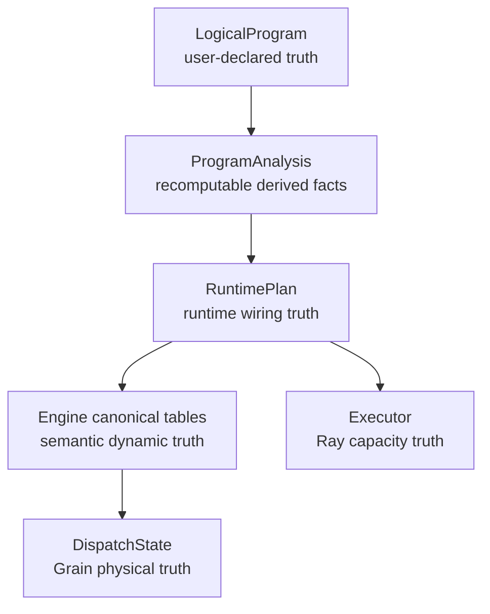

# 07. V3 versus V3.6: readability audit

This page records the architectural comparison; it is not another runtime
component. The Chinese audit is retained as
[`07_v3_vs_v36_readability.zh.md`](07_v3_vs_v36_readability.zh.md).

## At a glance

V3.6 makes three boundaries explicit:

1. a fixed compiler turns symbolic declarations into a frozen runtime plan;
2. a single-writer engine owns semantic facts and a private fact FIFO;
3. a Ray executor owns transport, actors, and RPC lifecycle.

The result is more code in the narrow runtime files but fewer cross-layer
assumptions. Structural operations do not create hidden actors, and transport
code does not interpret primitive semantics. `RecordFailure` and `GroupFailure`
are explicit data outcomes, while opaque dispatch failures remain a separate
recovery algebra.

The audit should be read with the tests: readability is useful only when each
owner has a small, executable contract. Historical v3--v3.5 directories are
kept for comparison and are not part of the reviewer baseline.

---

## 07. V3→V3.6 architecture readability audit: has it reached the current optimal abstraction?

> **Document niche: comparing the explanation cost and architectural quality
> of V3 and V3.6.** This page does not maintain a repair backlog; current source
> problems, evidence gaps, and candidate solutions are all collected in
> [`V3.6 Architecture Audit Open Items`](../todos/22-v36-architecture-audit-findings.md).
> All reading routes are listed in the
> [`V3.6 Documentation Map`](../multigrain_v3_6_documentation_map.md).

This page introduces no new functionality. It answers a stricter question: is
V3.6 merely the result of splitting V3's large files apart, or has it actually
eliminated the root causes that made V3 hard to read, hard to change, and
scattered across multiple sources of truth?

Source code under comparison:

- V3: [`api.py`](../../rayorch/experimental/multigrain_v3/api.py),
  [`dag.py`](../../rayorch/experimental/multigrain_v3/dag.py),
  [`arena/engine.py`](../../rayorch/experimental/multigrain_v3/arena/engine.py),
  [`model.py`](../../rayorch/experimental/multigrain_v3/model.py)
- V3.6: [`api.py`](../../rayorch/experimental/multigrain_v3_6/api.py),
  [`program/`](../../rayorch/experimental/multigrain_v3_6/program),
  [`runtime/`](../../rayorch/experimental/multigrain_v3_6/runtime),
  [`execution/`](../../rayorch/experimental/multigrain_v3_6/execution)

---

### 1. The conclusion first

The conclusion has two layers:

1. **Relative to V3, V3.6 is a substantive leap at the level of logical
   abstraction, not a file-shuffling exercise.** Across all versions from V3 to
   V3.6, it is the one with the clearest static semantics, dynamic state
   machine, single write authority, and user mental model.
2. **It cannot be called an "absolute optimum" that escapes all constraints.**
   The current core architecture is already close to a local optimum; further
   large splits usually only add DTOs and indirection. Lifecycle, diagnostic
   protocols, verification evidence, and symbolic typing still need independent
   QA on the periphery.

The most accurate judgment is therefore:

> V3.6 has reached a main architecture worth freezing within the current
> semantic scope; completing the independent audit items does not require
> another concept-level refactor, nor should state owners be broken apart just
> to make files shorter.

---

### 2. What criteria decide "better"?

Line count alone is not enough. Excluding benchmarks today, the V3 core is
about 4,821 lines and the V3.6 core is about 5,259 lines; V3.6 does not win by
writing less code.

This audit uses five criteria:

| Criterion | What good looks like |
| --- | --- |
| Mental orthogonality | computation, structure, identity, state, and physical execution can each be explained separately |
| Single source of truth | every piece of mutable state has one owner, and indexes do not become a second record |
| Local reasonability | reading one feature does not require chasing conditions across several unrelated mechanisms |
| Exhaustiveness | when a new primitive/outcome/event is left unimplemented, static checks or tests fail |
| Modification path | new features land along a fixed path, without cross-layer shortcuts |

Measured against these criteria, V3.6's advantage comes from re-choosing the
abstraction boundaries, not from having a prettier directory layout.

---

### 3. V3 was not "completely without good design"

To avoid misattribution, V3's real merits are preserved here:

- `ArenaEngine` really was a single writer from the outside; `RunDriver` did not
  directly read or write Arena's internal tables.
- `PortId / EntityId / ItemRef / GrainId` already separated static position,
  business occurrence, and computational identity.
- `GroupShape` used CSR offsets and supported nested empty groups, the right
  direction for later versions to inherit.
- `CompiledDAG` already had direct consumer indexes rather than relying
  entirely on full-graph runtime scans.
- The execution pool was separated from Arena, and actor credit and multi-Arena
  overlap already had clear implementations.
- Hashed lineage identity and generation fencing provided a strong correctness
  foundation.

So V3's problems should not be summarized crudely as "all components mutate
each other's state." More precisely:

> The external boundary already had discipline, but internally too many
> orthogonal semantics were compressed into `StageSpec + ArenaEngine`, forming a
> logically highly coupled giant interpreter.

---

### 4. Root cause 1: one Stage represented both computation and structure

The V3 user API exposed:

```text
Map(UDF)
Filter(UDF)
Expand(UDF)
Reduce(UDF)
```

Every primitive was a combination of UDF stage, actor pool, input alignment,
and structural semantics.
[`_TraceContext.call()`](../../rayorch/experimental/multigrain_v3/api.py#L125-L237)
first had to map the Python class to a `Primitive`, and then decide separately:

- input names and modes;
- `driving_input`;
- output count;
- the Reduce anchor/members/scope path;
- UDF and execution config.

This made one name answer too many questions at once:

```text
Is Filter a piece of computation? a mask relation?
a set of synchronously forwarded outputs? an actor stage?
```

V3.6 replaces this with two orthogonal axes:

```text
RayModule Call = computation boundary, Grain, actor, RPC
F.*            = Port/Domain structural relations, creates no Call
```

As a result, `F.filter(values, masks)` no longer needs a driving input, does not
execute a UDF, and does not implicitly produce outputs for all inputs. This is
not an API reskin; it makes "where computation happens" and "how data
granularity changes" independently reason-able.

---

### 5. Root cause 2: Port and scope both depended on Stage interpretation

In V3, `PortId` was:

```text
PortId(stage, output)
```

Port position was coupled to producer Stage identity. The granularity a Port
lived at was derived by
[`_TraceContext._scope()`](../../rayorch/experimental/multigrain_v3/api.py#L281-L307),
which recursively inspected the producer kind and assembled a tuple from Expand
Stage ids.

This forces a reader to chase down several questions at once when trying to
understand a single Port:

1. which Stage is the producer?
2. is the Stage Map/Filter/Expand/Reduce, and which one?
3. which one is the driving input?
4. how does the scope tuple fall back through a Reduce?

V3.6 splits the three coordinates apart:

```text
PortRef   = data position on the graph
CallRef   = static computation call site
DomainRef = Entity alignment space
```

Each `PortSpec` stores its Domain directly, and Domain itself is an explicit
parent tree. Expand creates a child Domain, Reduce returns to the parent,
Filter keeps the Domain, and Broadcast explicitly crosses ancestor→descendant.

Therefore, input alignment for Calls in the same Domain no longer needs to be
recursively inferred from `StageKind`. This is the core change that
significantly reduces human working-memory load.

---

### 6. Root cause 3: Grain identity carried the full input shape

In V3, `GrainId` was obtained by hashing the Stage together with the
`InputBinding`s ordered by compilation; Group inputs additionally carried a
shape. This scheme is deterministic and robust, but understanding the identity
of one logical computation required simultaneously understanding input names,
ordered `ItemRef`s, group shape, and stage semantics.

V3.6 aligns the identities of all inputs of a Call in the same Domain, and
Grain simplifies to:

```text
GrainRef = CallRef × EntityRef
```

Multiple inputs only affect Worker ABI slots, and multiple outputs only affect
the output Items of the same Grain; neither changes Grain identity. This
naturally removes `driving_input/driven_by` as an identity authority.

The cost is that V3.6 explicitly requires Call inputs to share the same Domain;
crossing granularity requires writing a structural relation first. This
restriction is not a capability regression — it is a refusal of implicit joins,
traded for a complete and predictable identity algebra.

---

### 7. Root cause 4: ArenaEngine was a single writer, but owned too many kinds of state

The V3 [`ArenaEngine`](../../rayorch/experimental/multigrain_v3/arena/engine.py)
is 1,469 lines in total. Its constructor establishes, all at once:

- Grain/Item/Entity/Expand tables;
- pending invocations and `ReduceAccumulator`;
- value/block tables;
- the receipt queue;
- Stage ready, immediate-retry, and deferred-recovery queues;
- pending RPCs;
- hard-limit counters;
- recovery tasks/budgets;
- metrics and timeline.

A single writer avoids external races, but it cannot avoid internal cognitive
coupling. The same file had to explain all of the following at once:

```text
receipt routing
→ driving input classification
→ Reduce fanout accumulator
→ batch timeout/reservation
→ AttemptToken
→ Filter/value commit
→ UDF/infra recovery
→ materialize/reclaim
```

Reading around `_publish_item()` does not let you care only about publication;
you also have to understand queues, limits, the reduce slot, block ownership,
and the failure task.

V3.6 does not blindly split every dict into its own service. It divides
ownership by state-machine owner:

| V3.6 owner | Solely owns |
| --- | --- |
| `MicrobatchEngine` | Item/Expansion/Entity/value binding/lineage/fact propagation |
| `DispatchState` | Grain phase/generation and ready/immediate-retry/deferred-recovery queues |
| `RecoveryPolicy` | stateless recovery decisions |
| `Worker` | value-only UDF ABI |
| `Executor` | actor, pending RPC, capacity, multi-microbatch lifecycle |

The split points correspond to different state machines rather than to slicing
files by code length, which is why this is an architectural change.

---

### 8. Root cause 5: the V3 runtime kept interpreting the `Primitive` kind

The V3 compiler produced `StageSpec(kind, driving_input, reduce, udf, execution, ...)`,
and Arena/Execution/Worker still read `stage.kind` in many places:

- when routing, REDUCE went to the accumulator and everything else to aligned;
- on drop/suppression, EXPAND published fanout on its own;
- on commit, FILTER and value outputs used two separate paths;
- inside value commit, MAP/REDUCE/EXPAND branched again;
- on failure output, EXPAND branched again;
- the execution layer branched again on the FILTER output contract.

Each of these judgments has its own rationale, but the semantics of a single
primitive are spread horizontally across authoring, the DAG verifier, Arena,
Worker, and the execution layer. When a primitive is added or changed, it is
hard to prove that no `stage.kind` case was missed.

V3.6 introduces a fixed compiler boundary:

```text
Origin
→ PrimitiveSemantics
→ ProgramAnalysis
→ complete RuntimePlan Effect/index/layout
→ Engine interprets Effect
```

There is no `PortOrigin`/`FilterOrigin`/`BroadcastOrigin` interpretation
anywhere in the Engine source, and the Worker only reads the compiler layout.
This truly separates static declaration from dynamic execution.

---

### 9. Root cause 6: state composition and physical actions were mixed together

In V3, `GrainRecord.reserve/release/seal()` itself maintained phase, outcome,
and the active `AttemptToken`, while `ArenaEngine` simultaneously decided the
recovery preset, mutated queues, published outputs, and handled actor failure.
Its correctness was strong, but a maintainer had to reconstruct the full state
graph from several imperative methods.

V3.6 separates these explicitly:

```text
transitions.py  = pure closed algebra of phase/outcome
RecoveryPolicy  = immutable facts -> RecoveryAction
DispatchState   = the only physical phase/queue/generation writer
Engine          = semantic publication
Executor        = actor replacement
```

Every `(phase, event)` and outcome Cartesian product can be exhaustively tested
without Ray. Maintainers no longer have to guess "is there another legal edge?"
by walking every call site.

---

### 10. Is a single source of truth actually implemented?

V3.6 does not merely claim a single owner in documentation; it also has source
gates:

- [`test_package_boundaries.py`](../../test/experimental/multigrain_v3_6/unit/test_package_boundaries.py)
  uses AST checks to enforce the program/runtime/execution dependency boundary;
- [`test_compiler_pipeline.py`](../../test/experimental/multigrain_v3_6/unit/test_compiler_pipeline.py)
  proves that the Engine does not interpret Origin, and that `DispatchState` is
  the sole writer of Grain phase/generation/counter;
- [`test_transition_algebra.py`](../../test/experimental/multigrain_v3_6/unit/test_transition_algebra.py)
  exhaustively enumerates dynamic state combinations;
- the RuntimePlan verifier checks that every structural target has exactly one
  Effect object and that all trigger indexes point at that same object rather
  than duplicating an equivalent rule.

The current key fact relationships are:



The existence of Analysis and of indexes does not amount to a second source of
truth: the former can be recomputed from LogicalProgram, the latter references
canonical Effect objects, and event FIFOs carry only Refs instead of copying
record contents.

---

### 11. Why V3.6 still has a 989-line Engine, and why that is not a return to V3

The V3.6 Engine still has to complete the following inside one mutation owner:

- source admission;
- report preflight and publication frontier;
- the Item/Expansion/Entity gateway;
- Call/Filter/Reduce/Broadcast Effect interpretation;
- lineage and group binding construction.

All of these revolve around one invariant: **only complete canonical facts can
be observed downstream.** If, just to shorten the file, each primitive were
split into a mutable service holding `_state`, shared write authority or a chain
of owner callbacks would reappear.

The more reasonable maintenance approach today is:

- use in-file stage comments and this set of section-by-section walkthroughs to
  lower reading cost;
- keep pure outcome logic in `transitions.py`;
- keep the Grain queue in `dispatch.py`;
- extract a pure validator only when report validation actually grows several
  independent protocols.

So the remaining length of `engine.py` is mainly a concentration of irreducible
business semantics, whereas V3's 1,469-line Arena also mixed in queues, pending RPCs,
recovery budgets, block ownership, batch timeouts, and timeline. The two are
different in nature.

---

### 12. Are `_fact_queue + advance()` a redundant abstraction?

No. They are the Engine's internal minimal fixed-point scheduler:

```text
publication gateway
    -> first write the complete canonical record
    -> enqueue an identity-only FactEvent
advance
    -> apply Effects according to the RuntimePlan index
    -> new publications are enqueued again
    -> an empty queue means a local fixed point
```

If the FIFO were removed, the publication gateway would have to call downstream
recursively:

- deep graphs would depend on the Python call stack;
- re-entrancy would occur during commit, so downstream could run before the
  upstream publication turn was complete;
- Item/Expansion/Entity would each easily grow a different recursion path;
- new features would more easily call another component directly from some
  gateway, forming a flywire.

The problem, therefore, is that the tutorial used `_fact_queue/advance` before
defining them, not that the mechanism itself is unnecessary. The main tutorial
has been changed to introduce the canonical tables, the fact FIFO, and the
`advance()` loop first, and publication afterwards; the detailed implementation
is left to the [Engine walkthrough](03_runtime_engine.md).

---

### 13. Why the current improvement items are maintained separately

An architecture comparison answers "is the abstraction better?"; a repair list
answers "which piece of source still has problems under which bad case?" Writing
both in one place makes not-yet-QA'd candidate solutions look like normative
conclusions, and lets problem status drift across several documents.

The current complete list, source evidence, priorities, and recommendations are
in [`V3.6 Architecture Audit Open Items`](../todos/22-v36-architecture-audit-findings.md),
including:

- the evidence boundary between the current directory reorganization and
  existing real-workload reports;
- the Executor's fail-stop/reuse contract after `run()` terminates;
- the workload-name flywire in Worker observation;
- the deferred design of RayModule symbolic typing;
- Engine logic that has been reviewed but is currently not recommended for
  further splitting.

All of these can be resolved inside the existing owner boundaries, and none of
them justifies reintroducing a general IR, a driver port, or an extra state
machine.

---

### 14. Final scorecard

| Dimension | V3 | V3.6 | Judgment |
| --- | --- | --- | --- |
| User primitives | compute/structure combined in the Stage primitive | RayModule Call orthogonal to `F.*` | V3.6 is significantly clearer |
| Static identity | Port bound to the producer Stage, scope derived recursively | Port/Call/Domain explicitly separated | V3.6 has a lower mental load |
| Grain identity | Stage + full `InputBinding`s hash | Call × Entity | V3.6 is more directly debuggable |
| Compiler boundary | DAG indexes, but the runtime kept interpreting `Primitive` | after Origin→Effect/layout the runtime never reads back | V3.6 is more complete |
| Dynamic state | Arena single writer, but too broad in responsibility | Engine/Dispatch/Executor own state by state machine | V3.6 is more locally reasonable |
| State exhaustiveness | imperative record/Stage branches | pure transition + Cartesian tests | V3.6 is easier to prove |
| Recovery | feature-rich but invasive into Arena | policy decision / dispatch action / actor replacement layering | V3.6 is easier to maintain |
| Flywires | acceptable external boundary, but internal kind cases spread horizontally | no obvious flywires in the main semantics; diagnostic residue tracked separately | V3.6 is close to the freeze bar |
| Code volume | less | slightly more | V3.6 trades explicit contracts for readability, and it is worth it |

Final conclusion: V3.6 is not a theoretically unimprovable "universal optimum",
but it is already the **best local architecture** for the current feature set.
After the independent lifecycle/diagnostic/verification gates are completed, the
most reasonable move is to freeze the main abstractions and validate them by
adding new features, rather than continuing to split layers or invent a new
intermediate representation.
