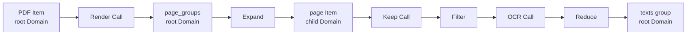
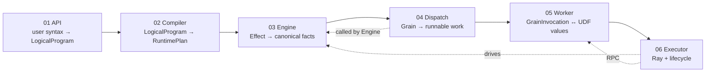
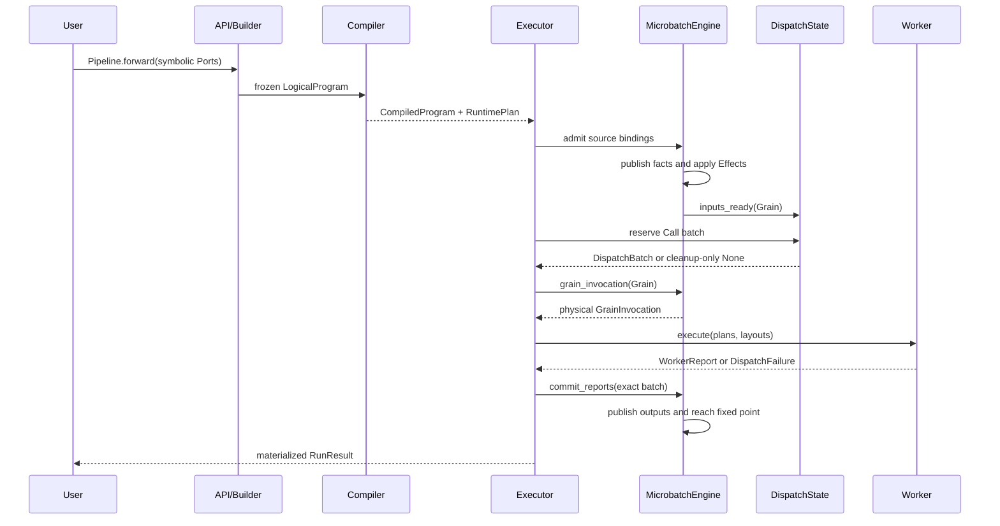

# MultiGrain v3.6 source walkthroughs

These short, English walkthroughs follow the implementation from symbolic
authoring to Ray transport. Each one names the owner of mutable state and the
tests that protect its boundary. The previous Chinese walkthroughs are kept as
`.zh.md` files beside them.

## At a glance

| Order | File | Focus |
| ---: | --- | --- |
| 1 | [`01_authoring_api.md`](01_authoring_api.md) | `Pipeline`, `RayModule`, `Port`, and `F.*` |
| 2 | [`02_compiler_pipeline.md`](02_compiler_pipeline.md) | trace, verify, analysis, lowering |
| 3 | [`03_runtime_engine.md`](03_runtime_engine.md) | fact publication and semantic fixed point |
| 4 | [`04_dispatch_state.md`](04_dispatch_state.md) | phases, generations, and ready queues |
| 5 | [`05_worker_abi.md`](05_worker_abi.md) | value-only batch binding and reports |
| 6 | [`06_executor_event_loop.md`](06_executor_event_loop.md) | Ray actors, RPCs, capacity, and cleanup |
| 7 | [`07_v3_vs_v36_readability.md`](07_v3_vs_v36_readability.md) | architecture comparison |

Read only the file related to the change under review. None of these documents
is a second specification: source code, tests, and the normative design
document take precedence.

---

## MultiGrain V3.6 advanced source walkthrough

This set of documents serves maintainers who have already run the V3.6
examples, read [`Getting Started from
Scratch`](../multigrain_v3_6_getting_started.md) and the [`Architecture and
Maintenance Manual`](../multigrain_v3_6_maintainer_guide.md), and are now
preparing to modify the source section by section for the first time. It does
not repeat concepts or cross-component contracts. Instead, it unfolds the most
complex implementation files by source section: what each section receives,
what it produces, which invariant it maintains, and why its responsibility
cannot be moved to a neighbouring component.

Line numbers in these pages are a navigation snapshot of the current V3.6
source; after changing the source, locate things by function or type name first.
The relationships among all V3.6 documents are shown in the
[`Documentation Map`](../multigrain_v3_6_documentation_map.md).

Each page follows the same explanatory order as much as possible, to avoid
repeating the problem of "use `_fact_queue` first, explain `_fact_queue` later":

1. first delimit what the file owns and explicitly does not own;
2. inventory the main dataclasses, tables, queues, indexes, and DTOs, and
   explain the data structures;
3. give the object's states or allowed transitions;
4. then walk the main control flow and failure paths section by section;
5. finally tie everything together with the shared PDF example and give a
   modification checklist.

Where a file has no queue or dynamic state, one is not invented: for example,
the compiler page starts with the four immutable static objects, and the Worker
page starts with BlockStore/`GrainInvocation`/layout before entering the execution
flow.

---

### 1. Why these six pages were chosen

Sorting purely by line count would put the benchmark scripts first, but
benchmarks are not a mandatory path through the framework semantics. Three
criteria are used here:

1. Does the file own a class of normative state or contract?
2. Does it coordinate more than three core data structures?
3. Would misunderstanding it easily cause a cross-layer flywire or a second
   source of truth?

| Walkthrough | Main source | Current size | Reason for selection |
| --- | --- | ---: | --- |
| [01: Symbolic graph construction](01_authoring_api.md) | `api.py` | 459 lines | how a user call becomes a Call, Port, Domain, and Origin |
| [02: Fixed compiler pipeline](02_compiler_pipeline.md) | `compiler.py`, `analysis.py`, `verify.py`, `lowering.py` | 834 lines | produces the unique RuntimePlan from the declaration graph; the static/dynamic boundary |
| [03: Semantic state machine](03_runtime_engine.md) | `runtime/engine.py` | 989 lines | the largest V3.6 file; owns Item, Expansion, Entity, and fact propagation |
| [04: Grain dispatch state](04_dispatch_state.md) | `runtime/dispatch.py` | 345 lines | the only component that modifies Grain phase, generation, and the runnable queue |
| [05: Worker ABI](05_worker_abi.md) | `execution/worker.py` | 338 lines | turns physical bindings back into UDF batches, then produces per-Grain atomic reports |
| [06: Executor event loop](06_executor_event_loop.md) | `execution/executor.py` | 581 lines | the only holder of actor handles, `ObjectRef`s, capacity, and multi-microbatch lifecycle |

The following files are not given their own page:

- `model.py`, `protocol.py`, `program/logical.py`, and `program/plan.py` are
  important data-type truths, but have little control flow of their own; each
  page explains them where they are actually used.
- `runtime/transitions.py` already has its state table explained in
  [`Zero-Basics Tutorial 9.3`](../multigrain_v3_6_getting_started.md#93-grain-the-only-physical-scheduling-lifecycle);
  this set of documents only describes its call sites.
- `execution/ray_backend.py` is deliberately kept as a very thin adapter layer,
  and is explained at the boundary between the Worker and Executor pages.
- Benchmark files do not own framework semantics even when they are longer;
  read them per workload after understanding the main chain.

---

### 2. The example shared by all six pages

The walkthroughs uniformly use a "split PDF pages, filter, OCR, regroup"
dataflow:

```python
class DocumentPipeline(Pipeline):
    def forward(self, pdfs):
        page_groups = self.render(pdfs)
        pages = F.expand(page_groups)
        keep_masks = self.keep(pages)
        kept_pages = F.filter(pages, keep_masks)
        texts = self.ocr(kept_pages)
        return F.reduce(texts, members=kept_pages)
```

It contains Call, Expand, Filter, and Reduce at the same time, which is enough
to observe both static graph construction and dynamic execution:



The same declaration appears differently in each of the six layers:

| Layer | What it sees | What it does not see |
| --- | --- | --- |
| authoring API | `Port` handles and user call order | Item outcome, Ray actor |
| LogicalProgram/compiler | Call/Port/Domain/Origin and derived dependencies | dynamic Entity, payload |
| MicrobatchEngine | RuntimePlan Effect and Item/Expansion/Entity facts | Logical Origin, actor handle |
| DispatchState | Grain phase, generation, three runnable queues | Item payload, primitive semantics |
| Worker | `GrainInvocation`, layout, batched Python values | Program, Entity lineage, dispatch policy |
| Executor | actor capacity, pending RPC, per-microbatch Engine | Filter/Reduce state combination details |

---

### 3. Recommended reading order

Do not read backwards from the Executor along the runtime call stack and guess
semantics. Reading in the order of data-structure transformation is easier:



Three passes are recommended:

1. In the first pass, read only each page's "responsibility boundary" and
   "source map", to build a sense of where files live.
2. In the second pass, follow the shared example and care only about how the
   data structures transform.
3. Only in the third pass read the invariants, failure paths, and modification
   checklists.

---

### 4. Overall timeline of one execution



The points in this diagram most worth checking repeatedly are:

- The Compiler runs only once; a microbatch never reads Origin back.
- The Executor obtains `GrainInvocation` from the Engine and never assembles Items or
  lineage by itself.
- The Worker returns reports and does not modify the Engine directly.
- `DispatchState` is called by the Engine, but only `DispatchState` can write
  Grain state.

---

### 5. Four questions to use while reading

When you reach any source section, ask in order:

1. **What DTO or Ref is the input?** If a business object is being passed, has
   the correct boundary already been crossed?
2. **Who owns the state being modified?** Is there another mutable copy of the
   same fact somewhere else?
3. **Does the failure happen before or after the mutation frontier?** The former
   should leave no state change; the latter must be a closed commit.
4. **Is this a semantic decision or a physical action?** The pure
   transition/recovery policy decides; the owner executes.

All six walkthroughs close with these four questions, so that a maintainer can
not only read the current code but also judge where new logic belongs.
