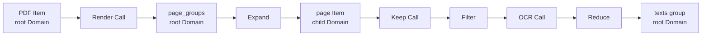
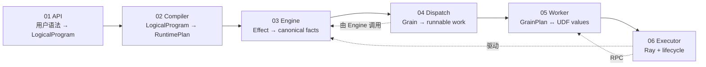
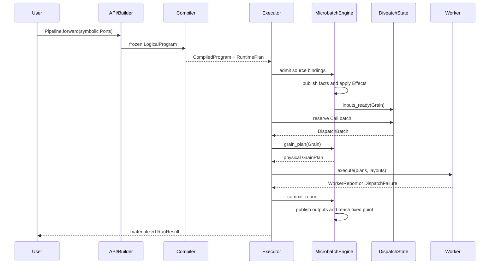

# MultiGrain V3.6 复杂源码导读

这组文档服务于已经跑通 V3.6 示例、读过
[`从零上手`](../multigrain_v3_6_getting_started.md) 和
[`架构与维护手册`](../multigrain_v3_6_maintainer_guide.md)、但第一次准备逐段修改源码的维护者。
它不重复概念与跨组件合同，而是把最复杂的实现文件按源码段落展开：每一段接收什么、产出
什么、维护哪条不变量，以及为什么不能把职责挪到相邻组件。

文中的行号以当前 V3.6 源码为导航快照；修改源码后，优先按函数或类型名定位。
全部 V3.6 文档的关系见[`文档地图`](../multigrain_v3_6_documentation_map.md)。

每篇尽量遵守同一解释顺序，避免再次出现“先使用 `_facts`，后解释 `_facts`”的问题：

1. 先划定文件拥有和明确不拥有的职责；
2. 盘点主要 dataclass、table、queue、index 与 DTO，并说明数据结构；
3. 给出对象的状态或允许的转移；
4. 再按源码段落讲主控制流与失败路径；
5. 最后用共同 PDF 例子串起来，并给出修改检查清单。

某文件没有 queue 或动态状态时不会强行发明一套：例如 compiler 篇先讲四个不可变静态对象，
Worker 篇先讲 BlockStore/GrainPlan/layout，之后才进入执行流程。

---

## 1. 为什么选择这六篇

只按行数排序会把 benchmark 脚本排在前面，但 benchmark 不是框架语义的必经路径。这里用
三个标准筛选：

1. 文件是否拥有一类规范状态或合同；
2. 是否协调三个以上的核心数据结构；
3. 理解错误是否容易造成跨层飞线或第二份真相。

| 导读 | 主源码 | 当前规模 | 选择原因 |
| --- | --- | ---: | --- |
| [01：符号建图](01_authoring_api.md) | `api.py` | 459 行 | 用户调用如何变成 Call、Port、Domain 与 Origin |
| [02：固定编译流水线](02_compiler_pipeline.md) | `compiler.py`、`analysis.py`、`verify.py`、`lowering.py` | 834 行 | 从声明图生成唯一 RuntimePlan，是静态/动态边界 |
| [03：语义状态机](03_runtime_engine.md) | `runtime/engine.py` | 989 行 | V3.6 最大文件，拥有 Item、Expansion、Entity 与事实传播 |
| [04：Grain 调度状态](04_dispatch_state.md) | `runtime/dispatch.py` | 345 行 | 唯一修改 Grain phase、generation 与 runnable queue 的组件 |
| [05：Worker ABI](05_worker_abi.md) | `execution/worker.py` | 338 行 | 把物理 binding 还原成 UDF batch，再生成逐 Grain 原子报告 |
| [06：Executor 事件循环](06_executor_event_loop.md) | `execution/executor.py` | 581 行 | 唯一持有 actor handle、ObjectRef、capacity 与多 microbatch 生命周期 |

没有单独展开以下文件：

- `model.py`、`protocol.py`、`program/logical.py`、`program/plan.py` 是重要的数据类型真相，
  但自身控制流很少；每篇会在实际使用处解释它们。
- `runtime/transitions.py` 已在
  [`零基础教程 9.3`](../multigrain_v3_6_getting_started.md#93-grain唯一物理调度生命周期)
  解释状态表，本组文档只说明调用点。
- `execution/ray_backend.py` 是刻意保持很薄的适配层，会在 Worker 与 Executor 两篇交界处
  说明。
- benchmark 文件即使更长，也不拥有框架语义；应在理解主链之后按具体 workload 阅读。

---

## 2. 六篇共同跟踪的例子

导读统一用“PDF 拆页、过滤、OCR、重新成组”的数据流：

```python
class DocumentPipeline(Pipeline):
    def forward(self, pdfs):
        page_groups = self.render(pdfs)
        pages = F.expand(page_groups)
        keep_masks = self.keep(pages)
        kept_pages = F.filter(pages, keep_masks)
        texts = self.ocr(kept_pages)
        return F.reduce(texts, members=kept_pages)
```

它同时包含 Call、Expand、Filter 和 Reduce，足以观察静态建图与动态执行：



同一段声明在六层中分别呈现为：

| 层 | 看见的东西 | 看不见的东西 |
| --- | --- | --- |
| authoring API | `Port` 句柄和用户调用顺序 | Item outcome、Ray actor |
| LogicalProgram/compiler | Call/Port/Domain/Origin 与派生依赖 | 动态 Entity、payload |
| MicrobatchEngine | RuntimePlan Effect 与 Item/Expansion/Entity 事实 | Logical Origin、actor handle |
| DispatchState | Grain phase、generation、三个 runnable queue | Item payload、primitive 语义 |
| Worker | `GrainPlan`、layout、批量 Python 值 | Program、Entity lineage、调度策略 |
| Executor | actor capacity、RPC lease、各 microbatch Engine | Filter/Reduce 的状态组合细节 |

---

## 3. 推荐阅读顺序

不要按运行时调用栈倒着从 Executor 猜语义。按数据结构变换顺序阅读更省力：



建议分三轮：

1. 第一轮只读每篇的“职责边界”和“源码地图”，建立文件位置感。
2. 第二轮跟踪共同例子，只关心数据结构怎样变形。
3. 第三轮才读不变量、失败路径与修改清单。

---

## 4. 一次执行的总时序



这个图最值得反复核对的地方是：

- Compiler 只运行一次，microbatch 不回读 Origin。
- Executor 从 Engine 取得 `GrainPlan`，不会自己拼 Item 或 lineage。
- Worker 返回报告，不直接修改 Engine。
- DispatchState 由 Engine 调用，但 Grain 状态只有 DispatchState 能写。

---

## 5. 阅读时使用的四个问题

看到任意源码段落时，依次问：

1. **输入是什么 DTO 或 Ref？** 如果传的是业务对象，是否已经越过了正确边界？
2. **谁拥有被修改的状态？** 同一事实是否在别处还有可变副本？
3. **失败发生在 mutation frontier 前还是后？** 前者应无状态变化，后者必须是封闭提交。
4. **这是语义决策还是物理动作？** 纯 transition/recovery policy 负责决定，owner 负责执行。

六篇导读都会用这四个问题收尾，使维护者不仅能读懂当前代码，也能判断新逻辑该放在哪里。
