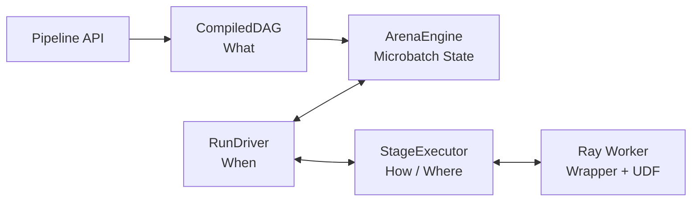
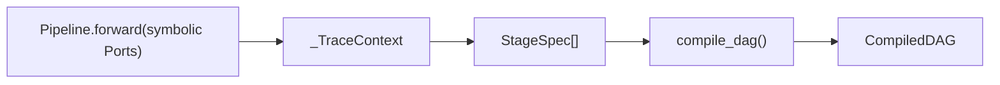
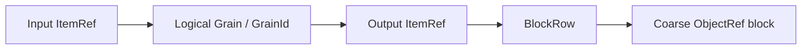
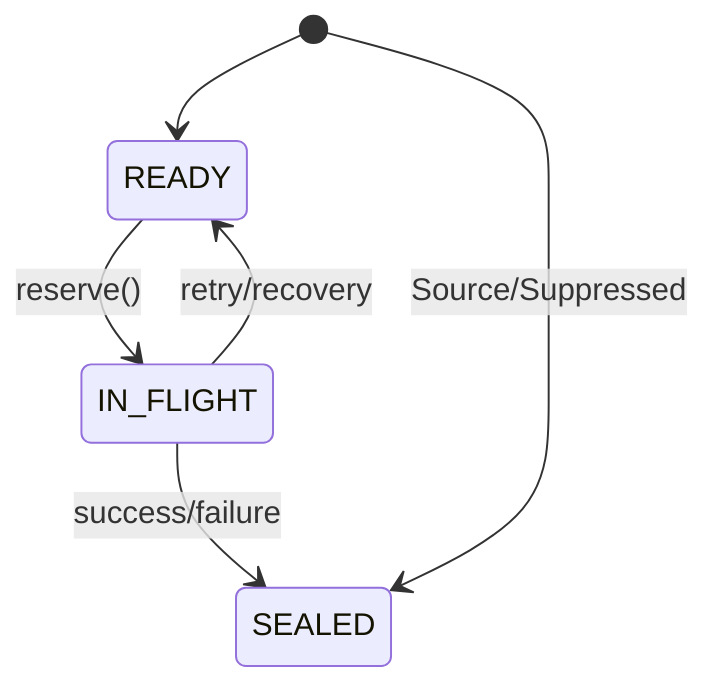
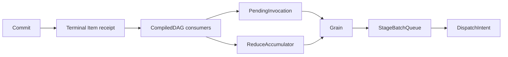
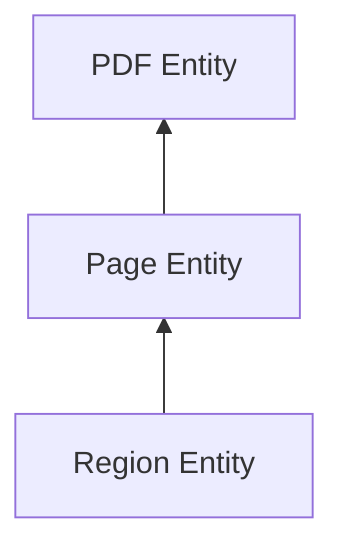
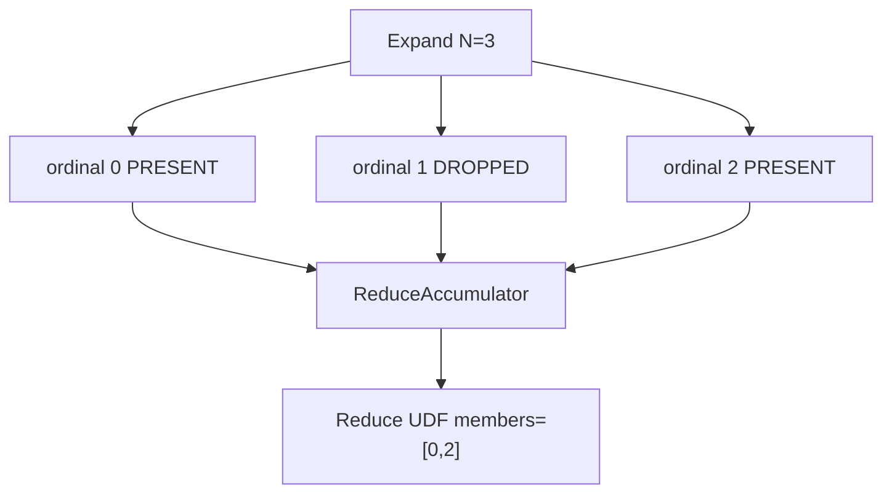
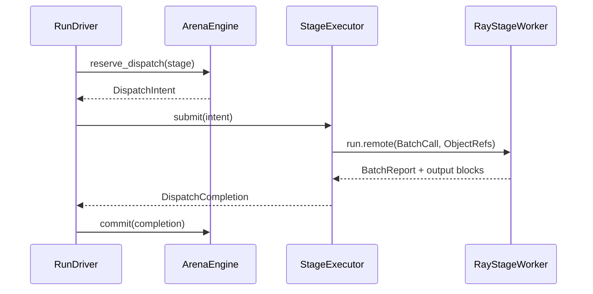
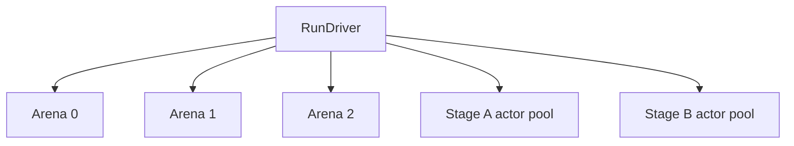

# Multigrain V3 实现架构导读

> 面向第一次阅读 V3 源码的开发者。
>
> 本文描述当前源码实际实现，不是未来设计草案。设计决策背景见
> `docs/multigrain_v3_prototype_1.md`。

## 1. V3 解决什么问题

Multigrain V3 面向包含动态 `1:M→M:1` 的多模态 DAG：

```text
Document
→ Expand Pages
→ 跨 Document 重组 Page batch
→ OCR / Layout / Filter
→ 按原始 ordinal 恢复每个 Document 的 Page group
→ Reduce
```

核心目标：

- 动态 fan-out；
- General DAG 和逐 Port lineage；
- 跨 parent elastic rebatching；
- 有序、可为空、支持 Filter drop 的 Reduce；
- grain-level failure attribution；
- bounded retry/isolation；
- 多 microbatch Arena 的 Stage 流水线并行；
- RayModule 风格 API 和 persistent actor。

V3 不实现 arbitrary key-based M:N join、shuffle、checkpoint 或通用 workflow engine。

---

## 2. 推荐阅读顺序

```text
api.py
    用户如何写 Pipeline

dag.py
    forward() 如何编译成静态 General DAG

model.py
    PortId / EntityId / ItemRef / GrainId 和 outcome

protocol.py
    Arena、StageExecutor、Worker 交换什么

arena/state.py
    Arena 内的小型被动状态记录

arena/engine.py
    单 microbatch 如何推进

execution.py + worker.py
    Ray actor pool 和 UDF 执行

driver.py + executor.py
    多 Arena overlap 和 public run
```

---

## 3. 四组件心智模型



| 组件 | 回答的问题 | 主要文件 |
|---|---|---|
| `CompiledDAG` | 图是什么 | `dag.py` |
| `ArenaEngine` | 一个 microbatch 当前发生了什么 | `arena/` |
| `RunDriver` | 多个 Arena 何时推进 | `driver.py` |
| `StageExecutor` | Stage 在哪里、如何执行 | `execution.py`、`worker.py` |

`protocol.py` 只是四组件之间的无状态 DTO 合同，不是第五个运行时组件。

---

## 4. 用户 API 与编译

用户保持 RayModule 风格：

```python
class PipelineV3(mg.Pipeline):
    def __init__(self):
        self.expand = (
            mg.Expand(RenderPages)
            .pre_init(dpi=200)
            .ray_options(replicas=4, batch_size=1, num_cpus=1)
        )
        self.ocr = (
            mg.Map(OcrPage)
            .pre_init(model_path)
            .ray_options(
                replicas=4,
                batch_size=64,
                max_batch_wait_ms=20,
                num_gpus=1,
            )
        )
        self.reduce = mg.Reduce(Assemble).ray_options(batch_size=4)

    def forward(self, documents):
        pages = self.expand(documents)
        contents = self.ocr(pages)
        return self.reduce(anchor=documents, members=contents)
```

### 4.1 `pre_init` 和 `ray_options`

```text
pre_init(...)
    persistent actor 内 UDF instance 的构造参数

ray_options(...)
    replicas、batch trigger、recovery preset 和 Ray resources
```

UDF 每个 actor 初始化一次，在同一次 run 的多个 dispatch/Arena 间复用。

### 4.2 Trace 过程

`Pipeline.compile()` 用 symbolic `Port` 执行一次 `forward()`：



最终静态结构：

```text
CompiledDAG
├── stages
├── consumers_by_port
├── source_ports
└── output_ports
```

`CompiledDAG` immutable，不含 Arena、Actor、ObjectRef 或运行状态。

---

## 5. 静态 DAG 数据结构

### 5.1 StageSpec

```text
StageSpec
├── id
├── kind
├── inputs
├── output_count
├── driving_input
├── udf
├── execution
└── reduce
```

输出 Port 由下式唯一推导：

```text
PortId(stage.id, output_index)
```

### 5.2 InputMode

```text
ONE
    同 Entity 的 required scalar

OPTIONAL_ONE
    正常缺失时向 UDF 传 MISSING

GROUP
    一个 Expand scope 下按 ordinal 排列的 children

ANCHOR
    Reduce semantic-only parent，不传 payload
```

### 5.3 ReduceSpec

```text
ReduceSpec
├── members_input
└── origin_expand
```

Compiler 负责验证：

- anchor 是 origin Expand 的精确输入 Port；
- GROUP 都属于同一个 Expand scope；
- nested Expand 必须逐层 Reduce 闭合；
- 两个独立 Expand 不能因长度相等而隐式 zip。

---

## 6. 四个核心 identity

```text
PortId
    DAG 中哪个 Stage output

EntityId
    哪个 logical occurrence

ItemRef = PortId + EntityId
    某 occurrence 在某 Port 上的 value

GrainId
    某 Stage 对一组 logical inputs 的 operation
```



Identity 不包含：

- actor；
- physical batch；
- DispatchId；
- generation；
- completion order；
- ObjectRef 地址。

---

## 7. Grain 和 Item 状态

### 7.1 GrainRecord

```text
GrainRecord
├── id
├── stage
├── inputs
├── output_ports
├── outcome
├── phase
├── generation
├── active_attempt
└── infra_failures
```

生命周期：



Outcome 只有：

```text
Success
Failed
Suppressed
```

### 7.2 ItemRecord

```text
ItemRecord
├── ref
├── producer
├── terminal
└── cause
```

Terminal：

```text
PRESENT
DROPPED
FAILED
SUPPRESSED
```

`ItemTable` 记录语义终态；`ValueTable` 独立记录：

```text
ItemRef -> BlockRow
```

这样 lineage 查询不依赖 ObjectRef，物理 ownership 变化也不改变语义。

---

## 8. ArenaEngine 内部

`ArenaEngine` 是单 Arena 的唯一状态机。`RunDriver` 不允许直接读写其内部表。

内部状态：

```text
语义事实
├── grains
├── items
└── entity_origins

增量推进
├── receipts
├── pending_invocations
├── expand_instances
└── reduce_accumulators

本地调度
├── StageBatchQueue
├── DispatchLease
└── recovery tasks

物理 value
├── values
└── blocks
```

公开接口：

```text
admit_sources()
advance()
reserve_dispatch()
commit()
handle_failure()
next_deadline()
is_complete()
finish()
```

---

## 9. 事件驱动推进

V3 不再扫描整个 DAG 求 fixed point。

```text
Source admission / dispatch commit
→ ItemTable 发布 terminal receipt
→ receipt event
→ consumers_by_port 路由
→ PendingInvocation / ReduceAccumulator
→ executable 或 Suppressed Grain
→ StageBatchQueue
→ DispatchIntent
```



### 9.1 PendingInvocation

Key：

```text
(stage_id, entity_id)
```

它只保存各 input slot 对应的 `ItemRef`，不复制 ItemRecord。所有输入 terminal 后分类一次：

- 全部 required PRESENT：executable；
- driving DROPPED：向下游传播 DROPPED；
- required side DROPPED：Suppressed；
- OPTIONAL_ONE DROPPED：executable，物理调用使用 `MissingTake`；
- required FAILED/SUPPRESSED：Suppressed。

---

## 10. Expand 和 Entity ancestry

Expand 成功后：

```text
ExpandInstance
├── grain
├── anchor
└── cardinality N
```

每个 child：

```text
EntityOrigin
├── parent_entity
├── expand_stage
├── expand_grain
└── ordinal
```

Nested Expand 形成 parent chain：



Expand failed-before-output：

- cardinality unknown；
- 不创建虚假 child Entity；
- 依赖该 scope 的 Reduce 按 anchor coordinate Suppressed。

---

## 11. ReduceAccumulator

GROUP 不是 SQL group-by，而是：

> 一个 anchor 下，origin Expand 产生的有序 child values。

MinerU：

```text
anchor=PDF       ANCHOR
members=OCR      GROUP
pages=Page       GROUP
context=metadata ONE
```

每个 GROUP 使用紧凑 dense arrays：

```text
GroupedSlots
├── states: bytearray(N)
├── items: list[ItemRef | None]
├── causes: list[GrainId | None]
└── remaining
```

主 members GROUP 决定 surviving ordinals。其他 GROUP 按相同 ordinal 投影，避免 Filter
后错位。



Nested Reduce 逐层恢复 parent Entity；不允许一个 Reduce 隐式跨越两个未闭合 Expand。

---

## 12. Filter 与 optional

### 12.1 Filter

Filter UDF 只返回 bool mask：

```text
output_count == input_count
output i 对应 input i
```

`keep=True`：

- output Item PRESENT；
- ValueTable alias 对应 input BlockRow；
- 不产生业务 output block。

`keep=False`：

- 所有 output Port 同步 DROPPED。

### 12.2 OPTIONAL_ONE

```python
normalize(
    file_meta,
    pdf=optional(pdf_result),
    image=optional(image_result),
)
```

正常 DROPPED 变成 `MissingTake`，Worker 向 UDF 传稳定 `MISSING`。FAILED/SUPPRESSED
仍然 fail-closed。

---

## 13. 物理 RPC 协议

Arena 生成：

```text
DispatchIntent
├── arena_id
├── BatchCall
├── input_blocks
├── actor_policy
└── flush_reason
```

BatchCall：

```text
BatchCall
└── Invocation[]
    ├── AttemptToken
    └── InputTake[]
        ├── ValueTake(RowTake[])
        └── MissingTake
```

一个 `ValueTake` 可以从多个 coarse input block 取 row，Driver 不读取业务 payload。

Worker 返回：

```text
BatchReport
+ 每个 value-producing output Port 一个 coarse block
```

Filter 只返回 mask report，不返回业务 block。

---

## 14. StageExecutor 和 Worker

一个非 Source Stage 对应一个 actor pool：

```text
StageExecutor
├── replicas
├── actor handles
├── per-actor pending
├── round-robin selection
└── PendingRPC
```

Actor：

```text
RayStageWorker
├── StageSpec
├── UDF instance
└── calls
```

Actor 不持有完整 DAG、GrainTable、ItemTable 或 ReduceAccumulator。



---

## 15. Multi-Arena pipeline overlap

Executor：

```python
Executor(
    pipeline,
    microbatch_size=24,
    max_inflight_arenas=3,
)
```

RunDriver 管理多个 Arena，共享同一组 StageExecutor：



可以出现：

```text
Arena 0 执行后级 Stage
Arena 1 同时执行前级 Stage
Arena 2 等待 replica
```

RunDriver 是 single-writer，但可以同时持有多个 Ray RPC。当前 elastic rebatching 限定在
单 Arena 内，actor capacity 跨 Arena 共享。

---

## 16. Recovery 和 generation fencing

失败类别：

```text
BAD_RECORD
UDF_ERROR
CONTRACT_ABORT
INFRA_FAILURE
```

Preset：

```text
raise
retry_batch
retry_tail
isolate_tail
fail_batch
```

Recovery 只改变物理 attempts/packing，不改变 GrainId 或 ItemRef。

`AttemptToken`：

```text
(arena, dispatch, grain, generation)
```

旧 generation 的迟到 completion 被忽略；混合 current/stale token 是 contract abort。

---

## 17. Commit、delivery 与 reclaim

成功 commit 同一 event-loop turn 内发布：

```text
output blocks
ValueTable locations
Grain outcome
Item terminal receipts
EntityOrigin / ExpandInstance
receipt events
```

任何 preflight/contract 失败都不能暴露半提交状态。

Arena 完成条件包括：

- admission closed；
- receipt queue empty；
- 无 PendingInvocation/Open ReduceAccumulator；
- Stage queues empty；
- 无 IN_FLIGHT Grain/DispatchLease；
- StageExecutor 无该 Arena pending RPC。

`finish()` 在 reclaim 前构造 detached：

```text
outputs
Failed snapshots
Suppressed snapshots
Source snapshots
metrics
timeline
```

---

## 18. 调试入口

| 现象 | 首先查看 |
|---|---|
| DAG 编译失败 | `dag.py` 的 scope/input validator |
| aligned Stage 不推进 | `PendingInvocation` |
| Reduce 不推进 | `ReduceAccumulator` 和 `EntityOrigin` |
| RPC 太碎 | `StageBatchQueue`、timeout、timeline flush reason |
| actor 空转 | StageExecutor pending/capacity、timeline |
| stale result | AttemptToken generation |
| 内存增长 | Arena BlockTable、active Arena 数、worker/model RSS |
| optional 行为错误 | InputMode、MissingTake、ItemRecord terminal |

---

## 19. 测试和 benchmark

默认测试：

```bash
RAY_ENABLE_UV_RUN_RUNTIME_ENV=0 \
python -m pytest -q test/experimental/multigrain_v3
```

真实 MinerU：

```text
rayorch.experimental.multigrain_v3.benchmark.mineru
```

当前 368-PDF 结果见：

```text
docs/experiments/multigrain_v3/2026-08-01_v3_mineru_regression.md
```

---

## 20. V3 明确不做什么

- arbitrary M:N Relate；
- key join/group-by/shuffle；
- cross-Arena batching；
- checkpoint/exactly-once；
- distributed metadata；
- early block ownership ledger；
- 通用 recovery workflow。

