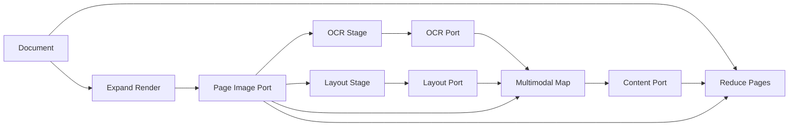
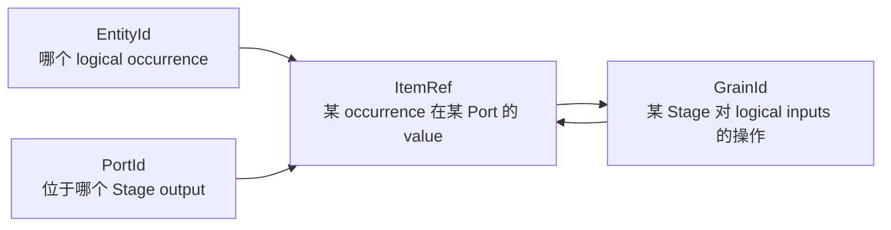
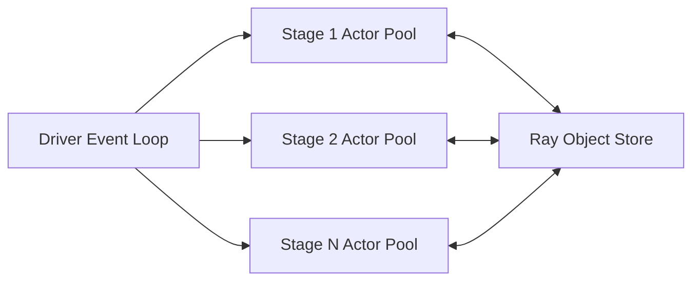
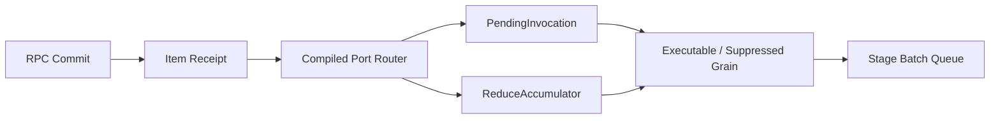
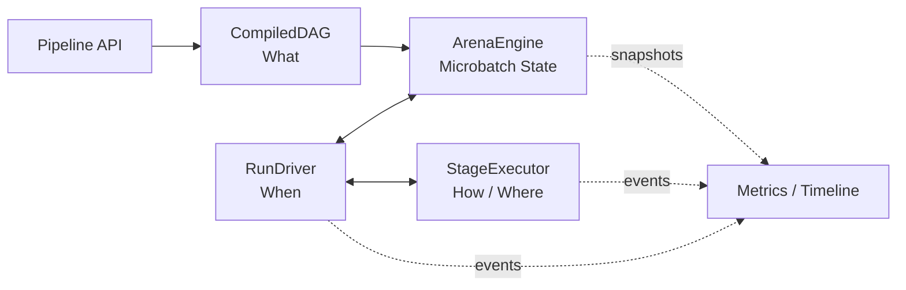
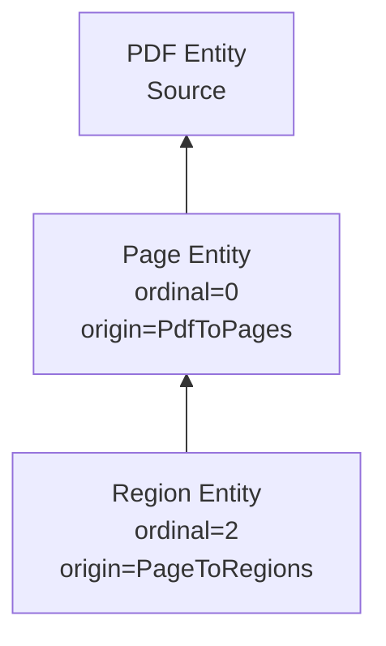
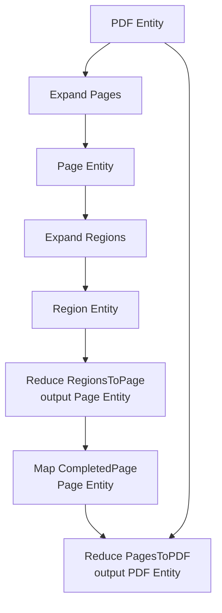
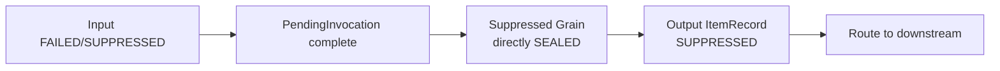
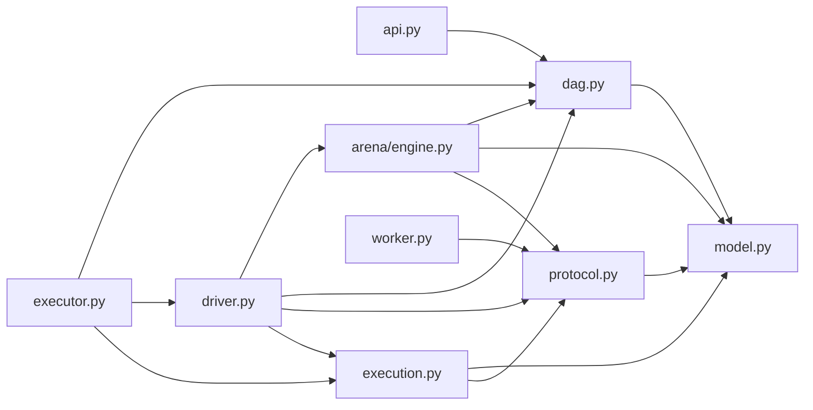

# Multigrain V3 Prototype 1：General DAG 下的精简运行时

> 状态：**讨论稿，未冻结，禁止据此直接开始重写。**
>
> 目标：在保留多模态 General DAG、逐 Port lineage、dynamic fan-out/fan-in、
> elastic rebatching、Ray actor pipeline 和 RayModule-like API 的前提下，重新设计一版
> 更清晰、更少重复状态、更容易 review 的 V3 runtime。
>
> 本文只设计原型，不修改 V2.5 代码。

---

## 1. 为什么需要 V3

V2.5 已经证明了核心能力和性能：

- dynamic 1:M Expand；
- cross-parent elastic rebatching；
- ordered/empty/partially-filtered Reduce；
- multi-Arena pipeline overlap；
- coarse-block Ray transport；
- grain-level bad-record attribution；
- generic-error binary isolation；
- infrastructure retry；
- General DAG、diamond 和 aligned multi-input；
- MinerU 真实负载性能与 correctness。

但当前实现的源码认知成本过高，尤其是：

```text
executor.py
├── Arena semantic state
├── 多套 lineage/value index
├── ready queue 和 batch trigger
├── manifest commit
├── PortDomain receipt propagation
├── fixed-point planner scan
├── Reduce FiberBarrier
├── binary isolation
├── multi-Arena coordinator
└── RayTransport
```

问题不是功能不需要，而是同一事实被多套状态重复表达：

```text
GrainRecord outcome
processed set
PortDomain receipt
planned set
port sealed
FiberBarrier settlement
```

V3 的核心目标是：

> 保留功能，删除重复状态和扫描式推进。

## 1.1 后续迭代的核心指导意见

V3 冻结以下最小 identity 边界：

```text
PortId
EntityId
ItemRef
GrainId
```

其中：

```text
ItemRef = PortId + EntityId
```

这四个 identity 概念已经是 General DAG、逐 Port lineage 和 Logical Grain 所需的最小
清晰边界，不是 V2.5 复杂度的来源。

后续修正和精简应集中在：

```text
1. 围绕这些 identity 维护了多少张重复状态表；
2. receipt、planner、commit 和 recovery 事件如何推进；
3. 静态 DAG metadata 与动态 Arena state 是否清楚分离；
4. 同一事实是否被多个 cache/索引重复表达。
```

不应继续通过合并或删除 `PortId`、`EntityId`、`ItemRef`、`GrainId` 来追求表面的类型
数量减少。删除其中任何一个维度，都会损失以下至少一种能力：

- DAG output Port 定位；
- 同 Entity 的跨分支对齐；
- Filter zero-output 和 Expand failed-before-output；
- 一个 Grain 多输入、多输出；
- retry 时保持 logical operation identity。

---

## 2. V3 必须保留的能力

## 2.1 General DAG

General DAG 是多模态 Pipeline 的核心能力，必须支持：

- branch；
- diamond；
- multi-input Stage；
- multi-output Stage；
- 同一 Entity 在不同 Port 上的独立 lineage；
- 不同分支完成时间不一致；
- fan-out 分支重新汇合；
- Reduce 的多个 aligned member Port。

典型拓扑：



## 2.2 用户原语

V3 Prototype 1 保留：

```text
Map
Filter
Expand
Reduce
```

Source 是内部 compiled Stage，不是用户原语。

### RayModule-like 配置合同

公开构造和配置风格必须继续与 RayOrch `RayModule` 一致：

```python
self.ocr = (
    Map(OcrUDF)
    .pre_init(model_path, dtype="bf16")
    .ray_options(
        replicas=4,
        batch_size=64,
        max_batch_wait_ms=20,
        num_gpus=1,
    )
)
```

```text
pre_init(...)
    只描述每个 persistent actor 内 UDF instance 的构造参数。

ray_options(...)
    描述 replicas、logical-grain batch trigger、recovery preset 和 Ray resources。
```

`Pipeline.forward()` 只连接 symbolic Port；UDF 实例在 Stage actor 构造时初始化一次，并在
一次 run 的多个 dispatch 和多个 Arena 之间复用。V3 不退化为每 dispatch 初始化 UDF，
也不允许 per-grain actor/RPC。

Prototype 1 删除：

```text
Relate
keyed
arbitrary M:N key matching
sealed-port Cartesian join
JoinIndex
```

删除 Relate 不等于删除 General DAG。

V3 支持：

```text
1. Map/Filter/Expand 的 1:1 aligned fan-in
   - 同一 source occurrence 分支后重新汇合；
   - 多个等长 Source 参数按 run-global position 对齐；
   - 同一次 multi-output Expand 的相同 ordinal 对齐；
   - entity-preserving Map/Filter 后继续对齐。

2. Reduce 的 M:1 grouped fan-in
   - 同 origin Expand scope；
   - 按 ordinal 恢复顺序；
   - 支持多个 aligned grouped Port。
```

这些 1:1 case 在 runtime 中统一为：

```text
相同 EntityId 的普通 multi-input Stage fan-in
```

V3 不支持：

```text
不同 Entity 之间基于业务 key 的 arbitrary M:N matching；
两个独立 dynamic Expand 仅因运行时长度碰巧相等就自动 zip。
```

两个独立 Expand 如果确实需要 ordinal zip，后续应使用显式 alignment contract；第一版
优先使用一个 multi-output Expand 生成共享 child EntityId 的多个 Port。

### 等长 Video + ASR 示例

两个等长 Source 参数按 source position 共享 EntityId，但保留不同 Port 和 Source
Grain：

```python
def forward(self, videos, asrs):
    return self.fuse(videos, asr=asrs)
```

```text
position 0:
    ItemRef(video_source_port, RowEntity0)
    ItemRef(asr_source_port,   RowEntity0)

position 1:
    ItemRef(video_source_port, RowEntity1)
    ItemRef(asr_source_port,   RowEntity1)
```

普通 Map 按 EntityId 进行 1:1 fan-in。

同一个文件内部产生等长 frame/ASR slice 时，推荐：

```python
frames, asr_slices = self.decode(files)  # multi-output Expand
fused = self.fuse(frames, asr=asr_slices)
```

multi-output Expand 保证两个 Port 共享 N、ordinal 和 child EntityId layout，因此仍由
普通 Map 完成 aligned fan-in。任一分支 Filter drop 后也不会发生数组错位，因为匹配
依据是 EntityId，而不是过滤后的物理下标。

## 2.3 Identity 与逐 Port lineage

继续保留四个核心 identity 类型：

```text
PortId
EntityId
ItemRef
GrainId
```

`PortId` 是 compiled DAG 中一个 output Port 的稳定、轻量标识：

```text
PortId(stage_id, output_index)
```

核心关系：

```text
ItemRef = PortId + EntityId
```



同一个 Entity 在不同 Port 上必须独立记录：

```text
ItemRef(page_image_port, PageA0) -> PRESENT
ItemRef(ocr_port, PageA0)        -> FAILED
ItemRef(layout_port, PageA0)     -> PRESENT
ItemRef(merged_port, PageA0)     -> SUPPRESSED
```

这保证多模态分支能够逐 Port 定位成功、过滤、失败与 suppression。

Port metadata 不需要独立对象：

- `PortId(stage, output)` 直接定位 producer 和 output index；
- `CompiledDAG.consumers_by_port` 提供消费者；
- producer `StageSpec.kind/output_count` 提供 output contract。

运行时的 `ItemRef` 只携带轻量 `PortId`，不复制 consumer、UDF、actor 或 cardinality
contract：

```text
Port metadata 由 CompiledDAG 唯一推导
PortId 属于 ItemRef
```

## 2.4 Ray 执行关系

继续保持：

```text
一个 Driver
多个并发 Arena
每个 Stage 一个 persistent actor pool
每个 actor = 通用 wrapper + Stage UDF instance
```

Actor 之间不直接调用。



继续保持：

- 一个 RPC 包含多个 Logical Grain；
- Map/Expand/Reduce 每个 `(dispatch, output port)` 一个 coarse output block；
- Filter RPC 只返回 mask report，不返回业务 output block；
- 不允许 per-grain `.remote()`；
- 不允许 per-emission ObjectRef；
- Driver 正常只读取 small manifest；
- ObjectRef、actor、dispatch、batch 不进入 GrainId/ItemRef。

### Microbatch in-flight 与跨 Stage 流水线

Executor 必须继续暴露：

```python
Executor(
    pipeline,
    microbatch_size=...,
    max_inflight_arenas=...,
)
```

```text
microbatch_size
    每个 Arena admission 的 source occurrence 数。

max_inflight_arenas
    一个 run 内同时 active 的 Arena 上限。
```

多个 Arena 共享同一组 persistent Stage actor pools，因此必须支持：

```text
Arena 0 正在 Stage B
Arena 1 同时正在 Stage A
Arena 2 等待某个 Stage replica
```

RunDriver 是 single-writer，但可以同时保有多个 pending Ray RPC；它不能按 Arena
逐个阻塞执行。当前 elastic rebatching 仍限定在单 Arena 内，Stage actor capacity 则跨
Arena 共享。

---

## 3. V3 的核心简化

可以将这次变化概括为：

> 从扫描整张 Graph、反复求 fixed point，改成 single-writer event loop 驱动的增量
> 状态机。

Ray RPC completion 和 batch timer 仍通过 `ray.wait`/timer 接入；变化在于事件进入
Driver 后，只更新受影响的对象，不再轮询所有 Grain、Port 和 Stage 寻找可推进状态。

V3 不再使用：

```text
PortDomain
每轮全图 planner scan
processed set
planned set
port seal 驱动的 unary absence 推断
ProducerIndex + PortIndex + ValueIndex 多套重复表
FiberBarrier 的 present/dropped/failed 多容器组合
role-general Relate planner
```

改为：

```text
event-driven receipt routing
ItemTable
PendingInvocation
ExpandInstance
ReduceAccumulator
StageBatchQueue
```

核心推进：

```text
RPC commit
→ 产生 output Item receipt
→ 根据 compiled consumer adjacency 路由
→ 更新 consumer PendingInvocation 或 ReduceAccumulator
→ 输入已分类则立即创建 executable/suppressed Grain
→ executable Grain 进入 Stage batch queue
```



Suppressed Grain 不进入 Queue。

这几个核心状态的职责固定为：

```text
ItemTable
    已经发生了什么：某 ItemRef 最终 PRESENT/DROPPED/FAILED/SUPPRESSED。

PendingInvocation
    普通 General DAG fan-in 还缺哪些输入；齐全后只分类一次。

ExpandInstance
    某次 fan-out 的 anchor、cardinality 和 child scope/ordinal。

ReduceAccumulator
    某个 anchor 的 grouped Port × ordinal 还缺哪些 terminal receipt。

StageBatchQueue
    哪些 executable Grain 已经 READY，等待被物理合批和 dispatch。
```

这些状态不应复制语义事实：

- `ItemTable` 和 `GrainTable` 是 Arena 内的权威语义状态表；
- `PendingInvocation` 只保存 input ItemRef/received mask；
- `ReduceAccumulator` 只保存 slot settlement 和计数；
- `StageBatchQueue` 只保存 READY GrainId；
- Actor/ObjectRef/dispatch handle 仍属于 transport/runtime。

### 大致 workflow

```text
Source admission 或 RPC commit
→ 原子写 GrainTable / ItemTable / ExpandInstance
→ 为新 terminal Item 产生 receipt event
→ 根据 CompiledDAG.consumers_by_port 路由到直接消费者
→ 更新 PendingInvocation 或 ReduceAccumulator
→ 输入齐全后生成 executable/suppressed Grain
→ executable Grain 进入 StageBatchQueue
→ full/timeout/drain/isolation 触发一个 coarse RPC
→ RPC completion 再次进入同一 commit/routing 流程
```

调试时可按对象直接定位：

```text
普通 DAG Stage 没推进
    → 看 PendingInvocation

Reduce 没推进
    → 看 ReduceAccumulator

Grain 没发 RPC
    → 看 StageBatchQueue 和 batch trigger

结果没传播
    → 看 ItemTable 和 consumers_by_port
```

---

## 3.1 四组件模型

Prototype 1 对用户和论文只暴露四个核心组件：



```text
CompiledDAG
    图是什么。

ArenaEngine
    一个 microbatch 当前发生了什么，并负责其增量状态机。

RunDriver
    多个 Arena 何时推进，以及如何共享 Stage capacity。

StageExecutor
    一个 Stage 的 actor pool 如何执行 coarse RPC。
```

API 和 observation 是外围面，不拥有运行时事实。

### CompiledDAG

拥有 immutable：

```text
StageSpec / InputSpec / ReduceSpec
PortId
consumers_by_port
source_ports / output_ports
```

无 Ray、无 Arena、无业务 value、无 Grain lifecycle。

### ArenaEngine

拥有一个 microbatch 的全部本地状态：

```text
语义事实
    GrainTable
    ItemTable
    EntityLineage

增量推进
    receipt events
    PendingInvocation
    ExpandInstance
    ReduceAccumulator

本地调度
    StageBatchQueue
    DispatchLease
    recovery counters/groups

物理值位置
    ValueTable
    BlockTable
```

这些状态共享同一个生命周期：

```text
admit → execute → deliver → reclaim
```

`ItemTable` 回答逻辑终态，`ValueTable` 回答 PRESENT value 的物理位置；二者在
`ArenaEngine.commit()` 中原子发布，但不混成一个 record。

ArenaEngine 对外只暴露状态机接口：

```text
admit_sources(...)
advance(now)
reserve_dispatch(stage, now)
commit(completion)
handle_failure(failure)
next_deadline()
is_complete()
finish()
```

外部不得直接修改其内部 table、accumulator 或 queue。

### RunDriver

只负责全局协调：

```text
source chunk admission
active/completed Arenas
max_inflight_arenas
Stage capacity 与公平性
completion/timer wait
fail-fast cancellation
ordered result merge
```

RunDriver 不解释：

```text
Item 为什么 DROPPED/SUPPRESSED
Entity 属于哪个 Expand
Reduce 的 ordinal
PendingInvocation 缺哪个 Port
```

### StageExecutor

每个 Stage 对应一个执行资源池：

```text
actor replicas
worker wrapper + UDF instance
BatchCall / BatchReport
ObjectRef
per-actor pending
actor replacement
```

接口：

```text
can_submit()
submit(DispatchIntent)
poll() -> Completion | Failure
cancel(arena_id)
shutdown()
```

StageExecutor 不访问 Arena 内部状态，也不解释 lineage。

### 防止“飞线”的硬边界

```text
CompiledDAG 永远 immutable；
ArenaEngine 不调用 Ray；
RunDriver 不持有第二份 Grain/Item 状态；
StageExecutor 不回调或修改 Arena；
Worker 不理解 lineage；
Metrics 不参与 correctness 决策。
```

跨组件只传：

```text
DispatchIntent
DispatchCompletion
DispatchFailure
RunResult snapshot
```

其中 `DispatchIntent` 由 ArenaEngine 生成，包含 BatchCall 和 opaque input block handles；
StageExecutor 返回 completion/failure；RunDriver 只负责路由回对应 ArenaEngine。

因此主闭环唯一是：

```text
CompiledDAG
→ ArenaEngine
↔ RunDriver
↔ StageExecutor
```

---

## 4. 静态编译结果

V3 仍由 `Pipeline.forward()` trace 成 General DAG。

静态结构的目标不是字段数量绝对最少，而是：

> 每个语义只保存在一个地方，同时让关键行为可以直接从字段名读出，不依赖隐含的
> tuple 顺序或运行时猜测。

具体采用“显式但不重复”原则：

```text
关键语义
    使用有名字的字段显式保存；

可由唯一字段组合推导的信息
    不重复保存，只提供只读 helper；

仅用于编译校验的信息
    编译结束后丢弃；

仅用于加速路由的索引
    标记为可重建 derived index。
```

最终静态结构只保留：

```text
CompiledDAG
StageSpec
InputSpec
ReduceSpec
ConsumerEdge
UdfSpec
ExecutionSpec
```

不保留额外 `PortSpec`。`PortId(stage, output)` 已经能够定位 producer；consumer 和
执行合同分别由 `CompiledDAG` 和 `StageSpec` 提供。

为避免抽象过碎，Prototype 1 不再为 Source/Map/Filter/Expand/Reduce 分别建立
`SourceStageSpec`、`MapStageSpec` 等 class hierarchy。统一使用一个 `StageSpec`，
再由 compiler validator 检查 kind-specific invariant。

## 4.1 CompiledDAG

```text
CompiledDAG
├── stages: tuple[StageSpec, ...]
├── consumers_by_port: PortId -> tuple[ConsumerEdge, ...]
├── source_ports: tuple[PortId, ...]
└── output_ports: tuple[PortId, ...]
```

- `source_ports` 保存 `Pipeline.forward()` 参数顺序；
- `output_ports` 保存 `Pipeline.forward()` 返回顺序；
- `consumers_by_port` 由 `StageSpec.inputs` 编译生成，是可重建的路由索引，不是第二
  语义事实源；
- `StageId` 使用连续整数，`program.stages[stage_id]` 直接取得 Stage。

静态信息的 authority：

| 信息 | 唯一存放位置 |
|---|---|
| producer Stage/output index | `PortId` |
| Stage inputs | `StageSpec.inputs` |
| Stage output 数量 | `StageSpec.output_count` |
| normal-drop driving input | `StageSpec.driving_input` |
| Reduce members role | `ReduceSpec.members_input` |
| Reduce scope/cardinality origin | `ReduceSpec.origin_expand` |
| Port consumers | 由 inputs 生成的 `consumers_by_port` |
| nested scope stack | compile-only `ScopeSignature` |

## 4.2 StageSpec

```text
StageSpec
├── id: StageId
├── kind: SOURCE | MAP | FILTER | EXPAND | REDUCE
├── inputs: tuple[InputSpec, ...]
├── output_count: int
├── driving_input: int | None
├── udf: UdfSpec | None
├── execution: ExecutionSpec | None
└── reduce: ReduceSpec | None
```

输出 Port 不重复保存为 tuple，而是唯一推导：

```text
PortId(stage=stage.id, output=0..output_count-1)
```

实现可以提供只读 helper：

```python
stage.output_ports()
```

但它不是另一份存储状态。

`driving_input` 显式保留，避免把重要语义隐藏在“默认第一个输入”中：

- Map：primary input；
- Filter：target input；
- Expand：parent input；
- Source/Reduce：`None`。

当 driving input 为 `DROPPED` 时，该 occurrence 正常退出当前路径；required side input
为 `DROPPED` 时，按已冻结规则创建 Suppressed Grain。

Kind-specific invariant：

| Kind | inputs | driving_input | udf/execution | reduce |
|---|---|---|---|---|
| Source | 空 | `None` | `None` | `None` |
| Map | `ONE/OPTIONAL_ONE`，至少一个 `ONE` | 指向一个 `ONE` | 必须存在 | `None` |
| Filter | 一个或多个 required `ONE` | 指向一个 `ONE` | 必须存在 | `None` |
| Expand | `ONE/OPTIONAL_ONE`，至少一个 `ONE` | 指向一个 `ONE` | 必须存在 | `None` |
| Reduce | 一个 `ANCHOR`、至少一个 `GROUP`，可有 `ONE/OPTIONAL_ONE` context | `None` | 必须存在 | 必须存在 |

不允许构造“字段虽然类型合法，但 primitive 组合无意义”的 `StageSpec`。

## 4.3 InputSpec

```text
InputSpec
├── name: str
├── port: PortId
└── mode: ONE | OPTIONAL_ONE | GROUP | ANCHOR
```

| Mode | 含义 | 是否进入 Actor RPC |
|---|---|---|
| `ONE` | 同 Entity 的一个 required value | 是 |
| `OPTIONAL_ONE` | 同 Entity 的可正常缺失 value | 是；缺失时为 `MISSING` |
| `GROUP` | origin Expand 下按 ordinal 聚合的一组 value | 是 |
| `ANCHOR` | Reduce 的 semantic-only parent | 否 |

`OPTIONAL_ONE` 通过显式用户 API 声明：

```python
normalized = normalize(
    file_meta,
    pdf=optional(pdf_result),
    image=optional(image_result),
    audio=optional(asr_result),
)
```

它只容忍正常 `DROPPED`，不吞掉执行失败：

| Receipt | `ONE` | `OPTIONAL_ONE` |
|---|---|---|
| `PRESENT` | 实际 value | 实际 value |
| `DROPPED` | driving input 则传播 drop；否则 suppress | `MISSING` |
| `FAILED` | suppress | suppress |
| `SUPPRESSED` | suppress | suppress |
| 尚未 terminal | 等待 | 等待 |

`MISSING` 是框架提供的稳定 singleton sentinel，不是 `None`；用户业务数据可以合法为
`None`。`MISSING` 只存在于 Worker UDF 入参，不写入 `ItemTable`/`ValueTable`，也不能
作为 UDF 输出；返回 `MISSING` 属于 worker contract error。

框架不自动推断 optional，也不增加 Union/Coalesce/OneOf 原语。Prototype 1 也不增加
`OPTIONAL_GROUP`：如果每个 child 有可选分支，先用普通 aligned Map + `OPTIONAL_ONE`
归一化为完整 child record，再交给 Reduce：

```python
page_record = normalize_page(
    page,
    ocr=optional(ocr),
    layout=optional(layout),
)
document = reduce(anchor=pdf, members=page_record)
```

这样 optional 语义只在 1:1 fan-in 中出现，Reduce 仍只处理明确的 ordered group。

Filter 不接受 `OPTIONAL_ONE`。如需过滤包含可选字段的 tuple，应先用 Map 将其归一化成
一个完整 record，再对该 record 使用单输入 Filter。

Reduce 必须有：

```text
恰好一个 ANCHOR
至少一个 GROUP，且其中一个是 members
零个或多个额外 GROUP
零个或多个 anchor-aligned ONE/OPTIONAL_ONE context
```

`name` 用于 UDF 参数顺序、错误信息和 lineage 展示；runtime matching 仍依赖
`PortId + EntityId`，不依赖字符串名称。

Actor UDF 参数顺序固定为：

```text
StageSpec.inputs 的 compiled 顺序
减去不传输的 ANCHOR input
```

`OPTIONAL_ONE` 的正常缺失仍占据其固定参数位置，并传入 `MISSING`。因此既不依赖
Python signature 猜测，也不需要另一份 worker role schema。

即使 optional input 为 `DROPPED`，对应 `ItemRef` 仍保留在 executable Grain 的
`InputBinding` 中并参与 GrainId；区别仅在物理调用时生成 `MissingTake` 而不是
`ValueTake`。因此 semantic identity 不依赖 value 是否 materialize。

## 4.4 ConsumerEdge

```text
ConsumerEdge
├── stage: StageId
└── input_index: int
```

不重复保存 input name、mode 或 source Port。收到 receipt 后：

```python
stage = program.stages[edge.stage]
input_spec = stage.inputs[edge.input_index]
```

即可取得完整消费合同。

## 4.5 ReduceSpec

```text
ReduceSpec
├── members_input: int
└── origin_expand: StageId
```

这是 Reduce 唯一需要的额外静态结构：

- anchor input 由唯一的 `InputSpec.mode == ANCHOR` 推导；
- grouped inputs 由所有 `mode == GROUP` 推导；
- aligned scalar context 由 Reduce 中所有 `mode in {ONE, OPTIONAL_ONE}` 推导；
- `members_input` 显式指出哪个 GROUP 决定 surviving/dropped ordinal；
- `origin_expand` 唯一确定 cardinality、scope 和 ordinal domain。

不再重复保存：

```text
anchor_port
grouped_input_indices
aligned_scalar_input_indices
group_drop_policy
```

这些信息分别由 `InputSpec` 和冻结的 Reduce 规则唯一得到，避免两份 metadata 漂移。

Compiler 必须验证：

- 唯一 ANCHOR 的 Port 是 origin Expand 的精确输入 Port；
- `members_input` 指向一个 GROUP；
- 所有 GROUP 都唯一归属于同一个 `origin_expand`；
- GROUP Item 共享 child EntityId/ordinal layout；
- Reduce 中的 ONE/OPTIONAL_ONE input 与 anchor Entity 对齐；
- nested Expand 已由 inner Reduce 闭合；
- 不允许跨 scope 错配。

## 4.6 UdfSpec 与 ExecutionSpec

```text
UdfSpec
├── target
├── init_args
└── init_kwargs
```

```text
ExecutionSpec
├── replicas
├── batch_size
├── max_batch_wait_ms
├── batch_scope
├── recovery: RecoverySpec
├── recovery_limits
└── ray_options
```

不再拆分 `actor_options` 和 `batch_options`。它们共同描述一个 Stage 的物理执行合同，
统一放在 `ExecutionSpec`；`RecoverySpec` 只保存公开 preset 和 budget，运行状态归
ArenaEngine。

这里的精简边界是：

```text
UdfSpec
    如何构造用户执行逻辑；

ExecutionSpec
    如何部署、合批和处理执行错误；

StageSpec
    DAG 和 lineage 语义。
```

三者不互相复制字段。

### Reduce anchor 的最终语义

用户在 `Pipeline.forward()` 中声明：

```python
result = reduce(
    anchor=documents,
    members=contents,
    pages=pages,
)
```

Compiler 将 symbolic binding 冻结为唯一 `ANCHOR` InputSpec。运行时为每个 anchor
Entity 得到具体 `anchor_item`，用于：

- Reduce GrainId；
- fan-out scope 和 accumulator key；
- output EntityId；
- lineage、failure containment 和最终顺序。

**Anchor payload 永远不发送给 Reduce Actor。** 不提供 `pass_anchor` 开关，也不根据
UDF signature 自动推断。Reduce UDF 只接收除 anchor 外、真正声明为执行输入的 columns。

如果 UDF 需要 document id、文件名或其他 parent 信息，应建立轻量、与 anchor Entity
对齐的普通 Port：

```python
document_meta = extract_meta(documents)
result = reduce(
    anchor=documents,       # semantic-only
    members=contents,       # grouped
    pages=pages,            # grouped
    context=document_meta,  # anchor-aligned scalar
)
```

Actor ABI：

```python
reduce_udf.run(
    grouped_contents,
    grouped_pages,
    contexts,
)
```

因此：

```text
anchor_port / anchor_item
    属于静态 DAG 和 Driver semantic state

anchor payload
    不属于 Reduce RPC
```

## 4.7 Compile-only scope validation

Compiler 可以临时为每个 Port 计算：

```text
ScopeSignature = tuple[Expand StageId, ...]
```

规则：

```text
Map/Filter
    保持 driving input scope

Expand
    push 当前 Expand StageId

Reduce
    GROUP 顶层 scope 必须是 origin_expand
    ANCHOR scope 必须等于 GROUP scope pop 后结果
    output scope 恢复为 ANCHOR scope
```

`ScopeSignature` 只用于 compile validation，不进入 `CompiledDAG`，避免把完整 scope
stack 带入 runtime。

## 4.8 与 runtime lineage 的最小交互

静态程序只向 runtime 提供：

```text
receipt 路由               consumers_by_port
普通 fan-in 输入类型       InputSpec.mode
normal-drop 驱动输入       StageSpec.driving_input
Stage output Port          StageSpec.output_count
Reduce members 角色        ReduceSpec.members_input
Reduce cardinality/scope   ReduceSpec.origin_expand
```

静态 DAG 不保存或操作：

```text
ObjectRef
BlockRow
Grain lifecycle
AttemptToken
batch queue
pending Ray handle
recovery split group
```

这保证静态编译结构只描述 DAG 和 lineage contract，动态状态全部留在 Arena runtime。

## 4.9 Multi-output contract

V3 按原语冻结 multi-output 合同：

| Primitive | output_count | UDF/输出合同 |
|---|---:|---|
| Source | 1 | 一个 source Port |
| Map | 1..N | 每个 Grain、每个 output Port 恰好一行 |
| Filter | 等于 input 数 | UDF 只返回一个 bool mask；output `i` 对应 input `i` |
| Expand | 1..N | 所有 output Port 共享 N、ordinal 和 child Entity layout |
| Reduce | 1..N | 每个 anchor、每个 output Port 恰好一行 |

Filter 是受约束的 tuple-preserving multi-output，不是 value-producing multi-output：

```text
keep=True
    output Port i 发布 PRESENT；
    EntityId 不变；
    ValueTable[output item] alias ValueTable[input item]。

keep=False
    所有 output Port 同步发布 DROPPED。
```

Filter UDF 不返回业务值，Filter RPC 不创建业务 output block。Compiler 必须验证：

```text
所有输入均为 required ONE；
所有输入共享 Entity domain；
output_count == len(inputs)；
output Port i 固定转发 input i。
```

如果 UDF 需要返回不同 cardinality 的不同类型集合，应使用多个 Expand Stage，而不是
违反 multi-output Expand 的对称合同。

---

## 5. 动态运行时状态

```text
SemanticState
├── GrainTable
├── ItemTable
├── EntityLineage
├── PendingInvocations
├── ExpandInstances
└── ReduceAccumulators

ControlState
├── receipt events
├── StageBatchQueues
└── recovery counters/groups

ExecutionState
├── ValueTable
├── BlockTable
└── PendingDispatches
```

每张表只回答一个问题；`Arena` 只是组合这三类 state 的生命周期边界，不重新保存同一
字段。

---

## 6. GrainTable

```text
GrainTable:
    GrainId -> GrainRecord
```

建议 `GrainRecord`：

```text
GrainRecord
├── id: GrainId
├── stage: StageId
├── inputs: tuple[InputBinding, ...]
├── output_ports: tuple[PortId, ...]
├── outcome: None | Success | Failed | Suppressed
├── phase: READY | IN_FLIGHT | SEALED
├── generation
├── active_attempt
└── infra_failures
```

`InputBinding` 继续保留 role/name 和 ItemRef：

```text
InputBinding
├── name
└── items: tuple[ItemRef, ...]
```

原因：

- General DAG 需要多个输入；
- Reduce role 需要 ordered ItemRef list；
- Reduce anchor ItemRef 即使不发送 payload，也必须保留在 Grain semantic inputs；
- GrainId 必须包含确定性、按 compiled input 顺序排列的 bindings；
- Actor 不接收完整 `GrainRecord`。

GrainRecord 仍禁止保存：

```text
actor
ObjectRef
physical batch
DispatchId history
resource selection
checkpoint
recovery tree
```

---

## 7. ItemTable

V3 用一张 `ItemTable` 取代：

```text
ProducerIndex
PortIndex
PortDomain receipts
```

结构：

```text
ItemTable:
    ItemRef -> ItemRecord
```

```text
ItemRecord
├── ref: ItemRef
├── producer: GrainId | None
├── terminal: PRESENT | DROPPED | FAILED | SUPPRESSED
└── cause: GrainId | None
```

约束：

- 不存在 ItemRecord：尚未 terminal；
- `PRESENT`：`producer` 必须存在，同一 commit 必须在 `ValueTable` 中发布位置；
- 由实际 Filter Grain 直接产生的 `DROPPED`：`producer` 是该 Filter Grain；
- 沿未执行 Stage 传播的 `DROPPED`：`producer=None`，`cause` 保留最初导致 drop 的
  Filter GrainId；
- `FAILED`：`producer` 是自身 Failed 的 Grain；
- `SUPPRESSED`：`producer` 是直接 SEALED 的 Suppressed Grain；
- 同一个 ItemRef 只能发布一次相同 terminal receipt；
- conflicting duplicate publication 直接 Arena abort。

这里没有持久 `PENDING` 状态。

## 7.1 ValueTable

物理 value 位置不进入 semantic `ItemRecord`：

```text
ValueTable:
    ItemRef -> BlockRow
```

只有 `ItemTable[item].terminal == PRESENT` 的 Item 才能出现在 `ValueTable`。
ArenaEngine 在 `reserve_dispatch()` 中构造 Actor `InputTake`：

```text
ItemRef
→ ValueTable
→ BlockRow
→ BlockTable
→ local block / ObjectRef
```

`ValueTable` 和 `BlockTable` 属于 ArenaEngine 内部 value state，Arena reclaim 时统一
释放；它们不参与 GrainId、ItemRef、suppression 或 Reduce scope 判断。

---

## 8. EntityLineage：嵌套 fan-out 的隐式栈

每个 Expand child Entity 保存一个 parent link：

```text
EntityLineage:
    child EntityId -> EntityOrigin
```

```text
EntityOrigin
├── parent_entity
├── expand_stage
├── expand_grain
└── ordinal
```

嵌套 Expand 自然形成 parent chain：



这就是“类似栈”的行为：

```text
Region scope
→ Page scope
→ PDF scope
```

但每个 Entity 不复制完整 stack，只保存一个 parent link。

Reduce 通过自己的 `ReduceSpec.origin_expand` 沿 ancestry 找到对应 anchor 和 ordinal。

---

## 9. PendingInvocation：General DAG 的 1:1 aligned fan-in

对于普通 Map/Filter/Expand，运行时 key：

```text
(stage_id, entity_id)
```

这里同时覆盖：

- branch/diamond 的同 Entity fan-in；
- 等长多 Source 的 positional fan-in；
- multi-output Expand 的 ordinal fan-in。

Compiler/source admission 负责让这些合法对齐来源共享 EntityId；
`PendingInvocation` 不需要分别实现 position join 或 ordinal join。

状态：

```text
PendingInvocation
├── stage
├── entity
└── inputs: fixed-size list[ItemRef | None]
```

收到某个 input Port receipt 时：

```text
consumers_by_port[receipt.port]
→ 找到 consumer stage/input_index
→ PendingInvocation.inputs[input_index] = receipt.item
```

`ItemTable` 是 receipt authority；`PendingInvocation` 不复制 `ItemRecord`。当所有输入
Port 都收到 terminal Item 后，只分类一次。

## 9.1 全部 PRESENT

```text
创建 executable Grain
→ GrainTable
→ StageBatchQueue
```

## 9.2 Driving input DROPPED

```text
不创建缺 value 的 unary Grain
→ 向 Stage 的所有 output Port 发布 DROPPED
→ 保留原始 Filter cause
```

这表示该 logical occurrence 正常退出该数据路径。

## 9.3 Required ONE side input DROPPED

规则冻结为：

```text
创建 Suppressed Grain
→ output Port 发布 SUPPRESSED
→ direct cause 指向产生 DROPPED 的 Filter Grain
```

理由：

- driving occurrence 存在；
- Stage 因 required side input 无 value而不能执行；
- 不能把整个 occurrence 悄悄当成 normal drop；
- 不需要 abort 整个 Arena。

## 9.4 OPTIONAL_ONE input DROPPED

```text
不 suppress
→ 创建 executable Grain
→ 对应 Actor 参数位置使用 MISSING
```

`OPTIONAL_ONE` 的 `FAILED/SUPPRESSED` 仍然 fail-closed，创建 Suppressed Grain。

## 9.5 任意 input FAILED/SUPPRESSED

```text
创建 Suppressed Grain
→ causes 按 compiled input 顺序 canonicalize
→ output Port 发布 SUPPRESSED
```

完成分类后删除 `PendingInvocation`。

## 9.6 Reduce grouped input 的 Drop

所有 `GROUP` 都是 required：

```text
members GROUP 的 DROPPED ordinal
    → 正常过滤，不进入 members；

其他 aligned GROUP 在 surviving member ordinal 上 DROPPED
    → Suppressed Reduce。
```

Prototype 1 不支持 `OPTIONAL_GROUP`。可选 child 分支必须先通过 aligned Map +
`OPTIONAL_ONE` 归一化成完整 child record，再作为 required GROUP 输入 Reduce。

### 常见数据治理 case：互斥解析分支归一化

```text
File
├── PDF Filter   → PDF Parser
├── Image Filter → Image Parser
└── Audio Filter → ASR
                       ↓
                  Normalize Map
```

Normalize 声明：

```python
normalize(
    file_meta,
    pdf=optional(pdf_result),
    image=optional(image_result),
    audio=optional(asr_result),
)
```

PDF 输入时，Actor 看到：

```text
file_meta = value
pdf       = value
image     = MISSING
audio     = MISSING
```

该能力只涉及：

```text
CompiledDAG      InputSpec.mode
ArenaEngine      PendingInvocation classification
DispatchIntent   MissingTake
Worker wrapper   MISSING materialization
```

RunDriver 无改动；StageExecutor 只透传 DTO；不增加 matcher、新 table 或新 primitive。

---

## 10. ExpandInstance

每个成功或失败的 Expand Grain 对应：

```text
ExpandInstance
├── expand_grain
├── stage
├── anchor_item
├── state: SUCCEEDED | FAILED_BEFORE_OUTPUT
└── cardinality: int | None
```

成功：

```text
cardinality = N
```

并为 ordinal `0..N-1` 生成 child EntityId 和 `EntityOrigin`。

失败且 N 未知：

```text
state = FAILED_BEFORE_OUTPUT
cardinality = None
不虚构 child Entity
```

同一个 Expand 可以被多个下游 Reduce 引用：

```text
Pages
├── OCR branch    → OCR Reduce
└── Layout branch → Layout Reduce
```

每个 Reduce 独立维护 accumulator，但共享 ExpandInstance 的 anchor 和 cardinality。

---

## 11. ReduceAccumulator

V3 将 `FiberBarrier` 改成更直观的：

```text
ReduceAccumulator
```

它只负责：

> 跟踪某个 Reduce Stage、某个 anchor 下，各 grouped input Port 的 ordinal 是否全部
> terminal。

结构：

```text
ReduceAccumulator
├── reduce_stage
├── anchor: ItemRef
├── origin_expand: ExpandInstance
├── slots_by_input
│   ├── grouped input 0 -> GroupedSlots
│   ├── grouped input 1 -> GroupedSlots
│   └── ...
└── total_remaining
```

```text
GroupedSlots
├── states: bytearray(N)
├── items: list[ItemRef | None]
├── causes: list[GrainId | None]
└── remaining: int
```

已知 N 后，Prototype 1 冻结使用紧凑 dense ordinal arrays：

```text
每个 grouped input Port 分配 N 个 slot
```

禁止为每个 ordinal 创建 `ReduceSlot` dataclass/Python 对象。`states` 使用紧凑状态码；
`items/causes` 只保存已有对象的引用，不复制 ItemRef、GrainId 或业务 Payload。

理由：

- 状态最直观；
- ordinal lookup O(1)；
- 不需要 present/dropped/failed 三套容器；
- completion 和 canonical order 无需 dict 排序；
- bounded Arena 已有 fan-out hard limit。

硬边界：

```text
max_fanout_per_grain
max_reduce_slots_per_arena
```

新 accumulator 所需 slot 数：

```text
cardinality × grouped_input_count
```

如果加入后 Arena 累计 slot 数超过 hard limit，必须在分配前原子 Arena abort；不得部分
创建 accumulator、暂停 source admission 代替 hard limit，或将 overflow 标成 Grain
Failed。

在现有 MinerU 量级（7,072 pages、通常两个 GROUP）下，这部分只保存低 MiB 以内的
metadata 引用，相比 page image、模型、tensor 和 coarse ObjectRef 小多个数量级，不是
主要内存风险。hard limit 用于异常 fan-out 和恶意输入，而不是正常负载优化。

## 11.1 正常 Reduce

所有 grouped input slot terminal 后：

- members driving group 的 `PRESENT` 按 ordinal进入 members；
- members driving group 的 `DROPPED` 不进入 members；
- aligned grouped inputs按 surviving members ordinal 提取；
- 任意 surviving required aligned slot 非 PRESENT，则 suppress；
- 没有失败则创建 executable Reduce Grain。

## 11.2 Empty fan-out

```text
N = 0
```

Accumulator 立即 complete，创建 executable Reduce Grain：

```text
members = ()
aligned groups = ()
```

## 11.3 Origin Expand failed before output

```text
cardinality = None
```

不创建 slots，不虚构 child。

直接创建 Suppressed Reduce Grain：

```text
inputs 仅包含已知 anchor
direct cause = origin Expand GrainId
```

## 11.4 Known-N child failure

等待所有 required slots terminal 后：

- PRESENT ItemRef 按 ordinal写入已知 bindings；
- FAILED/SUPPRESSED ItemRef 也按 ordinal写入已知 bindings；
- DROPPED 不进入 members；
- direct causes 使用最终 grouped-input Port receipt 的 producer GrainId；
- causes 按 grouped input 的 compiled order，再按 ordinal canonicalize。

---

## 12. Nested Reduce 如何工作

例子：

```text
PDF
→ Expand Pages
    → Expand Regions
        → Map Region
        → Reduce RegionsToPage
    → Map CompletedPage
    → Reduce PagesToPDF
```

Entity ancestry：

```text
Region Entity
→ parent Page Entity
→ parent PDF Entity
```

Inner Reduce：

```text
origin_expand = PageToRegions
anchor Entity = Page Entity
output Entity = Page Entity
```

Outer Reduce：

```text
origin_expand = PdfToPages
anchor Entity = PDF Entity
group member Entity = Page Entity
```

Inner Reduce 输出恢复成 Page Entity 后，Page Entity 原有的 parent link 仍指向 PDF scope，
所以自然参与 Outer Reduce。



不需要在 runtime 中维护可变 scope stack；parent link 就是持久、可追溯的隐式栈。

---

## 13. Suppression 设计

V3 Prototype 1 冻结为：完整物化 Suppressed Grain。

## 13.1 为什么保留

完整 Suppressed Grain 可以回答：

```text
某个 Stage/Entity 为什么没有执行？
哪个 required input 导致 suppression？
失败沿哪些 DAG branch 传播？
哪一个 Reduce 被哪个 child failure 阻断？
```

## 13.2 如何避免重新变复杂

Suppressed Grain：

- event-driven 创建；
- 直接 `SEALED`；
- 不进入 ready queue；
- 不创建 AttemptToken；
- 不进入 actor RPC；
- 不创建 ObjectRef；
- 只发布轻量 output ItemRecord。



因此 suppression 的成本大致是：

```text
一条 Grain metadata
+ 每个 output Port 一条 Item metadata
```

而不是 RPC 或业务数据复制。

## 13.1 Suppressed Grain 的物化边界

仅在一个 invocation 已有明确 logical coordinate 时物化：

```text
Stage 和 Entity 已确定；
required inputs 已全部 terminal；
至少一个 required input FAILED/SUPPRESSED；
或 required side ONE 正常 DROPPED。
```

此时创建唯一 Suppressed Grain：

```text
直接 SEALED；
不进入 StageBatchQueue；
不生成 AttemptToken；
不产生 RPC/ObjectRef；
按 compiled input 顺序 canonicalize direct causes；
为每个 output Port 发布 SUPPRESSED ItemRecord。
```

以下情况不创建 Suppressed Grain：

```text
driving input 正常 DROPPED
    → 不执行当前 Stage，继续逐 Port 传播 DROPPED；

origin Expand 在 cardinality 未知时失败
    → 不虚构 child Entity 或 child suppression chain；
    → 仅创建已有 anchor coordinate 的 dependent Reduce Suppressed Grain。
```

Suppressed Grain 与普通 Grain 一样计入 Arena grain hard limit。该规则保留完整的
`ItemRef → GrainId → direct cause` 负 lineage，同时避免为不存在的 child 或正常过滤
路径制造虚假 Grain。

## 13.3 Filter normal absence

Filter UDF 对一个 aligned input tuple 只返回一个 bool：

```text
keep=True
    Filter Grain = Success
    每个 output ItemRecord = PRESENT
    每个 output BlockRow alias 对应 input BlockRow

keep=False
    Filter Grain = Success
    所有 output ItemRecord = DROPPED
```

Filter 不复制业务 Payload，也不生成 output ObjectRef。其 output Item 的 semantic producer
仍是 Filter Grain，物理 location 则复用对应 input。

Filter 前若任意 required input 已正常 DROPPED，则 aligned tuple 不存在：

```text
Filter 不执行
所有 output Port 传播 DROPPED
不创建缺 value 的 unary Grain
```

因此需要区分：

```text
normal DROPPED propagation
Suppressed Grain propagation
```

---

## 14. Recovery：最小错误分类与恢复矩阵

框架只区分四类失败，不识别 CUDA OOM、CPU OOM 或具体第三方异常子类：

| Kind | 来源 | 处理边界 |
|---|---|---|
| `BAD_RECORD` | 用户显式 `BadRecordError(index)` | 精确失败一个 Grain |
| `UDF_ERROR` | Worker 正常捕获的其他 UDF Exception | 使用 Stage recovery preset |
| `CONTRACT_ABORT` | lineage、shape、cardinality、token 或 hard-limit 违规 | 直接 Arena abort |
| `INFRA_FAILURE` | actor death、Ray task/transport/timeout failure | 独立 bounded infra retry |

OOM 不单独分类：

```text
Worker 内正常抛出
    → UDF_ERROR

Actor 未正常返回
    → INFRA_FAILURE

RSS/NVML/GPU memory
    → 仅 telemetry
```

框架不通过异常消息正则决定 correctness 或恢复动作。

## 14.1 内部恢复动作

ArenaEngine 内部支持：

```text
ABORT
FAIL_EXACT
FAIL_BATCH
RETRY_BATCH
SPLIT_BATCH
BISECT_ISOLATE
```

重执行动作还可以选择：

```text
placement: IMMEDIATE | TAIL
actor: ANY | FRESH | SAME_SLOT
```

不向用户开放任意笛卡尔积。无意义组合在编译配置时拒绝。

`SPLIT_BATCH` 和 `BISECT_ISOLATE` 可共享物理 split scheduler，但终止语义不同：

```text
SPLIT_BATCH singleton 仍失败
    → recovery 失败，Arena abort

BISECT_ISOLATE singleton 仍失败
    → singleton Grain Failed
```

## 14.2 公开 recovery preset

第一版只开放：

| Preset | `UDF_ERROR` 行为 |
|---|---|
| `raise` | 直接 Arena abort；默认值 |
| `retry_batch` | 整批立即 bounded retry，仍失败则 abort |
| `retry_tail` | 整批放入 tail recovery queue，bounded retry 后 abort |
| `isolate_tail` | tail 整批重试一次，仍失败则 bounded bisect，singleton Failed |
| `fail_batch` | 该 batch 的所有 Grain Failed，pipeline 继续 |

`BadRecordError(index)` 不受 preset 影响：

```text
bad Grain
    → Failed

healthy siblings
    → READY，重新进入正常 batcher
```

`CONTRACT_ABORT` 永远不可 retry/split；`INFRA_FAILURE` 永远使用独立 infra retry budget。

## 14.3 四组件职责

```text
CompiledDAG
    保存 RecoverySpec preset 和 budget。

ArenaEngine
    维护 RecoveryTask、immediate/tail queue、split depth 和 attempts；
    决定 Grain 回 READY、Failed 或 Arena abort。

RunDriver
    只转发 failure/completion，不解释失败类别或 recovery phase。

StageExecutor
    返回结构化 DispatchFailure，并执行 actor hint；
    不修改 GrainTable 或 recovery queue。
```

恢复只改变：

```text
Dispatch packing
AttemptToken generation
actor placement
Arena recovery counters
```

不改变：

```text
GrainId
ItemRef
EntityId
lineage
```

## 14.4 Recovery hard limits

ArenaEngine 至少维护：

```text
max_infra_retries
max_recovery_attempts
max_split_depth
max_extra_rpcs
max_reexecuted_grains
```

任何 budget 越界均为 Arena abort，不能静默标记为坏 Grain。这些字段和 recovery history
不进入 `GrainRecord` semantic identity。

---

## 15. StageBatchQueue

每个 Stage 一个 queue state：

```text
StageBatchQueue
├── ready GrainId queue
├── membership set
├── first_wait_at
└── forced recovery groups
```

这取代 V2.5 的多组平行 dict：

```text
_ready
_ready_set
_tail_wait_started_at
_forced
```

Batch trigger 保留：

```text
full
timeout
upstream_closed / arena_drain
isolation
```

`batch_scope` 保留：

```text
elastic
parent_bound
```

Elastic packing 只改变 StageBatchQueue 选择 Grain 的方式，不影响 semantic tables。

Prototype 1 仍然不做跨 Arena 合批。

---

## 16. Actor RPC DTO

Actor 构造时已经拥有 `StageSpec` 的执行 kernel，因此每个 RPC 不必重复发送：

```text
primitive kind
role names
output arity
```

## 16.1 BatchCall

```text
BatchCall
├── dispatch_id
└── invocations: tuple[Invocation, ...]
```

```text
Invocation
├── token: AttemptToken
└── inputs: tuple[InputTake, ...]
```

```text
InputTake =
    ValueTake(ref_slot, rows)
  | MissingTake
```

普通 aligned input：

```text
ValueTake.rows 长度为 1
```

Reduce grouped input：

```text
ValueTake.rows 长度为 0..N
```

Reduce anchor 没有 `InputTake`。它只存在于 Driver 的 `GrainRecord`/`ReduceAccumulator`
中，不形成 anchor block ObjectRef dependency。

`OPTIONAL_ONE` 正常 `DROPPED` 时使用显式 `MissingTake`。不用 `ref_slot=None`、空 rows
或 `None` 偷偷编码缺失，避免和 empty Reduce group、合法业务 `None` 混淆。

同一个 input block ObjectRef 在一个 RPC 中只传一次，`ref_slot` 指向去重后的 block
参数位置。

## 16.2 BatchReport

Worker 返回：

```text
Map/Expand/Reduce:
    1 个 BatchReport ObjectRef
    + 每个 output Port 1 个 block ObjectRef

Filter:
    1 个 BatchReport ObjectRef
    + 0 个业务 output block
```

```text
BatchReport
├── dispatch_id
├── acks: tuple[InvocationAck, ...]
├── column_lengths
├── worker timing
└── worker RSS
```

```text
InvocationAck
├── token
├── output_counts: tuple[int, ...] | None
└── keep: bool | None
```

Map/Expand/Reduce 使用 `output_counts`；每个 output Port 的 span 由 prefix sum 重建：

```text
start = 前序 output_count 总和
stop = start + 当前 output_count
```

这样可以删除显式 `Span(start, stop)` 数组，同时保留 multi-output。

Filter 使用 `keep`，`output_counts=None`。ArenaEngine commit 时：

```text
keep=True
    为每个 output Port 发布 PRESENT Item；
    ValueTable location alias 对应 input；

keep=False
    为每个 output Port发布 DROPPED Item。
```

同一个 ack 不能同时携带 `output_counts` 和 `keep`；具体合法形状由 Stage kind 唯一决定。

---

## 17. Commit 模型

Commit 仍然必须是 single-writer、单 event-loop turn 原子发布。

流程：

```text
1. generation fencing
2. validate report shape/cardinality
3. precompute CommitDelta
4. check all hard limits
5. publish blocks/items/outcomes/entity lineage
6. route new receipts
```

```text
CommitDelta
├── block additions
├── Grain outcomes
├── ItemRecord additions
├── EntityOrigin additions
├── ExpandInstance additions/updates
└── routed receipt events
```

任何 preflight 失败：

```text
整个 Arena abort
不允许部分发布
```

---

## 18. Driver 推进循环

V3 Driver 不再扫描整张 graph。它仍然有一个 `while` event loop，但循环处理的是明确
的事件队列、ready queue、Ray completion 和 timer，而不是遍历全局状态寻找变化。

建议 event loop：

```python
while not run_complete:
    admit_arenas_up_to_limit()

    for arena in active_arenas:
        arena.advance(now)
        for stage in dag.stages:
            while stage_executor(stage).can_submit():
                intent = arena.reserve_dispatch(stage.id, now)
                if intent is None:
                    break
                stage_executor(stage).submit(intent)

    event = wait_for_completion_or_nearest_arena_deadline()
    if event.is_completion:
        active_arenas[event.arena_id].commit(event.completion)

    finish_and_reclaim_completed_arenas()
```

其中：

- `arena.advance()` 消费 receipt events，更新 invocation/Reduce 状态并生成 READY Grain；
- `arena.reserve_dispatch()` 独占 StageBatchQueue、ValueTable 和 DispatchLease 的访问；
- `arena.commit()` 原子更新 Grain/Item/value/scope，并追加新 receipt event；
- RunDriver 不直接访问 `PendingInvocation`、`ReduceAccumulator`、`ItemTable` 或 queue；
- StageExecutor 不回调 Arena，只向 RunDriver 返回 completion/failure DTO；
- 没有 `processed/planned` 双集合；
- 没有每轮全图 `_plan()`；
- 没有 unary port sealing。

外部等待和内部推进的边界是：

```text
外部：
    ray.wait、batch timeout、Arena admission

内部：
    receipt routing、invocation classification、Reduce slot settlement、
    Grain creation、batch queue transition、atomic commit
```

因此准确说法不是“完全没有轮询”，而是：

> 外部 wait/poll 保留；内部从全局扫描式 planner 改为事件驱动的增量状态机。

---

## 19. Source、Arena 与 Block 生命周期

继续保留：

```text
一个 run 一个 run_salt
source_position 是 run-global ordinal
一个 SourceChunk 对应一个 Arena
多个 Arena 共享 Stage actor pool
```

Source：

```text
ray.put(source block)
→ 每行一个 source ItemRef
→ ItemTable 记录 PRESENT
→ ValueTable 记录 BlockRow
→ Source Grain 直接 Success/SEALED
```

Block ownership：

- Arena 持有 source/intermediate output ObjectRef；
- 中间 block Prototype 1 继续保留到 Arena delivery；
- Arena 完成后释放中间 block ownership；
- final output ObjectRef 进入 detached `RunResult`；
- early block release 继续作为 benchmark-driven TODO。

---

## 20. 建议源码结构

```text
rayorch/experimental/multigrain_v3/
├── __init__.py
├── api.py
├── dag.py
├── model.py
├── protocol.py
├── arena/
│   ├── __init__.py
│   ├── state.py
│   └── engine.py
├── driver.py
├── execution.py
├── worker.py
├── executor.py
└── benchmark/
    └── mineru.py
```

职责：

| 文件 | 职责 |
|---|---|
| `api.py` | Pipeline、Map/Filter/Expand/Reduce、optional/MISSING、配置 API |
| `dag.py` | immutable CompiledDAG、trace、General DAG、compile validation |
| `model.py` | IDs、Grain/Item records 和 outcomes |
| `protocol.py` | Arena/StageExecutor/Worker 间稳定、无 Ray 的 DTO |
| `arena/state.py` | limits、invocation/group/recovery/lease 等小型 Arena-local records |
| `arena/engine.py` | ArenaEngine：routing、batch queue、commit、recovery state machine |
| `driver.py` | RunDriver：multi-Arena、Stage capacity、completion/timer、ordered merge |
| `execution.py` | StageExecutor、actor pool、ObjectRef、pending RPC、actor replacement |
| `worker.py` | wrapper、UDF ABI、BatchReport |
| `executor.py` | public facade，编译并组装 DAG/Arena/Driver/StageExecutor |
| `benchmark/mineru.py` | 可复现的 4×H20 MinerU 回归入口 |

依赖方向：



目标不是拆出很多薄模块，而是让源码与四组件模型一致：

```text
dag.py        CompiledDAG
arena/        ArenaEngine + small local state records
driver.py     RunDriver
execution.py  StageExecutor
```

禁止的依赖：

```text
dag.py          -> arena/driver/execution/ray
arena/engine.py -> driver/execution/ray
execution.py -> arena internals
worker.py    -> dag/arena/driver
metrics.py   -> correctness/scheduling decision
```

Arena 拆包只移动纯 records，不用 mixin，也不产生第二 authority；`ArenaEngine` 仍是
唯一单 Arena 状态机。`executor.py` 只负责组装和 public facade，不重新实现 semantic、
batch 或 transport。

---

## 21. V2.5 到 V3 的主要映射

| V2.5 | V3 Prototype 1 |
|---|---|
| `PortId` | 保留；producer 由自身编码，consumer 路由归 `CompiledDAG` |
| `GrainTable` | 保留为权威 Grain 状态表 |
| `ProducerIndex/PortIndex` | 合并为 semantic `ItemTable` |
| `ValueIndex` | 收敛为 execution `ValueTable` |
| `ExpandOriginIndex` | `EntityLineage` |
| `_PortDomain` | 删除，改 receipt event |
| `processed/planned` | 删除 |
| `BindingReceipt` | `ItemRecord` terminal receipt |
| `FiberBarrier` | `ReduceAccumulator` |
| 多组 ready dict | `StageBatchQueue` |
| `_forced` isolation groups | `RecoveryPolicy` runtime |
| `DispatchRuntime + RayPending` | Arena pending authority + Transport pending handle，明确单一职责 |
| `JoinIndex/Relate planner` | 删除 |

---

## 21.1 真实负载与反例审计

本节按当前 RayOrch/MinerU 负载和常见数据治理管线审计四组件模型。结论是：以下主流
case 都能沿 `CompiledDAG → ArenaEngine ↔ RunDriver ↔ StageExecutor` 闭合，不需要跨
组件读取内部状态。

| Case | DAG 表达 | ArenaEngine 关键状态 | 额外组件 |
|---|---|---|---|
| MinerU PDF→Pages→OCR→Document | Expand + Map + aligned Reduce | ExpandInstance、ReduceAccumulator | 无 |
| PDF→Pages→Regions→Page→PDF | nested Expand/Reduce | EntityLineage parent link、两个 accumulator | 无 |
| Page image/OCR/Layout diamond | multi-input Map | PendingInvocation `(stage, entity)` | 无 |
| 等长 Video+ASR Source | positional shared EntityId + Map | PendingInvocation | 无 |
| indexed frame+ASR slice | multi-output Expand + Map | shared child EntityId | 无 |
| PDF/Image/Audio 互斥解析 | Filter branches + `OPTIONAL_ONE` Normalize | DROPPED receipt、MissingTake | 无 |
| 多模型质量打分后汇总 | diamond Map/Filter | per-Port ItemTable | 无 |
| 同一 Pages Expand 分别汇总 OCR/Layout | 两个 Reduce 指向同一 origin Expand | 两个独立 ReduceAccumulator | 无 |
| N=0 / all filtered / partial filtered | Expand/Filter/Reduce | cardinality、DROPPED slots | 无 |
| bad record / actor failure | existing Stage dispatch | Recovery state、generation fencing | 无 |

### Case A：MinerU

```python
pages = render(pdfs)
contents = ocr(pages)
document_meta = extract_meta(pdfs)
result = assemble(
    anchor=pdfs,
    members=contents,
    pages=pages,
    context=document_meta,
)
```

- CompiledDAG 冻结 Page scope 和 Reduce origin；
- ArenaEngine 维护 page Entity ancestry、ordered grouped inputs 和 coarse block location；
- RunDriver 只协调多 Arena 与 OCR actor capacity；
- StageExecutor 不理解 PDF/page lineage；
- semantic-only anchor 避免 PDF payload进入 Reduce RPC。

### Case B：两层动态 fan-out

```text
PDF → Pages → Regions → inner Reduce → CompletedPage → outer Reduce
```

Region Entity 通过 parent link 找到 Page scope；inner Reduce 输出恢复 Page Entity，随后
自然落入 PDF/Page scope。没有可变 scope stack、跨层 matcher 或 Driver 特判。

### Case C：互斥解析分支

```python
normalized = normalize(
    file_meta,
    pdf=optional(pdf_result),
    image=optional(image_result),
    audio=optional(asr_result),
)
```

正常未选分支以 DROPPED receipt 到达，ArenaEngine 生成 `MissingTake`；失败分支仍
fail-closed。RunDriver 和 StageExecutor 不理解 optional 语义，因此没有飞线。

### Case D：child Stage 需要 parent metadata

常见的 page OCR 可能需要 document language、tenant 或 source metadata。Prototype 1
不增加 `PARENT_ONE` matcher；使用 multi-output Expand 将轻量 context 对齐到 child：

```python
pages, page_context = render_with_context(documents, document_meta)
ocr = run_ocr(pages, context=page_context)
```

两个 Port 共享 child EntityId，仍是普通 1:1 aligned Map。该方案语义完整，适合轻量
metadata；如果未来 benchmark 证明复制大 parent context 成为瓶颈，再单独设计
zero-copy parent broadcast，不能预先把 ancestor lookup 混入普通 Map。

### Case E：独立 Video/ASR 序列

- 如果两路由同一次 multi-output Expand 产生相同 ordinal，普通 Map 可直接对齐；
- 如果两路独立产生且仅“碰巧等长”，禁止隐式 zip；
- 如果按 timestamp、key 或窗口匹配，则属于 cross-entity relation。

### Arena completion 审计

删除 PortDomain sealing 后，Arena complete 必须同时满足：

```text
source admission 已关闭；
receipt event queue 为空；
没有未分类 PendingInvocation；
没有 OPEN ReduceAccumulator；
所有 StageBatchQueue 为空；
没有 IN_FLIGHT Grain 或 DispatchLease；
StageExecutor 没有该 Arena 的 pending RPC；
所有 final output candidate 已 terminal。
```

不能仅凭“当前没有 RPC”或“ready queue 为空”结束 Arena。

### 明确的 scope boundary

以下常见数据治理任务不是四组件模型的反例，而是 Prototype 1 明确不提供的
cross-entity/shuffle 能力：

```text
跨文件 hash 去重；
按 user/customer/key 的 group-by；
两个独立数据集的 key join；
非等长 Video/ASR timestamp matching；
时间窗口聚合；
全局 sort/shuffle。
```

它们需要 relation key、partition ownership 或 shuffle，不应通过普通 Map、
`OPTIONAL_ONE`、Reduce anchor 或长度相等来隐式实现。

### 审计结论

在以下边界内，未发现需要第五个核心组件或跨组件“飞线”的主流反例：

```text
同 Entity 的 1:1 General DAG fan-in；
同 Expand scope 的 ordered M:1 Reduce；
显式 optional normal absence；
nested Expand/Reduce；
Arena 内 elastic rebatching；
bounded retry/isolation。
```

实现时最重要的约束是：

```text
所有单 Arena 语义推进、本地 queue、commit 和 recovery state 归 ArenaEngine；
RunDriver 只通过 ArenaEngine 公共 API 协调；
StageExecutor 只消费 DispatchIntent 并返回 completion/failure。
```

---

## 22. Benchmark 与功能回归门槛

V3 不是只验证新单元测试，必须复现 V2.5 已验证的核心行为。

## 22.1 功能 gate

必须覆盖：

- RayModule-like `.pre_init(...).ray_options(...)` API 和 persistent UDF instance；
- Source identity；
- 等长多 Source positional Map fan-in；
- Map multi-input diamond；
- 互斥 PDF/Image/Audio 分支通过 `OPTIONAL_ONE` 汇入 Normalize；
- `DROPPED -> MISSING`，但 optional input `FAILED/SUPPRESSED` 仍 fail-closed；
- 沿未执行 Stage 传播 DROPPED 时 `producer=None` 且保留 Filter cause；
- multi-output；
- Filter 多输入 tuple-preserving mask、location alias、无业务 output block；
- multi-output Expand 后的 ordinal-aligned Map fan-in；
- 一侧 Filter drop 后不发生 index 错配；
- lightweight parent metadata 通过 multi-output Expand 对齐到 child；
- Filter true/false/error；
- Expand N>0/N=0/multi-output；
- normal/empty/all-filtered/partial-filtered Reduce；
- compact dense Reduce slots、slot aggregate hard limit；
- aligned secondary Reduce Port；
- known-N member failure；
- origin Expand failed before output；
- nested two-level Expand/Reduce；
- exact BadRecordError；
- `raise/retry_batch/retry_tail/isolate_tail/fail_batch` recovery presets；
- UDF/contract/infra failure 分类和 bounded recovery；
- infrastructure retry and stale result；
- size/time/drain/isolation batch trigger；
- elastic/parent-bound；
- multi-Arena pipeline overlap；
- `microbatch_size` 和 `max_inflight_arenas` 的有界 overlap；
- Arena N 后级 Stage 与 Arena N+1 前级 Stage 的真实时间重叠；
- Stage actor pool 跨 Arena 复用，且 UDF 不重复初始化；
- Arena reclaim；
- Arena completion 不会因 empty queue/pending RPC 短暂为空而提前结束；
- ordered final output merge。

Relate/M:N 不属于 V3 gate。

## 22.2 MinerU API gate

现有拓扑必须保持可表达：

```python
pages = render(pdfs)
contents = ocr(pages)
document_meta = extract_meta(pdfs)
return assemble(
    anchor=pdfs,              # semantic-only，不发送 PDF payload
    members=contents,
    pages=pages,
    context=document_meta,    # 仅发送 UDF 真正需要的轻量 parent 信息
)
```

该 Pipeline 依赖：

- General DAG；
- Page Port 与 OCR Port 的逐 Port lineage；
- aligned secondary Reduce group；
- semantic-only Reduce anchor；
- anchor-aligned scalar context；
- cross-parent OCR elastic rebatching。

此外增加一个轻量多模态回归：

```text
Video Source[i] + ASR Source[i]
→ multi-input Map
→ output[i]
```

验证多个 Source 参数等长、按 run-global position 共享 alignment Entity，同时保持各自
独立 Port lineage。

## 22.3 性能 gate

冻结当前 V2.5 满载实验作为回归基准：

```text
368 PDFs / 7,072 pages
4× H20
microbatch_size=24
max_inflight_arenas=3
OCR batch cap=64

V2.5 elastic median      581.509s
OCR RPC median           121
pages/RPC                 58.45
OCR batch fill            91.3%
```

V3 首次验收目标：

```text
输出 correctness 与 V2.5 对齐
RPC 数不明显增加
batch fill 不明显下降
wall time 在 V2.5 ±5% 范围内
driver RSS 和 live block peak 无明显回归
active_arenas_high_watermark 达到配置值（输入充足时）
timeline 证明跨 Arena、跨 Stage overlap
```

Prototype 1 不要求立刻超过 V2.5，但不能丢失 elastic rebatching 收益。

---

## 23. Prototype 1 暂不实现

- Relate/M:N；
- 跨文件 hash 去重；
- 按业务 key 的 group-by / aggregation；
- 两个独立数据集的 key join；
- 非等长 Video/ASR 的 timestamp matching；
- 全局 shuffle/sort；
- distributed join；
- spill；
- streaming window；
- cross-Arena batching；
- checkpoint/exactly-once；
- distributed metadata；
- ObjectRef early-release ownership table；
- byte-credit controller；
- LPT；
- actor rotation；
-通用 recovery graph。

---

## 24. 需要重点审阅和拍板的问题

## Q1. Suppressed Grain 是否完整物化（已冻结）

采用完整物化，但仅针对已有明确 logical coordinate 的 invocation；直接 SEALED、不进入
RPC、不虚构 child，并受 Arena grain hard limit 约束。详细规则见 §13.1。

## Q2. Multi-output 合同（已冻结）

```text
Source
    固定单 output。

Map / Expand / Reduce
    支持用户值 multi-output，按 output Port 产生 coarse block。

Filter
    output_count == input_count；
    UDF 只返回 bool mask；
    keep 时逐 Port alias 对应 input location；
    drop 时所有 output Port 同步 DROPPED；
    不产生业务 output block。
```

详细合同见 §4.9、§13.3 和 §16.2。

## Q3. Recovery 分类与 preset（已冻结）

仅区分：

```text
BAD_RECORD
UDF_ERROR
CONTRACT_ABORT
INFRA_FAILURE
```

公开 preset：

```text
raise（默认）
retry_batch
retry_tail
isolate_tail
fail_batch
```

不单独识别 OOM，不使用异常消息正则决定恢复；详细矩阵与 budget 见 §14。

## Q4. Reduce slot 表示（已冻结）

采用紧凑 dense ordinal arrays：

```text
states: bytearray(N)
items: list[ItemRef | None]
causes: list[GrainId | None]
```

禁止 per-slot Python object，并使用 `max_fanout_per_grain` 与
`max_reduce_slots_per_arena` 做原子 Arena hard limit。具体默认数值由实现期基于
metadata 测量确定，不改变该语义合同。

---

## 25. Prototype 1 的一句话总结

```text
General 1:1-aligned DAG
+ per-Port Item lineage
+ event-driven receipt routing
+ linked Entity expansion ancestry
+ explicit ReduceAccumulator
+ complete lightweight suppression
+ pluggable bounded recovery
+ coarse-block Ray actor transport
```

删除的是：

```text
M:N Relate matcher
PortDomain fixed-point scan
多套重复索引
planner processed/planned bookkeeping
recovery 与 semantic model 的耦合
```

保留的是：

```text
多模态 General DAG
逐 Port lineage
dynamic fan-out
cross-parent elastic rebatching
ordered fan-in
nested Reduce
grain-level failure attribution
binary isolation
Ray pipeline overlap
现有 MinerU benchmark 能力
```
