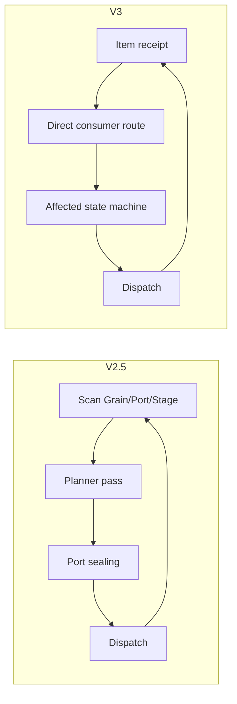

# Multigrain V3 与 V2.5 实现差异

> 本文用于 review、迁移和理解为什么 V3 更容易维护。
>
> V2.5 源码仍保留，V3 是独立 clean-slate 实现，不导入 V2.5。

## 1. 一句话总结

```text
V2.5
    扫描式 fixed-point planner + 多套 derived state

V3
    四组件 + event-driven incremental Arena state machine
```

V3 保留 V2.5 的主要功能和 MinerU 性能，但删除了 Relate/M:N 与多套重复推进状态。

---

## 2. 顶层架构对比

### V2.5

```text
executor.py
├── Arena
├── _PipelineDriver
├── _RunCoordinator
├── Executor
└── RayTransport
```

控制循环：

```text
publish terminal records
→ scan graph planners
→ seal ports
→ dispatch
→ poll
→ repeat
```

### V3

```text
CompiledDAG
→ ArenaEngine
↔ RunDriver
↔ StageExecutor
```

控制循环：

```text
new terminal Item
→ route direct consumers
→ update only affected invocation/Reduce
→ enqueue Grain
→ dispatch
```



---

## 3. 文件结构对比

### V2.5

```text
api.py
graph.py
grain.py
worker.py
executor.py      约 2407 行
metrics.py
```

`executor.py` 同时承担单 Arena、DAG planner、多 Arena、Ray transport、delivery 和 recovery。

### V3

```text
api.py
dag.py
model.py
protocol.py
arena/
├── state.py
└── engine.py
driver.py
execution.py
worker.py
executor.py
```

`executor.py` 只组装 public run；Ray transport 不导入 Arena internals。

---

## 4. 数据结构映射

| V2.5 | V3 | 变化 |
|---|---|---|
| `PortId(node, slot)` | `PortId(stage, output)` | 命名更贴近 Stage |
| `RoleItems` | `InputBinding` + `InputSpec` | 静态 input mode 与动态 binding 分开 |
| `GrainTable` | `dict[GrainId, GrainRecord]` | 语义不变，结构收敛 |
| `ProducerIndex` | `ItemRecord.producer` | 合并到 ItemTable |
| `PortIndex` | `ItemTable` key=`ItemRef` | 不再维护重复 Port/entity 索引 |
| `ValueIndex` | `ValueTable` | 只负责物理位置 |
| `ExpandOriginIndex` | `EntityOrigin` | parent link 支持 nested scope |
| `FiberBarrier` | `ReduceAccumulator` | dense ordinal arrays |
| `_PortDomain` | 删除 | receipt 直接路由 |
| `BindingReceipt` | `ItemRecord` | terminal receipt 成为权威表 |
| `processed/planned` | 删除 | 状态机只分类一次 |
| `_ready/_ready_set/_forced` | `StageBatchQueue` | queue state 收拢 |
| `DispatchRuntime` | `DispatchLease` | Arena commit authority |
| `RayPending` | `PendingRPC` | Transport-only Ray handles |
| `JoinIndex/Relate` | 删除 | V3 不做 M:N |

---

## 5. Identity 语义

两版都坚持：

```text
ItemRef → Logical Grain → ItemRef emissions
```

V3 继续保留：

```text
PortId
EntityId
ItemRef
GrainId
AttemptToken
```

主要变化：

- 多 Source 同 position 共享 EntityId，支持 positional fan-in；
- `InputMode` 显式区分 ONE/OPTIONAL_ONE/GROUP/ANCHOR；
- Reduce anchor payload 不再默认发送到 actor。

---

## 6. General DAG fan-in

### V2.5

运行时通过：

```text
PortDomain
BindingReceipt
ReceiptState
planner pass
```

来判断 multi-role input 是否 ready。

### V3

```text
PendingInvocation(stage_id, entity_id)
```

每个 input Port receipt 到达时只更新一个 slot。全部 terminal 后立即分类并删除。

V3 新增显式：

```text
OPTIONAL_ONE
optional(port)
MISSING
```

适合 PDF/Image/Audio 互斥解析后统一 Normalize。

---

## 7. Filter 差异

### V2.5

- 常见实现是单 target output；
- Worker 返回 normalized empty/one-row output；
- Filter 产生新的 output block。

### V3

Filter 是 tuple-preserving：

```text
output_count == input_count
UDF 只返回 bool mask
```

`True`：

- 每个 output alias 对应 input BlockRow；
- 不复制业务 payload；
- 不返回业务 output block。

`False`：

- 所有 output 同步 DROPPED。

---

## 8. Reduce 差异

### V2.5

`FiberBarrier`：

```text
expected
present dict
dropped set
failed dict
blocked_by set
```

Planner 每轮从 members Port receipts 更新 barrier。

### V3

`ReduceAccumulator`：

```text
scope_path
fanouts[(depth, parent_path)]
leaf_groups[input_index][ordinal_path]
GroupShape(offsets_by_level)
```

GROUP receipt 到达时直接 settle完整 ordinal path。V3 既支持逐层 Reduce，也支持一个
Reduce 跨多个 descendant Expand；每个 Expand 自动对应 UDF 输入中的一层 list。

V3 anchor：

```text
semantic-only
参与 GrainId/scope/output identity
不进入 actor payload
```

如果 UDF 需要 parent metadata，使用 anchor-aligned ONE context。

---

## 9. 推进与完成判定

### V2.5

完成依赖：

- PortDomain seal；
- planned candidate；
- node terminal；
- pending dispatch。

### V3

完成依赖显式本地状态：

```text
admission closed
receipt queue empty
无 PendingInvocation
无 ReduceAccumulator
StageBatchQueue empty
无 IN_FLIGHT Grain/DispatchLease
无该 Arena PendingRPC
```

V3 不需要 unary Port sealing。

---

## 10. Recovery 差异

### V2.5

主要实现：

- `BadRecordError`；
- generic `error_policy=raise/isolate`；
- infrastructure retry；
- forced split groups。

### V3

失败类别：

```text
BAD_RECORD
UDF_ERROR
CONTRACT_ABORT
INFRA_FAILURE
```

Preset：

```text
raise
retry_batch
retry_tail
isolate_tail
fail_batch
```

Recovery state 位于 Arena，Ray handles 位于 StageExecutor；RunDriver 只转发 event。

---

## 11. Ray execution 差异

共同点：

- persistent actors；
- coarse block；
- per-dispatch multi-grain RPC；
- driver 不读取中间大 payload；
- multi-Arena overlap；
- actor concurrency 默认 1。

V3 的结构差异：

```text
StageExecutor
    一个 Stage 一个 actor pool

ExecutionPool
    所有 StageExecutor

protocol.py
    无 Ray 的 BatchCall/Report DTO
```

`execution.py` 和 `worker.py` 有 import-boundary 测试，不能访问 Arena internals。

---

## 12. API 差异

保持不变：

```text
Pipeline
Map
Filter
Expand
Reduce
Executor
RunResult
.pre_init(...)
.ray_options(...)
```

变化：

| API | V2.5 | V3 |
|---|---|---|
| Relate/keyed | 保留 bounded prototype | 删除 |
| optional input | 无显式 API | `optional(port)` |
| missing value | normal absence 传播 | UDF 收到 `MISSING` |
| recovery | `error_policy` | recovery preset |
| Reduce anchor | 作为 UDF 输入 | semantic-only |
| Filter | 通常单输出 | 所有 required inputs 同步 mask |

---

## 13. 可读性和审计性

### V2.5 复杂点

```text
processed
planned
PortDomain
port sealing
FiberBarrier
多套 Index
executor.py 多职责
```

### V3 防护

- 模块/类 docstring；
- `dag.py` 无 runtime/Ray import；
- ArenaEngine 无 Ray import；
- Execution/Worker 不 import Arena；
- RunDriver 不访问 Arena 内部 tables；
- RPC DTO 独立于 Arena；
- tests 按 unit/integration 边界组织。

---

## 14. 性能回归

固定 MinerU 配置：

```text
368 PDFs / 7,072 pages
4×H20
OCR batch cap 64
microbatch 24
max in-flight Arenas 3
```

```text
V2.5 elastic median    581.509s
V3                     587.781s
差异                    +1.08%
```

V3 OCR：

```text
120 RPC
58.93 pages/RPC
3.87% bubble ratio
```

完整结果：

```text
docs/experiments/multigrain_v3/2026-08-01_v3_mineru_regression.md
```

---

## 15. 功能覆盖对照

| 能力 | V2.5 | V3 |
|---|---:|---:|
| General DAG | 是 | 是 |
| per-Port lineage | 是 | 是 |
| Map/Filter/Expand/Reduce | 是 | 是 |
| dynamic fan-out | 是 | 是 |
| elastic rebatching | 是 | 是 |
| ordered/empty/filtered Reduce | 是 | 是 |
| nested Expand/Reduce | 可组合 | 明确测试 |
| direct cross-level nested Reduce | 否 | 是 |
| multi-Arena overlap | 是 | 是 |
| exact bad record | 是 | 是 |
| binary isolation | 是 | `isolate_tail` |
| stale generation fencing | 是 | 是 |
| optional aligned input | 否 | 是 |
| semantic-only anchor | 否 | 是 |
| Relate/M:N | bounded prototype | 否 |
| 4×H20 MinerU | 是 | 是 |

---

## 16. 迁移注意事项

### Reduce UDF

V2.5：

```python
run(anchors, members, pages)
```

V3：

```python
run(members, pages, context)
```

需要 parent 信息时先生成轻量 context Port。

### Filter

V2.5 单输入：

```python
filtered = filter(rows)
```

V3 多输入可同步过滤：

```python
filtered_rows, filtered_meta = filter(rows, meta)
```

UDF 仍只返回 bool list。

### Recovery

```text
error_policy="isolate"
```

迁移为：

```text
recovery="isolate_tail"
```

### Relate

V3 无替代实现。需要 key join/group-by/shuffle 的 workload 应继续使用其他系统或单独设计
relation/shuffle 扩展，不能用普通 Map 或长度相等隐式模拟。

---

## 17. V3 仍需关注的复杂点

- `ArenaEngine` 仍是主要复杂核心；
- Prototype 1 保留中间 blocks 到 Arena delivery；
- metadata 使用 Python dict/list，不是 production compact store；
- elastic batching 目前不跨 Arena；
- 不支持 cross-entity relation。

这些是当前边界，不应被性能回归结果误解为已经解决。
