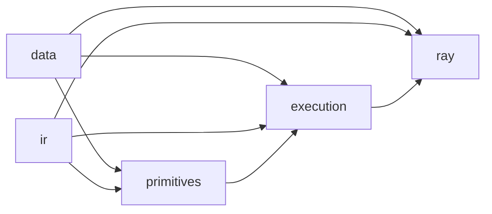

# RayOrch Multigrain

`rayorch.experimental.multigrain` 是面向对象数据流水线的实验性执行框架。它解决的核心问题是：

> 当数据在 `document → page → block` 等不同粒度之间发生 1:1、1:N、N:1、M:N
> 变化时，如何让用户只描述值变换和关系，同时由框架统一管理 identity、lineage、
> 重排、并行调度与故障恢复。

本文是开发文档入口。建议第一次阅读时严格按下列顺序进行；下级文档不互相跳转，
避免阅读路径和 Agent 上下文反复展开。

## 阅读路线

1. [Overview：从用户程序到运行时](docs/overview.md)
   - 为什么需要 multigrain
   - 五层架构和两条执行路径
   - 核心设计模式与目录边界
2. [Data 与 IR：字段、关系和 Capability](docs/data-and-ir.md)
   - `PortBatch` 每个字段的准确含义
   - `IRNode / RelationSpec / CardinalityContract`
   - primitive 到 RelationSpec，再到 Capability 的完整推导
   - verifier、被动 IR 和稳定 identity
3. [Primitives：六种算子的用户与框架契约](docs/primitives.md)
   - `Map / Filter / Select / Expand / Reduce / Relate`
   - UDF 输入输出、arity、lineage 与 corner cases
4. [Execution：Handler、Local、Ray 与 Recovery](docs/execution.md)
   - Handler Registry 和 runtime cache
   - row sharding、LPT、actor pool、microbatch coordinator
   - record/shard recovery、fail-closed 与当前边界

面向应用开发者的简明手册仍位于
[`docs/multigrain_user_guide.md`](../../../docs/multigrain_user_guide.md)；这里的文档更关注
内部设计、不变量和贡献代码时应遵守的边界。

## 30 秒示例

```python
from rayorch.experimental import multigrain as mg
from rayorch.experimental.multigrain.ir import (
    MissingChildPolicy,
    PhysicalHints,
)


class PdfToPages:
    def run(self, pdfs: list[str]) -> list[list[dict]]:
        return [render_pages(pdf) for pdf in pdfs]


class OcrPage:
    def __init__(self, model: str) -> None:
        self.model = load_model(model)

    def run(self, pages: list[dict]) -> list[str]:
        return self.model.batch_ocr(pages)


class AssembleDocument:
    def run(
        self,
        pdfs: list[str],
        page_text_groups: list[list[str]],
    ) -> list[str]:
        return [
            assemble(pdf, page_texts)
            for pdf, page_texts in zip(pdfs, page_text_groups)
        ]


class MinerUPipeline(mg.Pipeline):
    def __init__(self) -> None:
        super().__init__()
        self.to_pages = mg.Expand(
            PdfToPages,
            parent=0,
            child_label="page",
        )
        self.ocr = mg.Map(
            OcrPage,
            model="model/path",
            physical=PhysicalHints(
                replicas=4,
                num_gpus_per_replica=1.0,
            ),
        )
        self.assemble = mg.Reduce(
            AssembleDocument,
            missing_child=MissingChildPolicy.FAIL_CLOSED,
        )

    def forward(self, documents):
        pages = self.to_pages(documents)
        page_texts = self.ocr(pages)
        return self.assemble(mg.group_by(documents, page_texts))


graph = MinerUPipeline().compile()
inputs = {"documents": mg.source(["a.pdf", "b.pdf"], name="documents")}
result = mg.MultigrainExecutor().execute(graph, inputs)
```

在这个例子中：

- `Expand` 声明 document 与 page 的 parent/child 关系；
- `Map` 保留 page identity，只改变 page value；
- `Reduce` 通过 ancestry 自动把 page regroup 回 document；
- UDF 从不接收 `record_id`、ordinal 或 lineage；
- `compile()` 不实例化 OCR 模型，只记录可导入 class 与构造参数；
- Local 与 Ray 执行复用同一个 primitive 语义实现。

## 包结构

```text
multigrain/
├── data/          # PortBatch、identity、lineage、errors、grouping
├── ir/            # passive IR、relation contracts、passes、capabilities
├── primitives/    # 六种 primitive、binding、output builder
├── execution/     # handlers、local executor、coordinator、metrics
└── ray/           # opt-in Ray backend、sharding、actor pools、recovery
```

依赖只能向下：



图中的箭头表示“右侧依赖左侧所提供的概念”。`data` 和 `ir` 不得导入 primitive
或 executor；Ray-specific 对象不得进入被动 IR。

## 稳定概念与实验边界

当前应视为稳定设计主线的概念：

- 平坦的六 primitive API；
- `PortBatch` 的平行 metadata 列；
- `MultigrainIR` 的被动、可序列化属性；
- `RelationSpec` 是关系语义的唯一事实来源；
- Capability 从已验证的 relation contract 派生，不写回 IR；
- eager、compiled 和 Ray 共用 primitive wrapper 与 output builder；
- UDF value-purity 和内部 identity 隔离。

仍在演进的部分：

- recovery 目前主要在 `Map` 上具有完整 attributable-record 支持；
- `Relate` 当前只有单输出，且 whole-batch 执行；
- `Reduce` 当前不是分布式 two-phase reduce；
- lineage 仍使用逐记录 Python dict/tuple，尚未进入 `BatchArena` 紧凑表示；
- Handler Registry 是内部扩展点，不是稳定的第三方插件 API。

## 文档维护规则

代码变更必须同步更新本目录文档：

- 修改 `PortBatch`、IR dataclass 或 enum：更新 `docs/data-and-ir.md`；
- 修改 RelationSpec 或 Capability 推导：更新字段定义和推导矩阵；
- 修改 primitive UDF 契约或 output shape：更新 `docs/primitives.md`；
- 修改 handler、executor、Ray scheduling 或 recovery：更新 `docs/execution.md`；
- 增加新的顶层 feature 或改变阅读顺序：只更新本 README 的入口链接。

不要在各子文档之间建立网状链接；保持 README → 专题文档的单向索引。

## 验证

```bash
# 快速 multigrain 回归
python -m pytest -q test/experimental/multigrain

# 包含 Ray、MinerU 图片对象与慢速集成
RAY_ADDRESS=local conda run -n torch-base \
  python -m pytest -q test/experimental/multigrain --runslow
```

当前测试覆盖 primitive 语义、IR verifier、eager/compiled 等价、随机重排、
diamond lineage、M:N、record/shard recovery、LPT 和真实 MinerU 图片对象。
