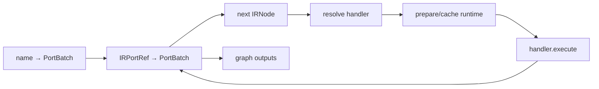
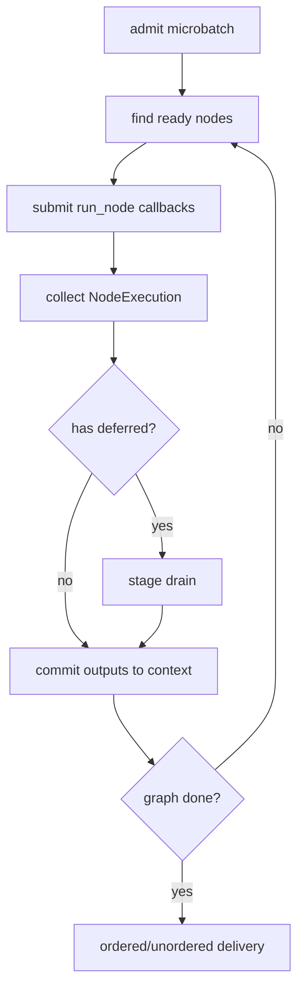

# Execution：Handler、Local、Ray 与 Recovery

执行层的原则是：

> Primitive 定义逻辑语义；executor 只决定何时、在哪里、以什么物理分片执行。

## 1. 从 IRNode 到可执行 runtime

### 1.1 PrimitiveHandler protocol

```python
class PrimitiveHandler(Protocol):
    def prepare(self, context, node: IRNode) -> Any:
        ...

    def execute(
        self,
        context,
        node: IRNode,
        runtime: Any,
        inputs: tuple[PortBatch, ...],
        *,
        force_inline: bool,
    ) -> NodeExecution:
        ...
```

职责：

- `prepare`：读取 `OperatorRecipe`，加载 class，构造 primitive wrapper；把被动声明转换为
  当前 executor replica 内可复用的 runtime；
- `execute`：把 IR 调用形态适配到 wrapper；例如 Reduce handler 负责构造
  `group_by(anchor, *descendants)`，但分组语义仍由 Reduce 实现；
- 返回统一的 `NodeExecution(outputs, deferred)`：显式区分已完成 outputs 与需要
  coordinator 后续 drain 的 records。

明确不负责：

- actor/pool 生命周期：这是具体分布式 backend 的物理资源管理；
- shard planning：这是 capability 与 planner 共同决定的物理 partition；
- microbatch backpressure：这是跨 node 的 coordinator 职责；
- retry budget：预算来自 `RecoveryPolicy`，由 recovery execution path 消费；
- metrics storage：handler 只返回结果，executor 在统一边界计时与记录；
- graph topology：handler 只看当前 node，不能硬编码上游、下游或 workload 名称。

### 1.2 Handler families

| Handler | prepare | execute 特殊点 |
|---|---|---|
| `MapHandler` | 重建 Map | 调用 `run_with_recovery`，返回 deferred records |
| `FilterHandler` | 重建 Filter | 普通 aligned invocation |
| `ExpandHandler` | 从 provenance 恢复 parent/child label | 普通 invocation |
| `ReduceHandler` | 恢复 missing child policy | 包装 `group_by(inputs[0], ...)` |
| `RelateHandler` | 恢复 roles/on/adapter | 可注入 executor relation_fn |
| `SelectFilterHandler` | 无 runtime | 执行 internal canonical filter |
| `ProjectHandler` | 无 runtime | 透传 ports |
| `UnaryIdentityHandler` | 无 runtime | Rebatch/Materialize 单输入透传 |

### 1.3 Registry resolution

```python
handler = (
    recipe_handlers.get(node.op.cls_ref)
    or kind_handlers.get(node.kind)
)
```

recipe handler 优先，用于 `SelectFilter` 等 internal recipe。这样 executor 不再依赖
class-name suffix，也不需要大型 NodeKind 条件链。

Handler Registry 当前是内部机制。新增公开第三方 primitive 仍需同时定义 relation
contract、verifier 和 capability，因此不能只注册一个 handler 就视为安全扩展。

## 2. Local executor

### 2.1 拓扑执行

`MultigrainExecutor.execute()`：

1. 校验 local recovery 支持范围；
2. 用 graph input refs 初始化 context；
3. 按 `graph.nodes` 拓扑顺序遍历；
4. 从 context 读取 `node.input_refs`；
5. registry resolve handler；
6. prepare/cache runtime；
7. execute；
8. 检查输出数并写回 context；
9. 按 `graph.graph_outputs` 返回结果。



### 2.2 Runtime cache

缓存 key 是 node name，同时保存完整 IRNode：

```python
self._runtimes: dict[str, Any]
self._runtime_nodes: dict[str, IRNode]
```

同一个 executor 被不同 graph 复用、但 node name 对应不同 recipe 时会报 name collision，
避免错误复用模型。

### 2.3 warm()

`warm(node)` 强制访问 wrapper `.op`，让 `LazyOp` 立即构造 UDF。Ray actor 创建后可用它
把模型加载成本移出正式计时。

### 2.4 Local 的 recovery 边界

当前 local executor 支持：

- Map inline record retry：利用 `BadRecordError.index` 把失败 row 从 dense batch 中抽出，
  在当前 node call 内按预算重试；
- deterministic bad-record isolation：重试耗尽后生成 `ErrorTrace` 并保留 healthy rows，
  为下游 fail-closed cascade 提供 ancestry。

不支持：

- deferred record drain：它需要 coordinator 跨 microbatch 聚合，不属于单图同步执行；
- 非 Map record retry：这些 primitive 尚未定义完整的 attributable-row adapter；
- Ray shard retry、actor replacement：它们依赖 remote task/actor failure semantics。

这些组合在执行前明确抛 `NotImplementedError`。

## 3. ExecutionCoordinator

Coordinator 是 driver-side 通用 DAG scheduler，不依赖 Ray API。它通过回调接收：

```python
RunNode = Callable[
    [IRNode, tuple[PortBatch, ...]],
    NodeExecution,
]
```

负责：

- 接纳 microbatch：为每个输入建立独立 graph context 和 sequence number；
- 判断 node 的全部 inputs 是否 ready：依据 IR refs 和 dependencies，而不是 node 名称；
- 允许独立 branches 并行：同一 DAG 中没有数据依赖的节点可以同时提交；
- 允许不同 microbatches overlap：前一批进入下游时，后一批可以运行上游；
- 限制 active + completed-unconsumed 数量：把用户消费速度纳入端到端背压；
- 默认按输入顺序交付结果：内部可乱序完成，外部仍获得确定的 stream order；
- 汇聚并 drain deferred records：将零散 singleton 合并为 stage-level retry batch。

不负责：

- shard 划分：交给 Ray node runner 和注入的 shard planner；
- actor 选择：交给 backend pool/replica scheduler；
- UDF 调用：交给 handler 和 primitive wrapper；
- lineage：由 `PortBatchBuilder` 按 relation semantics 生成；
- retry 策略：由 `RecoveryPolicy` 与 recovery kernel 决策，coordinator 只安排 drain 时机。



`max_inflight` 同时约束运行中和已完成但用户尚未消费的结果，因此对大图片 payload
形成端到端 backpressure。

## 4. Ray executor

`MultigrainRayExecutor` 在 Local node semantics 外增加物理并行。

### 4.1 execute 与 execute_stream

单批执行只是：

```python
execute_stream(
    graph,
    (inputs,),
    max_inflight=1,
    ordered=True,
)
```

因此不存在独立的“单批调度路径”。

### 4.2 Capability 驱动决策

Ray 层不再维护：

```python
_SHARDABLE = {MAP, FILTER, EXPAND}
```

而是：

```python
caps = capabilities_for(node)

if caps.row_partitionable:
    # 可以 row shard
```

当前：

- Map/Filter/Project/Rebatch/Materialize 的 aligned/preserve family 可分片；
- Expand 可按 parent rows 分片；
- Reduce 需要 group completion，不分片；
- Relate 需要 cross-role context，不分片。

Capability 是必要条件，不替代 UDF purity、structural verification 或 operator property。
当前 `PhysicalHints.batch_size` 尚未被 Ray lowering 消费；IR pass 插入的 `REBATCH` 与
`MATERIALIZE` 也仍由 identity handler 执行，并不表示已经具有真实 repartition 或
storage backend。

### 4.3 Shard planner

planner 接口：

```python
planner(
    node: IRNode,
    inputs: tuple[PortBatch, ...],
    replicas: int,
) -> list[list[int]] | None
```

返回每个 shard 的 row indexes。所有 aligned inputs 使用相同 indexes。

#### Contiguous

按 row count 连续等分：

```text
[0,1,2] [3,4,5] [6,7] [8,9]
```

简单，但长尾 workload 会产生 idle bubble。

#### LPT

`lpt_shard_planner(work_fn)`：

1. 估计每行 work；
2. 从最重到最轻排序；
3. 每次放入当前总负载最低的 shard。

它会物理重排记录，所以正确性依赖 stable identity、ordinal 和 Reduce canonical order。

### 4.4 Persistent actor pool

当节点：

- row partitionable，且
- 使用 GPU，或 replicas > 1

Ray executor 为其创建 persistent actor pool。每个 actor：

1. 持有自己的 `MultigrainExecutor`；
2. prepare node wrapper；
3. warm UDF/model；
4. 跨 shard 和 microbatch 复用。

actor pool 以 node name 缓存，同时校验 IRNode 和 replica count，防止跨 graph 错误复用。

### 4.5 Actor replacement

一个 actor 进程死亡时：

- 只替换对应 replica slot；
- 其他健康 actor 保持；
- 新 actor 重新加载该 replica 的模型；
- 并发 microbatch 如果已完成替换，不会再次替换健康 actor。

数据级 bad record isolation 不会重启 actor。

## 5. Recovery 分层

### 5.1 记录级 attributable failure

UDF 抛出：

```python
BadRecordError(
    message,
    index=local_index,
    retryable=True,
)
```

框架已知道失败的是当前 batch 中哪条逻辑记录。

#### Inline

- 从 dense batch 移除坏行；
- healthy rows 继续 dense execution；
- 坏行作为 singleton 重试；
- 成功后按原 identity order 合并；
- 超过预算则 quarantine。

#### Deferred

- attributable singleton 存入 `DeferredRecord`；
- coordinator 跨活跃 microbatches 聚合；
- stage 暂无健康工作、达到目标 batch 或输入关闭时 drain；
- drain 强制 inline，避免无限延迟。

### 5.2 Shard-level failure

普通 exception 没有 bad row index，executor 只能认为整个 shard 失败：

1. 按 `max_shard_retries` 重试 shard；
2. 尽量选择健康 replica；
3. 记录 `retries` 与 `recovery_rows`；
4. 耗尽后按 `on_shard_exhausted` abort 或 degrade。

### 5.3 Adaptive isolation

`DEGRADE` 仅适用于 `row_partitionable` 节点。它递归拆分失败 row set：

- 成功子集立即保留：避免已证明健康的 rows 随失败兄弟重复计算；
- 失败子集继续定位：通常二分直到得到 attributable singleton 或触发预算；
- `max_work_factor` 限制额外 row-work：以原 shard rows 为基准约束递归重算放大；
- `max_calls` 限制 UDF 调用数：防止小批二分在极端故障下造成大量调度开销；
- 预算耗尽后 quarantine 或 abort：由 `IsolationExhaustedAction` 明确决定，不静默返回
  未知完整性的输出。

该机制适合稀疏 opaque failure；密集失败会快速触发预算上限。

### 5.4 Fail-closed downstream cascade

记录 quarantine 后，错误携带 ancestry。下游 Reduce：

```text
failed page
  → ErrorTrace.ancestors[document]
  → poisoned document anchor
  → suppress output
```

这阻止一个丢页 document 被静默写成部分 Markdown。

### 5.5 当前支持矩阵

| 能力 | Map | Filter | Expand | Reduce | Relate |
|---|---:|---:|---:|---:|---:|
| inline record retry | 是 | 否 | 否 | 否 | 否 |
| deferred record retry | Ray | 否 | 否 | 否 | 否 |
| shard retry | Ray | Ray | Ray | 单任务失败处理 | 单任务失败处理 |
| adaptive row isolation | Ray | 尚未形成 attributable adapter | 同左 | 不适用普通 row split | 不适用普通 row split |
| fail-closed consumption | 产生 error | 传播 | 传播 | 是 | 传播 |

“否”表示 executor 会拒绝相关 policy，不能理解为静默忽略。

## 6. Metrics

`NodeMetric` 记录：

- kind；
- replicas；
- rows in/out；
- wall time；
- per-shard busy time；
- retry count；
- recovery rows。

关键计算：

```text
stage makespan = max(shard_busy_s)
ideal makespan = mean(shard_busy_s)
idle bubble = 1 - ideal / makespan
```

`lineage_footprint()` 估计：

- record count；
- ancestor entries；
- relation entries；
- identity/display/ancestor/ordinal/lineage 的近似 bytes；
- bytes per record。

不包含用户 payload value。

## 7. 执行不变量

修改 executor 时必须维持：

1. 物理 shard/reorder 不改变 logical record identity；
2. aligned ports 必须使用同一 row partition；
3. multi-output ports 必须保持 identity 对齐；
4. shard merge 不能丢失 errors 或 relation refs；
5. Reduce 前必须满足 group completion；
6. operator/model 在一个 persistent replica 内只构造一次；
7. retry 不得改变最终 logical order；
8. unsupported policy 必须显式失败；
9. Ray 层不得重新实现 primitive output/lineage 语义。

## 8. 新执行机制应放在哪里

| 需求 | 归属 |
|---|---|
| 新逻辑关系 | IR + primitive |
| 新 output metadata 策略 | primitive output builder |
| 新 node 调用适配 | handler |
| 新 DAG readiness/backpressure | coordinator |
| 新 shard planner | Ray backend |
| 新 actor lifecycle | Ray backend |
| 新 recovery algorithm | RecoveryKernel/adapter（后续执行层） |
| 新 metrics backend | execution metrics |

不要因为某个 workload 需要特殊调度，就在 coordinator 中硬编码 node name 或 MinerU
拓扑；调度决策应由 IR contract、capability、physical hints 或注入 planner 驱动。
