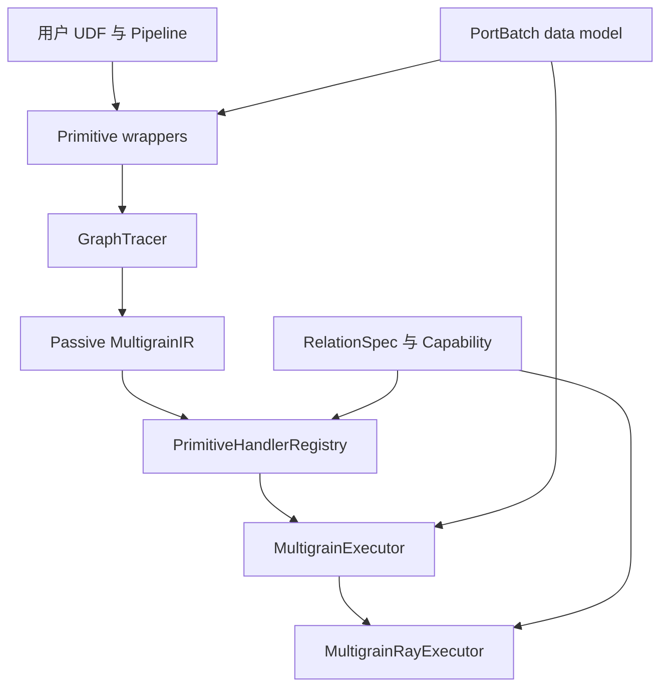
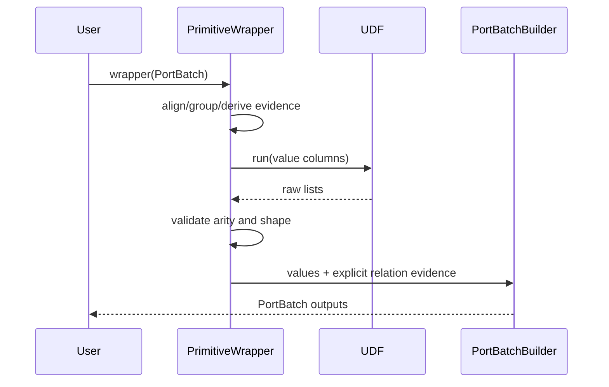
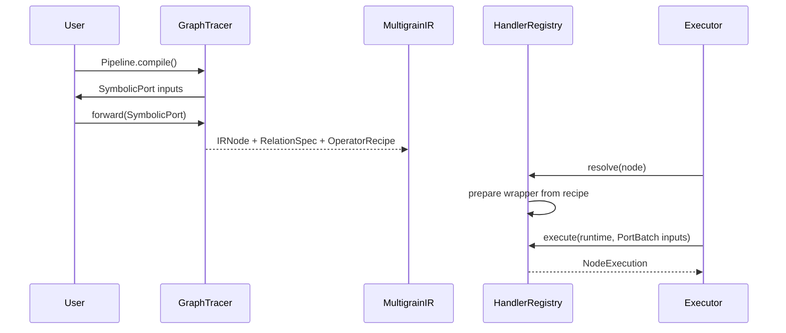
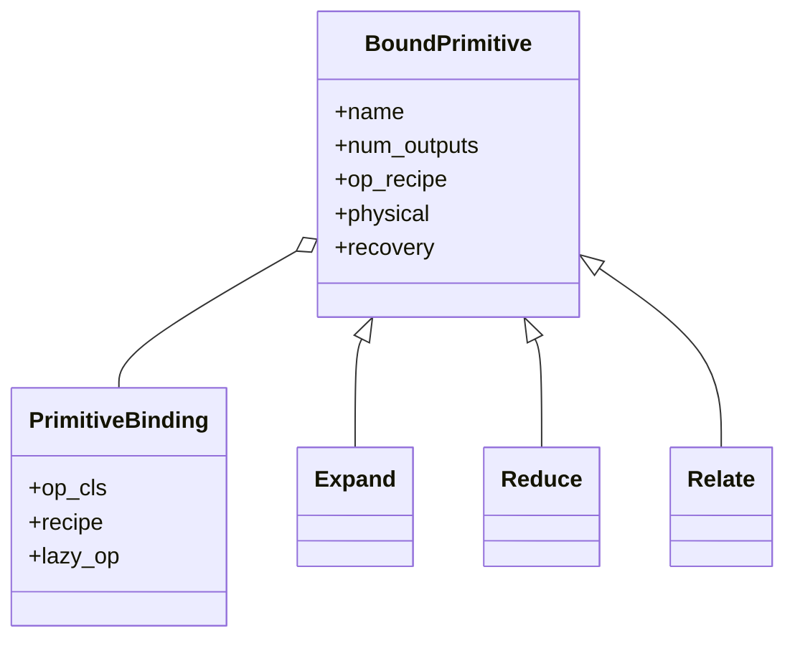

# Overview：从用户程序到运行时

## 1. 问题是什么

普通 batch pipeline 通常默认所有 stage 都处理“同一批行”：

```text
input row i → stage A row i → stage B row i
```

文档解析、视频处理和多模态数据准备并不满足这个假设：

```text
document 1:N page 1:N block
image M:N caption
page N:1 document
```

一旦粒度改变，运行时不仅要传值，还必须回答：

1. 当前记录属于哪个逻辑粒度？
2. page 是由哪个 document 产生的？
3. 物理重排后 page 的原始顺序是什么？
4. diamond fan-in 时应合并哪些 lineage？
5. 某一 page 永久失败后，哪个 document 应被抑制？
6. 哪些节点可以按行分片，哪些必须等待完整 group？

Multigrain 的核心选择是：关系由 primitive 声明，identity 和 lineage 由框架维护，
UDF 只处理业务值。

## 2. 用户心智模型

用户只需要理解四个概念：

- **Grain**：记录的逻辑粒度，如 `document`、`page`、`block`；
- **Port**：一组同 grain 的记录；
- **Primitive**：值和粒度如何变化；
- **Pipeline**：primitive 之间如何连接。

框架内部补充：

- **Record identity**：不会暴露给 UDF 的稳定逻辑身份；
- **Relation evidence**：parent、anchor 或 role parent 关系；
- **Ordinal**：物理重排后恢复逻辑顺序的层级位置；
- **Lineage**：记录经过的操作路径和祖先集合；
- **Recovery policy**：失败如何重试、隔离或向下游传播。

## 3. 五层架构



### 3.1 Data

`data/batch.py` 保存运行时记录。它独立于 Ray，也不理解具体 primitive。最重要的类型是：

- `PortBatch`：一个逻辑 port 上同 grain 的一批记录；把业务 `values` 与
  `record_ids / ancestors / ordinals / lineage` 等框架 metadata 保存为严格等长的平行列，
  使物理重排不影响逻辑身份。
- `ParentRef`：一条 M:N relation output 对某个输入 parent 的显式引用；通过
  `role + port + record_id + display_key` 表达多父关系，避免把动态 relation 塞进单一
  ancestor 链。
- `ErrorTrace`：一个失败逻辑项的结构化 provenance；记录失败 grain、operator、祖先和
  处置动作，使错误可以随 `PortBatch` 传播，并让下游 Reduce 精确定位受影响的 anchor。
- `DeferredRecord`：暂缓重试的一条可归因记录；保存稳定 token、原始 singleton inputs
  和失败信息，让 coordinator 能跨 microbatch 聚合后再执行 stage-global retry。
- `NodeExecution`：handler 执行一次 node 的统一返回信封；同时携带正常
  `outputs` 和待后续 drain 的 `deferred`，避免 executor 使用异常或旁路队列表达部分成功。
- `Grouped`：`group_by(anchor, *descendants)` 产生的轻量声明对象；只描述 Reduce 的
  anchor 与 descendant ports，不立即搬运或分组数据，真正 regroup 由 Reduce 根据
  ancestry 完成。

### 3.2 IR

`ir/model.py` 保存编译后的逻辑图：

- port 引用与 grain：用 `IRPortRef / IRPortSpec` 表达边的来源、输出序号和逻辑粒度，
  让 graph connection 与 runtime object 解耦；
- node 输入输出：`IRNode` 只保存 passive port specs，由 executor 在运行时用 ref 查找
  对应的 `PortBatch`；
- cardinality/relation contract：`CardinalityContract / RelationSpec` 描述 1:1、1:N、
  N:1、M:N 语义，是 verifier 和 capability 推导的唯一事实来源；
- operator reconstruction recipe：`OperatorRecipe` 保存 importable class path 与构造参数，
  让 operator 能在 local process 或 Ray actor 内按需重建；
- operator properties、physical hints、recovery policy：分别描述逻辑安全属性、物理执行
  偏好和失败处置策略，三者都是声明而不是 live runtime state。

IR 不保存：

- live operator instance：避免 compile 时加载模型或持有不可序列化资源；
- `GraphTracer`：它只服务 symbolic tracing，结束后由 passive refs 替代；
- handler：handler 是 execution strategy，可按执行环境选择，不属于逻辑图；
- actor handle：actor 是某次 Ray execution 的临时物理资源；
- runtime `PortBatch`：具体 values 与 lineage context 只存在于一次执行；
- optimizer 推导缓存：Capability 等结论可由 IR 重算，避免形成第二份事实来源。

### 3.3 Primitives

`primitives/` 提供六种用户原语：

```text
Map      same grain, 1:1
Filter   same grain, 0:1
Select   annotate + filter
Expand   parent grain → child grain, 1:N
Reduce   descendant grain → anchor grain, N:1
Relate   multiple roles → relation grain, M:N
```

Primitive wrapper 同时支持 symbolic 和 eager 调用，因此它既是用户 DSL，也是唯一的
primitive 语义实现。

### 3.4 Execution

`execution/` 负责：

- 用 handler 把 passive recipe 还原成 wrapper：registry 将 IR node 解析为对应执行策略，
  handler 再用 `OperatorRecipe` 重建 primitive；
- 缓存每个 node 的 runtime/operator instance：一个 executor replica 内只构造一次 UDF，
  同时校验同名 node 没有被另一份 recipe 错误复用；
- 按拓扑执行：维护 `IRPortRef → PortBatch` context，只有 inputs ready 的 node 才能运行；
- 调度多个 microbatch：coordinator 允许独立 branch 和不同 microbatch overlap，并通过
  `max_inflight` 实现背压；
- 收集 metrics：统一记录 rows、wall time、shard busy time、retry 和 lineage footprint，
  不把观测逻辑写入 primitive。

### 3.5 Ray backend

`ray/` 只负责物理执行：

- row sharding：仅对 `row_partitionable` relation family 拆分 records，并保证 aligned
  input ports 使用相同 row indexes；
- contiguous/LPT shard planning：前者连续等分，后者按预计工作量做 longest-processing-
  time 贪心均衡，二者只改变物理顺序；
- persistent actor pools：对 GPU/model stage 或多 CPU replicas 长期复用 operator，
  避免每个 shard 重复 import 和加载模型；
- GPU placement：由 `PhysicalHints.num_gpus_per_replica` 转换为 Ray actor resource request；
- bounded in-flight microbatches：复用通用 coordinator，在 object store 侧限制运行中和
  已完成未消费 payload；
- shard retry、actor replacement 和 adaptive isolation：区分数据失败与 actor 失败，
  在预算内重试或二分定位坏记录，并只替换真正死亡的 replica。

它不重新实现 Map、Expand、Reduce 或 Relate 语义。

## 4. 两条执行路径

### 4.1 Eager



适合单元测试和交互式开发。已构造的 operator instance 只允许走 eager 路径。

### 4.2 Compiled



compiled 路径仍调用相同 wrapper，因此 eager/compiled 不应有两套 shape、identity 或
lineage 规则。

## 5. 关键设计模式

### 5.1 Symbolic tracing + passive IR

`SymbolicPort` 类似 PyTorch FX Proxy：只存在于 `forward()` tracing 期间。
`IRPortSpec` 才进入最终图。这样 IR 可序列化、可检查、与执行引擎无关。

### 5.2 Composition over inheritance

所有 primitive 继承薄的 `BoundPrimitive`，并组合 `PrimitiveBinding`：



薄基类只复用声明样板，不抽象 parent、anchor、role 等不同关系语义。

### 5.3 Builder

`PortBatchBuilder` 集中维护平行 metadata 列的完整性，但调用方必须明确选择：

- `preserved`：Map/Reduce 等输出保持某个 base port 的 identity，只替换 values 并追加
  lineage；
- `filtered`：按同一 mask 对 values 和全部 metadata 列同步取子集，避免列错位；
- `expanded`：为每个 child 生成 parent-addressed ID、ancestor 与 child ordinal；
- `related`：根据显式 `RelationOutput` 组装多父 `ParentRef`、合并 ancestry 和稳定 identity。

Builder 不猜测 relation family。

### 5.4 Strategy + Registry

`PrimitiveHandlerRegistry` 根据 node kind 或 internal recipe 选择 handler。Handler：

- `prepare()`：从 recipe 构造并缓存 wrapper；
- `execute()`：适配 grouped input、record recovery 或 internal node。

Handler 不拥有 actor、shard 或 stage lifecycle。

### 5.5 Derived Capability

Capability 是根据 `RelationSpec` 计算的执行视图，不是 IR 的第二份声明。这样避免：

```text
relation = REDUCE
row_partitionable = true
```

这样的矛盾状态。

## 6. Operator factory 生命周期

用户声明：

```python
self.ocr = mg.Map(OcrPage, model="model/path")
```

保存的是：

```python
OperatorRecipe(
    cls_ref="package.OcrPage",
    args=(),
    kwargs={"model": "model/path"},
)
```

而不是 `OcrPage()` 实例。执行时：

1. handler 加载 importable class；
2. 构造 wrapper；
3. `LazyOp` 首次访问时执行 `OcrPage(...)`；
4. local executor 按 node 缓存 wrapper；
5. Ray actor 中每个 replica 缓存自己的 wrapper/model。

因此 compile 不占 GPU，persistent actor 也不会为每个 shard 重载模型。

## 7. 一个端到端记录的变化

假设输入：

```text
document record_id = documents:0
display_key = a.pdf
```

Expand 第 2 个 page 后：

```text
record_id = SplitPages:documents:0:2
display_key = a.pdf/page=2
ancestors = {documents: documents:0}
ordinals = {documents: 2}
lineage = [SplitPages]
```

Map OCR 后 identity 不变，只追加：

```text
lineage = [SplitPages, OcrPage]
```

Reduce 读取 `ancestors[documents]` regroup，并按从 `documents` 开始的完整 ordinal path
排序，最终返回 document grain。

## 8. 扩展框架时的判断顺序

增加功能前依次回答：

1. 这是新的用户逻辑关系，还是已有关系的新执行方式？
2. 如果是逻辑关系，现有 `RelationKind` 是否能准确表达？
3. output identity、ancestor、ordinal、relation evidence 如何定义？
4. 该关系能否按 row partition？是否需要 group completion？
5. verifier 能否在执行前拒绝不完整 contract？
6. eager 与 compiled 是否调用同一个 authoritative implementation？
7. Ray 是否只改变调度，而没有重写语义？

如果只是在 Ray 中增加新调度，不应新增 primitive；如果 relation semantics 不同，也不应
强行塞入现有 `PortBatchBuilder` 策略。
