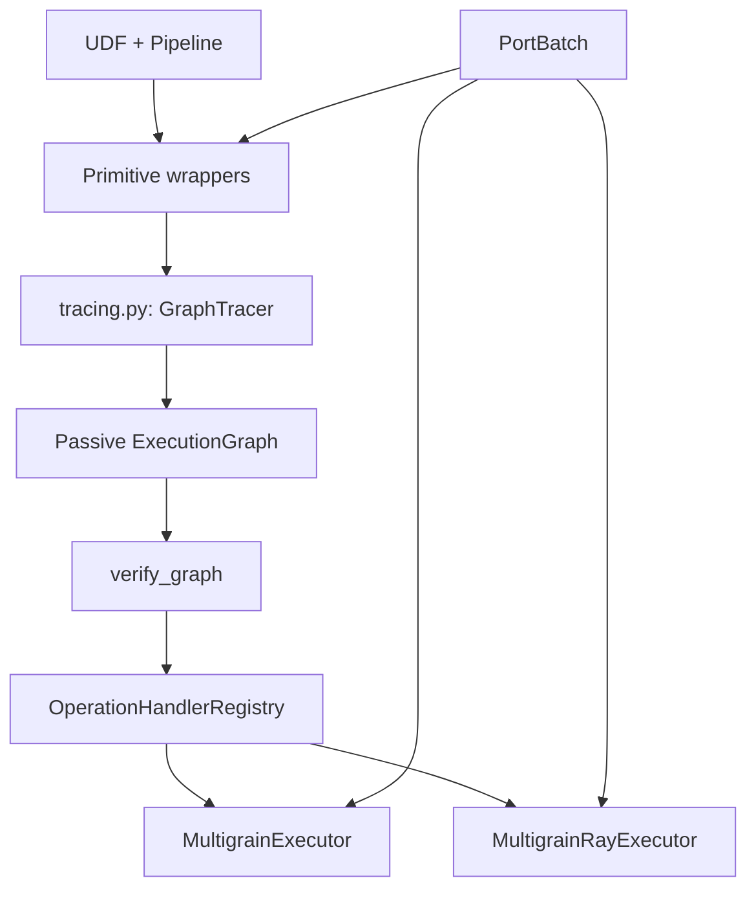
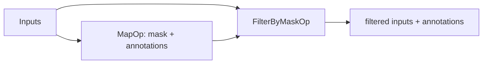

# Overview：从用户程序到运行时

## 1. 问题

普通 batch pipeline 常假设每个 stage 都处理同一批行。对象流水线会改变粒度：

```text
document 1:N page 1:N block
image M:N caption
page N:1 document
```

运行时必须在物理重排后仍知道记录身份、祖先、逻辑顺序和故障归属。Multigrain 的核心
选择是：primitive 声明值变换和 output relation，框架维护 identity/lineage，UDF
只处理业务值。

## 2. 用户心智模型

- **Grain**：记录的逻辑粒度，如 document、page；
- **Port**：一组同 grain 的记录；
- **Primitive**：一次 UDF invocation 及其 output relation；
- **Pipeline**：primitive 连接成的 DAG。

框架内部还维护 record identity、ancestor、ordinal、lineage 和 recovery policy。

## 3. 架构



### 3.1 Data

`PortBatch` 把 `values` 与 `record_ids / ancestors / ordinals / lineage / relations`
保存为严格对齐的列。`Grouped` 只声明 Reduce 的 anchor 和 descendants；真实 regroup
发生在 Reduce runtime。`ErrorTrace` 与 `DeferredRecord` 支持故障归因和恢复。

### 3.2 Tracing

tracing 位于 `rayorch/experimental/multigrain/tracing.py`：

- `TracePort` 只存在于 `Pipeline.forward()` 的 symbolic tracing；
- `GraphTracer` 收集 typed `NodeSpec`；
- `Pipeline.compile()` 构造 `ExecutionGraph` 并立即调用 `verify_graph()`。

trace-time token 和 live tracer 不进入最终图。

### 3.3 Passive ExecutionGraph

`ir/` 按职责拆分：

```text
refs.py          GraphInputRef, NodeOutputRef, PortRef
relations.py     SameAs, SubsetOf, ChildrenOf, AggregateOf, RelatedFrom
operations.py    typed operation calls and OperatorFactorySpec
graph.py         GraphInputSpec, OutputSpec, NodeSpec, ExecutionGraph
policy.py        WorkerPoolSpec, RecoveryPolicy
verify.py        verify_graph, validate_shard_plan
capabilities.py  is_row_partitionable
```

`OutputSpec(ref, grain, relation)` 是关系语义的直接事实来源。`NodeSpec` 包含 inputs、
outputs、typed operation、worker pool 和 recovery policy。图中不保存 live operator、
handler、actor、runtime `PortBatch` 或 optimizer state。

### 3.4 Operations and relations

Operation 与 output relation 是正交但受 verifier 约束的 typed sum：

| Operation | 允许的 output relation |
|---|---|
| `MapOp` | `SameAs` |
| `FilterOp` | `SubsetOf` |
| `ExpandOp` | `ChildrenOf`；IR 也预留 `SameAs` mixed output |
| `ReduceOp` | `AggregateOf` |
| `RelateOp` | `RelatedFrom` |
| `FilterByMaskOp` | `SubsetOf` |

`OperatorFactorySpec(import_path, args, kwargs)` 让 Local process 或 Ray actor 延迟构造
operator。资源只由 `WorkerPoolSpec(replicas, gpus_per_worker)` 表达。

### 3.5 Execution

`OperationHandlerRegistry` 按 `type(node.operation)` 选择 handler，不依赖 enum kind 或
class-name suffix。handler 从 `OperatorFactorySpec` 重建 wrapper，并复用 primitives 中
唯一的 runtime semantics。

Local 和 Ray 执行前都再次 `verify_graph()`。Local 按 graph node 顺序维护
`PortRef → PortBatch` context，并校验每个 output `PortBatch.name ==
OutputSpec.grain`。Map/Filter 保留 source grain，Expand 使用 `ChildrenOf.label`，
Reduce 返回 anchor grain，Relate 使用 `output_grain`。Ray 在此语义之上加入 exact row
sharding、persistent actor pool、microbatch coordinator 和 recovery。

## 4. Primitive core

五个大 primitive 决定 invocation scope：

```text
Map      aligned row-local 1:1
Filter   aligned row-local 0:1
Expand   parent-local 1:N
Reduce   group-complete N:1
Relate   cross-role M:N
```

`Select` 不是第六种 core relation。它是 authoring macro：



`FilterByMaskOp` 使用 mask input 做过滤，但排除 mask port 本身，不把它暴露给用户。

## 5. Capability

Capability 不作为可变字段写入 graph。当前只有：

```python
is_row_partitionable(node)
```

当前 Map、Filter、FilterByMask、Expand 可按 input rows 分片。Reduce 仍必须 whole-batch
观察 `AggregateOf` groups，Relate 需要 cross-role context；这些是 operation semantics，
不是另一个持久化或派生 capability。

所有自定义 shard plan 都经过 `validate_shard_plan(partitions, row_count)`，必须无越界、
无重复、无遗漏地覆盖每一行一次。

## 6. 两条调用路径

### Eager

wrapper 接收 `PortBatch`，对齐/分组后调用 UDF，校验 shape，再由 output builder 维护
metadata。适合 primitive 单测。

### Compiled

wrapper 接收 `TracePort`，记录 typed operation 和 per-output relation。executor 解析
`NodeSpec` 后仍调用同一个 wrapper/runtime semantics，因此 eager、Local 和 Ray 不应
各自维护 identity 或 lineage 规则。

## 7. Mixed-output identity forest

新 IR/verifier 已能表达 node-local forest：一个 Expand output 可 `ChildrenOf` input 或
更早 output，也可 `SameAs` input/更早 output；source 必须可用、grain 必须匹配、禁止
self/forward source。

这只是**可表示、可验证**，不是已完成的用户功能。未来 `mg.out.same` /
`mg.out.children` marker 和 runtime materializer 仍 deferred。当前 Expand wrapper/
handler 只执行 shared-child cohort：所有 outputs 使用同一个 `ChildrenOf`，逐 parent
group lengths 相同。

## 8. 不变量

1. UDF 只依赖 values，不观察内部 id 或物理位置；
2. relation adapter 在重排下必须置换等变；
3. physical shard/reorder 不改变 logical identity；
4. aligned inputs 使用相同 partition；
5. Reduce 执行前必须有完整 group；
6. unsupported relation/runtime 组合显式失败；
7. Ray 只改变物理调度，不重写 primitive semantics。
