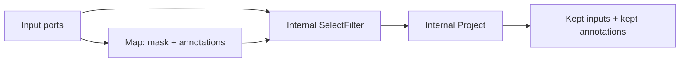

# Primitives：六种算子的完整契约

Primitive 是用户表达关系的唯一入口。每个 wrapper 同时支持：

- symbolic input：向 `GraphTracer` 注册 passive IR node；
- eager `PortBatch` input：直接执行唯一的 runtime semantics。

## 1. 所有 UDF 的共同规则

### 1.1 使用 importable class

推荐：

```python
class NormalizePage:
    def __init__(self, size: int) -> None:
        self.size = size

    def run(self, pages: list[dict]) -> list[dict]:
        return [normalize(page, self.size) for page in pages]


op = mg.Map(NormalizePage, size=1024)
```

compiled graph 只接受可导入 class。局部 class、`__main__` class 和已经构造的 instance
不能成为 passive recipe。instance 仅可用于 eager 测试。

### 1.2 UDF 只处理值

UDF 不接收：

- `record_id`：内部逻辑 identity；隔离它可防止 UDF 依赖框架 ID 格式；
- `display_key`：仅供 trace/debug 的可读标签，不能成为业务 join 的隐式依据；
- `ancestors`：框架维护的 parent/anchor identity map，由 Expand、Reduce 和 recovery 消费；
- `ordinals`：框架维护的层级顺序证据，物理重排不应被 UDF 观察；
- `lineage`：框架自动追加和合并的执行 provenance，不能由业务代码手动伪造；
- shard index 或全局 row index：它们属于某次物理计划，暴露后会破坏 shard/reorder
  invariance。

UDF 输出必须只依赖输入业务值。批内位置可用于与同次输入一一对应，但不能假设
“这是全局第 37 条记录”。

### 1.3 run 或 callable

框架调用顺序：

```python
if hasattr(op, "run"):
    result = op.run(*columns)
else:
    result = op(*columns)
```

生产代码建议使用带 `run()` 的 class，以匹配 operator factory 生命周期。

### 1.4 输出必须是 list

单输出：

```python
return [value0, value1]
```

多输出：

```python
return (
    [left0, left1],
    [right0, right1],
)
```

wrapper 的 `num_outputs` 必须与实际输出数一致。不同 primitive 还会执行额外 shape
校验。

## 2. 总览

| Primitive | grain 变化 | 每条输入 cardinality | identity 策略 | 核心 relation |
|---|---|---:|---|---|
| Map | 不变 | 1 | 保留 | `PRESERVE` |
| Filter | 不变 | 0/1 | 保留 kept rows | `FILTER` |
| Select | 不变 | 0/1 + annotations | 保留 | lowered preserve/filter |
| Expand | parent → child | 0..N | parent ID + child ordinal | `EXPAND` |
| Reduce | descendants → anchor | N:1 | 恢复 anchor identity | `REDUCE` |
| Relate | roles → relation | M:N | parent tuple + stable key | `RELATE` |

## 3. Map

### 3.1 UDF 契约

```python
class Ocr:
    def run(
        self,
        pages: list[Page],
        layouts: list[Layout],
    ) -> list[Text]:
        assert len(pages) == len(layouts)
        return [...]
```

所有 input ports 必须：

- grain 相同；
- record ID 集合相同；
- 可以按第一个 port 的 ID 顺序重排对齐。

输出长度必须等于输入行数，`PortBatch.with_values()` 会做最终检查。

### 3.2 Metadata 语义

- `record_id` 保留：Map 不创建新逻辑实体，只改变已有记录的 value；
- `display_key` 保留：同一实体的可读名称不因 value transform 改变；
- `ancestors`、`ordinals` 保留：Map 不改变 parent relation 或层级位置；
- 所有 aligned branches 的 lineage 做稳定 union：diamond fan-in 不丢任一分支 provenance；
- 追加当前 Map 名：输出 trace 能看到此次值变换；
- relation refs 和 errors 合并。

diamond fan-in 中，如果相同 ancestor grain 在两个 branch 上对应不同 record ID，框架直接
报错，不允许“后一个覆盖前一个”。

### 3.3 多输出

```python
self.detect = mg.Map(Detect, num_outputs=2)
boxes, scores = self.detect(images)
```

两个 outputs 共享同一组 record IDs，表示同一逻辑记录的不同 value columns。

### 3.4 Recovery

Map 是当前 record-level recovery 最完整的 primitive。UDF 可抛：

```python
from rayorch.runtime import BadRecordError

raise BadRecordError(
    "page OCR failed",
    index=local_batch_index,
    retryable=True,
)
```

`index` 是本次 `run()` 输入 batch 的局部位置，不是全局 page number。

## 4. Filter

### 4.1 UDF 契约

```python
class KeepReadable:
    def run(self, pages: list[Page]) -> list[bool]:
        return [page.quality >= 0.5 for page in pages]
```

mask 必须：

- 是 `list`；
- 与输入行数等长；
- 每项严格是 `bool`。

多个 input ports 时，框架按 identity 对齐，并对所有 ports 应用同一个 mask。

### 4.2 输出

```python
kept_pages, kept_metadata = mg.Filter(KeepReadable)(
    pages,
    metadata,
)
```

每个输入 port 产生一个对应输出。kept rows：

- identity 不变；
- metadata 不变；
- lineage 追加 Filter 名称。

业务过滤不是错误，不会产生 `ErrorTrace`。

## 5. Select

Select 是“计算 mask 和 annotations，然后过滤”的高级 API：

```python
class ScoreAndKeep:
    def run(
        self,
        pages: list[Page],
    ) -> tuple[list[bool], list[float]]:
        scores = [score(page) for page in pages]
        return [value >= 0.5 for value in scores], scores


self.select = mg.Select(ScoreAndKeep, num_annotations=1)
kept_pages, kept_scores = self.select(pages)
```

### 5.1 Lowering



Select 不增加 NodeKind。这样 optimizer 能识别标准 Map/Filter 图形。

### 5.2 输出数

如果输入 ports 数为 `I`，`num_annotations=A`：

```text
UDF outputs = 1 mask + A annotation lists
Select outputs = I filtered inputs + A filtered annotations
```

eager 与 compiled 的 mask validation 和 filtering 都调用同一个
`select_filter_outputs()`。

## 6. Expand

### 6.1 UDF 契约

```python
class SplitPages:
    def run(self, documents: list[Document]) -> list[list[Page]]:
        return [
            split_document(document)
            for document in documents
        ]
```

外层 list 必须与 parent 数量相等。每个元素必须是 child list/tuple，可以为空。

### 6.2 parent

```python
self.expand = mg.Expand(
    SplitPages,
    parent=0,
    child_label="page",
)
```

`parent=0` 表示第 0 个 input port 提供 parent identity。多个 input ports 必须先按 identity
对齐。

### 6.3 Child identity 与 ordinal

parent：

```text
record_id = documents:0
display_key = paper.pdf
```

child index 2：

```text
record_id = SplitPages:documents:0:2
display_key = paper.pdf/page=2
ancestors[documents] = documents:0
ancestor_display[documents] = paper.pdf
ordinals[documents] = 2
lineage += SplitPages
```

child ID 与物理 shard/emission 顺序无关。

### 6.4 多输出 Expand

```python
class SplitPagesAndMetadata:
    def run(self, documents):
        return page_groups, metadata_groups


self.expand = mg.Expand(
    SplitPagesAndMetadata,
    num_outputs=2,
)
pages, metadata = self.expand(documents)
```

要求每个 parent 在所有 outputs 上产生相同 child 数：

```text
len(page_groups[parent]) == len(metadata_groups[parent])
```

因此同位置 page 和 metadata 共享 child identity，可以被后续 Map/Filter 对齐。

## 7. Reduce

### 7.1 显式 group_by

```python
self.assemble = mg.Reduce(Assemble)

def forward(self, documents):
    pages = self.expand(documents)
    texts = self.ocr(pages)
    return self.assemble(
        mg.group_by(documents, texts, pages)
    )
```

`group_by(anchor, *descendants)` 是声明，不执行 hash group。Reduce runtime 根据每个
descendant 的 `ancestors[anchor.name]` regroup。

### 7.2 UDF 契约

```python
class Assemble:
    def run(
        self,
        documents: list[Document],
        text_groups: list[list[str]],
        page_groups: list[list[Page]],
    ) -> list[Markdown]:
        return [...]
```

每个 grouped column 的外层长度等于 anchor 数；每项是该 anchor 的有序 descendants。
输出必须与 anchor 等长。

### 7.3 顺序恢复

nested Expand 会产生：

```text
ordinals = {
  document: page_index,
  page: block_index,
}
```

Reduce 从 anchor grain 对应 ordinal 开始按完整 path 排序：

```text
(page_index, block_index, record_id)
```

最后的 record ID 是同 ordinal relation rows 的稳定 tie-breaker。

### 7.4 missing child

`FAIL_OPEN`：

- 把存活 descendants 交给 UDF；
- 可能产生部分结果。

`FAIL_CLOSED`：

- 根据 descendant error ancestry 标记 poisoned anchors；
- poisoned anchor 不进入 UDF；
- 输出 `status=incomplete` placeholder；
- 添加 `suppressed_incomplete` ErrorTrace；
- sink 应检查错误/placeholder，不写残缺文档。

## 8. Relate

Relate 表达一般 M:N relation，当前只支持一个 output。

### 8.1 模式一：on= key join

```python
self.link = mg.Relate(
    BuildPair,
    roles=("image", "caption"),
    on={
        "image": "doc_id",
        "caption": "doc_id",
    },
    output_grain="visual_pair",
)
```

行为：

- 每个 role 按 key 建 index；
- 只保留所有 roles 都存在的 key，语义为 inner join；
- 每个 key 产生完整 Cartesian product；
- UDF 每次收到 `dict[role, value]`；
- output ID 由 matched parent IDs 组成。

compiled `on=` extractor 必须是字段名。callable extractor 仅允许 eager。

### 8.2 模式二：importable relation_adapter

```python
self.link = mg.Relate(
    DiscoverRelations,
    roles=("image", "caption"),
    relation_adapter="my_project.relations:link_visual_refs",
)
```

流程：

1. UDF 接收 value columns，产生 raw values；
2. adapter 接收 raw values；
3. adapter 返回 relation evidence：

```python
[
    (
        output_value,
        {"image": 3, "caption": 7},
    ),
]
```

local indexes 只在本次 invocation 内有效，adapter 不接触内部 record IDs。

如果同一 parent tuple 产生多条 output，增加稳定 key：

```python
(
    output_value,
    {"image": 3, "caption": 7},
    "region-2",
)
```

否则 identity 重复会被拒绝。

为了满足重排不变性，adapter 必须是**置换等变**的：输入 rows 重排后，把 local
indexes 重新绑定到 records，应产生相同的 `(value, parent tuple, stable_key)` 集合。
不得把 local index 本身当作业务证据，`stable_key` 也必须确定且与物理 emission order
无关。

### 8.3 模式三：relation_fn

`relation_fn=<callable>` 仅用于 eager，不能序列化。执行 compiled IR 时也可通过
executor 的 `relation_fns={node_name: fn}` 注入，但推荐生产图使用 importable
`relation_adapter`。

### 8.4 Relation output metadata

每条 output：

- `relations` 保存所有 role `ParentRef`：直接保留 M:N evidence，而不是压扁成单父链；
- `ancestors` 合并所有 parent ancestry，并加入 parent ports：让后续 Reduce 和 recovery
  仍能定位更上层 anchor；
- `ordinals` 合并 parent ordinal：保留各输入记录已有的层级顺序信息；
- `lineage` 对所有 parent paths 做稳定 union，再追加 Relate：diamond/M:N fan-in 的
  provenance 不依赖 role 的物理完成顺序；
- ID 基于 parent tuple 和可选 stable key，不基于 emission index：保证合法重排下
  relation identity 稳定。

## 9. 不要这样扩展

不要让 UDF 返回自定义 `record_id`：

```python
# 错误：UDF 开始控制框架 identity
return [{"record_id": "...", "value": result}]
```

不要用全局 dict 飞线保存 page→document：

```python
# 错误：绕过 ancestry，分布式执行和恢复后不可重建
GLOBAL_PAGE_TO_DOC[page] = document
```

不要用 Map 模拟 Expand：

```python
# 错误：一个 row value 内塞 list，框架仍认为它是 document grain
pages_as_one_value = mg.Map(SplitPages)(documents)
```

粒度或关系发生变化时，应选择对应 primitive，让 IR 能分析并让 runtime 自动维护 lineage。
