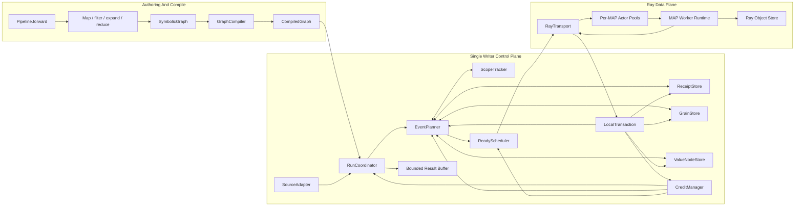
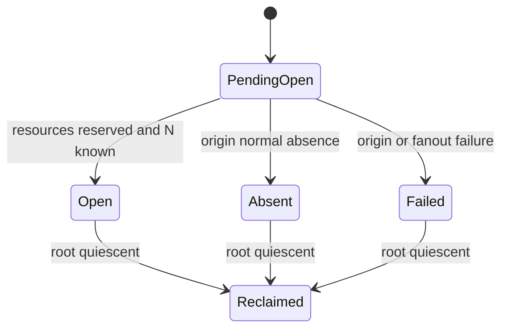
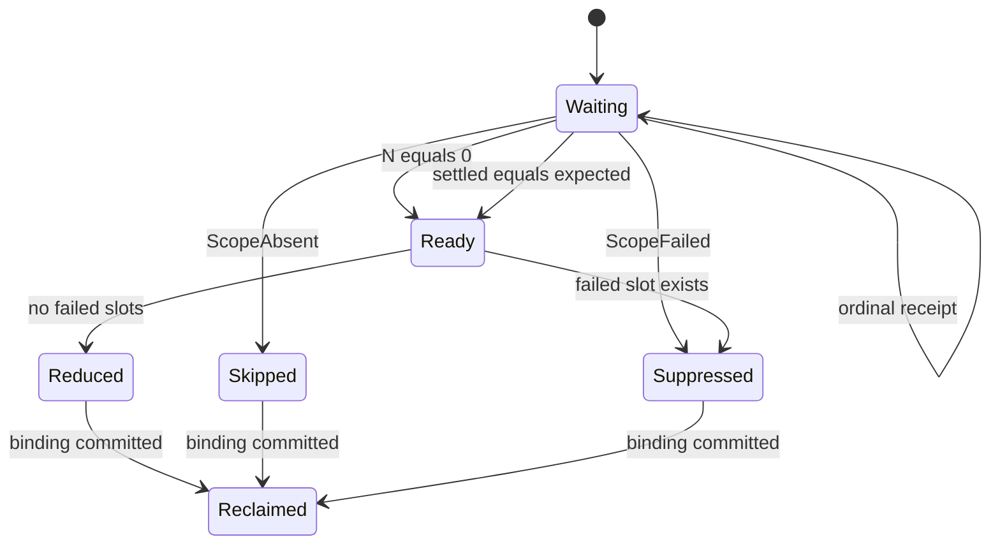
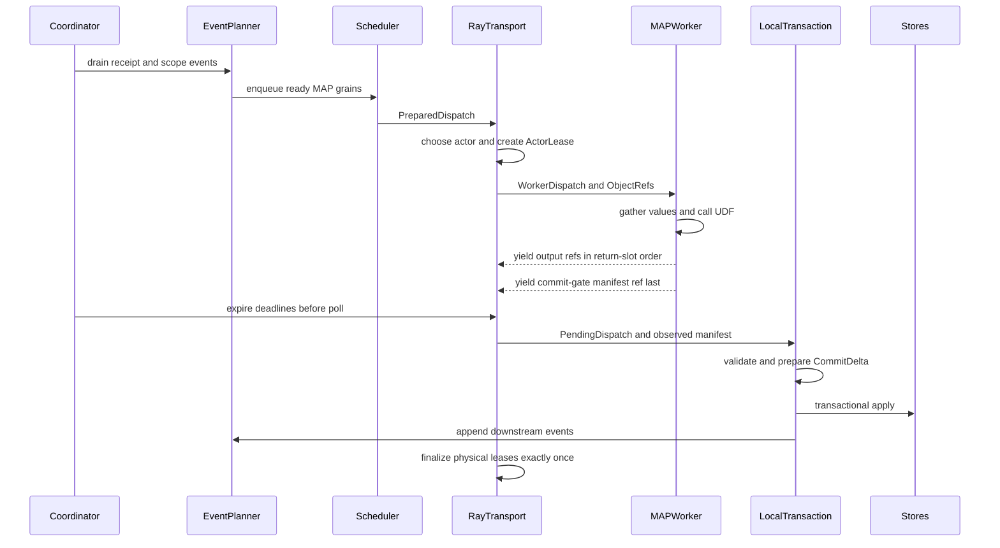

# Multigrain V3 架构设计

> 状态：Draft v0.3  
> 日期：2026-08-03  
> 适用范围：Multigrain V3 首版语义与 Ray 执行后端  
> 兼容性：不兼容 V2.5 的公开 API、内部 DTO 或 identity 编码

## 0. 文档约定

本文是实现规范草案，不是概念备忘录。

- **必须/不得**：首版 correctness contract；
- **应该**：有明确理由的默认实现，可在评审后调整；
- **可以**：不改变语义的实现选择；
- **实验项**：只有 benchmark 后才能决定的优化，不得影响 correctness。

本文已经冻结的核心决策：

```text
D-001  只有 MAP 执行用户 UDF。
D-002  FILTER、EXPAND、REDUCE 是中央控制平面执行的系统函数。
D-003  EXPAND 一次只展开一层；REDUCE 一次只关闭一层。
D-004  scope 严格按每条 dataflow path 做 LIFO，不存在全局可变 scope stack。
D-005  REDUCE 只接受一个 Port，不是任意 group-by。
D-006  RELATE 被删除。
D-007  中间业务 payload 不在 Driver 中反序列化。
D-008  逻辑 identity 与 batch、actor、attempt、ObjectRef 和完成顺序无关。
D-009  FILTER false 是 NORMAL_ABSENCE，不是 failure。
D-010  已知 fanout 后，REDUCE 必须等待全部 obligations terminal，不做 partial reduce。
D-011  首版只有一个有界、惰性读取的 source stream。
D-012  一个 ExecutorSession 绑定一个 CompiledGraph，可跨顺序执行的多次 run 复用 MAP actor pools；
       首版同一 session 同时只允许一个 active run。
D-013  最终 graph outputs 首版必须回到 root scope。
D-014  MAP 的 input roles、call schema、output arity/name/shape 全部由 UDF.run 签名和类型注解推断；
       用户不得手工声明输入或输出端口。
```


## 1. 问题定义

Multigrain V3 面向具有动态 fan-out/fan-in 的批处理流水线，例如：

```text
Document
-> render pages
-> page OCR
-> collect page results
-> assemble document
```

它需要同时满足：

1. 不同 documents/pages 可以动态重组 batch，提高 GPU/CPU 利用率；
2. retry、actor replacement 和 batch isolation 不改变逻辑身份；
3. 一个坏 document/page 只影响其因果 root；
4. FILTER 后即使没有 payload，也能精确判断 REDUCE 何时闭合；
5. 嵌套 pages/regions 等多层 fan-out/fan-in 保留正确顺序；
6. 大 payload 通过 Ray ObjectRefs 在 workers 之间传递，不经过 Driver；
7. 运行时 metadata、ObjectRefs 和结果缓冲都有明确生命周期。


## 2. 核心代数


### 2.1 MAP

MAP 是唯一执行用户代码的原语。

```text
MAP: aligned input columns -> one or more annotated return columns
```

每个 MAP logical invocation 对 return schema 的每个 leaf 恰好产生一个逻辑 output coordinate。该 value
可以是 scalar，也可以是显式声明的 structural list。

### 2.2 FILTER

FILTER 是系统 presence 变换：

```text
FILTER: Bool × T -> T | NORMAL_ABSENCE
```

predicate 本身由 MAP 计算。FILTER 不执行用户代码，不复制 target payload。

### 2.3 EXPAND

EXPAND 是系统 list/scope 变换：

```text
EXPAND: List[T] -> T*
```

它只解开最外层 list，为每个 element 创建 child occurrence，并打开一个动态 scope instance。

### 2.4 REDUCE

REDUCE 是系统 scope/list 变换：

```text
REDUCE: Scoped[T*] -> List[T]
```

它只关闭输入 Port 的栈顶 scope，按 ordinal 收集 PRESENT members，跳过 NORMAL_ABSENCE。

### 2.5 嵌套保持

REDUCE 不隐式 concat：

```text
inner0 = [c0, c2]
inner1 = [c4]

outer reduce = [[c0, c2], [c4]]
```

若用户需要 `[c0, c2, c4]`，必须显式调用后续 MAP 执行 concat。

## 3. 总体架构




唯一语义写入者不是某个特定 class，而是 RunCoordinator 所在的单线程 event-loop。Planner、
ScopeTracker、stores 和 transaction 都只能在该线程中被调用。Ray callbacks 只能把 completion
事件放入队列，不能直接修改语义状态。

## 4. 精确的数据边界

“payload 不经过 Driver”的准确含义：

> 运行主循环不得 `ray.get` 或反序列化中间非控制 payload。

允许的例外：

1. SourceAdapter 接收调用方提供的 Python source records；
2. compiler 显式标记的有界 control projection，例如 FILTER bool bitset；
3. 调用方显式触发最终 `DetachedValue.get()`。

Ray ObjectRef handles、BlockId 和 selectors 可以经过 Driver；ObjectRef 指向的中间业务 values 不得
在 Driver 中 materialize。

## 5. 用户 API


### 5.1 单 source

首版 `Pipeline.forward` 必须恰好有一个 source 参数。多字段输入封装在一个 source record 中：

```python
class Pipeline(Generic[S]):
    def forward(
        self,
        source: "SymbolicPort[S]",
    ) -> dict[str, "SymbolicPort[Any]"]:
        raise NotImplementedError
```

compiler 接受一个 `POSITIONAL_ONLY` 或 `POSITIONAL_OR_KEYWORD` source 参数，但拒绝 default、
varargs、keyword-only 参数和 `**kwargs`。forward 必须返回至少含一个元素的普通 `dict`；
compiler 按 `dict.items()` snapshot 冻结顺序。key 成为最终输出名，必须唯一且合法；value 必须是
root-scope SymbolicPort。

### 5.2 Map 声明

V3 参考 `rayorch/ray_module.py` 的 `RunOp + ParamSpec` 设计：

```python
INITP = ParamSpec("INITP")
RUNP = ParamSpec("RUNP")
R = TypeVar("R")


class RunOp(Protocol[INITP, RUNP, R]):
    def __init__(self, *args: INITP.args, **kwargs: INITP.kwargs) -> None: ...
    def run(self, *args: RUNP.args, **kwargs: RUNP.kwargs) -> R: ...


class Map(Generic[INITP, RUNP, R]):
    def __init__(
        self,
        op_cls: type[RunOp[INITP, RUNP, R]],
        *,
        replicas: int = 1,
        batch_size: int = 1,
        max_batch_wait_ms: float = 2.0,
        num_cpus: float = 1.0,
        num_gpus: float = 0.0,
        failure_policy: FailurePolicy = FailurePolicy.raise_(),
    ) -> None: ...

    def pre_init(
        self,
        *args: INITP.args,
        **kwargs: INITP.kwargs,
    ) -> "Map[INITP, RUNP, R]": ...

    def __call__(
        self,
        *args: RUNP.args,
        **kwargs: RUNP.kwargs,
    ) -> Any: ...
```

用户只提供 UDF class 和执行配置：

```python
self.render = (
    Map(
        MinerUPdfToPages,
        replicas=render_replicas,
        batch_size=1,
        num_cpus=1,
    )
    .pre_init(dpi=200)
)
```

与当前 RayModule 不同，V3 的 `pre_init()` 只冻结 constructor recipe，不在 authoring/compile 阶段
创建 actor。ExecutorSession 启动时才为每个 MAP node 实例化 replicas。

配置对象 immutable；`pre_init()` 和可选 `with_options()` 返回新 Map spec，不原地修改。

`ParamSpec` 可以保留 input call-site 类型检查，但标准 Python typing 无法通用表达“把任意 UDF return
中的 batch columns 映射成 Port leaves”。因此 `Map.__call__` 首版静态返回 `Any`，single/tuple/
NamedTuple 的结构镜像是 runtime authoring contract。若以后需要精确 IDE 类型，必须使用 stub 生成器
或 type-checker plugin，不能伪造 `SymbolicReturn[R]` 泛型。

### 5.3 从 `run()` 推断输入

compiler 使用：

```python
raw_run = inspect.getattr_static(op_cls, "run")
# reject staticmethod/classmethod and require one instance receiver
run_fn = unwrap_supported_instance_method(raw_run)
signature = signature_without_receiver(inspect.signature(run_fn))
hints = typing.get_type_hints(
    run_fn,
    globalns=vars(sys.modules[op_cls.__module__]),
    localns=dict(vars(op_cls)),
    include_extras=True,
)
bound = signature.bind(*symbolic_args, **symbolic_kwargs)
```

`self` 被移除后，每个 parameter 自动成为一个 input role：

```python
class Assemble:
    def run(
        self,
        pdfs: list[Pdf],
        contents: list[list[Content]],
        pages: list[list[Page]],
    ) -> list[Document]:
        ...
```

自动推断：

```text
role 0: pdfs     item type Pdf
role 1: contents item type structural List[Content]
role 2: pages    item type structural List[Page]
```

规则：

- 每个数据参数 annotation 必须是 `list[T]`，最外层 list 表示物理 batch column；
- parameter name、order 和 `inspect.Parameter.kind` 冻结到 CallSchema；
- 调用 Map 时遵循普通 Python binding，可以使用 UDF signature 允许的位置参数/关键字参数；
- `*args`、`**kwargs`、缺失 annotation 和无法解析的 forward reference 首版编译失败；
- run parameter default 首版不参与数据流；所有非 `self` parameters 都必须绑定 SymbolicPort；
- constructor/config 参数必须放在 `__init__` 并通过 `pre_init()` 提供；
- compiler 校验 Port 的 item shape/type 与 annotation 去掉最外层 batch list 后兼容。

`@staticmethod`、`@classmethod`、缺少实例 receiver 的 `run` 首版拒绝。`pre_init()` 还必须执行：

```python
inspect.signature(op_cls).bind(*init_args, **init_kwargs)
```

constructor binding 错误在 authoring/compile 阶段报告，不推迟到 actor 创建。

Worker 根据 CallSchema 重建 positional args 和 keyword args，再调用：

```python
self.op.run(*args_columns, **kwargs_columns)
```

不会强制把所有参数改成 kwargs，也不会让用户重复声明输入端口描述。

### 5.4 从 return annotation 推断输出

V3 不采用 `ray_module.py::_infer_num_outputs()` 的静默 fallback。return annotation 缺失、无法解析或
不满足 batch ABI 时必须 CompileError。

#### 单输出

```python
def run(self, pages: list[Page]) -> list[Content]:
    ...
```

最外层 `list` 是 batch column；每个 grain 的 output type 是 `Content`。symbolic 调用直接返回一个
Port：

```python
contents = self.ocr(pages)
```


#### 匿名 tuple 多输出

```python
def run(
    self,
    inputs: list[Input],
) -> tuple[list[Out1], list[Out2]]:
    ...
```

symbolic 返回结构镜像 annotation：

```python
out1, out2 = self.operator(inputs)
```


#### NamedTuple 多输出

```python
class DetectOutputs(NamedTuple):
    boxes: list[Boxes]
    scores: list[Scores]


def run(self, images: list[Image]) -> DetectOutputs:
    ...
```

symbolic 结果仍是相同 NamedTuple shape，但 leaves 替换为 Ports：

```python
outputs = self.detect(images)
boxes = outputs.boxes
scores = outputs.scores
```

普通 dataclass、dict 和动态长度 tuple 首版不作为多输出协议。

内部 Port names：

```text
single      "output"
tuple       "output_0", "output_1", ...
NamedTuple  field names
```

这些名字由 compiler 生成，不要求用户在 Map constructor 重复声明。

### 5.5 从 item annotation 推断 ValueShape

对每个输入/输出 column 去掉最外层 batch `list[...]` 后：

```text
bool                       -> BoolShape
list[E]                    -> StructuralListShape(element=OpaqueShape(E))
Annotated[list[E], OpaqueValue] -> OpaqueShape(list[E])
其他 T                     -> OpaqueShape(type_ref=T)
```

因此：

```python
def run(self, pdfs: list[Pdf]) -> list[list[Page]]:
    ...
```

自动推断为单个 `Port[List[Page]]`，可以传给 `expand()`。

如果一个 grain 的业务 payload 本身是 Python list，但不应被 EXPAND，使用显式 annotation marker，
而不是构造 Map 时声明 output port：

```python
def run(
    self,
    inputs: list[Input],
) -> list[Annotated[list[Token], OpaqueValue]]:
    ...
```

compiler 使用 `get_type_hints(..., include_extras=True)` 保留 `Annotated` metadata。

MAP parser 只把每个 grain value 的最外层 list 解释成 structural list。其 element 无论 Python 类型
是什么，先作为一个 item：

```python
def run(...) -> list[list[list[T]]]:
    ...
```

解释为：

```text
outer list   physical batch
middle list  one structural list layer
inner list   item type，暂时 opaque
```

Worker 只 flatten middle list，并让 output block 的每一 row 保存一个 `list[T]` item。第一次
`expand()` 合法，结果是 `Port[opaque list[T]]`；由于没有第二层 offsets/layout metadata，不能直接再
`expand()`。如果用户确实要展开 inner list，可以把这些 items 送入后续 MAP，由该 MAP 再把
`list[T]` 作为每个 grain 的最外层 output list 返回，然后调用下一次 EXPAND。

因此首版限制是：

> 一个 MAP return leaf 只暴露一层 structural layout metadata。

而不是禁止 Python return annotation 出现多层 list。REDUCE 产生的 CompositeListNode 仍可显式保存
多层 structural shape，因为每层 scope metadata 已由系统掌握。

### 5.6 Canonical annotation grammar

严格推断只支持可以稳定编码的有限类型语法：

```text
Any
importable concrete class
bool
list[T]
dict[K,V] / tuple[...] / set[T] / frozenset[T]  作为 opaque generic
Annotated[list[T], OpaqueValue]
```

规则：

- `Any` 生成 `OpaqueShape(type_ref=None)`，是唯一 compile-time wildcard；
- importable class 使用 `(module, qualname)` 生成 TypeRef；
- 参数化 builtins 递归编码 type arguments，但整体仍是 opaque payload；
- 去掉 batch list 后，只把最外层未标记的 `list[T]` 解释为 structural；其中 T 作为一个 opaque
item type 做 canonical encoding，即使 T 本身仍是 list；
- `OpaqueValue` 首版只允许标记 list；
- TypeVar、Protocol、Callable、Literal、任意 Union、局部 `<locals>` class 和非规范 third-party
generic 首版拒绝；
- Port/UDF item shape compatibility 使用 exact recursive match，`Any` 可以匹配任意 opaque leaf；
- Worker 只严格校验 batch/list/bool 和安全可 `isinstance` 的 outer concrete type，不深度遍历任意
opaque payload。

```python
@dataclass(frozen=True)
class TypeRef:
    module: str
    qualname: str
    args: tuple["TypeRef", ...] = ()
```

`TypeRef`、`OpaqueValue` marker 和 annotation parser 的 canonical records 位于
`model.graph`；`api.py` 只 re-export 用户需要的 marker。

### 5.7 UDF 合同

UDF class 必须：

- 存在 callable `run`；
- UDF class 可由稳定 module/qualname 定位，不是 local class 或动态 closure；
- input 和 return annotations 完整且可解析；
- return runtime structure 与 annotation 精确一致；
- 每个 output batch column 长度等于 dispatch grain count；
- 不依赖 actor 调用历史、batch peers 或 retry generation。

以下情况编译失败：

```text
MissingUdfRun
MissingRunParameterAnnotation
MissingRunReturnAnnotation
UnsupportedRunParameter
UnsupportedBatchColumnAnnotation
UnsupportedItemAnnotation
NonCanonicalTypeRef
UnsupportedReturnStructure
UnresolvableTypeHints
UnsupportedRunDescriptor
InvalidConstructorBinding
```


### 5.8 系统函数

```python
def filter(
    mask: "BoolPort",
    target: "SymbolicPort[T]",
    /,
) -> "SymbolicPort[T]": ...


def expand(
    group: "ListPort[T]",
    /,
) -> "SymbolicPort[T]": ...


def reduce(
    items: "ScopedPort[T]",
    /,
) -> "ListPort[T]": ...
```

`BoolPort`、`ListPort`、`ScopedPort` 是文档中的类型别名/typing Protocol；运行时对象统一是
SymbolicPort。filter/expand/reduce 在 trace 时分别校验 BoolShape、StructuralListShape 和非空
scope_path，不建立三套 Port class hierarchy。

多 target filter 不是核心原语。若保留 convenience API：

```python
filter_many(mask, page=pages, content=contents)
```

compiler 必须在 ID 分配前将其 lowering 成多个独立 FILTER nodes。

### 5.9 MinerU 示例

```python
class MinerUV3Pipeline(Pipeline):
    def __init__(self, ...):
        self.render = Map(
            MinerUPdfToPages,
            ...,
        )
        self.ocr = Map(
            MinerUVlmOcrPage,
            ...,
        )
        self.assemble = Map(
            MinerUAssembleDoc,
            ...,
        )

    def forward(self, pdfs):
        page_groups = self.render(pdfs)
        pages = expand(page_groups)
        contents = self.ocr(pages)
        content_groups = reduce(contents)
        document = self.assemble(
            pdfs=pdfs,
            contents=content_groups,
            pages=page_groups,
        )
        return {"document": document}
```

静态 scope path：

```text
pdfs            ()
page_groups     ()
pages           (PagesScope,)
contents        (PagesScope,)
content_groups  ()
document        ()
```


### 5.10 嵌套示例

```python
def forward(self, documents):
    page_groups = self.render(documents)
    pages = expand(page_groups)

    region_groups = self.detect_regions(pages)
    regions = expand(region_groups)
    region_text = self.ocr_region(regions)

    page_region_texts = reduce(region_text)
    page_text = self.assemble_page(
        pages=pages,
        texts=page_region_texts,
    )

    document_page_texts = reduce(page_text)
    document = self.assemble_document(
        documents=documents,
        texts=document_page_texts,
    )
    return {"document": document}
```

严格 LIFO 是 path-local：

- `region_text` 的 path 是 `(PagesScope, RegionsScope)`，只能先关闭 RegionsScope；
- 另一个没有进入 RegionsScope 的 page branch 仍可直接关闭 PagesScope；
- 一个 REDUCE 不会“消费”全局 scope；同 scope 可以有多个独立 REDUCE nodes。


## 6. Symbolic IR 与 frozen graph


### 6.1 SymbolicPort

annotation parser 生成内部 shape，不要求用户构造：

```python
@dataclass(frozen=True)
class OpaqueShape:
    type_ref: TypeRef | None


@dataclass(frozen=True)
class BoolShape:
    pass


@dataclass(frozen=True)
class StructuralListShape:
    element: "ValueShape"


ValueShape = OpaqueShape | BoolShape | StructuralListShape
```

trace 时的对象不能冒充 frozen PortSpec：

```python
@dataclass(frozen=True, slots=True)
class SymbolicPort:
    trace_owner: TraceOwnerId
    symbolic_key: int
    shape: ValueShape
    symbolic_scope_path: tuple[SymbolicScopeId, ...]
    occurrence_domain: SymbolicDomainId
```

SymbolicPort 构造器不公开。所有 Map/system calls 必须验证：

- 当前 active trace 存在；
- Port 属于当前 trace owner；
- Port 没有被当作 bool、iterator 或普通 Python value 使用。


### 6.2 Frozen records

ID 分配和 scope inference 完成后才生成：

```python
@dataclass(frozen=True, slots=True)
class PortSpec:
    id: PortId
    name: str
    producer: NodeId
    shape: ValueShape
    scope_path: tuple[ScopeDefId, ...]
    occurrence_domain: OccurrenceDomainId


@dataclass(frozen=True, slots=True)
class GraphOutputSpec:
    name: str
    port: PortId
```


### 6.3 Node op union

避免 nullable `udf/execution` 组合：

```python
class ParameterKind(Enum):
    POSITIONAL_ONLY = "positional_only"
    POSITIONAL_OR_KEYWORD = "positional_or_keyword"
    KEYWORD_ONLY = "keyword_only"


@dataclass(frozen=True, slots=True)
class ParameterSpec:
    name: str
    index: int
    kind: ParameterKind
    item_shape: ValueShape


@dataclass(frozen=True, slots=True)
class InputBinding:
    role: str
    port: PortId
    parameter: ParameterSpec


@dataclass(frozen=True, slots=True)
class SerializableCallableRef:
    module: str
    qualname: str


@dataclass(frozen=True, slots=True)
class BatchPolicy:
    max_size: int
    max_wait_ms: float


@dataclass(frozen=True, slots=True)
class ResourceSpec:
    replicas: int
    num_cpus: float
    num_gpus: float
    runtime_env: tuple[tuple[str, object], ...]


@dataclass(frozen=True, slots=True)
class FailurePolicy:
    mode: str
    infra_retries: int
    isolation_work_budget: int


@dataclass(frozen=True, slots=True)
class CallSchema:
    parameters: tuple[ParameterSpec, ...]
    positional_count: int
    keyword_roles: tuple[str, ...]


class ReturnKind(Enum):
    SINGLE = "single"
    TUPLE = "tuple"
    NAMED_TUPLE = "named_tuple"


@dataclass(frozen=True, slots=True)
class ReturnLeafSpec:
    slot: int
    name: str | None
    item_shape: ValueShape


@dataclass(frozen=True, slots=True)
class ReturnSchema:
    kind: ReturnKind
    leaves: tuple[ReturnLeafSpec, ...]
    named_tuple_type: TypeRef | None


@dataclass(frozen=True, slots=True)
class UdfRecipe:
    factory: SerializableCallableRef
    init_args: tuple[object, ...]
    init_kwargs: tuple[tuple[str, object], ...]


@dataclass(frozen=True, slots=True)
class ExecutionSpec:
    batch: BatchPolicy
    resources: ResourceSpec
    failures: FailurePolicy


@dataclass(frozen=True, slots=True)
class PhysicalOutputSpec:
    port: PortId
    return_slot: int
    shape: ValueShape
    emit_control_bits: bool


@dataclass(frozen=True, slots=True)
class SourceOp:
    pass


@dataclass(frozen=True, slots=True)
class MapOp:
    udf: UdfRecipe
    call_schema: CallSchema
    return_schema: ReturnSchema
    execution: ExecutionSpec
    physical_outputs: tuple[PhysicalOutputSpec, ...]


@dataclass(frozen=True, slots=True)
class FilterOp:
    mask: PortId
    target: PortId


@dataclass(frozen=True, slots=True)
class ExpandOp:
    input: PortId
    scope: ScopeDefId


@dataclass(frozen=True, slots=True)
class ReduceOp:
    input: PortId
    closes_scope: ScopeDefId


NodeOp = SourceOp | MapOp | FilterOp | ExpandOp | ReduceOp
```

parser 在 freeze 前把 `inspect.Parameter.kind` 映射为项目自有 ParameterKind；不得把 CPython 私有
`inspect._ParameterKind` 写入 DTO 或 fingerprint。

```python
@dataclass(frozen=True, slots=True)
class NodeSpec:
    id: NodeId
    name: str
    op: NodeOp
    inputs: tuple[InputBinding, ...]
    outputs: tuple[PortSpec, ...]
```

`NodeSpec.inputs` 保存当前 symbolic call 绑定到哪些 Ports；`MapOp.call_schema` 保存如何重建
`run(*args, **kwargs)`。二者必须逐 parameter 一一对应。
`PhysicalOutputSpec` 与 logical outputs 首版严格一一对应：

```text
P = len(return_schema.leaves)
P == len(NodeSpec.outputs) == len(physical_outputs) > 0
return_schema.leaves[j].slot == j
return_schema.leaves[j].item_shape == NodeSpec.outputs[j].shape
return_schema.leaves[j].item_shape == physical_outputs[j].shape
physical_outputs[j].port == NodeSpec.outputs[j].id
physical_outputs[j].return_slot == j
emit_control_bits => shape is BoolShape
emit_control_bits == compiler detects at least one FILTER consumer

ReturnKind.SINGLE      => P == 1 and leaf name is None
ReturnKind.TUPLE       => all leaf names are None
ReturnKind.NAMED_TUPLE => names/type match canonical NamedTuple fields
```


### 6.4 CompiledGraph

```python
@dataclass(frozen=True, slots=True)
class ScopePlan:
    definition: ScopeDefId
    expand_node: NodeId
    reducers: tuple[NodeId, ...]


@dataclass(frozen=True, slots=True)
class CompiledGraph:
    fingerprint: GraphFingerprint
    source: PortId
    nodes: tuple[NodeSpec, ...]
    outputs: tuple[GraphOutputSpec, ...]
    producer_by_port: Mapping[PortId, NodeId]
    consumers_by_port: Mapping[PortId, tuple[NodeId, ...]]
    scope_plans: Mapping[ScopeDefId, ScopePlan]
```


### 6.5 Compiler passes

顺序必须冻结：

1. `validate_pipeline_signature`：恰好一个 source 参数；
2. `trace_symbolic_graph`：建立 trace-owner 隔离；每个 MAP 首次调用时严格解析并缓存 UDF contract；
3. `normalize_public_calls`：用 `Signature.bind` 冻结 call schema、lower convenience calls、规范 outputs；
4. `prune_to_graph_outputs`：从最终 outputs 反向可达，删除无用 nodes/ports/scopes；
5. `validate_references_and_toposort`：foreign/dangling Port、DAG、producer uniqueness；
6. `assign_stable_ids`：NodeId、PortId、ScopeDefId；
7. `infer_shapes_and_control_types`：opaque/list/bool；
8. `infer_scope_and_occurrence_domains`：逐 edge 推导，不使用全局 stack；
9. `validate_alignment_and_lifo`；
10. `build_scope_plans`：建立 scope lifecycle 到所有 REDUCE 的路由；
11. `build_physical_output_schema`：return slots、control bit encoding；
12. `validate_graph_outputs`：至少一个输出、名称唯一且 scope path 为空；
13. `validate_udf_recipes`：signature、serialization、resources；
14. `freeze_fingerprint`；
15. `verify_frozen_graph`：从 frozen records 独立重算不变量。


### 6.6 Compile-time errors

至少包括：

```text
InvalidForwardSignature
MultipleSourcesNotSupported
InvalidPipelineReturn
UnclosedOutputScope
PortUsedOutsideTrace
ForeignPort
SymbolicPortTruthValue
SymbolicPortIteration
InvalidMapCall
MissingUdfRun
MissingRunParameterAnnotation
MissingRunReturnAnnotation
UnsupportedRunParameter
UnsupportedBatchColumnAnnotation
UnsupportedReturnStructure
UnresolvableTypeHints
DuplicateGraphOutputName
NoMapOutputs
NoGraphOutputs
ExpandRequiresStructuralList
FilterMaskNotBool
ScopePathMismatch
OccurrenceDomainMismatch
ReduceAtRootScope
NonLifoReduce
DanglingPort
GraphCycle
UnserializableUdfRecipe
InvalidResourceSpec
```


## 7. Identity、coordinate 与 occurrence


### 7.1 ID 宽度

首版：

- GraphFingerprint 使用 256-bit BLAKE2b；
- RunId 使用随机 128-bit；
- RootId、EntityId、GrainId、ScopeInstanceId 使用 domain-separated 128-bit BLAKE2b；
- run 内部可以使用紧凑整数 handle；
- 发现同 digest 对应不同 canonical preimage 时必须作为 fatal invariant violation。

不得使用 Python `hash()`、`repr()` 或未规范化 dict 顺序。

### 7.2 ID 类型

```text
GraphFingerprint
RunId
RootId
NodeId
PortId
EntityId
GrainId
ScopeDefId
ScopeInstanceId
OccurrenceDomainId
DispatchId
LeaseId
StructuralLeaseId
CreditReservationId
ActorId
ErrorId
ValueNodeId
BlockId
```


### 7.3 ItemRef 是 coordinate，不保证有 value

```python
@dataclass(frozen=True, slots=True)
class ItemRef:
    port: PortId
    entity: EntityId
```

ItemRef 表示逻辑 output coordinate。它可能对应：

- PRESENT value；
- NORMAL_ABSENCE；
- FAILED；
- SUPPRESSED。

因此 ItemRef 不能与“已 emission 的 value”同义。

### 7.4 动态 scope position 栈

嵌套 scope 必须同时保存每一层 instance 和 ordinal：

```python
@dataclass(frozen=True, slots=True)
class ScopePosition:
    instance: ScopeInstanceId
    ordinal: int


@dataclass(frozen=True, slots=True)
class OccurrenceContext:
    root: RootId
    positions: tuple[ScopePosition, ...]
```

不变量：

```text
len(context.positions) == len(port.scope_path)

tuple(scope_store.get(position.instance).definition
      for position in context.positions)
== port.scope_path
```

规则：

```text
SOURCE      positions=()
MAP/FILTER  positions 不变
EXPAND k    append(scope_instance, k)
REDUCE      pop 最后一对
```

这保证 inner REDUCE 后能恢复 outer ordinal。

### 7.5 EntityId

概念公式：

```text
source entity = H("source-entity", run, source_seq)
MAP entity    = common input entity
FILTER entity = target entity
EXPAND entity = H("expand-entity", run, node, parent ItemRef, ordinal)
REDUCE entity = scope parent ItemRef.entity
```

EntityId 不可反解。任何 scope/parent/ordinal 信息必须来自显式 records。

### 7.6 GrainId

```text
SOURCE = H("source-grain", run, source_node, source_seq)
MAP    = H("map-grain", run, node, ordered expected input ItemRefs)
FILTER = H("filter-grain", run, node, mask ItemRef, target ItemRef)
EXPAND = H("expand-grain", run, node, parent ItemRef)
REDUCE = H("reduce-grain", run, node, ScopeInstanceId)
```

receipt state、value、fanout N、survivors、batch、attempt、actor 和完成顺序不得进入 GrainId。

## 8. Receipt、Grain 与权威事实


### 8.1 Receipt

```python
class ReceiptState(Enum):
    PRESENT = "present"
    NORMAL_ABSENCE = "normal_absence"
    FAILED = "failed"
    SUPPRESSED = "suppressed"


@dataclass(frozen=True, slots=True)
class Receipt:
    item: ItemRef
    context: OccurrenceContext
    state: ReceiptState
    producer: GrainId
```

所有 terminal Receipt 的 producer 必须非空。

```text
PRESENT         ValueNodeStore 必须有 item binding
NORMAL_ABSENCE  不得有 item binding
FAILED          producer GrainOutcome 必须是 Failed
SUPPRESSED      producer GrainOutcome 必须是 Suppressed
```

Receipt 不重复编码 failure cause。具体 ErrorId/direct causes 统一从 producer GrainOutcome 读取；
ClosureView 的 direct causes 是失败 slots 的 `receipt.producer`。

### 8.2 ReceiptStore

```python
class ReceiptStore:
    _receipts: dict[ItemRef, Receipt]
    _by_root: dict[RootId, set[ItemRef]]

    def publish_once(self, receipt: Receipt) -> bool: ...
    def get(self, item: ItemRef) -> Receipt | None: ...
    def remove_root(self, root: RootId) -> None: ...
```

规则：

- exact duplicate publish 是幂等 no-op；
- 同 ItemRef 的 state、producer 或 context 不同，立即 abort run；
- PRESENT receipt 必须在对应 item binding 安装后发布；
- 非 PRESENT receipt 必须在确认该 item 不存在 binding 后发布；
- receipt publish 只 append downstream events，不同步重入 Planner。


### 8.3 GrainSpec

```python
@dataclass(frozen=True, slots=True)
class RoleBinding:
    role: str
    items: tuple[ItemRef, ...]


@dataclass(frozen=True, slots=True)
class ExpandOutputRange:
    port: PortId
    parent: ItemRef
    count: int


OutputSlotSpec = tuple[ItemRef, ...] | ExpandOutputRange


@dataclass(frozen=True, slots=True)
class GrainSpec:
    id: GrainId
    run: RunId
    root: RootId
    node: NodeId
    context: OccurrenceContext
    inputs: tuple[RoleBinding, ...]
    output_slots: OutputSlotSpec
    reduce_binding: "ReduceBinding | None" = None
```

`output_slots` 是逻辑 coordinates，不代表 PRESENT emissions。SOURCE/MAP/FILTER/REDUCE 使用固定
tuple；EXPAND 使用 compact deterministic range，避免为 N 个 children 在 GrainSpec 中再复制一份
ItemRef tuple。

### 8.4 GrainOutcome

```python
@dataclass(frozen=True, slots=True)
class Success:
    pass


@dataclass(frozen=True, slots=True)
class Skipped:
    reasons: tuple[ItemRef, ...]


@dataclass(frozen=True, slots=True)
class Failed:
    error: ErrorId


@dataclass(frozen=True, slots=True)
class Suppressed:
    causes: tuple[GrainId, ...]


GrainOutcome = Success | Skipped | Failed | Suppressed
```

- FILTER false：grain Success，output receipt NORMAL_ABSENCE；
- MAP 任意 inputs absence 且无 failure：grain Skipped，按 compiled role order 保存全部 absent inputs；
- FILTER 任一 input absence 且无 failure：grain Skipped，保存 absent mask/target inputs；
- UDF/data error：grain Failed，outputs FAILED；
- upstream failure：grain Suppressed，outputs SUPPRESSED。

`Suppressed.causes` 必须：

- 全部属于同一 root；
- 指向已 terminal 的直接 predecessor grains；
- canonical 去重并按 compiled role/ordinal 顺序排列；
- 不形成 cause cycle。


### 8.5 ErrorStore 与 failure summary

```python
@dataclass(frozen=True, slots=True)
class ErrorRecord:
    id: ErrorId
    root: RootId
    grain: GrainId
    kind: str
    message: str
    trace_digest: bytes | None


class ErrorStore:
    errors: dict[ErrorId, ErrorRecord]
    by_root: dict[RootId, set[ErrorId]]

    def put(self, record: ErrorRecord) -> None: ...
    def get(self, error: ErrorId) -> ErrorRecord: ...
    def summarize_root(self, root: RootId) -> "SemanticFailureSummary": ...
    def remove_root(self, root: RootId) -> None: ...
```

```python
FailureSummary = SemanticFailureSummary | DeliveryFailureSummary
```

- SemanticFailureSummary 从 GrainOutcome cause DAG 和 ErrorStore materialize；
- DeliveryFailureSummary 表示 ResultTooLarge 等不回写 graph Receipt 的交付失败；
- 删除 GrainOutcomes/ErrorRecords 前必须先生成独立 summary；
- summary 不得引用 live GrainStore/ErrorStore。


### 8.6 Grain phase

```python
class GrainPhase(Enum):
    READY = "ready"
    IN_FLIGHT = "in_flight"
    TERMINAL = "terminal"


@dataclass(slots=True)
class GrainState:
    spec: GrainSpec
    phase: GrainPhase
    generation: int
    active_attempt: AttemptToken | None
    outcome: GrainOutcome | None
```

只有 executable MAP grain 进入 READY/IN_FLIGHT。

- absence-forwarded MAP 直接创建 terminal Skipped grain；
- FILTER/EXPAND 由中央创建并直接 terminal；
- REDUCE 等待状态属于 ClosureView，closure terminal 后才创建 REDUCE grain。

EXPAND 是唯一允许“terminal outcome 已冻结、per-child Receipt 仍在 bounded materialization queue”
的节点。其 Success 必须先拥有完整 `ExpandOutputRange` 和 StructuralEdgeLease；之后的 chunking 只
展开已确定 coordinates，不再改变 outcome。root 在 PendingExpansion 清空前不可 quiescent。

### 8.7 AttemptToken

```python
@dataclass(frozen=True, slots=True)
class AttemptToken:
    run: RunId
    grain: GrainId
    generation: int
```

每次 MAP reservation 先递增 generation，再安装 exact active token。retry 返回 READY，但不得复用
旧 token。

### 8.8 coordinate cardinality 与 PRESENT cardinality

```text
SOURCE
  output coordinates: 1
  PRESENT values:     0 or 1

MAP
  output coordinates per return leaf: 1
  PRESENT values:                    0 or 1

FILTER
  output coordinates: 1
  PRESENT values:     0 or 1

EXPAND
  Success: coordinates=N, PRESENT=N
  Skipped/Suppressed/Failed: coordinates=0, PRESENT=0
  负终态通过 ScopeAbsent/ScopeFailed 关闭 downstream REDUCE

REDUCE
  output coordinates: 1
  PRESENT values:     0 or 1
```

FILTER false 不是“coordinate 不存在”，而是 coordinate terminal 且 NORMAL_ABSENCE。

## 9. 多输入 MAP 与 FILTER 的终态规则


### 9.1 OccurrenceDomain

多输入 MAP/FILTER 的 inputs 必须拥有相同 `OccurrenceDomainId`。该 domain 表示相同 coordinates，
不表示 values 都 PRESENT。每个 input 对每个 coordinate 最终都必须产生一个 Receipt。

### 9.2 对称 MAP 规则

MAP inputs 没有影响 absence/failure 优先级的 driving role。Planner 等待所有 required receipts
terminal，然后：

```python
def resolve_map(receipts):
    if any(receipt is None for receipt in receipts):
        return WAIT
    if any(r.state in {FAILED, SUPPRESSED} for r in receipts):
        return SUPPRESSED
    if any(r.state is NORMAL_ABSENCE for r in receipts):
        return SKIPPED
    return READY
```

failure 优先于 absence，因此结果不依赖 receipt 到达顺序或参数顺序。

### 9.3 FILTER 真值规则

FILTER 等待 mask 和 target 都 terminal：

```python
def resolve_filter(mask, target):
    if mask is None or target is None:
        return WAIT
    if mask.is_failure or target.is_failure:
        return SUPPRESSED
    if mask.is_absent or target.is_absent:
        return NORMAL_ABSENCE
    if control_store.get_bool(mask.item):
        return PRESENT_ALIAS
    return NORMAL_ABSENCE
```


### 9.4 ControlStore

FILTER mask 的 bool value 必须在 manifest 消失后仍可读取：

```python
class ControlStore:
    _bools: dict[ItemRef, bool]
    _remaining_consumers: dict[ItemRef, int]
    _by_root: dict[RootId, set[ItemRef]]

    def install_bool(self, root: RootId, item: ItemRef, value: bool) -> None: ...
    def get_bool(self, item: ItemRef) -> bool: ...
    def release_consumer(self, item: ItemRef) -> None: ...
    def remove_root(self, root: RootId) -> None: ...
```

bool control 必须和 mask PRESENT receipt 在同一 transaction 中安装；所有 FILTER consumers terminal
后才可删除。

bitset wire contract：

```text
logical bits = batch size B
byte length  = ceil(B / 8)
bit i        = DispatchPlan.entries[i]
unused tail bits 必须为 0
每个 value 必须满足 type(value) is bool
```


## 10. Scope lifecycle


### 10.1 ScopeInstance

```python
class ScopeState(Enum):
    PENDING_OPEN = "pending_open"
    OPEN = "open"
    ABSENT = "absent"
    FAILED = "failed"
    RECLAIMED = "reclaimed"


@dataclass(slots=True)
class ScopeInstance:
    id: ScopeInstanceId
    definition: ScopeDefId
    root: RootId
    parent_item: ItemRef
    parent_context: OccurrenceContext
    expected: int | None
    state: ScopeState
    origin_grain: GrainId
    failure: GrainId | None
    structural_lease: StructuralLeaseId | None
```

ScopeInstanceId：

```text
H("scope-instance", run, expand_node, parent ItemRef)
```


### 10.2 ScopeEvent

REDUCE 不能只靠 child receipts 驱动，否则 N=0、origin absence 和 origin failure 会挂死。

```python
@dataclass(frozen=True)
class ScopeOpened:
    scope: ScopeInstanceId
    expected: int


@dataclass(frozen=True)
class ScopeAbsent:
    scope: ScopeInstanceId
    origin: Receipt


@dataclass(frozen=True)
class ScopeFailed:
    scope: ScopeInstanceId
    cause: GrainId


ScopeEvent = ScopeOpened | ScopeAbsent | ScopeFailed
```

`ScopeFailed.cause` 固定为产生该 failure 的 EXPAND grain。每个 ScopeEvent 先通过
ScopeInstanceId 查出 ScopeInstance.definition，再根据
`CompiledGraph.scope_plans[definition].reducers` 路由到所有静态 REDUCE nodes。

```python
class ScopeTracker:
    instances: dict[ScopeInstanceId, ScopeInstance]
    closures: dict[tuple[NodeId, ScopeInstanceId], ClosureView]

    def create_pending(self, ...) -> ScopeInstance: ...
    def open(self, scope, expected, lease) -> ScopeOpened: ...
    def mark_absent(self, scope, origin) -> ScopeAbsent: ...
    def mark_failed(self, scope, cause) -> ScopeFailed: ...
    def ensure_closure(self, reduce_node, scope) -> ClosureView: ...
    def settle(self, reduce_node, receipt) -> bool: ...
    def reclaim_closure(self, reduce_node, scope) -> None: ...
    def reclaim_scope(self, scope) -> None: ...
```


### 10.3 EXPAND lifecycle

```text
input PRESENT ListNode:
  validate outer list shape and fanout
  reserve scope resources
  EXPAND grain Success
  ScopeOpened(expected=N)

input NORMAL_ABSENCE:
  EXPAND grain Skipped
  ScopeAbsent

input FAILED/SUPPRESSED:
  EXPAND grain Suppressed
  ScopeFailed

N > max_scope_width:
  EXPAND grain Failed(FanoutLimitExceeded)
  ScopeFailed
  only this root fails
```


### 10.4 ClosureView

```python
@dataclass(slots=True)
class ClosureView:
    reduce_node: NodeId
    input_port: PortId
    scope: ScopeInstanceId
    expected: int
    settled: int
    slots: "ChunkedReceiptSlots"
    allocation_owner: tuple[ScopeInstanceId, NodeId]

    def settle(self, receipt: Receipt) -> bool: ...
    def present_members(self) -> tuple[ItemRef, ...]: ...
    def direct_causes(self) -> tuple[GrainId, ...]: ...
```

settle 必须验证：

```text
receipt.item.port == input_port
receipt.context.positions[-1].instance == scope
0 <= receipt.context.positions[-1].ordinal < expected
```

幂等规则：

- empty slot + receipt：安装并 settled += 1；
- same receipt：no-op；
- conflicting receipt：abort run。

slot 保存完整 Receipt，不只保存 ItemRef。

### 10.5 Empty/absent/failed closure

```text
ScopeOpened(N=0):
  立即创建 REDUCE Success
  output PRESENT empty CompositeListNode

ScopeAbsent:
  立即创建 REDUCE Skipped
  output NORMAL_ABSENCE

ScopeFailed:
  立即创建 REDUCE Suppressed
  output SUPPRESSED

ScopeOpened(N>0):
  创建 expected=N 的 ClosureView
  等待每个 ordinal terminal
```


### 10.6 已知 N 后的严格闭合

```text
closure ready <=> settled == expected
```

ready 后：

- 任一 slot FAILED/SUPPRESSED：REDUCE Suppressed；
- 否则：按 ordinal 收集 PRESENT，跳过 NORMAL_ABSENCE，生成 ListNode；
- 全部 ABSENT：仍是 PRESENT empty list，不是 NORMAL_ABSENCE。


### 10.7 ReduceBinding

REDUCE 公开 API 只有一个 Port，但内部 lineage 必须保存完整 scope：

```python
@dataclass(frozen=True)
class ReduceBinding:
    scope: ScopeInstanceId
    anchor: ItemRef
    allocation_owner: tuple[ScopeInstanceId, NodeId] | None
    expected: int | None
    present_members: tuple[ItemRef, ...]
    absent_ordinals: "CompressedOrdinalSet"
    direct_failures: tuple[tuple[int, GrainId], ...]
    origin_receipt: Receipt | None
    origin_failure: GrainId | None
```

- 已知 N：`expected=N`，其余字段由 ClosureView slots canonicalize；
- ScopeAbsent：expected=None，保存 origin_receipt；
- ScopeFailed：expected=None，保存 origin_failure；
- known-N、origin_receipt、origin_failure 三种表示互斥；
- 完整 per-slot Receipts 的权威来源仍是 ReceiptStore，不在 GrainSpec 中复制一份。

ReduceBinding 只出现在 REDUCE GrainSpec 的 `reduce_binding` 字段中。

known-N binding 必须满足：

```text
anchor == ScopeInstance.parent_item
absent ordinals 与 failure ordinals 不相交
所有 ordinals 都在 [0, expected)
len(present_members) + len(absent_ordinals) + len(direct_failures) == expected
present_members 对应剩余 ordinals 的升序
```

origin absent/failed 形式下，present/absent/failure collections 必须为空。

closure terminal 时，owner `(scope, reduce_node)` 的 allocation 从 CLOSURE 原子转为 BINDING，
然后释放 slots 对象。Reduce output 的所有 downstream consumers terminal 后可以删除详细
ReduceBinding、调用 `release_binding(scope, reduce_node)`，只保留 failure/source summary；否则最迟
在 root reclamation 由 `release_scope` 清理剩余 allocations。

### 10.8 Scope 回收

```python
def reclaim_closure(
    reduce_node: NodeId,
    scope: ScopeInstanceId,
) -> None: ...


def reclaim_scope(
    scope: ScopeInstanceId,
) -> None: ...
```

一个 closure 完成不得回收同 scope 的其他 closures。首版 scope-wide reclaim 只在 root quiescent
reclamation 中执行。

### 10.9 Scope 状态图

ScopeInstance 和每个 REDUCE ClosureView 是两个独立状态机：







## 11. 嵌套 coordinate 示例

一个 document 的 page ordinal 为 2，该 page 的 region ordinal 为 1：

```text
page context:
  [(PagesScopeInstance, 2)]

region context:
  [(PagesScopeInstance, 2),
   (RegionsScopeInstance, 1)]
```

inner REDUCE 关闭 RegionsScope：

```text
before:
  [(Pages, 2), (Regions, 1)]

after:
  [(Pages, 2)]
```

因此 outer REDUCE 可以正确把 inner result 放入 page ordinal 2。不得从 EntityId 或完成顺序恢复
outer ordinal。


## 12. Value DAG 与 ObjectRef ownership


### 12.1 为什么使用 ValueNode

直接把递归 ValueHandle 复制进多个 ItemRef 会使 alias、nested REDUCE 和多 consumer 的 block
引用计数不明确。V3 使用 session-local acyclic ValueNode DAG。

### 12.2 ValueNode

```python
@dataclass(frozen=True, slots=True)
class ScalarNode:
    block: BlockId
    row: int


@dataclass(frozen=True, slots=True)
class FlatListNode:
    block: BlockId
    start: int
    stop: int


@dataclass(frozen=True, slots=True)
class CompositeListNode:
    children: tuple[ValueNodeId, ...]


ValueNode = ScalarNode | FlatListNode | CompositeListNode
```

- MAP OpaqueShape/BoolShape 生成 ScalarNode；
- MAP StructuralListShape 每 parent 生成 FlatListNode；
- REDUCE 生成 CompositeListNode；
- nested REDUCE 的 child 可以是另一个 CompositeListNode；
- Filter true 只 alias ValueNodeId。


### 12.3 ValueNodeStore

```python
@dataclass(slots=True)
class ValueNodeRecord:
    value: ValueNode
    refs: int


class ValueNodeStore:
    _items: dict[ItemRef, ValueNodeId]
    _nodes: dict[ValueNodeId, ValueNodeRecord]
    _items_by_root: dict[RootId, set[ItemRef]]

    def create_scalar(self, block: BlockId, row: int) -> ValueNodeId: ...
    def create_flat_list(self, block: BlockId, start: int, stop: int) -> ValueNodeId: ...
    def create_composite(self, children: tuple[ValueNodeId, ...]) -> ValueNodeId: ...
    def bind_item(self, root: RootId, item: ItemRef, node: ValueNodeId) -> None: ...
    def alias_item(self, root: RootId, output: ItemRef, source: ItemRef) -> None: ...
    def unbind_item(self, item: ItemRef) -> None: ...
    def resolve_storage_tree(self, item: ItemRef) -> "StorageGather": ...
    def remove_root(self, root: RootId) -> None: ...
```

ownership：

- ItemRef binding 增加 node ref；
- CompositeListNode 对每条 child edge 增加 child node ref；
- node refs 归零时递归 GC；
- ScalarNode/FlatListNode 存活时各持有一个 BlockStore logical lease；
- ValueNode DAG 不允许 cycle。

alias 必须等价于新增 owner，不能只复制裸 ID 而不 retain。

### 12.4 EXPAND 如何解开一层

```python
def outer_length(node_id: ValueNodeId) -> int:
    node = value_nodes.get(node_id)
    if isinstance(node, FlatListNode):
        return node.stop - node.start
    if isinstance(node, CompositeListNode):
        return len(node.children)
    raise InternalShapeError("EXPAND input is not a structural list")


def child_at(node_id: ValueNodeId, ordinal: int) -> ValueNodeId:
    node = value_nodes.get(node_id)
    if isinstance(node, FlatListNode):
        return value_nodes.create_scalar(node.block, node.start + ordinal)
    if isinstance(node, CompositeListNode):
        return node.children[ordinal]
    raise InternalShapeError("EXPAND input is not a structural list")
```

manifest offsets 只在 MAP commit 时构造 FlatListNode。EXPAND planner 不依赖原 manifest，也不得在
reservation/chunk credit 获得前调用 `child_at` 创建全部 ScalarNodes。

### 12.5 BlockStore

`ObjectRefHandle` 是后端注入的 opaque handle type；`model.state` 不 import Ray。

```python
@dataclass(slots=True)
class BlockRecord:
    ref: ObjectRefHandle
    rows: int
    estimated_bytes: int | None
    logical_node_leases: int
    inflight_dispatch_leases: int


class BlockStore:
    _blocks: dict[BlockId, BlockRecord]
    _dispatch_owners: set[tuple[DispatchId, BlockId]]

    def install(self, ref, rows, estimated_bytes) -> BlockId: ...
    def retain_node(self, block: BlockId) -> None: ...
    def release_node(self, block: BlockId) -> None: ...
    def retain_dispatch(self, dispatch: DispatchId, block: BlockId) -> None: ...
    def release_dispatch(self, dispatch: DispatchId, block: BlockId) -> None: ...
```

`retain_dispatch/release_dispatch` 以 `(DispatchId,BlockId)` 为幂等 owner key，不允许直接对裸计数
做不可恢复的 decrement。

Result 不通过 BlockStore lease 长期存活；交付时转换成持有原始 ObjectRefs 的 DetachedValue。

### 12.6 StorageGather 与 WireGather

中央 store selector 与跨进程 selector 必须分层：

```python
@dataclass(frozen=True)
class BlockTake:
    block: BlockId
    row: int


@dataclass(frozen=True)
class StorageList:
    children: tuple["StorageGather", ...]


StorageGather = BlockTake | StorageList
```

BatchBuilder 对整个 dispatch 使用一个 ref interner：

```python
@dataclass(frozen=True)
class SlotTake:
    ref_slot: int
    row: int


@dataclass(frozen=True)
class WireList:
    children: tuple["WireGather", ...]


WireGather = SlotTake | WireList
```

同一个 dispatch 只能执行一次：

```text
StorageGather trees
-> global BlockId interning
-> ordered block_ids
-> WireGather trees
```

Transport 必须严格按 `ordered block_ids` 解析 refs，不得再次重排或去重。

## 13. Source 与 root


### 13.1 SourceAdapter

```python
class SourceAdapter:
    iterator: Iterator[object]
    next_seq: int

    def next_record(self) -> SourceRecord | EndOfSource: ...
    def put_batch(self, records: list[SourceRecord]) -> SourceBlock: ...
```

SourceAdapter 是 Driver 可见 source payload 的明确边界。它把 bounded Python records 放入 coarse
Ray blocks，并创建 synthetic SOURCE grains、ScalarNodes 和 PRESENT receipts。

直接 ObjectRef source 留作未来扩展，首版不支持。

### 13.2 RootContext

```python
class RootPhase(Enum):
    ACTIVE = "active"
    DELIVERABLE = "deliverable"
    RECLAIMED = "reclaimed"


@dataclass(slots=True)
class RootContext:
    id: RootId
    source_seq: int
    phase: RootPhase
    grain_ids: set[GrainId]
    scope_ids: set[ScopeInstanceId]
    item_ids: set[ItemRef]
    latch_ids: set[InvocationKey]
    ready_count: int
    inflight_count: int
    pending_local_events: int
    final_receipts: dict[str, Receipt | None]
```

RootId：

```text
H("root", run, source_seq)
```


### 13.3 Root quiescence

仅 final receipts terminal 不足以回收。root 可交付并回收前必须：

```text
all final receipts terminal
and ready_count == 0
and inflight_count == 0
and pending_local_events == 0
and no pending expansion
and all scopes/closures terminal
```

compiler 必须 prune 不可达 outputs 的 nodes，避免无关 branch 阻止 root quiescence。

## 14. Event-driven Planner


### 14.1 InputLatch

```python
@dataclass(slots=True)
class InputLatch:
    node: NodeId
    context: OccurrenceContext
    expected_roles: tuple[str, ...]
    receipts: list[Receipt | None]
    settled: int
```

InvocationKey：

```text
(node, root, occurrence context)
```


### 14.2 Event types

```text
ReceiptPublished
ScopeOpened
ScopeAbsent
ScopeFailed
ClosureReady
ExpansionCreditGranted
RayCompletion
DeadlineExpired
```


### 14.3 EventPlanner

```python
class EventPlanner:
    graph: CompiledGraph
    receipts: ReceiptStore
    controls: ControlStore
    grains: GrainStore
    values: ValueNodeStore
    scopes: ScopeTracker
    scheduler: ReadyScheduler
    credits: CreditManager
    events: deque[LocalEvent]
    latches: dict[InvocationKey, InputLatch]
    pending_expansions: dict[ScopeInstanceId, PendingExpansion]

    def enqueue(self, event: LocalEvent) -> None: ...
    def drain(self, budget: int) -> None: ...
    def on_receipt(self, receipt: Receipt) -> None: ...
    def on_scope_event(self, event: ScopeEvent) -> None: ...
    def resolve_map(self, latch: InputLatch) -> None: ...
    def resolve_filter(self, latch: InputLatch) -> None: ...
    def expand_chunk(self, pending: PendingExpansion) -> None: ...
    def settle_reduce(self, node: NodeId, receipt: Receipt) -> None: ...
    def finalize_reduce(self, closure: ClosureView) -> None: ...
```

每个 event handler 必须 bounded。一个大 EXPAND 不得在单 turn 中创建无限 children。

## 15. Credits 与有界性


### 15.1 Hard count limits

```python
@dataclass(frozen=True)
class RuntimeLimits:
    max_active_roots: int
    max_live_grains: int
    max_live_occurrences: int
    max_occurrences_per_root: int
    max_live_structural_edges: int
    max_structural_edges_per_root: int
    max_scope_width: int
    max_pending_expansions: int
    max_pending_dispatches: int
    max_local_events: int
    max_gather_depth: int
    max_gather_nodes_per_entry: int
    max_refs_per_dispatch: int
    max_manifest_bytes: int
    max_error_message_bytes: int
    max_buffered_results: int
    max_detached_result_nodes: int
    max_detached_result_refs: int
```

这些是 correctness/resource safety limits，必须在首版实现。

```python
@dataclass(slots=True)
class StructuralEdgeLease:
    id: StructuralLeaseId
    scope: ScopeInstanceId
    root: RootId
    units: int
    allocations: dict[NodeId, "StructuralAllocationState"]


class StructuralAllocationState(Enum):
    CLOSURE = "closure"
    BINDING = "binding"
    RELEASED = "released"


class CreditManager:
    limits: RuntimeLimits
    active_roots: int
    live_grains: int
    live_occurrences: int
    live_structural_edges: int
    pending_dispatches: int
    local_events: int

    def can_admit_root(self) -> bool: ...
    structural_leases: dict[ScopeInstanceId, StructuralEdgeLease]

    def try_reserve_scope(
        self,
        root,
        scope,
        expected,
        reducer_nodes,
    ) -> StructuralEdgeLease | None: ...
    def transfer_to_binding(self, scope, reduce_node) -> None: ...
    def release_binding(self, scope, reduce_node) -> None: ...
    def release_scope(self, scope) -> None: ...
    def try_reserve_occurrences(self, root, scope, count) -> CreditReservationId | None: ...
    def release_occurrences(self, reservation) -> None: ...
    def reserve_dispatch(self, dispatch) -> None: ...
    def release_dispatch(self, dispatch) -> None: ...
```

所有 reserve/release 使用 owner key，并由 transaction 或 physical finalizer 执行。

### 15.2 PendingExpansion

MAP list output commit 后才知道 N。若当前没有足够 slots/grain credits，不能一次性 materialize：

```python
@dataclass(slots=True)
class PendingExpansion:
    scope: ScopeInstanceId
    grain: GrainId
    structural_lease: StructuralLeaseId
    occurrence_reservation: CreditReservationId
    input_item: ItemRef
    list_node: ValueNodeId
    expected: int
    next_ordinal: int
```

规则：

1. 若 `N > max_scope_width`，该 EXPAND root-local Failed；
2. 若 `N > max_live_occurrences` 或超过 per-root occurrence limit，该 EXPAND root-local
  `ScopeCapacityExceeded`；
3. 计算 `required_slots = checked_mul(N, reducer_count)`；
4. 若 `required_slots > max_live_structural_edges` 或超过 per-root limit，该 EXPAND root-local
  `ScopeCapacityExceeded`，不得永久等待；
5. 在 Success 前同时 reserve 全部 N 个 durable output-coordinate credits 和全部 structural
  allocations；
6. 全量 reservation 暂不可用时进入公平 FIFO pending queue，不阻塞其他 roots；
7. reservation 成功时原子安装 EXPAND GrainSpec，其 output 是
  `ExpandOutputRange(port,parent,N)`，seal Success 并发布 ScopeOpened；
8. children 按 bounded chunk 调用 `child_at`、绑定 ValueNode 并发布 receipts；
9. 每个 chunk 只申请可回收的 transient local-event/work credits；
10. pending 的 `next_ordinal == N` 前 root 不可 quiescent；
11. scope 已 OPEN 后必须最终产生 `[0,N)` 全部 coordinates。

这保证 transient global pressure 只产生 backpressure，不改变业务结果。

EXPAND Success 在 compact range 被原子提交时已经确定全部逻辑 outputs；ReceiptStore 的逐 coordinate
materialization 可以滞后并分块执行，但不得再出现可失败的用户代码或远程步骤。

为保证 chunk 最终前进，session 启动时必须验证至少容纳一个 progress chunk 的 grains/events
credits。每个 occurrence 的全部 consumers 和 closure transfers 完成后，Planner 必须执行 early
compaction，释放其可回收 MAP grain、Receipt 和 event credits；不能把所有 per-item metadata 都拖到
root reclamation。

reservation 为每个 `(scope, reduce_node)` 建立独立 owner allocation。closure terminal 时只转移该
owner 的状态，不申请第二份 credits；一个 REDUCE 的重复 ClosureReady/release 不影响同 scope 的其他
reducers。binding 被安全压缩或 root reclaim 后释放。

### 15.3 Byte accounting

任意 Python output 的 worker-reported bytes 只能是 soft scheduling signal，因为 output ObjectRef 在
manifest 到达前已经存在，首版也没有可靠的 per-entry serialized-byte oracle。首版不得宣称
payload/result bytes 具有硬内存上界；只有 roots、grains、structural edges、dispatches、gather
nodes/refs、live occurrences/events 和 buffered result count 使用 hard limits。

### 15.4 Result backpressure

Detached results 也占用 ObjectStore。Result buffer 达到 hard count limit 或 soft byte target 时：

- 停止 source admission；
- 继续完成已 in-flight work；
- 不得无限累积历史结果。

`max_buffered_results` 是 hard count limit。普通 Python/Ray outputs 缺少可靠 per-entry 精确 bytes，
因此 buffered-result bytes 首版也是 soft signal；若实现 byte ledger，只能按 result buffer 当前持有的
唯一 ObjectRefs 计数，不能按每个 row 重复计费。结果一旦 `take()` 交给调用方，就不再属于 runtime
内存上界。

buffer 已满时，新完成 root 保持 DELIVERABLE、暂不 detach/put；它仍计入 `max_active_roots`，因此
不会绕过 hard count bound。

## 16. MAP scheduling


### 16.1 ReadyScheduler

```python
class ReadyScheduler:
    queues: dict[NodeId, deque[GrainId]]
    first_ready_at: dict[NodeId, float]
    round_robin_nodes: deque[NodeId]

    def enqueue(self, grain: GrainId) -> None: ...
    def remove(self, grain: GrainId) -> None: ...
    def select_batch(self, now: float) -> BatchSelection | None: ...
```

首版只允许同一 NodeId 的 grains 合 batch。相同 UDF class 的不同 nodes 不自动合并。

规则：

- 允许跨 root、parent 和动态 scope instance；
- 达到 max batch/cost budget 立即提交；
- 未满 batch 到 `max_wait_ms` 后提交 tail；
- nodes round-robin；
- isolation split group 可以临时覆盖普通 batching。


### 16.2 BatchSelection 与 PreparedDispatch

```python
@dataclass(frozen=True)
class BatchSelection:
    node: NodeId
    grains: tuple[GrainId, ...]


@dataclass(frozen=True)
class PreparedDispatch:
    id: DispatchId
    run: RunId
    node: NodeId
    attempts: tuple[AttemptToken, ...]
    role_trees: tuple[tuple[StorageGather, ...], ...]
    block_ids: tuple[BlockId, ...]
    wire_entries: tuple["WorkerEntry", ...]
```

PreparedDispatch 是中央本地对象，不能发送给 Worker。

## 17. Actor lease 与 Worker wire protocol


### 17.1 ActorLease

Scheduler 不知道 actor incarnation。Transport 选择 actor 后创建 lease：

```python
@dataclass(frozen=True)
class ActorLease:
    node: NodeId
    slot: int
    incarnation: int
    actor_id: ActorId
    lease_id: LeaseId
```


### 17.2 WorkerDispatch

```python
@dataclass(frozen=True)
class WorkerEntry:
    token: AttemptToken
    role_trees: tuple[WireGather, ...]


@dataclass(frozen=True)
class WorkerDispatch:
    protocol_version: int
    graph_fingerprint: GraphFingerprint
    run: RunId
    dispatch: DispatchId
    node: NodeId
    lease: ActorLease
    entries: tuple[WorkerEntry, ...]
```

WorkerDispatch 不含 BlockId、中央 store 引用或跨机器 deadline。

### 17.3 ManifestHeader

```python
@dataclass(frozen=True)
class ManifestHeader:
    protocol_version: int
    graph_fingerprint: GraphFingerprint
    run: RunId
    dispatch: DispatchId
    node: NodeId
    lease: ActorLease
    attempts: tuple[AttemptToken, ...]
```


### 17.4 OutputLayout

```python
@dataclass(frozen=True)
class OutputLayout:
    return_slot: int
    port: PortId
    shape: ValueShape
    logical_count: int
    row_count: int
    offsets: tuple[int, ...] | None
    control_bits: bytes | None
    estimated_bytes: int | None
```

冻结映射：

```text
layout[j].return_slot == j
layout[j].port == node.outputs[j].id
output_refs[j] 对应 return_slot j

Scalar:
  output_refs[j][i] -> attempts[i]

List:
  offsets[i]:offsets[i+1] -> attempts[i]

Control bits:
  bit i -> attempts[i]
```


### 17.5 Success/Failure manifest

```python
class WorkerErrorKind(Enum):
    BAD_GRAIN = "bad_grain"
    GENERIC_UDF = "generic_udf"
    CONTRACT = "contract"


@dataclass(frozen=True)
class SuccessManifest:
    header: ManifestHeader
    outputs: tuple[OutputLayout, ...]
    worker_started_at: float
    worker_finished_at: float
    worker_rss_bytes: int | None


@dataclass(frozen=True)
class FailureManifest:
    header: ManifestHeader
    kind: WorkerErrorKind
    bad_entry_index: int | None
    error_type: str
    message: str
    trace_digest: bytes | None
```

`message` 必须有 UTF-8 byte limit；`bad_entry_index` 必须满足 `0 <= i < B`。

### 17.6 有序 generator return protocol

不能把 direct multi-return 的任意一个 ref 当成提交门闩：Ray 可能成功序列化 manifest，却在另一个
data return slot 上产生 serialization failure。Driver 又不能 `ray.get(data_ref)` 验证。

首版使用有序 Ray generator protocol：

```text
P = len(MapOp.physical_outputs) = len(NodeSpec.outputs) > 0
```

```text
yield output block for return_slot 0
...
yield output block for return_slot P-1
yield SuccessManifest or FailureManifest last
```

成功伪代码：

```python
for column in output_columns:
    yield column
yield success_manifest
```

受控失败仍保持固定逻辑 yield count：

```python
for _ in output_schema:
    yield EMPTY_BLOCK
yield failure_manifest
```

Transport 从 ObjectRefGenerator 中依次取得恰好 P 个 output refs 和最后一个 manifest ref。只有最后
manifest ref 成功 ready/get 后才允许 commit；少 yield、多 yield、generator failure 或任意先前 data
yield serialization failure 都按 transport/contract failure 处理。

Phase 3 必须先在锁定的 Ray 版本上通过以下 implementation gate：

> 任一 data yield 序列化失败时，最后 manifest yield 不可被观察为成功。

若目标 Ray generator API 不能保证该性质，必须改用经过验证的 data-plane ack 或显式序列化协议；
不得回退到“只 get direct multi-return manifest ref”。

FailureManifest 路径必须丢弃所有 EMPTY_BLOCK refs。

### 17.7 WorkerContext

Actor 初始化时冻结：

```python
@dataclass(frozen=True)
class WorkerContext:
    protocol_version: int
    graph_fingerprint: GraphFingerprint
    node: NodeId
    call_schema: CallSchema
    return_schema: ReturnSchema
    output_schema: tuple[PhysicalOutputSpec, ...]
    max_manifest_bytes: int
    max_error_message_bytes: int
```

Worker：

```python
class Worker:
    context: WorkerContext
    udf: object
    calls: int

    def execute(
        self,
        dispatch: WorkerDispatch,
        *input_blocks: object,
    ) -> Iterator[object]:
        ...
```

步骤：

1. 验证 WorkerDispatch protocol/graph/node 并原样回显 lease；lease 发布权只由中央 pending record
  校验，Worker 不负责认证 actor handle；
2. 迭代而非 Python 递归地重建 WireGather；
3. 按 CallSchema 重建 positional/keyword columns，调用 `udf.run(*args, **kwargs)`；
4. 验证 runtime return structure 与 ReturnSchema 一致；
5. OpaqueShape/BoolShape 规范化为 dense column；
6. StructuralListShape flatten 一层并生成 offsets；
7. BoolShape control use 生成 bitset；
8. 构造 FailureManifest 时按 UTF-8 bytes 截断 error message；
9. 返回前验证 manifest encoded size；
10. 按 return_slot 顺序 yield data，最后 yield manifest。

Driver 仍执行第二次 defensive size validation。

## 18. Persistent actor state

每个 MAP node 拥有独立 actor pool。ExecutorSession 绑定唯一 CompiledGraph，因此 NodeId 是安全
pool key。

UDF 可变状态只能是：

- 只读模型；
- 不影响输出语义的 cache；
- metrics。

输出不得依赖：

- actor 调用历史；
- run 顺序；
- retry 次数；
- batch peers。

默认在 GENERIC_UDF 或 CONTRACT error 后 quarantine 当前 actor incarnation，再执行 isolation。
只有显式声明 `exception_atomic=True` 的 UDF 才允许复用抛错后的实例。

## 19. RayTransport、deadline 与 pending finalizer


### 19.1 ActorSlot

```python
@dataclass(slots=True)
class ActorSlot:
    handle: ActorHandle
    actor_id: ActorId
    incarnation: int
    pending: int
    active_lease: LeaseId | None
```

首版每个 actor incarnation 最多一个 pending dispatch：

```text
pending in {0, 1}
choose() 只选择 pending == 0 的 slot
actor max_concurrency = 1
```

因此 kill/quarantine 一个 incarnation 不会连带遗漏其他 pending dispatch。未来若允许并发，replacement
必须先枚举并 finalize 该 `(node, slot, incarnation)` 的全部 pending records。

```python
class ActorPool:
    node: NodeId
    slots: list[ActorSlot]
    next_slot: int

    def start(self) -> None: ...
    def choose(self) -> tuple[int, ActorSlot] | None: ...
    def acquire(self, slot: int, lease: ActorLease) -> None: ...
    def release(self, lease: ActorLease) -> None: ...
    def replace(self, slot, expected_incarnation, expected_handle) -> ActorSlot: ...
    def close(self) -> None: ...
```

`acquire/release` 必须校验 `(slot,incarnation,actor_id,lease_id)`。旧 incarnation 的迟到 release 只能
清理旧 owner ledger，不得修改新 incarnation 的 `active_lease/pending`。

replacement 必须 CAS：

```python
def replace(
    self,
    slot: int,
    expected_incarnation: int,
    expected_handle: ActorHandle,
) -> ActorSlot: ...
```

迟到 callback 不得杀死新 incarnation。

Ray hidden restart/retry 必须关闭：

```text
max_restarts=0
max_task_retries=0
```


### 19.2 PendingDispatch

```python
@dataclass(slots=True)
class PendingDispatch:
    prepared: PreparedDispatch
    wire: WorkerDispatch
    lease: ActorLease
    actor_handle: ActorHandle
    actor_id: ActorId
    result_generator: ObjectRefGenerator
    manifest_ref: ObjectRef | None
    output_refs: list[ObjectRef]
    input_blocks: tuple[BlockId, ...]
    submitted_at: float
    deadline_at: float | None
    decision: "PendingDecision | None"
    semantic_applied: bool
    finalize_state: PendingFinalizeState
```

Transport 可以随 generator 推进逐步填充 `output_refs`，最后设置 `manifest_ref`；任何中途失败都由
同一 finalizer 释放已经取得的部分 refs。

### 19.3 Hard deadline

deadline 使用 Driver 单一 monotonic clock，只存在 PendingDispatch：

1. event loop 先 expire deadlines，再 poll/commit；
2. poll timeout 不得超过最近 deadline；
3. manifest ready 后以 `observed_at` 再检查 deadline；
4. hard deadline 后结果不得提交；
5. 运行中的同步 actor task 通过 CAS kill 精确 incarnation；
6. 不对 actor task 使用 `ray.cancel(force=True)`；
7. timeout attempt 作废并按 policy retry。


### 19.4 InfrastructureFailureKind

```text
ACTOR_DIED             可重试
NODE_DIED              按 policy 可重试
DEADLINE               按 policy 可重试
CANCELLED              取决于取消来源
INPUT_OBJECT_LOST      首版 abort run
RETURN_SERIALIZATION   CONTRACT，abort run
RETURN_ARITY           CONTRACT，abort run
```

没有上游 replay/checkpoint 时，ObjectLost 不能通过重跑 consumer 修复。

### 19.5 Semantic disposition 与 physical finalizer

transport 不得 seal/retry/cancel grains。每个终态分两步：

```text
LocalTransaction.apply_disposition(pending, disposition)
-> RayTransport.finalize_physical(pending)
```

第一步在 single-writer transaction 中修改 GrainStore；第二步只释放物理/control leases。

```python
class PeerAction(Enum):
    SEAL_FAILED = "seal_failed"
    RETRY = "retry"
    CANCEL = "cancel"


@dataclass(frozen=True)
class FailureDecision:
    bad_entry_index: int | None
    error: ErrorRecord | None
    peer_actions: tuple[PeerAction, ...]
    isolation_split: tuple[tuple[GrainId, ...], ...]


class PendingDisposition(Enum):
    ACCEPTED = "accepted"
    CONTROLLED_FAILURE = "controlled_failure"
    RETRY = "retry"
    STALE = "stale"
    CANCELLED = "cancelled"
    ABORTED = "aborted"


@dataclass(frozen=True)
class PendingDecision:
    kind: PendingDisposition
    semantic_delta: CommitDelta | None
    failure: FailureDecision | None


class PendingFinalizeState(Enum):
    ACTIVE = "active"
    FINALIZING = "finalizing"
    FINALIZED = "finalized"


def finalize_physical(pending: PendingDispatch) -> None:
    """Idempotently release every physical lease."""
```

所有 lease 都必须由 owner-keyed ledger 管理：

```text
input block lease       (DispatchId, BlockId)
actor pending lease     LeaseId
dispatch reservation    DispatchId
deadline timer          DispatchId
result-generator handle DispatchId
```

每项 release 自身幂等。finalizer 可以从 FINALIZING 恢复；只有全部 owner keys 释放后才进入
FINALIZED。

PendingDecision 必须先冻结。LocalTransaction 在同一事务中应用 semantic delta 并设置
`semantic_applied=True`；重入时看到该位不得重复 seal/retry/split。physical finalizer 只在
semantic_applied 或无需 semantic mutation 的 STALE 路径运行。

它必须：

- 释放每个去重 input block dispatch lease；
- 删除 generator/manifest/output ref handles；
- 归还 actor slot pending lease；
- 归还 pending-dispatch/count/byte reservation；
- 删除 deadline timer；
- 全部 owner releases 完成并标记 FINALIZED 后，最后从 pending map 删除。

适用路径：

```text
accepted
controlled failure
stale
deadline
actor failure
run cancellation
submit rollback
unexpected transport exception
```


## 20. Local transaction 与原子 publication


### 20.1 原子性范围

V3 只保证：

> live Driver 内 semantic visibility at-most-once。

不保证持久化事务或外部 side-effect exactly-once。

### 20.2 Prepare

```python
@dataclass(frozen=True)
class CommitDelta:
    blocks: tuple[PreparedBlock, ...]
    value_nodes: tuple[PreparedValueNode, ...]
    item_bindings: tuple[PreparedItemBinding, ...]
    controls: tuple[tuple[ItemRef, bool], ...]
    grain_outcomes: tuple[PreparedOutcome, ...]
    receipts: tuple[Receipt, ...]
    scope_events: tuple[ScopeEvent, ...]
    credit_delta: CreditDelta
```

prepare 阶段：

- 不修改 runtime；
- 验证 header、lease、attempt currentness；
- 验证 manifest byte limit；
- 验证每个 return_slot/port/shape；
- 验证 scalar/list/control 映射；
- 预分配 BlockId/ValueNodeId；
- 构造全部 output slots、receipts 和 local events；
- preflight 所有 store uniqueness/refcount/credit 操作。


### 20.3 Apply

apply 在单 writer turn 中执行。实现必须采用：

- shadow-state pointer swap；或
- 可回滚 undo journal。

顺序：

```text
install blocks
-> install ValueNodes and item bindings
-> install ControlStore values
-> seal GrainOutcomes
-> publish Receipts and ScopeEvents
-> apply credits
-> append downstream events
```

下游 handlers 不得在 transaction 内同步执行。若 apply 发生异常，rollback 后 abort run，不得暴露
部分 multi-output。

### 20.4 Manifest 验证

必须验证：

1. protocol version、graph、run、dispatch、node；
2. actor lease exact match；
3. attempts exact match；
4. 每个 grain active token current；
5. output count、return slots 和 PortIds；
6. 每个 OutputLayout.logical_count 等于 batch size B；
7. Scalar row count 等于 batch size；
8. List offsets 长度 `B+1`、从 0 开始、单调、末尾等于 row count；
9. bitset logical count/byte length/padding；
10. new output slots/receipts 不冲突；
11. BAD_GRAIN index 合法；
12. message/manifest 总 bytes 在 limit 内。

byte soft estimate 超出调度目标不是 manifest protocol error。

## 21. 端到端 Ray 时序




## 22. Failure boundary


### 22.1 数据错误

结构化：

```python
raise BadGrainError(index=i, message="...")
```

处理：

- 对应 singleton grain Failed；
- peers 回 READY；
- 失败只沿该 root 因果传播；
- 其他 roots 继续。


### 22.2 Generic UDF isolation

`FailurePolicy.isolate()`：

1. quarantine 抛错 actor；
2. batch 二分；
3. singleton 仍失败：data grain Failed；
4. 所有 split batches 都成功而原 batch 失败：
  `BatchSensitivityContractError`，abort run。

isolation 必须有最大重执行 work budget。

### 22.3 Contract error

以下 abort 当前 run：

- UDF runtime return structure/shape/type 与 annotation contract 不一致；
- offsets/return arity/serialization 错误；
- conflicting receipt；
- scope/ordinal mismatch；
- duplicate producer；
- internal transaction invariant。

不得伪装成 bad record。

### 22.4 Infrastructure retry

仅可重试 failure kinds 才进入：

```text
IN_FLIGHT attempt invalid
-> apply retry disposition
-> finalize physical leases
-> grain READY
-> next reservation generation + 1
```

retry budget 耗尽后 abort 当前 run。ExecutorSession 后续 run 可以继续；必要时 actor pool 已替换。

### 22.5 Fanout limit

合法 list 但 N 超过 `max_scope_width`：

- EXPAND grain root-local Failed；
- ScopeFailed；
- 对应 REDUCE outputs Suppressed；
- 其他 roots 继续。

非法 list layout 是 contract error，abort run。

### 22.6 Result detach limit

final ValueNode 超过 `max_detached_result_nodes/max_detached_result_refs` 时，该 output leaf
`ResultTooLarge`，root result 标记 FAILED；graph receipt 本身保持不可变。它是 delivery resource
failure，不回写或覆盖已提交的 semantic Receipt。

### 22.7 Run abort

abort：

1. 停止 source admission；
2. cancel/kill current run pending work；
3. 对所有 PendingDispatch 应用 cancel disposition 并调用 physical finalizer；
4. 清理 undelivered roots；
5. 已经 detach 并交付的 results 继续有效；
6. RunStream 下一次读取抛出 RunAborted。


## 23. Result、交付与回收


### 23.1 Per-output status

```python
class ResultLeafState(Enum):
    PRESENT = "present"
    ABSENT = "absent"
    FAILED = "failed"


@dataclass(frozen=True)
class ResultLeaf:
    state: ResultLeafState
    value: "DetachedValue | None"
    failure: "FailureSummary | None"


class RootResultStatus(Enum):
    SUCCESS = "success"
    DROPPED = "dropped"
    FAILED = "failed"
```

Root status：

```text
任一 final leaf FAILED      -> root FAILED
否则至少一个 PRESENT       -> root SUCCESS
全部 final leaves ABSENT   -> root DROPPED
```


### 23.2 DetachedValue

Result 不得引用 BlockId、ValueNodeStore 或 live Coordinator：

```python
@dataclass
class DetachedValue:
    refs: tuple[ObjectRefHandle, ...]
    tree: WireGather
    closed: bool = False

    def get(self) -> object: ...
    def close(self) -> None: ...
```

detach 时：

1. ValueNode 解析成 StorageGather；
2. 绑定成独立 WireGather + ordered ObjectRefs；
3. 验证 gather node/ref 数不超过 `max_detached_result_nodes/max_detached_result_refs`；
4. 超限时该 final leaf root-local `ResultTooLarge`，不得挂起 root；未来可增加 paged result；
5. DetachedValue 直接持有 ObjectRefs；
6. root logical ownership 可以释放；
7. `close()` 删除 refs；`__del__` 只能作为兜底。


### 23.3 RootResult 与 RunStream

```python
@dataclass(frozen=True)
class RootResult:
    root: RootId
    source_seq: int
    status: RootResultStatus
    outputs: Mapping[str, ResultLeaf]


class RunStream(Iterator[RootResult]):
    def __next__(self) -> RootResult: ...
    def collect(self, order: str = "input") -> list[RootResult]: ...
    def close(self) -> None: ...
```

首版使用同步 iterator：`__next__` 驱动 Coordinator，直到有一个 result、run 完成或失败。慢消费者
通过 bounded result buffer 自然施加 backpressure。

```python
class ResultBuffer:
    def put(self, result: RootResult) -> None: ...
    def take(self) -> RootResult: ...
    def close(self) -> None: ...
```

- `put` 后 refs ownership 属于 buffer；
- `take` 原子转移给调用方；
- `close`、RunStream.close 和 run abort 必须关闭所有尚未 dequeue 的 DetachedValues；
- buffer count 是 hard limit；bytes 仅按当前持有的唯一 ObjectRefs 做 best-effort ledger。


### 23.4 Reclamation

root quiescent、final results detached 后：

1. 删除 InputLatches/local events；
2. 先 materialize 独立 FailureSummary，再删除 GrainSpecs/Outcomes/ErrorStore root entries；
3. 删除 closures/scopes；
4. 删除 ReceiptStore 和 ControlStore 的 root entries；
5. unbind root ItemRefs，递归 GC ValueNodes；
6. 释放不再使用的 ObjectRefs；
7. 删除 timers/ready indexes；
8. RootContext RECLAIMED。

回收复杂度必须是 O(该 root 资源量)，不得扫描全局历史。

## 24. 运行主循环

```python
class RunCoordinator:
    graph: CompiledGraph
    source: SourceAdapter
    roots: dict[RootId, RootContext]
    planner: EventPlanner
    scheduler: ReadyScheduler
    transport: RayTransport
    transaction: LocalTransaction
    credits: CreditManager
    result_buffer: ResultBuffer
    source_exhausted: bool
    aborted: BaseException | None

    def admit_available(self) -> None: ...
    def expire_deadlines(self) -> None: ...
    def drain_local_events(self) -> None: ...
    def submit_available(self) -> None: ...
    def poll_ray(self) -> None: ...
    def deliver_quiescent_roots(self) -> None: ...
    def reclaim_delivered_roots(self) -> None: ...
    def drive_until_result_or_terminal(self) -> None: ...
```

每轮顺序：

```text
expire deadlines
-> admit roots while credits and result buffer allow
-> drain bounded local events
-> submit bounded MAP dispatches
-> poll Ray with nearest-deadline timeout
-> apply semantic disposition and finalize physical completions
-> deliver quiescent roots
-> reclaim detached roots
```

run complete：

```text
source exhausted
and no active roots
and no pending dispatches
and no local events
and no pending expansions
```


## 25. 模块边界

首版按高内聚职责合并为三个内部子包，不为每个 dataclass、store 或 helper 预先创建独立文件：

```text
multigrain_v3/
  __init__.py
  api.py
  model/
    __init__.py
    graph.py
    semantics.py
    state.py
  runtime/
    __init__.py
    planner.py
    dispatch.py
    coordinator.py
  ray/
    __init__.py
    protocol.py
    worker.py
    transport.py
  docs/
    architecture.md
```

划分原则：

- `model` 保存不依赖执行后端的 frozen graph、语义事实和中央状态 records；
- `runtime` 实现单 writer 控制平面、调度、事务、source/result lifecycle；
- `ray` 只实现 versioned wire protocol 和 Ray 物理执行；
- 各级 `__init__.py` 只做经过审查的 re-export，不执行 trace、创建 actor 或持有 live run state；
- 单个文件超过约 800-1000 行，或继续增长会迫使依赖逆向、产生循环 import、混合两个可独立测试的
correctness boundary 时，再在原子包内拆分；首版不预先碎片化。


### 25.1 根 `__init__.py`

根包只从 `api.py` re-export 稳定公开 API，并定义版本信息。它不得 re-export Grain、Receipt、
AttemptToken、ValueNode、manifest、selector 或 transport records，也不得 import Ray 后启动任何
runtime side effect。

### 25.2 `api.py`

公开 authoring 和 execution facade：

```text
Pipeline
Map
RunOp / ParamSpec
filter / expand / reduce
ExecutorSession / RunStream
```

`Map` 只接收 `RunOp` class、constructor recipe 和 execution options，主要入口是
`pre_init(...)`、`with_options(...)` 和 symbolic `__call__(*args, **kwargs)`。它**不声明**
`inputs` 或 `outputs`；input roles、调用方式和 return leaves 全部由
`model.graph` 对 `RunOp.run` 的 signature/type hints 推导为 `CallSchema/ReturnSchema`。

`Pipeline.forward`、system functions 和 Map symbolic call 只在 active Trace 中构图。`api.py`
可以 re-export 用户需要的 annotation markers、failure/session options，但其 canonical frozen
表示由 `model` 持有。`ExecutorSession` 与 `RunStream` 从 `runtime.coordinator` re-export；
`api.py` 不实现 event loop、stores 或 Ray transport。

### 25.3 `model/graph.py`

负责 authoring trace、严格 UDF schema 解析和 frozen graph：

```text
TraceContext / TraceOwnerId
SymbolicPort / SymbolicNode / SymbolicGraph / return-shape mirror helpers
TypeRef / SerializableCallableRef / OpaqueValue / ValueShape
BatchPolicy / ResourceSpec / FailurePolicy
ParameterSpec / CallSchema
ReturnKind / ReturnLeafSpec / ReturnSchema
PortSpec / InputBinding / GraphOutputSpec
SourceOp / MapOp / FilterOp / ExpandOp / ReduceOp
UdfRecipe / ExecutionSpec / PhysicalOutputSpec
NodeSpec / ScopePlan / CompiledGraph
GraphCompiler
```

关键职责和方法：

- 校验 `Pipeline.forward` 的单 source contract 和 trace-owner 隔离；
- 用 `inspect.signature`、`typing.get_type_hints` 严格解析 `RunOp.run`，拒绝缺失 annotation、
unsupported parameter kind 和不满足 batch ABI 的 return；
- `CallSchema` 冻结 positional/keyword reconstruction，`ReturnSchema` 冻结 single/tuple/
NamedTuple leaves；
- lower system/convenience calls、prune unreachable graph、分配稳定 IDs、推导 shape/scope/domain；
- 构造 ScopePlan、PhysicalOutputSpec、graph outputs 和 fingerprint；
- 提供 `compile(...)` 与 `verify_frozen_graph(...)`，从 frozen records 独立复核不变量。

该文件是 graph/schema 的唯一 authority，只依赖标准库和 `model.semantics` 的 ID 类型；不得 import
Ray、runtime stores 或 live actor handles。

### 25.4 `model/semantics.py`

保存与执行后端无关的 identity、occurrence、grain 和 failure 事实：

```text
所有 canonical ID 类型、domain-separated encoder 和 collision checks
ItemRef / ScopePosition / OccurrenceContext / OccurrenceDomainId
Receipt / ReceiptState
RoleBinding / ExpandOutputRange / GrainSpec
AttemptToken / GrainOutcome / GrainState / GrainStore
ErrorRecord / ErrorStore
SemanticFailureSummary / DeliveryFailureSummary / FailureSummary
```

`GrainStore` 提供 `ensure`、`reserve`、`retry`、`seal`、`is_current` 和按 root 回收；ErrorStore
按 root 保存 ErrorRecord，并在删除 GrainOutcome/ErrorRecord 前沿 canonical cause DAG
materialize 独立 failure summary。Receipt 只保存 producer，FAILED/SUPPRESSED lineage 统一通过
producer GrainOutcome 和 ErrorStore 解析。

该文件不得持有 event queue、ObjectRef、actor 或 scheduler。对 `ReduceBinding` 等 higher-level
state 类型只使用 postponed/type-checking annotation，不形成反向 runtime import。

### 25.5 `model/state.py`

集中保存中央控制平面的可变状态 records 和 owner-ledger 数据结构：

```text
ScopeInstance / ScopeEvent / ClosureView / ReduceBinding / PendingExpansion
ScalarNode / FlatListNode / CompositeListNode / ValueNodeStore
BlockRecord / BlockStore
ControlStore
RuntimeLimits / StructuralEdgeLease / StructuralAllocationState
credit reservation IDs、CreditDelta 和 owner records
```

ValueNodeStore 负责 create/bind/alias/unbind 和递归 DAG GC；BlockStore 负责 logical-node 与
inflight-dispatch owner leases；ControlStore 保存 FILTER bool 直到全部静态 consumers terminal。
Scope/closure records 保存 expected、slots、compact ReduceBinding 和 PendingExpansion cursor。
credit records 只描述 hard-count reservation、allocation state 和 owner key，具体 admission/fairness
由 `runtime.planner.CreditManager` 执行。

为保持 `model` 后端无关，BlockStore 只把 ObjectRef 当 opaque handle 保存，不 import `ray`，也不
调用 Ray API。

### 25.6 `runtime/planner.py`

实现增量语义规划、scope 跟踪、credits 和 READY batching：

```text
ReceiptStore
LocalEvent / InputLatch
ScopeTracker
CreditManager
ReadyScheduler
EventPlanner
```

关键方法包括：

```text
ReceiptStore.publish_once/get/remove_root
ScopeTracker.create_pending/open/mark_absent/mark_failed/ensure_closure/settle/reclaim
CreditManager.can_admit_root/try_reserve_scope/try_reserve_occurrences/
              transfer_to_binding/release_binding/reserve_dispatch/release_dispatch
ReadyScheduler.enqueue/remove/select_batch
EventPlanner.enqueue/drain/on_receipt/on_scope_event/expand_chunk/finalize_reduce
```

EventPlanner 按 bounded turn 执行 FILTER/EXPAND/REDUCE 系统函数，维护 latches、
PendingExpansion queue 和 local events；不执行 Ray、不读取业务 payload。Receipt publish 只 append
events，不同步重入 planner。CreditManager 是 owner-keyed ledgers 的唯一行为实现，ReadyScheduler
只负责公平选择同 NodeId grains。

### 25.7 `runtime/dispatch.py`

负责中央本地 selector binding、dispatch preparation 和 semantic transaction：

```text
BlockTake / StorageList / StorageGather
RefInterner / storage-to-wire binder
BatchSelection / PreparedDispatch
PreparedBlock / PreparedValueNode / CommitDelta
PeerAction / FailureDecision / PendingDecision
LocalTransaction / CommitResult
```

主要入口：

- `prepare_dispatch(selection, stores)`：解析 ValueNode DAG、全 dispatch intern BlockIds、生成
ordered refs 和 WorkerEntry；
- `LocalTransaction.prepare(...)`：验证 manifest/header/return slots/attempt/lease，预检 store、
credit 和 uniqueness 变更；
- `apply(...)`：通过 pointer swap 或 undo journal 原子安装 blocks、values、controls、
outcomes、receipts 和 scope events；
- `apply_disposition(...)`：冻结 PendingDecision，恰一次 seal/retry/split，并返回待 enqueue 的
downstream events；
- `rollback(...)`：apply 失败时恢复 semantic state，随后由 Coordinator abort run。

PreparedDispatch 可以引用 BlockId、StorageGather 和中央 owner records，绝不能发送给 Worker。
LocalTransaction 只由 Coordinator event-loop 调用；它通过窄 store/event-sink protocol 工作，不
import 或同步调用具体 EventPlanner。

### 25.8 `runtime/coordinator.py`

组合一次 run 和 session 生命周期：

```text
SourceRecord / SourceBlock / SourceAdapter
RootContext / RunCoordinator / ExecutorSession
ResultLeaf / RootResult
DetachedValue / ResultBuffer / RunStream
runtime metrics registry
```

SourceAdapter 是 Driver 可见 source payload 的唯一 ingress，负责 bounded `ray.put` 和 synthetic
SOURCE grains。RunCoordinator 是唯一 semantic writer，持有 roots、planner、dispatch transaction、
RayTransport、result buffer 和 run-abort state；主要方法是 `admit_available`、
`expire_deadlines`、`drain_local_events`、`submit_available`、`poll_ray`、
`deliver_quiescent_roots`、`reclaim_delivered_roots` 和
`drive_until_result_or_terminal`。

ExecutorSession 绑定一个 CompiledGraph 和 per-MAP actor pools，同一时间只允许一个 active run。
RunStream 的 `__next__` 驱动 Coordinator；ResultBuffer 提供 bounded `put/take/close`；
DetachedValue 在交付时只持有 ordered ObjectRefs 与 WireGather，`get/close` 不得引用 BlockId、
ValueNodeStore 或 live Coordinator。metrics 只能观察，不能改变 admission、ordering 或
correctness。

### 25.9 `ray/protocol.py`

仅保存跨 Driver/worker 的 versioned wire DTO：

```text
SlotTake / WireList / WireGather
ActorLease
WorkerEntry / WorkerDispatch
ManifestHeader / OutputLayout
SuccessManifest / FailureManifest
protocol version、wire size/arity validators
```

WorkerDispatch 只包含 WireGather ref slots、AttemptTokens、graph/run/node 和 ActorLease；不得包含
BlockId、StorageGather、PendingDispatch、中央 store 或 live callback。protocol 可以引用纯
`model` IDs、ValueShape、CallSchema/ReturnSchema，但不得 import runtime。

### 25.10 `ray/worker.py`

实现每个 MAP node 的 Ray actor 和纯 worker helpers：

```text
WorkerContext
Worker actor
WireGather iterative interpreter adapter
CallSchema argument reconstruction
UDF call adapter
scalar/list/bool normalization
manifest builder
ordered generator yield implementation
```

`Worker.execute` 验证 protocol/graph/node，按 WireGather 重建 columns，按 CallSchema 调用
`op.run(*args, **kwargs)`，按 ReturnSchema/PhysicalOutputSpec 校验和规范化 leaves，然后严格按
return-slot 顺序 yield data refs，最后 yield commit-gate manifest。受控失败 yield 固定数量的
EMPTY_BLOCK 后再 yield FailureManifest。

worker 不 import runtime planner/coordinator、ReceiptStore、GrainStore、ScopeTracker、
ValueNodeStore 或 CreditManager，不修改 semantic state。gather/normalization helpers 应可脱离 Ray
actor 做单元测试。

### 25.11 `ray/transport.py`

负责 Ray actor/任务生命周期和所有物理 leases：

```text
ActorSlot / ActorPool
PendingDispatch / PendingFinalizeState
RayCompletion / RayTransport
InfrastructureFailureKind 和 classifier
deadline/CAS replacement
owner-keyed physical finalizer
```

主要方法包括 `start`、`choose_and_lease_actor`、`submit`、`poll`、`expire_deadlines`、
`replace_actor_cas`、`cancel_run` 和 `finalize_physical`。ActorPool 强制每个 incarnation 至多一个
active ActorLease；PendingDispatch 保存 generator、manifest/output refs、deadline、frozen
PendingDecision 和 semantic-applied/finalize state。finalizer 幂等释放 input block lease、actor
pending lease、dispatch reservation、timer 和 generator refs，全部完成后最后删除 pending record。

Transport 只产生 completion/failure classification 并管理物理状态。它不得 seal/retry/cancel
Grain、写 Receipt/ValueNode/ControlStore，或自行决定 semantic disposition；Coordinator 必须先调用
LocalTransaction，再调用 physical finalizer。

### 25.12 子包 `__init__.py` 与后续拆分

`model/__init__.py`、`runtime/__init__.py`、`ray/__init__.py` 只 re-export 各自稳定的包内入口，禁止
用 wildcard export 暴露全部内部 records。测试应直接从定义模块 import internal types，避免把临时
实现细节升级成公共 API。

后续拆文件必须由实际信号触发：单文件持续超过约 800-1000 行、出现明确的独立测试边界，或现有
依赖方向无法继续保持。拆分只能发生在所属子包内，并必须保持下节的单向依赖；不能仅因为一个 class
或 dataclass “看起来独立”就创建新文件。

## 26. 模块依赖约束

```text
multigrain_v3.__init__
  -> api

api
  -> model.graph
  -> runtime.coordinator

model.semantics
  -> standard library only

model.graph
  -> model.semantics

model.state
  -> model.semantics
  -> model.graph

ray.protocol
  -> model.semantics
  -> model.graph

runtime.dispatch
  -> model.semantics
  -> model.graph
  -> model.state
  -> ray.protocol

runtime.planner
  -> model.semantics
  -> model.graph
  -> model.state
  -> runtime.dispatch  # 仅 BatchSelection/窄 transaction protocols

ray.worker
  -> model.graph
  -> ray.protocol

ray.transport
  -> model.semantics
  -> runtime.dispatch
  -> ray.protocol
  -> ray.worker

runtime.coordinator
  -> model.semantics/model.graph/model.state
  -> runtime.planner/runtime.dispatch
  -> ray.protocol/ray.transport
```

为避免 `runtime.planner <-> runtime.dispatch` 循环，dispatch 定义 store/event-sink protocols 和
transaction result，planner 实现这些 protocols；LocalTransaction 返回 downstream events，由
Coordinator 在事务外 enqueue，不 import 或同步调用 EventPlanner。跨 `model.semantics` 与
`model.state` 的 forward annotations 使用 postponed/type-checking imports，不建立反向 runtime
依赖。

必须遵守：

- `model` 任何模块不得 import `ray`、`runtime` 或 live backend handle API；
- `model.graph` 是 graph/schema/compiler authority，不读取 runtime stores；
- `ray.protocol` 不得 import runtime，也不得把 BlockId、StorageGather 或 central store reference
放入 WorkerDispatch/manifest；
- `ray.worker` 不得 import runtime stores、Coordinator、GrainStore、ScopeTracker、ReceiptStore、
ValueNodeStore 或 CreditManager；
- `ray.transport` 不得修改 semantic stores、seal/retry grains 或应用 PendingDecision；
- `runtime.dispatch.LocalTransaction` 只能在 Coordinator single-writer turn 中 apply，且不得同步
重入 planner；
- `runtime.planner` 不得执行 Ray call、读取中间业务 payload 或依赖 worker implementation；
- `runtime.coordinator` 是唯一允许同时组合 semantic transaction 与 physical transport 的模块；
- `DetachedValue`、ResultLeaf、RootResult 和 FailureSummary 不得引用 BlockId、live store 或 live
Coordinator；
- `api.py` 和各级 `__init__.py` 不得暴露 internal wire/dispatch DTO，也不得产生 import-time
actor、trace 或 session side effect；
- 任何后续文件拆分都必须保持以上方向，不得通过 service locator、全局 singleton 或运行时
monkey-patch 绕过依赖约束。


## 27. 端到端 trace


### 27.1 正常、FILTER 和 empty scope

输入：

```text
A -> [a1, a2, a3]
B -> []
C -> [c1]
```

MAP list manifest：

```text
flat block = [a1, a2, a3, c1]
offsets    = [0, 3, 3, 4]
```

EXPAND：

```text
Scope A opened N=3
Scope B opened N=0
Scope C opened N=1
```

若 FILTER 删除 a2：

```text
A ordinal 0 PRESENT(a1)
A ordinal 1 NORMAL_ABSENCE
A ordinal 2 PRESENT(a3)
```

REDUCE：

```text
A -> [a1, a3]
B -> []
C -> [c1]
```

即使 physical completion 为 `c1, a3, a1`，内部 list 顺序不变。

### 27.2 Nested scope

```text
Document D
  Page p0 ordinal 0
    Regions r00, r01
  Page p1 ordinal 1
    Region r10
```

region contexts：

```text
r00 [(Pages,0),(RegionsOfP0,0)]
r01 [(Pages,0),(RegionsOfP0,1)]
r10 [(Pages,1),(RegionsOfP1,0)]
```

inner REDUCE：

```text
rp0=[r00,r01] context=[(Pages,0)]
rp1=[r10]     context=[(Pages,1)]
```

outer REDUCE：

```text
[[r00,r01],[r10]] context=[]
```


### 27.3 Origin failure before fanout known

render MAP 对 document D 失败：

```text
render grain Failed
-> pages list receipt FAILED
-> EXPAND grain Suppressed
-> ScopeFailed(PagesScope(D))
-> every REDUCE closing PagesScope(D) Suppressed
-> final D root FAILED
```

不虚构 N 或 child ItemRefs。

### 27.4 Timeout 与迟到 manifest

```text
grain g generation=1
-> actor lease L1
-> hard deadline
-> CAS kill L1 incarnation
-> apply retry disposition
-> finalize physical leases
-> g READY
-> reserve generation=2 on lease L2
-> old L1 manifest arrives
-> no PendingDispatch/current token
-> output refs dropped, no semantic mutation
```


## 28. 正确性不变量


### Identity

```text
INV-ID-01  物理 batch/actor/attempt/ObjectRef 不进入 logical ID。
INV-ID-02  同一个 semantic invocation 具有稳定 GrainId。
INV-ID-03  ItemRef 是 coordinate，不等同于 PRESENT value。
```


### Occurrence

```text
INV-OCC-01  context position definitions 等于 PortSpec.scope_path。
INV-OCC-02  MAP/FILTER 保持 context。
INV-OCC-03  EXPAND append 一层 position。
INV-OCC-04  REDUCE pop 恰好一层 position。
```


### Receipt

```text
INV-REC-01  每个逻辑 output slot 恰有一个 terminal Receipt。
INV-REC-02  每个 terminal Receipt producer 非空。
INV-REC-03  PRESENT 恰有一个 ValueNode binding。
INV-REC-04  非 PRESENT 不得有 ValueNode binding。
INV-REC-05  conflicting duplicate Receipt abort run。
INV-REC-06  FAILED/SUPPRESSED 原因只从 producer GrainOutcome 读取。
```


### Scope

```text
INV-SCOPE-01  OPEN scope 的 expected 不可改变。
INV-SCOPE-02  child ordinals 精确为 [0,N)。
INV-SCOPE-03  每个 REDUCE closure 有独立 N 个 slots。
INV-SCOPE-04  slot 只可 terminal 一次。
INV-SCOPE-05  settled==N 前 REDUCE 不得发布。
INV-SCOPE-06  已知 N 后任一 failure 禁止 partial REDUCE。
INV-SCOPE-07  N=0、origin absence、origin failure 都必须由 ScopeEvent 终结 REDUCE。
INV-SCOPE-08  理论上永远无法满足的 structural reservation 必须 root-local failure。
INV-SCOPE-09  EXPAND range Success 后，所有 N 个 receipts 必须最终 materialize。
```


### Value/ownership

```text
INV-VAL-01  ValueNode graph acyclic。
INV-VAL-02  alias 增加 owner lease。
INV-VAL-03  node refs 归零前底层 Block 不得释放。
INV-VAL-04  PendingDispatch 每个终态恰一次 finalization。
INV-VAL-05  DetachedValue 不引用中央 BlockId/store。
INV-VAL-06  closure slot lease 转移给 ReduceBinding，不重复申请或漏记。
```


### Execution

```text
INV-EXEC-01  只有 MAP 执行用户代码。
INV-EXEC-02  一个 MAP grain 的全部 return leaves 一起提交或全部不提交。
INV-EXEC-03  非 current AttemptToken/ActorLease 无发布权。
INV-EXEC-04  Driver 不反序列化中间非控制 payload。
INV-EXEC-05  transaction rollback 前下游不可观察部分状态。
INV-EXEC-06  每个 actor incarnation 同时最多一个 PendingDispatch。
INV-EXEC-07  data yields 全部成功后才允许观察 commit-gate manifest。
INV-EXEC-08  physical finalizer 的每个 owner-key release 都幂等。
INV-EXEC-09  CallSchema/ReturnSchema 只由 frozen run signature/type hints 推导。
INV-EXEC-10  runtime return structure 必须精确匹配 ReturnSchema。
```


### Lifecycle

```text
INV-LIFE-01  final receipt terminal 不等于 root 可回收。
INV-LIFE-02  root quiescent 且 result detached 后才可回收。
INV-LIFE-03  steady-state metadata 不随历史处理量单调增长。
```


## 29. 测试策略


### 29.1 Pure semantics

- GrainId golden vectors；
- ScopePosition append/pop；
- N=0、ScopeAbsent、ScopeFailed；
- interleaved REDUCE；
- FILTER absence/failure 全状态组合；
- symmetric multi-input MAP 全状态组合；
- nested REDUCE；
- same scope multiple REDUCE；
- fanout-limit root-local failure；
- impossible `N × reducer_count` capacity fails instead of hanging；
- PendingExpansion chunking does not pre-create all ValueNodes；
- ReceiptStore conflicting duplicate。


### 29.2 Value/ownership

- FlatListNode EXPAND；
- CompositeListNode EXPAND；
- nested CompositeListNode gather；
- FILTER alias retain/release；
- multiple consumers；
- root removal O(root resources)；
- DetachedValue 在 root/session close 后仍可 get；
- oversized detach becomes ResultTooLarge；
- ResultBuffer.close closes queued values；
- ControlStore remove_root on abort/reclaim；
- Result close 释放 refs；
- Gather depth/node/ref limits。


### 29.3 Compiler

- exactly one source；
- foreign SymbolicPort；
- positional/keyword MAP binding；
- missing/unsupported UDF annotations；
- single/tuple/NamedTuple symbolic result mirrors annotation；
- `Annotated[..., OpaqueValue]` prevents structural EXPAND；
- staticmethod/classmethod run rejected；
- invalid constructor binding rejected；
- canonical TypeRef grammar and exact compatibility；
- ReturnSchema/NodeSpec/PhysicalOutputSpec frozen cross-verification；
- zero MAP/graph outputs rejected；
- unreachable branches pruned before IDs；
- opaque list cannot EXPAND；
- nested Python list return exposes exactly one structural layer；
- second direct EXPAND of an opaque inner-list item is rejected；
- path-local LIFO branch；
- final scoped output rejected；
- filter mask must BoolShape；
- same scope multiple REDUCE accepted。


### 29.4 Manifest/transaction

- return-slot/port swap；
- scalar/list/control mappings；
- runtime return structure mismatch；
- malformed offsets；
- bad bitset padding；
- generator fixed yield count；
- data-yield serialization failure blocks final manifest；
- stale generation/lease；
- apply step fault injection and rollback；
- controlled failure placeholder release；
- physical finalizer 每一步 fault injection/retry；
- every PendingDisposition releases all owner-keyed leases。


### 29.5 Ray integration

- top-level ObjectRef argument auto-resolution；
- Driver only gets manifest；
- data-yield serialization failure prevents final manifest；
- actor slot enforces one pending incarnation；
- actor replacement CAS；
- hard deadline boundary；
- ActorDied retry；
- ObjectLost abort；
- serialization/arity contract classification；
- UDF mutates state then throws；
- session graph binding；
- cross-root MAP batching。


### 29.6 Property tests

随机：

```text
roots
fanout
filter masks
failure ordinals
nested depth
completion permutations
physical block partitions
retry schedules
```

验证不同物理执行下：

```text
IDs 相同
Receipts 相同
scope closure 相同
nested list shape 相同
root outcomes 相同
没有 leaked leases
```


### 29.7 Benchmark gates

- MinerU correctness；
- pages/s、wall time、GPU bubble；
- grains per dispatch；
- Driver CPU/RSS；
- live metadata per active root/grain/structural edge；
- refs/gather nodes per dispatch；
- result-buffer backpressure；
- long-run metadata 不随历史增长；
- MAP→EXPAND 无额外 flatten Ray task；
- REDUCE→MAP 无 packing Ray task。


## 30. 实现阶段


### Phase 0：语义与值模型

- identity/coordinate/ReceiptStore；
- GrainOutcome/GrainStore；
- ValueNode DAG/ownership；
- ScopeEvent/ClosureView；
- system FILTER/EXPAND/REDUCE；
- pure/property tests。


### Phase 1：API 与 compiler

- SymbolicPort/trace owner；
- canonical TypeRef/callable/config records；
- strict `RunOp.run` signature/type-hint parser；
- CallSchema/ReturnSchema 与 runtime symbolic result mirroring；
- scope/domain inference；
- scope plans；
- control physical schema；
- graph output validation；
- MinerU compile test。


### Phase 2：有界本地 runtime

- SourceAdapter；
- RootContext indexes；
- EventPlanner；
- exact count Credits；
- PendingExpansion；
- fake MAP transport；
- LocalTransaction；
- DetachedValue/RunStream。


### Phase 3：Ray MAP backend

- WorkerContext/WorkerDispatch；
- persistent graph-bound actor pools；
- ordered generator return protocol；
- pinned-Ray generator serialization gate；
- manifest validation；
- ActorLease CAS；
- semantic disposition + owner-keyed physical finalizer；
- hard deadline。


### Phase 4：容错

- BadGrainError；
- binary isolation + work budget；
- actor quarantine；
- infrastructure classification；
- run abort cleanup；
- stale/timeout fault injection。


### Phase 5：真实 workload 与优化

- MinerU；
- selector compression；
- ValueNode interning；
- CompositeListNode compaction evidence；
- byte estimation；
- actor warmup；
- RSS profiling。


## 31. 仅剩的实验项

以下可以由 benchmark 决定，不影响上述 correctness：

1. CompositeListNode 何时值得物理 compaction；
2. ValueNode 是否按 `(BlockId,row)` intern；
3. actor warmup hook 的默认行为；
4. cost function 使用 payload estimate 还是用户 hint；
5. selector wire encoding 使用树、bytecode 还是 rope；
6. completion polling batch size；
7. multi-target filter convenience 是否值得保留；
8. metrics 默认采样频率。

以下不是实验项，必须在对应 Phase 实现：

```text
ScopePosition 栈
strict RunOp signature/return inference
empty/absent/failed ScopeEvent
ReceiptStore
ControlStore
ValueNode ownership
PendingDecision + semantic_applied state
Result detachment
hard count credits
manifest return-slot mapping
ActorLease CAS
transaction rollback
data-yield commit barrier
owner-keyed physical finalizer
ErrorStore + detached failure summary
```

